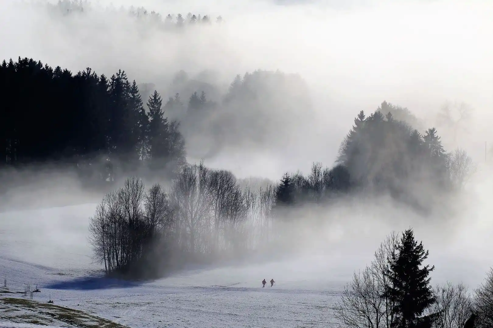

冻原上的老人常说一句古话，乌萨斯的冬天“能把天上的水和人心变成石头”。旷野上的风如刀，劲风缠裹着雪片掠过大地，在这天地之间，有个男人孤独地跋涉。

他叫什么？不知道。在雪原中前行，不必有个名字。他从哪来，向哪去？不知道。故乡已经遥远，终点依旧未知，也许他要走一辈子。

他是什么人？他是个躲春天的人。

<!-- more -->

 {.centering}

---

当最后一个村庄也不愿意再和游击队交易，塔露拉知道他们必须向北走了。于是这支疲惫而伤痕累累的队伍，拖着生满冻疮的脚，在乌萨斯的冬天里向冻原更深处走去。魁梧的温迪戈在最前方清理出道路，他的披风与甲胄在无际银白中撕开一抹鲜红。士兵们虔诚地注视他，一半是出于尊敬，一半是为了防止雪盲。

他们遇见那个萨卡兹是在第六天，安德烈倒下的时候。他本来就是队伍里最小的孩子，稚嫩的身体却要承受和战士同等强度的行军，只发起高烧已经算是万幸。当时他小脸烧得通红，不住咳嗽着，喉咙呼哧呼哧地一起一伏。塔露拉端着一碗草药熬的汤，正准备喂给他。

“你们想害死他吗？”她听见背后粗鲁而率直的声音，然后是一只大手啪一下打翻了汤碗。“这么明显的痰鸣音，还敢喂流食？生怕没法呛死他是不是？”

这个萨卡兹就这么凭空出现在营地的火堆旁边，就像个幽灵般绕过了所有哨兵。他怒气冲天地把安德烈抢过来，侧耳贴在他胸口细听心跳声。

“还好，这小子的心脏还跳得挺有劲儿……喉咙是个问题，气管切开吗？不行，至少这鬼地方没有条件。”他用毫不顾及他人的大嗓门自言自语，每个人都听得一清二楚。他转向塔露拉，用一副理所当然的，习惯了使唤人的腔调冲她呼喝：

“你，去弄根细管子来！”

他不容置疑的语气和将军般的神情让人不敢有半点怨言。管子飞快地拿来了，他俯下身跪在雪地上，让安德烈半躺在他的臂弯里，一只手掰开他紧闭的牙关，把管子送进去。他的手臂上肌肉虬结，动作却像护理一个婴儿那样轻柔而准确。他叼住管子的另一端，因为胸腹发力，脸涨得通红。

“安德烈是个感染者呀！他难道不怕……”有人低声说，但下一秒他就闭嘴了，因为男人那锐利如刀的眼神恶狠狠地向他射过来，就好像在说“关你什么事”。

终于，他响亮地啐一口唾沫，把含着血丝和源石碎屑的痰吐在雪地上。拔出管子的安德烈响亮地咳嗽着，但呼吸顺畅多了，脸也不再通红。

“您救了我们同志的性命，整合运动感谢您。”塔露拉向他伸出手来。

他没有回握。

“明天，我要向北六十三里，有病人或者伤员的话，到那里去找我。”

整合运动和一名萨卡兹医生，就这样维系着一种奇妙的关系——每天的早晨当游击队吹响起床号，他早已消失无踪，而经历了一天的跋涉，即使是身经百战的盾卫都筋疲力尽时，总会发现医生的篝火闪烁在他们眼前，距离昨天的扎营地正好六十三里的地方。他就像高挂天际的北极星，尽管平常不会去看，但一抬头，他总是在那里。

“你是什么人？”叶莲娜问。白兔子坐在火堆对面，百无聊赖地用小木棍拨动火苗。火焰摇曳着躲避她的触碰，火光下她的面容也因此忽隐忽现。

“曾经是个医生，现在只是个躲春天的人。”

“躲春天？”她不自觉地微微张开嘴，拨动火苗的动作停止了。

“我每天要走一百二十七里。”他说，就好像这是“我每天吃三顿饭”这样微不足道的小事似的。“我计算过，这样刚好花一年时间走一圈。这样走下去，我就能确保自己待在永恒的冬季。穿越圣骏堡时他们不太欢迎我，所以我加快了些速度，现在该走慢点。”

“一直向北？”

“一直向北。”

“我听父亲说，冻原的极北方有邪魔，连整支集团军都不敢与他们正面对抗……”

“那又怎么样？”他问，好像丝毫不觉得邪魔是什么值得注意的麻烦似的。“我穿过去。”

“萨尔贡的焚风热土——”

“我穿过去。”

“伊比利亚一望无际的海——”

“只要一只舢板，一个鱼钩和一把小刀，我还是渡过去。”直到这时霜星才意识到他的手腕，脖颈和脸上一层叠一层满是伤疤，哪怕游击队里年纪最大，见识最多的战士，伤疤也不会比这更多。

“可是，为什么？”她没说出口，但疑惑的眼神毫无疑问表达着这意思。

“你们才不会懂。”他把拨火棍狠狠戳进火里，转身进了行军帐篷。那里现在是他的“领土”，伤兵和病人甘心受这个粗野却善良的君王摆布，他老是粗声大气，哪怕只是交代个包扎和缝合听着也像是吵架。但只有他才能在十分钟内拔出插进大腿的弩箭还不让伤口感染，被战争术士烧焦的伤口，他看一眼就知道该敷什么样的草药。

他凭本事赢得了整合运动的尊重，但他这一段悠哉的旅程终有尽头，之前飞一般掠过圣骏堡积攒的里程用完了，为了继续他永无休止的巡礼，必须回到每天一百二十七里的速度，把游击队抛在身后。但他的脚步还是停下了，尽管并非自愿。

在他和游击队分道扬镳的第一天下午，集团军对游击队展开了围剿，盾卫和百战先锋互相厮杀，雪怪和战争术士的法术一同湮灭。即使是他也能感到脚下大地的震颤。要回去吗？回去拯救生命？可他不是已经发下誓愿，一生作追逐冬天的永恒巡礼吗？

“这干我什么事！”他大声说，也不知是说给谁，抑或是说给他自己。“不过是有几个人死掉而已，在冻原上这是常有的。相比之下，还是赶紧去追冬将军要来得更要紧些，前几天实在拖延得过分了。”

他打定主意，迈步要走。可一根埋在雪里的树枝绊住他的脚，把他拽得踉跄扑倒在雪地里，那根绊住他的树枝正落在他脸旁边。

“你不许我走，是不是？”他向那树枝发问。“你是不是要说，像他们这样的人，就这么像狗一样在雪地里把血流光实在可惜？哎——我又怎么不知道呢！”

这是世界上最奇特的单人剧，由同一个人——一个在良心，誓言和骄傲的漩涡中挣扎着不被撕碎生存意义的人，同时扮演正方和反方。同一颗良心，要遵守誓言就必须见死不救，要挽救生命，非得背信弃义不可——尽管那誓约是自己与自己立的，可毕竟还是誓约。

不知道什么时候，他行走的轨迹不再是一条坚定的直线，成了个狂乱的脚印漩涡，这个悲哀而骄傲的人在这漩涡里被撕扯着，不得不同时叩问“良心”和“誓言”两边何以成立的理由。

“你说你要去拯救生命，你可曾挽救这冻原上所有的生命？多少次你在村庄歇息，补充了干粮就不见踪影，你听过那村民无望的哀号吗？若你真决心保护所有生命，为何要永远巡礼？既然已经注定对每一片土地都蜻蜓点水，又谈何拯救生命这庄严的职责？”

而同一个人反唇相讥：

“你立下誓言的理由究竟为何？不是你自己亲口说：当一个男人明明有力量，却不用来保卫自己的祖国，他就再没有踏进春天的资格？现在，另一个祖国——不是萨卡兹的祖国，而是被压迫者的祖国在你面前陷于毁灭的边缘，你明明有力量，却不去保卫它？”

林间的雪地上，那狂乱的脚印漩涡越来越深，越来越深。

终于，男人站在脚印漩涡的中心。地上再也找不到没被踩过的雪，心中再也找不到没被质疑过的观点，他的眼里终于不带半点迷惘。

“就这样办吧！”他对自己说。

然后他跨出脚印的漩涡，就像跨出了自己为自己画的囚笼，向他应该去的地方迈开大步走去，来时的脚印已被抹平，雪地上只留下标志着他挣扎的脚印漩涡，和从漩涡中延伸出的一行崭新的足迹。<eod />

<FakeAds />