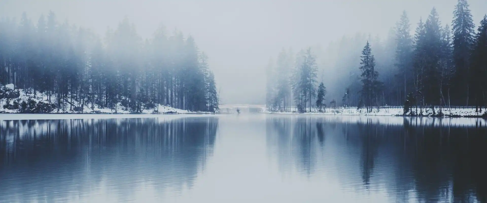

她走进一片森林。阳光洒下，很暖和，不似她一直呆的地方——她一直呆在哪儿？

<!-- more -->

 {.centering}

她摇摇头，有些晕。这里美好而温暖，好像所有的生命都在迎接诞生以来的第一个春天。这里土地肥沃，她的脚微微陷进大地。在她模糊朦胧的印象中，见到这样好的一片地是难事。有这样的土地，他们就能种上一季红麦，养活一个聚落的人……原本几乎只存在于幻想中的景象来到了她的眼前，心中升起的喜悦让她下意识想喊来同伴。

可她“喂——”了一声后却停住了。她该接上谁的名字？她环顾四周，无人同行。她醒悟过来自己的幻想仍是幻想。她似乎经历过这样的事，她曾有一个目标——或者用诗意的说法，一个梦——她曾有一群同伴，然而最终她的身边空无一人。是他们抛下了她，抑或她抛下了他们？

但既然自己经历过，那重复一遍也没什么可怕的。森林在她的眼中更加清晰了，她甚至感觉自己的脚下就有一条指引向前的小径。她总是这样，一旦找到了该走的路就会毫不犹豫地踏上去。

这片森林如此完美，就像应许之地，绿色的屏障天然杜绝了悲剧。

---

她走走停停，饿了便吃灌木丛中的野果，渴了就饮溪水。黄昏时她点起篝火，看到火苗从指尖冒出后她才意识到自己能生出火焰。小小的火苗透明且飘摇，她将火小心地种在树枝上，那一团火焰便明亮起来，发出蓬松的热气。她靠着一块石头坐下，在心里感谢火焰又感谢那些燃烧的树枝。困意爬上她的肩头。

---

在森林中的第一夜，她做了一个梦。她看见一片草原，及膝的绿草被风吹着轻轻晃动，把自己的双腿蹭得有些痒。

这里没有树木枝叶的遮挡，阳光比森林中更盛。

春日，自己不曾见到的春日。她在梦中如是感慨。但是这样的春日阳光中却只有她一人。这样的草原中应当有那些小鹿和小兔子，还有开心奔跑的孩子。

他们最后都去了哪？

她的欢欣随机被悲伤取代。她不愿再看这片空旷无人的原野了。

---

醒来时篝火已经熄了。她察觉自己的眼角湿湿润润，触感却不像泪水。她低头，发现一只灰色的小鹿在舔自己的脸。小鹿见她醒了，便用鼻子碰碰她的脸颊，发出几声欢快的鸣叫。小鹿的鼻头同样湿湿润润。她想，或许是这小鹿在身边陪了一夜，自己在梦中才那么暖和。于是，她起身后摸摸小鹿的头。她问：“要同我一起来吗？”小鹿走到了她的身侧。

在森林的第二日，她收获了第一个旅伴。她们一同采灌木丛中的野果，饮溪流中的清水。

---

其后的第三日和第四日，她遇到了一只白兔和长角的巨人，还有一只小鸟以及他的蛇朋友。

白兔推给她一颗浆果，她便接受了这样的好意。红色的浆果却是辣味的，她被呛得咳嗽起来。这片森林里的兔子还会捉弄人。她笑着擦掉了眼角的泪水。

白兔开心地跃起又落下，沿着小鹿的角攀上她的肩膀。毛团子蹭得她的脸有些痒，她忍不住打了个喷嚏。白兔就在她肩上跺了一脚，又跳回了和她一起来的长角巨人的手上。她有些抱歉地看向白兔，小鹿蹭蹭她的手臂。

巨人是她的旅伴中唯一会言语的，但他大多时候沉默寡言。他的声音听上去像是石头在摩擦，是什么人用石头造了他的嗓子吗？“你，保护好，他们。”巨人指指她身边的小动物旅伴，又指指自己，“我来，保护，你们。”

她听着石头巨人的声音，突然有些悲伤。她走过去抱住他：“在这片森林里，我们不需要从危险下保护什么。”

小鸟是她的旅伴中最吵闹的那个，每天在清晨鸣唱他的新乐曲，然后吵醒他的蛇朋友。小鸟最喜欢停在她的头顶上，或小鹿的背上。小鸟的蛇朋友盘在小鹿的角抬着头，有些担心地看着小鸟。她揉揉小鸟再摸摸小蛇，说：“他呆在我头上，或者小鹿的背上，都挺好。”小蛇才安心地伏下身。

小鸟的蛇朋友是条温柔的蛇，总是关心小鸟。夜里他只会盘在小鸟的身边睡觉。“他们总是分也分不开。”她看着蛇和小鸟，笑着对小鹿说。小鹿低低地叫起来。

“真好。”她靠在小鹿身上，“我也觉得真好。”

她与她的旅伴们继续行了一千个日夜，他们一同采灌木丛中的野果，饮溪流中的清水。这里的灌木不曾枯萎，溪流不曾结冰。只是她还会做那孤独的梦。一千个夜过去了，她梦中的草原经历了两次秋天与三次春天，那些柔软的草从绿色变成黄色，再枯萎，再发出绿色的新芽，但草原上依旧只她一人。从梦中醒来，她总是悲伤。她睁开眼睛，看见白兔柔软的绒毛，看见石巨人黑色的双角，看见她肩上的小鸟，看见小鸟青色的蛇朋友。她大口喘气，最后看见小鹿清澈透亮的双眼。她的旅伴们担忧地看着她。痛苦突然攫住了她的心脏。在每个做了梦的清晨，她看着她的旅伴，总是觉得虚幻。她想，原野中应当有她的旅伴们。

---

在第一千零二日，他们行到了森林的尽头。森林并非无穷无尽，若他们执意行走，那么森林就会呈现自己的终点。在他们脚下小径的尽头，深绿色的墙破开一个洞口，寒风从那破洞处灌入。

一条黑色的蛇盘在洞口。黑蛇长舌又尖牙，口含毒液。黑蛇蛊惑她：“你要继续向前吗？你要离开这座森林吗？这里温暖又安全，你在这里有食物也有同伴，你真的要离开吗？”

她看着自己脚下的路——她自己决定好的路——这条路通向森林外的冰雪之中。她要继续向前吗？她看向自己的旅伴们。

“去吧。”白兔开口，那是少女的声音。

“你得，去看看，一切。你得，知道。你，活着。”石巨人开口，那是一位老战士的声音。

“你要代我们找到一片春天里的草原，我们在里面种上红麦，和更多人一起生活。你答应过的。”小鸟和小蛇开口，那是两个男孩的声音。

“去吧，带着我们一起去吧。”最后，小鹿开口，那是温柔如同春日一般的声音。

---

她挺起胸：“是的，我要离开。”

黑蛇狞笑着：“瞧瞧这里，你和你的旅伴朋友们一辈子都没有见过这样的春天呢。”

她向前一步：“这并非春天！”

她点燃自己的火，火光比在过去一千个夜晚中燃烧时还要明亮：“我在梦中见过春天的原野。在春季过后是炎热的夏季。之后树木和草变成黄色，那是秋季。最后，那些生命在冬季枯萎蛰伏。它们再发芽，那才是一个春天！”

她拔出自己的长剑：“我们在森林中行了一千零二日。这里的树木从未发出新叶，这里的花草从不枯萎。这里只是幻象，而你身后的雪原，只有那里才可能有春天！”

她挥剑砍向黑蛇：“我要同我的旅伴们去寻一处春天的原野。”

---

她踏出森林，踏进冻原。风裹挟着雪，逼她闭上双眼。她听闻耳边有人呼喊。

她睁开眼，有人正吼道：“站起来，塔露拉！”

她取回了自己的名字。她长久以来第一次呼吸。

她站在严冬中，她正要带自己的同伴往春天去。<eod />

<Ads />