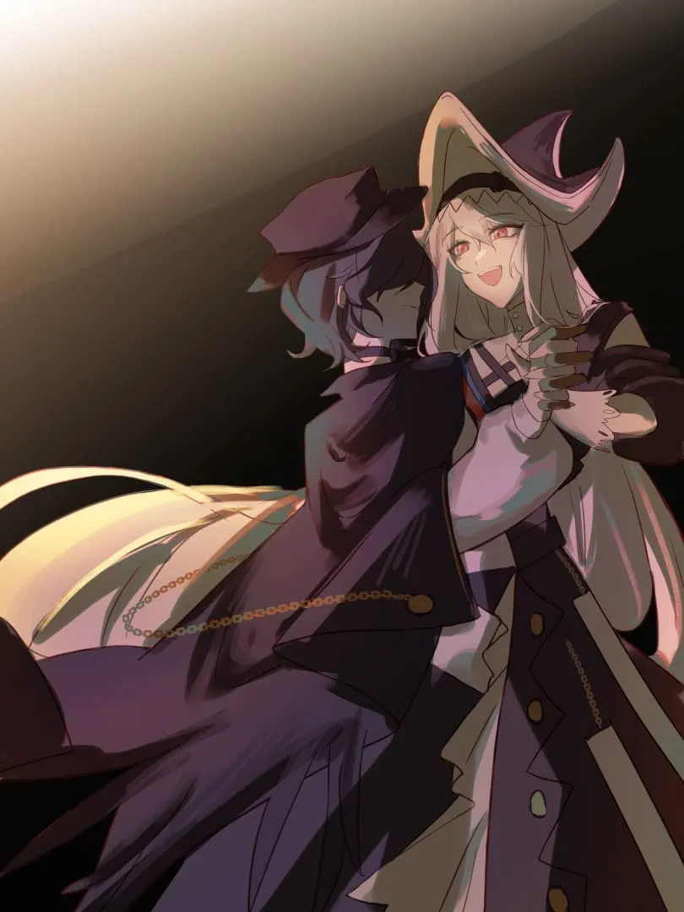
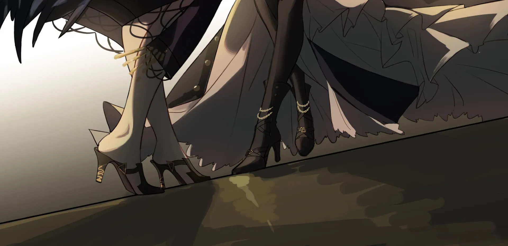

“……注意脚步。”

那双裹着溟痕的双腿稍作调整，黎博利微微后退，为舞伴让出落足之地。劳伦缇娜仍单手握持圆锯，就像是一位旧伊比利亚的持剑贵族。优雅的旋转，黄金的圆厅，背离的人。

<!-- more -->

{width="60%"} {.centering}

“谢谢。”

阿玛雅的语气依旧典雅端庄，波澜不惊。墙上金黄的挂饰流转出缓慢的彗星，倒映入劳伦缇娜的眼。螺旋周转的舞蹈步伐随时会停下，只需一句话不投机——一种旋转的停止意味着另一旋转的伊始，她将用这份旋转夺定阿玛雅命理的归宿。

“不过劳伦缇娜，为什么会是舞蹈呢？”

是啊，为什么会是舞蹈呢？劳伦缇娜并不知道。

劳伦缇娜并不擅长舞蹈，哪怕歌蕾蒂娅曾经手把手的教她。剑鱼的舞步敏捷而精巧，迁越舞厅宛如穿梭在战争，优雅且致命。劳伦缇娜做不到跳的像队长一样好，但她只是想跳，想要和眼前的敌人一起起舞。或许是因为在今天之后，她就再也没有像以前一样旋转着坠落的机会了。沉眠容易让人堕落，而清醒总是难得的。

“我不知道。”她诚实的说，语气中带上以往的俏皮。“或许在得知我流着海嗣的血时，我应该像个被夺走糖果的小女孩一样痛哭流涕？阿玛雅，我难得清醒，可不能把时间浪费在这种事情上。专心跳舞吧。”

阿玛雅抬起两人掌心相应的那只手，配合着对方摇曳躯体的重心：“你没有动摇吗？如此清晰地认识到自己的力量，理智和灵魂都来自于你的敌人，为何你还能够保持冷静呢？”

“我从不认为我和他们将归于一群——你觉得我会动摇？”

黎博利主动前踏一步：“为什么不呢，劳伦缇娜？”

“阿玛雅，血脉相连并非血浓于水。”

“你的血抗拒融入海洋，只是因为你还没有认识它。我想，你还没有听到歌声吧？愿意由我为你牵引一下吗？”阿玛雅翻转手腕，紧握住阿戈尔人的手。溟痕的微微荧光垂悬在名为眼表的湖面，劳伦缇娜目不转睛。

“说说看吧。”

“在优雅的舞蹈场合，应该说洗耳恭听。”阿玛雅嘴角挂起一丝笑意，片刻又消散不见。她抬起两人的交接手，无声无息的躲过舞蹈的主动权。阿戈尔的裙摆和黎博利的衣袖化为旋涡的边角，满怀恶意的理性暗流伴随舞步缓缓流动。

“你觉得，你和我们的区别是什么呢？”

“我是一位猎人，而你们是一群猎物。”

“错了，劳伦缇娜，我们都是一团——你是一团会思考的肉块，我们是一团有生命的秩序。”

“我们思维方式不同。”

“又错了，劳伦缇娜，我们服从相同的逻辑——同一律，充足理由律，矛盾律，求生律。”

“我们本无法交流。”

“劳伦缇娜，交流并不重要——当你拥抱大群，我们的信号就能成为你的语言，就像大群与我。语言只是手段，信息才是目的。”

黎博利的舞步逼急，阿戈尔并未退让。两人的脚下，无形的潮汐和泛亮的恶苔悄然接触互搏。一方交织交汇，一方至死方休。

劳伦缇娜前迎，带动对方又周转了一个半圈。她的小裙子飘洒微晃，高挑而张扬：“若如你所说，我的个人的命运便毫无意义——这不对吧？你的恐鱼宝贝们，恐怕连什么是幸福都不知道。”

“对海嗣来说，幸福和痛苦本就无关紧要。哪怕是在过去，我的同胞们被你锯开的时刻，他们也不会产生这种无用的情绪。”

劳伦缇娜又转回了面朝大门的方向。她扬起嘴角，嘲笑的看着舞伴：“我可没有动手，它们只是自己用脸把锯子吸过去啦。”

进攻完成的阿玛雅主动让出了重心，迎合舞伴，似乎完全放任对方的侵略：“这就是我们和你们的区别啊——一切苦难着落命运，而一切命运被个体的形体包容。执着于意义的个体，就会落入无尽的无意义的虚无，而幸福正是意义的产物。”

她依旧步步退让，任由对方带动自己轻巧的身躯旋转。锋利的言语隐藏在顺从的幕布下，露出尖尖一角：“难道你的命运不是吗？我亲爱的睡美人，你幸福吗？”

黄金大厅反射的光芒衬出劳伦缇娜蓝色的缎带，缎带又伴随着长发绕生成圈。少女看着面前的邪教徒，金黄的光芒反而让她的脖颈略显苍白。劳伦缇娜对于舞蹈其实并非完全生疏——在意识不清醒的梦中，她曾独自舞蹈。

幽灵鲨站在山顶，头顶便是星空。星空是不会转动的，于是她翩翩起舞。

寒风驰骋而过，冷若切肤之寒霜。天空清静如水，透明如皎洁之镜。

她看到了玛瑙制成的山脉、流动着水晶的川海、银织细制的森林、金雕细凿的都市。

遮天蔽日的云层席卷而起，在她面前凝成雾气之柱所撑起的天空。

但是，仅仅就是这样而已吗？

“命运……我是该感谢你们，毕竟，你们让我体验到了一段不一样的生活。知道吗？因为你们崇拜的那些海沟杂碎，多少阿戈尔人被迫改变了他们原本注定的人生轨迹。”

阿玛雅转到了背光侧，苍白化为淡淡的灰：“啊，你原本会成为什么呢？歌剧演员？剧作家？”

幽灵鲨看到了星星，而每一颗坠落的流星都是他人的梦。

她看到有其立于众人之上，却有人视其于无物；

看到鱼本是游于水中，却有人舞于其之身；

看到有其与大地兮比寿，虽不胜兮亦不俗；

看到其与日月兮争辉，亦无苍无穹无所依。

“不，怎么会呢，当然不是。我想当个雕塑家，就连老师都说我很有天赋。唉，那时候的我可不会想象到自己挥舞圆锯的样子，更不会知道在未来的某一天，我的脊髓里会流淌这些东西。”

星空伴随他人的梦消散，山巅和云柱随之不见。幽灵鲨茫然环顾，天空化为水面，她在水底看到了岸上自己的幻影。

她的人生，她的命运落下，那个名为劳伦缇娜的女孩隔着水镜之面，站在幽灵鲨面前。

初生时裹于金之襁褓，青年时身着青白外套;

老后是一瞬荣华红火，终死将披带黑银寿衣。

又是一个旋身，鲨鱼的眼里就仿佛藏着星星：“我可爱的命运啊，给我敲定了这样的一条路。”

她看到了自己原本的人生轨迹。 {.textkai}

圆锯不满的微微刮擦地面，发出噪耳的嘶鸣。他已经绕着两人环绕了一圈又一圈，活像转盘上急而不定的指针。劳伦缇娜手腕悄然提起，安抚她的伙伴：此刻大厅之外的厮杀与她们无关，落定之时未到，舞蹈还在继续。

“雕塑家……真难想象啊。”

“你为什么会觉得，我会成为歌剧演员或是剧作家？”

阿玛雅一笑：“我只是觉得，你的名字很美。这样美丽的名字应当属于一位作家或演员。”

“美？”

“你知道这个名字在古早的维多利亚语中的意思吗？劳伦缇娜，一轮安静的，独立的，短暂的明月的倒影。”

阿玛雅扬起她那双看似阴郁的头颅，做出解释。阿戈尔少女回身，两人又转悠回到大厅的中心。“我不觉得这有什么美的，阿戈尔不关注月亮，更不会学习古维多利亚语。”

“是啊，你看——阿戈尔为何会关注一门不相干语言的意义呢？所以我在接触各种语言的翻译生涯中认识到，言语从未赋予信息，社会却在给予语言意义。”

“哦？”劳伦缇娜偏过头，好看的长发发散于大船干燥的空气。阿玛雅微笑着回应少女的疑惑，舞步愈发轻快。

言语，语言，没人比她更了解这个词汇的本质——联系，社会的联系。语言就是人类群体的缩影。

她见过褪色而干裂的大地、枯萎的树木，用泥土堆砌而成的屋舍。一群手持原始武器的男人袭击了村落，赤裸的战士们把求饶之人殴打至死，年轻人发出咆哮，拽着婴儿的脚踝，就使劲往地面砸去。

人类被轻易生下，又轻易死去。就像被鸟禽所食，又不断涌现的渺虫。她厌倦了世界的残酷，人类的残暴堕落，和人性的冠冕堂皇。

“你知道这种语言意义的赋予本质是什么吗？是人的需求。在言语中赋予迫切的妄念，用包含的信息驱策人类，产生事实上和妄念配套的性能——这是社会运作的需求和捷径，无论行政，行销，还是行军。”

“劳伦缇娜，对于陆上人，语言和社会个体的关系千丝万缕。乌萨斯有乌萨斯语，炎国有炎国语，伊比利亚有伊比利亚语——脱离了语言作为‘集体思想’的工具之作用，其便毫无意义。你并非维多利亚人，无法利用维多利亚语的集体思想，自然也无法感受到你名字的美丽。”

劳伦缇娜叹了口气：“所以？”

“海嗣不需要这种美丽，也不需要这种意义——我们将跳过语言，将信息直接上升成为集体工具。”

两人旋转越来越慢，如同逆风而舞。地上的溟痕微微摇曳，海风裹挟来一轮又一轮的信息。阿玛雅从未如此沉溺于自己的过去——她其实总是在逃避，闪躲着无数名为“无能”和“无力”的利箭。口舌之花绽放，她仿佛回到了很多年前，她刚刚与大群建立联系而昏倒的那一刻，她人生中最有意义的那一刻。

在意识的混沌中，她以头下脚上的糟糕姿势加速下坠。

陆地的干燥风阻猛扯她的脸皮，迫使她睁开眼睛。

她在下落，上方便是倒悬着的陆地和山林，随着下坠加剧愈发模糊；正下方却是深邃之海，格外清晰，那黑白相间的水体正不断放大。

“你在强调幸福的意义的时候，可曾关注过这片大地上，那些遭受苦难者的幸福？他们居无定所，孤苦伶仃，他们生于黑夜，溺于阴影。在他们期待着幸福垂青的时候，种群却未曾关心呵护这些个体过——千年以来，陆上国家只会站在名为国境线的沟壑之后，拿着木棒和石头畏首畏尾的虚张声势。他们拿的木棒叫做语言，石头叫做种族。”

阿玛雅的鼻尖接触水面，冲击削过颚骨，勒紧腰腹。海水刺击鼻腔，酸楚感眼神伴随水流攀爬到眼球后方。

气泡的声音，气泡的触感，气泡腾起的乳白云雾。气泡畏惧深渊，在黑白两色的空间中逃窜上浮，而阿玛雅的思维与逃亡者背道而驰，向着海底的方向深入，深入，再深入。

在她身后，跃出水面的气泡成片成片的破裂，惨叫连篇，不一会儿就再也没有了声音。

世界只剩下了阿玛雅和安静的深渊。

她脸颊侧过，疯狂的教徒倾诉理智无比的思绪：“当我意识到语言和种族之间的隔阂在撕毁这片大地时，我迷茫了。‘生命是无序的吗？’我问自己，若是有序，为什么总是有最小个体无法得到幸福呢？这个问题折磨了我很多年，直到我见证了海嗣：种族没有意义，我们皆是大群；语言没有意义，信息创就理智。”

海水的稠度与温度上升。液体凝成胶体，随即演变成为带鳞的黏膜和溟痕，散发起萤火之光，牵引着胚胎化的阿玛雅在冗长的产道内洄游。

水墨形制的波形爬入阿玛雅的身躯百窍，从内侧舔舐她的身体，不痛不痒，无念无想。

在堕落无感官的白噪中，“它们”发出了声音——

“‘生命从来不是无序的’，我的使者。这才是我离开陆地，向海洋寻求的最后答案。”

阿玛雅寻得了此生的意义。{.textkai}

舞步变得沉重起来，劳伦缇娜没有回话。沉默成为舞会的装饰条带，两位舞者悄然踱步，等待落定之刻。

在一个交错舞步之后，劳伦缇娜开口：“阿玛雅，当你寻求生命秩序的答案时，你有相信过群体的规则吗？”

“规则，规则。规则不代表秩序。”阿玛雅咀嚼着这个词，沉寂片刻：“例如，法律。陆地的法律太过于软弱，比起“秩序”更像是“建议”；同时又太过空洞，无法关系到其难以覆盖的悲惨之人。”

“我曾反复定义又反复揣度规则，思考它究竟是什么。规则，无非是一种标准的象限，行为的规范。比如，陆地人会推崇牺牲和奉献，因为他们超出了规则。牺牲和奉献在规则外，其不过是一种歌颂稀少事物，粉饰利他性，区别自身和野兽的可笑自我谄媚。”

“大群没有这种规则，大群只有秩序，只有合理。为了种群的合理性，奉献就会成为一种必要的流程——这是一种去神圣化，大群终归于一。”

缓慢的圆舞带起了风，圆锯锯齿抚过地板溟痕。劳伦缇娜闭上眼，黄金的反光托起她的衣：“你说的这些，让我想起了我曾在陆上听过的一个故事。真是稀奇啊，哪怕那时的我浑噩不堪，沉溺在理智边缘的星空梦海之中，那个故事也被我一直记着。”

“洗耳恭听。”

鲨鱼总是飘忽而捉摸不透，少女很少用一种十分严肃的语气说话：“曾经在米诺斯附近，有一个硕大的帝国。这个老人居住在帝国的边陲，孤僻，死板，无妻无子。但他是大学者，和你一样身为黎博利的他奠定了那个帝国的法律基础，他的法让帝国统治万民，扩大版图。他将传统习俗和法律融合，创造了适用于帝国所有人的万名之法。”

“他的死亡是从某时某刻就注定的。那时候，贵族们在商讨改变法律的事情。他提着一只鸡冲进议会大厅，用几乎滑稽的姿态对所有人高举那只鸡，并喊道‘鸡不能变成其他东西，法律也是！’贵族们在，贵族所围绕的君王也在，所有人都在。那位君王曾经也在他的门下学习过法律。”

“但是他还是被吊死了，身体挂在广场上，在太阳下曝晒。贵族们洋洋得意，君王冷眼相视，不知情的平民议论纷纷。他的死什么都没能改变。”

“听上去你仿佛认同了我们。”阿玛雅上前，两人的舞姿间距骤然缩短。她感受着阿戈尔的呼吸，感受着那他们曾经的杰作，难得的奇迹。“这就是法律的脆弱，这就是命运的不可捉摸。”

“那么追寻到秩序的你，幸福吗？”

“你又错了。对于许多人来说幸福虚无缥缈，不知何时落定，落在何处，正应如此，我才怀疑并试图寻求秩序。但是如今面对秩序，所谓幸福和所谓奉献牺牲一样，不过是一种个性追求和反馈的表现。”阿玛雅抚摸劳伦缇娜的脸颊：“我眼中的‘爱’与‘家族’，‘共情’和‘种群’，恐怕就是你眼中的疯狂吧？”

“你的疯狂里，我可看不到一星半点的爱和共情。”缓慢的舞步骤然加快，劳伦缇娜任由对方的手放在她的脸颊上。“你不是放弃幸福，而是抛弃了个性。”

“这有什么区别吗？”

舞步愈快，慢风随急。一瞬间，劳伦缇娜突兀产生了错觉——就像是阿玛雅和她未曾舞蹈，而黄金的大堂旋转由缓转急。

然后，她听到了歌声。从前被理性所遮断，没能听到的歌声，如今却清晰地从大洋深出的方向传来。那充满调和的音节，不断地咏颂着过去、未来所发生的一切事情，一切可能。

这是以潮汐本身为乐器，跨越了神秘音律而成型的永恒之伽蓝。在那音乐之中，一切皆为正确、皆为至福。只有具备资格者，才能听到这音乐，并参与其中。

它们在低语，在邀请劳伦缇娜也加入合唱中，伴随着音律永远的随波逐流下去。跳舞吧，跳舞吧，跳下去，在接触到这份至福后，地上的纷争已经变得毫无意义。自我溶解，化为音节，在永恒的调和之中成为久远。

---

且听这悠远之调吧……

静卧于文明的游子，起身低吟回归之歌。

且听这悠远之调吧……

迷途河岸的幼仔啊，这是海洋迎汝回归之声。

此岸并非汝之故乡，汝之命理已经注定。

合众为一……

汝须亲临奈落之底，命运轮盘已然落定

合众为一……

---

{width="80%"} {.centering}

阿玛雅曾经顺从，而劳伦缇娜拒绝了。

她复述起片刻前对方的话语：“一切苦难着落命运，而一切命运被形体包容。执着于意义的形体，就会落入无尽的无意义的虚无，而幸福正是意义的产物。这是你说的，还记得吗？”

黎博利一愣：“是这样的。怎么……”

“那个故事中的老人，如今已经成为了谈论大陆法律历史绕不开的开拓者——规则的脆弱只是一时，文明的肯定成为了命运的最大后盾。

阿玛雅刚想辩驳，劳伦缇娜却松开了联系两人舞蹈的手。她将一根手指放在阿玛雅的嘴唇前，轻轻地说：“话还没说完，阿玛雅。你知道我为什么喜欢雕塑吗？”

“嗯？”

“因为在雕刻的过程中——”

舞蹈毫无征兆的结束，旋转停止了。锯盘兴奋的低吼，压抑即将爆发。劳伦缇娜的另一只手已经挥舞起了武器，那一刻她脸上的表情，灿烂如孩童：

“我们在死物的形体之中构建意义，将它从无意义的虚无中解放出来。这就是我们之间最大的不同啊，阿玛雅，我从不认为不能掌控的命运是无意义的。如果它没有形体，就让我赋予它形体吧！不知方向的螺旋之舞已经结束，即使我曾经的命运给我指向了一条未曾设想的道路，我也会雕刻出属于我自己的幸福。”

此刻，命运之轮的指针被她掌握，一如手中的圆锯。

阿玛雅惊讶了一刹，突然意识到了什么，笑了起来。“看来你没能认同我说的话啊，真失败。”

随即，锯齿轰鸣。<eod />

<FakeAds />