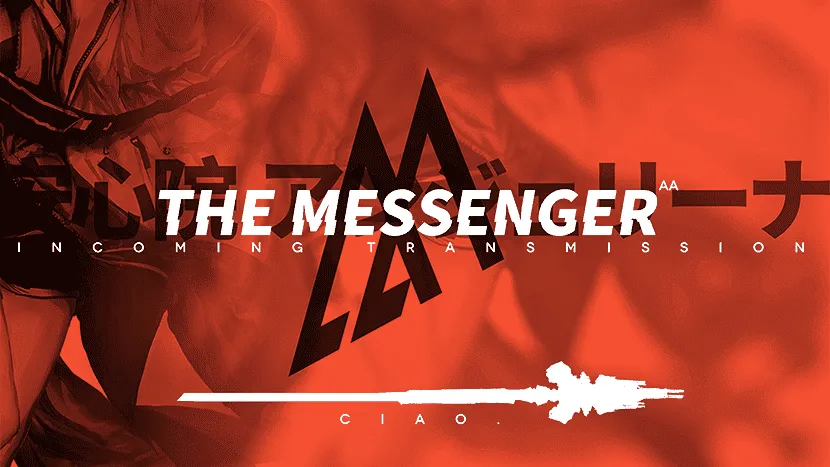

“这一次送信的目的地是东国，你的家乡。”

<!-- more -->

---

【AM 5:14/罗德岛舰桥】

少女的衣角随风飘动，她抬起手轻轻拨弄吹到眼前的发丝，小心翼翼的将其束回耳后。

“今天天气不错，风向也很好，适宜飞行。”

她从上衣口袋中举出了耳机戴上。这是很少见的动作，以往她总是迫不及待的朝我挥手，问我要不要带什么特别的东西。

“可颂干员让我叮嘱你，不要忘记涂唇膏。”我顿了顿，低头想想还有什么需要嘱托。

“博士，你有没有想过，为什么这次我会主动要求去东国送信。”少女似乎没有耐心再听下去，转身慢慢的走向舰桥的末端。她的步伐远没有之前的信心满满，小腿似乎在轻轻颤抖。和以往一样，她张开双臂，感受风的速度。

“嗯？”

她回头，或许是朝霞的缘故，脸颊微微泛红。

“博士想听作为信使的答案，还是安心院安洁莉娜呢？”

还没有来得及作答，清晨的第一束阳光刺破雾霭。被光亮晃眼的瞬间，女孩已经跃入云海——舰桥上似乎还残留着淡淡的酸橙味。

“一路小心，安洁莉娜干员。”

## 钟声 {.centering}

安洁莉娜脚尖轻点，慢慢落在钟楼上。

钟楼是这座城市的最高处，说整座城市以其为圆心建立起来也不为过。以往快要放学时的她总是不由自主的扭头望向窗外，期待着从林林总总的大厦间，传递来象征着放学的四声钟声。

不过这都是好久之前的事情了。对现在的自己来说，更熟悉的地方应该是叙古拉。她熟悉那里风的味道，每一条捷径都了若指掌。她还记得当初，罗德岛的干员也是花了好久才在某条鲜为人知的小路拦住了自己，发出了邀请函。

信已经都送完了，但还有很多时间。安洁莉娜在塔钟旁坐下，双腿在空中有节奏的晃动。

耳机里的女孩不知疲倦的为她唱着歌，夕阳挥洒把整座城市染成麦穗般的金黄，她朝前伸出手，似乎想要把高楼大厦握在手心。

刚到叙古拉的时候，安洁莉娜就对罗德岛有所耳闻：明面上的制药公司，有很多感染者雇员，会救治严重的病人……不过她从来都没有想过，其会和自己牵扯关系——她的病症没有严重到需要长期就医，对于自己信使的新身份也很满足。

只是那位罗德岛干员提出的条件太过丰厚。

“安心院安洁莉娜小姐，加入罗德岛后，您的生活可以得到保障。这里会有许多志同道合的朋友和你交流，会有更多充裕自由可供个人支配的时间。我们还会尽可能的减轻矿石病给您带来的痛苦——治疗当然不是免费的，不过入职干员也有薪水。”

安洁的手轻轻按捏落在耳边的发丝，掩饰着自己有些心动的模样，直到……

“你可以回归你这个年纪该拥有的生活。”干员看穿了安洁莉娜的少女心思，悄悄改变了称谓，亮出了手里的王牌。

听到这里，安洁莉娜几乎下意识点点头。她双手接过登记的表格，慢慢登上罗德岛的舰桥。自此，罗德岛成为自己的第二个家：这里有朋友；有藏书丰富的图书馆；有空闲悠然的时光；有安心院安洁莉娜，没有前缀，没有笼统的称呼。

“感染者”

---

安洁莉娜很快度过了新人期。罗德岛也有很多的信使，其中不少天灾信使更是大名鼎鼎。

和她最熟络的，是来自企鹅物流的可颂。她在安洁莉娜面前全无前辈的架子，或是热心的教导女孩如何成为更好的信使，或是在吃饭逛街时讲起自己的信使见闻以及企鹅物流内部的“秘辛”。当听闻企鹅物流还有一位更厉害的信使“莫斯提马”时，她表示哪天一定要和可颂一起去见识一下。

除去出勤训练，罗德岛上每周都会有专门的教员来讲习。她好像又回到了熟悉的高中生涯——带上她久违的学生手提包，把心爱的吊饰挂上拉链，在错综复杂的通道里穿梭，前往用作教室的舱室。

不出一个月，她就把罗德岛大大小小的通道都摸得一清二楚。若说第一熟悉的地方是叙拉古，那么罗德岛已经可以排到第二。至于她的出生地东国，只能排在第三了。

{width="60%"} {.centering}

想到这里，安洁莉娜自嘲的笑着摇头，她对东国实在不如叙拉古和罗德岛熟悉，刚才送信时还走错了路。

自从逃离之后，她就再也没有回来过。在叙古拉和罗德岛的时候，她也总是刻意的回避需要前往东国的安排。安洁莉娜还没有做好准备以面对自己的过往，不辞而别的父母。那本被她藏在桌肚里的本子，也没有写到最后一页。

厚重绵长的钟声忽然在安洁莉娜耳边炸响，惊得她差点摔下钟楼。她回过神，连忙轻轻拍拍自己的脸。和她一同停留在钟楼上的白鸽们也纷纷扬起翅膀，融入黄澄澄的城市中。

“来了。”她轻声说，声音被呼啸而过的风吹走。安洁莉娜在这里发呆的另一个很重要的原因，就是想听一听钟声——四点钟的，象征放学归家的钟声。

安洁莉娜摘掉耳机，按下了播放器的暂停键，闭上双眼。

这里的塔钟不同于东国随处可见的人力撞钟，其以莱塔尼亚的法术驱动，以确保大钟每次都在准点敲响，每声都是相同的频率。

这座塔楼的年岁比安洁莉娜还要大，它建造于那个黄金的时代。当时的市长亲自去迎接来自莱塔尼斯的术士们，带着他们站在城市的中央。他自豪的用高音喇叭向聚集的年轻男女们宣布，这座四面墙壁全部用金色装饰的钟塔，将是我们城市最具代表性的建筑，无论你在城市的哪个角落，抬起头都可以看到它。

如今烫金的墙壁早已被风雨侵蚀，一如那个金黄色的时代般落幕。当时剪彩仪式上雀跃的男女们如今都有了家室，他们之中也包括了自己的父母。这些人的脸上布满皱纹，总是夹着公文包匆匆走过钟楼，只有准点的时候才会抬起头，看一眼这辉煌一时的金色建筑。

铛。短暂的停顿后，第二声也敲响。

铛，铛。第三声，第四声。

齿轮复位，激活的单元也停止运转，只剩下滴滴答答微不可闻的计时声。站在塔钟旁的女孩也不见踪影，和白鸽一样被金色的晚霞吞没。

## City Pop {.centering}

东国国立高等学校，知名学府，升学率高，和国际接轨。

少年少女们三三两两的从教学楼中走出，校服上佩戴的校徽在夕阳下熠熠生辉。女孩们眼神清澈，一扫上课时的疲惫，蹦跳着走出校门，讨论着最新的绯闻，新出的歌曲和今年流行的衣服。

安洁莉娜是这么熟悉这样的生活，就算突然加入几位学龄少女之间谈话，也不会引起任何骚乱和不满。这是她的过去，是她本该拥有的青春岁月。

直到那个昏昏欲睡的午后，耷拉的手不经意间摸到了大腿上狰狞可怖的黑色结晶。

最后一批学生离开后，校园又安静下来。安洁莉娜巧妙的避开警卫，推开了教学楼的玻璃大门。随着清脆的脚步声在教学楼内回响，她顺着楼梯向上。

“东西应该已经被处理掉了吧？”想到这里，她还是不免有些失落。安洁莉娜摇了摇头，平稳着呼吸轻轻推开了教室的门。

第六排第四列，靠窗的角落，桌面干干净净，椅子也塞的严实。许久没有用过的缘故，桌面上布满灰尘。她把椅子轻轻拉出，蹲下来看向桌肚。

“喔。”安洁莉娜忍不住惊呼一声——抽屉里的书整整齐齐摆放着，收集的卡贴布偶也依旧躺在书旁。她一本一本的把书拿出来，翻开扉页——上面飘扬的字体正是自己的亲笔所写。那些夹在书里的字条也还在，最深处的日记和最爱的唱片正安静的等着主人回来。

好像她明天早晨便会踏进教室和同学道早安，从未离开这座城市般。

安洁莉娜小心翼翼的拿出唱片，就像当初她第一次将其从货架上拿下来一样。这并不是最近的流行乐曲，也不是日落即逝的专辑。这是一张连包装都透着古旧气息的唱片，封面上的摆出唱跳姿势的女人是自己父母辈曾热切追捧过的偶像。这是一个时代落幕，最后的尚存之物，这些歌的结局也应该像那个金色的时代般慢慢沉于大海。

可自己就是偏执的喜欢这类音乐，现在的耳机里也一首一首的留存着。这是一份独一无二的礼物，少女青涩的嗓音呈现只属于那个时代的金色，代表着她们和那个时代一样金色的友谊。

她已经记不清，是什么时候开始听这样风格的乐曲了。她曾在朋友们惊诧的注目下，拿起被老板放着吃灰的光碟，自己独自一人带着耳机轻轻哼唱。安洁莉娜的其他兴趣和爱好都紧跟潮流不甘落后，唯独这点一直在原地轻轻踏步。

记得有一次，对自己暗生情愫的男生在鞋柜处鼓足勇气拦住自己。他身上的校服是昨晚认真烫过的，和他的站姿一样笔挺。男生努力的深呼吸让自己保持镇定，开口问道。

“你，你喜欢听什么歌？”

在和白金聊到这里时，安洁莉娜坦率的吐了吐舌头承认，当时的回答的确有恶作剧的嫌疑，不过她还是希望能有人和自己一样喜欢听这类音乐。不过很可惜，当她报出自己喜欢的几首歌时，男孩的脸上瞬间写满了疑惑和惊讶。他不小心露出口袋的小抄上密密麻麻的写满了日落即逝的歌名和介绍，可这一切都和自己说的对不上号。

男孩微微低下头，大概是不想让自己看出他的慌乱。他还在努力，牟足了劲想还有没有什么可以创造的共同话题，不过很遗憾。

说到这里时白金眯着眼睛露出了微笑，“你将军了。”

“这就是我的爱好，不用勉强哦，如果实在不喜欢也没有关系的。”安洁莉娜关上鞋柜，轻踏两下走到男孩身边，为这段可能开始的交往画上休止符。

“其实当时如果把身边带着的唱片给他展示，我想他也不会拒绝——说不定我们就在一起了，享受甜蜜的玫瑰色校园生活。”

“然后就因为矿石病，上演不得不分离的悲剧。”白金站起身，把曲奇塞到自己嘴里。“所以这样不也挺好。我们在没有任务的午后一起喝下午茶吃曲奇，欣赏旧时代的音乐。”

想到这里，安洁莉娜的眼眸还是黯淡了几分。她早就坦率的接受了得病的事实，接受了新的职业和新的家。只是偶尔夜深人静的时候，她还会在床上辗转反侧，借着淡淡的月光看着挂在书桌旁的学生卡，怀念着她本该拥有的青春。

她的左手轻轻的抚摸着大腿，隔着布料也能感受到结晶可怖的嶙峋。即便治好了，自己也没有办法再回归这种生活了。

炎国一位文豪说过，“花有重开日，人无再少年。”

安洁莉娜轻轻摸了摸眼角。没有想象中的湿润，却还是感觉干涩。

在那个梨花带雨的午后，站在陌生的街头，训练带来的肌肉酸痛每分每秒都刺激着自己的神经。不知道该去哪里寻回丢失的信件而掩面痛哭，接过可颂递过来的手帕时，她就暗下决心，要更加的努力学习，不再因自己的弱小流泪。

走廊上传来了急促的脚步声，没有在前面的教室停顿。隐隐传来的说话声似乎是自己有印象的声音。安洁莉娜把唱片塞回桌肚中，尽量让它保持着自己拿出时的位置。她将椅子归位，随后拉开窗户。

她不愿以现在的姿态面对往日的同学，哪怕她们或许在等自己回来，等有一天自己又背着书包走进教室，一起谈论最新的化妆品。

相见不如怀念。

沃尔珀少女们拉开教室的门，其中一人匆匆跑到自己座位上，找到了自己的手机。

“太好了，果然是落在学校里了。”女孩握着自己的手机长长的舒了一口气。

“找到就好。嗯？后面的窗户，竟然没有关好就走了。”另一个女孩摇着头走到窗户前关好上锁。“晚上会有暴雨呢。“

\[PRTS 广告推荐\]

酸橙味的保湿唇膏；

旷野中的风与夜晚的城市

一样干燥。

Bye Bye 霓虹

华灯初上，夜晚的城市是属于年轻人的。

安洁莉娜尽量避开熙熙攘攘的闹市街，努力回忆着过去常走的僻静小道。虽说如今矿石病已经被证明不会通过一般接触或者空气感染，但民众仍对矿石病人退避三舍，不敢与其接触。她没有能力去改变这种观念——想必就算是罗德岛，莱茵生命这样的医疗公司也束手无策吧。

没有感染前的自己，也会畏惧缩在人群后面规避着矿石病患者。谁能想到有一天，自己也只能在见不了光的小道上踱步呢？安洁莉娜抽了抽鼻子，刚才闻到的烤肉香真是太诱人了，就是能让减肥者也产生大快朵颐冲动的烤肉店，真想再去吃一次。

她重新戴上耳机，欢快的歌声让心神又安定下来。“就快到了。”她轻声说。 眼前明亮起来，周遭也渐渐响起热闹的人声，这里的房子和闹市区只有一墙之隔。安洁莉娜抬起手，有些不放心的再数了一下。

从东边开始数一，二，三。

就是这里。

安洁莉娜看到了墙上的门牌。原本烫金的外壳剥落，露出了暗红色的铁锈。父亲的车也停在车库中，小花园中的绿植倒不像记忆中修剪的那般平整，看起来已经有些日子没有打理了，杂草沿着栏杆一直伸到了外围。

她有些讶异——妈妈最见不得花园杂乱了，她每个月除了请专人护理外，自己也会拿起剪刀修剪花草。

她轻送翻过围栏，沿着石子小路慢慢的走。透过窗户，她看到客厅亮着温暖的橙色的光，食物的香气也顺着飘出来。尽管之前已经在快餐店吃了晚饭，闻到这熟悉的香味时，肚子还是不争气的咕咕叫了起来。

安洁莉娜慢慢登上台阶站定，手悬在空中做出敲门的手势，可是迟迟没有落下。

天色越来越暗，乌云在空中聚拢，遮住月亮。客厅的灯挥洒着暖和的白光，交谈声也愈发清晰。

“今天有她的消息吗？”

“没有。”谈话声戛然而止，只剩下了汤勺碰撞碗的声音。

她自己也见过那些无助的男人女人，站在闹市区的路口向来来往往的路人递黑白的寻人图纸，对每一个愿意接下的人微微鞠躬说谢谢。那些人的嘴唇干裂，可放在脚边的水迟迟不愿意喝一口。自己走后了，父母一定也像这般走遍城市的大街小巷，问遍了所有的老师同学，发放无数寻人启事。

该回家了，父母是自己最坚实的后盾，只要一家人在一起，再艰难的问题也可以解决。她的冲动在催促，催促她回到自己出生的土地上，回到父母身边，回到温暖中。

那带着肉香的和煦灯光，正在朝自己招手。只要自己轻轻扣门，开门迎接自己的一定是一对包含惊诧和惊喜的拥抱。

安洁莉娜恍恍惚惚的上前一步，悬在空中的手慢慢落下，隔着布料轻轻揉着大腿，感受着粗糙冰冷的源石结晶：这丑陋的东西攀附在自己的大腿上，宣告着自己再也不是普通人。

她是人见人怕的矿石病患者，拥有可怕源石技艺天赋的怪物。邻居如果知道自己傍领一个源石病患者，一定会举家搬迁。

父母会说只要一家人在一起，什么苦也不怕。可是自己不希望这样，父亲的稳定工作，母亲最喜欢的小花园，有那辆爱车和闹市区美味的烤肉，这些恐怕都会随着自己的回归而消失无影无踪。她不愿意让这属于父母的一切都变成泡影。

她想要的，期待的，是正常的生活，是和过去一样的平静。而现在无论是自己和父母，尚能维持这样的生活，她也不愿意去打破。

可是内心总是有一种冲动，想要回到温暖的灯光下。安洁莉娜拉开挎包，里面放着最后一封信，没有封口和署名。这是她自己的信，作为信使，这是第一次送出自己亲笔的信件。

这竟然是一封寄向过去的信，是不是算信使的失职呢？她摇摇头，弯下腰把信放在大门前的地毯上。

该回家了。

那位沃尔珀少女说的没有错，今夜果然有雨。安洁莉娜抬起头，夜空被灯光映照成橘红，豆大的雨点落在石子的地上叮当作响。她小跑着进入车库，按着记忆扯下父亲挂在墙上的雨披，按着原先的位置翻出栏杆，耳机里的歌声也进入了短暂的停顿。

电流的沙沙声过后，少女悦耳活力的嗓音重新在耳边响起。

“这里是空。来自企鹅物流信使，MSR 的偶像，空！安洁莉娜亲，这是可颂让我为你准备的生日礼物哦，这不仅仅是她的祝福，也是我们全企鹅物流的祝福。”

背景里还有一些嘈杂的声响，大概说着“下次生日派对要来企鹅物流总部”“请你吃苹果派”之类的喊叫。

“那最后一首歌，你最喜欢的‘秋绪’，祝你生日快乐，安心院安洁莉娜。”

熟悉的节奏响起。这首歌她听了上千遍，连谱子都可以一字不落的抄录下来。可唯独这一次，这一份，是可颂送给自己的独一无二的生日礼物，只属于她的歌，满怀朋友深深的祝福。

安洁莉娜忍不住跟着节奏加快了步伐，毫不在意溅起的水花会弄脏昨天精心擦洗的鞋子。她雀跃着踮起脚尖，头罩下棕色的头发随风飘扬，飞入霓虹漂染成的橘色夜空中。

明天还有作战训练和学习课程呢。

## 秋，还会继续 {.centering}

“欢迎回来，一切顺利吗？”

博士像是算准了她回来的时间。当安洁莉娜甩着湿漉漉的头发越上舰桥时，就看见他拿着干毛巾等在这里。

“当然哦，谢谢博士。”她接过毛巾，道了声谢就准备朝里面走。

“关于上午的问题。”博士的声音一如既往，听不出一点喜悦或者激动，甚至连罗德岛中的一些机器都比其要更有感情。“不可以两个答案都听？”

“身上被雨淋湿了，想快点洗澡，所以只能说一个喽。”

“那就等你洗好澡，明天来我的办公室值班时慢慢和我说吧。晚安，安洁莉娜。”博士没有多做停留，带着毛巾离去。

“什么嘛？”她冲着博士的背影不满的做了鬼脸，也回到自己的房间。温热的水流洗去灰尘，也洗去了一天的疲惫。安洁莉娜盘起头发，心满意足的走出浴室。她打开书桌的灯，拿出了桌肚里的日记本，却没有翻开的意思。

“该怎么回答呢？”

---

翌日

【PM.17:14分/罗德岛博士办公室】

“尝尝新咖啡机泡出的咖啡，博士。”安洁莉娜把冒着热气的咖啡递到博士面前，在他旁边坐下，“然后仔细听我的答案哦。”

## 终章/信 {.centering}

亲爱的爸爸，妈妈

展信安

我现在在罗德岛，你们应该也有所耳闻，是一家制药公司。我接受了他们的治疗，如今也成为他们中的一员。

现在我是一名信使，请放心，我也有在继续学习哦。当然，每天的工作学习之余也会和朋友一起出去玩。

现在我有一位很好的朋友，她叫可颂，是来自企鹅物流的信使。她很照顾我，我们也一直会出去玩，等下次一定带她一起来家里。

关于矿石病，请不要太担心——罗德岛的医疗技术很发达，我的病已经得到了有效的遏制。至于治疗费用，凯尔希医生说可以从薪水里扣，所以也不必担心。

妈妈，不用怪爸爸。是我自己拒绝了他开车送我的。那天走的太急，如果更小心一点，就不会蹭到那辆野外回来的车。

对不起，请原谅我的不告而别。也原谅我现在不敢面对您们，只敢写信向你们报平安。

我的人生轨迹已经被矿石病打乱，我不想我们一家的轨迹也就此陷入混乱。

请原谅女儿的自私。

我现在在罗德岛过得很好，在信封里还有几张照片，是我和朋友的。

等下次罗德岛再靠近东国时，我一定会站到你们面前，穿上最棒的信使工作服，让你们看看自己的女儿现在也是一个可以独当一面的信使。

我爱你们。

很想你们。无时无刻。

妈妈，不要忘记打理花园。

Angelina

Rhodes Island<eod />

（责任编辑：广英）

<FakeAds />