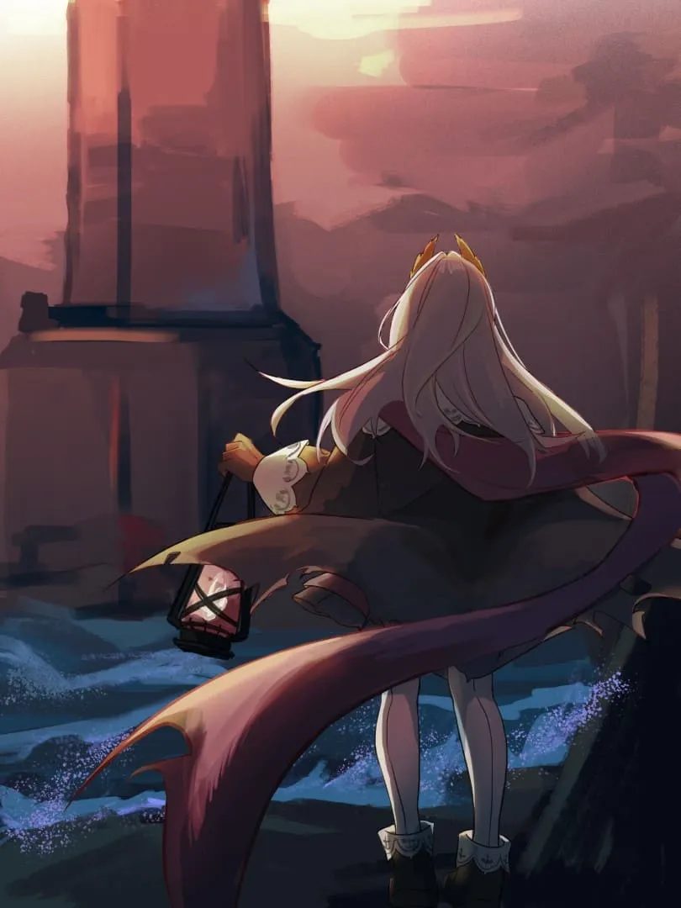

我没有多少本领，学习可能是最擅长的事

<!-- more -->

我曾被保护得很好，直到山也倒塌

一览无余的是无数路口与交汇洋流

逆水游曳 乘风扶摇

 

承认自己能力有限

接受人类复杂多变

理解你我路途有别

原谅世间情绪万千

数万次试验证明我的平凡

数万次实践证实我的不同

“人类将稀少的东西称作美德”

{width="60%"} {.centering}

生长于此 立命于此

“我因见闻许多

渡过它的苦 尝过它的乐

我望见闻更多

缝补它的伤 坚强它的魄”

提起了剑与灯 维系着塔与船

经文与律法指导我正义是什么

经验与思索指引我正义怎样做

 

顺水合流 迎风越疆

被保护者殊途同归

从今以后我们是 大地的眼睛

注视着人间苦乐

照耀着文明远航<eod />

<FakeAds />