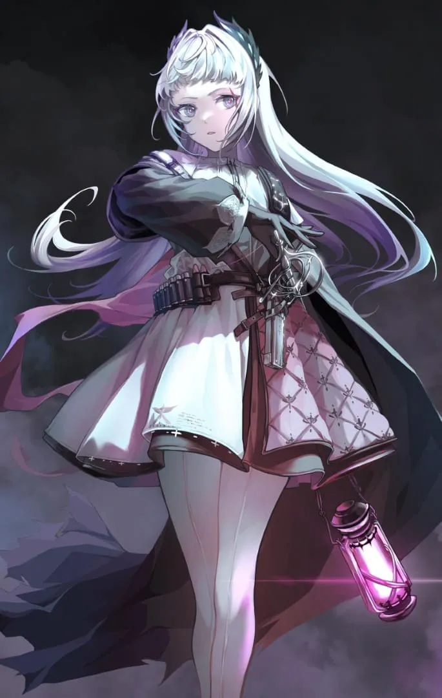
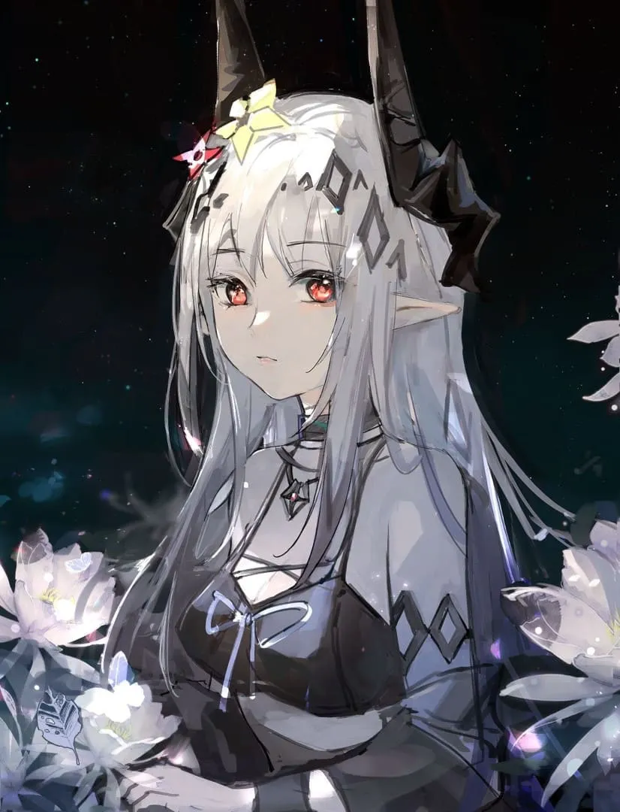
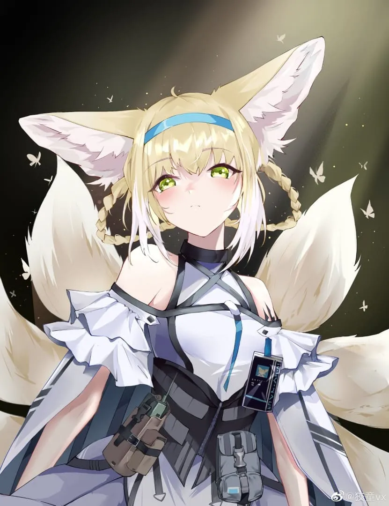
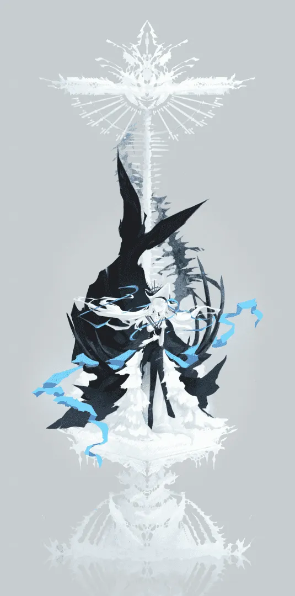
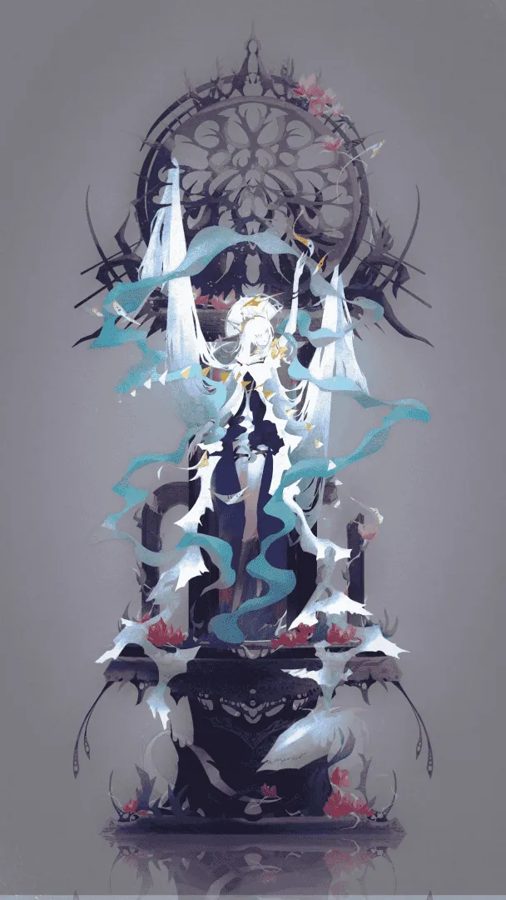

## 判决

 {.centering}

  

    灾厄降临于世 
    双翼断折，生机不存 
    祂说：这世间应有光 
    飘渺的奇迹化作血与汗 
    未来已然萌芽 
     
    圣言铭刻于心 
    信念铸就魂灵 
    你是高翔的飞鸟 
    愿你执此锋芒 
    卫佑国土
  

  

    浪潮拍打礁石 
    静谧未曾远去 
    黄金的过往飘逝如烟 
    余晖落幕，它们悄声低语 
    风暴将至 
     
    愿以不灭的灯火 
    指引远航的方舟 
    浪潮骤起，我不会畏惧 
    纵有万千愚人 
    吾往矣
  

图 ⦾ bilibili / LOFTER @Umie゜

## 静谧午夜

 {.centering}

  

    午夜静谧，花海微澜 
    夜风轻拢如烟的发 
     
    迷蒙的秋水隐没斑斓的星辉 
    薄雾萦于纯净的美好
  

  

    她的绛唇微抿 
    如同游于孤独的舟 
     
    黛紫的花叶如幻似梦 
    亦如易逝的未来
  

图 ⦾ bilibili / LOFTER @ qz芊烛

## 光

 {.centering}

  

    大地遍布荒芜，神灵点染生机。 
    她于净土中萌芽，沐浴自然的恩泽。 
    天使吟诵圣歌，为她祝祷新生。 
    尘垢难掩纯洁的心。 
 
    明月缓缓升起，悬于淡漠长夜。 
    明世月光，又落谁家庭院？ 
    惟有情思流逝，人心浮华， 
    和一曲悲歌。
  

  

    染血的十二音，于烈火中回响。 
    无根者凝望，回不去的故乡。 
    魂灵执笔，书写离别的诗章。 
    生者不知何往。 
     
    手执一缕晨曦，照亮黯淡尘灰。 
    君影轻灵，她逐光而去。 
    一路前行，一路盛开。 
    传递名为光的幸福。 
  

图 ⦾ ionize & 狡童

## 劳伦缇娜

  

  

  

    &emsp;身穿长裙的女性立在一面等身镜前，宛如一尊雕塑。 
    &emsp;镜中的修女歪了歪头，迷茫与疑惑交织为一张美丽的脸庞。 
    &emsp;你…是谁？ 
    &emsp;我是你的幽灵，是你光下的阴影。 
    &emsp;她抬起了手，似在邀约，似是排斥。 
    &emsp;要舞一曲吗？ 
    &emsp;修女以笑容应答。她同样抬起手，行了一礼。 
    &emsp;那便，舞一曲吧。 
    &emsp;白骨筑台，繁星弥天，歌曲于心中鸣响。 
    &emsp;血肉轻声嗡鸣，似在应和。群星俯首，它们黯然失色。 
    &emsp;她的舞伴紧紧地跟随她的舞步，犹如一只可怜的提线木偶。 
    &emsp;她缓缓地停下舞步，双眉微皱，似在不满舞伴的呆笨。 
    &emsp;二人沉默对视，她轻声叹息。 
    &emsp;梦该醒了，劳伦缇娜。 
    &emsp;纤长的手指轻轻地点在镜面，二人指尖相触。 
    &emsp;碎裂的幻梦如纤柔的尘，从她的指间滑落。无意义的死物四分五裂，消失无踪。 
    &emsp;她不愿归属深溟，她无需他人赋予。 
    &emsp;她是劳伦缇娜，她即自我。  图 ⦾ LOFTER @ 半只祈鸢
  

## 伊莎玛拉

  

    &emsp;我是谁？ 
    &emsp;他的脸变成了奇特的形状。在人类的情感中，这似乎叫…恐惧？ 
    &emsp;这就是恐惧吗？我记下了。 
    &emsp;那么…你在恐惧什么？ 
    &emsp;他冲了过来，扼住了我的喉咙，将我扑倒。 
    &emsp;他要干什么？他要…杀了我吗？我开始思考，像人类一样思考。 
    &emsp;一些碎片盘桓在我的脑中。似乎有人称呼我…斯卡蒂？ 
    &emsp;斯卡蒂，斯卡蒂，好陌生的名字啊。 
    &emsp;看来，她不是我。 
    &emsp;熟悉的气息从他的身上传来。他是我的血亲？他是我的血亲。 
    &emsp;我们血脉相连。 
    &emsp;我轻轻地拥住了他，他没有挣扎。 
    &emsp;音符从我的喉中跃出，化作歌谣。和我…在一起吧。 
    &emsp;潮涌，潮枯。他融入了我，我们永不分离。 
    &emsp;我的意识似已升华。我俯瞰静谧的大地。 
    &emsp;我是谁？ 
    &emsp;… 
    &emsp;我是<ruby>伊莎玛拉<rp>(</rp><rt>Ishar-mla</rt><rp>)</rp></ruby>。  
    图 ⦾ LOFTER @ 半只祈鸢
  

  

    
  

<Ads />