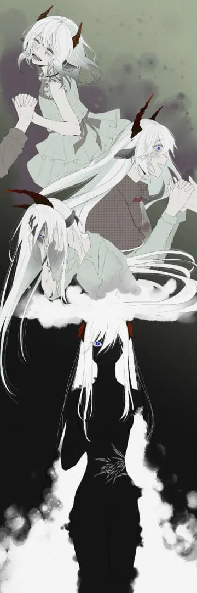

离别本不应如此悲伤，因为我们都终有一死。 {.textkai}

<!-- more -->

## 序 {.centering}

我听到了观众席第一排，簇拥着选帝侯的几位贵族们在窃窃私语。而她坐在角落，缺了一只眼，少了一条手臂，伴随钢琴声对我微微的笑。

不说话的疯女人难得的露出安详的气息，似乎在念想，又似乎在享受。我所做的只是借着琴声，向她伸出手，妄图去触碰她眼中的那个世界——但是她拒绝了。

“呆子，天空不适合你——我也不适合你。”她对我笑，我却流出了泪，“深爱我吧，想念我吧，亲吻我吧；思念我吧，抛弃我吧，最后忘掉我吧。”

曲终结束，我的泪水滴落在琴键的缝隙间。而她带着笑消逝碎裂，铺洒成漫天星尘。

满场掌声。

## 一 {.centering}

我躺在苹果树下，眯眼享受莱塔尼亚午后的阳光。这时莉泽从树上掉下了下来，砸在我的身上——我的脑壳和她的脑壳发出响亮的一声磕碰声，痛得我大喊出声：

“莉泽.迈特纳！你的角差点戳到我了！”

她用手撑起自己，眨巴了几下那双如泰拉双月般一明一暗的眼睛，以一种非常暧昧的姿势趴在我的身上。我还记得那时候她说的第一句话——而很久之后我才意识到，那句话是一层可悲的厚壁障，将我和她隔在两旁。

“勋伯格啊，你说奇不奇怪，我为什么是向下掉的呢？”

那年我八岁，她九岁。阳光调皮地和树荫跳起交际舞，我成为她眼中倒映的一缕好奇。

“哈？”我一挑眉，“那你还能掉到哪里？掉到天上？”

她欣喜的点头：“对对对！我就是这个意思！”

一种无语感汇聚成惊讶，上浮到喉咙又被咽了下去，最后呈现为一双像是在看神经病一样的瞪大眼珠。莉泽无视了我的错愕，不缓不慢的从我身上爬开：“虽然我也是刚刚想到……但是你就不觉得奇怪吗？不管是苹果，玻璃杯，还是我，居然都是往下掉的耶！一切东西在空中不会上浮，也不会四处飘散！你说这到底是为什么呢？”

“因为一种叫重力的东西吧？而且你想啊，如果我们不能站在地上的话，就不能好好生活了。”我扭扭脑袋，让角和草坪接触的更舒服些，“据说能浮空的法术也不是没有，比如那位巫王创造的……”

我突然意识到自己差点说出那个名讳，吓的赶紧止住口。任何一个莱塔尼亚孩子从小都会被父母教导“不要念出那个名字”，以防招来无踪无影的恐怖诅咒。不过莉泽的脑袋显然少了根筋。她傻乎乎的接过我的话茬：“欸，巫王的浮空法术啊，真神奇呢！或许巫王他就知道“掉下来”这件事的本质究竟是什么吧！不得了啊！”

阳光慵懒，就像是巫王他老人家的“宽宏大量”——他还不至于仅因一个小女孩的童言而怒下天谴。想到这里，我也放松下来，继续享受下午的阳光。莉泽还在边上兴奋的吱吱喳喳，但我只是随便附和几句。很快，我便在临近夕阳的日光浴中昏沉睡去了。

## 二 {.centering}

莱塔尼亚的一大特色是普遍的责任义务教育——所谓“普遍”是“重量不重质”的另一种说法。在这样的“特色教育”下，莉泽却展现出惊人的法术天赋：十二岁时候她施展源石技艺搓出了个一米半径的大火球，差点把整条街炸掉；而我法术资质平平，耳朵却比常人稍稍敏锐些。

结果就是，莉泽年纪轻轻便被一位高塔术士带走，成了前途无量的法师学徒之中最天才的那一个；而我则进入了普通的音乐学校，和百分之九十九没有源石技艺天赋的莱塔尼亚青年一起，学习乐理并昏昏度日。

我十六岁时，学习重点是钢琴——实质上我的乐感和施法能力一样平庸，和那些音乐天才根本没法比。自从分开之后，我和莉泽好几年没有见面，所以在她喊我那一声“嘿！呆子勋伯格，弹得真不错！”时，我根本没有反应过来。

那是钢琴房，位于学校的四楼。我为了不被打扰，明明锁好了门——但莉泽的上半身从窗户里探进来，就像一条白香肠一样挂在窗框上跟我打招呼。这种突然的“莉泽风格”吓到了刚准备合上琴盖的我：随着莱塔尼亚粗口脱口而出，屁股无情地从坐垫上跌落，传递痛的感悟。

“欸，呆子，你真不经吓。”莉泽撇撇嘴。

我抓住钢琴腿让自己爬起：“拜托！不管是谁从四楼的窗户外突然爬进来，都很吓人的好吗！”

“哎呀，不是爬啦！”这根带羊角的白香肠晃悠两下，从窗框上跌进钢琴房。她的五官几年来没有太大变化，还是平庸中带着点可爱；那双泰拉双月般的眼睛一明一暗，一如曾经。眼睛的主人正扶着墙：“哎呦……这地板真硬。”

“喂，你先解释清楚你是怎么进来的。”我叉着腰坐回钢琴垫上。

“啊呀，很简单啦，是浮空的源石技艺。”她靠着墙站好，灰头土脸掩盖不住那种自满的气息：“虽然这楼的三层高度是理论极限，不过我还是飞进来啦！”

“我记得这里是四层来着。”

“对啊，所以我刚刚临时更改了施法方式，消耗更大，飞得更高！虽然是第一次尝试，但是效果很不错……”

我打断她：“第一次尝试？你就没想过如果出什么岔子，你在半空掉下来了怎么办？”

她一愣，舌头一吐，眼神不自觉地飘移开来。看样子她真的没想过，脑袋缺根筋的傻姑娘。

于是我端正的坐在钢琴前，她不那么典雅的靠在窗边，一时间我们相顾无言。这种无言成分复杂，一部分是因为好几年没见，我不知道应该对大一岁的童年好朋友说些什么；另一部分则是我不晓得儿时那些话题她还感不感兴趣；当然，还有一点点的出糗难堪。不过看她刚才那胡来的样子，我不由放轻松了些：莉泽还是那个莉泽。

最后还是傻姑娘先开口：“呆子，其实我找你是想要呢，额，拜托你办件事！”

这语气欢快的不像是在求人。

我勉强点点头，片刻后突然反应过来：“等等，你先说清楚，什么事情？”

“嘿嘿！”她坏笑一下，蠢蠢的脸上写满了不择手段，“你现在的老师，是那位大名鼎鼎的音乐和源石技艺双料天才，舒伯特对吧！”

“嗯，所以？”

“所以呆子！既然你是他的学生！就帮我把他珍藏的！源石技艺施术单元！给偷过来吧！”

## 三 {.centering}

“所以呆子！既然你是他的学生！就帮我把他珍藏的！源石技艺施术单元！给偷过来吧！”

她高举双手，每个语调停顿都往上狠狠抬上一节，恨不得要让全世界都知道她正在怂恿我偷东西。我的惊诧也随着她的语调一并变高，最后终于克制不住。

“你说啥？你想让我去偷舒伯特老师的东西？”

她带着傻萌傻萌的笑容，仿佛在告诉所有人“我没有坏心眼！”。

“不是，说清楚为啥啊！”我挠挠头。

“为啥？啊咧，原因的话，呆子我感觉你不会感兴趣的——帮我就对啦！”

我有些抓狂，伸手继续抓头发：“你不说清楚，我怎么敢去……”

“欸，一定要说清楚你才肯帮忙吗？”

我回给她一个杀气腾腾的默认。

“好吧，真拿你没办法。”莉泽掸掸裙摆，“不知道你还记不记得，我们在很多年前……七年前，还是九年前？哎呀不重要啦，就是我们小时候，有一次是在苹果树下……欸，是苹果树还是刺果树下？欸……”

“讲重点！”

“反正就是我们小时候有那么一天啦，我好像和你说过来着！”从一开始不明所以的回忆里走出之后，她找到了重点，言语组织也清晰起来：“我记得我当时问你：“为什么一切都是往下掉的呢？””

我的头逐渐不受控制的偏歪，耳朵里仿佛飘出一个漫画一样的问号：“所以呢？这和你叫我偷东西有什么关系呢？”

“哎呀呆子别急嘛，真没耐心！”她撇嘴，“这个问题困扰了我很久，所以我一直在大法师的教导之外，研究一切悬浮漂浮的源石技艺哦！为什么这种源石技艺，能够克服万物向下的趋势呢？探究这个不是一件很有意思的事情吗？”

我完全无法理解这件事情有意思在什么地方，只是看着莉泽欢快的神色，就没有打断她。

“这种悬浮飞行的源石技艺也有好多种。你听我说哦，最常见的悬浮法术其实并没有克服向下的力，只是用各种方式在自己和气体之间产生排斥来飞起来；还有一些稀有的源石技艺，大多是天生的，能够操纵重力。不过嘛！你知道的，莱塔尼亚曾经也有一位法术大师，创造了独特的浮空术……”

“巫王。”我下意识的念叨出这个忌讳的名字，又连忙捂住自己的嘴。

“对！巫王的独特浮空术，据说灵感来自他有一日，观察泰拉浮于空中的那对双月！”傻姑娘倒是毫不忌惮，大大咧咧的直呼巫术宗师的称号。我不由得想，这家伙能活到今天真是个奇迹。

她没有理会我奇奇怪怪的神色，继续说：“巫王留下的浮空术，以我浅薄的知识看来，原理层面上和其他几种法术或者先天技艺都不相同！所以我就想解析它，看看这种不同到底来自于何处，又能否为我解释“为何万物都在向下”这个问题！”

“解析‘祂’的法术……你水平够吗？”

我以为她会回答我“够”或者“肯定没问题”，没想到莉泽一伸脖子，满是自信的大喊：“我不知道！”

我用一种看宪兵卫队和盗贼的共同敌人的眼神看着她。

“我怎么知道啊，我又没解析过巫王的法术。”她吐吐舌头，“不过嘛，我很快就会被授予“术士”身份，不再是学徒了！既然他人都承认我的进步，解析个法术不也是小菜一碟吗？”

她说着说着，一拍脑袋：“哎呀，光顾着跟你解释，忘记告诉你帮我偷东西的事了。”

“其实你问的也没错啦，以我现在的水平，不借助外部力量，确实有些自不量力。不过，如果有高级的辅助材料，比如核心是产自谢拉格的永冻冰晶的施术单元辅助的话，我就有很大把握啦！这种特别的施术单元珍贵且稀少，但是你的老师却刚好拥有，所以，嘿嘿……喂，你有没有在听啊？”

我一言不发，挺严肃的看着她——实际上我只是被她绕晕了，还在大脑里捋清这个一根筋女孩的逻辑。她看我没有回答，便自顾自的从墙边走来。

空白的半秒，我察觉到那对看着我侧脸的一明一暗的眼睛；正待转头做出回应，双肩却感受到一股难以违逆的推力。失衡的重心猛拽着我拉近长方形的钢琴椅垫，将我推入这十六年来最长的一秒中。空间如电梯下坠翻滚，视野自下而上运镜，地面，裙摆，羊角，泰拉双月般的眼睛——在后仰的景物中，莉泽突然成了画面的中心，而黄昏的阳光从窗中浸入，屈服在她背后，光幕如崭新的黎明。

一秒钟，温度变化了，我似乎感觉心在跳，比积水更清凉，比艳阳更热切——

一秒转瞬即逝，我的后背触碰柔软的钢琴椅垫，她收回了她推我肩膀的双手。

“清醒了吗？勋伯格，帮我弄来那个施术单元，满足我这份好奇，我们一起弄清到底是怎么一回事，咋样？”

## 四 {.centering}

她拿起我递过去的施术单元，翻弄检查了一下，兴奋地大喊：“居然是真的！呆子，你偷得可真快！”

我们见面的地方是九十九音街的露天咖啡馆，所以莉泽这一声大喊无异于黄油坠入热锅，迎来一阵旁人的炽热目光。我赶紧伸手按住桌对面那块黄油的嘴：“你小声点！还有这不是偷的，是舒伯特先生借给你的！”

她瞪着眼睛，于是我满怀不安的将手收了回来。好在莉泽没有继续发病，“难道说，这是舒伯特给你的？”

“嗯。”被她盯着，我有些不自然，缓缓别过头。

---

就在几天前，我满心都充斥着“我该不该去偷”和“我应该怎么偷”的想法，弹琴弹得一塌糊涂。十五阶序曲弹到一半，舒伯特老师把我叫停。

“你先下去，咳咳，让芬迪来谈。课结束后你留一下。”

我记得，我当时手脚冰凉，如坠冰窟——老师相当严厉，哪怕是天才，若其不认真不努力也从不宽容，更别提我这种蠢材了。我呆呆的回到学生中，脑子凝滞成浆糊。

审判之时来的很快。在所有人弹奏结束后，老师拍了下手，作为下课的信号。我低着头，慌张使得五感混乱，不敢说也说不出什么，只能听见地板上他人起立的阴影，看见人群接踵离开教室的脚步。

老师伸手敲琴盖，我才敢抬头，用眼角余光偷偷瞄一眼。舒伯特先生站在琴边，一只手放在钢琴上。他像是看着我，又像是看着我的背后，目光有些飘忽——他的眼中没有严厉或是谴责，只有些许若有所思的光在闪烁。

“你今天的弹奏情绪很重，是不是遇到什么事了？”老师说。

我不敢搭话，勉强点头。老师见状，示意我坐到钢琴前。“把刚才的序曲再弹奏一次。”

小心翼翼的摸上黑白琴键，我尽可能的集中注意力。曲乐刚进入中段，老师就伸手放在我肩上。

“轻重浊音混杂， fa, so 两音转的地方该快不快，该慢不慢……咳咳，咳。”他的声音很严厉，不过咳嗽后却缓和下来，“本来我应该责备你的，但是你的曲子却洋溢着情绪，这很难得。十五阶序曲是舒缓的曲子，若是换一首乐曲，你的这种急促就能放出异彩。不过这一切都改变不了你弹奏的极其差劲的事实。”

我羞愧的低头，眼神和黑白键之间的缝隙较起劲。舒伯特先生将面前的乐谱取走，换了另一张谱子：“弹这个。”

谱纸很大，上面稀稀拉拉布满了一堆音符。我快速浏览了一遍，有些惊惧和迟疑：这首曲子曲速很快，换手频繁，颇有难度。迟疑间，老师轻轻地握住我的手放在琴键上：“放开弹，你有这个水平。”

第一个音响起，第二个音紧随其后。在意识回归身体之前，手指已经带动音符在键盘上溅起一排水花。意识飘忽，一刹那间我听到了窸窸窣窣的雨声，雨随风而坠落，在空中凝聚为一，噼噼啪啪的叩击青草地；逐渐的天又晴了，很突然又很自然，只有风和干湿得益的空气在不安的喧嚣。阳光和树荫就像是伊比利亚的剑客，相互试探又交融交汇，而她在光亮下，看着我，眨巴她那双明晖分明的眼睛，逐渐绽放出大方自然而又发自内心的笑容。

我在树荫下，呆呆地看着她，不知道应该说些什么。光暗分割于我们之间，我头顶的树荫下着雨；她却毫不避讳阳光，大方的任其撒在角上。

“勋伯格，弹得很好哦，休息一下吧。”我听见她说。

雨停了，阳光也不再抛洒，我愣愣地看着，莉泽的身影从琴键木漆的反光中消失了。怎么停下了？我是做错了是什么吗？我弹错了，我失误了？

舒伯特先生的声音似乎带着些感慨，又暗含笑意：“咳，唉，真好啊。”

“我……”

“这部分十六钢琴情歌弹得很不错，如果不是运指指法的生疏，我真不敢相信这是第一次弹……咳咳。”

我低头，看到了自己那双勉强还算修长的手。老师咳嗽片刻，接着说：“能弹得如此富有情感而暗含变化，你已经和这首曲子起了共鸣——有喜欢的人了？”

我的背猛然挺直，一股寒战自下而上攀爬，神经电流的冰镐一下一下凿在脊柱之峰。“没有！”

一般来说，否定的很大声，都代表心虚。

老师没有追问，这位源石技艺和莱塔尼亚乐理的双重大师只是拍拍面前不知所措的青年的肩膀：“别急着否定，你还年轻，有很长时间能想清楚这件事。不过你要知道，我们是音乐家，是情感的表达者，是艺术的奴仆。只要你记住深陷其中的感受为何，你演绎出的乐曲就能打动他人。”

“你以后在每个周末，都和卡洛琳他们几个，来我家里练练吧。”

---

“你就这样成了舒伯特的私传学生？”

莉泽整个上半身伏在桌上，羊角几乎要伸到我的咖啡杯里。我把杯子往后挪，回答她：“音乐方面的私传学生，舒伯特先生只教音乐，不教源石技艺。”

“欸，真可惜啊。”莉泽坐了回去，勉强才有了点淑女的样，“不然我也随便学点音乐，和你一起去偷舒伯特他老人家的师了……”

我原本想说“你这样不怕被你的法术老师吊起来打吗”，但是转念一想这个傻姑娘连巫王的名讳都敢挂在嘴边，就没说出口。倒是莉泽催了一下，我才抿了一小口咖啡继续说：“我跟老师说，我有个朋友是术士。如果能得到您的特殊施术单元，她能在研究中取得突破性进展——他就把这个施术单元给我了。”

“欸，他老人家这么好啊！”泽丽伸出手指戳戳放在桌上的施术单元，发出嘿嘿嘿的傻笑。

“这是舒伯特先生借给你的，你记得要还。”我又强调了一遍。

她还在傻笑，片刻后才憋出一句：“放心吧！不会弄坏的！”

我叹了口气，看看她欣喜的眼神，又看看自己的咖啡杯。

谁放心啊……

## 五 {.centering}

莉泽没法交还那块借自舒伯特先生的施术单元，因为她把它弄坏了。

同样弄坏的还有她的左眼和整条左手。

据说那晚，大法师发现自己的一根法杖被偷了，大为震怒，要召集那座高塔里所有术士和学徒予以纠察。然而莉泽始终没有出现，于是一行人浩浩荡荡的去了她的房间。一开门就能看到女孩倒在地上，陷入昏迷，全身发烫。她的一只眼止不住流出冉冉鲜血，左手以诡异的角度弯折耷拉着，逐渐变成烂泥状。那根失窃的法杖就在她身边，已经折断了；同样损坏的还有落在地上的一块独特施术单元，明明焦黑的破损口却散发阵阵寒意。

巫王就是莱塔尼亚上空的阴影，哪怕死后余威犹存。一个小小的初入源石技艺殿堂的术士竟敢解析他的法术，下场就是这样。

半小时前，我在医院走廊上听到莉泽在嘶吼。那是撕心裂肺如同野兽般的吼叫，即使走廊上轻柔舒缓的音乐也不能抚平惨声中暗藏的恐怖和揪心。莉泽还在昏迷，巫王残留的一星半点精神余波仍旧在她的大脑中翻腾，好似刀片落入豆腐，刺激她的兽性，折磨她的人性。我感觉自己的心就像被一只手攒住，忽地一阵一阵痛。于是，在那不似人形的折磨之音暂且消停的片刻，我落荒而逃离开了医院。

我只是呆滞的走着，回家，没有思考，两耳空空，似是潮水海雾平息，又像阴沉天穹凝固。我该想什么呢？回忆她折磨如万千针扎的身影，假想她弯曲若弓的身形，空洞的左眼和消失不见的左臂？我坐在桌前，仅仅是稍稍念想，一抹不争气的东西就流了下来。空白的纸和吸满墨的笔躺在桌上，无言注视着狼狈的我，一言不发。

舒伯特老师说，我有喜欢的人了，难道是那个傻姑娘？开什么玩笑，她明明又傻，又笨，又一根筋，做事又不计后果……舒伯特老师也有看错的时候，她对我而言明明只是儿时的玩伴，这种揪心也只是出于对曾经好友的担心罢了。

泪眼中，莉泽站在窗外，阴影的交界处背对着我。她没有说话，安静地就像一团烟雾。我为什么会执着于她呢？一个数年不见，仅仅是最近才再次出现在我面前的愚蠢朋友？我看着那个完整的她，似乎听到了手在动，什么莎莎的声音传来。其实我是知道的，她并不笨，也不蠢；她是法术的天才，只是思维执念已经远离了我。两条线已经结束了交汇，哪怕一方再执着也不能改变渐行渐远的事实。

迷茫中，巫王从夜的雾霭里走了出来，带着冠冕，拖着华贵长裙。高大的他站在空中，低下头，看向莉泽，衣摆上的金线随风微微摇曳。我的呼吸屏住了，和他们坠入一个世界，却什么也做不了，只能看着我的朋友直面莱塔尼亚最原初的恐怖，一动不动。

风声大作，巫王的袖袍中，无数闪电和黑夜在奔驰，在迸发。他低沉下来，语气威严却不严厉：

“伶俐的孩子，你可想与我同行？我能教导你，带你看清所谓巫术背后的奥秘，让你伟大，让你不朽……”

他的每个音节如轰轰雷声，带起周遭气浪翻涌。莉泽抬头看着他，不见畏惧：“为什么是我？”

巨大的阴影露出惨白的灰，无限的恐怖中透露出可怖的爱：“因为我们是同一种人。”

“我们可不是同一种人，我不要伟大，不要不朽。”莉泽否定了巫王。不过随之，她踮起脚尖，“但是，我真的很好奇，你的那些法术是怎么回事。教导我吧！”

巫王笑了，笑的嘶哑，笑的沧桑，笑的如同暮鼓晨钟轰轰作响。烟雾凝聚的乌鸦成片落地死去，我瞪大眼睛，看见他伸出干枯，苍白，扭曲的手，放在了莉泽面前。

“抓着我的手吧，伶俐的孩子——随我走吧，随我远去，我会满足你的求知和好奇，让你疼痛难耐，让你胆战心惊……”

“莉泽！别听他的！”喉头有什么破了，我愤怒而急迫地站了起来，一拳锤在窗框上。

莉泽消失了，巫王也消失了，无边的雾霭和实质感所凝聚的畏惧都消失了，只残留寂静的夜。我有些愣，头脑冷了下来，看清楚窗外只不过是两颗灰色的杨树，一颗矮小，一颗高大。

我听到什么东西掉在地上，发出啪嗒一声，回过头，看到那是我的笔。原本满墨的羽毛笔中芯干瘪，精疲力尽，倒是还在桌上的那张纸神采奕奕。纸上密密麻麻标满五线，三线和音符，演绎出一曲压抑中带着解放的曲目。

我看着纸，一种不真实感浮涌上来，仿佛我一下离真正的自己很远——只有仍带酸胀的手告诉我，这首曲目确实出自于我。乐谱的最后，笔迹渐干之处，是寥寥数个扭曲的字，我无意识间所留给这首曲目的名字：《Verklarte Nacht，升华之夜》

## 六 {.centering}

我之后又去了几次医院，却始终没能看到莉泽。医生说她需要休息，否决了一切会面申请。我看那医生眼睛里写着“健康人在这里没有人权，等你缺胳膊少腿了再和我讨价还价”，就没有执着。说到底，不知为什么，其实我也很害怕见到她。

舒伯特老师咳的越发厉害，学生们时常劝他去医院看看。经过一段时间的犹豫，我还是将《升华之夜》的乐谱交予给他。我记得他拿到谱，看了一遍，又一遍，欣喜和惊讶挂上脸，变成了赞扬。

“你隐藏的才华被开发出来了——我没看走眼。咳咳，咳咳。”

说来惭愧，青涩笨拙的我缺少改谱系和校准音区的经验，曲子最终地完善还是舒伯特先生做的——但是先生仍坚持让我单独署名，没有分享这份成果所带来的名誉。据说这首曲子引起了小规模的震动，不少批评家和鉴赏家都对我产生了兴趣。

我先是稀里糊涂在舒伯特先生的演奏会上为他做复调，后来先生安排我为他弹奏开幕曲。十七岁生日那天，先生安排我为一位伯爵和几名鉴赏家表演升华之夜。说实话，每次弹奏这首曲子，我的意识都仿佛回到了那个迷离的夜晚，而当意识回归的时候，曲目已经弹奏结束了。我当然不知道自己弹奏的怎么样，但是看到老师欣慰的眼神和几位听众藏不住赞叹，想必效果还不错吧？

我愈发尊敬我的老师，舒伯特先生。除了无私的音乐教导，还有另一个原因：在莱塔尼亚，源石技艺施术和音乐总是分不开的，一位不通晓源石技艺的音乐家会受到无形的歧视。但是老师从不教导我源石技艺，他也知道我对法术不感兴趣。

一个中午，坐在餐桌前时，他突然对我说：“孩子，你是天才。”

“哪里哪里！”我连忙否认，吓的叉子差点没拿稳。

“不，我是说认真的。对于我们来说，音乐和源石技艺具有通感，大多数莱塔尼亚音乐家都能通过施法的经验寻找音乐曲调的韵律，因此莱塔尼亚盛产乐手和术士。但是你没有依靠法术，仅仅依靠体感和感情感悟就走到了今天这地步——这已经胜过了我，胜过了无数莱塔尼亚的音乐人。”

“咳咳，所以啊孩子，你不需要为自己在源石技艺上的笨拙而感到自卑。你可是不依靠源石技艺创作音乐的天才啊。”

我有些恍惚。愚笨而平凡的我，居然也能和天才搭上关系吗？然而先生咳的愈发厉害，憋回了我谦虚反驳的言语，于是这个话题最终也不了了之了。

---

这两年，我愈发被赞誉：莱塔尼亚音乐届称我是新一代音乐家中的佼佼者；报纸更是称我为“不会法术的大钢琴师”。不知不觉间，我凭借着《升华之夜》和几首后来的小曲，似乎已经将同龄人甩在身后。不过两年来，我几乎没有再和莉泽见面。

和我不同的是，莉泽自从活下来后，就从天才的云端跌落，在术士的领域一蹶不振。

解析巫王法术，偷取老师的法杖，这两件事对仍在学习的术士来说，无异于犯下忌讳和重罪。但是念在其拥有出色天赋，莉泽只是被大法师象征意义的惩罚了一下。没想到的是，自此之后，莉泽就一发不可收拾的走上歪路——据说她开始研究一些冷门或是莫名其妙的咒术，还经常违逆其老师。结果她的施法专精偏离了几乎所有主流源石技艺方向，她也逐渐成了术士们眼中的怪胎，一个荒废青春的“傻子”。

最终，她被剥夺了术士地位，逐出术士高塔。天才陨落，据说不少术士今天还会用她来作为反例告诫学徒。

## 七 {.centering}

她打开门，看到是我。

“进来吧，小心门边的那些材料的边缘，它们能把你的脚趾割断。”

我小心地跟着她进入房间，打量起来。这间屋子里没有床，手稿和各种素材铺满地板，工作台上满是各种我叫不上名号的施术零件。这就是莉泽如今委身所居的地方，位于城外，移动地块的边缘。

“如果你也是来劝我，或者责问我怎么堕落成今天这样的，那还是请回吧，我的时间很宝贵。”

她不再活泼，不再“愚蠢”，反而在我眼中阴沉冷淡了很多。天才傻女孩莉泽已经是过去式，如今二十岁的她一只衣袖空空如也，左眼的洞被头发遮住。她坐在椅子上，仅存的眼睛直勾勾盯着天花板，等我的回话。

因为房间里的椅子只有一把，所以我仍站着。“你是不是在那次解析“祂”的法术的时候，知道了些什么？”

“哦？”她一挑眉毛，“你怎么知道的？”

“小的时候，你跟我说，你的梦想是成为术师，通晓世界上的法术，弄明白一切“为什么”。”我靠在墙上，“我不能理解这样富有求知欲的你居然心甘情愿抛弃术士的名号，不再学习莱塔尼亚源石技艺。所以一定是当初，你在解析巫王咒术的时候知道了什么，让你成为今天这副模样。”

我每说完一句话，她瞪我的眼神就锐利一点点。在我说完几秒后，她才慢悠悠地回话：“……你很想知道？我变成今天这样的理由可能对你而言无聊透顶，甚至可能在你听来只是些疯言疯语。”

我点头。

“你确定？我原本想说服那个老头，就是我原本的老师，结果花了两年没成功——他不相信我真的能够解析出巫王源石技艺的奥秘。我可没有耐心和你解释一遍又一遍。”

“我想知道。”我回予她确切的回答。

女人的眼神像是锐利的尖刀，一层层的刺破我的面皮，肌肉，以挖掘我那暗藏意图的大脑。直到我感到不自在，甚至有些尴尬的时候，她才开口说道：“你还记得我们小时候，在那棵树下，我问你的问题吗？”

因为十六岁在钢琴房的那个下午，我对她的这个问题仍留有印象：“我记得当时，你问我为什么一切都是向下落的。而我的回答是“重力”。”

“是的，重力。他来自我们脚下的，移动地块之下的大地。”她顿了顿，酝酿片刻：“勋伯格，你相信我们脚下的大地，所有的岩石和海水，本质上只是一个球吗？”

“哈？”

她点点头，等着我的回应。

在确认她确实是这么说的之后，我凭借本能的反驳：“这怎么可能？你怎么知道……”

“我不知道，这只是一个假设，接下来所有我说的内容都只是从无数假设中推导出来的。”她打断了我，“不能接受的话你就可以走了，不然只是在浪费你我的时间。”

见我没走，她有些意外，接着说：“这是一个很大的球，也可能不是球，但总之是一个物体。我们泰拉人就像蚂蚁置于苹果，不，蚂蚁置于卷心菜，以很小的寄生物一样的方式生活在这个球上。这个球很大，它的中心在产生力，来将我们和身边的一切拖向它。因为球面实在太大了，所以这个力在我们看来，是向着平整的大地的。”

我低头看向地面，思索起她说的话来。片刻后我抬头问：“这些都是你的猜测？你是怎么得到这个推论的？”

“准确的说，是许多猜测中的一个，我之前还有过“空气是一层层向下施展力的膜”这样的假设，不过后来被我自己否决了。”

“这就又要说回巫王创造的独特悬浮源石技艺：这个法术的本质，是短暂的引导并放大一个来自于我们头顶的力量，来抵抗重力。你知道这个力来自哪里吗？巫王在撕碎我的大脑，左手和左眼的同时告诉我，那个力来自于月亮，太阳，或星星。”

她看着我，原本冷漠的眼神中竟透露出一丝丝兴奋和癫狂：“所以，我们头顶的太阳，月亮，或者星星，本质上都是和我们脚下这块“大陆海水球”一样庞大的球。星星们在我们的眼中呈现点状，是因为他们太远了，就像你在雨天看街对面滴落的一滴雨滴。这也意味着——我们眼中的莱塔尼亚，乃至泰拉大陆，恐怕都只是真实世界的小小一部分。”

“自从意识到这一点之后，我就再也无法安稳地睡着觉了。这是对的吗？我们的头顶真的还有这样庞大的世界吗？高塔里教授的循规蹈矩的法术和他们讨论的恩恩爱爱，贵族权势都不再能够吸引我，我只想验证，见证，亲眼见识见识这个世界。”

她吸气，口出狂言：“我，要进入天空。”

## 八 {.centering}

我对天空的印象，不过飞鸟，云朵，变幻的天气。所以莉泽说出狂言的时候，我第一反应仍旧是荒谬：“依你这么说，乌萨斯军队的火炮无人机早就飞上天空了，乌萨斯人怎么没说天上有球状的……”

“他们飞的不够高。”莉泽不客气地打断我，“我所说的“天空”是无人机所无法触及的领域。”

“……就算你猜测的一切都是真的，你成功飞上去了，又有什么意义呢？”我问。

“你帮过我，搞到了一个特殊的施术单元，还记得吗？”

她没有回答我“所谓的意义”是什么，但我却出乎意料地有耐心听她继续说：“那个施术单元，特殊在其有一块独特的核心——来自谢拉格的永冻冰晶。这种源石冰晶数量稀少，永远不会融化。在我解析巫王法术的过程中，那个损坏的施术单元功不可没。勋伯格，假设有一件事情，需要消耗某种资源去做，就像我消耗了那块永冻冰晶一样，而泰拉大陆上所有的这种资源都用完了……”

“这件事就做不成。”我回答她，也隐隐约约明白了她的意思。

“虽然我们感觉泰拉大地地大物博，无穷无尽，但是实质上，我们的资源总是有限的。看看今天，乌萨斯仍旧在和卡西米尔摩擦，玻利瓦尔每天都在打仗，我们忙着消耗资源，把更多的源石炸弹投到其他人头顶……我害怕未来有一天，泰拉大地是贫乏的，我更害怕未来的我或是未来的某个人，会因为这种贫乏而失去探索未知的机会。”

她说着，眼中有光：“所以，我要飞上天空。如果我是错的，我们还有足够的时间寻找下一条路。这不是什么意义的问题，而是希望啊——满足我求知的私心的希望，寻找泰拉大地新出路的希望，提早我们终将走出未来一步的希望。”

她指向天空，仿佛万千星河的光芒穿过屋顶正在对她闪耀：“如果我是对的，我们将会收获万千泰拉。”

我有些迷茫，眼神顺着她的指尖离开，最终又落回她的脸上。说实话，她所说的话仍给我一种不真实的感觉——这些东西离我太过遥远，却离她那么近。只是我发现她没有变，那个一根筋的，愚蠢的，似乎和我不在一个频道的莉泽仍旧是那个莉泽，心里便又没由来的开心了，只是带着一点难受。

“嗯。”

出神之时，她突然站起来，抓住了我的手：“勋伯格，我们是朋友吧，你相信我吗？”

我慌乱的抽回手。突然面前一幕和过去重合，钢琴房里那个笑嘻嘻的，求我帮她偷东西的女孩又站在我的面前。下坠，下坠，心似骄阳映照潭水。女孩成了女人，但仍是一个人。

“你是长久以来，第一个相信我，愿意主动听我说这么多的人。帮我吧，帮我登上天空吧！我只需要看上一眼便心满意足，而天空中那一切可能存在，也可能不存在的价值和财富都归你。”

“帮我吧。”

她是莉泽.迈特纳；她不美丽，缺了手和眼；她是一个不像莱塔尼亚人的莱塔尼亚人，和这片大地格格不入。我被她如同孤月般明晖不定的眼睛盯着，终于意识到，舒伯特先生没有说错，一直以来都只是我没能认清自己的心意。

“我帮你。”我说。

## 九 {.centering}

在他人眼中荒废堕落的数年，莉泽已经想方设法，尽可能多收集了关于天空的信息。她告诉我不少她所面对的问题，我却只能听懂其中一些：比如离开地面摆脱重力需要巨大的速度，但是这样的速度在空气中会产生热——我知道钢琴弹的过快，琴内部的击锤会发烫，却不知道这种小小的温度变化也会带来巨大问题。

莉泽推测，这些空气可能是被重力拉扯到地面上的，也就是说在某个高度开始，空中将没有气体，高速运动不会带来高温——但同样因为没有气体，人也无法呼吸。她想方设法大概算出了这个高度的值，奈何在这方面愚笨的我看不懂她的推演。我说看不懂的时候收获了她一个白眼，虽然她自己对这个结果也不太确定。

莉泽说，她最先的设想是，制造具有足够动力的载具来将她带上天空。只是这样的想法很快就被否决了——巨大体积的载具意味着需要充足的动力。她既缺少足够多的材料，也缺少足以支撑载具上升的动力源。同时，巨大也意味着笨拙，莉泽希望“尽可能灵活”以面对升空时的突发情况。

我开始收集各式各样的源石技艺产物和术士用品，以供莉泽之用。很快，在音乐家间流传起了“青年钢琴家勋伯格喜欢收藏源石产物”的说法。不乏有恶毒者猜测，我的这种收集行为，是不是因自身源石技艺适应缺陷的报复性反应。

对于这种流言蜚语，我只是一笑了之。真正让我担忧的，是舒伯特先生的身体。

---

在三个月里，舒伯特先生的咳嗽恶化极其严重，如今已经不能下床走路了。我站在床边，看着他虚弱的躺着，心里如针扎般难受：先生如我的第二父亲，没有他就没有如今的我。我看他想说什么，却咳得厉害，便想制止他；然而一口带血的浓痰已经飞了出来，溅落在痰盂边缘。

“老师，您是有什么要说吗？您先休息吧。”我低垂眼帘。

他摇了摇头：“勋伯格，帮我……咳，帮我把纸和笔拿来。”

纸和笔被放在他身前的床单上。先生勉强靠着枕头，支撑自己半坐起来。他伸手，摩挲着羽毛笔的羽毛，似是感慨，又似是念想。我听见他低声的说道：“我看见了祂。”

“祂？谁？”

“祂。祂在问我，他告诉我，我的时候快到了，我要不要跟他走……咳咳！”舒伯特先生又咳嗽起来，精神愈发的涣散。他似是梦呓又喃喃自语，眼皮半合，看着天花板，手却抓起羽毛笔慢慢的动。

“咳咳，祂告诉我，那边有很多五颜六色的花，人们会在花草地上，跳欢快的圆舞……”

我赶忙站到床的另一边，看到了他手中落笔带起纸上的点点音符，“老师，要不您先休息吧……”

“别打扰我！”舒伯特先生突然愤怒的一抬手，病朽的身躯竟迸发惊人的力量，推打在在我的胸膛。伴随着掌心推实，他像是清醒了过来，又咳了两声，看着我。“咳……不，对不起。”

我沉默不语。

他抓着羽毛笔的手还在动，只是慢了，字迹像是扭曲攀爬渴望见到黎明的小虫。“勋伯格……咳咳，咳。其实，其实我一直很嫉妒你。”

他说话断断续续，名为肺的风箱似乎就要熄火了：“为什么，你能拥有无与伦比的体感，能够仅凭，咳，仅凭感性就创造出那首无与伦比的《升华之夜》呢？咳咳，我不甘啊，我嫉妒啊，如今借助死亡，我看到了祂，也有了，咳咳咳，有了这样一个机会……”

先生的手没有停，眼神中流露出恳求：“我不想死，可我也不想让这些乐符白白流过指尖……咳咳，勋伯格，求求您，别阻止我，让我写吧。”

我没有说话，因为我看到了，那位魔王已经站在舒伯特先生的床边。祂沉默着，伸出一节节指骨拼凑的手，搭在先生的手上，帮助他矗立在生死之地的夹缝间，从无生无死的深渊中挖掘音符。先生突然瞪大了眼，手也快了，一串被浓郁的死亡气息包裹着的字迹堕落在五线谱上——死亡似乎是片深不见底的黑暗。那是各式各样的事物都为之绝迹的黑暗，亦是四面八方的空间都无限扩张的虚空，群星诞生于朱红的血色，又在旋涡的席卷中灭绝。一瞬世界出生入死，刹那宇宙成为过往。只有眼前的朱红火花，还确确实实存在着……

魔王站在朱红之中，对先生说道：“来吧。”

笔跌在地上，纸已经密密麻麻的落满生死间的悲怆和绝望。舒伯特先生被疲劳和悲伤逼迫得身心憔悴。简直就像在一瞬之间变成了迟暮的老人。

“……曲名叫什么。”我问。

“魔……魔王。”

《魔王》的手稿置于胸前，魔王站在身侧，夺走先生的生机。我和他，两位钢琴家相继无言的沉默，似乎不知道应该如何面对似乎是离别的眼前之景。

“会是一首好曲子的。”我说。

他抬头笑了一下，看着我，一咳。片刻后，他伸直脖子，对我说：“勋伯格……我不想死。”

然后他背脊松下去，坠落在床单上，死了。

## 十 {.centering}

“他死得其所。”

我蹲坐在房间里，看着莉泽。女人坐在桌前，用我叫不上名字的手法对她手中的精巧零件进行加工。她一心二用，一边动手一边应付和我的对话：“我认为舒伯特先生死得其所，他很幸福。”

“幸福？”

“嗯。对于一个人来说，如果死亡能够成为一种经历和资本，为他毕生奉献的事业带来突破，那么这种死亡就是有意义，有价值的。”她完成了手头细小零件的加工，捧着仔细检查元件的源石回路。我从她的侧脸中看到一种不清不明的向往，如同她亲眼见证且确认了舒伯特先生的死是一场完美的谢幕。

“但是他最后说他不想死。”我拿起装着热汤的木碗，沾着白面包。所谓木碗，其实就是一块被源石技艺法术轰出坑的木头，莉泽长久以来就用这个吃饭，看得我于心不忍。我给她送了一些餐具，但被她拒绝了：她说家里没专门放碗筷的地方，也没洗碗的时间，而木碗方便制造，用完就能扔。

莉泽小心地用钳子架起零件，放在桌角的小箱子里。“我想也是，没有人想死。更何况他刚刚见证了音乐创作的无上境地，就马上就要被死亡的魔王带走——这是一件非常残酷的事情。”

说完话，她走过来，蹲在我面前看我吃白面包。白面包是我买的，在这之前莉泽吃的都是最便宜的黑麦糠面包，能吃出木屑来。她抿抿嘴唇，似乎有些馋，“……话说勋伯格，我叫你来是干啥的来着？”

“……你说你有了新的升空方案。”我提醒她，傻女人。

“哦哦哦，对。”她揉揉脑门，转身从满地板的纸张中找出一张，放在我面前。“就是这个。”

纸上是一个小人，边上标了一大堆乱七八糟的内容。我无奈把纸放在腿边：“拜托，我看不懂啊。你简单说说？”

莉泽的独眼一眨：“简单来说嘛。就是不要载具和一切辅助动力装置了——仅仅把我自己送上天。”

“哈？”

“对，用肉身升空。”莉泽重复了一遍，“我先前执着于借助载具，很大程度上是考虑到动力源和保护方面的因素。但是如果放弃载具的话，所需的动力就会小上很多。至于保护方面，对于源石技艺施法者，在有足够准备时间和材料的前提下，就可以释放足够多的防护法术。”

“……你没有在说胡话？”

“没有。”她很确定的答复我。

我用手臂支棱住下巴：“你详细说说。”

“首先，我在地面上做好准备。准备主要分为三方面：动力，防护和空气。”她顿了一下，“如果高空真的因摆脱了重力而空气稀薄的话，我就需要自己准备气体。如果我没有算错，在升空后，会有很长一段时间的无空气飞行。”

“防护方面，首先毋庸置疑的，需要抵抗压力和高温的防护源石技艺。如果我上升的速度不快的话，咒术的强度可以不是特别强，但是持续时间必须足够长。其次，还需要抵抗低温的咒术作为备用，毕竟谁也说不清高空的情况。我们知道山顶比山脚冷，也许高空也是一样。除此之外还需要许多杂七杂八的源石技艺防护，以应对不时之需。我的预计是，在升空时为自己套上三十层左右的各类法术护盾。”

她顿了一下，接着说：“最后是动力的问题。在升空的第一阶段，也就是在地面上起飞时，使用产自哥伦比亚的喷气背包。这样我就能以一个不会太快的速度，越过空气最稠密的地面附近。喷气背包用尽后就丢弃，此时进入第二阶段——使用各种具有强攻击性的源石技艺，利用发射这些源石技艺带来的反推力，来继续上升。这个过程不会很长，但是预计会把我加速到一个较快的速度。最后是第三阶段，我会裂解掉最外面几层磨损最严重的法术护盾，减轻重量的同时来释放一些夹杂在护盾之中的施术单元：这些施术单元被激发后会继续给我向上的力。如果我的计算没有错，第三阶段结束时，我已经进入了天空。那里应该是不会受到重力束缚的地方，一切都会漂浮在空中——我只需谨慎施法推开自己，就能调整前进的方向。”

她说完，看向我。听了这么多，我已经呆愣住，看她的眼神大概就像看一罐志愿当消防员的食用油。“可行吗？”

“可行的，理论上。”她看上去十分肯定，“不过为此我需要做足够的准备——我要尽可能的控制自己的体重，不能太轻也不能太重；在升空过程中头发和卡普里尼的角没有任何作用，这些都要抛弃；除此之外，每一层法术护盾的位置关系，厚度强度都需要计算和设计……升空过程中我可以间断性的使用各种悬浮术，帮助自己抵抗重力。不过这些悬浮术的作用时间大多短暂，只能说聊胜于无。除此之外我携带的三种施术单元中，储能单元和施法单元用后就抛弃，能进一步减少我的重量”

“……不是，莉泽。”我抛出了我的问题：“光是护盾法术，你就要在整个升空过程中坚持释放并维持三十层，更别提那些给你带来推动力的源石技艺了——你有这个能力和体力坚持完成全程的施法吗？”

莉泽沉默了一下，回答我：“原本是不行的，但现在可以了。”

我突然有种不安的预感，仿佛某种坏事和厄运正悄然向着莉泽靠近。她自顾自的解释道：“一方面，我还会制作很多储能单元，帮助我节省体力。另一方面嘛……我都忘记和你说了。”

她用仅存的右手掀起衣服，对我露出了小腹侧面——数块镶嵌在侧腰中的源石结晶赫然瞩目。橙褐铰接的结晶带来无形的恐怖，一时间一切疑问和惊讶都凝滞在嘴中。恍惚，莉泽的声音仿佛从很远传来，模糊不清。

“为了强化我的施法能力，我在几天前用一块源石结晶刺了自己几下。现在我也是感染者了。”

## 十一 {.centering}

我为先生的《魔王》做完了调音。这首遗乐超越了先生以往的所有作品，磅礴茫然而又诡谲玄幻。其于莱塔尼亚的音乐界带起了一片兴叹——一部如此循规蹈矩，而又风格迥异的突破之作，竟以一位音乐家的生命为代价，诞生自生和死的夹缝中，让人扼腕墓道，莫生惋惜。

又是一年，我时常和莉泽会面。这个疯女人会认真但不正式的跟我汇报取得的成果，告诉我她又发现了什么问题，取得了哪些突破。说实话，她说的大半内容我都听不懂，能做的也只是嗯嗯附和点头。我倒是为她弄到一些矿石病抑制药物的，但是她拒绝了：她希望自己的矿石病能够适当的严重一些，这样就能获得更强的施法增幅。

疯子。

我的音乐事业倒是进入了上升期，创作了不少组合曲，叙事曲和小调。虽说最为有名而至今无法超越的曲子仍是出道之时的《升华之夜》，但莱塔尼亚音乐界还是给予了我很高的评价。但是我总是问自己，我满足吗？我幸福吗？这一切是我渴求的吗？我知道自己不是什么天才，只是一个偶尔灵光乍现的胆小男人，甚至连对自己的心之所爱开口的勇气都没有。至少舒伯特老师在生命之末创作出了《魔王》，而我却害怕《升华之夜》会作为至高点，反衬出我平庸稀疏的未来下半生。

直到我收到了信，一封烫金帖，来源于一位我所不敢想象的贵族大拿。一位选帝侯阁下访问这座移动城邦，并邀请我这位“当下莱塔尼亚最有才气的青年音乐家之一”于其暂居之所进行演奏。在这之前，我从未对那些所谓的优评和赞誉有过实感，然而如今这种“人生之长”居然以如此赤裸裸的名为“前途”的方式呈现在我面前，给了我一种强烈的不真实感。

至此，我二十二岁，莉泽二十三岁，我们之间的故事也将走向尾声。

## 十二 {.centering}

出行时间定在临近入夜的黄昏，这样刚好能赶上晚宴。马车在门口已经准备妥当，我打理好笔挺的西装，走出房门。

莉泽就站在街边不远处，看着马车。夕阳把她的影子拖得很长很长，显得孤僻而落寞。我看到她的时候，愣了一下——她的两只漂亮的卡普里尼大角已经消失不见，只在头顶留下两节短短的茬；她的头发倒还在，随风微微摇曳，像是在欣喜，又像是在哭泣。

 {.image-right-float style="max-width: 50%;"}

她背着夕阳，脸上灰蒙蒙的一片。我看出来了，那是一种终将得到满足后的衰落的颜色，一种不详的幸福的具现。我快步经过马车，站到她的面前：“莉泽，你怎么来了？”

“这应该是某位贵族的马车吧？勋伯格，恭喜你啊。”她脸上是淡淡的笑。

“额，其实是……其实是一位选帝侯的啦。”我不好意思的摸摸脑袋，小声的炫耀道。

她点点头，看着我，没有说话。我被她的独眼盯住，有些不安。突然我的怀里一颠，似乎被她塞了什么——低头看去，那是两沓厚厚的纸，纸面密密麻麻，写满内容。

“勋伯格，之前我向你寻求帮助，却从来没有回报过你，无论是年轻时让你帮忙偷东西那次，还是如今这几年。”

她低下头，似乎有些不好意思：“这些纸上的内容，是我整理过后的所有研究成果，并标明了哪些有商用的可能。当然，这些东西可能抵不上几年来你几乎无偿的帮助——只是这几张纸的知识和内容已经是我人生的全部了。”

说罢，她嘴咧了咧：“说实话，我自己都觉得没法兑现当年我给你的承诺。“我只需要看上一眼，天空中那一切价值和财富都归你”，哈哈，这话说得多狂妄啊。”

她说的很洒脱，却加重了我心底的不安。我又看到了她头顶的那对浅浅的角茬，突然意识到接下来会发生什么……

“勋伯格，一切已经准备就绪，我打算今晚就升空。”

我以为我会尝试挽留，会痛哭，或是会为她感到欣喜——然而不知为什么，身体先一步做出了反应。我所脱口而出的竟然是：“你的头发怎么还没有剃呢？”

“……哈哈，哈哈哈哈！我这么严肃的来找你，你居然第一反应是问我这个！”片刻呆滞之后，莉泽笑了起来，笑的还是那么愚蠢，“毕竟这是见你的最后一面啦，总要把自己弄得好看一点吧？我带着光头来找你，那气氛该多压抑啊！”

看见她笑，我也跟着笑起来。见我开始笑，她笑得更大声了。是啊，离别本不应如此悲伤，因为我们都终有一死。

马车夫不耐烦的探头看向这边，语气还算恭敬的请我赶紧上车。我没有理他，很认真的看向莉泽：“还需要我做什么吗？”

“有，还需要你做一件事。”她皎洁的笑了起来，“今晚的演奏对你的音乐生涯很重要吧——把它弹奏好，过好你的人生。”

话还没说完，她突然踮起脚尖，一把狠狠抱住了我——我的言语被堵在口中，身体僵直，半天没能反应过来。

“谢谢你，勋伯格。”她说。

我低下头，看见她的小小脑袋，和那头即将离开主人的漂亮金发。于是我也伸手，把她搂在怀里，感受她的呼吸带来的热气，感受着名为莉泽的狂人可能是最后留在人间的痕迹。她的身躯消瘦，就像一颗营养不良的小树。

她小声地说，言语埋藏在我的耳边：“深爱我吧，想念我吧，亲吻我吧。思念我吧，抛弃我吧，最后忘掉我吧。”

马车夫再次催促，语气的恭敬之下已经翻涌起了焦躁。于是我们分开来，最后一次互相注视对方。她只剩下了一只眼，然而我仍在她的眼中看到了泰拉的双月——儿时的她和如今的她重叠，映照出一直以来，驱动着她向前迈进的灵魂燃料——好奇和求知。

我突然感到西装口袋里有些鼓鼓地，不知道是什么。一摸，竟然摸出了一块小巧的法术单元。我想这是莉泽留给我的，抬头去看——她已经转身走了，即将在黄昏的映照下消失于街角。

至此，我们各自走向各自的道路。

## 十三 {.centering}

地块边缘，无人的荒地。

莉泽·迈特纳站在荒地的中央。抬头看向天空。她一丝不挂，头顶的金发已被剃去，只有手中握着一根法杖。月光初撒，照耀出殉道者的影。

土石开始凝聚，岩层如同流体一样从她的脚尖涌动上来。伴随着岩层的，还有无数凭空出现在空中的烈火，它们交汇，旋转，炙烤着岩石的镀层，如同内芯燃烧激烈的锻炉。

透明的空气开始变幻，贴合在裹身岩壳之上，原本无形而不可见的气体居然被压成了薄薄的一层可见的淡蓝色胶体，和岩石紧密相贴。再然后是两圈闪耀着光芒的圆膜，一层特质的液态法术产物，无数制造成本昂贵的法术粉尘……各式各样功效不同的防护型源石技艺一层又一层，层与层之间夹杂着数不尽的细小施术单元，精密而有序的结合向这位泰拉大陆有史以来最叛道离经的术士。当烟尘落定，莉泽已经变成了一块庞大，笨拙，闪着或明亮或黯淡的各种光芒的人形之物。

她弯下腰，穿戴起喷气背包。人形之物缓慢而勉强的抬头，望向天空，像是在欣赏无垠的湛蓝宝石，又好似在对这片封闭世界之所宣战。

然后，伴随着喷气声和烟柱，她开始步入天空。

我坐在马车里，看着手里这块小小的法术单元——这是个小小的记录器。

莉泽所携带的施术单元有三种：除去帮助她升空的施法单元和储能单元，她还携带了非常多的记录单元。这些记录单元会记下她在爬升过程中的诸多信息，并在允许的情况下将这些信息送回记录器中。

她不止一次跟我说过，整个升空过程中，带的东西越少越轻，就越容易。然而自始至终，莉泽都没有放弃携带这些记录器。我还记得那时候她说的话：“哈？不，这些我一定要带上！在我之前，没有人成功步入天空，所以我只能摸着石头过河探索。我可不想让下一个和我有相同志向的人，如我一般遭受“未知”的折磨！”

她告诉我她会把记录器留在地上。我只是意外于，她选择把这颗小小的深空之眼留给我。无形之间，我仿佛看到了她正穿梭在星河中间——喷气背包已经被抛下，此刻也许是那些大威力源石技艺所迸发的动力带动着她。我突然惊恐地发现，我对那个她口中的“天空”一无所知，竟无法去想象——我只能假装自己看到她穿梭在风声中，越过了漫布吟唱之音的云。

暗淡中隐隐约约渗透出朦胧，幻惑的紫色和寂灭的黑交融片刻，难舍难分。放眼上下，所谓寰宇，弥漫着幽幽的浅色红，依稀可见淡金色的细小丝絮，代表恒远而柔和的宁静。似乎还有许多的色彩，交织错落，甚至本来就是毫无距离的一体。然而似乎唯一可以感受到它们的呼吸的，只有星辰更迭着，却其实从未离开过。而莉泽在这片超脱理解的天空中漂浮，见证无人所见过的一切。对莉泽来说，天空就是智慧的汪洋，她正横渡以太之海，摘取着无数前人未见的星辰智慧之枝条。而我却听到了这篇色彩交织无法形容的无穷广阔的巨大天空，似乎传来无穷无尽的歌与乐——恍惚间新的曲目在脑海中交织。

那是我或在曾经，或在未来所听过的曲子，在记忆能够触及的一端，绽放出名为无穷无尽之珈蓝的花。曲调深邃黯然，仿佛一个在人生中迷失了方向的人在大声疾呼，又仿佛明星照月，带出名为未来的无穷希望——而我爱的那个人站在星空之乐所勾勒虚景的中央，成为了广袤真理之中的丝丝一缕……

直到马车夫叫唤，我才在恍惚中回过神来。数个小时已然过去，马车已经到了目的地。此时的我仍在恍然之中，耳边隐隐约约回响着那首属于她的寰宇之乐——无需纸笔，无需调音，其已经流淌在我的指尖。

我决定命名起为：《星尘》。

在我的身边，那块小小的记录单元躺在坐垫上，因为完全接收不到信号而停止了运行。想必莉泽已经进入她所执着而不能忘的深空了吧？这是好事。其实我从一开始就知道，我是留不住她的，就像有些鸟儿注定不会被关在笼子里。这片大地不能理解，也不能包容她的求知和好奇，成为无尽天空中的一抹璀璨星尘才是她最好的归宿。

## 尾声 {.centering}

我听到了观众席第一排，簇拥着选帝侯的几位贵族们在窃窃私语。而她坐在角落，缺了一只眼，少了一条手臂，伴随钢琴声对我微微的笑。

不说话的疯女人难得的露出安详的气息，似乎在念想，又似乎在享受。我所做的只是借着琴声，向她伸出手，妄图去触碰她眼中的那个世界——但是她拒绝了。

“呆子，天空不适合你——我也不适合你。”她对我笑，我却流出泪，“深爱我吧，想念我吧，亲吻我吧；思念我吧，抛弃我吧，最后忘掉我吧。”

曲终结束，我的泪水滴落在琴键的缝隙间。而她带着笑消逝碎裂，铺洒成漫天星尘。

满场掌声。<eod />

（本文首发于泰拉通讯枢纽，责任编辑：黒子，阿爻 绘图）

<FakeAds />