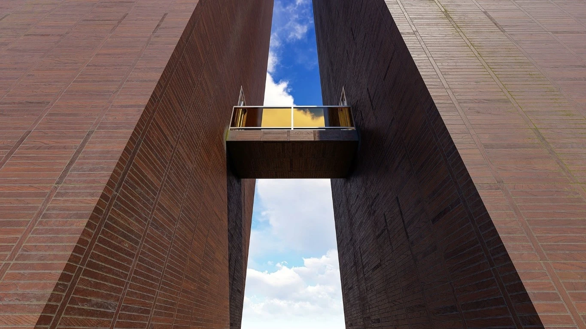

本期为《回归线》七月刊，刊物的主题是“相互的彼方”，意在浅薄探讨明日方舟创作中，“人”和“人”之间的关系。

有人说，人和人之间的关系的本质是价值联系，相互利用，因为需求而被链接；有人说，人和人之间的关系无异于需求和依靠，爱恨情仇他人地狱都不过感情的具现。在现实之中，探讨人间关系，或多或少都带了些许世故和残忍——但若是在二次元同人创作中，这种“关系”便能因超脱现实而呈现美好和单纯。

我们热衷于看到原作角色的亲昵，为自己支持角色的贴合感到由衷开心；我们期待角色情感的交接相融，无论这种情感源自亲情，爱情或是友情。而本刊将在此基础上更进一步——我们将探讨角色之间的关系，见证他们之间映照和依存：或怡悦于其相融相汇相扶持，或幽然于其渐行渐远渐无书。

欢迎阅读《回归线》，本杂志的全体编绘人员意在探寻二创的“回归线”，表达作者的“意志”，满足读者的“趣味”——祝愿您能在本刊内容中寻得让您满足，令您思考的角色羁绊，一同见证他们或是相互依存，成为彼此的依靠；或是相互扶持，照耀彼此的彼方。<eod />

 {.centering}