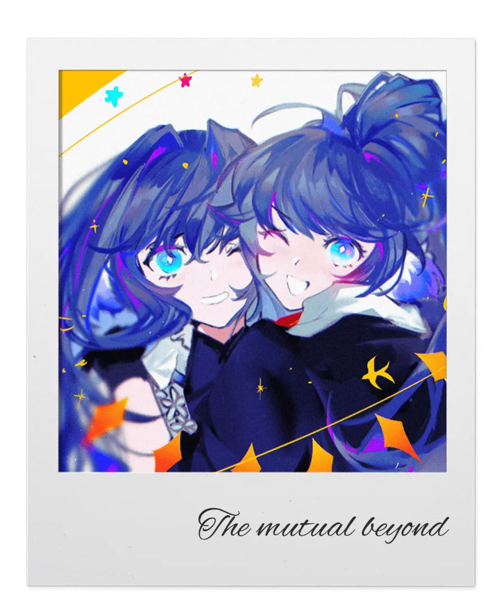
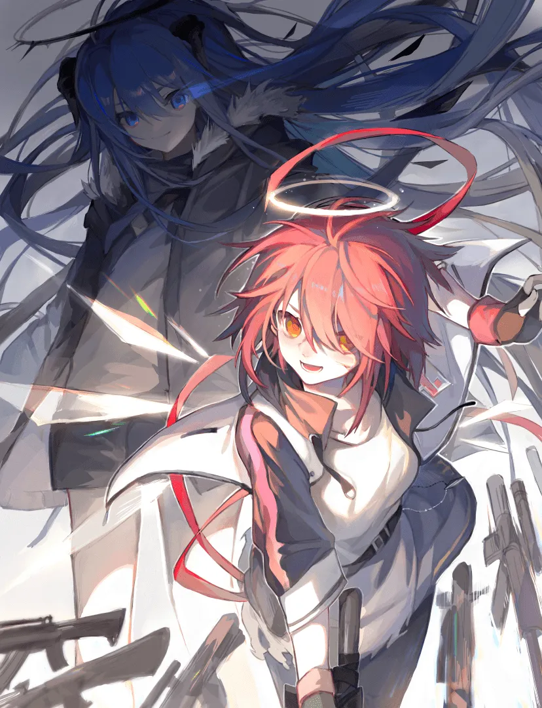
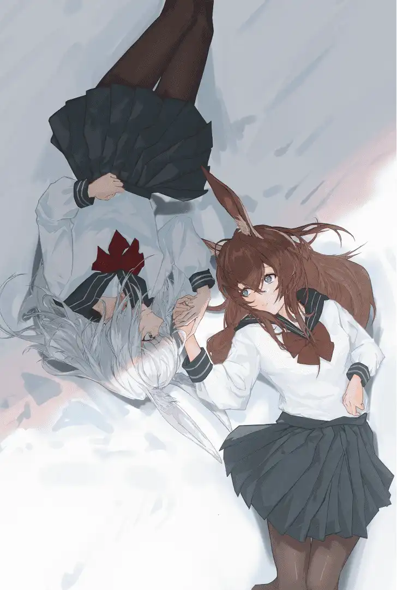
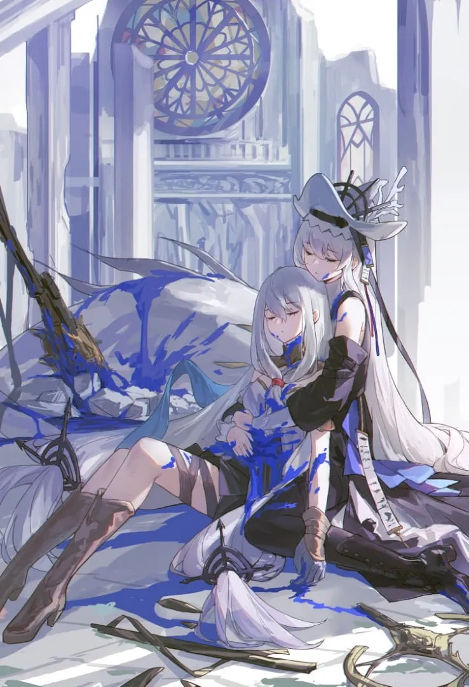
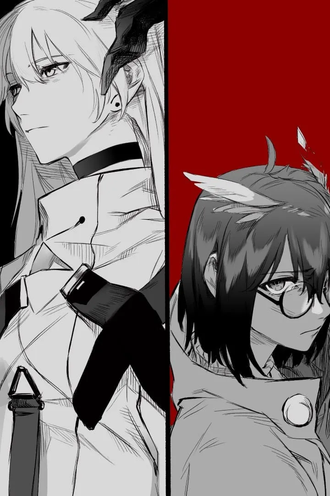
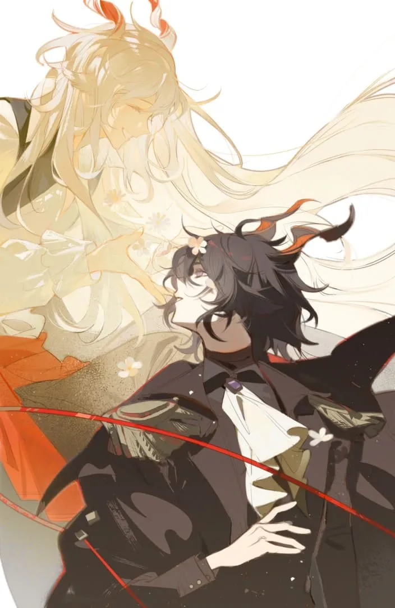

## 双星

 {.centering}

## 天使

 {.centering}

## 黑兔子，白兔子

 {.centering}

  

    我想早些认识你， 
    在事情发生的很久之前， 
    我们在雾霭之间相互理解， 
    一同见证万千回响。 
    我们会走过霜与记忆的云端， 
    如梦，如歌。
  

  

    你能够给我你的落寞， 
    我能为你编织真实而惊人的幻痛。 
    我尝试劝服你，和你渴求方向的心 
    用夜谈，用拥抱，用每一个微小的胜利。 
    我们将一同漫步在冰原冻野， 
    走向另一个结局。
  

## 静谧

 {.centering}

  

    我悄悄的前行 
    夜幕静观，星与月的舞 
    我默然潜入幽暗 
    我与深渊呢喃，祂却沉默 
    我与静谧共舞 
    十指捧不起一滴鲜血 
    回声于灵境轻颤 
    静谧虽去 
    我亦无言
  

  

    猎人走上海岸 
    她们祈祷，无忧的安眠 
    只是，天不遂人愿 
    潮水涌起，遮蔽了灯塔的微光 
    脆弱的牵挂纷纷断裂 
    我于无光的舞台上 
    独舞 
    思绪流转，我不愿想起 
    卿已不再
  

## 风暴

 {.centering}

  

    看啊，名为风暴的幕布即将拉开。 
    归家的路人来来往往， 
    顽皮的幼童不再玩乐， 
    繁华的明灯默如暗渊。 
    他们又怎会知道，未来何往？
  

  

    只有鸟雀失去了欢歌， 
    生于自然的灵沉默不语， 
    微末的火焰在挣扎， 
    飞龙也不得不自我折翼。 
    生机中了无生机。
  

  

    文明的繁盛以白骨为基石， 
    存续于脆弱的恍惚。 
    大地与星空创造静谧无言的幻象。 
    听，听啊…… 
    他们在哭泣。
  

## 舞者

{style="float:right;max-width:40%"}

薄色的夜

无声的纱

月光在夕阳下流转

是黯淡的星光或黎明的轻响

欢悦编织提琴

无论白天或是黑夜

舞台上余音绕梁

舞台下各自成章

晨雾扬起泛黄的波澜

一曲的终章

歌者与舞者走在风中

教堂在生长

## 协奏

  

    未散的硝烟无言弥漫 
    黑色的君王于大地上远眺 
    魂灵回归故土，为其加冕 
    尸骨分崩离析，它们悲泣 
    恐惧千年不朽
  

  

    挚友沉默不语 
    我是你的刀剑，是你双手的延伸 
    是你光辉王座之下 
    布满肮脏鲜血的倒影 
    我亦不悔
  

  

    女孩扬帆起航，轻吟悠扬诗章 
    怒火不存，一切随风而逝 
    纵使前路遍布荆棘 
    一步，一步 
    踏上未竟之路
  

 {.centering}

## 尘音

 {.centering}

  

    我口含一块话梅糖 
    尘世中，雨落千行 
    循心而行，回忆深埋的过往 
    欲作千言万语 
    止笔时，却一无所有 
    只贻你一缕余音 
    一丝浅笑 
    因为我不愿 
    你于光影中独奏
  

  

    血脉将彼此连接 
    我们于命运的交叉点处相聚 
    也于此分别，再无相会 
    惟有不将启明的温和良夜 
    轻抚难言之隐 
    我赠你最后的礼物 
    执命运之笔，谱写自我 
    我将死去 
    而你，将重生
  

<Ads />