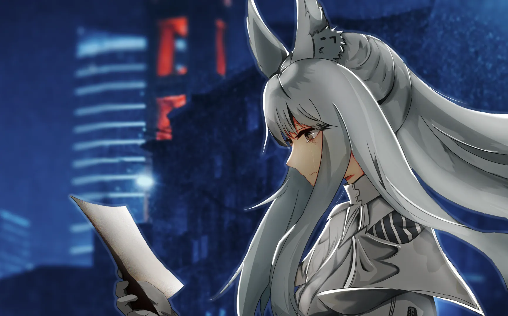

如今已然坚韧的花儿，何须羡慕水中的虚影？ {.textkai}

<!-- more -->

“我是飞越夜空的怪盗，是……”

白色的库兰塔穿过车水马龙的街道。风声，汽笛声，还有那充满年轻朝气的歌声围绕在她的耳边。黑色的长筒靴落在办公楼的屋顶上，那让她烦躁的歌声更响了——打眼一看，原来楼下便是那个演唱会的举办地点。

流行歌手的歌唱，狂热粉丝的呐喊，还有能晃瞎人眼睛的光柱……这些都是她讨厌的东西。但如果只是如此，她还不至于这么犯恶心。

哦，天哪。这该死的感觉。

库兰塔想到了早上那绝不美好的回忆。

“今天我填词的歌曲就要公开演唱了哦\~可爱的白金同学\~今天晚上要不要一起去体育场听啊~”

“该死的罗伊，我不觉得你的品味能好到哪里去。而且，今天晚上我还要执行亲爱的上司给我下达的任务。你知道么，罗伊，今天就是我的生日，你说他怎么这么不解风情呢？”

“咳咳咳……”

多么繁华的城市啊，只是和我没什么关系……欣特莱雅曾在一个阴暗小巷里得出这样的结论。当时她正忙着和一帮不知死活的私兵缠斗。记得那天灯火通明，到处都是庆祝新年的歌声，团圆饭的香气，美丽的烟花。这一切有多么美好吗？欣特莱雅并不觉得，她只知道这该死的歌声阻碍了自己听声辩位，恶心的香气让自己忽视了明显的毒雾，可恶的烟花把自己暴露给了敌人。

“到达层层包围的楼层，准备……”

欣特莱雅转身走向黑夜下的卡瓦莱亚基。广告词说，那里星河烂漫，那里千峰矗立；那是文明的杰作，那是人类的奇迹。抬头是天空，只是很不巧，今天恰逢阴云密布，似乎就连自然气象都想闪躲这座骑士之城的锋芒。白金记得，每年她过生日的时候，仙花座都会到达一年才能到达一次的星空最高点，而她每年这个时候最喜欢做的事情，就是坐在卡瓦利亚基的荒野看着仙花座一点一点攀上明星。但现在，欣特莱雅却什么都看不到。

仙花座需要加班么？欣特莱雅莫名想到。紧随其后便是片羽般的笑声——自己怎么会想这么愚蠢的问题啊。

“生日快乐，欣特莱雅。”她闭上眼睛，冲自己低声说道。此刻，欣特莱雅这朵天真无邪的矢菊花退居幕后，收割无数生命的无胄盟白金大位睁开双眼，那双金色的瞳孔像是天上的孤星，俯视世间。

演唱会的聚光灯闪烁，硕大的光柱划过办公楼的楼顶。但白色的天马已经消失在了喧嚣的夜，前往她该去的地方，去做该做的事。

……

纵使速度已经快过绝大多数民用载具，但白金的脚步仍然细若蚊声。脚掌轻点在细小的塔尖上，身下是广袤无垠的城市，人之海潮反复万千，而她的目标就在藏匿于其中。

阴云里吹来的风掀起白金的衣角，她伸出手将挡在眼前的白发捋到身后，用金色的眼观察所目及的一切。尽管这里所见寸丝半粟；尽管这里体感骤风凛冽，她仍然选择站在此处，搭弓射箭。

白金将箭矢从背后拉出，搭在弦上。金色的闪电在空气中闪烁，仿佛雷电的奥秘环绕箭头，攻无不克，无阻无碍。白色的光痕由箭尖向箭尾拉长，闪耀的光芒照耀着少女的脸庞。没有迟疑，没有犹豫，有的只是冷漠，和一丝机械作业的不耐烦。

哪怕箭矢的落下预示一位无辜者的逝去；哪怕飞溅的血水宣告一个家庭的破灭。

“将军。”

倒数三声，闪电从阴云中落下，流星飞入城市夜幕，像是为逝去的生命接引，又像是声明一场不公的宣判的落幕。金烟澄闪在塔尖片刻而过，比天明时还耀眼。只是等到细长的塔尖黯淡，白色的刺客早就消失在了空气中……

……

“诸位市民，大家好。卡瓦莱亚基电视台提醒您，现在是雷雨天气，出行请带上雨伞……”

电视台主持人甜美的声音回荡在梅兰德商场前广场的上空，好像是一个单字封号的骑士正在这里作着什么活动。雨下的很大，但人群还是不愿意离开。风雨中呐喊声不断，热情成为名为人心的锅炉中质地优良的燃料。

白金看着人群。骑士意气风发，群众呼声不断。而人群的更外围，是一些穿着统一工装正在发着传单的职员。她有些恍惚，突然想到了以前还是独立骑士的时光。

曾经的我，是不是也幻想过，成为站在中间的那个人呢？

白金侧头想象了一下那副模样。自己穿着华丽的铠甲站在舞台的中间，身姿孤傲，带起一片欢呼。她的库兰塔经纪人低声说着什么，只是这些内容已经不属于如今的她了。她的身前是狂热呐喊的粉丝们，被那位首席粉丝卡普里尼带领着，掀起声浪，化为虚荣……

也只是想想罢了。她现在穿着的是无胄盟的制服而不是华丽累赘的骑士甲；她的那个经纪人如今估计在为新签约的骑士奔波；她的粉丝们早就被其他骑士瓜分的一干二净。

哦对了……那只小羊现在怎么样了？

白金歪了歪头，想不出个所以然。她扔走这些不切实际的想象，继续向据点方向走去——初出茅庐的独立骑士已经是过去式，她现在是主宰那些独立骑士命运的无胄盟。那些独立骑士光鲜亮丽的生活注定和她无缘，除非她能有幸成为三位玄铁中的一员。

“这位女士！”

一只手突然拍在了白金的肩膀上，打断了她的思考。

该死，我刚才在想什么啊，怎么能如此放松戒备呢？

白金一边反省自己刚才的疏忽，一边转过了身子。刚一回头……她就愣住了，原本计划好的敷衍之词一下搁在喉头。

“这位女士，看看我们的传单吧。”约莫二三十岁的卡普里尼微笑着将手里那份早就被雨水浸湿的传单伸了过来。

怎么会是……她？

白金的脑子顿时一片空白。哪怕是第一次直面商业联合的数位发言人时，她也没有这么紧张过。

我……应该接过这个单子，让她早点走人。

大脑告诉白金，她应当这么做，可是这时欣特莱雅却无论怎么样都控制不了自己的手臂。她直挺挺地僵在那里，一动不动，只留下心底对自己和对对方无言的嘶吼。她张了张嘴，想对这个位卡普里尼说些什么，但那千言万语却全堵在了嘴边，一个字都吐不出去。

“女士？”

卡普里尼在库兰塔的眼前挥手，但眼前的库兰塔依旧僵在了原地。“冒昧打扰，请您了解一下。”卡普里尼礼貌地说了一句，就把传单塞进了库兰塔的手里。她一边挥手向白金告别，一边跑向下一个路人……

白金就这样在雨夜里站立着。她缓慢的低头，任由雨水在脸庞上凝聚成水滴，划过她的秀脸，然后滴在传单上。熟悉的格式，熟悉的撰写人，熟悉的金色底色，熟悉的标题样式，熟悉的特殊字体……但上面的文字却是那样的陌生。

{width="80%"} {.centering}

她的眼睛盯住了开头，打算一个字一个字地读过去。

“欢迎加入风骑士粉丝后援会，我们会经常举办……”

“……”

她读不下去了。

过去几年，她审阅过不尽其数的文件，看过无数胡言乱语的罪证日记。阅读本应当因为工作而成为一种能力，然而白金突然读不下面前的传单。

她感到一股苦涩伴着回忆涌上喉咙。独立骑士，高中生，僵做一团就像一截训练场的木头。欢喜，兴奋，就像是获得老师夸奖的孩子。第一个粉丝活动，没变的小丫头，变化了的两人。

“小丫头，怎么会是你呢……”

白金的低声说道，嗓音沾染上了些许沙哑。传单此刻湿的模糊不清，已经读不出字，只是不知道这份浸润有几分是雨水，几分是泪水了……

……

“罗伊，我回来了。”

咣当一声，黑色的高筒靴踹开无胄盟据点的大门。白金低着头，滴着水从门外面走了进来。

“（卡西米尔粗口），下次进门前能不能敲个门？”罗伊的手被吓地一抖，里面的咖啡洒落几滴在睡衣上。

白金没有回答他，自顾自地低着头，走进了里面的浴室里。

“能不能把水抖抖再进来，地毯都被弄湿了！”罗伊一边抽出纸巾擦拭着胸前的污渍，一边不忘啰嗦两句。可惜回应他的只有浴室的锁门声。

“嗯……”

罗伊摸了摸下巴，打算不再多想。他端着咖啡走向沙发，准备打开电视机看看即将播出的综艺节目。这时，他发现茶几上多了一张还在滴着水的传单。

“原来是这样啊……我可怜的小白金……”

……

白金给自己倒满了满满一浴缸的水，再扔进一块洗浴球。她将发带扯下来，脱下无胄盟的制服，露出那洁白纤细的酮体。白色细腻的头发如瀑布一般散落，又逐渐随着躯壳没入水中。

刚刚好。

欣特莱雅抱住双腿，蜷缩在浴缸里，只留下一双低迷的眼睛浮在水面上。她吹了口气，看着水泡从水里浮出来然后在水面上膨胀，破碎，消散在空气中。

“咕噜咕噜。”

水里发出令人愉悦的声音。

我刚才在悲伤什么呢？我明明早就明白的。在闪耀过后被人遗忘，璀璨不过是泡沫，光华一时是每一位骑士的宿命。

那我……为什么还是这么不甘呢？

欣特莱雅向后瘫开背脊，把脑袋倚在浴缸边上，抬头看着水雾慢慢飘上天花板，在上凝聚成一层厚厚的水气。

人们早就忘了一位叫做欣特莱雅的独立骑士。即使是那位最狂热的粉丝，那个曾经天天守在她住宅门口，只为见她一面的卡普里尼，现在也在为其他骑士发传单。哪怕传单亲手递到欣特莱雅的手里，她也没有认出曾经的偶像。

明明所有人都忘了啊，忘了那朵矢菊花。那我为什么忘不掉呢？

白金长叹一口气，站起身子准备挤点洗头膏，好好保养一下她的秀发。在她伸手的时候，她却忽然发现，浴缸对面不知何时挂上了一面镜子。

“……”

啧，想不明白怎么会有人喜欢在洗澡的时候照镜子。

照例吐槽了罗伊的审美后，白金从水里探出身子，弓着腰伸手摸向布满水雾的镜子，准备将其取下来，然后扔出窗户。至于残渣，就让那帮下属们去收拾吧。

她这么想着，镜子已经有一半在窗户外了，手却不由自主地停了下来。

我现在……和以前有什么区别？

这问题突然在白金的脑海里冒出来，于是她赶忙收回手臂，伸出手一点一点擦拭玻璃上的水雾。那精致的面庞再次浮涌而出，白金低头看向镜中矢菊花的倒影。她轻轻抚摸镜子，像是在轻抚水面，试图捞起随波而去的花瓣——直到记忆中的面孔与镜中的自己重叠。

记得当独立骑士的时候我的脸没有这么紧致，我的眼睛也没有这么锐利……恐怕这是那些化妆品的功劳吧，如今工作带来的改变也不可忽视……欣特莱雅笑了一声，她早就和独立骑士的时候不一样了。

是啊，我早就和那些骑士们不一样了，他们如气泡光华虚荣而脆弱，而我则是戳破气泡的人。再高傲，再众星捧月的骑士见到我们也会变得噤若寒蝉。如今已然坚韧的花儿，何须羡慕水中的虚影？

“他们，也不过如此。”

白金的心情一下子舒畅了起来，顺手将镜子扔了下去。她听到镜子破碎的声音，而罗伊此时多半还不知道发生了什么。啊，人生多么美好~

……

三十分钟后。

白金挼搓着头发从浴室里走出来。还没走几步，她就看见穿着睡衣戴着睡帽的罗伊倚在门框上，盯着白金。感受到那个目光，白金感到浑身鸡皮疙瘩都要起来了，她抱着胸连忙后退几步。

“死变态，你要干什么？”

“没事，”罗伊看着白金的样子，似乎放心了下来。他走上前去拍了下白金的肩膀，然后用那种前辈的语气说道，“恭喜咱们的小白金变得更成熟了。”

“……，你又在发什么病，罗伊。我要叫莫妮卡了。”

“咳咳咳，我先去楼上睡去了，记得关灯。”罗伊尴尬地咳嗽了两声，然后转身走上了楼梯。

白金没有回答，自顾自抱着衣服准备扔进阳台的洗衣机里。

“哦对了，小白金。”罗伊的声音从楼上传来。

白金脚步一顿，想听听这个油嘴滑舌的男人又打算让她干什么。

“餐厅里，我们给你准备了一个蛋糕哦，小白金。”

“生日快乐，欣特莱雅。”<eod />

（本文来自作者投稿；责任编辑：黒子；绘图：箱子）

<Ads />