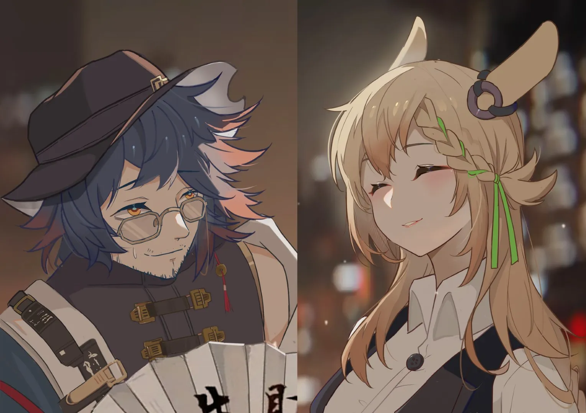

他每次看着克洛丝那双眯眯眼，都觉得自己的思绪被她看了个透，她说的做的一切都像是在钓他的鱼。 {.textkai}

<!-- more -->

人来人往的天桥上有不少流动商贩。他们大多在地上铺一张雨布，上面摆着成捆的袜子、各种型号的充电器、五颜六色的小玩具……这类地摊一般没什么客人，摊主每天早出晚归，只能挣个辛苦钱。

乌有的摊子就支在卖袜子大爷的摊边上。折叠小桌上铺着白布，一摞手机膜整整齐齐地码在左边，桌子正中架着台灯，大瓦数的灯泡把他的脸映得死白。地上立着一块牌子，上面是墨意淋漓的四个大字——巧手贴膜。

一个人影停在贴膜摊前，正准备开口揽生意的乌有一看见那张脸，立马恭恭敬敬地站起身来。“恩人哪，您今天怎么下班这么早了？”他熟练地把手机膜和台灯装进包里，桌布揉成一团攥在手里，小桌折叠起来夹在胳肢窝下面，“我这还没来得及收摊呢，回去也没法让您立马吃上晚饭，这多不合适……”

“今天没什么麻烦事，就提前溜回来啦，”卡特斯姑娘背着手看着乌有收拾，“不用着急哦，吃饭之前先休息一会也挺好的嘛~”

“是是，恩人今天想吃点什么？”姑娘踮着脚一蹦一跳地走在前面，乌有夹着桌子迈着碎步紧紧跟着。

“你决定哦~”她停在人流之中，转过头来眯起眼睛看着乌有，笑了笑。

---

乌有是几个月前遇见克洛丝的，彼时他被人陷害，身上背着官司和高利贷，让一帮打手追着慌不择路，撞进刚下班还没来得及关门的克洛丝家里。

卡特斯姑娘一只脚上还勾着高跟鞋，满脸意外地盯着面前的不速之客。

乌有反手就把门锁上了。

门外的人说姓楚的识相就乖乖滚出来，门里的克洛丝掏出手机就要报警。乌有连连作揖说自己是被冤枉的，姑娘大慈大悲千万信我最后一次，只差抱着姑娘的大腿磕头。

卡特斯最后还是没有报警，帮乌有把门外的人支走了。她可不想再被这个男人抱着大腿磕头。恶人前脚刚走，乌有后脚就抱上了克洛丝的大腿，叩头如捣蒜。

“姑娘，啊不，恩人哪！救命之恩，在下没齿难忘啊！恩人，让我留下报答您吧，我什么都会，做饭洗碗、洗衣拖地，还能看相算命……哎哎恩人您把手机放下，您知道我，我这是行走江湖技多不压身哪！恩人您就收留我吧，我孤身一人无依无靠，等我找到去处立马就走！白天我就出门摆摊，绝对不在您家赖着，而且我给您房钱，您看……”乌有抬起头看向卡特斯姑娘，墨镜后的眼睛楚楚可怜。

克洛丝噘着嘴，有些不满地看着乌有的手。“再不放开的话，我就要把追你的那些人喊回来咯~”

“是是，都听您的。那恩人您看我帮您干点什么合适？要不我先去做晚饭……”乌有赶紧站起身来，讪讪地揣着手赔笑。

“今晚我洗完澡，你给我做个 spa 吧~”克洛丝的眯眯眼弯得像一对月牙。

“哎好嘞……啊？”乌有吓得眼都直了，“sss……spa？恩人哪，是以前那种……”

“以前哪种呢？”克洛丝挑了挑眉，“小乌有~”

“啊不不不，我的意思是，这一上来就给您 spa，是不是有些太冒犯了……”乌有立刻改口。

“你就帮我按一下嘛\~你都说什么都会的，做个 spa 应该没问题吧？”克洛丝对着乌有眨了眨眼，自顾自地换好拖鞋走进屋里，“就这么定啦\~”

---

啪嗒啪、啪嗒啪……

乌有的手劲不小，节奏感也相当不错，他的手掌翻飞舞动，掌根掌心交错拍击，敲出一副欢快的鼓点。尽管一开始他硬着头皮绷着劲儿，但发现克洛丝真的只是想让他帮忙做做 spa 之后，倒是放开了不少。

“恩人哪，这力道还合适？”乌有俯下身轻轻问了一声。

“还可以哦~”克洛丝的头埋在枕头里，“小乌有，你没有偷看吧？”

“没有没有，在下一直闭着眼睛，”乌有连忙摇头，“但凡有半个字假话，天打雷劈！”

“可是，”女孩追问道，“我怎么觉得，精油都顺着两边流下去了呢？”

“不能吧，我明明把精油都抹开了……”乌有试着把手伸向克洛丝的脊背两侧。他隐约摸到女孩的肋骨，以及肋骨上方某些不该摸的部位。高个子黎博利像触电一样从床上蹦起来，他慌张地甩手，仿佛摸到了毒蛇火炭。

“怎么啦，小乌有？”克洛丝慢悠悠地问，“怎么不按了呀？”

乌有捂着眼睛，在心里不停地抽自己大嘴巴。

“恩人我错了，我不是故意的，我……我下流，我再也不敢了，您大人有大量，饶我一次……”他本打算这么说，但他不知道克洛丝究竟是明知故问，还是真的什么都没注意到。

乌有想起自己包里揣着眼罩，索性避嫌避到底。双眼被东西蒙住的感觉让他安心了不少。克洛丝又催了他两次，乌有诺诺连声，定下神来接着给她按。克洛丝的背瘦瘦的，皮肤柔软细嫩，好像稍微一用力就会掐出水来，乌有仔细地帮她放松肩颈的肌肉，手上的动作却比刚才轻了不少。

“小乌有~”克洛丝的耳朵动了动，“为什么突然不用力了呢？”

“啊？啊，恩人哪，我，我不是……哎哎？！恩人您……！”

乌有正想找个借口解释一下，克洛丝却反手抓住了他的手腕，搭在了自己的肩膀上：“再帮我按一会嘛，这几天总是加班，感觉肩膀好僵硬喔~”她的手指肉嘟嘟的，倒像是小孩子的手，乌有被这只小手抓着，酥麻的感觉从手腕一路蔓延到了心坎。

“为什么我感觉小乌有你的手在发抖呢？”克洛丝的声音有些疑惑，“是不是按得太久了呀，要不今天先到这吧？”

“没有的事，我只是……”乌有不露痕迹地深呼吸几次，压下剧烈的心跳，“恩人这皮肤这么好，我怕一使劲给捏红了，影响恩人上班。”

“没关系的~等一会记得还要帮我捏捏腿哦，站久了总觉得腿好酸呢。”

“哎哎，等会就给您按……”乌有正答应着，突然觉得克洛丝的身子动了动，随后自己眼前一亮，映出克洛丝微笑的脸和她赤裸的身子。他吓得一蹦，跌坐到地上，双手死死地遮着眼睛，嘴里一个字也说不出来。

“小乌有的眼罩，好可爱呢\~”克洛丝把乌有的眼罩拎在手里转啊转，“比你的墨镜好看多了\~好啦，接着按吧，记得不要偷看哟~”

乌有吞了口唾沫，他不敢把手移开，他恨自己生下来不是瞎子。

---

收摊以后，乌有会去超市买菜，然后赶紧回家做饭，等着克洛丝下班。不过有时候克洛丝也会像今天这样提前溜出来，缠着跟他一起去超市。

“小乌有~”克洛丝举起一捆青菜，“这个看起来好新鲜呢，它好吃吗？”

“啊啊，那个炒鸡蛋吃还挺不错的，拿来煮排骨汤也合适，就是现在不太当季，有点贵……”乌有看了看价钱，把克洛丝手里那捆放回架子上，拿了一捆少一点的。“那这个小小的呢？看起来好可爱~”克洛丝又拿起一样蔬菜。“这个啊，这个是炒肉片吃的，今天卖得蛮便宜，”乌有挑了几棵装进袋里，“恩人哪，这些您不是都吃过吗，以前……呸，这几种蔬菜在这应该挺常见的来着。”

“我很少自己做饭的，不点外卖的话就去家门口的小饭馆吃，有时候也自己煮点面或者米粥，”克洛丝摇摇头，“小乌有这几年都去哪了呀？”

“一直在尚蜀……不是，龙……嘶，应该算是勾吴吧，镇子小，没什么名气，不提也罢，不提也罢。”乌有手里拣菜，嘴上不耽误跟克洛丝聊天。

“真的？你没有回来过吗？”克洛丝歪歪头，眯着眼睛盯着他。

乌有的动作明显顿了一下。

“哪能有假呢，真是最近才被追到这来的，”乌有打着哈哈摆了摆手，“那个，恩人哪，我们买肉去吧，我给您炖锅排骨汤。”

“好呀，”克洛丝一把搂住乌有的胳膊，“那今天也辛苦你啦，小乌有~”

乌有把脸扭到另一边去，他的胳膊绷得笔直，腰也绷得笔直。

---

乌有刷碗的时候克洛丝就猫在沙发上打游戏，她在家里就穿着长 T恤和热裤，一双长腿耷拉在沙发外面。乌有擦着手走出厨房的时候，她正飞快地按着手柄和怪物搏斗。

“小乌有~！”克洛丝看到乌有，跺了跺脚，“这个 boss 我怎么都打不过去！”

他住在这里已经一个多月了，克洛丝从第一天起就对他表现得十分……亲密。他不理解这姑娘到底在想什么，按说以他们俩的交情，克洛丝这么做完全是情理之中，但问题是他们俩已经没有那份交情了，可她还是每天这么近距离地跟自己频繁接触。乌有在想克洛丝心里是不是翻篇了，或者其实在用这种方式试探自己，有时候他想顺势做点什么出格的言行，但他每次看着克洛丝那双眯眯眼，都觉得自己的思绪被她看了个透，她说的做的一切都像是在钓他的鱼。

{width="80%"} {.centering}

“这个……”乌有绕到沙发后面看了几分钟，很快就摸清了 boss 的出招套路，“恩人哪，您别急着打他，先等他……唉，又死了，您得等他把那个……完了，滚反了，他这招横扫是往右的，您不能这么躲……对，输出他，不过别靠太——近……又死了。”

克洛丝把手柄攥得咯咯响，小嘴生气地高高撅起。

“你看他呀！我都在他这死了二十几次了，怎么也打不过！”卡特斯姑娘的鼻子一耸一耸的，一双长耳朵高高地竖着。乌有的双手撑在沙发靠背上，被她一把抓住拉到胸前。

“哎哎！恩人您这是！”乌有猝不及防，手指差点抽了筋。

“小乌有，帮我打一下嘛~”克洛丝把手柄塞进乌有手里，他的手离克洛丝很近，稍微往后缩一点就会碰到她的胸脯。

“恩人哪，您看我现在这样怎么……”乌有有些尴尬，克洛丝却干脆把他的双手拽到自己的大腿上，连带着他整个上半身都贴在了克洛丝的肩旁。

“快点打嘛！我要赶紧探索别的地方呢~”克洛丝的耳朵在他面前晃了晃。

“哎哎，我打，我快点打……”乌有老老实实开始操作，视线半分不敢离开屏幕。

他怎么可能不上钩，鱼饵又香又软，还有一双大长腿。

---

克洛丝开始渐渐频繁地让乌有给她按摩。尽管乌有百般推辞，她洗完澡后总会自顾自地在床上铺好毛巾，解开浴袍趴上去。

“恩人哪，您这肩膀还真挺僵的，您平时上班的时候得多起来活动活动……”按了一阵，乌有想找些话题，顺便放松一下手腕。

“……恩人？”

“……克洛丝恩人？”

他俯下身，女孩似乎睡着了，长耳朵软软地耷拉下去。

虽然客人放松地睡着是对按摩师技术的一种肯定，但乌有此时半点高兴的感觉也没有。一男一女独处一室，女孩一丝不挂、悠然入睡，男子站在床边、手还搭在女孩的背上……从各种角度来讲他都不该再按了，甚至应该默默溜去客厅准备睡觉，可乌有总觉得自己只要一转身，克洛丝的脑袋就会从枕头上抬起来，问他为什么不继续给她按摩。

他越来越难摸清楚克洛丝的心思，有时候他觉得克洛丝还没把那些破事忘了，有时候又觉得她是真的对自己好了，久而久之他自己也开始搞不清心里对克洛丝究竟是一种什么态度。他放不下她，但错已经犯了，他没法直视那双眯眯眼，只能用“恩人”二字把自己和她隔开。即便克洛丝原谅了他，可他身上还背着官司，保不齐哪天仇家就会找上门来。他没机会也没资格对克洛丝动感情。

那讨厌克洛丝吗？答案是否定的，乌有自始至终也没有讨厌过这只卡特斯。克洛丝对他绝不是毫无戒心，但乌有知道她内心深处还是愿意信任自己的，在外面躲了这么些年，他觉得人人都在防着他，可住在克洛丝家这几个月，乌有从来没在夜里惊醒过。

乌有的指尖触碰到克洛丝肩头的几缕发丝，他把女孩的秀发捧在手心，不由自主地低下头去嗅闻。

“小乌有~你在干什么呢？”女孩的声音慢悠悠地响起，“抓着我的头发，想干什么呀？”

“啊这个，我我我，恩人哪，我……”乌有的脸霎时红到了脖子根，“我看恩人您的头发搭在肩膀上有些不方便，想给您打理一下……不过恩人您把头发保养得可真好啊，发丝柔顺不打结，一看平时就特别在意吧，哈，哈哈……”

“不要想着偷懒哦~”克洛丝没有接他的话。

乌有的心都快跳到嗓子眼了，这种事道歉就等于不打自招，可不道歉……克洛丝肯定一直醒着，自己干了什么她一清二楚。他的手悬在克洛丝的肩膀上放不下去，舌头梗在嘴里一个字也说不出来。

“小乌有~”克洛丝催了他一声，之后就又静静地趴在那，不知道是不是又在装睡。

他颇为无奈地叹了口气，这只狡猾的卡特斯把他的心吃得死死的。

---

克洛丝突然压在乌有背上时他正伏在桌前写字，快写好的一张纸立马宣告报废。

“在写什么呀？”克洛丝把脑袋凑到乌有耳边。

“嗐，这不是光贴膜挣不了几个钱嘛，我就想着拓展一下业务，收点名烟名酒，还有给人算个命求个签啥的。”“算命？”克洛丝把食指点在嘴边想了想，“好像听小乌有提起过呢。”

“都是封建迷信，不作准的，”乌有摆了摆手，“四处漂的时候跟着先生胡乱学的，挣几个墨水钱而已。”

“小乌有给我算算吧，就当练练手怎么样？”克洛丝搂着乌有的肩膀问。

“倒是也行，恩人想算什么，事业还是财运？”乌有挽起袖子，拿了一张新纸准备写。

“我想想哦……算算姻缘吧，就那种星座搭对的~”克洛丝灵机一动。

乌有的喉头一梗，手里的毛笔好悬直接摔在桌上：“姻、姻缘……那看来恩人最近桃花旺盛啊！那我就帮您好好算算。恩人您是什么星座的？”

“我啊，你不是都知道的嘛。”克洛丝戳了戳乌有的脸颊。

“哎哎，哪能呢，”乌有摆了摆手，“这是恩人您的隐私，我哪敢记着。”

“好吧，那记住啦，”克洛丝轻轻笑了笑，“11 月 22 号，天蝎座喔。小乌有是什么星座来着？”

“1 月 13 号摩羯座。”乌有笔下刷刷点点，头也不抬地回答。

“那天蝎座和摩羯座搭不搭呀？”克洛丝突然问。

“我想想，天蝎座的女生，恩人您是天蝎座的话……摩羯座的男生……”乌有捏着下巴想了几秒，突然愣住了。

他扭过头看着克洛丝，对方眯着眼睛微笑着看回来。

“恩恩恩人您这测的……我突然想起来我对星座不是特别精通，要不我帮您测点别的？”乌有觉得自己的后背有些冒冷汗。

“好呀，那帮我测测种族姻缘吧~”克洛丝保持着微笑。

“……种族您测哪对？”乌有握着毛笔的手有些发抖。

“黎博利和卡特斯喔。”

“黎、黎博利……您还有别的想测的吗？”

“测测我和小乌有？”克洛丝歪歪头，伸出手拨了拨乌有的墨镜。

乌有只觉得仿佛芒刺在背，冷汗顺着脖颈一滴一滴流进衣领，他把头转到另一侧，不露痕迹地擦了擦汗。“开玩笑的\~”克洛丝拍了拍乌有的肩，“写完就早点休息哦，我去刷牙啦\~”说完她就把双手枕在脑后，头也不回地走了。

“哈，我也觉得恩人这么好的姑娘不至于看上我这种人……”乌有嘟囔着挠了挠头。他忽然觉得克洛丝还在不远处打量着他，转过头看时却只有空空荡荡的屋子。

---

乌有手里抱着爆米花桶，茶几上摆着两杯可乐，克洛丝枕在他的大腿上，津津有味地嚼着爆米花。客厅里黑漆漆的，电视里播着克洛丝挑的电影，影片已经来到高潮，男女侠客相拥亲吻，共饮美酒。乌有看过那部片子，他知道侠女第二天醒来就会发现自己的意中人早已不知所踪。他觉得那个男人挺渣的，骗了人家好姑娘的芳心，亲完就跑，一点责任感都没有。

接下来的情节果然不出他所料，侠女孤身一人以泪洗面时，他听到克洛丝叹了口气。“他为什么要走呢，”克洛丝捏了两颗爆米花扔进嘴里，“女主角明明那么喜欢他！”

“恩人哪，这所谓人在江湖身不由己，”乌有摇了摇头，“男主角身上背着血海深仇，他留不住的。”“可是这么一走了之也太不负责任了诶！”克洛丝气鼓鼓地哼了一声。

“你看女主角哭得那么伤心，就不能带着她一起走嘛。”

“恩人有所不知，这恰恰是因为二人情真意切，男主角害怕带着情人在身边，万一哪天发生意外，自己就会抱憾终身，所以宁可把她一个人留在身后，”乌有少见地认真起来，“总比让爱人因自己而死要好。”

“小乌有也会某一天早上突然消失吗？”克洛丝的脑袋在乌有腿上蹭了蹭。

“我啊，哈哈，我还没买到车票呢，一时半会走不了的。”

“小乌有也会把我一个人留在身后吗？”

“可说不准，虽然是被冤枉的，我身上毕竟背着官司呢，要是——”

乌有愣住了，他意识到克洛丝在问什么。

“小乌有，你知道我为什么选这部电影吗？”克洛丝轻柔地把手搭在乌有腿上。

“恩人哪，往事不重提，您这又是唱的哪一出啊……”乌有想挪个地方或是干脆站起来，黑暗中只有电视机还发着光，他能看见克洛丝的脸，那双眯眯眼正盯着他的眼睛。

“我渐渐觉得我还是挺喜欢小乌有的，”克洛丝的长耳朵在乌有的腿上轻轻拂动，“虽然以前很不招人喜欢，看起来也总是不怎么着调的样子，但我现在发现，小乌有其实是个很可靠的人呢。”

“我知道小乌有总有一天会走的，我也知道小乌有心里还装着从前的事，可如果以后再也看不见小乌有了，不把心里话说出来，我会觉得后悔的，”克洛丝依旧微笑着，却没有半分嬉笑的模样，“所以呀，小乌有还喜欢我吗？”

“喜欢，啊不是，我是说……”乌有的舌头又打了结。他不敢给克洛丝承诺，他没有做出承诺的资本也没有那个勇气。

“那小乌有现在讨厌我吗？”

“自然是不讨厌的，”乌有用力摇头，“您对我的恩我都没还完呢。”

“那就是喜欢咯~”

“不，那个……恩人哪，您也知道我这朝不保夕的，”乌有挠了挠头，“把您拉进我这浑水来，不是又害了您嘛。”

“不\~对\~”克洛丝一字一顿，“是我自己趟进你的浑水的喔。至于怎么把小乌有捞出来，就不用你操心啦。我觉得两个人互相喜欢的话，后面的麻烦事都可以先扔到一边哦~”

“恩人……”乌有的喉咙动了动。

“对自己喜欢很久的女孩子叫恩人是不是不太对呀？”克洛丝伸出手摘下了乌有的墨镜，他的眼睛其实并不小，只是长年累月躲在墨镜后面，逐渐不愿意睁大。

“……克洛丝恩人……”

“嗯？”女孩故意拖长了音调。

“克洛丝……”乌有低下头。克洛丝的双手勾住他的脖颈，霸占了他的嘴唇，她的嘴里留着淡淡的爆米花甜味。

长耳朵在他的脸上刮了几下，痒痒的。

---

如果你常走那座天桥，肯定会记得桥上最显眼的位置上支着一张小桌，上面摆着手机膜、码着笔墨纸砚。旁边的地上放着一块牌子，上面是摊主手写的经营业务——巧手贴膜、测算运势、代写贺卡对联。

摊主是个瘦瘦高高的黎博利，他平时总是靠在椅子上打盹，小礼帽把脸遮得严严实实。客人来到摊前，把一张纸拍在桌上。摊主赶忙坐直了身子，定定神接过纸来。

律师聘请函……？

他疑惑地揉揉眼睛，看向面前的卡特斯姑娘，“克洛丝恩人？这是？”“我说过要把小乌有从浑水里拉上来喔。”克洛丝退后一步，背着手看乌有脸上惊讶又欣喜的表情。

“大恩大德的克洛丝恩人哪！您这、我，我这……”乌有激动得一句整话都说不出来。

“那就新仇旧账连在一起，这辈子留在我身边慢慢还吧~”克洛丝蹦蹦跳跳地走开了。

“哎！我还！”乌有干脆地答应一声，开始收摊，“晚上给您做点什么吃？”

“你决定哦~”她停在人流之中，转过头来眯起眼睛看着乌有，笑了笑。<eod />

（责任编辑：瑶濯；绘图：同安；本文来自作者投稿）

<FakeAds />
