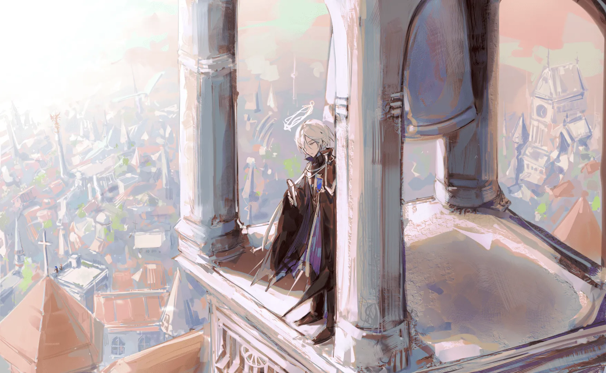

啊老人河啊，啊老人河啊，你日夜不停地流，不停地流…… {.textkai}

<!-- more -->

 {.centering}

这条河叫老人河。队伍里的萨卡兹说。他们面前的河宽广而平和缓慢，水流被过度宽敞的河道平摊到几乎不存在的地步。河床上的石子清晰可见，看起来似乎能涉水过河。

然而这几名萨卡兹并没有这么做。他们拉过河边停留的渡船，往船头挂的小筐里面投入一点钱币，开始组织人们排队分批次坐船过河。

安多恩站在最后，以防有任何人不小心落水。为什么叫老人河？安多恩有些好奇。

这个时候要过河的寻路者们只有几十名，因此很快只剩下包括安多恩在内的最后一船人了。高大的女性萨卡兹轻快地跳进船里，开始引导还站在这一岸的人们向这条船交一点钱，走上船来，渡过这条河。安多恩最后一个踏上这条古老的歌斐木小船。他小心地朝筐子里放进去一个硬币。

这时候，他看见小筐子里不只有硬币。有最大额度的龙门币钞票、维多利亚铸造的足重金币、闪耀的首饰，也有破旧的布娃娃、吃空的药片板和陶瓷小狮子。他丢的拉特兰硬币掉进去，插在小狮子和首饰中间，很凑巧地立在那里。女性萨卡兹解开缆绳，开始摇桨。

安多恩意识到，这条河远比他以为的深。作为一条河，它的清澈度居然已经超过了那些雪山下雪水融成的湖泊；甚至连贵族们争相购买的莱塔尼亚女巫仙泉水，在它面前都显得污浊不堪。他原先以为的清澈见底，实际上是超过十米、甚至接近二十米的厚重水体。只是因为惊人的清澈，它才显得接近不存在。

在这条清澈、宽广到无法形容的河流中，安多恩看见河底的水草向上延伸，鱼安静而缓慢地游过这不存在一般的水体。他把水壶灌满，用壶盖舀起一点水，喝到口中。他意识到，这条河是甜的。甜，而冰凉。他默默把所有带在身上的水壶都灌满了。在他们走过的路上，有这么好的水源的时候并不多。

我们传说，第三次渡过这条河的人，就将知道自己将如何死去。在船尾负责转动舵片的男性萨卡兹说。这样，不论他年龄如何，他都会成为一个老人。安多恩点点头。

这是安多恩第一次渡过老人河。

安多恩第二次渡过老人河的时候，先在河边过了一夜。

他们刚从莱塔尼亚贵族那好奇、优雅，又苍白僵硬如同死尸的手下逃出来。安多恩不得不多次动用源石技艺，才勉强保住了几个成员的命；他们离开光辉灿烂的莱塔尼亚，离开霓虹闪烁的卡西米尔，向东，一路向东，直到他们把城市和文明的光芒抛在身后，直到他们进入锈锤也不常踏足的荒野——星星在他们的头顶闪烁。

黄昏时，他们沉默地在荒野上跋涉。

大地干燥，扬起沙尘。有许多人已经数天没有喝到一口干净的水，有许多人因为伤口无法清洗而开始发烧。这些人被文明和社会抛弃，却无法停止思念抛弃他们的事物。安多恩知道，他带领的这些人太脆弱了，他们必须得到自然或人类的帮助，否则他们将无法撑过去；然而，他们当如何获取这些帮助，他也毫无头绪。

直到他们听见河流低沉的歌声。

当年告诉他老人河的萨卡兹已经死在他们身后，因此直到他们看见在夜幕下反射星辉的河面，他这才意识到，他们又回到了同一条河流边。所有人因为这种声音的存在都稍稍提起精神，河流的歌声呼唤他们，呼唤他们来到河边，呼唤他们坐下，呼唤他们放下疲惫，好好洗一洗。

升起火，煮上一点茶叶，坐上一口小锅。在这荒野之中的老人河里，无人回答他们的呼唤，他们也因为这种孤独得到彻底的安全。但是，孤独会引发怀念，怀念会变成哀悼。因此，当肚子被填饱后，当有人蹲在河边慢慢清洗自己的伤口时，另一些人开始唱歌。

鬼族战争在大地角落 {.textkai}

鬼族战争，人族在享乐 {.textkai}

互相厮杀从早到黑夜 {.textkai}

直到死去受尽苦折磨 {.textkai}

歌声低沉，几乎融入河水的歌声。然而人们都听到了：没过多久，知道歌词的开始一同歌唱，不知道歌词的哼着曲调，打着拍子应和。

安多恩心想：啊，这首歌也叫老人河。

有人拿出一直携带到现在的手风琴，琴声和歌声一同在星星闪烁的天空之下响起。尽管这是萨卡兹的歌谣，但没有关系，佩洛和丰蹄都可以听懂他们在唱什么，黎博利和菲林都可以唱。这是音乐。音乐可以表达很多东西，比明面上的歌词多很多很多的东西。

让我离开这泰拉大地 {.textkai}

让我离开人族双手 {.textkai}

请告诉我那清澈老人河水 {.textkai}

你在哪里，我要回去 {.textkai}

歌声慢慢消散，星空下泛起压抑的哭声。安多恩坐在大地上，仰望星空。星星依旧闪烁，天幕沉默不语。老人河在他们身边，不断流淌着，不断低声歌唱它见证的一切。

---

安多恩最后一次见到老人河的时候，尚未到衰老之龄。他饶有兴趣地观察着自己的身体一步步走向暮年，但与此同时，他并没有停下他想完成的事情。寻路者继续壮大下去。他已经是某种程度的传奇；没有见过他的人传说，拉特兰的神明眷顾他，所以他即使在大地上流浪已久，依旧没有得矿石病。他对这些传说一笑置之，与此同时，他比任何人都更加清楚，他只不过是一名凡人。

这一天，他因为一点小事，需要回到拉特兰附近。按照当地向导给出的路线，他们一路在荒野中穿行，在傍晚时来到一条河边。河水在晚霞的光辉中低声歌唱，水流清澈，却幽深而无比缓慢。

……老人河。

安多恩瞬间明白了。

向导想对他说说这条河上的规则，但他摆摆手拒绝了，走向河边，拉过渡船来，在小筐里投进去一枚硬币。

龙门钞票，金币，首饰，药片板，小狮子，布娃娃；他当年投进去的那枚硬币还在小狮子和首饰之间插着，他笑了笑，心想这大概是某种仁慈。

他上船，听着向导滔滔不绝地讲述老人河的故事，微笑，点头，正如几十年前的那一次一般。船行到河流中央，他听见一声惊叫。

一个孩子落水了。

他想也没想，就跳下河向她游过去，从背后抱住她的身体，把她送回岸边。孩子湿淋淋地爬回岸边，母亲感动地哭泣，抱着她不断和他说谢谢。他微笑，想说没关系，想说这是我应该做的，想游回自己的船上。在他的胸口，一阵剧痛袭来。他意识到他无法呼吸了，他挣扎着想握住什么东西，但没能做到。他的嘴唇没入甜蜜的河水，然后是他开始泛白的发丝，他依旧清澈的双眼，他的鼻尖；他往下落，饮用过两次的河水灌进他的鼻孔，轻声告诉他，他将如何结束。

于是，他彻底理解。

这是他第三次渡河——也将是他知晓，自己会如何死去的时刻。河面的辉光逐渐远离他的意识，他不断下坠，闭上眼睛，屏蔽了自己的光环和翅膀放出的光线。就在这里。他将死去，他将被这条河清澈的河水埋葬。他因此成为一名历经一切的老人。

他的意识里，只剩那首萨卡兹的歌谣：

啊老人河啊，啊老人河啊

你日夜不停地流，

不停地流。<eod />

（责任编辑：瑶濯；绘图：深海鱿鱼酱；本文首发于 LOFTER）

<FakeAds />