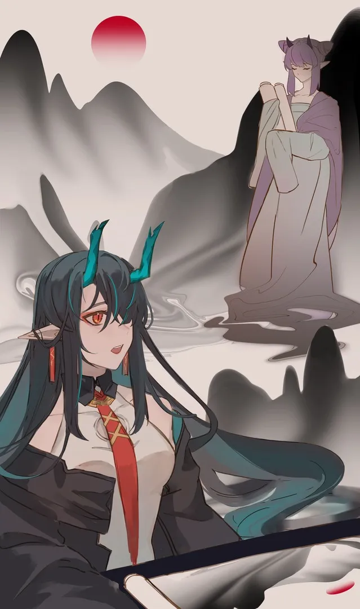

她举手投足便能改变现实，却不能理解她心中的应许之愿。 {.textkai}

<!-- more -->

山道间云雾缭绕，清晨湿润的空气让画纸边缘微微卷曲，夕闭目端坐在案前提笔凝思，忽地落下一笔去。水墨宣纸接触的瞬间，整个世界仿佛向着落笔处倾斜而去，就连山壁上千年矗立的老松也弯下腰为这一笔投去注视。

夕淡淡地哼了一声，墨水噼啪作响，沁入纸张的缝隙，舒展开画纸的容颜——那洁白上逐渐铺满与山间景致完全相仿的画面。虽然并不满意于这仿佛临摹一般的描画作品，夕还是小心翼翼地将画纸卷起来放入匣中。

就在这时，山道拐角处传来了脚步声，清脆如马蹄踩踏玉石。夕侧目看去，身着戏袍一般紫色衣饰的少女缓缓上前。她手里捧着一卷画纸，珍惜小心如无上贡物，像是要把它献给山上的神仙。认出了来者身份，夕不无意外地问：“你又何必白走这一趟？”

“能再见仙人一面，不可说是白走。”女子不卑不亢地站定鞠躬，将那画卷小心地捧在怀里，“况且就算仙人不在意，我也应当回报了恩情才是，望仙人谅解领会。”

听到回报一词，夕心里升起了一丝笑意，只是面上仍端庄淡然地说：“于你是救命之恩，于我只是随手添绘一笔，我并不为了受礼而绘，也不认为你能给我带来什么……得以打动我的东西。”

这话说得委婉，凡间给出的报答对夕而言毫无价值，且那作为神仙的夕其实并不需要与凡人讲什么礼仪。

女子说：“我为您带来了一幅画，虽说无法与仙人的画作相比，但这幅画您一看便知，其中神妙我难以口头传述。当然，您若是不感兴趣，我向仙人拜谢后即刻下山。”

果然如此，能让她略感兴趣的，也就只能是画作了。于是夕终于转过身来，正对着紫衣的少女：“不要总喊仙人，我的名字是夕。”

大致是听出夕并无拒绝之意，少女眸子亮了起来，欣喜地连连点头：“夕仙……夕姐姐，那我可将画卷打开了？”

夕点点头，少女连忙去拉开缠着画卷的细绳，拿住画的一边，将它缓缓展开。

就在这时，一种熟悉的存在感从打开缝隙的画纸间流淌出来，顷刻便充斥了整片山林。夕面色不变，呼啦一声站起身，一手抓起装画的木匣，一手从背后扯出赤红的笔迎面斩去。原本夕并不打算顾忌少女，但那一瞬间她留意到了对方脸上的惊讶，只得松了些劲，打算一笔斩断少女手里的画卷。

然而夕还是慢了一些，一只金色的龙爪凭空伸出接住了这一笔，猛地一扯想要将其抓到手里。这巨爪甚至要比山道还宽，若是整条龙降临此处，恐怕能盘踞这整个山顶。

夕顺势松开手，赤色的笔在离手后噗地扩散为一大团墨迹，困住了遍布麟片的龙爪，金色巨爪与墨黑线条纠缠在一起。眼见龙爪暂时无法脱困，那龙奋力从画里探出了更多躯体，而墨水眼看就要消耗殆尽。

少女吓得往后退，踩空了台阶摔倒在地上，正好躲开了从画卷里伸出的巨大剑刃。那刃似乎是连接在巨龙的尾部，随它身姿甩动，金色锋芒从山道上横扫而过，朝着夕拦腰斩去。

夕早有准备。

她伸手一拍画匣，整个人凭空消失。待到巨剑斩进山体，木石发出低沉的悲鸣时，她又一次出现在原处。趁着剑身嵌进山石中，仙人用手指点了一下山壁的石块，于是那被切开口子的山体如同痊愈一般恢复如初，将龙尾死死咬住。

巨龙尚未伸出头部，看不见画外的情况，发觉自己的一只爪与尾都被牵制住，便更用力地撕破画卷的约束。夕表情淡然地绕开挣扎着的龙爪，将呆坐在地上的少女一把捞入怀中，随后抱着画匣与惊慌的少女从山上一跃而下，转眼便消失在了云雾中。

---

不一会儿，脸色惨白的炎熔在夕的搀扶下慢慢走回了山顶，见到两人的年满意地说：“什么嘛，你俩这不是演得挺好的，一开始还那么义正言辞地拒绝我，入了戏比谁都认真咧。”

“如果下次还有跳崖这样的戏码，我是真的不会来了。”炎熔恼怒地说。

“如果下次还有岁相，我就不帮你画片场了。”夕冷冷地说。

年从夕手里接过炎熔，安慰似的拍了拍她的肩膀：“好啦好啦，可是真的很帅欸！电影播放的时候，那种毫无预兆突然从悬崖上跳下去的惊爆感，可是任何剧情转折都难以比拟的！而且刚才夕宝一脸冷漠从岁相旁边走过去的样子，完全可以截下来当海报，最好贴得满罗德岛都是……”

一旁的夕翻了个白眼，炎熔眼前一花，原本的山麓场景就变成了炎熔的房间。年仍保持着那个姿势站在面前，而夕已经不见了踪影。炎熔眨了眨眼：“还真是方便的能力呢，尤其是对于拍电影来说。”

年也不意外，甚至都没有转头去找夕的身影，仍旧是没心没肺地笑着说：“哎呀，那当然了，不仅是可以随意布景，特效也全省了，甚至跳崖都不用拉绳子。唉，夕宝可是每一个大导演梦中的助手兼主演啊！”

“你还敢提跳崖！”炎熔顿时又来了劲，“我的剧本里为什么没有这一段啊！作为一个演员，每次拍戏拿到的剧本都是一段一段的就算了，甚至还有我不知道的部分！你到底有没有当过导演啊，别人导演都是一开始就把整个剧本分享给剧组的吧！”

“喔，你还知道这个？看来你对电影真的很上心，第二张海报就用你的镜头好了。”年作出一副感动的样子，仿佛站在她面前的是剧组里连续五年的最佳演员，“至于为什么你的剧本里没有，当然是为了拍出你临时的反应啦，这可不是怀疑你的表演能力哦。”

炎熔知道这家伙胡搅蛮缠的厉害，只能无奈地说：“那你倒是跟我说说，我俩跳崖之后怎么活下来？下一部分的剧本可以给我看了吧？”

说完，她在房间里找出一包茶叶和一壶水丢给年。年接过来，直接把茶包丢进水壶，将手掌贴在了壶底。几个呼吸之间，壶里的水就热闹地沸腾起来。随后她将茶壶放在一旁的桌子上，从桌下的抽屉摘出两个小盏摆在壶边，向炎熔做了一个请的手势。

这也算是年大导演的一些规矩，不喝茶就不聊电影，不过炎熔也乐于饮茶，总好过去陪她吃一锅肛肠科直通车。

炎熔拉开椅子坐在桌边，盯着那壶茶发呆——相较于以往遇到的炎国人，年总能把茶泡得更好喝，但炎熔怎么使劲儿也没看出这泡茶手法有什么不同。年一眼看出炎熔在想什么，抱着手得意地摇尾巴：“用冶钢的手法煮茶，大炎可没有第二家哦。”

“所以我其实是在喝铁水么？”炎熔将茶斟满两个小巧的盏，轻轻嗅了一下浓郁有力的茶香，就见到年端起滚烫的茶水一饮而尽，仿佛只是吃下了一颗糖。眼见年露出满意的表情，终于打算开始讲剧本，炎熔坐直了身子。

“话说这岁相藏在画中，突然暴起想要杀死夕仙人，虽然没能成功，但也借此机会脱困。作为世代镇压岁相的家族，夕家里的兄弟姐妹也都来到了这一处山下的小镇里，商讨打败岁相再次封印的方式。”年晃着折扇，像个说书人一样娓娓道来，炎熔则是听得满头大汗，忍不住问：“喂，这不会是真实故事改编吧！”

年摇摇头：“那不至于，要是岁相跟夕画的这小虫一个样，我一只手就能把它塞进炉子里。而且要是真能把岁相封印起来，我们早就这么干了咧。”

炎熔尴尬地撇撇嘴：“所以这就是一个全家人一起打岁相的故事？听起来也不怎么有趣。”

“我还没说完呢，家族虽然到齐了，但并不能与岁相抗衡，在短短一天的时间里，与岁相数次交手下来基本上就没几个还活着了。”

年轻描淡写地说着，内容却把炎熔吓得茶都拿不稳了，没等她追问，年径直站了起来，在房间里来回踱步：“活着的自然就有夕，或者说那个时候就只剩下她一人。岁相无比得意，认为今日可斩断这被封印千年的仇恨，正打算对夕宝痛下杀手，却被夕的暗手重创，最终同归于尽。”

“……”炎熔一时间什么话也讲不出来，但是脸上的表情无疑表达了她的想法——

“就这样？”年将折扇收进手心里，笑眯眯地居高临下看着炎熔，“怎么可能呢，或者说，夕从一开始就做好了准备，这一切都只是画中的世界。”

“还是听起来很勉强，就好像电影结尾跟我说这都是主角在做梦。”炎熔艰难地摇头，心里对年导的评价又扣了几分。年自然不知道她这会儿已经成了负分导演，继续讲着她的剧本：“电影最开始夕就在画画，还记得你入镜之前她的那幅画么？就是那个时候，她把这一方山水全部装进了画里，只是因为画得与外界一模一样，没有任何人发现。”

炎熔挑起眉：“连岁相都没发现？”

“本来这么大动静，以岁相的实力很容易就能感觉到，问题是那会儿它老人家自己躲在另一幅画里呢——就是你抱着的那张画。夕只是把画关进画里，可跟岁相没关系，它自然也发现不了了。”年又沏了一盏茶倒入嘴里，“夕从一开始就知道岁相会在画里伏击她，也早就想好了要怎么应对它。那些所谓被岁相杀死的人，也不过是被夕从画里赶了出去而已，比如被她带着跳崖的你就是。”

这样说来，这电影就没那么烂了。炎熔暂且把刚才扣的分又加了回去，长出一口气：“你终于掌握了巨兽电影的核心了。那些体型庞大的怪物，从来就不应该是电影的主角，真正得以担任主角的，一定是利用智慧抹平身形差距的人类。”

“喔，小炎熔居然也会夸我的电影了，看来这次的剧本真的很不错哦。”年又露出了得意的神情，“最后我打算让夕彻底封闭这片画境，永远与岁相被镇压在这个世界里。虽然对夕宝来说有些残忍，但这只是电影啦，而且还是夕宝第一次出演，给她安排一个壮烈一点的结局也挺好咧。”

“你只是在报复吧。”

---

“你知道么，其实你这个角色是有原型的。”年似乎来了谈兴，歪过身子撑在桌上看着炎熔，期待她的反应。

不出所料，炎熔瞪大眼睛指着自己：“我？可是我连名字都没有……不，你的意思是，夕认识我那个角色？”

“没错，其实也正是如此，我才没在剧里也用那个名字。”年难得考虑了一下别人的感受，“夕宝虽然不至于难过，但肯定也不会开心就是了。”

炎熔终于还是对夕产生了好奇，这个看起来有点病怏怏的画家，愿意来给她爱胡闹的姐姐拍电影，本身就是十分意外的事情。要知道在此之前，夕亲口说过年的电影就是对艺术的侮辱——虽然也有一定姐妹情深的成分在里面，但并不算夸张。而今天她肯来本人出镜（现在想想不一定是本人），还帮忙画了片场和岁相，一反平时看到年就躲进画里的模样，想必也是因为剧本里的什么才会如此。

“这事儿得从我第一次见到夕说起，那个时候司岁台给我整了个活……”年惬意地撑着下巴，“我是指，给我安排了个事儿咧，说是有个偏远地带的小村子出了点状况，让我去看看。”

“你跟司岁台关系这么好？”炎熔有些奇怪地皱起眉，“我听说他们只恨不得把你们钉在棺材里。”

“要是棺材够宽敞能打锅也不是不行。”年傻笑着摆了摆手，“帮他们干点儿活，下次来找我麻烦的时候就会嘴软一点，我心情也会好些嘛。反正后来我就去了那个所谓的村庄，发现那地方一个人也没有。”

炎熔有些没听懂：“什么意思？根本没有人生活在那里？”

“字面意思，村子里一个人也没有咧。我检查了那些屋子房子，发现里面很多生活用具还保持着被使用的状态——或者这么说，这些人在正常生活的过程中，被人一瞬间弄不见了。”

“喂，听起来像电影情节，你不会是在耍我吧！”炎熔狐疑地盯着年，红色的龙一甩头发：“怎么就是电影情节了，那些没有被天灾信使发现的过于落后的居住地，在天灾降临的瞬间被抹去了生机之后，看起来也是这个样子。”

想象了一下那种画面，炎熔有些不寒而栗，一时间讲不出话来，只能任由年继续说下去：“我没有看到任何战斗、天灾、撤离的痕迹，所以怀疑司岁台忽悠我过来，是因为他们猜这事儿跟岁有关系，于是我就用了一个最简单的办法进行了验证。”

她用手比划了一个大大的圆形，然后在某一个位置打了个响指，炎熔看得莫名其妙，年解释道：“我用炮仗把整个村子炸了一遍。”

---

“等我回过神，那些人就都出现了，哎呀，他们很正常地生活在村子里，好像我一开始看到的全都是假的。我以为这些村民才是幻象，跟几个人聊了一下，居然发现他们居然都是真正的人，反倒是我格格不入咧！我又问了一圈村子里有没有什么说得上话的人，他们给我指了村子里唯一的老师，也就是你的那个角色。”

炎熔有些意外地指了指自己：“居然是老师……可是那个村子不是很落后偏僻么，应该是那种称为先生的私塾吧。这种人以生意为主，怎么会成为村子里说得上话的人？”

年耸了耸肩：“我也这么觉得，直到我见到了那个人，才知道她是支教。”

“知教？什么意思？”炎熔一时没听懂，重复了一遍，年耐心地解释道：“简单地说就是，她是从大城市来到这里来当老师的，也没什么人会付她工资，村子里的人都很尊敬她。”

炎熔肃然起敬，她喃喃着那个词，突然想起来什么似的问：“她叫什么？”

“黎。”年认真地说，“黎明的黎。”

“黎明……等下，难道说是……”炎熔愣了一下，瞪大了眼睛看着年，眼里闪动着不可置信的光芒。年无奈地点头：“其实这事儿也没那么玄乎，至少在我们现在来看，是很好猜到谜底的。哎呀，无非就是夕画了一幅画，把那些凡人全部带进了画里，他们自己毫无察觉，而外界的村庄可不就空出来了。而这个黎，肯定也是跟夕有关系的，可我从她那儿套了不少话，发现她根本不认识夕，更不要说发现自己在画里。她就和其他的人一样，只是在正常的生活而已咧。”

“夕为什么要这么做？这毫无意义啊，生活在画里反而还不会因为天灾之类的问题头疼。所以夕只是想要保护这些村民？”炎熔推测道。

“我本来也以为是这样，直到第二天早上。”年又把茶壶拿过来热了热，慢悠悠地给两人续上茶，直到被吊胃口的炎熔生气地催促时才继续说下去：“第二天一切都复原了，每人都是第一次遇见我，没人记得前一天发生了什么。我猜破局的人会是黎，可那个黎也一样没有前一天的记忆。”

这个答案让炎熔有些茫然：“这……夕的画只能维持一天的光景，所以就会一直重复同一天？是这个样子么？”

“我研究了好久好久，在那个村子里日复一日地重复，观察每一个人的状态，大概过了一个月才得出来结论。”年用指尖摩挲着小盏的纹理，“其他人是被画卷重置了记忆，而黎是唯一不一样的人，她根本就只有那一天的记忆。为了验证我的猜想，我又用掉了好多好多炮仗，终于找到了藏在某处的始作俑者——也就是夕。我认出她是最近才觉醒出自我的碎片，就没有跟她打一架，现在想想挺可惜的。”

“所以你就要在电影里欺负她，你们姐妹的关系可真好呢。”炎熔翻了个白眼。

“你有立场说这种话么？”

---

 {.centering}

---

黎与神明第一次见面，在她生命最后的落日时分。

春日山里的溪水湍急而冰冷，黎被水流带到神明的面前时，已经奄奄一息了。那时的神明刚刚从混沌中醒来，对外物好奇而谨慎。她见到一个将死之人，本打算随意打发，黎却主动向神明提了请求。

她希望神明能帮她把怀里的一箱书带回村子里去。神明哪里看不出来，那箱笨重的书籍不仅会导致黎在湿滑的石阶上失足，更是让她难以从水中挣扎靠岸，而现在她居然希望那箱书能回到村子里——而不是她自己。神明知道，虽然她是真神的碎片，举手投足的力量足以改变现实，但根本不能挽回已经要逝去的生命。

那个时候，神明自出生以来第一次生气了，面对黎提出的请求，神明毫不掩饰地表达了自己的愤怒——

你为什么不自己回去？

那东西有什么重要的，只要她愿意，可以画出万卷书经，得以让无数人饱览而受益匪浅。可这个老师要是死了，就真的死了，毫无意义的，为了一些破书就死掉了。

她没办法画出有自我意识的生命，画出来的东西也不能在现实中行动。

于是她行了一件有些幼稚、但又匪夷所思的神迹：她保留了一日的黎，将黎所生活的整个村子都映入画中，让全村的人都陪着最后的黎不断重复那一日。年知晓这一切后哑然失声，她无法责怪神明的自私，也无意评判教师的取舍，只是向神明坦白了她的身世，问她为自己取了什么名字。

那时的画卷已经进行到了日暮，村里的人仍旧说着相同的话语回到家里，黎与学生们告别，打算第二天早点起来去两个山头外的驿站取书。神明与年站在最后的日光里，同根同源的姐妹相顾无言，神明终于开口说：

“夕。我的名字叫做，夕。”<eod />

（责任编辑：黒子；绘图：黑泥型芙芙；本文来自作者投稿）

<FakeAds />