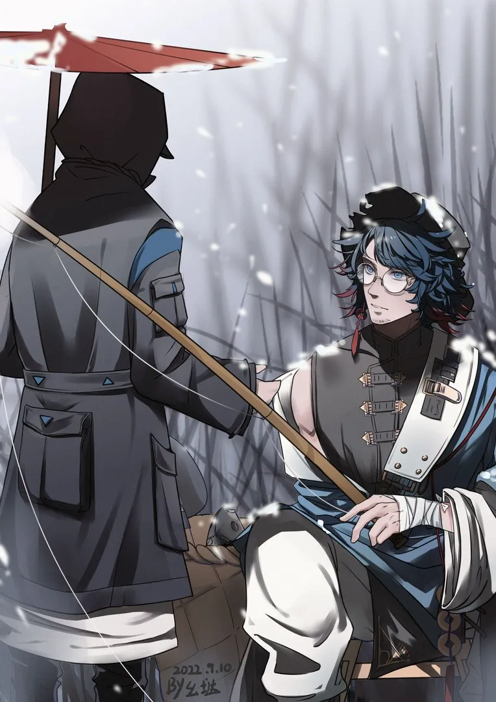

大雪中，灯笼一盏，足以照亮他回家的路。 {.textkai}

<!-- more -->

{style="float:left;max-width:30%;margin-right:2em"}

乌有提着钓竿，立在尚蜀的酒店外。

一水的红色灯笼挂了满街，等候着归家的旅人。大炎的风俗里，人在过年的时候，总还是要回家的。

他张了张嘴，白色的雾气就从嘴边逸散开来——此刻天黑着，他从歇脚的酒店里出来的时候，大家都还在睡。只有笔尖划过纸面沙沙作响，博士还醒着。

乌有抬起了盖得严实的斗笠，算是和他招呼了一声，便匆匆离去。毕竟，他现在的样子，也的确不大愿意让恩人她们看见。

他鲜少有脸色这么难看的时候。

---

昨日梦里，故人来回，却唯独不见师父。师姐说，师父去钓鱼了，他才迷迷糊糊想起，新年快到了。

“天也不早了，我们还要准备年货，你去喊师父回来吧？”

师姐手里的擀面杖不停，后院师兄剁馅的声音吵得人耳朵嗡嗡的疼。于是他提着灯，走到江边，却看到师父倒在血泊里。她的眼睛温柔而慈悲，静静地看着他。

{style="float:right;max-width:30%;margin-left:2em"}

雪还在簌簌落落的下着，他压了压斗笠，转身走进了风雪。耳边，却是多年前的声音。

“子虚师父，看在老爷子也曾经在您这里做过那么多年的工的份上，您……权请……哪怕让他做些粗活也好，这孩子……听话。”母亲的声音哽咽，“我们……也是迫不得已。”

她把乌有往前推了几步，“快……给师父磕头。”

他被母亲推着踉踉跄跄上前，跪了下去。那座上的黑衣女子却始终沉默着，许久之后，她才长叹了一声。

“留下吧。”

---

他很少见师父笑，但是师兄师姐欺负他的时候，师父总把他护在身后。听师姐说，师父年少时被人伤过，还留了疤。

“那人……最后如何了？”

“师父杀了他。”

“师父……你那时，疼不疼？”他小心翼翼地问出口，廉子虚脸上却没什么波澜。

“或许吧，忘了。”

---

廉子虚爱钓鱼，但是师兄师姐们很少能有耐得住性子跟着她在江边蹲一天的。只有乌有天天跟着，算是个例外。子虚虽然平日冷肃惯了，但是对这个小弟子终归是疼爱的。路边总会给他买个零嘴，路上牵着他吃。

他已经记不清那是到了第几个春节了，天很冷，师兄师姐忙着贴春联，挂灯笼，便叫他去寻师父。回来时，师父顺手给他买了个热红薯在手心里捂着。

走了几步，他却看见一个小姑娘怯生生的喊他。

“哥哥……我能不能买你一半红薯，我娘说，我娘说她想吃。”

那小姑娘虽然衣裳旧了些，缝线的针脚却细密干净。

他把还没剥开的红薯给她，那小姑娘仔仔细细掰了一小块，怕凉了，把袄子脱下紧紧包着，将铜板放在他的手里，跑走了。

只是走了几个街道，她们远远听见了幼猫一般的哭声。

“娘亲……”

小姑娘像幼鸟一样靠着草垫上的母亲，红薯滚落在雪地里。母亲已经咽气了，她的衣服单薄，手上还生着冻疮，唯一的袄子大概是留给了她年幼的女儿。母亲的眼睛望着巷子的出口，温柔而慈悲。

但是小姑娘浑然未觉母亲的死去，只是在母亲怀里一遍、一遍地喊着。风雪哽咽，她的喊声渐渐弱了下来，最后只得费力抬起了母亲的胳膊，把她环抱在了怀里。

“娘亲，我来找你了。”

巷外鞭炮噼啪响着，隔绝了这里的一切。

{style="float:right;max-width:30%;margin-left:2em"}

那时，他抬起头，雪下大了。他那时候第一次觉得，冬天原来这么冷。回去的时候，子虚没有说话，只是摸了摸他的头。

“乖孩子，莫哭。”

---

他又想起院里的梧桐树，冬天不如秋天那般好看，却也高高挂着灯笼。大雪中，灯笼一盏，足以照亮他回家的路。

“乌有。”

乌有从回忆里清醒过来，江边风雪依旧，手中的钓竿动了一下。千山俱白，唯江心一点水痕。

他抬手使力，一条通体黑色的大鱼破水而出，溅起点点寒芒。

博士撑一纸伞，在岸边迎风雪而立，黑衣白雪，墨伞青松。

待乌有行至岸边，风歇、雪停。

博士向他伸出手，好似多年前在江边等待师父归家的少年。

“乌有，回家了。”<eod />

{width=60%} {.centering}

（责任编辑：广英；绘图：幺垯；本文首发于 LOFTER）

<FakeAds />