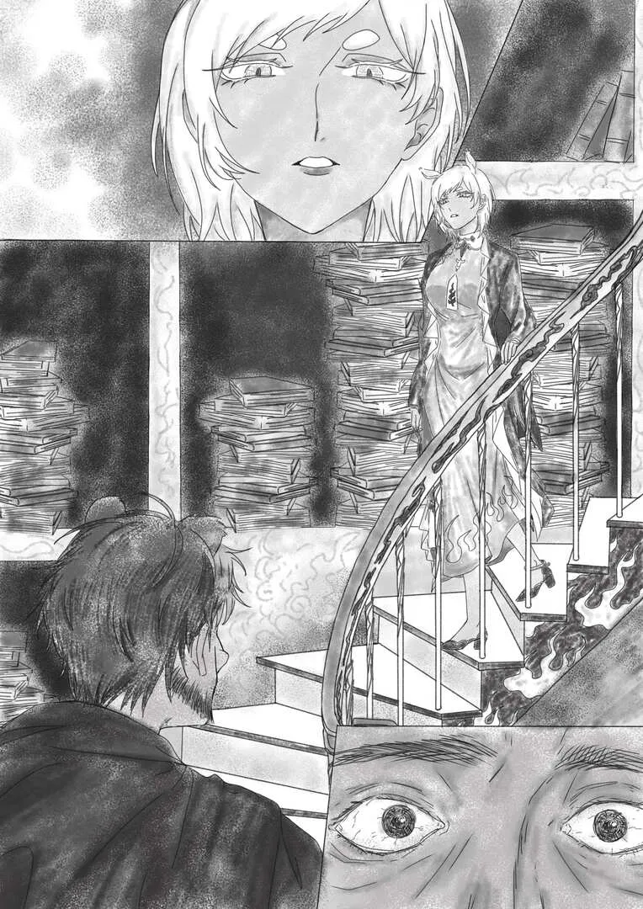

罔者两手空空回到家乡，神明却将故乡追忆埋在永恒之下，无念无想。 {.textkai}

<!-- more -->

（改编自《塔希里亚故事集：愿望》）

风。

炽风

焚风。

萨尔贡之南，最南之地。黄沙在焦躁中起起落落，伴随着风掩盖了当空的艳阳。

男人趴在尸体上，上上下下摸索起来。他从尸体的衣兜里摸出了一个水壶，不加掂量便慌忙拧开壶盖，将壶嘴凑到嘴边。

没有水。

将空水壶丢在一边，尸体胸口挂着的一片铜铁铸币吸引了男人的注意。他将挂着铸币的绳子解开，略带厚度的金属片被其拿在手中。

“天有烘炉……地……生五金？”铸币正反面的纹理是古炎国语，男人生涩的将其读了出来。

一股讽刺意味浮涌上来。这是出行前，有人赠予尸体主人的护身符——看来这护身符也只是凡物罢了。话虽如此，男人还是把它塞到身上一个还算完好的衣兜中。理性本该告诉他抛去一切重物，但理性已在漫天的黄沙中消磨殆尽，只剩下一点点迷信的力量，支撑着男人的脊梁骨。

他站起来继续走向热土深处，身影在风沙中一点点消失。他摇摇欲坠，身着的外衣已经在狂风摧残下破烂不堪。包囊已经被狂风裹挟的砂砾撕碎了，变成了一条毫无意义的条带挂在男人身上。走了许久，他眯起眼，看见那蒙蒙的风沙中逐渐显现出建筑。

这是焚风热土，泰拉大地之南的死亡区域之中惟一的建筑。这是那传说中神明的奇迹，是他有所怀疑却一直相信的那个神话。

男人一步一摇晃，疲惫的大脑只是无意识的让嘴里重复那几个字——

“……杻阳山阁，被遗忘者的图书馆……”

为了找到这里，他和曾经的伙伴们在无尽的沙漠中，和热量，脱水，源石流搏斗了两年又五个月。其他人都死了，但是他却站在了愚蠢私欲的终点。

他颤颤巍巍的向着那边走去，双手颤抖，脚步凌乱。沙粒中埋藏的碎石刺穿了他的靴子，却没有刺穿脚底厚厚的茧。他一步一踉跄，跌跌撞撞走向图书馆的大门门扉。

绯红的厚重木门发出吱呀吱呀的，令人心酸的声音。

脚下是坚实的楠木地面和大理石混砖，其之上一排排书架矗立，宛如顶天立地的巨人耳目。男人环顾四周，发现不只是书架，墙壁上也布满密密麻麻的凹槽，摆满了书籍和纸卷。

视野中还有一座大楼梯，上面的吊杆和扶手也被镂出深槽，放满了莎草纸和成叠的小册子。抬起头，万千天体从拱形的天花板倒垂而下，微微旋转着散发着星星的光芒。这神话般的场景，是他穷尽不长的人生所追寻的地方。

几滴眼泪从他的眼睛里滴了下来。脚生了根，他就像是书架一样矗在那里。直到楼梯上渐渐有脚步声传来，他才回过神——有人下来了。

男人傻傻的看着对方一步一步从楼梯上下来，无意识的在心底盘算组织着即将说出的话语。那个女人和他在哥伦比亚时，听到的流言传闻所描述的模样一模一样：形似库兰塔的身躯，披散着短短的白发；带有些许黑色条纹的黄色长褂下，一条红色的尾巴满不在乎的拖曳着。

是那位传闻中的神明。

“好久没有来访客了。”女人瞄了他一眼，略过了男人，向他身后的书架走去。“要看书就自己找着看吧，动作小心点。”

“我……我要实现愿望。”

他开口了，犹犹豫豫，心底继续盘算着接下来的话语。“我穿过了焚风热土，穿过了饥渴和干热，穿过了哥伦比亚的世俗，莱塔尼亚的愚昧，萨尔贡的落魄来到了这里。焚书官，愿望之神啊，我希望……我希望您能实现我的愿望。”

焚书官看向男人，两人一时间陷入无言的沉默。

“你确定你要许愿？你思考好，你究竟想要什么了吗？”

“对，我思考好了。”男人坚定语气，大声地说。

焚书官注视着男人的脸，无形的眼神慢慢渗入男人面部肌肉上沟壑的深处。片刻后，她摇了摇头。

“你没有思考好，你的脸上带着期待和迷茫。你需要知道，短暂的思考是为了得到更加清晰的思维，分解心底的情感是为了更加了解自己。可是，你是否客观的了解自己呢？”

“你是说你无法实现我的愿望？”

“怀疑是好事情，但事实并非如此。守信是我的品质，无论来者来自泰拉之北的萨米亦或泰拉之南的伊比利亚，我都不会扫他们的兴致。如果你觉得你思考好了，那么就说说你的愿望吧。只要是愿望，我就能实现。”

男人吸了一口气，这一刻他感觉自己长久以来没有刮的胡子是那么糟心。

“我，”他说，“我渴望得到财富，取之不尽的财富！我受了这么多的苦，不管是这次大漠远行，还是我前半段糟糕的人生。我抛弃了如此多的东西来到这里，这是我应该得到的！”

“嗯，财富。”焚书官晃了晃脑袋，在台阶上坐了下来。她用双手捧住脸颊，自下而上看着男人，“很现实，上一个到来的雷姆必拓人第一次提出的也是这个愿望。好吧，那么你想要怎样的财富，怎样来让你的财富取之不尽？”

“您这是什么意思？这个愿望不能实现吗？”男人瞪圆了眼睛，质疑道。

神明叹了口气，“当然可以，但是你究竟需要什么财富？卡西米尔的监证会利用消费和暗中血腥的操纵聚集财富；乌萨斯依靠漫长的征战和庞大领土的税收充裕帝国的国库；而古老的断罪帝国更是依靠着矿藏和艺术以至极富。这些国度富有，却未必拥有财富。我希望你获得的，是你真正想要获得的，没有偏差。你说你需要财富，你需要的财富是什么？想想。”

“财富就是钱！这有什么值得争议的吗？这样，我许愿能在哥伦比亚，拥有一家垄断公司！我可以垄断哥伦比亚……不，我可以垄断泰拉！我可以动用这家公司的力量，从这片大地的每一个地方为我赚钱！我可以躺在由龙门币和骑士斗技场的包厢券构成的海洋里游泳，用钱实现我所面对的任何一个问题！”

{style="float:right;max-width:40%;margin-left:1em"}

“想法不错。”焚书官点点头，“那么，请你告诉我，你的公司，你的金融帝国是怎样运作的呢，他又该垄断什么呢？这是一个复杂的问题，复杂到如今它还在困扰世界上那些如你愿望般的人。想想。”

“什么？”男人很惊讶，“只要它在运作就可以了！我所做的只需要让金钱流到我的口袋里。我许下这个愿望不是为了给自己带来问题的。”

“这不是问题！这是必要的思考！”焚书官训斥，“当你不知道该如何运作它，你就不能掌控它！我能给你一瞬间的辉煌，但是如果你不能解决这个问题，你的辉煌就会衰败。我让你站的越高，你就会摔得越惨。想想。”

“那就给我永久的辉煌！让它一直持续着，运作着！直到到我死去！”

“你不懂吗？长久的辉煌在于构造它的基石是否闪耀。不会思考的人，拥有最愚钝的剑，能够将无比伟大和永久的辉煌撕碎。我可以让你长出羽兽的翅膀，可是如果你不学会怎么使用它，你又怎么能够飞翔起来？想想。”

两人沉默了一下。

“你是说我不配拥有这样的愿望？”男人扯着衣角思索，说道。

焚书官站了起来：“你现在还配不上。问题不在财富，而在取之不尽之上，想想。”她向着楼梯上走去，“如果想好了，就跟上来。”

男人忙不迭跟着她走上楼梯，在她的身后喊道：“我知道了。给我源石锭，用之不竭的源石锭吧，这样我就有了无尽的财富！给我一个袋子，能从里面取出无穷无尽的源石钉！”

“这个愿望我不能实现。”神明走着没有回头。

“为什么？你不是愿望的神吗？”

焚书官停了下来，她伸手从楼梯雕空的栏杆里抓出一卷莎草纸，“因为这个愿望自相矛盾。当你能够让源石锭取之不竭，其本身已经不再拥有原本的价值。这个愿望的本质是无限的输入，它要么是毁灭经济的基石，要么则让“货币”一文不值。”

语罢，焚书官突然唱起言语晦涩的曲调来。她手里的那卷莎草纸在歌声中凭空燃烧，一缕纸灰飘过，黏在男人的胡须上。

“那我应该怎样得到财富？”男人将毛须上的飞灰撵掉，问道。

“你是为了获得财富而追求财富吗？想想。”

“……有了财富我就可以拥有……我可以买下一切，包括我想要的官职……权利！我直接许愿权利不就行了吗？”男人左手握拳一拍右手，“我需要权利！我可以超越拉特兰的教宗或是莱塔尼亚曾经的巫王，如果权力的权柄被握在我手！”

“不错，你了解了权利和财富相辅相成——这是好事情，你做了微弱的思考。那么，你想要怎样的权利呢？想想。”女人继续往楼梯上方走去。男人跟在她的身后。

“这样，我要成为大势力的统治者。我拥有权利，整个国家都是我的后盾……不对，让泰拉成为我的王国吧！我要做国王，我的命令无人能够抵抗！”男人不加犹豫。

“哎。你追求的不是权利，是统治。”焚书官叹了口气。

“有什么区别吗？”

“当然。权利抽象，统治而在抽象中更加趋于物质。于是，又是那个问题了，你该如何维护你的统治呢？”

“什么？不，我才不要费心思考如何维护统治呢！我只是想要用我的权柄享受我能用金钱换取的一切！”男人有些急了，双手在空中比划着，“在这基础上，不管是怎样的统治都能够接受！”

焚书官点头：“那么你所追求的不是权利也不是统治，而是享受啊。享受当然没有问题，特权阶级利用阶级权益从不有违天理。那么，你知道如何在享受的同时，维持自己的统治吗？”

男人有些不难烦的抓着自己的胡子，“你都知道我做统治者是为了利用权利给自己带来享受，那我为什么要费劲心机维护自己的统治？”

“你停止思考了。你没有发现，你的享受是建立在统治之上的。官位盛，天佑皇，常胜利，沐荣光——官位不盛何来荣光？统治是一门学问，一门付出和收益都很沉重的学问，维护统治是你的付出，享受是你的收获。想想。”

他们一步一步向着楼梯上走去。在一个楼梯的转角，男人再次开了口：“神啊，你知道矿石病吗？”

焚书官点了点头。

“我想，请您赐予我治愈矿石病，这种令人憎恶的绝症的能力吧！这样，这样，那些本该去死的矿石病人，就会自发的聚集到我身边，加入我未来的国度，成为我的臣民了——这就是我想到的统治方法。”

焚书官摇了摇头

“什么？为什么？这难道不是统治的方法吗？”

“虽然你思考了，但是如果你是为了统治而许下这个愿望的话，对不起，办不到。”

“为什么？”

“矿石病患者所得的是两种病。一种叫矿石病，一种叫“偏见”。当大量的矿石病患者涌向你的国土，你觉得会不会出现某些“消灭堕落患者的正义之师”呢？而你的国度的矿石病患者，又是否会仇恨其他的健康之人？而这份仇恨又是否会上升到以国家为单位的层面呢？你会发现，你只能治好肉体上的病症，却不能治愈心灵上名为偏见和仇恨的毒疮。”

她说完，两人又一次沉寂下来。些许之后，男人踌躇发声，语气中充满了失落。

“我有点明白，但是又不太明白。被你否定之后，我发现我不知道我要怎么统治，我也不知道统治是为了享受什么。”

焚书官转过身：“这样吧，我给你讲一个故事，一个跨越了时间和空间维度的故事——但是你要思考。你知道大炎吗？”

在焚书官古波不惊的视线中，男人点点头。

“想象一个类似曾经大炎的国度，一个曾经繁荣昌盛的国度。它叫清，曾是一个庞然大物。每个时代辉煌的标准都不一样，但是它曾经是最辉煌的。”

“他的统治者不擅长统治吗？”

“它的统治者不擅长统治。这个王朝的历代统治者擅长的是勾心斗角，驾驭权术，分配经济，爱德爱民。这些很适合治理，但是不适合统治——因为统治还需要的，正好是他们所缺失的：他们没有眼界。外交，权衡，利弊，分配，近臣的梳理，政治的交流，机构的增减，体制的改变……这每一件事情都是统治的一部分，而且所需要的还随着时代在不断增加——所以统治是一件付出如此之大的东西。清就是缺了一点点，导致它被其他的统治者按在了泥土里。他们失去了宫殿，失去了戏人，失去了价值连城的文物和站在皇城土地上的权利——最后大清亡了，连自己都失去了。统治不在，自然享乐也无所适从。想想。”

“可恶，这样的话我也无法统治了。那我需要什么？”男人揉起了他乱糟糟的，不时掉落沙粒的胡须。

就在这时候，他听到了“咣铛”一声。男人低下头，发现原本衣兜里那面大炎铸币护身符不知为何掉了出来。

焚书官弯下腰，将铸币捡起，沉默片刻。“你思考好你的愿望了吗？”她问。

“愿望……对了，我知道了！我需要知识，很多知识！我所缺的就是它，所以我无法驾驭取之不尽的财富，也无法得到长久的统治。”一道灵光突然闪过男人的脑袋，他大声地说道。

“这又是另一个问题了。知识，知识。”

焚书官从身侧的书架中取出一本厚皮书：“假设，这是你可怜的大脑，如今它被开发的可能就只有那么一点点，一点点——然后我把知识，很多知识灌了进去，不加分辨。那么你就会傻掉，连调动自己头脑中原本的存货都做不到。最后，你的脑袋会变成这样。”

语罢，她突然又唱了起来。伴随着晦涩言语编织歌声的第一个小调过去，这本厚皮书突然迸出了剧烈燃烧的火光。在狂躁烈焰的扭曲下，最终书本燃烧殆尽，飞溅的火星就像是在嘲讽男人一般。

“我怎么会控制不了自己的头脑呢？”男人十分疑惑。

焚书官嘴角微微上扬：“你当然能控制你的头脑，但是那些知识还不属于你那可怜的小脑瓜。你刚才的行为愿望，就相当于只是在学习。你还需要思考。学习而不思考，带来的就是你头脑的迷茫。思考而不学习，你所思考的东西就没有价值。只是这世间的人面对问题，往往是在思考之后才意识到需要学习。”

“思考是本能，是人性，也是让那些知识一点点熔化流进你的脑子的烙铁。只有想过，才知道对不对。只有想过，才知道怎么用。我的愿望不会满足只知道伸手的人，但如果那手明确的知道什么是自己想要的，我就会将那东西塞进他的手心。”

男人十分为难，“可是，我就是为了节省时间，才希望获得知识的……”

“所以你思考不够。想想。”

两个人又陷入奇妙的沉默。在台阶交错的地方，焚书官选择了一条向下的楼梯。男人跟在后面，抬起头，发现那些发着光亮的天体似乎更加近了，连上面的纹理和气旋都可以看得清清楚楚。但是随着他们越来越向下，清晰的又变的模糊了。

男人开口了，“刚才的所有问题似乎都再告诉我：我不配。我要让自己配起来。给我时间，无穷的时间，我可以思考，我可以无止境的学习和思考，我就能学会我想要会的一切。我想要成为永恒。”

整座图书馆似乎瞬间安静了下来，天体微微颤抖，光芒不再那么稳定了。

焚书官随着他的话语落定而停下脚步，接着慢慢的转过身。她的脸上不再是那种无所谓的表情了，一种淡淡的悲伤爬了上来。

她开了口，不再是那种带着引导的语气，仿佛是在陈述一个残忍无情而冰冷的事实：

“我可以把你变成一座石雕，然后给你灌输所有的知识；我可以把你搬到伊比利亚灯塔废墟之上，让每一个海嗣都能在一海里外看到你。你可以在伊比利亚潮湿的空气和深海中弥漫出的淡淡恶意中慢慢思考和学习。你不会开裂，也不会死去，更不会消散。外界将与你无关，你会成为泰拉大地的一部分。这就是你要的永恒。而且，这也不是永恒。”

她的眼神很冰冷，就像是内心深处最刺骨的寒冷被激发了出来。男人吓得后退了一步，结结巴巴的开口：“你，你……你不是神明吗？”

“在漫长的思考中我只知道了一件事情。”焚书官一字一句：“永恒是终点，死亡是终点，所以对于生命来说，永恒是死亡。想想。”

“那你让我永远的活着！”

“有生命的石头也算是活着。”

“那就让我永葆青春，让我不会老去！”

“那么你仍然会死！暴风雨，饥饿，矿石病，中毒，甚至被口水淹死！”

“那你让我不会被杀死！”

“你没有思考！人被杀，就会死！你知道什么人是不会被杀死的吗？”

焚书官的语气突然收敛了回来，就像是暴雨狂风之后的一滩死水。“你知道的。”

“……是死人。”男人低下头，“这个问题没有意义。”

“不对，是对你没有意义。我有万千方式能够曲解你的愿望，但是只有思考并把握本质才能真正把你想要的东西握在手里。永恒是什么？永恒是比永远更久。想想。”

“我不知道。对于我短暂的一生，一两百年已经很久了。有些人被人记住，他们难道不是永恒吗？”

焚书官再次叹了口气，给自己挂上了名为面无表情的面具。“夏虫不知冰寒。你要知道，被记住就会被遗忘。我也是遗忘的神，杻阳山阁，这里也叫被遗忘者的图书馆”

“我不明白。你可是神明啊”

“神明就该明白吗？”

“神之高贵，又怎么不会明白永恒呢？”

“高贵？你知道大炎曾有一位真龙，击败了神明吗？”

男人惊讶的怔住了眼：“……怎么可能？”

“怎么不可能？很久很久以前的大炎，随着震天撼地的龙吟响彻世间，一匹匹名为神的巨物倒在龙剑之下。有的神被格杀，有的神被赦封，还有的神逃走了。其中一位逃走的神明逃啊逃，逃向南方。为了苟且偷活，躲避那个如日中天的国度，逃走的神明只能借助具现人们的遗忘来被遗忘……这也叫永恒吗？”

他们已经再次走回图书馆的最下层。焚书官一只手握着那块铸币护身符，另一只手的指尖滑过一本本放置楼梯栏杆镂空雕槽里的书。

“找到了。”

她伸手将一卷发黄的羊皮纸拿在手心里，伸出手给男人展示了一下，“你看，这是什么？”

男人犹豫片刻，说：“这是纸。”

“这也是一位老人。很久很久以前的老人。”她把手收了回来，抖了抖羊皮纸张，“曾经在米诺斯附近，有一个硕大的帝国。这个老人居住在帝国的边陲，孤僻，死板，无妻无子。但他是大学者，身为黎博利的他奠定了那个帝国的法律基础，他的法让帝国统治万民，扩大版图。他将传统习俗和法律融合，创造了适用于帝国所有人的万名之法。”

她用几乎是捧读的平淡语气和男人讲述老人的故事。“他的死亡是从某时某刻就注定的。那时候，贵族们在商讨改变法律的事情。他提着一只鸡冲进议会大厅，用几乎滑稽的姿态对所有人高举那只鸡，并喊道‘鸡不能变成其他东西，法律也是！’贵族们在，贵族所围绕的君王也在，所有人都在。那位君王曾经也在他的门下学习过法律。”

“但是他还是被吊死了，身体挂在广场上，在太阳下曝晒。贵族们洋洋得意，君王冷眼相视，不知情的平民议论纷纷。什么都没有改变。”

“三天之后，大雨开始落下。雨水汇成洪流冲刷一切。洪水摧毁城墙，冲倒贵族的良田，带走君王的宫殿，当然还有平民密密麻麻的简陋土屋。帝国消失在洪水之中。”

“百年前，那里的遗迹被如今的米诺斯发掘了出来，老人的事迹也伴随着文物出土。但是时过境迁，该忘记的被忘记，该消散的被消散。如今最后一位知道老人思想的维多利亚瓦伊凡学者正躺在他的摇椅上艰难的咳嗽呼吸，而老人活在他那脑袋里。不过，时候到了。”

她再次唱起了晦涩的歌曲，随之羊皮纸边缘逐渐燃起黑色的火焰。火舌几乎是舔舐着爬上纸张的边缘。一瞬间，火焰燃了起来，纸张分崩离析涅成飞灰。

“他被忘记了。”焚书官说。

飞灰很快消失在空气之中。

男人注视着火焰，“也许他只是不够伟大。”

“不够伟大吗？看来刚才关于神明的寥寥片语还不够啊。抬起头来，你看到那些用于照明整座杻阳山阁的天体星球了吗？”

于是男人抬起头，看着那些微微旋转的天体，“是的，我看得见。”

“那些天体，超过三千五百万颗行星，是一个帝国。”

男人惊讶的看着焚书官，“帝国？”

“对，帝国。那是一个抽象可能的未来，人们在天空中如同蝗虫般扩张，带着他们永不消磨的愚昧和智慧，贪婪和良知，找到并开辟了无数如同泰拉的大地，将整片遥远而广阔的天空卷入星际战国年代。这是最后的成品，疆域超过数以亿万个乌萨斯，人口总计超过数兆亿的巨大帝国。这是银河帝国。伟大吧？”

“……对。”

“但是他灭亡了，灭亡于庞大臃肿，灭亡于官僚和失败的统治者。最后的最后，一个园丁失手杀死皇帝，成为了导火索。天空中每一片领土纷纷宣布独立，统治者和夺权者剑拔弩张，你我都无法理解的恐怖武器飞向每一个角落，混乱和内耗在瓦解整个帝国。时候还没到，不过总会发生的。伟大和渺小，在杻阳山阁没有意义。”

男人无所适从，他在原地转了个圈子，问道：“你给我看这个是为了什么？我不知道我应该许什么愿望了。”

焚书官走向另一排书架，“我只是向你展示了我的工作——我当初为了活下来所付出的代价，并和你证明了你所不知道的永恒的荒谬。所谓永恒，比永远更久。幸运的是，人不能也不可能超越永远，自然就不能抵达永恒。”

“如今，我的工作是将记忆从大地中连根拔起，许愿不过是副职，思考不过是消耗时间的方式。君王和皇子争夺权力的时候，我在；乌萨斯的铁骑踏入萨米的时候，我在；人们敬畏而为之忙碌的时候，我在；背叛者追寻政治，欲望和理想的时候，我在；争执臣服于我，希望臣服于我，生命臣服于我，死亡臣服于我。只有思考未曾臣服于我，它无时无刻不在困扰着我。所以我推崇思考。”

她走到另一排书架面前，举起手中的火把照亮一本本书的书脊。

“所以你要思考，你可以细细的思考。去坐在那边的台阶上吧，想想，如果伟大不可得到，又有什么渺小是自己渴望的。想想。”

男人照做了。他坐了下来，被风沙划破的裤子垂在台阶上。随着他的坐下，焚书官消失在了视野中。他用牙齿嚼着干硬的嘴唇，整个杻阳山阁再次陷入沉默。

良久，他说道：“你知道她的对吧？”

“对，我知道，那个你因为决定穿过焚风热土来找我，而决定抛弃的卡斯特女孩。她对你很失望。”焚书官古井不波的声音从身后传来。

男人用力嚼了嚼嘴唇：“这样，我许愿，我希望她能再次爱上我。你可以做到吧？”

“呐，如果是这样，我确实可以。我是不介意把自己当做春药或者迷魂药的。”

“不对！”男人喊道，“这个愿望不是你所说的那么龌龊的东西，我希望的是……”

突然焚书官的手从身后按住男人两侧的脸颊，并让他抬起头来。她低着头看着男人的脸，慢慢的问道：“有区别吗？想想。”

她松开了手，男人的头又垂了下来。

“这样，我，我，给我一个朋友吧，让他们有向导的智慧，铁皮的执着，机灵鬼的幽默和……”

这次焚书官没有等男人说完话就打断了他：“你说的那几个人的尸体，就倒在杻阳山阁外不到一千步的地方。为什么你不许愿复活他们呢？”

男人低着头一言不发。在他背后，焚书官嗤笑一声，“啊，抱歉，我不知道是你下的手。”

“复活他们啊，也行啊。”男人慢慢的说。“我想许这个愿望。”

“你确定你要许下这个愿望吗？”焚书官绕过他身边，慢慢的向着楼梯往下。“当你为了争夺淡水和食物而割开他们的喉咙，打破他们的头骨时，你可曾想过如今你所想要许下的愿望？你确定这就是你来到这里本所想要的？想想。”

“……这不是我的本意，我太罪恶了……我要许愿，之前那个愿望，让我拥有治愈矿石病的能力吧。我要治愈这种疾病，为他们赎罪。”

“你是要为了赎罪而许下这个愿望吗？你是救助者，患者是被救助者，而你死去的朋友又是什么身份呢？他们甚至不是死于矿石病。你的赎罪只是为了自己，却要皇而堂之的牵扯上你的朋友，这难道不是一种伪善吗？你又该如何保证你的赎罪之心永不变质，永远像一个圣人一样救治他人不求回报？思考，并反驳我，或者换个愿望吧。想想。”

“……你是对的，这只是伪善。或许将来的我会变心，我无法保证。”

似乎有眼泪滴落。

“我，我迷茫了。我为了来到这里一趟，把我的人生全毁了。让我重活一次吧，让我从头开始。我会好好活的，我不会再让自己站在这里的。”

“哦？你确定是这个愿望？你要知道，重活的你还是你吗？当这个愿望实现，现在的你已经死了。你真的没有什么生命的留恋吗？”

“而且，要知道，一个人的死法，反应了他的活法。”

男人又一次沉默了。整个杻阳山阁微微响起抽泣的声音。

焚书官弯下腰，对着不知适从的人轻声说：“思考，你要认识自己，认识自己想要什么，又能够掌握什么。不用着急，在杻阳山阁，你有足够的时间思考，我给你足够的时间思考。”

她站起了身，正要准备转身往回走时，男人又一次开口了。

“我，我知道了。我想回去。”

“……回去？回哪里？”焚书官侧过头，她的手里握着男人从尸体上捡来的铸币。

“回到雷姆必拓的乡下，回到我的家。我抛弃了一切，变现了土地，卖掉了所有资产，并和所有人借了一大笔钱，希望能够跨越焚风热土找到这里。但是，但是我好累啊，我想要在我的床上睡上一觉，歇一歇。我所追寻的伟大是我不能掌控的，我所期盼的渺小是我曾经拥有的，但是当初我还没有丢干净，我还有家，还有一张床……””

“对，你没有丢干净，你还有名为“家”的归处。但是如果你决定回去，你这次旅途就没有了意义。辛苦劳累，回到故乡还要面对庞大的债务，而你却什么都没有得到。你确定你要许这个愿望吗？想想。”

“……我确定。我已经不奢求什么了。而且这次旅途不是没有意义的，至少我知道了永恒的荒谬，和思考的价值。其他的，其他的就当是为我的无知和不思索买单吧。”男人慢吞吞的说。

焚书官闭上了眼睛，“那么，你的愿望正在实现——你现在回去吧。我向你保证，哪怕再大的沙尘风暴，你的残破躯体都能够穿过；只要你还站着，那恐怖无常的热土高温就不会击垮你。只要你还在前进，饥饿和干渴的苦痛就不能把你怎么样。现在去吧。”

于是男人站起了身，晃晃悠悠的向着图书馆的门口走去。

就在他推开杻阳山阁绯红色大门的时候，他听到身后的焚书官的声音：

“我希望，那个失魂落魄的男人能够回到他的家乡。只要他走在回家的路途上，饥饿和干渴就不能把它怎么样。他会穿过狂风和烈日，就如同奇迹庇佑一般。我让他的床下藏着黄金，能够等值支付他所欠的债务。当他到了家乡，他的朋友们就会在应该出现的地方出现，什么也不记得。这是我希望发生的，我是愿望的神。”

男人转过头，疑惑的眼神带着惊讶。见他停住了，焚书官突然大声说道：“再告诉你一个好消息，那个女孩从一开始就没有对你死心。所以现在，快走吧。”

“你……”

“这是你的愿望，我必然实现。伟大亦是渺小，我都将一视同仁。快走吧，别忘了在你的故乡，你还有一张床。”

男人点点头，走出了绯红色大门。随着门的关闭，焚书官再次沉寂下来。

她将手里的那枚“大炎古铸币”拿在手心晃了晃，随意的丢在了地上——铸币和地板碰撞，发出沉闷的撞击声，回荡在图书馆内。

“你一直在吧？这么曲曲折折，就为了找到我，不觉得太大费周章了吗？”焚书官突兀的对着铸币说道。

伴随着话语，铸币一点点的分解散灰——白褂持扇的女性从铸币的灰烬中站了出来，面带玩世不恭的笑意。

“那当然是因为前辈你难找啊。”她笑着说。

焚书官闭上眼睛：“怎么称呼？”

“叫我年就好咧。”

“找我干什么？”

自称年的女性毫无顾忌的打量起这间大图书馆来：“欸，原本呢，我是想寻求你的帮助的。”

“帮助？”焚书官嗤笑，“我又不是你那十二个兄弟姐妹，更无意参加你们的家庭会议。我只是个当初不愿意向大炎俯首称臣，便落得这般田地的家伙——我又该怎么帮助你？”

“你应该知道，我的兄弟姐妹们咧，有人和我是站在一边的，有人不在乎，但也有人疯的很彻底呀。对于我们这种状况，一个仍然存活的“神明”，多多少少能够提供一些指导意见吧？”年咂咂嘴，“原本我是这么想的咧，直到看到现在的你，我就知道前辈你的状态肯定混乱的不行呀，打个比方，就像是加满各种汤底的火锅底料。”

焚书官摇头：“守宫断尾，求自保罢了。”

“所以，希望你帮忙的计划落空了。相比之下，我倒是有了新的疑惑。”年晃动着手里的扇子，“那个刚刚离开的男人，你引导他许的愿望，似乎毫无意义吧？”

“他已经带走了最重要的收获。”

年一晃扇子，打断了她的话并追问道：“你嫉妒他吗？他没有将过去丢干净，还为自己留了一张床。你呢？为了活下来，把一切丢的干干净净的你呢？代价又是什么呢？你难道真的不想回到大炎吗？”

“……请回吧。”短暂沉默后，焚书官微微低头。

年举起手吐吐舌头：“最后一个问题咧，问完就走！我和许愿者们耽搁了你不少焚书的工作吧？为什么不从一开始，就赶我们走呢？你引导来访者的每一秒，都在耽误你的工作吧？不过是许愿而已，直接满足就行了，至于许愿者的结局会怎样，我想不关你的事咧。”

“伟大亦是渺小，他们最真切的愿望我一视同仁，你也是。”焚书官回答道，“至于耽搁的工作……”

她转过身，看向身后将要焚烧的整座图书馆和万千藏书，“我还有很久时间可以用来完成它们。”

“很久时间？”

“对，很久，比永远更久。”<eod />

（责任编辑：广英；绘图：珈茗；本文来自作者投稿）

<FakeAds />