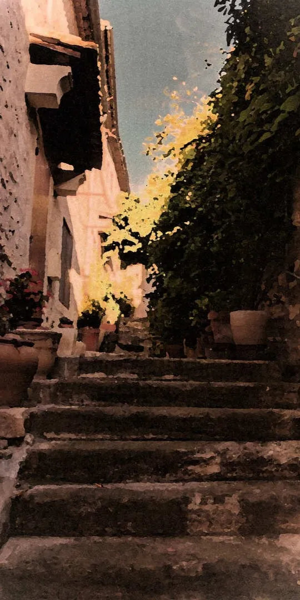

{.image-left-float style="max-width: 45%;"}

这是《回归线》的九月刊，刊物主题是“乡愁和归处”。我们将在本期刊物中，浅薄探寻“故乡”和“人生”，“乡愿”和“愁思”的关系。

在传统中国社会中，作为一种心理状态的乡土情结，弥漫于阶层，贯穿于朝代，也反映在古往今来的诸多文学作品之中。“陟岵瞻望父，明月故乡映何处；陟岵瞻望母，烟波江上人愁雾；陟岵瞻望兄，鸟恋旧林寻草木；陟岵瞻望祖，唯恐无死颠夜夙。”

故乡如线，牵引游子归去；乡愁如镜，倒映魂归之处。在明日方舟的故事中，“归处”是许多人绕不开的话题——只是有人站在寻求归处的起点，垫足眺望；有人站在落定归处的终末，有念无想。杜宾教官心念玻利瓦尔这片战乱的土地，等待着时机成熟回归之时；泥岩带领志同道合的萨卡兹同僚前往莱塔尼亚，期盼在这繁荣且腐败的国家寻求可得安稳的魂梦故乡。乡愁所谓人之期盼，故乡不过应之所望。

欢迎阅读《回归线》，本杂志的全体编绘人员意在探寻二创的“回归线”，表达作者的“意志”，满足读者的“趣味”——祝愿您能在本月刊物内容中见证，一个个角色在“心中应许之地”前的迷茫，坚定，执着，和念想。读懂他们的愿望，明晰自己的期盼——“故乡依于人生，却无需宿主；乡愁弥于无形，却自有实体”。<eod />

