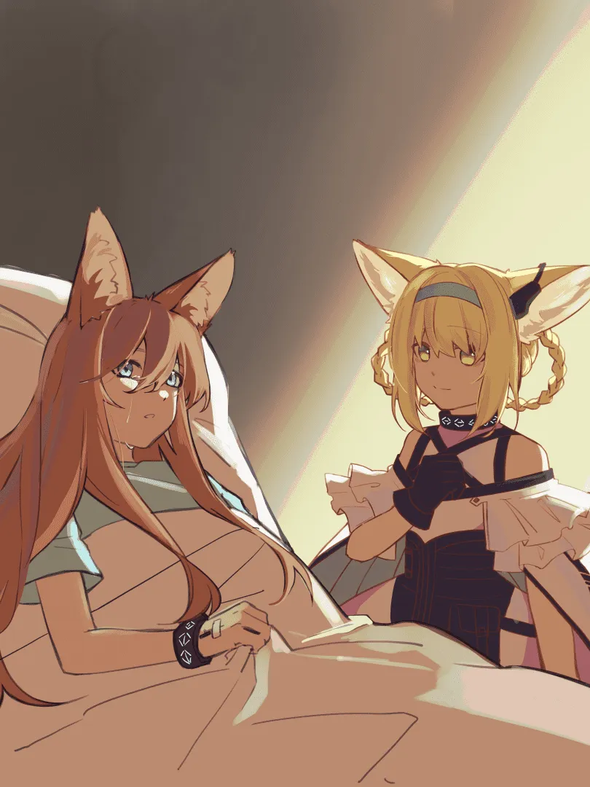

我在旅途中相遇了你，
我们两个人一起去打捞落水太阳。 {.textkai}

<!-- more -->

{style="float:right;max-width:45%;margin-left:1em"}

“我记得那天黄昏，那天……和平时都不一样，太阳掉进了水里，海上涌起了巨浪。那天晚上好像很黑，又好像很亮，我记不清了。我只记得我上了船，去打捞落水的太阳。我走了好远的路，经过好多冒险。”

罗德岛医疗舱内，亚叶听着一位沃尔珀女孩如此说着。

“是吗，那下次我来给你做检查的时候，你就和我讲讲你的冒险吧。”亚叶笑着对眼前的沃尔珀女孩说。

“好啊。”

亚叶对她道了别，走出门，结束了今日份对医疗舱感染者的检查。走在医疗舱的走廊，亚叶看见从走廊那头走来的铃兰。

“嗨，小铃兰。”

“亚叶姐姐好，今天也在做检查吗？”

“对呀，诊断病情、稳定病情还要调整大家的生活作息，工作量倒是挺大的呢。不过有些人总是像博士那样不改善生活习惯才是让人头疼的事。对了，有个沃尔珀女孩情绪仍不是很高涨，而且喜欢有人听听她的故事，但我每天能抽出的时间不多呢。”

“这样吗？那，我帮亚叶姐姐去多听听她讲的故事吧，我的空闲时间比亚叶姐姐多嘛，而且多一个听众，她或许会很开心的。”

“好啊，那拜托小铃兰啦。”

---

第二天，铃兰探访沃尔珀女孩的病房。

“你好，我是亚叶姐姐的助手，我叫铃兰。亚叶姐姐因为工作排的满，不知道什么时候来，所以拜托我照看一下你。”

沃尔珀女孩点了点头，留意到铃兰的九条尾巴，下意识的摸了摸自己的尾巴。

铃兰理了理尾巴，坐在病床旁的椅子上，说道：“那个，我有带一些吃的，要来一些吗？”

“嗯，谢谢。” 沃尔珀女孩接过吃的，继续说，“昨天我和亚叶医生说要讲我去找落水太阳的冒险。不如我们先开始吧。”

接着沃尔珀女孩和铃兰讲着海上的漂流、难以预料的天气、漂流中遇见的过往船只……随后亚叶来了，女孩便简述了刚才的故事，又接着往下讲，水手前往大海的深处。

---

当两人结束探访，铃兰问：“亚叶姐姐，她是怎么来罗德岛的？”

“报告上说她的老家遭遇了突发天灾，罗德岛外勤人员在那里救助当地人时，把她和其他伤者送到罗德岛治疗。她当时意识很虚弱，矿石病也是那时候得的。之后她情绪都满低落的，只在讲这些故事时好些。话又说回来，她说的落水太阳会不会是和天灾中落下的源石混在一起了。”

“这样吗？那这些冒险是她编的了？是不想接受现实，所以用故事来安慰自己吗，这样让人有些担心呢。亚叶姐姐，有没有什么办法呢？”

“说实话我也觉得有些难办，但也只能让她慢慢接受，在这期间多陪陪她。”

之后第三天，女孩讲着身披夜幕，寻得微芒。第四天，女孩讲着深海下潜，探寻灭阳。接着又是第五天，第六天……

---

沃尔珀女孩静静望着医疗舱窗外，天色傍晚，远山的轮廓迷蒙不清，渐渐地渐渐地，她又瞧见太阳苍白下坠，直到沉入远山的轮廓。她看着，看着，良久才开口。

“铃兰姐姐，你和亚叶医生每天都要处理罗德岛上的工作，不觉得重复单调，很累吗？”

“并不会哟，因为每天对我来说都是新的。”

“但是我有些厌烦了……”

“嗯？怎么了吗？如果觉得累了，可以先休息的。”

“我不想休息，也不想打捞什么落水太阳了，我有些，想家了。”

“但是……”

“我不想开故事会了，回去吧，我累了。”

“唔，那好吧……你好好休息。”铃兰担忧地看着她，缓缓地关了门。

待到明日，铃兰匆匆干完手里的事情，就去医疗舱，轻轻推开那个沃尔珀女孩的房门。“早上好。”

“嗯……我不是说了，不开故事会了吗……”

“但是，故事还没有结尾啊。当然如果你感觉……”

“可是如果没有落水太阳，我也不需要远航，我只想要家。落水太阳什么的，根本就不存在。“

“我觉得其实，仅仅就故事中的落水太阳的话，不是很浪漫吗？这些故事蕴含着你的希望啊，不需要太苦于现实的境遇。虽然是虚构的故事，也是生命的一部分。另外，还有，我很喜欢你的故事，我还想继续听，如果你觉得累的话，你可以说，自己旅途中相遇了我，我们两个人一起去打捞落水太阳。我们一起来编写故事吧！”

“一起？”

“嗯，我们还可以叫上亚叶姐姐。罗德岛也可以是你的家啊。罗德岛上还有好多优秀的前辈以及和我们年纪差不多的干员，我可以介绍给你啊。比如慕斯、巫恋、泡普卡，大家可以一起讲故事，一起吧！”

“……嗯，好像，也不错。”<eod />

（责任编辑：瑶濯；
绘图：黑泥型芙芙；
本文来自作者投稿）

<Ads />