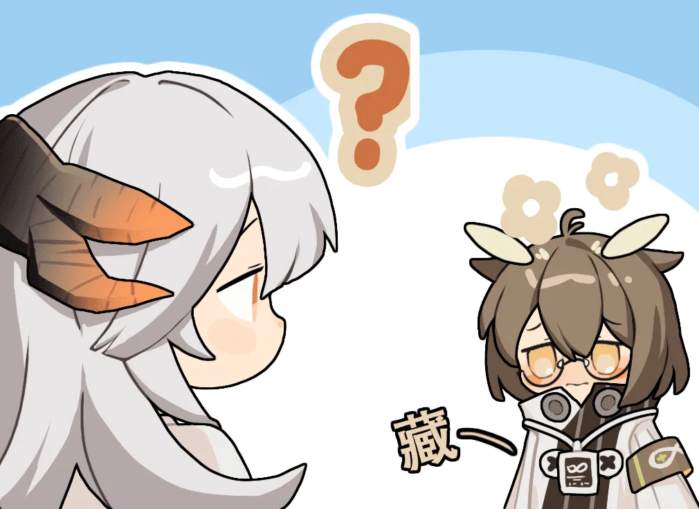
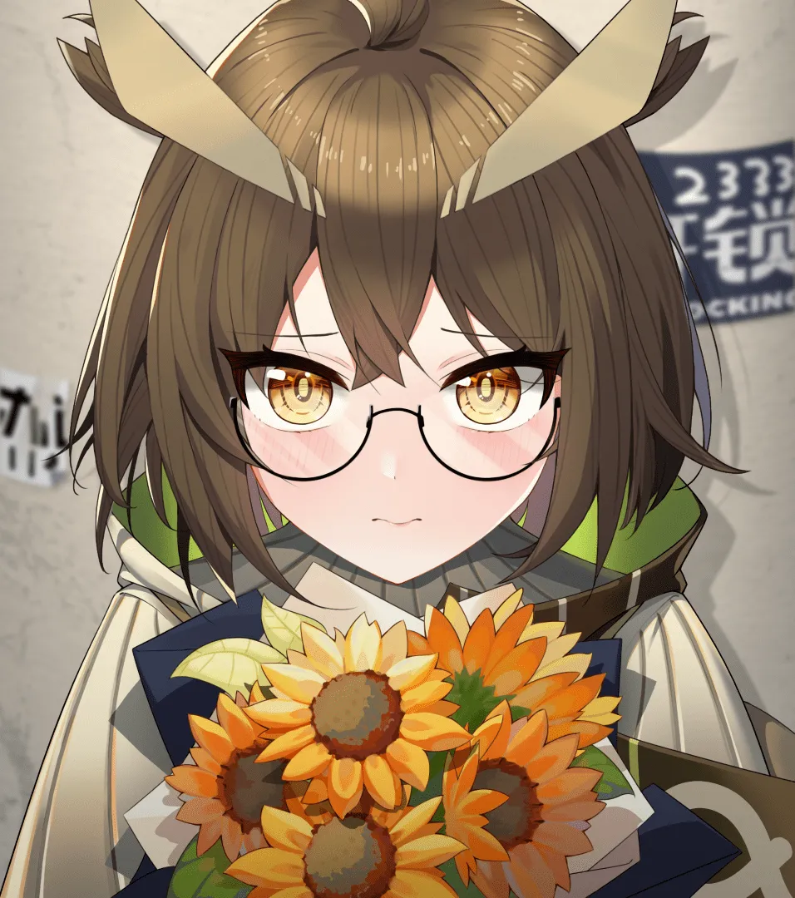

她相信终有一天，这些东西会离开黑暗的储物柜重见天日 {.textkai}

<!-- more -->

## 序

清晨，太阳自大地的尽头升起，通过玻璃穹顶照亮整个温室。棕色头发的沃尔珀在各种花卉的簇拥下慵懒的伸了个懒腰，贴身的园丁制服勾勒出她纤细的腰肢，脚上踩着一双可爱的拖鞋。藤木桌上的热水壶发出急促的蜂鸣，沃尔珀踮起脚尖，取下架子上的玻璃罐子，为自己沏上一杯花茶。

整个庭院里弥漫着醉人的花香，沃尔珀似乎也沉醉于此，脸上泛起了淡淡的红晕。待一杯茶饮尽，她才慢悠悠地起身，将告示牌挂在门口。

告示牌上用漂亮的花体书写着“欢迎来到莱娜的庭院。”

## （一）花与瓦伊凡

哥伦比亚 FinaSugar 糖果店

“塞雷娅，为什么你每次都要来这一家糖果店？”缪尔赛思抱怨的声音在塞雷娅耳边响起，这已经不是今天第一回了。她抬手拿起一盒草莓味的糖放进购物车中，语气平淡地答道。

“因为伊芙利特喜欢这里的草莓糖。”

“拜托。那是因为你只给他吃过这一家店的。哥伦比亚有那么多好吃的糖果，Dylan/S，维多利亚巧克力工厂，还有号称哥伦比亚历史上第一家糖果店 Shane Confectionary。你可以都买给她尝一尝嘛，哎呀。”缪尔赛思自顾自的报着哥伦比亚名声赫赫的糖果店，没注意到塞雷娅已经停下脚步，径直撞上了她的背。“好硬。”

“那麻烦你下次都带我去一去。”塞雷娅转身，指着货架上的什锦糖“最近你的最爱还是这一款吗？”

“不是，是这一款。”缪尔赛思取下一盒柠檬薄荷味的软糖。

塞雷娅点了点头，从钱包里拿出会员卡准备结账。

“哇你居然还有会员卡。“缪尔赛思看着显示屏上的积分，“还有不少？再攒一点可以换年末糖果大礼包了！”

“只不过顺便办了一张。”

二人走出糖果店，来到了对面的公园里休息。

喷泉下几个孩子在追逐打闹，缪尔赛思已经摸出了一颗糖塞进嘴里，含糊不清地问道。

“我说，塞雷娅主任。您真的准备一直送伊芙芙糖果吗？”

“嗯。”

“就没有别的？拜托，有很多可以哄小孩子开心的东西！想想你小时候收到的！“

“唔。”塞雷娅沉默了一下，童年的记忆似乎只有粗粝的拳套，汗水，严父的教导。“答案是玩具，布偶，还有花啦！”缪尔赛思咽下糖。“尤其是花哦，女孩们都会很喜欢的。”

“花吗？”塞雷娅沉吟了一下，“以前拳击赛比赛获胜的时候，的确会有人给我送花。这有什么特别的吗？”

“呃。”缪尔赛思满头黑线，小声的试探道：“平时你没有收到或送花吗？”

“我没送过花，要说收到的话。”塞雷娅盯着眼前的喷泉神色恍惚，好像心里有个尘封的木箱“咔嚓”一声裂开了，里面飞出白色的群鸟。

那一天，莱茵生命的温室需要重新装修，塞雷娅正带着防卫科的同事们来现场帮忙。平时在实验室深居简出的赫默忽然出现在她的身边，双手背在身后有些紧张的问道。

“塞雷娅女士…有空吗？”

“哇，这是多么美好的展开！”缪尔赛思模仿着赫默当时的口吻，“塞雷娅女士…我错了我错了我错了您继续说。”

塞雷娅收回手，继续回忆着当时的场景。待二人来到墙边赫默把藏在背后的东西递了出来，一束用白色雪梨纸包着的向日葵。“这是想送给塞雷娅的花。”塞雷娅有些意外，学着赫默的样子双手抱住向日葵。黄色的花瓣轻轻蹭着她的脸，感觉有些痒。

“唔，为什么突然送我这个。”塞雷娅说出了心中的疑惑。

“这里的温室装修，除去可以药用的花被拿去制药，普通的花就以很便宜的价格向员工出售了。”赫默小声地解释着，头上的羽毛轻轻颤动，脸上也泛起红晕。

“我看到这一束向日葵觉得很适合你，就买了下来。”

“谢谢。”塞雷娅郑重地点了点头，“我会好好照料它的。”

“嗯。那我回实验室了，工作辛苦了。”赫默挥了挥手，用袖子半掩住脸小跑着离去。

{style="float:right;max-width:33%;margin-left:1em"}

她目送着赫默的身影渐渐消失在走廊的尽头，心想赫默医生真的很努力，这么着急回实验室继续工作。塞雷娅低头看着盛放的向日葵，朝着自己的办公室走去。

莱茵防卫科主任办公室门口，一位金发的佩洛正歪着头思考着什么，时不时在手上的便签纸上书写。在莱茵生命的办公大楼里，会随时沉浸在自己的世界里思考问题的只有那个人。

“中午好，克里斯滕。”塞雷娅向她打招呼。“是有什么事情找我吗？”

“嗯，中午好。”克里斯滕回过神来，第一眼便注意到塞雷娅手中的花束“是啊，一点小事。咦，你手中的向日葵是要送给我的吗？”

“不是。这是赫默研究员送给我的。”塞雷娅打开办公室的大门，克里斯滕在熟悉的椅子上落座，“诶，原来是这样，我这次来就是想叫你和我出去采购一些东西，正好帮你挑一个花瓶吧？”

{style="float:left;max-width:33%;margin-right:1em"}

“太好了，我对这种东西实在没什么研究。”塞雷娅有些不好意思地挠脸，“什么时候出发？”

“就现在吧，对了，你知道向日葵的花语吗？”克里斯滕突然问道。

“不知道，走吧。有什么特殊的吗？”

“在这之后克里斯滕为我挑了一个很好看的花瓶。就是这样。”塞雷娅拆开一盒糖拿了一块在手心，最后还是放了回去。

“那你现在知道向日葵的花语吗？”缪尔赛思站起身看着塞雷娅的眼睛。

“唔…我之后就查阅了一些养花的资料，也没有太在意了。”塞雷娅用手轻轻挂着脸，露出了疑惑的表情。“这一点很重要吗？”

“很重要！！！”缪尔赛思大声地说，喷泉旁边歇息的鸟儿也被她的声音惊动，纷纷张开翅膀飞翔空中，在公园的地面上留下大片灰褐色的羽毛。

“黄色向日葵的花语是，憧憬。”

**数个小时后**

【罗德岛本舰/莱娜的芳香庭院】

塞雷娅站在庭院的门口，脑海里尚回响着缪尔赛思的说教。“你呀！真是个钻石脑袋。每一种花都有独特的语言！你怎么现在才懂。”

“要是你也想表达自己想说的话，也可以通过花呀！我对这个了解不多，听说罗德岛上有一座庭院，里面种满了各种花，你可以去问问那里的主人。”

“我回一趟莱茵生命，看看那朵向日葵还在不在。”

她一边想着一边推开了玻璃大门，门上的风铃发出悦耳清脆的声响。

“晚上好，唔。请等我一下，我这边正在收拾工具。”塞雷娅认出了在一排排花盆后忙碌的沃尔珀，自己在医疗部的时候也见过她，调香师莱娜。

“我也来帮忙，这么晚还来打扰你真不好意思。”

有了塞雷娅的帮忙二人很快就把园艺工具放回了工作间。莱娜用手帕擦了擦额头的汗珠，“呀，多亏了你的帮忙，今天的收拾要快上不少。塞雷娅女士想要什么花？是送给医疗部的同事吗？”

“嗯。这是一份回礼。”塞雷娅点了点头，“她之前送了我一束向日葵。”

“啊，我懂了。“莱娜狡黠地眨了眨眼睛，“是一直憧憬着你的医疗部成员吧。用向日葵来表达自己的情感。”

“可能是之前的事情了。”塞雷娅的脸上露出一点苦笑，小声说“也不知道现在还是不是。”

“那你准备回赠什么花呢？每一种花都有独特的语言，也可以只是因为喜欢它的样子就选择它。”

“唔。”塞雷娅思索着环顾四周，鼻尖忽然闻到了一股很特别的香味……微微泛苦，又很润泽。

她缓步走到了一束蓝色的花前，“这种花的香味很特别。”

“这是蓝色龙胆花，生长在寒冷的喀兰高山，因为需要抵御紫外线，积累了许多花青素让花瓣变成蓝色。”莱娜细心的解释着，“她的花语是，喜欢看忧伤时的你。”

忧伤…赫默的身影出现在眼前。在莱茵生命初见的时候，她总是充满干劲和活力，笑起来双眼会眯成一条线，在闲暇的时候也会讲着自己的理想与未来。

不知道什么开始赫默的笑容渐渐少了，等塞雷娅再次与她相遇的时候，莱茵生命的公司几乎被伊芙利特拆成了废墟。赫默的眼中充满迷茫愤怒，牙齿不受控制的咬着嘴唇，就连渗出血来也毫不在意。

塞雷娅知道赫默为什么生自己的气。她一直知道。只是还没有到时候…还没有…

“比起忧伤时候的你，更想看你露出笑颜呀。”塞雷娅低下头，再次嗅闻着龙胆花的香味。“就送这束了。莱娜可以帮我转交到医疗部吗？我可能不太方便。”

“塞雷娅女士，花要自己送才有意义哦。我相信赫默医生会很开心收到你的花的。”莱娜眯着眼睛露出狡黠的笑，也许从一开始她就猜到了送花的人，只是没有拆穿。

塞雷娅有些无奈的看着狡猾的沃尔珀，轻轻叹了口气。“好吧，请帮我包起来吧，再订一个花瓶。”

“这会是赫默医生收到最美的花束。”

## （二）蓝色龙胆花与黎博利

【罗德岛本舰/医疗部】

赫默对着镜子将干员名牌佩戴整齐，熟练地与路过的同事们打招呼，走进伊芙利特的病房。

伊芙利特正坐在病床上看童话书，这不是市面上发行的书，而是爱丽丝手工制成的童话书，其中一部的主角也在伊芙利特的请求下画成了拿着喷火枪的萨卡兹，举着盾的瓦伊凡和跟在自己身边的黎博利女孩。

旁边的床头柜上放着一盒新糖，包装已经被拆开，看起来她已经吃了一颗。看到赫默来了伊芙利特连忙放下童话书，脸上露出开心的笑“早上好！赫默！”赫默走到床边，抬手轻轻摸着伊芙利特金色的头发。“今天起床有感觉不舒服吗？”

“没有！”

“有好好吃药吗？”

“虽然很苦但还是吃了！”

“要记得完成作业，听乔伊斯和梅尔姐姐的话。”

“知道了！”

一成不变的问候，赫默没有感觉过厌烦。虽然语句几乎一成不变，但每次语气都非常耐心，得到肯定的答复后也会报以微笑和糖果。

上次买的糖已经吃完了，来之前赫默向采购部递交了申请。不过看到床头柜前已经放上了新的糖盒便也放下心来。

伊芙利特注意到赫默看向糖果，连忙拿起来拆开一颗放在赫默的手心。“赫默也想吃糖对吧！这是早上乔伊斯姐姐带过来的。”“咦，嗯。”短暂的停顿后赫默轻轻握了握手心的糖。“谢谢伊芙利特哦，那我去工作了。你要乖乖的。”

“好！这次的口味是全新的！赫默觉得好吃的话我会多留几个的！”伊芙利特含着糖果口齿不清的朝着赫默摆手。

“嗯，一定会的。也要给乔伊斯和梅尔姐姐一颗哦。“赫默也跟着伊芙利特挥手道别，倚着病房门旁的墙壁安心的舒了口气，随后朝着自己的实验室走去。

赫默走进准备间烧水，咖啡豆的醇香在实验室中与消毒水味针锋相对。她端着咖啡抿了一口，嗅觉忽然灵敏起来，在熟悉的气味中她闻到了一种很特别的香味——微微泛苦，却并不滞涩。就像是回到了莱茵生命的总部，夏天的暴雨似乎永远不会停下，大片大片的雨冲刷着大楼的玻璃窗。她端着刚泡好的咖啡站在窗后，看着被雨水落在草地上。赫默回过神来，很快就找到了香气的源头，是放在桌上的一束蓝色的鲜花。

她也是第一次见到这种花，淡蓝色的花瓣舒展开来，散发着微苦的花香。

“上午 8:08 分，在准备间和赫默医生相遇。早安。”乔伊斯的声音在准备间的门口响起。赫默回过头，也道了声早安，随后问道。“乔伊斯，你知道这束花是什么吗？”

乔伊斯走近几步，歪着头看着赫默怀中的花。“正在读取花卉百科数据。找到匹配结果，这是蓝色龙胆花。主要生长在喀兰等高海拔地区，生长环境需要湿润的微酸性的土壤。具有药用价值，香味泛苦。花语是喜欢看忧伤时候的你。”

“谢谢你的科普，乔伊斯。”赫默解开束绳把它们展开，四处望了望没有找到花瓶，就暂时插进了烧杯里。

“你知道这是谁送过来的吗？”

“白面鸮没有看到送花的人。推测是塞雷娅送的花。她今天来过这里，为伊芙利特带了新的糖果。”

“塞雷娅吗？”赫默低下头，眼神复杂地看着龙胆花。“倒也能猜到，之前给伊芙利特买的糖已经吃完了。今天床头柜却有一盒新的。”

“赫默医生的判断没有错，那盒糖是塞雷娅让我转交给伊芙利特的，是来自FinaSugar糖果店的最新款。”

塞雷娅无声无息地来过，她所经之地都烙上了痕迹。在莱茵生命的时候就是这样，懒散的研究员也会立刻挺直了腰板工作。

幸好赫默也没有这么讨厌塞雷娅的气息。

“等下去买个好点的花瓶吧，也不能一直插在这里。“赫默抬起头，重新拿起咖啡。“走吧，今天也有很多工作。”

“检测到赫默医生的情绪波动，是和以往不同的喜悦。”

“你的检测失灵了，乔伊斯。”

## （三）干花与书签

休息室中，年轻的黎博利不知不觉又趴在桌子上睡着了。风从窗户中溜了进来，吹起落在书边的碎发，书也翻到了夹着书签的一页。那是用一朵蓝色龙胆花制成的书签，看样子是黎博利亲手制作。

路过的瓦伊凡轻轻将白色的实验服披在她的肩上，随后悄无声息的离去，生怕惊醒酣睡中的赫默。在属于塞雷娅的私人储物柜中，老旧的拳击手套旁多了一束黄色向日葵干花，旁边还有一张便笺。“眼见这朵向日葵要枯萎，就做成了干花保存，也许有一天你回想起它。”

她相信终有一天，这些东西会离开黑暗的储物柜重见天日。<eod />

（责任编辑：瑶濯；
绘图：侠客；
本文来自作者投稿）

<Ads />