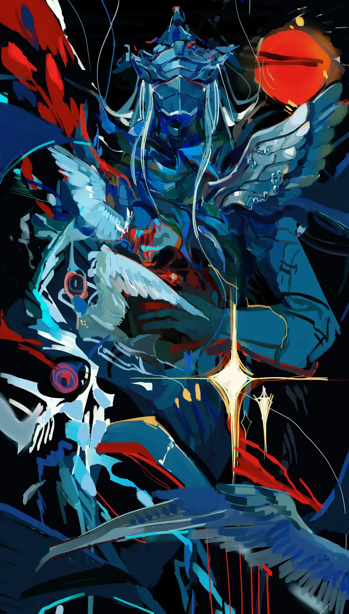

“我曾经到过那儿。”所有人都说，“我曾经到过那儿。”——《紫与黑》 {.textkai}

<!-- more -->

孩子们的喜爱，大人们的嘲弄，这些想要或不想要的重视他都得到了——可当中并不伴随着任何人的信服。

他说他曾是个骑士。

“我到过那儿，我看见祂，我与祂决斗。”无论如何在他的故事中这三句话不可或缺，有如祷告词那般庄重，“想象一下，紫蓝色的飞天异兽与无坚不摧的长矛为我所用，腾空，掷矛，命中，大海的眼睛失去先芒，乘胜追击，拔矛，再刺，大海坍塌了……”

我们围在一起，用掌声应和着他富有激情的怪叫与略显滑稽的表演，让他真正作为”骑士”凯旋，总是这样，但他每一天获胜的方式都存在些许差异，他自己是否记得前一天讲了什么，都是一个问号。

或许在我出生前他就已经无数次讲过他的故事，于是也有了无数大体一致但细节不同的版本——每次向那些大人打听时我总能再听到这篇冒险故事的简述，还伴随着笃定的判断:“故事我也会讲，反正都是假的，他啊，早就疯了。”得到两三个相同的答复后我也就不再自讨没趣，并且对他们做出同样笃定的判断:“他们也曾像我们一样向往着那个故事，可不知为何就成了这样子。”

孩子选择骑士，然后经过若干年成为大人。是这样吗？并不甚明确的结论让我胆寒。日复一日,骑士表演，我们欢笑；日落时分，我在原地，看他们远去，夕阳拉出两种不同朝向的影子，骑士回到他孤单的小屋，孩子们回到各自的大人身边。

它们并不是注定的轮回，一切这样那样的“笃定”似乎都有被动摇的一天，哪怕是对不信任的笃定——那天，骑士说他要过生日，邀请了所有人去庆祝。

出平意料的是没有人不愿意给骑士面子，即使他从没有过这样有关生日的突发奇想。行将就木的老人托儿孙带来歉息，打开窗户，胡言乱语说要再吹吹儿时的风……这时其他人就立于大道两侧，不是肃立，就甩手站着，像只带有最基本的礼节去迎接一个已失实权的领导。可当骑土出现时，这样的随意僵住了，他手中将着长矛，曾无数次被提到的长矛，锈色已如泥土，丝毫没有任何传奇色影，仅比家里宰杀牲畜的菜刀看起来多一分崇高，但所有人的目光都将它供奉作为权杖。权杖指向了行军的目标，一架缩小的风车，没人知道它何时出现在那儿，软木制的，从未转动过。

“那是海怪,我要与其决斗。”

当他站定,紧握长矛，目视风车，不知是否是我的错觉，真的有寒意在骑士的四周扩散，曾经的那么多次表演都自降一等成为拙劣的戏仿，映衬着此刻的无与伦比。

我想提醒他缺少什么，坐骑，张了嘴，却没出声，我看到很多人像我一样，害怕在此生未曾遇到过的肃穆中搅动分毫，闭了嘴。

他向前冲去。

长矛——这结果是可以被预想的——在碰到风车时破碎，骑士停在原地。但我们至今不知道谁赢了，因为我们根本不知道他们在比拼什么，是比拼强大还是比拼孱弱，只能尴尬地笑着,尴尬地鼓掌着，等候骑士归来。

丧钟响起，转身，行将就木者死了；再转身，骑士消失了。这成了第二个疑案:两件事究竟谁先发生？

往回走，窸窸窣窣的声音全部关乎骑士，他们疑惑，他们发问，结果不知所措，给不出答案，于是声音在辽阔的天与地之间衰微，最后归于村庄归于静默。也许对于村庄而言骑士带来的喧闹是烦躁而多余的，他和他的故事不再被提起，没人想提起，几十年扎根于此的“存在”试图存在，在一条道路上消散，不留下任何碎片。

这是他的出走，我记得无比清楚。那么我的呢?似乎没人替我记得。某个白天或夜晚，思索已久或临时起意，缘于对骑士的怀念或者同情，好在排列组合之下总有一个答案。

但我记得出走后有关骑士的梦：

他说他是个骗子，就算长矛是真的骑士也是真的，但他退却了。直到锈蚀的长矛在和风车的碰撞中粉身碎骨，他才猛然惊醒：为麻痹自己所想象出在旅途终点的战斗故事成了真实的梦境，他在那刻前一直睡着。他无数遍叫喊着要杀死大海，他永远在通往彼处——那并不存在的决斗的路上。然后他身披铠甲如坦克，执矛如攻城锥，朝大海无边的世界冲刺，直到衣襟上沾上海水，直到他与大海融为一体。

梦中的大海和现实中的大海相仿，都是无数深浅不一的墨蓝色块组成的图案，时刻运动着改变自己却又在任何人的描述中趋于一致。我坐在礁石边看远处阴云密布看远处电闪雷鸣，忽然明白骑士为何害怕大海，他反抗着庸俗的一切，而大海会摧毁庸俗的根基让一切反抗变得没有意义，看见大海便意味着走进大海。我还无从反抗，所以我并不害怕。

我将所见所梦与村里人讲, 他们直接否定了骑士存在的真实性。我固执地讲述，和孩子们讲，他们最喜欢听这个。

我固执地相信，直到有一天孩子问我：“你怎么证明?”

哑口无言。我甚至不知道哪一天梦见了骑士，哪一天看见了大海，或根本有没有梦见骑士，有没有看见大海。我只知道这次出走这么美好。

我想再次击走，去证实我的第一次出走，去看看远处的海是否仍与我的讲述相符。我邀请所有人来，但没有人来，他们都说我疯了。<eod />

 {.centering}

（绘图：LOFTER@鸽十一；本文来自作者投稿）

<Ads />