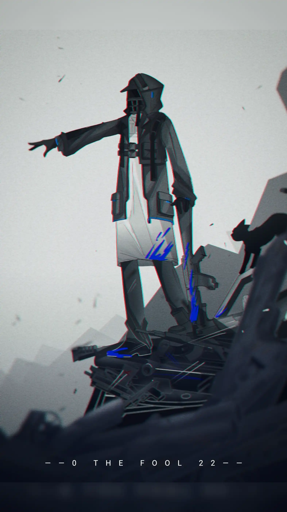

*But the film is a saddening bore 可是电影逐渐陷入沉闷*

*'Cause I wrote it ten times or more 因为我自己都写过数十遍了*

*It's about to be writ again 现在又要开始重来*

*As I ask you to focus on 当我要你快去注意*

————大卫鲍伊《Life On Mars》 {.aright .textkai}

<!-- more -->

博士名字就是博士，或许在人类时代他有一个更为复杂的真名，但在罗德岛和这片泰拉大陆，他就叫博士，也只能叫博士。

因为博士这么个名字，他从石棺里出来就被委以重任。时值罗德岛建立不久，大部分的成员都是巴别塔时代留下的旧将和一些走投无路者，但他们异口同声的说博士是他们当中最优秀的，在失忆之前甚至有恶灵的称呼，所以必须担任罗德岛的重要位置。行吧，既然他们把责任给了博士，博士也只能收下，他觉得他没有拒绝的理由，他一无所知，自己是谁也好罗德岛也好，他一无所有，也不知道自己有没有值得损失的东西。

总的说来，这座移动城市给他提供的工作大部分还挺和他的脾性，这或许就是记忆虽然丧失了但肌肉记忆还在的缘故。无非就是工作量大了点，但他还是让自己逐渐爱上了这个承载着理想的小船，在甲板上看着太阳升起，仿佛一个被允诺即将被实现的美好未来。那是前三年的事。

由此，博士开始了和罗德岛在这片泰拉大陆上的奇妙冒险，从炎国龙门到谢拉格的雪地圣域，从哥伦比亚的科技都市到维多利亚的暗流涌动，他简直就像是社区维修工一样走到哪里忙哪里。他记得凯尔希曾和他提过关于特雷西斯和特蕾西娅的事，那是博士的过往，但他总感觉和他有些不相关，就像一个玄幻故事一样。总之，他尽力的发挥自己的才能，尽最大力量的实现谁都不会受伤的完美世界。罗德岛蒸蒸日上，他爱着罗德岛，于是也心满意足。
他知道有不少人喜欢他，因为博士确实极其富有能力和才能，神秘色彩，奇妙无比，这么个气质的人走到那里都会被人盯上，无论何种形式。认识的男女数不胜数，遍布各个国家大陆，小民王侯，他们大多和罗德岛达成了协议，也因此，罗德岛凭借对矿石病延缓药的专业研究和人脉，一跃成为泰拉大陆的响亮名字。

博士觉得自己跟在玩宝可梦一样，认识一个干员，然后赶快去收集下一个。他想起罗宾邓巴提出的150定律，发现自己结交的人已经远远不止这个数字了。不管是道德伟岸还是扒手，化妆师，傻的可爱的贪吃鬼，音乐家和贸易老总，而博士却和他们全都情投意合，能让他们对罗德岛达成基本共识，这些人，杂七杂八凑起来绝对远远不止150这个数字了。

然而，就算是博士终究也会遇到自己的瓶颈。在一次喝醉的聚会上，博士即兴用兰波的名篇《言语炼金术》演讲，表达自己的壮阔心境，结果惹得底下干员不知所措，尴尬了很长时间。聚会后同在一场聚会上的干员日后见到博士都满脸笑意，博士后来才知道的是，他当时的“激情演讲”已经被当作了梗在干员私底下流传着。

因此，博士又被凯尔希训了一顿。每次出了大事小事凯尔希必定嘴上不饶人，虽然博士前几年有过想逗逗她的想法，但生死就在一瞬间，他放弃了。他觉得凯尔希也没有想和自己交流失忆前的自己的想法，自己虽然在意但奈何她就是守口如瓶，她总说专注眼前的现在才是最紧迫的，这片大地的受苦者比比皆是，故他虽心有不甘但只能放弃，继续日常的工作，在繁杂的文档里回忆起了人类时代的印象，泰戈尔的诗集和契科夫的短文。但终究耐不住寂寞根据记忆写了一篇卡夫卡的《变形记》。

他后来再也不搞类似的营生是在被鸿雪和琴柳吐槽以后。他满怀着记忆的模糊完成人类时代的文学高峰后，装作受人之托来给鸿雪和琴柳所主持的罗德岛报社投稿，结果被无情退回，莫名其妙，不知所以，看不懂，无法理解等词语让博士成了罗德岛艺术方面的孤家寡人，这让他深受打击，失落了好一阵子，虽然他的大体记忆还未完全康复，但他能肯定自己当时绝对是一个艺术爱好者。可怜他并不能把这些对谁发牢骚，自己不是该对人发牢骚的人。

既然不能发展这些，那就只能好好的做本职工作了，自己在罗德岛被委以重任，那就必须好好承担才行，这里毕竟不是人类世界。

从卡西米尔回来之后，乌萨斯和卡西米尔的边境冲突便成了泰拉大陆的主要话题，为了应对乌萨斯对自己以来的长期威胁，卡西米尔与他最大的贸易伙伴哥伦比亚签订了两国同盟。双方承诺任何一方被乌萨斯帝国攻击后另一方需倾力相助，若双方因各自自身原因与另一国开战，则需要保持中立。

博士知道，这绝对是在商业联合会的强力推动下促成的同盟。两国同盟，你们以为你们是德国和奥匈？博士无语的笑着，为了应对共同的危险而相互抱团是正常行为，彼时哥伦比亚也正因为快速崛起而逐渐抢占乌萨斯在泰拉大陆北方话语权；卡西米尔需要坚定的盟友做经济的后盾；哥伦比亚需要一个老牌军事国家做自己的盾牌。

“用不了二十年，乌萨斯和同盟国一定会打起来。”博士说。

乌萨斯必然不可能坐以待毙，他们看中了与哥伦比亚的另一个邻国玻利瓦尔，并毫不掩饰的介入到他们的内战当中，持续迫使哥伦比亚不断倾斜资源于此，同时，萨尔贡政府在和哥伦比亚关于源石矿场股份权和比重方面发生分歧，见两国交恶，乌萨斯乘机拉拢萨尔贡。乌萨斯，萨尔贡联盟形成。

似乎是预感到了什么，莱塔尼亚开始回收在玻利瓦尔的资源，与维多利亚签订了诸多自由贸易协定。玻利瓦尔更加激烈的代理人战争爆发，莱塔尼亚留下的辛嘉斯王朝遗产被乌萨斯继承，由萨尔贡提供原材料，乌萨斯提供军备。新一轮的玻利瓦尔内战代表了两大军事同盟对峙的开始。

对峙到了一年之后，卡西米尔监正会大骑士长因病宣布辞职，从卡西米尔来的红松骑士团和临光姐妹返回了卡西米尔。她们是有趣的人，比起那个大骑士长的病情，博士发愁的是自己可以说话的对象少了不少，瑕光在的话还可以和她有说有笑，鞭刃可以从她身上套点临光家的历史和趣闻，临光，谁不喜欢光明磊落的耀骑士呢？

罗德岛每个月末，管理层和各部门部长都会召开会议，会议时长长达半天。博士讨厌会议，但他必须忍住无聊，把每个人说的情况记录下来，因为这就是他下个月的工作。

无聊，每当无聊的时候他就会回想人类时代的事，回想历史，回想文艺艺术和模糊的人脸。普瑞赛斯，那是除了镜子里的自己以外唯一一张他所能回忆起的面庞，亲切而又陌生，好像回想孩童时期母亲年轻的脸。

厚重的防护服让他感觉燥热，无法释放的思绪堵在里面。他感觉心里痒痒的折磨，就像长满绒毛的不安分小兽在他身体里乱撞。他觉得应该张开口把这些一吐为快，但那吐出来的物体注定不会被除自己以外的人理解，也不能写在本子上。凯尔希那家伙是会定期通过看你的笔记来判断你的工作状况的。可那该怎么办？他全然没有头绪。

博士的身体不是很好，在这个生存竞争激烈的大地，他的身板有些过于羸弱，无论是杜宾还是阿米娅都劝他适当锻炼身体，可他完成每天工作后只想睡觉。

白金曾试图邀请博士到哥伦比亚旅游，但当时正在月末，忙期，但就算放在最空闲的时候博士也不敢丢下工作跑去旅什么游。

可能是看出博士最近的郁闷神态，白金又一次邀请博士外出旅游，这次是维多利亚的游乐园。“博士，不想和我一起去水上乐园玩吗？我可是废了好大劲才搞到的打折门票哦。”

“合着一个月请了18次假是去整这个去了。”

博士本想拒绝，但想来想去觉得去水上乐园未尝不可，换个环境放松放松心情也是好的。罗德岛俨然成了三点一线的工厂，开始再无新意，手中空空如也。总觉得自己是阴差阳错身处在了错误的环境里，所以无论做什么都别扭，感觉那么不适。他的心境寂寞的如落在窗台上的灰一般，每次和关系好的干员聊天说话都要字斟酌句，唯恐自己又开始“激情演讲”。他对伟大的兰波被当成乐子很是不满，但不能表示出来。就当是抒怀一下。博士把三个星期的日程全部退掉，跟阿米娅这么交代前还怕有什么疏漏，不妥，但阿米娅说和干员增进感情是个好事。

“更何况，白金小姐是因为博士才选择留在罗德岛的吧？”

是吗？感觉不出来。博士收起低情商的回答，和白金一起去了维多利亚的水上乐园。

世界上所有的游乐园都大同小异，两人吃着冰激凌，美食，在海滨上晒了一天太阳。虽然不能和汐斯塔相比，但这里也不坏，自己抹防晒霜，把皮肤晒得黑些，喝果汁酒，消除疲劳，心情怅然，博士顿感好过。他发现躺在自己身边的白金似乎在往自己身上靠，不住抖动的耳朵完全隐藏不了她的情绪。可爱的家伙。博士心想。

当晚，两人入住水上乐园旁的酒店，博士玩的没有那么开，但却感觉疲劳，毕竟自己长期缺乏充足睡眠，可还没等换上睡衣，门被敲响，身穿短裙睡衣的白金扭扭捏捏的站在门口，拿着一瓶维多利亚红酒。两人对坐而饮，白金聊起自己在成为所谓白金大位前的事，自己是怎么曾崇拜骑士风姿，却被骗进无胄盟的。博士没什么好说的，他自认为有趣的东西，他人是听不懂的，而他人能懂的，都是没兴趣听的。

不会有人愿意听别人是怎么抱怨加班的吧？

“我本人没什么好说的，失忆，责任重大，每天早上五点起来，审阅各个部门的报告，该打电话打电话，该叫人叫人，助理无非就是帮我接电话，送资料和收传真就是了，没兴趣做？”

“我还是想找个没人打扰的地方躺着为好。”白金说。

“你这家伙过于懒散了吧，每个月工资稀薄的原因可就在于此哦。”

“无所谓。”

博士注意白金总是在咬着嘴唇，好似忍耐。额，如果自己没有自作多情的话，博士想，实际上自己也不是不能明白白金对博士是什么感情。从大骑士领遇见到现在的来龙去脉，自己有点难搞明白，里面总该有些窍门才是，可自己完全理解不了，博士思考自己在此之前与白金的关系，为了帮她拿全勤奖金当过两次助理结果不知所踪，走廊碰到的话就有一搭没一搭的聊天，这也是能成为那种感情的理由吗？

酒过三巡，白金靠着博士的肩，看着酒店里电视播放的维多利亚爱情电影。白金握着博士的手，揉搓着他的手指，他的手也好，肩膀也好，白金现在想要全部紧紧拥抱住。她试探性的轻吻着博士的脸颊，转而吻向嘴唇，手上的动作也没有停，可博士有些不做反应，难道这人是什么情场老手，或者到这地步了还无动于衷？白金有些失望，那自己就更加主动即可，她想把博士轻轻推倒在床上，但博士握住了白金的双肩，对她说不要这么做。

“为什么？难道博士不喜欢我吗？”

“不是，我想我肯定是喜欢你的，但有什么地方不对，这让我无法适应，对不起。”说着，博士换上睡衣。

“我知道我现在有在玩弄你的意思，但我绝对不是这么想的，我知道……你理解不了。”博士用最大的温柔与卑微的语气说道，“你想在这里睡也可以。”

当晚博士和白金同床而眠，博士一夜没有合眼，他在思考，思考自己为什么不会为白金这样的美人触动，继而又思考这片大地的种族和自己的关系，不自觉的，他又想到人类时代的东西。他看向背对他的白金，光滑的脊背。他有了个猜测，自己是不是不喜欢她的耳朵和尾巴呢？

接下来的日子里博士为了向白金道歉，他对白金说了很多自己的私人想法，说了他的孤独，说了他讨厌兰波的诗被当做搞笑的玩笑，对卡夫卡和契科夫的短文被指毫无意义无可奈何，独生闷气。博士不知道白金有没有在听，但她在默默点头，至少她理解了博士是在对自己坦诚相见。

“为什么不和凯尔希医生说这些呢？她不是见多识广吗？”白金说。

“她就是不让我这么干的人。”博士长叹一口气。

那么接下来博士该怎么办？博士说不知道，自己疲于工作，同时又要兼顾和干员搞好关系以及关注外部局势，但自己自身的心都控制不住。回到罗德岛后，博士尝试自慰，他把白金等一众长相貌美的干员作为自慰对象，但每次都半途而废，他终于确定那股不对到底是什么东西——种族。即使自己和她们极其相像，但博士的内心自认为自己和她们有着巨大的差异，有什么东西隔绝在他们之间，那是人类那数千年的历史。

认清了这份鸿沟后，博士对与干员增进感情这件事报以绝望，他真不认为自己能抛下人类时代的记忆给他的习惯和成见。他在不自觉间开始减少和干员接触，就连每月助理都是让阿米娅帮忙安排（很多时候阿米娅自己过来）。从那时起，博士开始进入更为孤独的境界，而真的彻底踏入那份代表人类物种的孤独，是在一次月末会议上，杜宾请博士对泰拉大陆目前的形式做出自己的判断，博士想了想，做出了如下判断：

“哥伦比亚和卡西米尔有可能绕过萨尔贡政府和帕夏，领主等达成协定，他们必须脱离这种南北被夹击的局面，为此需要政治执行度差的萨尔贡陷入麻烦。”

“那么事态有可能会更加严重，最严重的情况下，有可能会是……”

“萨尔贡也和玻利瓦尔一样陷入内战。”阿米娅失落的说。

“若这是真的话，我们真的做不了什么吗？”阿米娅试探的问向博士，尽管她知道答案是肯定的，不，他们什么都做不了。

但出乎在场所有人的意料，博士竟然说：“你们在愁什么？如果萨尔贡现在真打了起来，那是天大的好事！”在会议室各位目光的诧异中，博士尴尬的解释道：“怎么？你们想跳过这些步骤，直接看同盟和联盟开打吗？”

博士用了好一顿口水才让他们明白，如果不以这种局部战争来消耗各国之间的力量的话，那么他们就会把精力用在国家间的战争里，到时候局势更加无法控制，情形更加恐怖，造成的结果也将不可预测。

“可是这些，哪些国家也明白啊，现在战争一次会死那么多人，要花那么多钱，我觉得国家之间是不可能打起来的。”一个工程部干员起了个头，随后会议室议论纷纷，虽然不知道具体的所有人的看法，但一种声音占据了主流：在这个战争代价越来越高昂的年代，各国很难开始战争，即使开始了，他们也很难承受战争的代价而早早结束。博士感觉到有一股股异样的目光在看着自己。

“是啊，人类也觉得不会开战，”博士语重心长的说，“生活在人类时代20世纪10年代的人觉得自己的帝国是如此强大，谁都不敢进犯，巴尔干半岛离他们远得很，一点小麻烦不会代表什么；30年代的波兰人也觉得如果自己受到了攻击，那么另外两个帝国就会履行承诺来帮助自己，战争不会爆发；所有的国会议员们围在一起，计算着战争可能带来的开销，他们觉得旷日持久的战争将会拖垮整个国家的经济，于是都觉得对方不会攻击自己，然后呢？战争不仅爆发，其范围之广，伤亡之重，我们人类称之为世界大战，你们知道人类光前两次世界大战就死了多少人吗？”

博士环顾四周，见所有人都在看着自己，他说道：“8500万。我不觉得在座的各位，包括我能准确地算出如果同盟与联盟之间开战会死多少人，我也觉得，如果把这场世界大战和萨尔贡一国的内战相比，有没有可比性”

会议室陷入了沉默，日后博士会习惯这种沉默，这种沉默对他来说会是很自然的事，就和兰波被当做梗一样，这就是鸿沟。其结果来说，博士并没有让干员们明白为了避免更大规模的战争的爆发，小规模泻火式的战争是可以接受的。不是因为博士不热爱和平，而是因为，以瓜分利益为主要目的的帝国主义战争从一开始就动机不良。然而她们又不知道何为帝国主义。

博士发现，即便是这片大地换了个主人，他们走的路也和人类毫无差异。一切都是重复，一切都是换了个角色演相同的戏码。太阳底下无新鲜事。博士开始缺席会议，转而由阿米娅帮忙汇总会议信息转告给博士。他一个人工作，一个人吃饭，一个人睡觉。寂寞吗？寂寞，但并没有那么太寂寞。较之再接受一轮轮不理解的目光，还是一个人心安理得的自在。白金之后，虽然还是有干员愿意向博士献殷勤，表好感，但和谁一起约会的事一件没有答应，单独相处的都少之又少，看来他还是习惯不了这种族差异给他带来的近乎人与动物的差别感。好在没耽搁在罗德岛的工作。

这样，他更加独来独往。凯尔希不知道为什么放任博士只要在罗德岛的范围里自由行动了。“前世”造的孽让自己不得不留在这儿，可实际上的自己到底想不想承担这份责任呢？就在周围人用自己的理由自强不息的时间里，他逐渐对罗德岛产生一股陌生和拘束感。

外部，同盟和联盟日渐敌对，玻利瓦尔的局势一步步滑入深渊，为数不多的谈判促成的只是交换战俘的暂时停火，所以但凡有点大局感的人都不会聚焦于一个个体之上。每个人都有要想的事，要做的事，他们拿出生存的努力为其奋斗，在博士眼里完全看不出价值所在。对他来说，他们都是这战争时代下一吹就散的炮灰罢了。

所以博士大肆发展他的爱好，吟诗作赋，他把张继的《枫桥夜泊》写下来贴在办公桌上，把加缪的名言贴在床头，不管是古诗也罢，小说也罢，博士忘我的想起什么写什么，有时想起达利的画也随手画一幅，当然难看到死。不知道凯尔希会作何感想，他知道自己的办公室有凯尔希的隐秘摄像头。

但博士还是该工作时就工作，他不知道自己有没有工资，因为自己帮罗德岛重整旗鼓立下了汗马功劳，没有功劳也有苦劳。他去问可露希尔，可露希尔说罗德岛的收益就是你的工资，你在外面的花销都是罗德岛报销的。

“给我等等，这岂不说明，每次我从你这里买东西，花的钱不都又入了罗德岛的金库？”

“当然不是！我可是有提成的啊。”

博士从未想过要和人交往，至少和罗德岛上的人交往是不可能的，他从未考虑过，觉得毫无必要。工作也好生活也罢自己全部一人包办，助理只是帮他按顺序整理文件或跑腿的。亲密的人一个没有，推心置腹的人也一个没有，偶尔去食堂吃饭总是坐在人少的角落。话虽如此，但该有的工作关系他还是尽力保持，比如和喀兰贸易的总裁银灰的关系就十分稳定，两人唯一的共同点就是对彼此为达目的不择手段的，性情中人的了解。所以罗德岛的干员大部分对博士的印象就是好相处的领导，和阿米娅因为工作说的话最多，同凯尔希只是体检或医疗部有事才说话，说完了公务就再无其他可说。博士的耐心和脾气就在这其中慢慢折磨着，人类的一生多少都是这么过的。

不料某一天他萌生了离开罗德岛的想法，从这里离职，拿点自己该有的利润后递交辞呈，去各国旅游，就像白金一样。想着想着，他的脸上就浮现出期待的微笑。工作的事谁都能做，目前趋于稳定的罗德岛内外安全，干员们的作战经验丰富，自己这个战时领导已经不再必要。这个类似经济管理者的职务找个高学历的就能代替，他是这么觉得的。离开罗德岛的想法让他激动地睡不着觉，小兽乱撞的心痒暂时被剧烈的心跳代替。

他开始将阿米娅设为自己的常驻助理，为了让阿米娅习惯博士的工作内容，他把自己的经验全部倾囊相授。在阿米娅心里，博士和凯尔希医生一直是自己长辈和导师般的存在，她怎么能知道博士这么做是为了有一天自己离开罗德岛呢？她按照博士的指令努力学习，在巴别塔时期，博士就这样教过她许多东西，对她来说这是以往美好记忆的重现。

在把工程部和传媒部门的事务交给阿米娅后，博士亲自去处理关于安塞尔报告的岛上床位不够的问题。博士去找凯尔希，怎么说也该找医疗部的领头人去咨询意见。

可凯尔希很忙，她一连两天忙了七场手术，于是博士只留下信件请她去办公室谈谈。凯尔希来后，博士给她到了杯咖啡，两人聊着床位问题，博士说，罗德岛发展到这种程度作为一家公司已经到了巅峰，如果要继续发展，那就必须进一步依附于国家力量。同意，凯尔希说，但问题是，无法保证罗德岛和某个国家达成合作后会不会遭受与之敌对国家的针对。

“减少我们在乌萨斯的投入吧，乌萨斯本就和我们处不来，我们在他们眼里也不重要，即使退出也不会影响到我们，我们可以把一直以来在乌萨斯的投入抽出，甚至战略放弃，这么做了问题也不大。”

“很大胆的决定，博士，的确，乌萨斯方面难于进行谈判，他们对待感染者的态度也让我们难以履行职责。那么你的下一步决定是什么，或者说，结束与乌萨斯的关系后，这些剩余资源该调往哪里？”

“萨尔贡，虽然乌萨斯和萨尔贡是军事同盟关系，但碍于萨尔贡政府对王酋帕夏的监管不力，所以我们可以和同盟一样，与哪些地区的领主单独谈判。”

“可他们对感染者的态度也不尽人意。”

“人各有志，提前做好情报工作，找准用户，分析难题，直达病灶。无论如何，上来必须是我们的单方面付出，这样才能让他们认定我们是值得他们投入资源和进一步合作的对象。可能负责这方面的干员要苦一点了。”

出乎预料的，凯尔希很快就同意了博士的看法，她会计划好为数不多的在乌萨斯的站点的离开工作，不久的将来结束与当地企业和地方政府的合作关系。“交给阿米娅就可以了，这孩子最近学得很快，她需要真枪实战的上手。”博士说。

“于我个人还有一个问题想问你。”凯尔希说。

“你个人？”博士一惊，凯尔希会有什么私人问题要问他。

“你是依据什么做出这样的判断的？”

“因为联盟必定会在第一次世界大战中落败，一个政权执行力不牢固，一个又自身重重危机，一旦有任何不对的风头，双方内部的矛盾就会爆发，他们怎么和一个新兴的资产阶级国家和老牌军事帝国相比？乌萨斯现在连东国都打不过了，战斗力可见以落后时代，他的结局可能就是新的政权更替，而萨尔贡则有可能会直接四分五裂，各自为主，所有泰拉国家见此都会来抢块蛋糕吃的。”

“这也是出于你人类历史的经验？”

“不是经验，”博士说，“是照搬下来的，你们泰拉大陆在无趣的重演人类的历史。”

喝酒的时候，博士喜欢独酌独饮。工作交替的很是顺利，顺利到博士的私人时间变多了不少，空闲带来的无聊让他发闷。无聊让他意识到自己是何等孤独，自己犹如被囚禁在无人孤岛。周围海浪汹涌，电闪雷鸣，要不是他有自己些许消遣的爱好，他会被折磨的更深。

他找到可露希尔，详细了解了自他到来后罗德岛的资金运转和收入情况，被问为什么想知道的那么多后，博士回答说是为了日后教给阿米娅管理。

可露希尔直言博士来到后罗德岛经营和前景的可观，并调侃无所不知的凯尔希却没有这样的本事。日后博士根据自己的想法，在离开前取出了一笔相当丰厚的资金作为自己五年多来的工资和奖金。

计划进行的如此顺利，不可能不被别人察觉到。凯尔希注意到博士近来很悠闲，一开始她也以为是博士在教授阿米娅快速成长，但自从博士把部分工作交给阿米娅后自己不再关心，她才感觉博士身上计划，隐藏着什么，她找到博士，直言相问。

自知不可能隐瞒住的博士说了自己的打算，说自己的人生是何等孤独，说自己看够了不断重复的闹剧，受够了不被理解的尴尬，他说，这只是之前的自己没有察觉罢了。他现在无论如何也要脱离这孤独的墙壁，就算凯尔希要拦住他也没用。凯尔希听完了后只是说：

“你现在情绪表现的方式与你以前有很大不同。”凯尔希顿了一下，“但情绪是相同的。”

没等凯尔希的定论下完，博士就毫无礼貌的先行离开了医务室。从此之后，博士觉得就算是路过，凯尔希也在不怀好意的盯着自己，见她离开才从了口气，随后又担心凯尔希手下Sweep那无处不在的眼线。博士再次陷入一种情绪——自己试图离开这里的计划被凯尔希破坏而不得不留在这里的恐慌。他开始更加远离凯尔希，每月体检就是找华法琳来办公室也不会踏进医疗部大门半步。随着确信日常生活什么都没有变化，这种恐慌感才得以消退，但对凯尔希的感觉没有改变。

他陷入了多疑的网络，痴迷于心中的幻影，那幻影自然就是普瑞赛斯。奇怪的是，博士对她一无所知，就像初从石棺里出来时的记忆一样。可在博士的记忆里，她是那么娴静美丽，长相使博士对她心驰神往，即便只有一个名字，但博士只要想起她的名字，他就感觉有什么原比心跳维持生命的力量更为强大的，冲击着他的心灵防线，让他完全陷落。

陷落后，他又陷入绝望，他拼命让自己想破头脑也要想起她的事，他想的茶饭不思，夜不能寝，无论什么都没有让他这么用心过，这样强大的执着力对他来说还是初次。渐渐的，他想起她的笑，开心的笑，埋怨的笑，温柔的笑，满足的笑，安慰的苦笑，勉强的笑……每次想起她的笑容都让博士心痛的如遭凌迟。

其后便没有其后，就算是想东西也是会耗费体力的，他累了，他真的想不出来了，自己的大脑已经被翻来覆去成了一团乱糟糟的房间。就像要在哪个对所有人都失去信任感的时期让他有所执念一样，尽管心不甘，情不愿，但博士已经被南墙碰的头破血流。

在工作和其他时间里，孤独终于化为实体让他寸步难行，再起不能，他可算知道了那从石棺出来以来一直围绕在他身边的那股东西是什么，但至于那是否只命名为孤独，他还无法确定，但博士知道自己的余生将永远无法摆脱它。

他有时在办公室工作会突然停下笔，呆呆的目视前方什么都没有的点，一看就是一个小时。他感觉那里曾有自己熟悉的人站立过，但时过境迁，自己已经记不清了，关于那熟悉的人的身影，体型已经荡然无存，甚至他一度怀疑过自己的感觉是否准确，还是自己的妄想。记忆委实是件奇妙的东西，它总能放大过去的美好，依靠它的玄妙之处，人才能背负过去的重担。

同流明，艾丽妮以及歌蕾蒂娅去伊比利亚时，艾丽妮带博士去逛了伊比利亚的博物馆，她觉得伊比利亚偌大的博物馆一定会引起博士的赞叹。“这不仅是伊比利亚曾经辉煌的证据，也包含上个文明留下的遗址。”“上个文明？”博士问。于是在歌蕾蒂娅处理交涉文案期间，三人在四层楼的博物馆耐心的参观。全是陌生的东西，尽管有艾丽妮和流明在做更加详细的介绍，博士能更全面了解每个展物都拥有何等值得被铭记的历史，但他打心里了无波动，对那两人的讲解博士也有股是他们自己沉浸在自己的世界的感觉。博士看完了伊比利亚的展区，来到了旧文明展区。

有一个展物急切的吸引了他的眼球，那是一个和伊比利亚旧唱片极其相似的东西，但又和伊比利亚的有所差别。自己是多久没有产生这种热血上头的感觉了？他确信着的就是自己所想的东西吗？他必须亲自确定。他急切的请求艾丽妮能亲手触碰这个东西，说这非同小可。急不可耐的样子吓了艾丽妮一跳，差点把博士和狂热的深海教徒相其并论。博士恨不得把自己的牙齿咬烂才花高价把这东西从博物馆带到了罗德岛，随后他又从伊比利亚请来高级工程师来清理这东西。

博士目中无人的全力聚焦于这场唱片上，他把伊比利亚的唱片机亲自改装，对改装一窍不通的他只好请工程部来帮忙。狂热的他每天早上起来的比谁都早，就是为了早早的让改装唱片机问世，旷日持久的工作和催工把工程部干员折腾的半死，但好歹完成了任务。作为回报，工程部所有人获得了和博士一起收听这个来自上个文明唱片的资格，他们一排坐好，恭恭敬敬的看着博士小心翼翼的把唱片放上，随后唱片开始转动。

唱片确实经过了岁月的沉淀，微小的乐曲声近乎是挣扎着从唱片机的喇叭里叫出来。有什么东西在微微触动博士的心弦。那是人的声音，吉他的扫弦。他抓住乐曲的印象，努力跟下去，咿呀学语般模仿着乐曲的调调。唱片两分钟就抬起了起来，博士再次让它播放，听了四遍之后博士才终于能顺着歌的曲调哼了哼。这曲调犹如开山斧在劈开前进的障碍，不断寻觅着解脱的终点。他再次重复播放唱片，寻求解脱的天堂。

博士咬住一个模糊的单词，不断重复着这个模糊的音，从这个模糊里寻找下一个模糊的音。单词当即找出，他需要把模糊的音和哼的调结合起来，他做的不错，模糊的音组成了押韵的顺序，配合调连接了下来。

这是歌曲无疑，但是什么歌曲？既然自己能做到这个程度，那绝对听过，他是知道这首歌的！他继续孜孜不倦的哼着，没有注意自己的泪水已经一股股滚落下来。

他激动地头发竖立——《伤心旅馆》。

*Well, since my baby left me 自从我的恋人离我而去*

*Well, I found a new place to dwell 我总得找个新地方去留*

*Well, it's down at the end of Lonely Street 噢 它就在那条寂寞之街的尽头*

*At Heartbreak Hotel 在那伤心旅馆里*

*I'll be so lonely baby Well, I'm so lonely我是如此孤独，我是如此孤独*

*I'll be so lonely, I could die我如此孤独生不如死*

他泪眼朦胧，终于完整的把这首歌唱了出来，所有的歌词都从他的嘴唇间信口流出，就连猫王的样子他都回忆了起来。尽管唱片音质还是不可分辨，但那隐约的还是滋润了他的孤独之心，他感到围墙崩塌，外面的空气一股涌入焕发新生。接触到人类时代的造物，博士终于如深海生物第一次见识光明一样知晓了它是如此美丽，纯洁，不可污蔑。他把头埋在腿间无声的哭泣。音乐在他的记忆中，如春回大地的温暖阳光融化了冰川世纪的坚冰，赋予了万物新生的希望。

他终于可以呼吸到空气，记忆里数千年的历史与世界此刻与他一同哭泣不止，他背负着一个文明的兴衰没落，他流出的是一个世界的眼泪。他在这时，终于与泰拉大陆，这片大地脱离了干系。

眼泪流干后，他发现可露希尔紧紧的握住博士的胳膊，两眼无措。工程部干员已见状离去。她的眼神里充满怜悯。博士双手环绕住她，紧紧拥抱。可露希尔感觉博士的眼泪暖暖的浸湿自己的衣服，如温水柔而温馨。凯尔希翠绿的身影在自己的余光纹丝不动，她回应着博士，可是她不知道这泪水来自何方，只知道它比自己感受过的所有泪水都更富有重量，无可化解。

那里有他的心。唯独只有博士的心。已经无法糊弄，不可忽视，它以不可能再被污蔑，嘲笑。心并非是碎片，而是光子散落后组成的星星般的光粒子。旧日重现，在泰拉大陆仿徨已久，他终于找寻到了它。

一年零两个月后，博士悄无声息的离开了罗德岛，他的辞呈只有一句话：鉴于我自认为对罗德岛做出的突出贡献，我按适当的比例提取了我应得的劳动成果，再见。他极其好运的没有被任何人追赶，把辞呈放在办公桌上离开后，他还遇到了阿米娅，对她说下午开会见。他想，除了带领罗德岛成为了这片大地不可忽视的企业，自己并没有什么特别留下的。博士把支票从卡西米尔国家银行里取出来，在卡西米尔游览了一阵后，他的下一站是哥伦比亚。

渐渐的，就连手上这张支票都让他手足无措，他必须找个妥当的方式把它处理掉，本想寄回罗德岛，但担心别有用心者会顺藤摸瓜找到自己，他辗转反侧，日思夜想。罗德岛的记忆与人类时代记忆交织重叠。

直到他在消愁的醉酒后被一个好心的饮料商萨科塔送回了家，他才想到好办法把这张支票丢出自己身外，至于后来自己的财富又翻了倍还是怎么着，都与自己无关了。

 {.centering}

他把衣服脱光，躺在地板上，这时，他终于成为这片大地唯一一个人类。

<eod />

（绘图：LOFTER@Eisen先生；本文来自作者投稿）

<Ads />