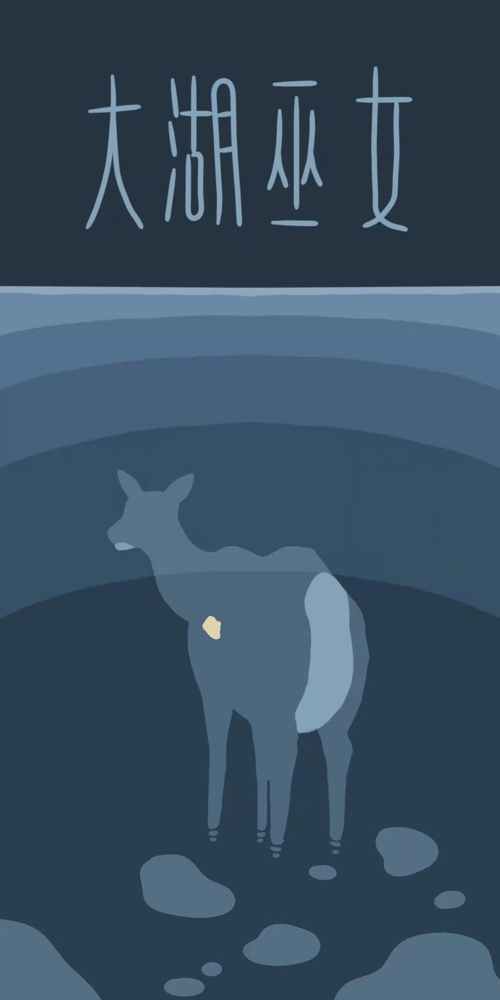
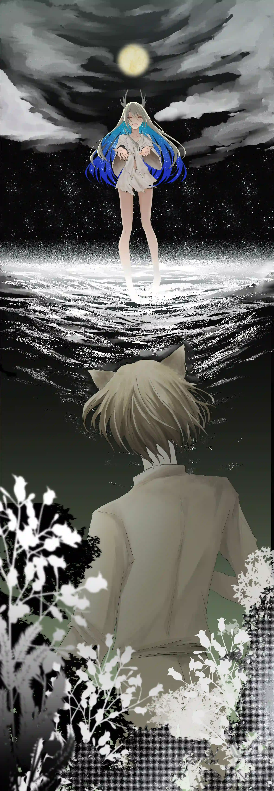

残垣断壁变成了大湖巫女创破的伤口，愚人金成了女孩摔倒留下的疤。巫女在大湖的遗骸中静静的沉睡，露出白白的骨。 {.textkai}

<!-- more -->

{style="float:right;max-width:45%;margin-left:1em"}

## 一

以前一次翻垃圾桶时，莫提和我说，哥伦比亚的拓荒者就是这个国家的失败渣滓和无能人渣的大杂烩。“他们贪婪，无能，渴望着奇迹垂怜改变自己的命运，却又不肯直面自己的凡庸和做作......不过是一群鬣狗，哈哈！”

那时的我未曾想到，如今的我们，也成了这群贪婪失败的鬣狗中的一员。

车队一字排开，各式各样的废物渣滓们已经落座。莫提伸手把我拉上车时，阳光从一侧穿刺进车辆，映在前面两排人的背脊上——再往前又是两个背脊，枯燥如同莫提怀里的收音机聒噪的哥伦比亚乡村音乐。他的收音机倒是有些坏，按钮被我和莫提摩挲了一遍又一遍，漆都掉的差不多了——这铁漆下不知名金属在太阳光里闪耀着，刺激我的眼，弄得我心慌。

我也许有几个朋友，大多看不到生活的出路，早一步应大公司的召集，去了西边荒野；还有一些人犯了罪，或是染上矿石病，被政府驱逐为了开拓者，也去了西边荒野。成为开拓者死在荒野上，似乎就是我们这些废物的最终归宿，所以我都有送送他们。如今轮到了我，竟然没有人来送。我已经野狼似的在哥伦比亚的大城镇里转悠了一圈又一圈，到底还是听了莫提的话走向西边——哥伦比亚的大城镇收入高，开销也高，那所谓的体面世界，终究和我没什么关系。

我虽然孤身一人，到底也是有个名为莫提的朋友。他的出身比我好，落魄的却更惨一些。据说他的双亲似乎是大公司的要员，因为什么唠么子的政治斗争突然就人间蒸发了——于是他在城市的丛林中跌爬滚打。对他亲近是说不上的，只能说是有个互相信任的权利。若是没人来送，就当我和他一齐告别过去互相同行，多少也是个聊以自慰。我看着敞篷车队里的人探出头来，和车队外的送行者吵吵嚷嚷，心底就不由得浮现起烦躁。于是我屁股一挪，又坐的更中间了。

公司旗下的拓荒者敞篷车队说长不长，也就个三四十辆排成一字。车头清一色的向着西边，两边的人儿就像是弹簧一样蹦了出来。哥伦比亚是个种族的熔炉，你能在这里看到任何人种。我不由得戚戚——前些天晚上若不是莫提，我早就被前面那辆车副驾驶位上的瓦伊凡人揍成沙虫罐头了。

莫提这小子就坐在我的前面。他半只手插入裤袋，满脸嫌恶的用手肘尝试顶开身边那个大屁股塞拉托人。我把头从他们中间伸过去，他马上就很默契的转了过来。

“我们什么时候走？”“不知道。”“我有点饿了，你吃了吗？”“不知道。”

收音机就放在他的膝盖上，吱吱呀呀的放出音乐。我伸手拍收音机的按钮，又拍了一下他的头。

这时敞篷车突然动起来，晃得我一时不稳。我看到莫提弓起身来，用身子护住了收音机：“呆子，哪有你这么拍我的？”气的我赶紧回嘴：“你才是呆子，车开了！”他茫然的眨眨眼，突然意识到车开动起来，便对我露出一个岑岑的笑容，在颠簸中护收音机更紧了。边上那个大屁股的塞拉托人对收音机不感兴趣，也不再挤莫提的位置，于是这节敞篷车变得像是个小哥伦比亚，也算是相安无事。车队最后十几车都是感染者拓荒者，弄得整个车队又像是个不那么小的哥伦比亚，但也算相安无事。

适应了颠簸，我看了一会儿风景，便被无聊和困意挫败了。莫提倒是已经睡着，流着哈喇子靠在那个塞拉托人肩膀上，两人活像是一对跨越禁忌的情侣。我缩了缩，看着他怀里抱着的收音机，逐渐也被疲惫包围。这最后一排后面就是外焊的行李架，于是我靠在行李上，勉强也算是睡着了。

## 二

车队开了一个多月，弄得零嘴什么成了奢侈品。车队的领头倒是很客气，每天都给我们发仙人掌干蛋白条——吃起来仿佛在嚼滑板；还有干的和泥巴块一样的驼兽肉干——味道和外形几乎一模一样。

有天那个要揍我的瓦伊凡人在车队修整的时候下了车，挨个儿经过敞篷车：“行行好，谁还有点糖啊！”弄得大家都不做声，慢慢悠悠零零散散回答说没有。有肯定是有的，有的人已经偷偷藏好，也许会在夜半三更的时候在舌头下面埋一块解解馋。我看那瓦伊凡没了糖，就像是被剥离了骨架灵魂的一滩软肉，便把自己最后一块软糖掰了两半分给他。一个月前还趾高气昂挥舞拳头的他差点就跪下来叫我爷，十分滑稽。

当我们到了预定的开拓地，已经花了近两个月。雇佣我们的公司指使我们在这里建设前进基地，为将来建造工厂和试验场做准备。开拓地自然是很美的，有齐腰高的草场还有片湖。湖的对岸就是山崖，拔起来宛如天和水的背景板。不过我们已经没有精力去欣赏，除了几个以前干猎人行当的想去打点野味，其他人各个都扎完营便倒下睡着了。得益于一路上死了不少人，携带的帐篷比原本多出不少。不过尽管如此，拓荒者们还是要几个人挤一个帐篷，我就很幸运的和莫提以及很不幸的和大屁股塞拉托住在一起。

第二天那大公司出身的领队就下了分工：有人去研究地形，有人去开拓草场，还有人被勒令去砍树。我和莫提原本擅长的都是打架，讲究的都是如何在哥伦比亚的街头械斗中站到最后，便觉得砍树定然是个力气活。然而这斧足足有六七斤重，光是提上到湖边山崖有林地的地方就燃烧了我们不少脂肪和精力。

在树前，莫提以为是用力就能砍进去，提起斧子就是重重的一抡——斧刃猛然磕在树皮上弹开，反震让莫提一把蹲坐在地。抬头一看，那树只不过多了一道白白的擦痕，晃动的树干就像是在嘲讽我们的不自量力。

我扶起莫提，他不信邪的又抡起斧子尝试。这次他摔得更狠了，以至于一块半埋在土里的石头划破他的皮裤。见他那尴尬的样子，我毫不犹豫嘲笑起了他。
嘲笑完，我举起斧子，打算用更大的力气抡下去。莫提看着我的手，不知道是期待斧子没入树干，还是希望斧子弹开，证明我和他半斤八两。就在我扭转手臂打算发力的时候，一个还算好听的女声飘出：“你们是谁？”

我和莫提转头看去，一个样貌还算凑合的埃拉菲亚姑娘从林子中钻了出来。她下半身穿着兽皮裙，上半身披着一层亚麻布衣，衣袖穿过细绳绕一圈脖子固定住。她看着我们手里的斧子，突兀的笑了起来，“你们这是打算砍树？”

我愣住了，莫提倒是反应了过来。“怎么，笑话我们？不是我们没力气，是这里的树皮硬，不好砍！”这下姑娘笑的更大声了：“不好砍？”“不好砍！”

莫提这么说着，示意我用斧子砍下树，给这姑娘演示演示。然而那埃拉菲亚却轻快地跳到我的身边，一把夺过我手里的斧子。她抓斧柄的时候碰到了我的手，吓得我一阵哆嗦，手一松自然也就把斧子送了出去。抓到斧子，她颠了颠又摸摸锋口，露出一声赞叹。反手一转，斧前段就拍了拍树干——这下只是轻轻的试探，树叶微微摇晃。

莫提和我对视一眼，想要开口要回斧子。然而在我们开口之前的一刹，姑娘突然双手一前一后紧握斧柄，腰猛然发力，怔的便扭了个半周圈。一股狠劲儿从她的手臂里突然迸发出来，伴随着臂弯的变化狠狠涌向我们。埃拉菲亚的身体呼的变成了陀螺，手臂倏忽间削直成一排唰过去——然而斧刃在触碰树皮的刹那突然微微扭动往下一切，一股金属突刺斩裂木料的摩擦声爆裂开来。我和莫提定眼一看，这斧子已经陷入树干四分之一，不由得大受震撼。

埃拉菲亚用一只腿蹬住树干，一用力把斧子拔了出来。她用斧刃稍微削了一下，树干上便呈现出一个由大到小的倒三角凹陷。之后便是她又一次举起斧子，让其轻松写意的没入树干。我发现她后面几斧子并不像第一斧一样用力，却也在几乎没有肌肉的瘦弱肢体上充满力量的美感。

莫提走上前，看着埃拉菲亚，眼神在斧子上飘忽不定，不知道该不该开口。然而此时的埃拉菲亚已经完成了心血来潮的工作，把斧子往地上一丢。她抹了抹手掌，用力一推，大树便向着另一侧倒去，微微弹起，彻底倒下。转过身的她对我们露出微笑，这下我和莫提就相当难堪了。

“敢问姑娘尊姓大名，何方神圣？”最后是莫提咳嗽了一下，先开了口。那埃拉菲亚只是笑了笑，没有回答，又一蹦一跳的回到了丛林深处，消失不见。我和莫提对视一眼，选择接受这份好意，提起斧子削去枝干，扛起原木便下了山。一路上莫提对那姑娘神乎其神的砍树技巧无比崇拜，甚至胡扯到什么砍树的源石技艺，听得我耳根生烦。

## 三

如果不算昨天大家到达后倒头就睡的夜，今天晚上才是我们这些拓荒者们正式度过的第一个夜晚。那些猎人真的在附近猎到了几只肉兽，此时都剥去皮进了锅。这锅是一些开拓者的妻女在下午时架起的，里面炖了四五个小时的蔬菜锅料，加上肉就是一锅温热的肉糜汤糊糊。我们这些开拓者三三两两的坐在一起，手里端着碗装着肉汤，一边喝着一边吹逼聊天打屁——准确的说一开始没人聊天，大家都在大口喝汤。

我和莫提都饿坏了，吃的也不是那么顾及形象。莫提喝完一口汤，突然就没征兆的愣了愣，只是把木碗放在嘴边，喉头一点点的碰撞蠕动。我看他其实是吃的很精细的，缓过来以后便一点点小口小口的含着汤喝。他喝的挺小心，先是吮完上层的油脂，还不过瘾，就用小指头去刮碗壁上的零星油水。吮完油脂之后他满足的长叹一声，便大口吸溜起汤来，若是吃到已经炖成烂泥的蔬菜，他便会屈起嘴巴用舌头将其卷走。汤喝完了，最底下就是些肉——碗里肉不多，也就一两块，算是很多了。我看他把碗一抖，那肉自己活起来蹦到他的嘴里，接着他就嚼了起来，方圆五米之内全是砸吧砸吧的声音。我是知道这肉炖的这么烂，多少也还是有肉丝的，很容易卡到牙槽里——果不其然，莫提一把肉嚼烂吞下就舌头鼓动，想把那牙槽里的肉丝赶出来，片刻后干脆上了手指去嘴巴里抠。我原本是想笑他的，然而却发现自己的牙里也卡了一丝肉末，于是两个人就都毫无形象的伸出手指放在嘴里，相当不雅观。当然，这抠出来的肉末肉丝自然是要自己吃掉的，可不能便宜了别人。

最先开口的是个曾经的强盗。他咕噜咕噜喝完，像是闲聊一样说起吃饭的趣事。他以前在的监狱里关了个酸臭文人，一被打就会像个猪猡一样哼哼起来。监狱情况特殊，有时候吃的会藏在裤裆底带入囚犯区——然而这文人是从来不吃的这种裤裆食的，还说什么文人气节的云云。我听得略有生气，一拍碗说：“这（哥伦比亚粗口）不是浪费粮食么？”于是大家的话匣子就这么打开了。

饱汉不知饿汉饥，自然话题是吃的，论“吃”的话题又不知不觉的变成了吃什么有力量。那大屁股的塞拉托人便抢着开口，说什么“要多吃蛋白肉才能有肌肉，有肌肉才能有力量”。莫提听了这话，便反驳了回去，大体是说肌肉和力量没有绝对关系之类的云云，说着，他举了我们今天遇到的那个埃拉菲亚姑娘做例子。塞拉托自当然是不相信的，开口就想骂莫提要面子的骗人精。这时候大公司派来的领队咳嗽了一下，开了口。

“我想比利先生说的应该是真的。”

莫提这下兴奋了，而塞拉托则瞪大眼睛。领队又咳嗽了一下，慢悠悠的喝了口汤：“今天，在你们劳作的时候，我带了几个人开车去“拜访”附近的原住民部落。除了通过交涉弄到的一些地形情报和物资，我还听闻了一个大湖巫女的故事。”

他指指湖水：“那些原住民叫这湖为楔罗湖，好像是什么恩赐大湖的意思。以前这湖边的山崖上，还有一个聚落。聚落中一对夫妻因为无力抚养孩子，就把最小的埃拉菲亚女婴抛弃在湖边。但是很快这个部落遭遇了天灾，全都沉到了湖底，唯有那个年幼的埃拉菲亚婴儿活了下来。大湖展现了他的恩赐，喂养给女婴母兽的奶，教会了她在湖边生活。于是这个女孩就成了大湖巫女，意味大湖抚养长大的孩子。”

“这不是野人吗？”一个不认识的菲林在我右手边叫到。后来在这个菲林死的时候，我才知道他是因为赌输了全部家财，才成为一名拓荒者。

“那个部落的人偶尔会和这位大湖巫女有所接触，据他们说这个巫女会使用我们的语言，能够进行交流。她会用山林中的草药野果和部落换东西，或是同经过此处的游商交易。”

这听着就玄乎，但好像又有点可信。我想了想，偏头问问莫提我们也许见到的就是那位大湖巫女罢？他说八成。于是我又问，不会是我们俩集体幻觉了吧？他说也许。我想他回答的那么不肯定，而这片开拓地也对我们是未知罢，于是不肯定和未知算是负负得正，便又放下心来。一会后，我便不再胡思乱想，又和其他人继续其他的话题了。

## 四

这开拓地的风景美是美丽，却并没有什么用。对我们这些人来说，每天要干的事情无非就是砍树，划地，开拓。大公司的车队一两个月才来一趟，整的煤油啥的都不够用，于是不点篝火，晚上就得黑灯瞎火的出去，起夜很不方便。除去煤油灯就是吃饭的问题了：那些猎人不是每次都能打到肉的，三十车人的伙食开销往往都是素食。这吃饭的点儿一到大家就往锅跑，恨不得再生两条腿。为什么呢？因为大锅不是炖菜就是清炒，最上层的油花最多。我和莫提跑得快，每次碗里都能漂浮些许油水。那大屁股塞拉托人就不那么幸运了，只能喝到清汤，一来二去他那屁股也瘦了下来。

我和莫提在哥伦比亚的小巷里，经常逮得住垃圾桶边的老鼠——不是为了吃，只是为了玩儿。这哥伦比亚可不比开拓地，那里的垃圾桶里只有食物，哪里像大公司说的“这西边遍地希望，前途无量”？当然，希望没见到，自己的体重倒是搭上去了一磅又一磅。

于是有天我和莫提在山上，便聊起了磨洋工去打点野味开开熏的主意——我们连机敏的老鼠都打得到，还挣不到这山崖上的野味？两个人把干活工具往树下一埋，便兴冲冲的钻进林地。
然而这山地却不是大城镇的小巷，这里的野兽也不似哥伦比亚的老鼠。我们两个汉子大开大合，踩得落叶沙沙作响。看到远处的一条沙虫，像是储备粮似的，不争气的口水便从我俩嘴角落了下来。然而走上两步，那沙虫听到声响便滋溜一下钻地里跑掉了，气得我直跺脚。
越过崖边的沟子，就是树林的更深处。几只壮硕的叫不上名字的肉兽前前后后跑来跑去，弄的我们流口水。要是那几个猎人来肯定有办法——然而我们俩混混打架内行打猎外行，也就只能看着肉兽们嘲讽似的对我们哼哼几声扬长而去。这下士气算是跌倒谷底，莫提头垂到地上一脸灰心丧气。我拍拍他的肩膀以作安慰，这时便听到头顶传来嗤嗤的笑声。

莫提和我仰起头，就看到那位大湖巫女坐在我们头顶的树杈上捂着嘴偷笑，这弄得莫提相当难堪。我拉了拉莫提，他也意识到我们确实出了丑，于是愤怒散去又是垂头丧气了。那巫女倒是轻轻一跳，让埃拉菲亚的足蹄落在我们面前。她止住了笑，问道：“饿了？”

我和莫提没有回话。

她弯腰在我们面前捡起一块石头，用力往身侧一丢。我当然不知道这丢石头有什么意味，只是在盘算着怎么离开而不丢脸。但莫提却怪叫一声，向着石子儿的方向撒开腿来。我一直手被他牵着，便不由自主的也过去了。几秒钟后我就震惊了——那石块儿压在地上，擒着一只反复扭动的沙虫。沙虫的尾巴被压住，一节一节的身体反复尝试蠕动却又无果，只能可怜的定在地上。

莫提兴奋地尖啸一声，跳上前就要抓起这肥美的一整条肉。然而那巫女轻快的跳到莫提边上，抬脚踢掉了那石块。沙虫蠕动着转过莫提的手掌，一下子便遛弯儿冲到了远方，钻到土里不见了。

“扔石子的时候还没有注意到，这母沙虫还没产下崽来呢。”野丫头笑着和我们解释道，“再说了，其实沙虫的肉不好吃，干巴巴的，没有油容易吃得胃酸。去湖边吧，我请你们吃点鱼。”
我和莫提一时间没有反应过来，就怔怔地跟着她下了山。没名字的巫女左拐右拐，步伐灵动随性。她嘴里哼哼着不知名的小曲儿，带领着我们绕在山路中时上时下。我看这一言不发也太过于尴尬，便开口问道：“那个，巫女，你这唱的是什么歌？”

她转过头对我露出灿烂不加掩饰的笑：“这是湖边的虫鸣啊。”我挠挠头听得似懂非懂，莫提则偏头在林地中左顾右盼。这树忽然的就稀疏了，坡度也骤然变大。湖突然就出现在我们面前，山崖突兀的被抛在身后。巫女调皮的一个转身面对着我们张开双臂，“到啦！”

我们在哥伦比亚未曾见过真正的湖，最大的水池也不过是中心广场的喷泉罢了。营地在湖的另一边，此时和我们遥遥对望。我看那边营地里三三两两活动的人就像是个个小点在移动，不知为何乐上心头。之前打水的时候，我从未认真的打量这湖，此时便细细的打量起来。最初的感觉这湖并不清澈，视线穿过水面几米便模糊不清；然而很快眼睛适应了，湖水便又深邃了起来——表层的浅波是平滑的琉璃，深层便又像是深沉富有韵味的蓝宝石了。我看到莫提也在看湖，眼中逐渐带着一丝震撼，好似这湖是他喜欢的姑娘的明眸宝珠。

“嘿，我来借几条鱼款待朋友们！”巫女突然转过身，张开手臂对着大湖喊道。我们还没反应过来，她已经一个愣子钻进了湖里，穿过琉璃，没入蓝宝石的深处，便不再被我们的视线所捕捉了。我和莫提对视一眼，一愣一愣，还没有所反应，一条鱼唐突的被抛出水面，摔在我们的脚边。我手比莫提快，先一步抱起了鱼。莫提还没斥责我，第二条鱼就跟着甩了出来。湖面泛起水花，紧接着是第三条，第四条。最后巫女的头从湖里冒了出来，头发上满是水滴：“够吃了吧？”

我们连忙点头，手忙脚乱的一人抱住两条鱼，攒的紧紧地，就怕鱼儿一个蹦跶脱离怀抱又落进湖里。巫女游到岸边，爬上岸来甩甩头发——那衣服湿透了贴在她的身上，她毫不在意。我赶紧推推莫提，两人窜回山林里捡了些柴火，就在原地架了个火便烤了起来。火焰照在我们脸上，温暖的力量感染起我们嘴角上扬。巫女看到我们笑了，便也合群的微笑起来。她站了起来，古灵精怪吐吐舌头，“那我走啦！”

我赶紧拉拉莫提向巫女道别，然而他的视线却死死锁在烤鱼上不动了。无奈的一回头，巫女已经不见了，便又可惜起来。但烤鱼确实是香，不吃白不吃，于是我和莫提就吃了似乎是这辈子以来最美味的一顿小餐。

我们俩走在山道上，莫提细细的撵着一根鱼刺，满脸满足。我则总是感觉好像有哪里不对，忘了什么一样。一问莫提，他也一问三不知，这疑惑便又了了作罢。

我甩甩衣服，伸手去挠后背，肋骨一根根的动。“比利，你说巫女这样过日子岂不是很洒脱？”莫提也学着我挠挠背：“是的啊。”我放开手：“要是我会那些个抓鱼技巧，我也这么过了。”他这下笑了起来：“不是吧，你能？人家洒脱是洒脱了，但是也没书，没电，没电影啊！老在这个沟里转，多少会无聊罢？”他不说了，用脚趾去抓另一只脚的后脚背，我也就不聊这个话题。

想想莫提说的也有道理，这电油书还有那电影实在是超出我内心标准基准线的玩意儿，能看到用到自然是好的。其实现在的生活也不错，虽然吃不饱但不至于没得吃，床位算是烂的但也是自己的了。但我又突然挺泄气，不知道为什么，心底就是有一种东西在鼓动，毛毛的，搞得我很不舒服。我只觉得也许大概可能是关于活着的什么玩意吧。

但是这想法一下也中断了，因为我俩不知不觉的已经绕回了营地。一抬头，就看到领队在和几个人商讨什么，我们就自觉地凑了上去：“怎么了？”

那领队抱着手臂，双脚不耐烦地打着节拍：“有人说今儿在湖里看到了鱼，就想要下去捞上个一二三只。奈何这湖里的鱼儿似乎是成精了，贼得很！”

看样子是没抓到，这下我和莫提都捂住嘴偷偷笑了起来，就像是几小时前那巫女在树上笑我们一样。这领队看我们笑便更加生烦，挥着手让我们回去还工具。这下我和莫提都笑不出来了，因为我们意识到，那工具还在山崖林地的树下埋着呢。

## 五

开拓地信号偏僻，便总是有三三两两的人要来找莫提借他那收音机。莫提是很不肯的，但又算是心软，每次都不情不愿的要跟着看看这些人借了怎么用。这些来借的人也无非是听个消息，完事之后把天线一收便还了回去。直到一次，一个佩洛来借，接手的时候一不小心把收音机摔在地上——之后莫提就再也不外借这收音机了。

我和莫提的关系好，便经常和他一起盘坐在帐篷里听收音机；那大屁股塞拉托沾了一个营帐的光，便也安安静静的一起听了。外面吵吵闹闹，似乎男人们又在说什么抓鱼的事情——那些猎人们回来脸色一天不如一天，开辟新的食物渠道迫在眉睫。

收音机歇息没有节目的间隙，我们三个大男人在营帐里躲太阳聊天扯屁。那大屁股的塞拉托以前是个部落的勇士，不知怎么的就被人骗到了哥伦比亚——他话说到这里就不愿意再说下去了。我倒是和莫提很熟，便扯的又是一些有的没的。当然，最终话题总是会扯到食物上的，饿人自然有饿人的话题。

收音机的噪音渐渐减小，新的歌曲开始冒出，下一单节目即将轮到，于是我们仨很默契的一齐安静下来。这时候外面突然传来一阵震耳欲聋的呼声，完全掩盖了收音机自不量力的声音——莫提狠狠地撂上一句他妈的，把头从营帐里探了出来看看了。我问他：“怎么了？”他把头缩回来愤愤的说：“那帮人终于捞上来了一条鱼，现在吼得和哥伦比亚首富得了艾滋一样，妈的，那条鱼还不及巫女捞上来的四分之一大呢！”我点点头深以为然，如今看来巫女的捞鱼技术神乎其神。

倒是那塞拉托人好像被捞鱼声吸引了，说了声自己也想下水试试便出了营帐，这下帐篷里只有我和莫提两个人。收音机似乎也被外面人们的吼声给吓到了，蹦出一串杂音之后，声频又被白噪音填充满。我咒骂一声，抬头却看到莫提在对我诡异的笑。

我一阵激灵，“你想干嘛？”莫提突然就伸出手掌，对我摊开掌心。一小块被油皮纸包裹的完完整整的方糖出现在我面前。我有点惊喜：“你小子还有糖？”莫提撇撇嘴：“最后一块了，不是给你的，我打算找个机会给那个巫女尝尝。”听到这糖吃不到，我不由得感到一丝失望，但是想想把这块糖回报给那位大湖巫女似乎也是合情合理，便没有说话，只是看着糖块，喉头不由得鼓动，鼓动了一下，再鼓动一下，营帐里传出清晰地吞咽口水的声音。莫提听着一节一节的鼓动声，自己的说话声也越来越小，喉头亦动了起来。我们什么话也没说，一起看着他手心里的糖块，只有两个吞咽口水的声音如同心跳一般，此起彼伏。

“......或者我们俩先吃？”不知多久后，莫提悄悄地说。我赶紧咽下口水：“你不是说要给巫女的吗？”他连忙哦哦了两声，把糖块往口袋里一塞，我们便心照不宣的不再提这事情了。
营帐里面刚刚彻底安静下来，营帐外又爆发出了一阵喊叫。只是这次声浪的情绪不是什么兴奋和喜悦，而是恐惧和畏惧。我感到一丝不对劲，连忙拉起莫提。他顺手用被子把收音机盖住，我们一前一后离开帐篷。外面的湖边堆满了人，大呼小叫交头接耳喧闹无比。莫提感到一丝不对，伸手去拉了个人问问，接着回头跟我说：“大屁股淹在里面了！”

原来刚才那大屁股塞拉托人和三个人下去捞鱼，第一趟不出所料的什么都没抓到。三个人都说这湖里鱼怕不是成精了，个个都滑的像是泥鳅一样。只有这塞拉托执意要再捞一捞——他说这湖深处没光线，鱼也是瞎子，他在水下视力又不错，也许潜的再深一些就好抓到了罢。几个人拗不过他，便又跟着下去了几个水性好的。这塞拉托确实视力好，就游在最前面，其他几个人则散开来跟在身后。这湖深啊，就像是没有底一样，后面几个人就打起了退堂鼓。突然那塞拉托下潜的速度快了起来，就跟疯了一样一个劲儿的往下钻——后面几个人没反应过来，拉也拉不住，就看到这塞拉托直直钻向大湖深处。这几个人的憋气极限到了，只能被迫上浮，自然也就在岸上等待——然而那塞拉托还没有上来。现在众人纷纷揣测，是不是大屁股被水底的水草缠住了，还有没有救之类的云云。

我看他们一筹莫展，就跟着一筹莫展起来——刚才跟下去那几个人，已经是我们百来号人中，水性最好的几个。领队倒是有点焦躁的在原地转圈，和周围的人大声嚷什么，毕竟开拓中死几个人没什么，但因为这点小事被淹死也太滑稽了。那几个刚上来的兀自被人群包着，说什么也不愿意再下去，这也能理解，下面深不见底，要是体力不支自己也搭在湖里可就划不来了。

我内心并没有对大屁股有什么特殊的友情情感，最多也就几口油花的交情。看着湖边人头攒动却又毫无行动，觉得也算是合理。就在这时候，隐隐约约的感觉好像太阳被什么遮到了一些，我便抬起头来——似乎有无形的力量在号召，所有人都停下了交谈抬起头——在湖对岸的山崖上，兀自出现了一小点的人影。那点人影从崖头窜出，呼的一下就跳下山崖，向着大湖急速坠去。在她跳下的刹那，数十只羽兽就像是受惊一般从山崖各处飞出，发出一声又一声喊叫。跃落的无声余韵穿过一整个大湖，化为无数黑点和翅膀，撞击在我们的眼球和耳膜，又从另一侧穿出，越来越小，越来越小。

大家都呆呆地看着，仿佛因为意外而让精神失去了很多。只有我和莫提看出来了，那个人影正是那位大湖巫女埃拉菲亚姑娘。伴随着寒光一闪，湖面溅起水花，所有人的视线又凝聚在大湖那溅起的一圈圈涟漪上了。涟漪之后就是寂静，万分的寂静，仿佛整个世界都一起屏住了呼吸。

紧接着，湖面颤抖，岸边人们的后脑也不由自主硬了起来。仿佛等待了一个整世界的毁灭和新生，巫女突然从湖里冒了出来，大口大口的喘气。她背上背着个人，正是那大屁股塞拉托。在震惊中，她拖曳着塞拉托向着岸边游来，在湖面划破出一连串的波澜。岸边的人默默让步，让托着壮汉的瘦小无力的埃拉菲亚顺利上岸。

巫女抓着塞拉托，在岸上走了几步，就晃了晃。我连忙想要上前去扶她，然而前面一个个人就像是站立了一样杵在原地，一动不动。我尝试推开前面的人，却发现使不上力。莫提就在我边上，此刻也一动不动的，就像是中邪了一样。湖边的人群安静的可怕，唯一的声音只有埃拉菲亚的脚步。

她又走出几步，气息入不敷出，一把跪倒在地。我终于推开前面的人，跑到她的身前。人群有一点点喧嚣，又安静下来又喧嚣，最后变成了一种视线的凝视。我扶起埃拉菲亚，连忙把自己的风衣披在她的身上，人群还是没有动，只是视线如同矛一般钉了过来，越过了巫女和我，死死地扎在我们身后的塞拉托人身上。我微微发愣，偏过头看向那塞拉托人——他脸色铁青，已经死去，表情却又狰狞的带着一种渴望。接着我看到了他的手，青筋毕露的手臂硬的似是石头，手掌却又像是枯枝，死死地握着一块金，一整块粗黄金。

## 六

巫女缩在营帐里，身上裹了块毯子，抖得像是一只受惊的鸳鸯。我去要了一只油灯，放在她身前便出了营帐，去找莫提了。

莫提和领队几个人就站在湖边，脚边就是塞拉托人的尸体。那块粗黄金被这个塞拉托人紧紧攒在手心，掰开他僵硬的手指废了好大一番力气。现在黄金被领队拿着，这个背后站着大公司的男人正比划着双手跟其他人解释什么。莫提因为有收音机，勉强也算是个有威望的小头目，便也参与进来了。我站在他们后面，听着他们吵来吵去。

“这件事情必须有公司的参与！”“我们应该怎么划分......”“是直接拿到黄金，或者我们拥有开发股份？”“肯定要先想办法弄到更多的黄金。”“这湖是个阻碍......”声音一波一韵一起浪，相互碰撞冲突又重合。脚边那塞拉托人的尸体怔怔的望着天，仿佛没了期望又像是抱满了希望。不过却没人看他，男人们还是在使用言语的矛和盾相互交战碾压。

“这件事情肯定需要公司参与！”领队再次重复，声音大的一时压过了所有人。我趁着众人沉默的片刻，上前拉拉莫提的衣袖。莫提没有管我，眼睛直直的盯着领队手里的黄金：“最重要的当务之急不应该是弄清楚，湖底下有多少黄金吗？而且公司介入了，我们又能分到几杯羹呢？”他难得的用了大嗓门。我再次拍了一下他的肩膀，他才终于把头转过来，“呆子？怎么了？”我摸摸手，“趁现在把糖给巫女吧。”

这时候领队又喊起来：“怎么弄？”于是莫提一边把头转回去大喊：“领队！联系个你信得过的公司领导，偷偷弄几台大功率抽水机，把水放出去，我们自己分！”一边伸手在裤子口袋里摸索起来。他抓出包着糖块的牛皮纸，眼神还盯着那领队手中的粗黄金。我把掌心向上摊开，等待着他把糖放到手中。他的手摇了摇，突然像是抽筋了一样抽搐了一下，晃动在空中寻找我的掌心。“你到底给不给啊。”我不满的斥责道。他这才转过头，啪嗒一下稳稳地把糖块扣到我的手里。接着头又转了回去，去和领队继续争辩了。

我接过糖块，正打算回身，突然听到身后传来了一个弱弱的女人声音：“不能抽水”。转过头，是大湖的巫女站在我身后。她身上还披着那块毯子，寒冷冻得有些脸色苍白，埃拉菲亚的耳朵微微抖动，似乎有水滴滴落。其他几个人都看了过来，于是她又慢慢的说到：“不能抽水。”

“不能抽水？”莫提转过身，看着巫女，“抽水怎么了吗？”

巫女不说话，只是因为寒冷发着抖。她的头微微扬起，眼神碰撞在莫提的眼皮上，一整个脸都是紧的。莫提并不知道巫女的意味，只当这巫女也想从黄金之湖中分一杯羹，便有些随意的问道：“巫女，暖和了？你对这湖熟悉，你说，这水从什么地方开始抽呢？”巫女不说话，嘴闭成了一条线，眼神又凄凄切切的越过了莫提，落在了他身后的大湖上。莫提自讨个没趣，转过身招呼其他人：“先生们，我们继续吧。”

这时候巫女突然说话：“可以抽这里。”于是一众人又转过头来，看到了埃拉菲亚隔着毛毯戳了戳自己的胸口。莫提没看懂，满脸写着疑惑：“抽哪里？”巫女便收了手又伸出，指指自己的脑袋，说道：“也可以抽这里。”

这下我们都看懂了，身体拔凉拔凉，沉寂的正午阳光如同冰窖里灯泡的打光一般。那莫提一时间愣着，张张嘴却说不出话，就像是在街头斗殴中被戳了十几刀似的。巫女说完，在一片寂静之中，逐渐不再发抖。她默默地解下身上的毛毯，很耐心的折叠好，放在愣住了的我的手上，接着便转身背对着我们沿着湖走了起来。我们看着她的背影，一种很古的感觉浮起，说不清道不明。她走着走着，便又变成了小跑；小跑后是大跨步，最后变成了饱含着悲伤和失落的狂奔。她的步伐还是那么轻巧灵活，背影渐行渐远。

男人们一时沉默，也不知持续了多久。最后先是有人抖了抖，接着大家又一一夺回了身体的控制权。莫提叹了口气：“什么嘛。”便转过身去，男人们又热火朝天的探讨起来。我低下头，发现被牛皮纸包裹的糖已经被我攒到了变形。

## 七

领队给领导派了通讯，已经得到了回复。公司几位相当重视这片金矿，偷偷派了几个专家连带着十五台大功率水泵在路上了。这些金贵的人，物资源搭着飞行器，来的路途远远比我们当初坐的敞篷车要舒服得多，也快得多。

那塞拉托人淹死的一大好处就是，我和莫提两个人的营帐空间一下子大了不少。我睡不着便爬了起来，一低头就看到莫提还抱着他那收音机流着哈喇子。收音机里满是白噪音，弄得我心神不宁，便想伸手拍拍那按钮把它关掉。然而这莫提却抱得紧了，嘴里还嘟囔起来黄金之类的内容。好吧，那我不打扰他的美梦，自己拉开帐篷垂布走了出去。

外面的风挺大，吹着远处没被开拓的地方，齐腰高的草微微摇曳。我走了两步，不由得又走到了湖边——没了日光照拂，琉璃层被打磨消失殆尽，整片湖变成了一整块断面光滑的黑色玛瑙。看着玛瑙的切面，我不由得有一种错觉，突然的眼睛就迷离了，欲望变得有的远，有的近，思绪中平时无比崇敬的他乡王贵都在瞠目结舌，倒是些死者密密麻麻的爬了起来——有来路上因为发病被扔下车的感染者，也有数年前在哥伦比亚巷口被我一刀切掉内脏的倒霉蛋，当然还有刚刚死去的大屁股塞拉托人。这些死者们起起落落，马马虎虎的摇曳列队，哑了喉咙，失了怨恨，慢慢的移动起来，在玛瑙的另一端和我遥遥相望。忽然视角又变了，莫提在翻垃圾桶，而我在给他望风；忽的又变成了那个瓦伊凡人，正卑微的挨着车求糖。

视角变了回来，湖又在我的面前。月光轻轻地撒，我落下了点点冷汗。这时候背后突然传来女人的声音：“你说，黄金真的很重要吗？”于是回过头，看到巫女不知何时已经站在了我的身后。埃拉菲亚的脸上洒满月光，眼角又挂着一滴东西，像是坐着却又身躯软了下来，最终变成什么东西支撑着勉强站立。我头脑有点混乱，张嘴却没能发声，只是喉咙嘶嘶的响。慢慢的，嘴张开，又闭上了，又张开，“啊啊”了片刻才说出来：“是很重要。”

姑娘走到我的身边，和我一同看着湖面：“我，我从小到大，都没有离开过这片大湖，你们说你们来自哥伦比亚，那是个什么地方？”我想想便指正道：“这里也是哥伦比亚的一部分。”她眨眨眼，疲惫伤心的眼睛看着我。于是我接着说：“哥伦比亚很大，离我们很远，离我们很近。我来的地方，就是......”这时候她插嘴：“就是用黄金可以得到一切的地方吗？”这下把我愣住了，头脑昏昏沉沉的思索了片刻，只能点头说道：“是的。”

于是她接着问：“那个哥伦比亚能听到虫鸣吗？”我回答说不行。“那鸟儿呢？”我说也没有。她像是打了败仗的女将，头垂了下来，看着地，“那么，拿这么多黄金有什么用呢。”我一下子不知道该怎么回答，便说如果有了黄金，在哥伦比亚便可以买到鸟儿，虫儿了。她看向湖面，语气逐渐伤感了起来：“你不是说在哥伦比亚，听不到虫鸣鸟鸣吗？”这下我便真的不知道该怎么回答了，支支吾吾，就和她一起看向湖面。

湖面波澜，反而一切没有那么均匀，世道和规矩突然就变得无关紧要了。埃拉菲亚慢慢的靠了过来，头搭在我的肩膀上，接着便是身子逐渐倚靠上来。我小心的扶住她，感觉到她确实越发的无力虚弱，好似我们要做的行为真的在抽她的血肉骨髓一般，突然一种冲动就涌了上来。我脱口而出：“巫女，抽了湖，有了黄金，就跟我走吧。我带你去哥伦比亚，我们一起见证一下真正的哥伦比亚。”

她依旧看着湖，呆呆地盯着，似乎没有听到耳边的话语，可是喉咙里却有了响声。她的身子逐渐抖动起立，又比刚才更疲软了，无力的靠在我的手臂上。伴随着喉咙，她的脖子挣了一下，仍然没有动静。发丝随着微风悬空了，直不了，便在倒影中成了大湖的又一件收藏品。
她没有回答，我便也不再追问。突然我意识到那块糖块还放在营帐里，便想要站起来去取，却又被身边的人无形的制止住了。结果就是，我一动不动，感受着她的温度，默默地和她一起看向大湖。月光下，我看到我们的倒影，随即又被风吹起的微微波澜搅的模糊不清。波澜散去后我又一次面对倒影，看到那倒影心中的一整个哥伦比亚；以及她心中的又一个深不见底的楔罗大湖。

## 八

原本说是一周，然而公司领导似乎着急得很，那些专家和水泵像是魔术一样只用了个五天就出现在开拓地。专家想要看看那粗金，领队却已经将其视为己物，死也不肯放手。接着不需要一天，十五台雷神工业的大功率水泵水管已经一节一节插入大湖。这五天里开拓什么的都无关紧要了，所有人的话题只有一样东西——黄金。但我是没有再见到巫女，她仿佛彻底消失了一般。

抽水机启动的时候，领队拿了个喇叭，发表了讲话。我听得耳朵根烦，就看着水面。一开始只是点点咕噜的响动，接着有什么撞到水管壁，粘液撕碎和流水的声音越发响亮。又有一台抽水机被启动了，于是地皮跟着一起抖动起来，就像是地震。此时太阳刚刚升起，托起一片亮亮的天际。风一吹，水面波涛涌动，水下波涛涌动，让我看那水越是抽，大湖深处的黑水便越是黑了起来，仿佛在战栗。

抽水机们轰轰作响，逐渐又有空泡炸裂的声音。白色的激流刺破苍蓝的眼，湛蓝的波纹逃离苍白的轨迹，最终却都只能在轰隆隆声中溅起又凝聚落入黑黑的水管洞口。突然我听到大湖的悲鸣，神秘深邃的老人的脑浆正在被我们一点点抽出，起落又起落的万千声响最终归于平静，只有逐渐降低的水位一点点哀诉着暴行。

领队还在讲话，然而我却突然就不那么在意了。在他背后，我看到那大湖对岸高高的山崖上，突兀的矗立起了一个人影——不大，但是却失去了轻巧灵动，反而带着一种徒留的悲伤。于是我心一惊，眨眨眼反复确认，那确实是有个人影。便赶紧推开四周的人，向着那片山崖跑去了。

跑过草场，穿过林地，登上山崖，时间突然对我失去了意义。我只知道当我登顶的时候，太阳已经挂在了晴空正中。我看到了她，五天前她就是从这里一跃而下，捞起了塞拉托的尸体。现在的她孤独的站立着，晃晃悠悠，仿佛天地间突然就没了什么值得挽留的。一阵风吹来，她的头发被撩起泼洒飞扬，仿佛要牵动她全身摔倒在地。我连忙上去扶她，慌慌忙忙。手摸上去，她的后背软软硬硬，似乎有千斤重但又轻不即两。

水还在抽着，我看着大湖的孩子，巫女看着城市的血脉。一种痛楚不知为何爬上心头——这五天不见，她干枯了许多。原本轻巧灵动的埃拉菲亚一去不返，只残留一双茫然而失去焦点的眼睛看看我，又看看哀嚎的大湖。我突然不知道应该说什么，只好和她一同静静的立。何无忧愁？何无悲戚？现在只有堆砌而成的沉寂。我轻轻地帮她把发丝捋细，小心的一点点顺在她的肩膀上。她的眼神有一点点亮了起来，像是复燃的死灰，但又随着点点闪光再次黯淡。接着她转过脖子，对我点点头，痴痴地，再无笑声，于是默默也了无了意义。

“我们......”我开口了，还没说完，大湖巫女突然将一根手指放在我的嘴唇上。“我想回家了。”她说。

我突然感觉不妙，却听到她再次对我笑了笑，仿佛曾经的轻快和活泼又回到了身上。“你啊，为什么你的哥伦比亚，就容不下我的楔罗大湖呢？”

这话调皮轻快，就像是最初见面她坏笑着问我们：你们这是打算砍树？然而我心底的不妙一下子达到了顶峰，突然就要伸手抱紧她。灵动和轻快确实回来了，她便优雅的轻轻推开我的臂弯，像是舞者一样转过身在山崖的边缘，对着我最后一笑。接着，她背向大湖，双脚轻跳蹿跃，一下子腾飞而起。我怔住了，傻傻的看着巫女在空中划出自己的弧度——我只记得她还在滞空时确实还在笑的，接着就自己折断了自己的双翼，毫无防备的后背向下坠向楔罗大湖。

我反应了过来，突兀的跪下。我突然发现她还没有名字，也许只是我不知道她的名字，结果喉咙中也只吞吐出巫女几个字罢了。倒是那楔罗大湖上划出了一道彩虹，就像是即将被榨干的老人贡献出了自己的最后一点力气，为它的儿女写上一个属于大湖的句号。不过，随着水抽着，那彩虹也就消失不见了。

我愣愣的跪着，耳边的一切都失去了意义。下面，领队还在聒噪，反反复复的强调什么。我刚想站起来，风就把他的话吹到了我的耳边：“我们是希望。”

## 九

傍晚的时候，大湖终于要见底了。这下湖边围起人来里里外外。我却是失去了魂魄，自己坐在营帐里，什么话也没说。

没有人看到巫女的坠崖，所有人都在盯着湖底期待下一秒能够暴露出粗金的金脉。我已经没了念想，便也没了兴致。这时候外面传来了一阵铺天盖地的响动，人声和脚步沸腾起来。莫提跑了过来，扶起我跟着出了营帐。

水被排干了，那大湖底下的淤泥和尘土中，隐隐约约确实埋着什么——但是不是黄金，而是已经被泡的腐朽不堪的残垣断壁和碎裂的骨片。人们已经冲下了河岸，难以置信的看着狼藉腐败的河床下属于过去的部落残骸。不过很快，有人弯下腰挖起了淤泥，便又兴奋的叫喊——接着人们又向着那边汇聚而去了。只有我呆呆地愣着，看着这些埋在淤泥中的属于过去的阴影。巫女回家了，也许我应该庆幸，但是悲伤的泉涌却又凿在我的心间。一块哥伦比亚生产的糖块消融在了楔罗大湖。

他们好像挖出了金脉，兴奋就如同宇宙有箭飞来，扎在每个人的心底。但接着又是吵闹，不知道发生了什么，我只是看着湖底的残垣断壁，想着那个传说，无心去管他们了。于是他们吵着吵着，声音又更大了起来。忽然有人非常大声的叫喊什么，但是我没有听清。我看着湖底的遗骸们，仿佛真的看到了他们——离开了湖水的庇佑，他们在慢慢的升起，纠缠成一团，飞向天空。忽然的有一个脱离了群体，却又自己回来了。纠缠的灵魂们安安静静上升了个百来米，突然打了个团，被停滞住了——天不留他们，地不留他们，只有大湖留他们。

莫提突然从后面握住我的手：“他妈的，呆子，走吧，没什么有意思的了。”我便支支吾吾了两声，仍然看着天空中那些不知所措的灵魂。他牵着我，逐渐的恼怒起来：“去他妈的吧，这些都是他妈的愚人金！都怪那个傻逼领队，把自己那块傻逼金子藏起来，不愿意给专家看看。老子他妈白期待了！”

我还是支支吾吾，嗯呐嗯呐的敷衍，眼睛越过空中的灵魂团们看向山崖——那边似乎又有一小个人影。一擦眼睛，原来只是眼拙。这便是让失望又击垮了我的四肢，让我一下子瘫倒在地上。莫提连忙把我扶起来，连连安慰我没事的，机会有的是。但我其实没有听进去他说的话，我只是在想，为什么我的哥伦比亚容不下她的楔罗大湖，想着想着便没了头绪，没了头绪便无所适从。此时我们已经走回了岸上，那空中的灵魂们还在那里，我便低下头，看着河床。残垣断壁变成了大湖巫女创破的伤口，愚人金成了女孩摔倒留下的疤。巫女在大湖的遗骸中静静的沉睡，露出白白的骨。<eod />

 {.centering}

（绘图：亲爱的树鹨、阿爻；本文首发于泰拉通讯枢纽）

<FakeAds />