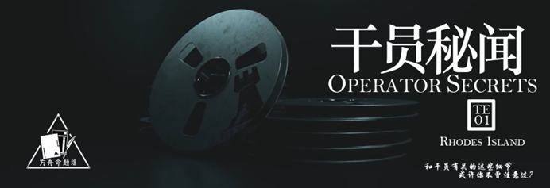

 {.centering}

各位刀客塔们大家好，这里是方舟命题组！这是博士水平测试与大家的第一次见面，以后也将成为常驻栏目，希望大家喜欢。本栏目主要通过单项选择题的方式来考察博士们对《明日方舟》中各种知识的理解和熟悉程度。如你所见，本期题目的主题是“干员秘闻”。祝各位玩得愉快！

<!-- more -->

【1】有一些近卫干员不是术战者，但仍可以通过天赋或技能造成法术伤害。以下近卫干员中仅靠自身不能造成法术伤害的是

|  |  |  |  |
| :---: | :---: | :---: | :---: |
| A.布洛卡 | B.棘刺 | C.暴行 | D.宴 |

【2】“爱猫猫协会”正在招收会员，有意者可到干员夜烟处报到。请问以下哪一位干员的种族不是菲林？

|  |  |  |  |
| :---: | :---: | :---: | :---: |
| A. | B. | C. | D. |

【3】有些奇怪的图标可能看起来不是那么直观。以下四项技能和干员的职业对应关系正确的一项是

|  |  |  |  |
| :---: | :---: | :---: | :---: |
| A.术师 | B.先锋 | C.近卫 | D.医疗 |

【4】以下立绘截取部分和干员的对应关系不正确的一项是

|  |  |  |  |
| :---: | :---: | :---: | :---: |
| A.绮良 | B.波登可 | C.斯卡蒂 | D.桑葚 |

【5】我们总调侃阿消和杜林很矮，但是很少有人知道，其实有一名干员由于特殊原因没有登记身高，这名干员是

|  |  |  |  |
| :---: | :---: | :---: | :---: |
| A | B | C | D |

【6】一般来说，干员的真实姓名和代号是不相同的。请问以下哪一个选项不是罗德岛上的干员？

 A.泰特斯·白杨

 B.简·薇洛

 C.马特洪·耶克

 D.阿黛尔·瑙曼

【7】医疗干员通常都具有“治疗”标签，但还有一些医疗干员拥有其他标签。以下匹配关系不正确的一项是

A.濯尘芙蓉——输出

B.微风——支援

C.凯尔希——召唤

D.华法琳——支援

【8】“我吃两碗”是一个永不过时的名梗。请问老鲤在“将进酒”中吃的是两碗什么？

A.臊子面
B.烂肉面
C.酸汤面
D.东方馅挂炒饭

【9】关爱空巢三星干员，从你我做起。以下关于三星干员的天赋，说法错误的一项是

A.翎羽的天赋是使其攻击力和攻速提升

B.月见夜和克洛丝的天赋描述完全一致

C.史都华德的天赋会让他优先攻击防御力最高的敌人

D.梓兰的天赋不会提升其攻击力

【10】干员的立绘中往往会出现背后灵和其他有趣的东西。考虑所有时装和精英二立绘，以下干员的立绘中没有无人机的是

|  |  |  |  |
| :---: | :---: | :---: | :---: |
| A | B | C | D |

【11】在干员烈夏的故事集中曾提到，坚雷构筑的零食网络覆盖全罗德岛，但是为了防止被发现，一般只会通过熟人拿货。猎蜂一般选择的取货对象是

A.玫兰莎

B.调香师

C.夜烟

D.慕斯

【12】由于拉特兰人独特的审美，菲亚梅塔拥有很多任务代号。以下哪一个不是她的代号？

A.苦难陈述者

B.神选之子

C.秘藏守望者

D.黏性超人

【13】除了特种干员之外，还有很多干员可以通过攻击使敌人产生位移。以下哪一位干员无法做到这一点？

|  |  |  |  |
| :---: | :---: | :---: | :---: |
| A.燧石 | B.野鬃 | C.早露 | D.小莫 |

{style="float:left;max-width:20%;margin-right:1em"}

*扫一扫二维码查看本期答案*

[点我也可以哟ヾ(≧▽≦*)o](https://www.wjx.cn/vm/QrZD8mh.aspx)<eod />

<FakeAds />