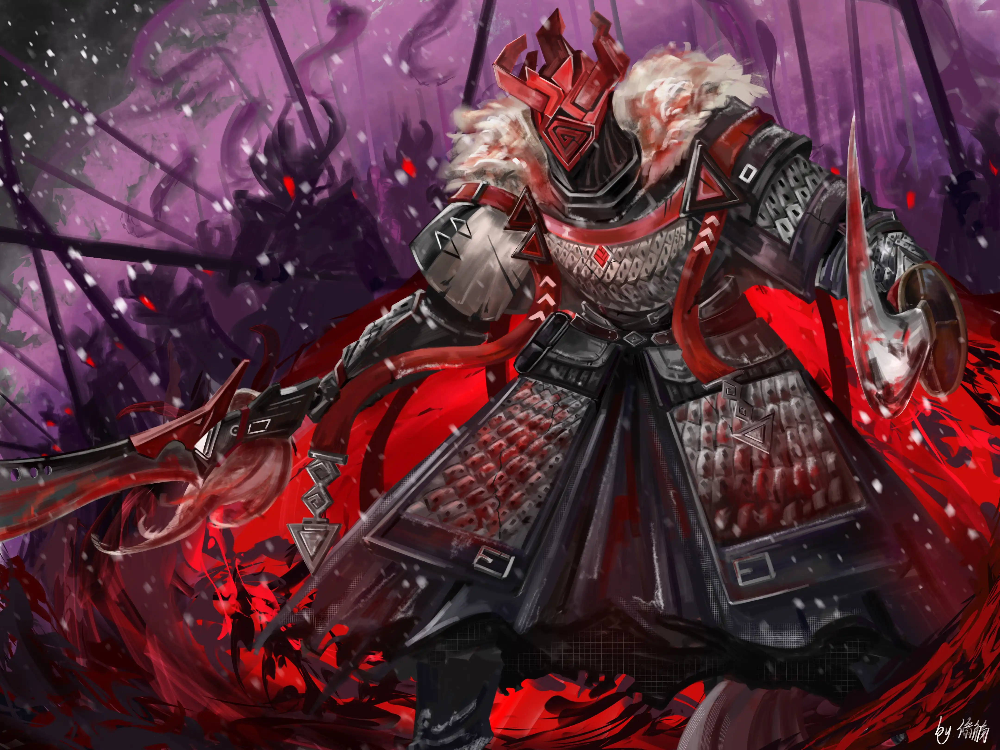
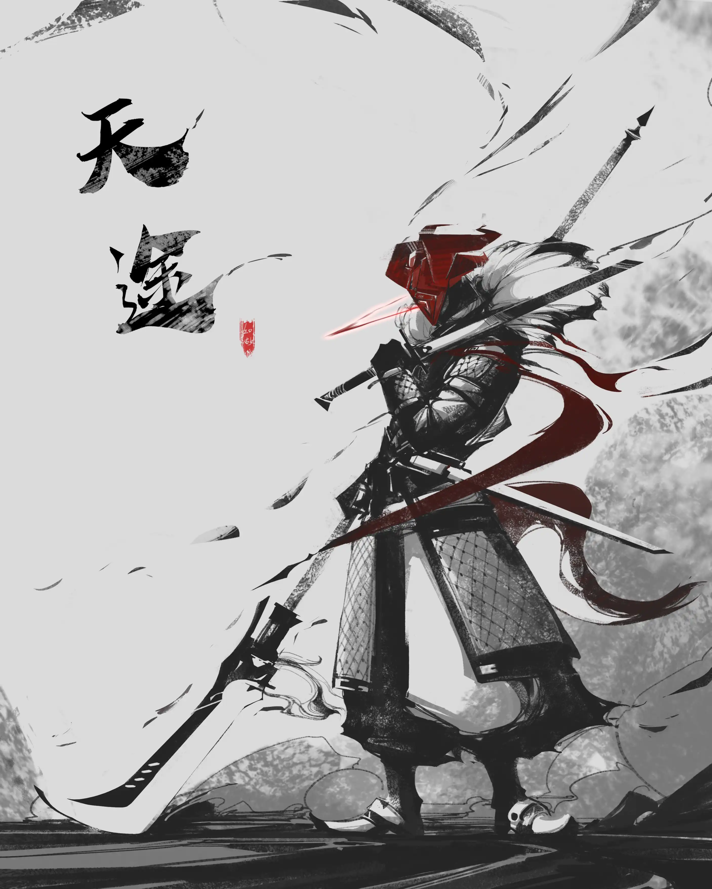

拓拉离开大骑士领后仍然在追寻自己的天途……{.textkai}

<!-- more -->

雪白色山脉蔓延向视野的尽头，松软的雪地拓印出他的脚印，乌萨斯中部的冬阳透过白桦枝叶的缝隙投下光与影，他很享受这种远离霓虹与资本的路途。

身上的甲胄已褴褛不堪，刀刃也早已结霜，他仍然紧握刀柄，任由寒风使缨带与披风飞扬不息，他不动声色，只是自顾自的行走——漫步在荒凉的冰原。

这几日来，无数狼狈的人们与他擦肩而过，甚至军队也从此处撤离，军队与难民在在慌乱中甚至没有认出这位梦魇来——哪怕其中有些人曾经因为拓拉输掉了半数积蓄。

拓拉从不理会这些懦弱的人，他从心底向他们致以鄙夷，他只是好奇人们为何慌乱，他听到过一些人们口中的话语。

“什么？连银枪的天马也……”

“那些竞技骑士都是些废物，有的跑了，没来得及和不想跑的也都……”

“莱塔尼亚的女皇竟然没有选择撤退？”

“乌萨斯皇帝最近可能又有行动……”

“炎国也一样么……听说哥伦比亚大总统自杀了……”

拓拉从不理会这些细碎的话语，他不肯低下头仔细倾听，他的目标只是到达天途的目的地。但他也隐约感到不安——刻在心中的、与血统同源的不安……

他望向南边一片深蓝的无垠天空，又握紧几分刀柄。

不知多少日夜，拓拉从不用现代的纪年衡量时间。他曾在身后的远方察觉到厮杀、屠戮、抵抗、撕裂，但随着某天一阵剧烈的震动和冲击，天地再一次陷入沉寂……

拓拉对这种存在无比熟悉，每次震动，他眼前就浮现出一片黝黑的幻影与猩红的光。

一个傍晚……

出于自己敏锐的直觉，拓拉猛地回过头，同时飞快挥动自己的长刀，雪地被猩红色的灼热光辉瞬间撕裂成两半，裸露出崎岖的黑石。

一声辽远的号角……

但身后空无一物，只有白桦飞雪依旧……

拓拉没有放松警惕，他将刀柄猛地插入雪中，双眼紧盯着延伸的白桦林，长叹一口气。

远方一阵骚动，却静谧无声。白桦林成片倒在弥漫的深蓝色雾气中，却激不起半点飞雪。晶莹的蓝光遍布每一寸土地，迷雾中闪耀点点赤红，无数影影绰绰的躯体渐渐浮现……

大群进化，大群学习，大群适应，大群永远跨越！

拓拉不解，他似乎从未见过这些怪诞的生命，但祂们的存在还是让他感到了本能的威胁。

“你们是谁？”

梦魇随即沉默不语，对峙着同样沉默的大群……

大群疑惑，大群陌生，但大群滋生恐惧与厌恶。

因此必须清扫，为了进化，为了生存！一柄流光溢彩的银枪从远处飞来，巨大的动能使它周边旋转着高速的气流，古老的莱塔尼亚源石技艺附着于上，至高的权能将空气都湮灭无痕，巨大的威力让大地为之震颤——这仅仅是大群的试探。

拓拉来不及躲闪，只能用尽全力将长刀一挥，刀刃才刚刚与枪头接触，巨大的冲击力便使他飞出十几米开外，剧烈的撞击让顽石也崩解。闪耀的银枪飞向远方，在一座山头处停下，同时山头也在猛烈撞击下被贯穿，巨石滚落，烟尘四起，气浪掀飞白雪……

拓拉站起身来，却发现长刀已经断裂，他凝望着消失在视野中的银枪，那把闪耀的银枪……

“你们真的杀了……？”他本来从不听信难民的言语……他突然愤怒地咆哮起来，冲向前方的恐鱼群，随即被恐鱼的大洋淹没。恐鱼的潮汐中有时迸射出亮蓝色的浓稠血液，随之是长刀的寒光。

恐鱼的嘶鸣渐渐微弱，大洋逐渐干涸，拓拉站在无数恐鱼尸体的中央。在他的盔甲上，亮蓝色的黏液还在流淌。一只海嗣的头颅穿插在刀尖之上，他怒目而视前方的扭曲生命。

但忽然，流淌于地的血液在空中凝结，成型，进而泛起寒光——一把锋利的剑锋向他袭来。

拓拉只是一刀就将剑刃砍断，但他望着地面上蠕动的血肉沉默不语……

就在拓拉沉思时，一只硕大的触手猛地袭来，穿透了他的身躯，直插进他身后的山坡。

鲜血四溅，染红大半雪地，拓拉痛苦的退后，想要拔出触手，然而就在他后退之时，触手再一次拔出又刺穿了拓拉的胸膛。

梦魇因为剧烈的疼痛大声怒吼，他狂乱挥舞着长刀，眼中是愤怒的红色光芒，可是如此微弱地光芒在无数涌来的海嗣与恐鱼的浪潮中很快就消散，取而代之的是令人毛骨悚然的啃噬声与梦魇的怒吼声……

一片黑暗，连海嗣身上的磷光都没有闪烁……银枪，那把银枪，他们的……血液，刀刃，他……愤怒……别那么脆弱，拓拉，别那么脆弱！

先祖的天途不曾出现它们，它们不是试炼……

可是它们阻挡了天途，无法完成天途，没有跨越文明的边际，耻辱！

拓拉，你没有到达那里——天途没有完成……

拓拉眼前浮现出亲人们的面庞……

他们懦弱，胆怯，甘愿被资本俘虏，而自己与他们不同！

它们不配被可汗征服！而今自己的天途总不会被这些怪物阻拦！

它们不知可汗是谁，而他们否认可汗的存在……而拓拉有自己——这，便是他的可汗！

恐鱼不断攒动的身躯中突然映射出诡异的红光，穿透了皮肤和肌肉，一股莫大的恐惧刺入它们的脑组织，侵蚀了它们的意识……恐惧，大群第一次如此恐惧……

刚才还在争先恐后啃咬的恐鱼，仿佛是感知到了什么重压般的危险，疯狂退回，却在路途中突然爆裂开，亮蓝色的液体中，一丝猩红收缩到拓拉的身旁……

 {.image-right-float style="max-width: 45%;"}

天色由深蓝被撕裂成黑红二色，巨大的阴翳笼盖整片冰原。炽热的土地蒸腾出弥漫的黑雾，狂风肆虐，吹动了拓拉的披风。

而在那氤氲血雾的混沌中，无数旗帜在飘扬，无数双眼在怒视，无数铁戈在铿锵，无数缨带在飞舞，无数甲胄在闪耀——那是一支军队

“怯薛”的身影再次出现在曾被他们征服的泰拉！

 {.centering}

梦魇的嘶鸣响彻天际，将士的步履踏破荒原，剧烈的热浪燃烧大地，深邃的恐惧铭刻心底！这是一场天途，这是一次进军！

他披风的末端是怯薛的方阵，他眼中的红光是愤怒的流淌——可汗就在他的刀尖之上！天空猩红昏暗，大地碎裂震颤……一位真正的可汗屹立在天地之间！

一声壮阔的号角响起……

恐鱼出于求生的本能，疯狂的撤退回大群身旁，却因为剧烈的恐惧而动弹不得，只能在怯薛的铁蹄下化作尘土……

海嗣渴望侵蚀拓拉的神经，渴望破坏他的意识，却只是徒劳无功，它们收获的只是更深层的恐惧，最终在剧烈的压迫下被撕裂、被粉碎……

深海教徒们举起匕首，压抑心中的恐惧，冲向那军队前方的梦魇，却被军队的弩箭穿杀，跪死在道路两旁如同虔诚的可汗信徒……

拓拉放声大笑，笑声穿透整片泰拉……

战鼓擂响，戈刃摩擦，可汗的军队碾碎了海浪！

在这曾经征服天地的存在面前，大海不再放肆，不再咆哮，大海宣布屈服……可汗夺取了胜利，在统治大地后，可汗征服了大海！

但海洋准备进行最后的反抗……为了他。

军队停止了前行，驻足在雪原的中央，驻足在细碎的血肉之间。拓拉却听到一首悠扬的悲歌……

海浪再次袭来，雪原翻涌成大海，狂风再次席卷起恶臭的鳞腥——

羽兽嘶鸣声，狂风呼啸声，海浪翻涌声都在这一刻停止，陷入静谧……拓拉眼前是一个优雅的身影……

祂身着白衣，飘带在风中温柔地舞，长发上饰以黄金般闪耀的冠冕，却从未如资本的迂腐般令人作呕。

祂起舞，她也随行。悠扬的旋律从祂口中传出，做为天地静谧下的主旋律永不黯淡……

拓拉凝望祂，或她的眼眸，无神的瞳孔却映出大海的愤怒，歌声是虚无的悲叹，亦是进化的步伐……

如梦，一个潮湿的梦，一个怪诞的梦……

拓拉心中默念出祂的名字——尽管他

从未听说。

“Ishar-mla?”

祂点点头，她点点头，大群表示肯定。

拓拉再一次怒目，军队的战鼓再次擂响，军队的铁戈再次碰撞——哪怕一切都归于静谧……可汗的军队也永不黯淡！

祂仅仅用神秘的眼神与拓拉对视，无数海嗣的浪潮便向军队袭来，无数闪耀的长枪与深蓝色触手霎时布满大地，巨大的瞳眸悬在半空……

拓拉轻蔑的一笑，向前踏出一步，浪潮随即停止，海嗣与恐鱼在一瞬间失去意识，没有温度的躯体跌落在雪中……

拓拉用力一握，半空的长枪被折断，触手被斩碎，天空中空无一物，只剩下飞扬的碎屑和如雨的黏液，他再次向前踏出一步……

拓拉将长刀一挥，祂的歌声戛然而止，她的舞步不再轻盈，军队的步履声响彻无际荒野，从此再无静谧，他于是再次向前一步……

拓拉于是来到伊莎玛拉跟前，将长刀指向她的头颅，指向祂的头颅，眼中满是愤怒。

而祂就站在咫尺处，闪亮的鳞片之上——

一声辽远的号角…………<eod />

（本文来自作者投稿）

<FakeAds />