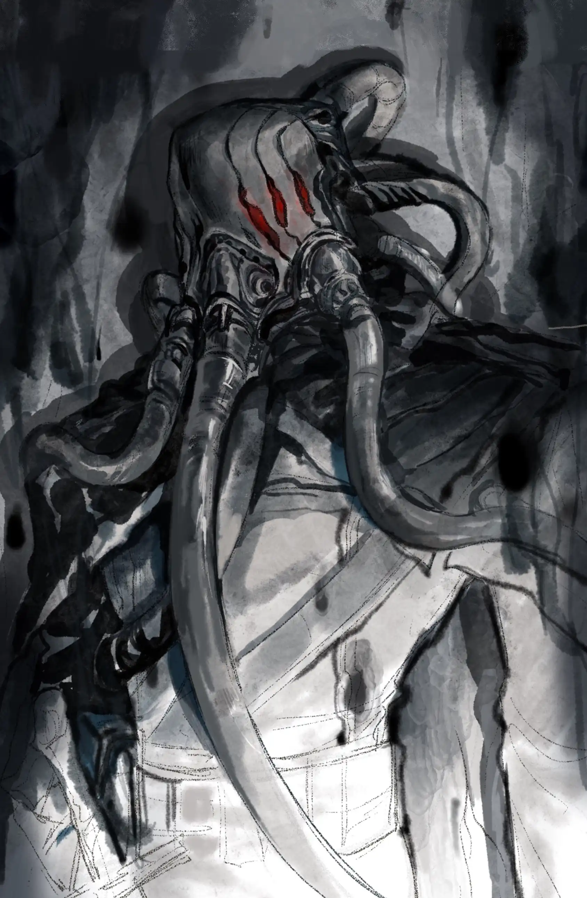

炎国言语，泰拉怪谈{.textkai}

<!-- more -->

何应枢，字仲明，河阳人，是我父亲的至交好友，听力远胜于常人，据说能够在一里外辨认出树叶被风吹动的声音，在承元元年官至礼部侍郎。他年轻时十分大胆，曾经和乡里的游侠一同带着剑，亲手格杀食人的猛虎，因此被县里的长官推举入仕。然而他却终生不愿谈及出使乌萨斯国一事，每次谈及，一定两条大腿瑟瑟发抖，好像承担不了自己的重量，脸色也好像黄土一样。

我恳切地请求他为我讲述，于是他说：“唉！有学问的人不应该谈论精怪的事情，是因为它们幽深晦暗，难以查明的缘故。我曾经想过保守这件事到死，但即使说出来，真正贤明的人也只会把这当作街头巷尾的传言吧！”
承元元年的时候，新皇帝刚刚登基，还没有举行封禅，因此派遣礼部尚书和侍郎携带丝绸，珍珠，瓷器和黄金前往乌萨斯国出使，以此使两国之间的关系稳固。

乌萨斯的皇帝依顽一世用外交的礼节款待了使者，摆设豪华的宴会招待他们，但在宴会上，何公却听到窗外有两人交谈的声音，声音低沉嘶哑，好像人站在大缸里向外面喊话的样子。

何公胆大，从不相信鬼神之说，因此凑过去细听那两人的谈话，但他一走到窗边，那两个声音就立即停止了。何公只能听到模糊的几句话，说的是“午夜辄行，天明辄止”，“但杀尚书，不害他人”，有时还夹杂着像老人哮喘一般的嘶呼声。何公感到十分忧虑，于是当晚找到礼部尚书，具体地陈述自己所听到的事情，请求尚书和自己互换官舍。

礼部尚书听说过何应枢的神耳，对他十分信任，因此把皇帝赐给自己的佩剑送给他，嘱托他保重。当晚，礼部尚书在何公的官舍住宿，而何公则把尚书的官服穿在侍郎的官服外面，佩戴金印，玉带和剑，闭上眼睛假装睡觉。

到了午夜，何公听见外面有人呼喊礼部尚书的名字，声音十分低沉，宛如一个人被盖在大缸里向外面喊话的样子。他起身开门，那个声音就消失了，于是镇定自若，神情没有丝毫改变，又躺到床上睡觉，这时外面的声音又响了起来，这样的事情重复了多次。

最后，何公打开门，向门外大声说：“大丈夫生于天地之间，做事应当光明磊落，如今我穿戴好朝服来迎接你们，已经尽了做客人的礼节，你们却这样蛇行鼠迹，不敢抛头露面，这难道是做主人的礼节吗？”于是声音停息。

{style="float:right;max-width:45%;margin-left:1em"}

过不多久，一个身穿黑色长衣，脸上遮着面罩的人向他施礼，对他说：我们的主人想和您一叙，请求您跟随我们。何公听到从他身上传来千万冤魂哭号的声音，略微有些害怕，但还是跟着他离开了使馆。走到半路，何公发现天上开始落下雪花，感到十分惊奇，因为当时正值六月。冬天的雪不同，它的颜色纯黑，而且不会因为感受到热气而融化。遇到地面就融合，之后地面开始蒸腾黑色的烟雾，像着火一样。

黑色的雪花越来越多，惨烈的哭嚎声越来越大，应枢大腿发抖，但为了不折堕大炎的威严，佯装镇定往前走。两个人拦住他，身穿长衣，佩剑和面罩都和第一个人一样。其中为首的人问道：“您是礼部尚书吗？”

何公鼓起胆气，拔出御赐宝剑，脱下身上礼部尚书的朝服，露出侍郎朝服，大声说：“我乃是大炎礼部侍郎何应枢，你们在这里杀害我，难道不害怕真龙皇帝的怒火降临到你们身上吗？”

听到何公自称侍郎，那三个人全都面面相觑，互相说：“我们被欺骗了！”。这时，他突然暴起，用御赐宝剑砍伤了其中一个穿长衣的人，伤口里流出的不是血，而是黑色的雾气。吸入了一点，何公立刻感到头晕目眩，再次醒来已经在官舍的床上了。

发生了这件事以后，何公和礼部尚书立刻暗中回国，向陛下详细地陈述了自己的见闻。陛下赏赐何公绢一千匹，金五百两，食邑二千户。何公接受了赏赐但拒绝升官，声称自己患病而辞职了，今后没有再做过官，遨游在江湖之间，以诗酒自娱。

异史氏评论说：“乌萨斯国以这样的手段对付使节，可见其心术不正。”虽然这样，何应枢还是能用过人的智慧和勇气保全自己的性命和大炎的国威，可以说是臣子的榜样了。如今贪生怕死的武将，卖国求荣的文官，实在是应该向何公学习啊。<eod />

（本文首发于nga）

<FakeAds />