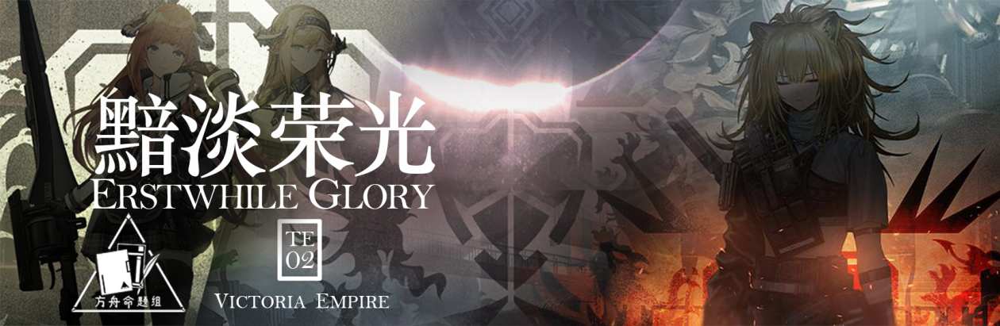 {.centering}

鬼魂从帝国庞大的阴影中爬出

恐惧长久地萦绕于广阔的战场

维多利亚，我的维多利亚

我的荣耀，我的国家

往昔的荣光已然不再

前路茫茫，我们该去往何方

<!-- more -->

【1】请问以下内容节选自哪位维多利亚干员的档案？
她面对着许多困难，而你，也不能阻止她投身险境。这是她的必经之路。但她不会放弃，无论如何都不会。只有这点，我再清楚不过了。             ——干员临光

A. 推进之王

B. 格拉尼

C. 海蒂

D. 风笛

【2】维多利亚的局势发展成如今这样，与卡兹戴尔军事委员会进入伦蒂尼姆脱不了关系。按照泰拉的历法，请问以下哪个事件是在卡兹戴尔军事委员会进入伦蒂尼姆之后才发生的？

A.塔露拉看到了乌萨斯的村民虐杀感染者后触发诅咒，被科西切附身

B.焰尾的家乡被毁，焰尾感染矿石病，卡利斯卡家族抛弃了其领地里的民众

C.碧银将收音机交给“造梦者”组织，“造梦者”承诺二十年后送还

D.凯尔希和莉莉娅在松心山谷刺杀万尼亚大公

【3】在2022年2月15日，我们的“粉毛”澄闪历经了661天的航空之后终于在“阴云火花”故事集里落地了。一下关于这一故事集中涉及的事件，因果关系不正确的是

A	因：夜烟躲避丹顿兄弟的追杀果：绿意火花被烧

B	因：绿意火花被烧  果：苏茜意欲轻生，却救下了夜烟

C	因：格拉尼把丹顿兄弟逼进了安全屋 果：地下结构坍塌，苏茜得以顺利逃脱

D	因：天火救出一众被绑架的感染者 果：格拉尼找到了关于丹顿兄弟的线索

【4】以下关于主线第九、十章中的敌人，说法错误的一项是

| 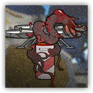 | 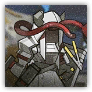 | 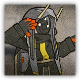 | 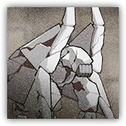 |
| :---: | :---: | :---: | :---: |
| A.此敌人具有隐匿，但是可以被精神摧毁无效化 | B.此敌人可以给伦蒂尼姆城防副炮充能，但被打断时会扣除副炮的技力值 | C.此敌人虽然属于深池部队的编制，但是不具有折射 | D.此敌人会重生，重生后变为空中单位，伤害类型从物理变为法术 |

【5】以下关于维多利亚的事件，按照时间顺序从旧到新，排列正确的一项是

   ①维多利亚革命，阿斯兰王被推上断头台；

   ②维多利亚和乌萨斯开始参与四皇会战；

   ③凯尔希和海蒂在文森特庄园碰面交换情报；

   ④独立战争结束，维多利亚承认哥伦比亚独立；

   ⑤在边境公爵的邀请下，卡兹戴尔军事委员会进入伦蒂尼姆；

A.④②①③⑤ 
B.②①④③⑤
C.④③②①⑤ 
D.④②⑤①③

【6】当最后一位统治维多利亚的阿斯兰被推上断头台时，愤怒的群众一拥而上，踩踏着过去的君权。以下关于“傀影与猩红孤钻”中的藏品“维多利亚王冠”，说法不正确的是

A.这个藏品可以让敌方领袖单位的攻击力、防御力+45%，且生命值+60%

B.它原本是德拉克的王冠，但在阿斯兰成为新的君主之后，王冠的样式并未改变。

C.在最后一任阿斯兰王被砍头时，这顶王冠也受到了一定程度的损伤。

D.弗雷德里克三室被砍头后，这顶王冠被放在了伦蒂尼姆的皇宫深处。

【7】在推进之王的立绘中，出现了形态各异的狮子。请问以下哪一张图片不是在其精英二立绘中截取的？

| 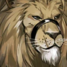 | 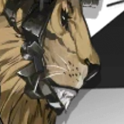 | 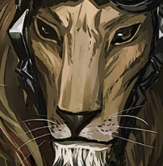 | 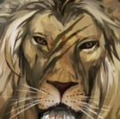 |
| :---: | :---: | :---: | :---: |
| A | B | C | D |

【8】维多利亚境内，有一处地方曾经叫做克莱布拉松，也正是古堡的所在地。以下物品中不能在古堡里找到的是

| 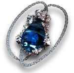 |  |  | 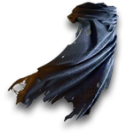 |
| :---: | :---: | :---: | :---: |
| A | B | C | D |

【9】提到了维多利亚的古堡，就不能不提傀影和他的克里斯汀女士。请问以下四张关于克里斯汀女士的图片中，哪一张不是出自傀影的立绘中的？

| 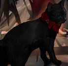 | 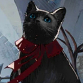 | 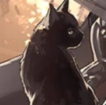 | 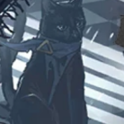 |
| :---: | :---: | :---: | :---: |
| A | B | C | D |

【10】以下哪一个图像不是来自目前已经在罗德岛上录入信息的干员？（截止至2022年12月31日）

| 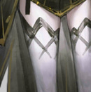 | 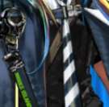 |  | 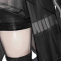 |
| :---: | :---: | :---: | :---: |
| A | B | C | D |

【11】12月中旬开放的“照我以火”活动为我们带来了关于苇草和塔拉地区的更多情报。以下关于苇草的说法中，不正确的一项是

A.苇草的天赋“枯法之血”在危机合约的减少法术抗性词条之后结算

B.苇草的父母在其儿时就已死亡，苇草在那之后紧随姐姐的脚步生存

C.由于儿时的悲惨过去以及在深池里的种种经历，苇草并不擅长小队合作

D.苇草虽然并不喜欢战斗，但如果是为了同伴们的共同愿望而战，她可以忍受

{style="float:left;max-width:20%;margin-right:1em"}

*扫一扫二维码查看本期答案*

[点我也可以哟ヾ(≧▽≦*)o](https://www.wjx.cn/vm/h4kWHd3.aspx)<eod />

<FakeAds />