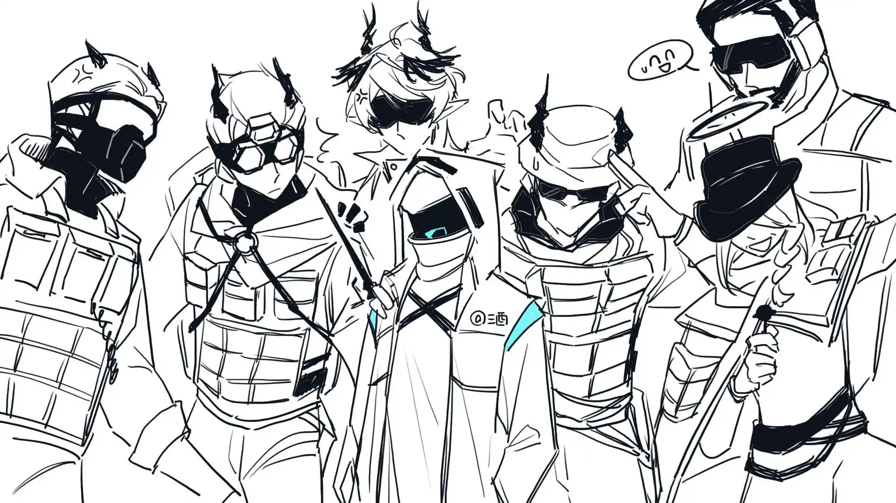

没有人会特意提起这块留言板，但每个人都很默契地使用着它。{.textkai}

<!-- more -->

罗德岛的后勤部门外挂着一块巨大的白板，无论是正儿八经的需求申请还是单纯的琐碎日常都可以在上面留言。这块白板的设立起初是为了即使部门成员不在也不至于让申请人白跑一趟，以及照顾那些没法和人正常言语交流的干员。后来因除正经需求申请外不强制要求留言署名，加上后勤部人流量大的关系，这块白板渐渐变成了罗德岛的公共留言板。上至凯尔希阿米娅和兜帽人，下至刚入职的实习生，都有可能在这块白板上留下自己的笔迹，每年年末甚至还会有精彩留言集锦。

没有人会特意提起这块留言板，但每个人都很默契地使用着它。

---

#### XXXX年X月X日 天气晴转多云 目前位置：莱塔尼亚境内

*（一条笔迹力道很重的留言，写下这条留言的人似乎当时情绪不太稳定）*

--**虽说很理解工程部的日常工作需要大量的演算，设计出的武器也很厉害，但还是希望Mechanist先生能稍微克制一下，这几天用的草稿纸已经快要赶上一个月的量了，管理办公耗材的干员一度怀疑是自己记错了存货，昨天核对到怀疑人生。**

--**希望那位后勤干员现在的精神状态还算不错，我已转告Mechanist，他说自己会尽量控制一些的，不过他工作起来的样子你们也见过，所以最好不要抱有太高的期待。这次来是想预订一瓶生发用洗发水，Mechanist最近掉头发掉得我都有些看不下去，但愿他的新武器研发能够顺利吧。**

——Ace{.aright}

---

#### XXXX年X月XX日 天气小雨转阴 目前位置：叙拉古境内

*（一条字迹板正的留言，文字的每条笔画都非常规矩）*

--那位很热情的高个子菲林小姐是叫煌吧？我应该没有记错她的代号，她上次提着新武器参与了任务。听说任务挺成功的，可喜可贺。我没想到的是，她回舰后，特意给我们几个负责她的武器材料收集的人带了礼物。
虽然说这几种材料收集过程是有些曲折，但这也算我们的分内之事——她这样子我们还挺不好意思的。请问一下有人知道她可能会出现在什么地方吗，我想把礼物还回去。

--不必顾虑，安心地收下吧，她会很高兴的。大猫的新武器所需要的材料里，有几样以罗德岛目前的实力无法自给自足。在外收购和采集应该耗费了你们不少力气吧，你们甚至提供了超出预期的份额，这给武器的研发和调试过程增加了不少容错率，辛苦了。顺便问问，我今天收到了一瓶生发用洗发水，我不记得我有订过这个，你们知道是谁申请的吗？

——Mechanist{.aright}

---

#### XXXX年X月X日 天气晴 目前位置：拉特兰境内

*（一条字迹圆滚滚的留言，字体看上去非常可爱）*

--拉特兰真是甜食爱好者的天堂，萨科塔们也太幸福了吧!!!

（还是同样的圆滚滚笔迹，但每个字都写得歪歪扭扭的，留言的人似乎状况不太理想）

--甜点是好文明，但仙人掌挞不是，请各位干员慎重考虑接受Outcast女士塞给你的仙人掌挞，不夸张地说，有一瞬间我甚至有点想念芙蓉小姐的营养餐。

--甜点虽好，但还是不要一次性摄入过多哦，不是每个种族都像萨科塔那样能吃甜食的。还有，Outcast女士，您上次藏在我们办公室储物柜里的甜品被Touch医生和华法琳医生发现了，如果不出意外的话，今天下午她们应该会让您去一趟医疗部，祝您好运。

——罗德岛后勤部{.aright}

---

#### XXXX年X月X日 天气暴雨 目前位置：雷姆必拓境内

*（一条越写每个字的位置便越向上飘的留言，每个文字的最后一笔都微微翘起）*

--我加入罗德岛也有段时间了，今天终于见到了那位代号叫迷迭香的精英干员。舰上传闻说她有着怪物一般的力量，可她看起来真的好乖，反正我是无法把传闻中暴走时的她跟亲眼见过的她联系起来。而且她允许我摸她的耳朵和尾巴耶！！！菲林的尾巴和耳朵可是宝藏啊！！！临走的时候她还给了我一颗糖，说是其他精英干员告诉她后勤干员的工作同样很重要，遇到了的话记得要表示感谢。啊！！！这么可爱的小菲林就算真的跟传闻中一样也无所谓了。

--本部门从不干涉各位成员的私人社交与喜好，但还请各位注意，现在正值换毛期，希望各位在进办公室前至少先把身上粘的毛清理一下，不要给负责打扫的干员增加额外的工作量，感谢配合。

——罗德岛后勤部{.aright}

---

#### XXXX年XX月XX日 天气小雪 目前位置：哥伦比亚境内

*（一条笔迹略显潦草的留言，书写者似乎只是一时兴起往白板上记录了一下）*

--上次去精英干员的休息室送资料时一开门就看见一副……嗯……怎么说呢，不能说是一片混乱，只能说是群魔乱舞的景象，是如果被舰上的年轻干员看到了可能会当场梦碎的程度。你们说我要是悄悄把他们比赛的样子录下来卖给可露希尔是不是能赚上一笔？

--如果你那么做了，那可能会每说五句话就一定会喷口水到对面脸上，每走十步就要绊一下，一天内三次脚趾磕到桌脚，撕手上倒刺的时候会撕出血，一周内吃的所有东西都是芙蓉特制营养餐的味道，所以劝你不要。

——LeaderOne{.aright}

--好吧……不过每说五句话就一定会喷口水到对面脸上真的不是在惩罚对面的人吗？！

---

#### XXXX年X月X日 天气大风 目前位置：乌萨斯境内

*（书写者的每一个文字最后一笔都微微翘起，但这次的留言每个字都越写越向下掉）*

--今天去工程部送材料时正好碰见Whitesmith小姐在和机械臂共舞，她跳舞真好看啊，我在门外悄悄看了一会，她看到了我，邀请我共舞一曲，如果知道后续发展的话我一定会拒绝的。跳舞好难，感觉四肢不听使唤，几分钟的时间里踩到Whitesmith小姐七八次，曲子结束后我都没敢跟她对视，匆匆道歉后跟逃命一样跑出来。呜……希望Whitesmith小姐没有生气。

--不必紧张，我没有生气。每个人都会有自己不擅长的事情，我也并不是一开始就会跳舞的。正好现在新材料的研发告一段落，如果你想学跳舞的话，这周五晚上可以来我的办公室，你的身形条件很好，跳起来会很好看的。对了，煌和迷迭香也会在，我想她们不会介意你摸一摸她们的耳朵和尾巴。

——Whitesmith{.aright}

---

#### XXXX年X月XX日 天气晴伴微风 目前位置：卡西米尔境内

*（一条笔迹秀气的留言，力道很轻，旁边有留言者无意识停顿留下的黑点，留言时似乎犹豫了很久）*

--Misery先生这次的外勤任务似乎是顺利完成了？他的队员们都平安回来了，需要的样本也采集到了，外勤时间也比预期的要短，但他看上去似乎还是有些苦闷，唔……是后勤部分还有什么可以提升的地方吗，但他好高大，也没见他笑过，我有点不敢问他……

--哈哈，我的朋友，你吓到后勤部新来的小家伙了，既然任务顺利完成又平安回舰了那就多笑笑嘛。还有，写下这条留言的小家伙，不用害怕，有什么事你可以当面跟他交流，他不会生气的，说不定还能见到他笑起来的样子哦。

——（没有署名，只画了一个萨科塔标志性的光环）{.aright}

--后勤部门的工作一向做得很好，这次也一样，辛苦各位了。至于多笑笑……我尽量……

——Misery{.aright}

XXXX年X月X日 天气大雾 目前位置：维多利亚境内

（一条字迹端庄的留言，书写者也许学习过书法）

--全新升级过的毯子已经分发给了所有的外勤干员，第一批反馈已经收到，即使是Stormeye先生和Sharp先生这样野外生存能力惊人的干员也给了新毯子很不错的评价。呼，这段时间的努力没有白费，总算可以好好休息一下了。只是过去这么久了我依然会有些遗憾，不能亲身站在战场上与其他外勤干员一起战斗。

--我和杜宾教官跟医疗部讨论过，你的身体状况实在是不适合出外勤，但即使没有踏上前线你仍然做得很好，不是吗？罗德岛从来都不是只有外勤工作很重要，你们的工作很容易被人忽视，但恰恰是这些工作能让外勤干员放心地展开活动，你们的存在对罗德岛来说同样重要，请对自己更有信心一些。

——Pith

---

#### XXXX年XX月X日 天气雷暴 目前位置：炎国境内

*（一条字体微微倾斜的留言，文字看上去排列得错落有致）*

*--在食堂碰到了Mantra小姐，她一个人坐在角落里吃饭，我也不知道自己怎么想的，居然直接坐到人家对面去了，还跟她聊天。她看上去有些惊讶，但还是不说话，只是以点头或者摇头来表示她在听，嗐，这顿饭真是太尴尬了，我当时到底在想些什么啊……*

*--难怪下午训练的时候队长看上去心情非常好，原来是中午有人跟她聊天。完全不用觉得尴尬啦，队长她情况比较特殊，不是故意不跟你讲话的，还请不要放在心上。平常很少会有人跟她搭话，如果下次再碰到她的话跟她打个招呼吧，点点头或者挥挥手，她会很开心的。*

——百年难得一遇的大帅哥{.aright}

---

#### XXXX年X月XX日 天气阴 目前位置：东国境内

*（看上去有点稚气的字体，留言旁边画了很多小表情）*

--Raidian小姐说话和做事情的风格真的好像我妈妈啊，出来这么久有点想回家了……也不知道今年的梅雨季爸爸妈妈的风湿病有没有发作，唉。

（在上一条留言一个有些担心的表情旁有人画了一个小小的太阳）

--你今年似乎还没有回过家吧？后勤部的工作一直很忙，但良好的休息同样重要。这周末去人事部申请下假期如何？会休息的孩子才是好孩子。记得回家前去一趟医疗部，我给你申请了一点治疗风湿病的药物，希望能让你的父母轻松一些。往返的路上注意安全，行李要整理好，不要忘记东西呀。

--Raidian{.aright}

---

#### XXXX年X月XX日 天气多云 目前位置：萨尔贡境内

 *（笔迹大大咧咧的留言，句子里的文字越写越大）*

--*简短有力的炎国民间泛用感叹词* ，我昨天下班后在甲板上闲逛，完全没注意到旁边有人，Scout先生出声的时候我发誓我不用体测后从没蹦这么高过，很明显，Scout先生也被我这一蹦吓了一跳。这就是精英干员的实力吗？我完全没察觉到甲板上还有其他人，他走路的声音也好轻，不特别注意的话完全听不到，好厉害！为了表示突然出声吓到我的歉意，Scout先生请我喝了一杯，不过我酒量一直不怎么样，一杯下去直接断片了，醒来时人已经在宿舍，应该没有给Scout先生带来什么麻烦吧，大概。

--确实没有给我带来什么麻烦，你醉倒后直接昏睡过去，酒品挺好。不过酒量欠佳的话就别在外面喝酒了，下次再在外面醉倒就不一定能有人把你扛回宿舍了。

——Scout{.aright}

--我说你回休息室的时候怎么身上那么重的酒气，原来是把人送回宿舍了。对了，你离开休息室没多久后Logos就回来了，他一进门就闻到你位置上的酒味，然后就给你的工位施加了一点小小的咒术，气味挺好闻的，就是闻着有点……妖娆，我觉得你不会喜欢那个味道的。

——Ace{.aright}

--！女妖！下午训练室见！

——Scout{.aright}

--乐意奉陪。

——Logos{.aright}

“你好像是今天负责整理训练室的后勤干员吧？看到最新的留言了吗？耶拉冈德在上，祝你好运。”

“……我现在请病假还来得及吗？”<eod />

 {.centering}

（责任编辑：黑子；网页排版：武乙凌薇；绘图：LOFTER@狂暴摸鱼小狗；本文首发于LOFTER）

<Ads />