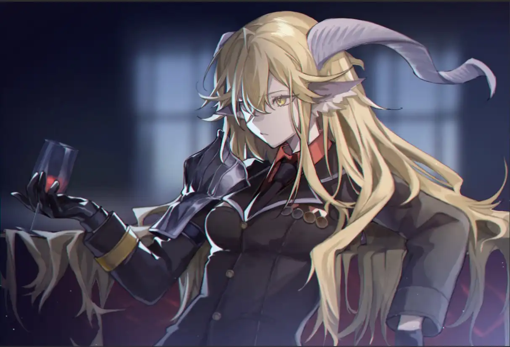

我见他走在所选的路上，有疾风骤雨，有巨兽匍匐，有深渊万丈。{.textkai}

<!-- more -->

“我不要再当你的姐姐了！”

声音来源不远，但大概是因为小孩子声量有限穿不透厚厚的砖墙。这话从街对面的玩具店里传进黑骑士的双耳，像一只蚊子绕着她的角嗡鸣了一圈，痒得她不禁皱眉，抖了一下耳朵。

傍晚的天空已染上黄金般的光彩，新老板还没从身后的运动防护用品店里出来。街边广告电视的荧幕光闪烁晃眼，循环播放着冠军骑士的飒爽英姿与赛后轶闻。卡西米尔骑士竞技余温未散，角落里的闪光灯功不可没。

“没想到还有人在用这种老式照相机。”来自雪山之国的希瓦艾什总裁自店内走出，望向不远处方才闪过光点的巷子口，他面色沉静如常，语气也毫无额外变化。

他对骑士说道：“走吧，回酒店。”

对方正想为新老板拉开车门，先前躲在玩具店内的小孩却忽然闯出门来，旁若无人地越过街道，“你抢得过我就来啊！”其中一个女孩跑在前头，边跑边举着玩具这样说着，趾高气扬，一如那些好放狠话的竞技骑士。另一个小男孩追在她后面，又生气又听话地企图争抢姐姐手里的玩具。

小孩玩乐时最容易不管不顾，迷失处境，尽管此时街面上车流不多，行人也不多。

“锏，”玩具店里迟迟没有大人出来管教这两个乐不思蜀的小家伙，恩希欧迪斯·希瓦艾什总裁向他新签下的保镖发出第一道命令，“送他们回去。”

巷口的闪光灯再次亮起，通过汽车后视镜映照在喀兰贸易总裁的眼眸中。红酒报的老牌记者庆幸自己终于捕捉到了特锦赛冠军骑士驱逐幼童的珍贵画面，那柄大剑虽未出鞘，但高挑的卡普里尼骑士仅凭其掷地有声的脚步便让兴致当头的小朋友瞬间发现自己的处境，在惊讶中回过头后，两个小孩看见了骑士大人立在眼前的巨剑，旋即飞奔回店内。记者只恨自己带的老式照相机没有录像功能，错失了那一句“快跑！”

轿车启动了，绕了个圈，尾气扬进躲在巷口的老记者鼻子里，呛到哮喘发作的他完全没注意到车内人向自己投过来的平静视线。他紧抱着自己的照相机，生怕附近阴影里的哪位同行冒出来抢劫自己的战利品。

“你觉得他们会怎么描述你刚才的行为？”恩希欧迪斯问道。

司机是总裁先生的老熟人魏斯，他扫了一眼车内后视镜上平静的两人，随后收回视线继续驾驶，缄默不语。

霓虹灯的光彩已几乎盖过了落日的灿烂余晖，黑骑士在决赛场上挥舞巨剑的特写投射在深色的车窗玻璃上。锏的回答很简单，“我从不关心别人的工作。”

“你可以当这只是新朋友的一点好奇。”

“我们不是雇主和员工的关系吗？”

“当然不是。”

“哦？”锏偏过头看他，“你知道他们怎么描述你我之间的合同吗？”

年轻的黑骑士坐拥诸多身份标签，其中大都收获于来到卡西米尔之后。在最开始，她只是个莱塔尼亚人，最多是个“很能打的卡普里尼”。

恩希欧迪斯从购物袋里拿出一柄军刀，皮质刀鞘朴实的纹路上刻着雷神工业的标志，在品牌代表质量的世道里，这个标志足以令人对刀鞘内的产品质量深信不疑。

“你不妨做个大胆的假设。”他忽然说道，“也许他们的描述是我提供的呢。”

---

军刀是买给自家妹妹的，回酒店是为了收拾行李准备去下一个郡商谈产业投资。锏有些疑惑，不是因为她自己也住在这家酒店，而是新老板的下一步行程。

“我可不会谈生意。”

“你当然会。”

“可是你会谈生意的话，为什么要和老哥签合同呢？”恩希亚缩在沙发里，撑着下巴问，“卡西米尔那么发达的地方，还能拿赞助金，谢拉格完全比不上吧。”

 {.centering}

希瓦艾什宅邸的大堂与一般贵族的厅堂布置无甚区别，顶多是披了些雪山之国独产的毛毯。午后阳光明媚，厅内无需掌灯烤火，锏坐在其中一件沙发上，目光落在旁边暖炉里熄灭已久的灰烬上。

恩希亚问的是个好问题，她曾以为自己能周旋于商业联合会三大财团之间已是难能可贵，可当她看到初来乍到的恩希欧迪斯抓着刺杀失败的无胄盟杀手与董事长谈判，她又觉得自己见得还是少了。

她想了想，回答道：“因为你哥帮我摆脱了那些聒噪的人。”

如果说，有什么能让如日中天的黑骑士在唯商业价值是瞻的大骑士领袖手离去，那只有可能是身败名裂式的隐退了。但人是要吃饭的，更别说锏一开始参加骑士竞技的最朴素原因就是赚钱。身败名裂的代价太过高昂，也与她本来的目的背道而驰。

喀兰总裁对这个顾虑显然不太理解。为何不让商业联合会名声扫地呢？他这么问道。得到的回答难得带了一丝对年轻老板见识尚浅的怜悯：“因为他们本来就没有名声。”

“那不是更不用担心了。”他笑道。

“所以那些传闻你被商业联合会追杀的，都是……”恩希亚恍然大悟，尾巴在沙发扶手上扫来扫去，扫来扫去，“老哥真够可以啊……”

虽然结果还算满意，但锏认为事件发生的全过程还是有不少瑕疵的，特别是“喀兰贸易总裁买下了黑骑士”这段报道。锏从来不觉得自己与希瓦艾什家主签的是什么卖身契，甲乙双方责任与权利白纸黑字清清楚楚的合同条约，哪里是卖身契这种低级物件能等价比拟的？奈何两军交战，只能当是那些吃瘪的董事会老家伙成心要恶心她的罢。新老板对此间瑜不掩瑕的细节同样深感遗憾，在返回谢拉格的路上，他对锏做出一个承诺。

但黑骑士已经差不多忘记这个承诺是什么了。

锤子与扳手在积雪覆盖的山林里构建出一节一节的轨道，轨道拼接成铁路，如血管般延伸进古老的国度中心，带去蒸汽与机械，还有从未出现在这片土地上的名词与理念。

黑骑士已经彻底扔掉了前赞助商给她运作的称号——人们只知道希瓦艾什家的家主身边有一个新面孔，一个新的名字叫锏的保镖。

“你不需要保镖。”锏这么问过他，“虽然大老板有几个打手不是稀罕事，但现在看来你更需要能建设一个国家的栋梁之才。”

何况你自己也不是泛泛之辈。最后这句话她没说出来。

谢拉格就如它雪山之国的美称，在盛夏也比其他国家清凉得多。耶拉冈德庇佑着这个国家远离天灾和战火，天空比卡西米尔清澈，空气比大骑士领清新。

但眼前蒸汽列车的轰鸣已将喀兰贸易总裁的野心写在所有人的眼前。他要改变这个国家，以一种不免激进的方式。

恩希欧迪斯仔细看完最后一份文件并写上意见与签名后，转身看着卡普里尼骑士，默然长叹。锏第一次见他叹气。尽管他们认识并合作的时间也还不足一年。

“锏，你知道这条铁路现在经过的地方，原先有多少巨石与断木吗？”

这话问得生分了，毕竟其中由她出手化为齑粉的障碍物几乎占了铁路最后一段的全部。但也只是最后一段，“在找你之前，我和诺希斯用了几乎所有库存的爆破物去清理沿途的障碍，才得以开始铁路的建设。”恩希欧迪斯道，“建设需要通行无阻的道路，不幸的是，这也是目前谢拉格最欠缺的。”

列车轰鸣而去，不消多远便被前路葱郁的针叶林掩盖了蒸腾的水汽和汽笛声。

“我想把谢拉格从这片封闭的冰天雪地里拉出来，”越过林木积雪的树梢，他的目光一再前进，直到喀兰圣山的山脊露出平原，直到雪山上终年不化的雪闪烁出艳阳灿金色的光辉，蔓珠院深色的院墙和屋顶吞没黄金的希望，他的神情开始变得凝重，声音也更低沉，仿佛前方正有疾风骤雨，有巨兽匍匐，有深渊万丈。他轻声道，“我们没有太多时间了。”

距离总裁露面卡西米尔已过去两年，距离黑骑士来到谢拉格还不到一年。原先不过抱着看看其他地方能比卡西米尔恶心到哪去的心态来的谢拉格，如今，锏却发现，这个独立却封闭的国家，似乎即将发生比其他地方都更有趣的事情。

而自己，将参与其中。

她久违地感到心情激动，上一次是什么时候？是在沙漠中独行见到绿洲？还是在荒野中漫步见到村落？她记不太清了，只将右手抚上腰间巨剑的剑柄，好像连老伙计也在激动得震颤起来。

恩希欧迪斯·希瓦艾什忽然问道：“你不觉得它太显眼了吗？”

锏：“？”

---

现代社会的企业制度被希瓦艾什家的年轻主人引进谢拉格，并将三大家族之一的希瓦艾什家族改造成如今的喀兰贸易。锏不是没见过现代企业与传统封地贵族，也不是没见过以企业之名行家族之实的“聪明人”。在她第一次与佩尔罗契家族接触时，对方的领地“将军”也差点给她加上同样的称呼后缀，“我不领军职，只是他恩希欧迪斯的保镖。”她道。

佩尔罗契家的古罗将军看起来对保镖这个名词还不太理解，锏本想多说两句解释自己的职务在传统贵族势力下的等阶官职，但望着对方身后一众着装统一的部下，又打消了这个念头。

她想起在卡西米尔翻看无聊的商业时报时偶然瞥见的喀兰贸易总裁专访，在拮据的版面中访谈现场的相片占去了三分之一，余下寥寥的访谈详情中，首段的人物简介里，这位恩希欧迪斯·希瓦艾什先生的履历是“谢拉格军阀”。

现在来看，幸好是军阀。

彼时总裁正与佩尔罗契家主阿克托斯商谈两家领地交界处的铁路建设事宜，从一人一畜争论到一草一木，又从每一寸土地拉锯到每一滴雪水，耶拉冈德治下的生灵成为领主间博弈的筹码，无休止地叠加又削减，削减再叠加，直到耶拉冈德自己都成了其中一块颇能影响天平倾向的砝码。

时间如同一位优雅的古高卢绅士，邀请每个人的影子跳舞——在家主们的棋盘外，随处可见他肆无忌惮的舞步。佩尔罗契家和希瓦艾什家的书记员都未敢懈怠，每一条谈判结果都被忠实记录，即使已过去了亘古漫长的时间，他们也一句都没有落下。古罗将军却显然疏于此道，他的影子在与时间拉扯，他的思绪在和疲劳打架，但他忠心耿耿，憋住了每个哈欠。

唇枪舌剑在某一刻忽然停止了，将军敏锐察觉到了声音的变化，立刻打醒精神。

锏岿然不动，恪尽保镖职守，只在这沉默的须臾间瞥了眼恩希欧迪斯，对方似是有所感应，抑或局面也确实到了多说无益的尴尬境地。他起身，向阿克托斯行了个贵族间告别时的旧礼。

绅士停下舞步，他没有影子舞伴可以邀请了，于是他款身退出逐渐掌灯的厅堂。连绵山脉代替人们早早与太阳挥手告别，最后一缕美丽的晚霞在恩希欧迪斯踏出佩尔罗契家领地时就退出了广袤天幕，恰逢双月在另一侧天边若隐若现，最终在层叠的阴云后匿去踪迹。不久，闷响从山脊上酝酿的云雨团里由远及近滚过头顶。

此番景象不能不令人浮想联翩，特别是在刚刚交涉失败的前提下。倾盆大雨下交易失败的落魄家族领导，雨水冲刷尽商人的自尊自傲，契约烂在泥地里，人被钉在风雨中，极尽狼狈与颓靡，多么美丽经典的画面。
“快下雨了。”锏平静道，“回去也要半小时车程，你要回去，还是回头？”

这不是一个保镖该操心的事，也不是她一个外来者应该趟的浑水。但锏莫名在前方菲林的背影中看见了许多年前伤痕累累的卡普里尼小女孩，她每一步都踩着自己的血，所以她发问，问那位曾经的“不会法术的莱塔尼亚残次品”。

魏斯先停下了脚步，不可思议地回头看她。

但当他回头想看看自家老爷的反应时，他发现银灰老爷根本没有停下，“锏小姐，老爷他……”

老爷是什么想法？这一次的波折是否会影响到他接下来的规划？锏小姐为什么要在此时开口？她会期望老爷做何选择？魏斯全都不知道。奇怪的是，他也害怕知道。

“跟上吧。”锏轻轻挑眉，“这雨还下不了。”

就算下了，也只是雨而已。

洗刷掉这浑身血污的，一场普通的雨而已。不过实际上，这雨最终没有落地。一行人返回领地宅院后，才发现恩希亚已在门口久候。

“哥！还有魏斯哥，锏姐。”少女喜形于色，双手背在身后，晚风拂动她柔顺的短发，“我和角峰叔一起做了晚饭，就等你们啦！”

“辛苦了，恩希亚。”恩希欧迪斯温柔微笑道，“进去吧。”

“嗯！大家都进来呀！”

“魏斯，你也先进去吧。”

“是，老爷。”

锏双手环胸，“你很幸运。”

“何以见得？”

“家庭和睦，兄友妹恭，部下忠诚，怎能不算幸运？”

恩希欧迪斯转身与她相对，手杖静立身前，“你忠诚吗？”

锏微笑，“我按合同工作。”

恩希欧迪斯又问，“你希望我回头吗？”

“你既已践行选择，我又何必再思考这个问题？”

“原本也不需要，但你提出来了。我想你的意见依旧有参考的价值。”对方有理有据，并且记得合同内容，“况且你签订的工作合同中也包含协助我的工作。回答我的疑问，这便是协助。”

锏盯着恩希欧迪斯的眼睛，又将他细细打量，视线逡巡来往，最后落在对方毛绒绒却一动不动的菲林尾巴上。

“我希望你坚定自己所选的路，不被任何人影响。”<eod />

（责任编辑：黑子；网页排版：武乙凌薇；绘图：LOFTER@铃；本文首发于泰拉通讯枢纽）

<Ads />