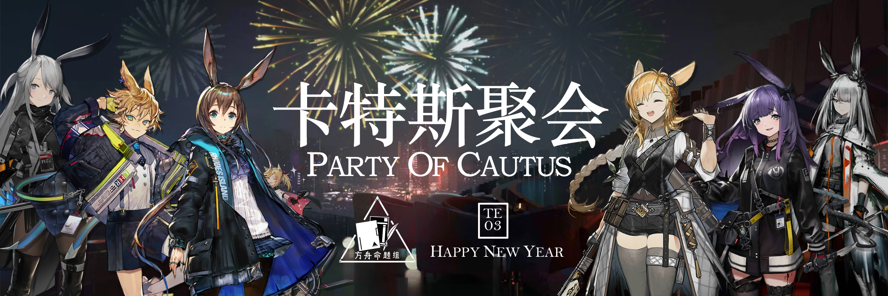
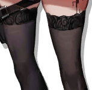
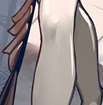
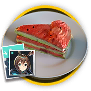

 {.centering}

罗德岛全体卡特斯干员{.textkai .centering}

以及其他全体干员{.textkai .centering}

衷心祝福各位博士春节快乐！{.textkai .centering}

<!-- more -->

【1】目前罗德岛上的卡特斯干员并不算多。请问以下图片中，不属于女性干员的一项是

|  |  |  |  |
| :---: | :---: | :---: | :---: |
| A. | B. | C. | D. |

【2】在所有卡特斯干员中，泡普卡是年龄最小的一个。请问以下四名干员中年龄和泡普卡最接近的最可能是

|  |  |  |  |
| :---: | :---: | :---: | :---: |
| A.慕斯 | B.铃兰 | C.巫恋 | D.泡泡 |

【3】在干员四月的故事集中，四月向安赛尔讲述了她代号的来历。她给自己起这个代号是因为

A. 她很喜欢四月时春意盎然的景象

B. 这是一首她喜欢的关于春天的歌的名字

C. 她注册为罗德岛干员的日期在四月

D. 有一件对她很重要的事发生在四月

【4】目前阿米娅是唯一一个具有升变系统的干员。以下关于阿米娅的升变机制描述不正确的一项是

A. 阿米娅在使用技能“影霄·绝影”发动法术斩击期间为无敌状态

B. 由于升变需要达到精英化二阶段，因此战场上不可能出现精英一阶段的近卫形态阿米娅

C. 在集成战略模式中招募阿米娅后，离开集成战略进行升变，集成战略内的阿米娅职业也会随之改变

D. 在集成战略模式中招募阿米娅时，无论阿米娅时哪种职业，都可以使用近卫或者术师招募券进行招募

【5】许多卡特斯族的人都出身于雷姆必拓，雷姆必拓也是一个因为矿业而著名的国家。其中矿石产量名列前茅的城市叫做

A. 钢铁白菜城

B. 黑铁萝卜城

C. 钢铁萝卜城

D. 黑铁白菜城

【6】每年春节干员们都会给博士寄来家乡的特产表示祝福。关于以下图片中所示特产，描述不正确的一项是

|  |  |
| :---: | :---: |
| | |

A. 左侧的是青菜萝卜罐头，克洛丝在出勤时常吃

B. 由于担心博士的口味不适应，克洛丝特意挑选了少盐版的罐头

C. 右侧的是雷姆必拓西瓜蛋糕，是阿米娅家乡的菜肴

D. 虽然西瓜蛋糕看上去很奇怪，不过口味还是甜的

【7】断崖和莱恩哈特从小就是好朋友，莱恩哈特是天灾信使，断崖担任他的护卫。以下关于二者的描述，错误的一项是

A. 莱恩哈特以前在尤立卡自治州为数支矿队作为顾问天灾信使随行

B. 莱恩哈特的第二技能是瞬发技能，可以削减攻击范围内所有敌人的法术抗性

C. 断崖特别喜欢触电的感觉，为此他还找过格雷伊、惊蛰和澄闪

D. 断崖的第一天赋“索敌援助”可以使自身和周围8格友方干员攻速增加，但这一效果对召唤物不生效

【8】阅读干员暴行的档案，回答问题

*据部分干员描述，暴行所烹饪的菜肴使他们感受到一种如同家庭般的温暖。*

*同时，干员暴行也常常帮助其他干员，这使得她在干员中的评价不断提升。*

*请不要把■■■■记录在各休息室公告栏上，谢谢合作。*

档案中用黑色方块处应当填入的内容是

A. 被她拒绝的约会请求

B. 查看她的个人信息请求

C. 她在橄榄球场上的暴力行为

D. 她对芙蓉营养餐的评价

【9】暗索虽然出身于雷姆必拓，但后来去了龙门并成为惯偷。以下对于暗索的背景描述，错误的一项是

A. 由于家庭贫穷，暗索儿时就被父母赶出家门，在贫民窟里独自闯荡

B. 暗索在一次行窃时失手被抓，后来通过星熊的推荐，加入了罗德岛

C. 暗索其实相当喜欢监狱，但这也是出于生活环境得不到保障的无奈妥协

D. 暗索仍然改不掉自己小偷小摸的习惯，在来报道的时候还顺走了博士的饭卡

【10】从最初的预备组A1成员到如今能够独当一面，我们见证了干员克洛丝的成长过程。在成为正式干员后，克洛丝也习得了一些新的战斗技能。以下四个图标中，哪一项不是克洛丝或寒芒克洛丝的技能？

|  |  |  |  |
| :---: | :---: | :---: | :---: |
| A. | B. | C. | D. |

【11】除了以上题目中涉及的共计9名卡特斯干员外（阿米娅、克洛丝未重复计算），还有一名愿意加入罗德岛的卡特斯。以下关于她的描述，不正确的是

A. 霜星的技能“冻结”会在可部署位上部署“封印的地面”，这是一种特殊装置

B. 除了主线关卡、联锁竞赛和引航者试炼，霜星还在故事集“如我所见”中与其养父爱国者在同一关登场作战

C. 霜星本名叶莲娜，其衣服由养父爱国者的旧斗篷改造而成，能够使用操纵冰的源石技艺

D. 在战斗结算时，罗德岛将霜星归入了阿米娅小队的荣誉队员，之后还用她的名字命名了一款防冻药物

{style="float:left;max-width:20%;margin-right:1em"}

*扫一扫二维码查看本期答案*

[点我也可以哟ヾ(≧▽≦*)o](https://www.wjx.cn/vm/OhX0W4x.aspx)<eod />

<FakeAds />