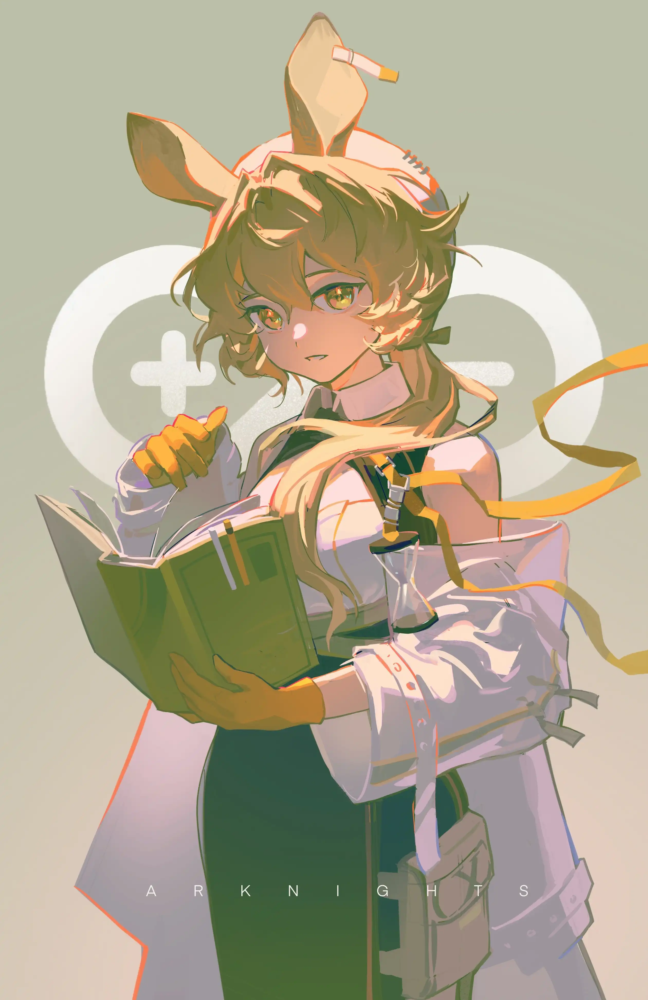

往昔构筑回忆的绿野，追忆坠入美好的幻梦{.textkai}

<!-- more -->

*Take a picture and dont forget her* {style="text-align: center"}

多萝西感觉到了温暖。那是一种浸泡在液体中的感觉，身体随着水流缓慢浮动，丝丝缕缕的暖意贴着皮肤游走。

恍然间，多萝西意识到，那是阳光。

朦胧光芒透过眼皮，将黑色的幻象勾画出形状，让其从虚幻逐渐转为实物。

多萝西几乎就要伸手去触碰。

---

身下传来的柔软与脖子关节的疼痛一齐叫醒了多萝西，她用力挣扎浮出梦中，发觉自己正歪着头睡在沙发里，身上盖着一件西服外套。隐约的话语声从楼上传来。多萝西听出那是塞雷娅的声音——

“我不喜欢打赌。”

另一人说：“据我所知，很多人都会热衷于对未知结局的期待，享受谜底揭晓时的刺激感，并且会用一些赌注来增强这种感觉。为什么不愿意和我赌呢？”

塞雷娅平静地：“因为你还没有给我发工资，总辖女士。”

总辖大笑起来，多萝西一旁的人也起哄道：“我的工资也没发呢！”

一位男士尴尬地陪笑着，突然注意到沙发上的多萝西已经睁开眼睛，连忙靠过来说：“您醒了，多萝西女士。”

那个刚才起哄的女孩拍了拍男士的肩膀，把他惊得一抖：“别那么拘谨裴尔迪南，我们在开派对，不是学术研究大会。毕竟如果真的是后者，多萝西小姐是不会睡着的。”

一位年长的卡普里尼抱着茶杯补充道：“那睡着的肯定是你，缪尔赛思。”

“啊呀，我怎么会在这里睡着，真不好意思……谁的外套？”多萝西摸着脑袋从沙发里起身，将身上的衣服递给裴尔迪南，并温和地向绅士道谢，后者有些局促地挠了挠头。

“外面太冷了，屋里暖和，我们这几个人嘛……只要缪尔赛思不说话，也还算是安静，你会犯困也正常。”帕尔维斯指了指桌上的茶壶，“要不要喝一杯？会精神一点。”

多萝西接过缪尔赛思倒的茶，端在唇边闻了一下，有些惊讶地说：“好香，和多索雷斯的茶相比也毫不逊色了，是什么茶叶呢？”

缪尔赛思得意地用手指敲了敲桌面：“是我自己弄的黑豆茶！制造过程里用了一些源石技艺，所以尝起来会很不一样。”

“那我恐怕真的要和你打个赌了，缪尔赛思。”帕尔维斯微微笑起来，眼神瞟向二楼栏杆边一站一靠的两位女士，“想不想参与一下？如果我赢了的话，我希望能多尝到一些你的黑豆茶。”

“如果我赢了呢？”缪尔赛思也看向克里斯滕那边，优雅的女士托着红酒杯倚靠在围栏上，面色沉静的赛雷娅站在一旁。

帕尔维斯思考了一下：“如果你赢了，我就连续一个星期早起，去给你买街角那家店的限量岩烧芝士蛋糕。”

---

克里斯滕转头看向赛雷娅：“其实你也不用非要赌钱，就像下面那两位，交换一些生活的趣味也无妨，没发工资也没关系嘛。”

“你理解错了。”赛雷娅垂下目光，“我的意思是，如果我与你赌，最后你会没钱给我发工资。”

---

多萝西看到总辖喝完了杯子里最后一口红酒，拿着高脚杯伸出栏杆外，正悬在一楼地毯的上方。克里斯滕洒脱地笑了起来，她说：“我认为这地毯足以保护杯子，让它得以保全自身，不至于在飞行后粉身碎骨。”

“我早就说过，以我对玻璃的了解，你高看了这个酒杯，也低估了这里的高度。”赛雷娅伸出手，与克里斯滕手指交叉相扣，“一起松手？”

---

裴尔迪南大概是担心杯子的碎片飞溅，默默站在了两位女士前面，缪尔赛思越过他高大的肩膀兴奋地盯着二楼的总辖，帕尔维斯又慢吞吞地喝了一口茶，露出享受的表情。多萝西听见了总辖自信的声音：“一起松手。”

派对散场的时候，大家都心照不宣地没有去碰地上的酒杯，而是让它躺在地毯上过夜。

赛雷娅与总辖先走了，裴尔迪南小声说：“赛雷娅居然赌输了，她会不会不高兴啊……”

缪尔赛思咦了一声：“你还在惦记这事儿？我记得她拒绝跟你跳舞的时候表情可硬了，我以为你会更在意这个。而且那可是赛雷娅诶，感觉就算是她自己掉下来也不会有什么事，说不定还会把地板砸个坑。”

“那可是塞雷娅哦，说不定能听到你俩在说什么，回去了要收拾你俩。”帕尔维斯作恐吓状，裴尔迪南脸上白了一下，有些不好意思地傻笑。缪尔赛思则不服气地翻了个白眼，绕到裴尔迪南身后一声不吭。

多萝西没有插话，微笑着看这几个家伙闹腾。很快那三个人也各自穿上外套准备离开，裴尔迪南第一个出门，在外面用手拉住门等几个人通过。缪尔赛思大大咧咧地说了声谢啦，回头看到仍在屋里的多萝西，冲她招着手：“你住得很近，我们就先走了哦！”随后三人便都朝多萝西道别，结伴消失在门缝间。

---

寒风与黑夜被关在门外。多萝西伸了个懒腰，围上围巾也准备回家睡觉。

她突然想起来了之前那个阳光下温热的梦，以及想要伸手去触碰的感觉。鬼使神差地，她弯腰捡起了地上那个完好无损的玻璃杯，异样的触感从手心传来——

白色的固体薄薄地覆盖在整个杯子的表面，肉眼完全无法辨认，随着赛雷娅的走远和多萝西的触碰，那层洁白的钙质外壳悄然退去。

一声脆响，裂纹爬上精致的杯身，酒杯在多萝西手中化为碎片。<eod />

 {.centering}

（责任编辑：黒子；网页排版：武乙凌薇；绘图：LOFTER@草履虫炖蘑菇）

<Ads />