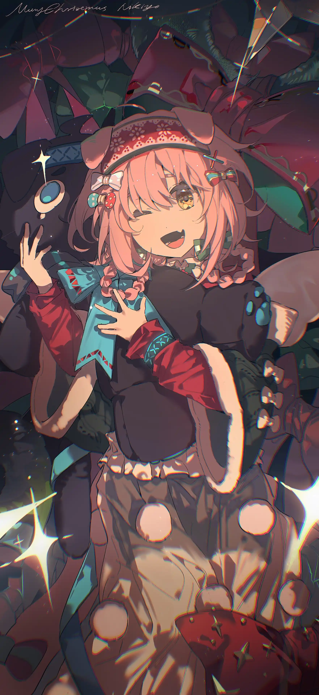

而她，苏茜，罗德岛的澄闪干员，也会带着这份爱意昂起头来，目光明亮地露出微笑，迎接明日的阳光。{.textkai}

<!-- more -->

“对了， 澄闪小姐，快过生日了吗？祝你生日快乐。”

海帕提娅老师今天看起来心情很好，此刻正对着她微笑着，衬得罗德岛本舰外的蓝天格外晴朗。

“谢谢您！”她轻轻道谢。

“是在这边的第一次生日吗？后勤部门肯定要好好准备。想办个宴会吗？”一向看起来相当严肃的老师竟然在跟自己讨论这个话题，澄闪有些受宠若惊，同时又有些不知所措：“宴会吗……不知道诶。我……”

“没想过吗？嗯……也可以理解，回去慢慢想。”

“好，好的！”她抱紧怀里的课本，猛点头，成功让海帕提娅老师又笑了起来。

“好了，假期愉快。”

她随着老师的脚步一起走出教室，罗德岛的走廊干净明亮。其他同学都已经走了，老师也向她挥手道别。

学生们的假期开始了，澄闪迈步回到自己的小理发店，把书包里的书放下，看到一个机器人小车已经把她预定的午饭送来了。可露希尔小姐的发明真的很实用，她小心翼翼地拿起饭盒，对小机器人道了声谢。机械的童音回复她“希望您用餐愉快”，随后咕噜咕噜地开远了。

她望着那个背影傻笑了一下，然后迈着轻快的步伐回到店里，尾巴还在无意识地摆动，昭示着主人今天的好心情。

---

## 2{.centering}

十三岁那年的夏天，苏茜生了一场病。说是她自己生病好像也不对，因为异状是从家里各种乱七八糟的铁器开始的。幼小的菲林少女一如既往地走进厨房想要帮忙做饭，姐姐耳朵上的耳环、妈妈抓着的铁锅、弟弟手里的叉子都颤动起来，一只勺子从盒子里飞起来，吸在了她的身上。几个孩子尖叫起来。苏茜虽不明白发生了什么，还是在母亲的呼叫下第一时间向后退。

她听见母亲喊她的哥哥，叫他快去店里把父亲喊回家。她躲在房间里，只觉得头脑发热，无法思考，不知道自己怎么变成了这样，直到父亲走进门来，坐在她的床边对她说，苏茜，别怕，我们谈谈。

“吃午饭了吗”他问。“没有。”她摇头。“我不敢去厨房。”

“你妈妈说刚才想给你送饭，你也不吃。”

“爸爸，我是不是……生病了？刚才发生了什么？”

“有可能是源石技艺的问题，我的顾客之前跟我聊过类似的情况。你别怕，我明天会去问一问。如果你生病了，咱们就去治病，如果是源石技艺，就送你去上学。”“爸爸……我……”

她嗫嚅着，知道自己的家庭可能支撑不起这两个选项的任何一个，于是满脸愧疚。家里还有那么多兄弟姐妹，她不能让父母如此难做。

“你别担心，我和你妈妈绝不会让你受委屈的。放心。总有办法的。”

父亲的声音很坚定，她也从这个声音里汲取到了一丝力量，吸了吸鼻子，从床上坐起身。床很宽，她平时都和两个姐姐一起住在这里。

……真的吗？她垂着眉眼问。

“嗯。”

“你妈妈做了苹果派，别放凉了，她看到你没有吃会伤心的。快起来吧。”

父亲拍了拍她以示鼓励，小苏茜想到苹果派会凉，连忙下床，学习桌上爸爸送姐姐的钢笔却向她飞了过来，被父亲眼疾手快地凌空抓住。

“……唉，我去给你端过来就是了。没事，都会解决的。”

这一场病最后的结果是——请来的老师一见到她，就称赞她身上的源石技艺天赋。根据老师的说法，无论她是否愿意，这一生都一定会和源石技艺脱不开关系，如果善加利用，一定能成为一名很强的术师。

听了这话，父亲四处借钱，筹了一笔款送她到维多利亚中部的一所学府去进修，又嘱咐她去学习之余别忘了再学一门手艺，万一生活费不够，也不至于陷入窘境。母亲虽然舍不得她可爱的女儿，但也坚持要她去学习控制自己的能力。

“苏茜，好好生活，好好吃饭，学习也得努力，至少别让源石技艺伤到自己啊。”

而她呢？她一面沉浸在可以去上学的喜悦里，一面为独自离家感到不安，一面却又十分愧疚——自己又给家人增添了这么多负担。

于是她大声回答：我会努力的！等我上完学，一定努力赚钱……

说着说着就忍不住哭起来。母亲的眼圈也红了，不顾静电的电击把尚且年幼的女儿搂在怀里，舍不得她离开。

---

## 3{.centering}

十四岁的时候，她在博森德尔过了一次难忘的生日。

从学校回来，站在家门口，她有些感慨。博森德尔不算一座大城市，只有几座小工厂，但居民区还算得上体面。她们一家十口人挤在一间屋子里，哪怕没有暖炉也不觉得寒冷。不过这样的房子比起学校来就差了不少，她第一次意识到自己的家居然这么狭窄。

狭窄，但是很温暖。

兄弟姐妹和妈妈一起出来接她，弟弟隔了老远就过来帮她拎着行李，书包也被大家七手八脚地摘掉拿走。父亲生了病没到门口接她，于是被热热闹闹地迎进家门之后，她到房间去跟父亲打了声招呼。

父亲看起来瘦了些，脸上的棱角更加分明了，粗粗的眉毛还和以前没什么两样。看见女儿，父亲也露出点笑容，说欢迎回来。

“啊！我给大家带了礼物！她看到父亲，转回头去找自己的书包和行李。里面呼啦呼啦地传来包装纸的脆响，她一边掏出礼物一边递给自己的家人——这个是给弟弟买的巧克力糖，那个是给姐姐带的冰箱贴，给母亲的圣诞一品红，给父亲的一小瓶酒。”

“看到父亲复杂的目光，她连忙解释：我没有乱花钱，这些都是用生活费买的！你们给我的生活费太多了，我花不完，还带了一些回来。”

“傻孩子。”

身边的孩子们都喜气洋洋，母亲也没有板起脸，只是笑着叹了口气。

“小苏茜真是好孩子，在学校辛苦了，好不容易回家一趟，要好好休息。生日也快到了，让你妈妈多给你做点好吃的。”她听到父亲这么说。

生日的那一天下了雪。她趴在窗边，望着小城的雪花飘落下来，覆盖了绿草、房屋和道路，眼中跳跃着玻璃映射出的炉火。家里的日子还是很紧张，但谁都没有在她面前多提一句。

生日快乐，小苏茜。

刚一起床，她就听到姐姐们的祝福。两个姐姐一个送了她一个缝制的荷包，一个为她特意烤了小点心。她还在满怀感激地道谢，就看到最小的弟弟冒冒失失地跑了过来，送了她自己最喜欢的玩具。

“这是我最喜欢的，你可不准弄坏！”

她笑着接过来，蹲下身，认认真真地对弟弟道谢。

白灰色的墙被炉火和灶火映成温暖的橙色，家里的任何一个岗位都不允许她插手，全家人都决定在生日这天让她好好休息。她趴在窗边观察了一下外面的雪地，又觉得自己真的闲不下来，只是坐在这里会感到愧疚。

“你负责吃。”

哥哥们对她这样说，然后把一盘水果放到她面前。弟弟见状也把她送的巧克力糖拿了出来，打开铁盒让她随便吃。苏茜有些哭笑不得，只说自己吃不下这么多东西。母亲为她做了一个小蛋糕，上面放了奶油和水果，还说明只许她一个人吃，不许弟弟妹妹和她抢。看着桌子上摆满的花花绿绿的吃食，任谁都想不到这个家庭居然还在贫困线上挣扎求生。

明明父亲生病之后，家里已经很困难了。

也许正是因为离家太久，她更感激此刻家人的陪伴。

她有些哽咽，母亲已经为她在蛋糕上点起了蜡烛。父亲也从床上下来，微笑地看着女儿的脸。

“我们给苏茜唱首生日歌吧，苏茜我们唱歌你要许愿，许愿完记得吹蜡烛！哎呀，你说那么多，说得好像苏茜去年不是在家和我们一起过生日的一样！”

大家七嘴八舌地说着，苏茜已经双手合十闭上了眼睛，充满感激地许下一个愿望。

“希望家人都能平平安安，幸福健康。希望父亲的病能早点好起来。希望弟弟妹妹都能健康长大。希望我也能快快长大，早点帮爸爸妈妈分担。”

年幼的女孩虔诚地祈祷着，希望命运能听到她的心愿。

---

## 4{.centering}

十七岁那年的生日，她身边第一次没有任何家人陪伴。命运终究是没有实现她的愿望，十五岁时，父亲病重，离开了人世。她知母亲一个人根本不可能负担得起家用，说什么也不肯再去上学，自己一个人在学校附近找到了一份信使的工作，咬紧牙关赚一些小钱，只要自己够吃就尽量把剩下来的寄回家里——尽管那也只是几个硬币、几张小额纸币而已。她的几个哥哥姐姐也都纷纷离家去工作，希望能帮母亲分担一些压力。

十六岁那一年，她回家的次数屈指可数，每一次都笑着对家人说，自己过得很好，让他们不要担心。母亲望着纤瘦的女儿满眼心疼，家里的几个孩子还处于嗷嗷待哺的阶段，可苏茜也只是个没成年的孩子而已。自己的这个女儿太懂事，总觉得家里送她上学已经为她付出了很多，一门心思地想要偿还这份亏欠。

最后一次回家是在秋天。她很庆幸自己那时回去见了母亲，因为那场害她感染的意外就发生在那年冬天。

她不想再回忆那次事故，因为矿场的工人们也绝非故意。她无意去责怪那天一意孤行要将信件快点送到本人手中的自己，因为她那时只想着快点送完这次的信件，再多赚一点钱，可以寄给家里，让家里的亲人们能够过一个温暖的冬天。

似乎谁都没有错，只是……

她被源石划伤了手。那只是一道浅浅的口子，她兀自祈祷了无数遍，希望自己能逃过一劫，然而身体里的异变和手上难以无视的灼热和瘙痒都让她很难欺骗自己。

可是不工作就没有饭吃，没有地方住。

不能让妈妈和兄弟姐妹们担心。

这个年仅十六岁的菲林女孩把自己从床上拖下来，穿着略显单薄的外套，坚强地又接下信件，奔波于维多利亚的各个郡间。

妈妈，今年冬天我可能不回家了。我会照顾好自己的，您不用担心我。

她一字一句地写下对家人的祝福，然后对着纸张，放进信封里，把它贴上邮票，交给自己的同事。

“不自己回去看看吗？”

她用力地摇摇头。毕竟她隐瞒了病情，有口难言，只说自己想要趁新年之际多工作几天。同为菲林的同事叹口气，虽然同情这个姑娘，自己却也拿不出什么东西帮她，于是一口答应帮她送信。

那年的生日，她生病了。城市中又一次下了雪，她裹着被子努力保持暖意，窗玻璃被报纸糊了几层，终于不会漏进风来，她也再没有心思出外观赏雪景。炉火、蛋糕和家人听起来那么遥远，她迷迷糊糊地，只是悲观地想着自己可能再没有机会能像十四岁时那样过一次幸福的生日。日子好苦，苦得她看不到头。她已经感染了矿石病，还能活几年？还能再见到妈妈吗？

家里不可能负担得起治疗矿石病的费用，这样的绝症只会把一家人都压垮。她早就打定主意绝不将这件事说出去，自己已经太受家人照顾，不该给任何人添麻烦了。

还能活多久呢？

未来看起来飘飘忽忽的，像天上的云彩，眨眼间就飘走了，看不清形状。她想不清楚，只觉得现在这样还能撑下去，就再这样过一阵吧。如果将来能找一份比信使赚得更多的工作就好了。

小姑娘买不起蛋糕，更没有条件自己做蛋糕吃，只是买了几块饼干来纪念自己的生日。端起床头的盘子，几块饼干在寒冬中显得有些冷硬，她努力地咬了几口，尝到了久违的甜味。

于是她把盘子放下，虔诚地双手合十，再许下一个心愿。

希望家人都能平平安安，幸福健康。希望弟弟妹妹都能健康长大。希望妈妈能过得开心一些。

她不再想起自己。

---

## 5{.centering}

十八岁那年，她终于过了一个看得过去的生日。

十七岁的夏天，她大病了一场。矿石病并非什么能够搪塞过去的小病，也不会因为她努力想要忘记就消失不见。前来探病的朋友和同事中，终于有了解矿石病的人认出了她的情况，于是尽管他们之中有人好心想要帮她隐瞒情况，她还是失去了这份信使的工作。

这座城市不欢迎感染者。希望的小火苗摇曳着，被寒风摧残着。她该走了。

毕竟纸里包不住火，她回到家，向母亲一五一十地交代了病情。

妈妈，我生病了。但是不用担心我，我的朋友告诉我，有的城市会有感染者专门居住的地方，我还可以去那里生活，那里的人也会对感染者很友好的。我会照顾好自己的。

母亲坚持要她在家里休息，可她拒绝了，留在家里只会给大家添麻烦。她知道南边卡拉顿城的感染者政策比较宽松，有专门的社区，甚至会把酬劳的一部分以药品的形式发下来。也许在那里，她能真正养活自己，不再麻烦任何人。

送别自己的女儿时，母亲眼里的愧疚清晰可见，她对苏茜道了许多次歉，自责自己为什么如此残忍，只能将这么小的女儿送到离家那么远的地方，让她孤身一人。

我会照顾好自己的，别担心我，妈妈......

她坐上火车，又一次离开了熟悉的城市，去往完全陌生的地方。这一次，她不再感到喜悦，不安搅得她难以呼吸，前路从未如此黑暗。

在那之后的五年，她再没有回过家。

成为感染者之后唯一的好消息，是她使用源石技艺的能力提升了一些，即使不依靠法杖也能够施术。可是她的朋友也嘱咐她，不要随便使用源石技艺。她只是最普通的感染者，只想过几天平安的日子，不想得罪任何人。

她努力控制着自己不去施术，她不想再像小时候那样“生病”，只想做一个普通人。

第一天，她在街上不安地游荡，用仅有的一点钱到旅店住了一晚，晚餐吃了自己带的干粮。担忧着坐吃山空，她向旅店的老板询问情况，很快被告知这里很多小店都缺人，她可以去试试运气。

第二天，一个小餐馆收下了她，给了她第一顿热饭。餐馆的老板娘看着她的样子，说小姑娘留下吧，先吃口饭，明天再干活。那张笑眯眯地看着她的脸上带着皱纹，声音却像妈妈一样温暖。独自漂泊在外的小姑娘鼻子一酸，差点哭出来。

第三天，她有了工作，在餐馆有了一张自己的小床。

虽然是初到人生地不熟的城市，但她到底是成长了，再不是当年那个离开家就不知所措的小孩，只要多听多问，总能很快融入环境之中。有时候治安队来了，会折腾一番，但大家都见怪不怪，她也慢慢接受了。

工作了两三周之后，餐馆老板得到消息，说有一个好说话的酒吧店主正在招服务生。当晚，夫妻两人就找苏茜谈了一番。

其实小餐馆并不怎么缺服务生，毕竟是夫妻小店，他们也并不富裕，只是看这个年纪很小的姑娘一个人过得不容易，就帮她一把。

苏茜理解他们的意思，郑重地感谢了老板和老板娘的恩情，第一次前往了夏栎小姐的小店，开始了自己新的生活。

这位身材高大的菲林待人亲切友善，简单测试了一下她的厨艺水平之后，就答应让她留下来经营这家本是花艺店的小酒馆。出乎她意料的是，这位店长在确认她有能力维持酒吧的运营之后，就放心地把整个店交给了她，自己外出旅行。

卡拉顿城的感染者社区依旧对她很友善，没有人不喜欢这个长相可爱、手脚麻利、吃苦耐劳的菲林女孩。周围工厂和感染者工人很多，许多人会在下了班之后来酒吧喝一杯，生意还算不错。

经营一家酒吧比她想象得要困难，却给她带来了更多希望——她第一次有了一笔可观的收入，在不压榨自己的情况下，也能攒下一笔小钱了。

不止如此，夏栎店长偶尔回来，还会给她额外带来一些矿石病抑制剂，嘱咐小姑娘照顾好自己。

“矿石病是很难治，但是不要悲观嘛，小苏茜。你还有很多日子，在这里，在其他地方……未来还很广阔呢。”

金色卷发的菲林店长坐在吧台边，托着腮微笑着看她，声音十分温暖。那时她还看不懂这位店长眼里的坚定和温柔都源自何方，只觉得一股暖流划过心头。

“嗯，我明白的，店长。”

那年生日前，她在店里向几位感染者客人问起哪里有卖可以做蛋糕的道具，被几位热情的客人追问了几句，她颇不好意思地抖抖耳朵，说自己马上要过十八岁生日了。

座位上罗德岛办事处的苦根先生笑道，那可要好好庆祝一下呀。

她把头摇得像拨浪鼓：不要。我只是……只是好久没吃蛋糕了，想自己做一个试试。

那天早晨，小店还没有开门，她正在和干酪和面粉斗智斗勇时，看到一个意料之外的人。夏栎小姐居然风尘仆仆地回来了，看到她忙碌的样子，笑眯眯地喊她。

“小苏茜~让我揉揉你的耳朵！”

被搂到怀里揉了耳朵的小姑娘才发现自己手上粘的面粉沾到了夏栎小姐的身上，连忙道歉。

“小苏茜今天生日，对不对呀？我都听说了。”

夏栎小姐一点也不嫌弃，把不知道哪里拿来的一朵兰花插在她粉色的发间，微笑着打开了提着的包包，拿出了给她带的各种礼物。

各种果脯和鲜花饼、蛋糕和小饼干、茶叶、画册、诗集、食谱。高大的菲林变魔术一般地掏出各种各样的东西，小姑娘看得眼睛都直了，眼睁睁看着夏栎从包里最后掏出了一包气球。

今天是小苏茜的生日，让大家一起来为你庆祝吧。你很久没回家了吧？那就把我和这里的熟客们当作家人，热热闹闹地过个生日。

那天的小店里，有闪烁着的彩灯、拼写了她名字的气球、蛋糕的香气、大家祝福的生日歌，还有一个面对着亮闪闪的蜡烛火焰眼泪汪汪的菲林小姑娘。

“小苏茜！生日快乐！”

店里传来乱糟糟的祝贺声和鼓掌声，所有人的目光都停留在双手合十的她身上，每个人的眼中都是温柔的笑容。

她就在这样的环境中安心地闭上了眼睛，许下心愿。

希望家人平平安安健健康康，希望妈妈不用再那么辛苦，希望夏栎小姐的小店能好好地运营下去……希望，希望自己能多活一些日子，能赚一些钱。

她想开一家理发店。这样的一点心愿对一个贫穷的女孩而言太过奢侈，那时她仍然不敢去将它放在自己的心愿列表里。

但至少她的愿望里又有了自己的影子，未来再不是一团迷雾，希望的光透过阴云照了进来，指引着她再度露出笑容。

再之后，就是五年的辛勤工作。她一点一点地攒齐了那笔钱，向着那个自己甚至不敢许下的愿望奔跑着。

---

## 6{.centering}

给来到理发店的煌小姐剪发时，对方热情地和她攀谈起来。

“剪短一些就好啦！不用怕电到我！”

她应了一声，第一次伸出手去的时候还是会有点畏手畏脚。还好这次静电并不严重，控制得还算不错——大概也算学习的成果吧。

“唔，什么嘛，我还以为会电得再厉害点，他们就是在吓唬我。”同样来自维多利亚的菲林嘟囔了一声，被澄闪听得一清二楚。

“我在努力不会电到大家啦。”小姑娘笑起来，手上的动作轻快又麻利，声音中都带着幸福，“除了医疗部的干员们来检查的时候……”

她的声音又小了下去。

“那不就挺好的嘛！啊对，之前夏栎给我带了点点心，聊天的时候她说你的生日快到了，祝你生日快乐！”

“诶？诶！谢谢！”

原来大家都知道了吗？她有些惊讶。

“有什么安排吗？罗德岛在过生日当天可是对干员很好的。”煌在镜子里对她咧开嘴笑起来，“吃的喝的，都很乐意满足你，尽管跟他们说。想办生日会什么的，也肯定有一大群喜欢凑热闹的人来帮你。”

“嗯……也没有什么特别想要的吧。我到时候到食堂点一个小蛋糕就好了。生日会什么的……太麻烦大家啦，我就不用了。”

能来到罗德岛，她真的很感激。比起过去的日子，她仿佛进入了天堂——真实存在的地上天堂。吃穿不愁，训练场上有教官辅助她练习源石技艺，课堂上的老师帮她学习知识，薪酬足够她补贴家用，她甚至实现了自己的夙愿——开一家美发店。

她自知自己已经比太多太多感染者和贫穷的人要幸运了，因此充满感激。虽然她还贪恋平凡而安定的日子，不愿意参加罗德岛的前线作战，但她真心喜欢这个给予她容身之所的组织——不，这个家。

距离卡拉顿的那场火灾已经过去了很久，久到回忆时只觉得恍若隔世，那些负面情绪的碎片只在午夜梦回时让她猛然惊醒。她不会忘记，自己是受到了太多帮助才来到了这里：夏栎姐，苦根先生，雷德先生，夜烟小姐，格拉尼小姐，蒙贝兰小姐……每一个人都向自己伸出了援手，把她拉离了那场噩梦。

事后再去了解情况时，才得知命运为她们编织了一出怎样的戏剧。缺少了他们的任何一个，自己都不可能走到这里。

已经很幸福了。生日于她而言，也不过是美好的生活中的某一日，不再特殊。

她放开手，让煌的发丝垂落下来，笑得相当可爱，大眼睛眨了眨。

“煌小姐，这样可以吗？”

---

## 7{.centering}

被忽然跑来的天火小姐叫去食堂的时候，她其实是有点晕的。

这位蒙贝兰家的小姐抱着手臂，压抑着脸上的笑意，努力装出一副严肃的样子：“来跟我去一趟食堂吧，澄闪干员。”

“呃……啊，等一下！”

她拿起一个包跟上天火小姐的步伐，走廊很安静，小姑娘心里却打起了鼓，有些疑惑自己会面对什么。

舱门检测到了她们的靠近，自动打开，映入眼帘的首先是站在门口的夏栎小姐，然后是许许多多熟悉的人。被太多的信息淹没了，她瞪大了眼睛，热闹的喊声已经传进了耳朵。

“生日快乐！小苏茜！”

“生日快乐哦，小猫猫~”

“嘿！生日快乐！”

“生日快乐，澄闪干员！”

“澄闪小姐，生日快乐。”

大家的声音七嘴八舌地传过来，明明混成一团，她却居然能清晰地辨认出每个人的声音。在卡拉顿和本舰结识的罗德岛干员们、平日熟悉的后勤干员、老师、同学和教官们，连平日送餐的小机器人都在。食堂的几张餐桌被拼在了一起，上面摆了鲜花、蛋糕和蜡烛。夏栎姐一定有用心布置，细密的绿叶映衬着各色花朵，美得让人赏心悦目。

食堂的一些后勤人员看到这一幕，也跟着一起鼓掌起哄，连正在吃饭的一些素不相识的干员都为她欢呼起来，祝她生日快乐。

生日是被祝福的一天，祝你快乐！他们望着她说着，那样的目光让她幸福到有些眩晕。

“可爱的小猫猫，恭喜你长大了一岁哦~”夜烟小姐的声音清晰可闻。

“还好这几天我都还在本舰上，新的一岁……嗯，祝你的理发店越开越好吧！”这是格拉尼小姐的声音。

“那我就祝你身体健康吧！新的一岁，可要继续积极配合我们医疗部哦！”

“在食堂多吃一点，不要太辛苦啦，想吃什么都可以说，我们给你做！”

“希望你新的一岁在训练场上也能表现得很好！”

“祝你学业有成！老师教的全都会！”

“祝你……祝你多赚钱，财源广进！”

大家忙着对她说祝福语，闹成一片，每个声音都那么真挚。

“啊，我……”她被汹涌的情感占据，结结巴巴地说不出一句话，眼里一时泪光闪闪。

夏栎姐笑着把她一把搂在了怀里，揉起她的脑袋。

“大家都爱你，亲爱的小苏茜。”

这位照顾了她太多的菲林姐姐在她耳边温柔地说着。

感谢大家……一直以来，都谢谢大家的照顾！

她哭着对大家说着感激的话，努力用衣袖擦着眼泪，获得了大家善意的笑声和安慰的声音。

一时的失态没有什么，因为再过一会儿，她就会在生日歌中吹灭蜡烛，许下新的愿望——关于她的家人、她的朋友们、她自己，以及这艘名为罗德岛的舰船，关于许许多多的感染者。她会勇敢地一口气吹熄所有的蜡烛，然后和朋友们分掉这个漂亮的蛋糕，在鲜花的香气中享用一顿最愉快的午餐，路过的干员们都能从这场生日会里获得一点快乐。

在罗德岛的第一个生日，她和自己的朋友们一起度过。这样的生日还会有很多个，每个都坚定地告诉她，她被爱着，她是幸福的。而她，苏茜，罗德岛的澄闪干员，也会带着这份爱意昂起头来，目光明亮地露出微笑，迎接明日的阳光。

舰船外的雪又下着。她恍惚间想着，自己真的成长了。<eod />

 {.centering}

（责任编辑：瑶濯；网页排版：武乙凌薇；绘图：霓秋nikiyo）

<Ads />