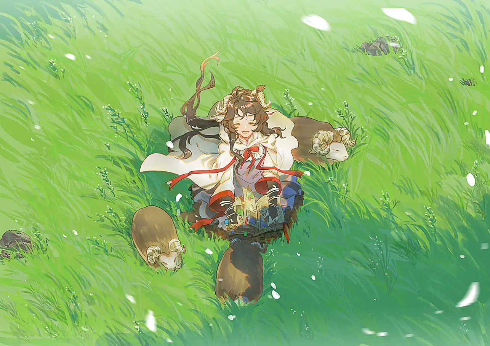

她应该属于青绿辽阔的草原，应该在温暖的春天里。{.textkai}

<!-- more -->

维多利亚富家出身的慕斯并不喜欢贵族间的宴会。比起哥哥姐姐们的游刃有余，她更喜欢呆在角落里品尝那些精美的小糕点。得了矿石病后，她连外人都少见。

可是在罗德岛的读书会是不同的：没有客套应酬，只有知心好友们聚在一起，分享一个愉悦的下午。所以每当慕斯病情未发作，左手正常时，她会烘焙蛋糕，做好茶点，开心地邀请朋友们。

但并不是所有时候都凑巧。普罗旺斯与杰西卡正外出任务，艾雅法拉刚刚从地形勘测中回来——她可以看出她脸上的疲惫。慕斯表达了自己的关心，有些遗憾，又有些对做好的糕点束手无措。

不过，艾雅法拉还是来参加了这次只有她们二人的读书会。吃慕斯做的蛋糕就是最好的休息了，她这样笑着说。

两人都不是健谈的性格，也无需多余的寒暄。和好友在同一个空间分享着静谧，这一认识就足以让人愉悦。

安静的房间里，只有二人轻轻翻书的声音。“猫猫”优雅地躺在书柜上，尾巴一摇一摇拨动着暖阳，睥睨骄矜地看着迟钝的小黑羊们把一本本书籍运到艾雅法拉身边，又温顺地依偎着她。

温暖的午后被拉得绵长。

不知过了多长时间，太阳渐渐下山，房间变得昏暗，慕斯起身想要开灯，却发现艾雅法拉已经睡着了。她蜷缩在椅子上，小黑羊亲昵地围在她的身边，其中一只恰好给她当了蓬松、软绵绵的枕头。

小羊们沉沉睡去。

初秋的天气并不算寒冷，火系术师的体温也高于常人，慕斯还是轻轻给她盖上了一层薄毯。

她看着艾雅法拉的睡颜，莞尔地笑了。

与自己仅在战场上辅助作战不同，艾雅法拉身为学者和中坚术师，比她辛苦很多。

慕斯听说过好友的过往，只觉得她一直被催促着成长。可她还尚且年幼，身体状况又如此糟糕——或许正因为时间紧迫，而真相依然很远，所以她才更加迫切地抓紧每一次机会。

可现在，她全然放松下来。白净的小脸随呼吸轻轻起伏，再不见疲惫。在睡梦中，艾雅法拉终于显露出这个年纪该有的稚气。

慕斯看过好友谈及学术研究时一丝不苟的模样，看过她品尝蛋糕时绽放的含蓄内敛的微笑，可没有任何表情像现在这样让慕斯感到欣慰与安宁。

慕斯看着被小黑羊们簇拥着的艾雅法拉，蓦然觉得：她不应在这岛舰上。

**她应该属于青绿辽阔的草原，应该在温暖的春天里。**<eod />

 {.centering}

（责任编辑：黒子；网页排版：武乙凌薇；绘图：福禄寿喜吉祥茶）

<FakeAds />