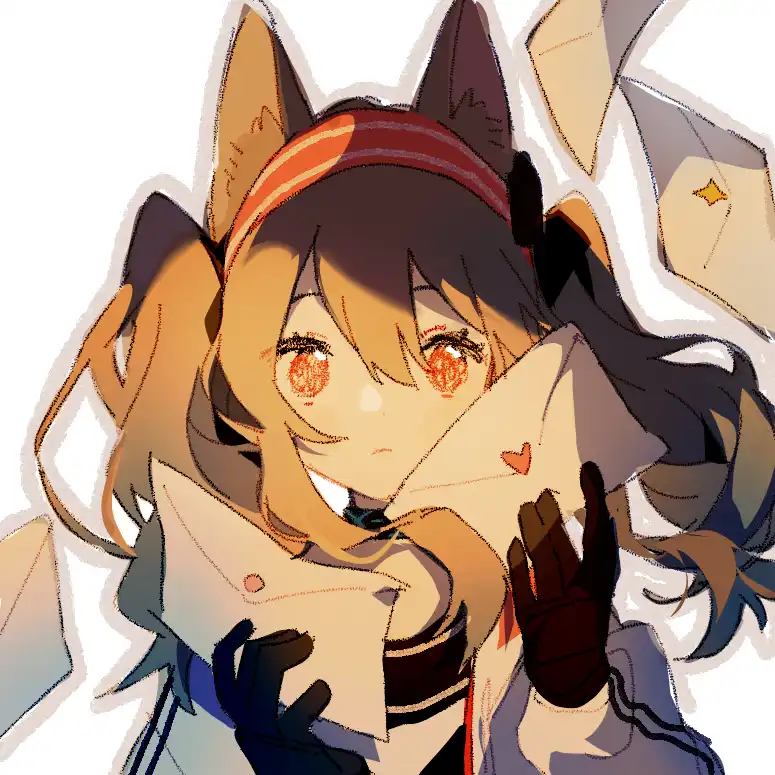

然而今天，博士第一次品尝到了自己梦寐以求的味道{.textkai}

<!-- more -->

博士这几天有个心事。

“嗯？博士，怎么啦？”看见博士直勾勾地盯着自己，博士的小助理也没多想就发出了疑问。

“……没事。”他轻描淡写地回应，脸上还挂着一丝浅浅的微笑。

“唔…”

什么没事，博士肯定是有什么事情瞒着我，安洁莉娜如是想到。可看着他煞有介事的表情，安洁莉娜也不忍心追问下去。

“哎。”她也知道自己的好运可能会因此偷偷溜走，但她还是在一遍一遍地叹气——

因为她自己也在为心事所扰啊。

---

## 1{.centering}

“安洁啊，你觉得咱俩上午看的那些衣服，谁家——”

“……”

“安洁？”

“……”

“安洁莉娜！”

“啊！”发呆的沃尔珀终于回过神来。“可颂，你刚才说什么”“…没什么”。倒是你，这是这顿饭里第三次发呆了吧？”

“……”

难得能找到这么一个闲下来的日子，安洁莉娜和可颂久违的决定出来逛逛街，给可颂的摊上也再置办几个小物件。一个上午过去，虽然两位少女并没有买什么东西，但她们已经物色了好几家心仪的小门店，也算不得是两手空空。只是，逛街的时候也好，挑选商品的时候也好，可颂发现安洁只要一闲下来就在发呆，摆出一副若有所思的样子。之后，她们就近找了一家装修还不错的小饭馆就餐。不得不说，可颂这丫头平时总是节省的不得了，但一涉及到吃这个领域，花起钱来可是绝不手软。她们俩一起出来吃饭时，安洁莉娜基本每次都会暗自思忖——她自己可从来舍不得点这么贵的菜呀。

在等菜上来的过程中，安洁莉娜总是望着窗外，那种若有所思的表情也回到了她的脸上。可颂有好几次想和她说说话，却每次都被她身上的忧郁堵了回去。于是，这位可怜的丰蹄少女只能等眼前的这位同伴看起来没那么忧郁的时候，找准机会和她唠两句嗑。说实话，这真的很影响心情，更何况可颂还等着安洁莉娜给她挑些衣服呢。若是两人交情一般，今天的这顿饭定会闹得很不愉快。只不过比起不愉快，她现在更关心自己眼前的好朋友。

“想什么呢？”

“哎———”可颂等了好一阵子，但等到的回答却只是一声叹气。心想着也不好再继续问下去，这位丰蹄族的少女将头转向一边，拄着下巴怔怔地望向窗外熙熙攘攘的人群，以及五花八门的店铺招牌。沉默的气氛杵在两人之间的餐桌上，饭店里七嘴八舌的交谈声于这片宁静显得格外不搭。

“我说，安洁啊。”良久，她在这片沉默中开了口。

“嗯？”

“你怎么还没和博士告白？”

“什——”小狐狸的脸唰地一下就红到了耳根。“可颂，你，你，你怎么知道的…”

“我猜的，嘿嘿。”可颂的脸上洋溢着一层坏笑。

“真是的，猜这么准……”

“嗨呀，我又不是第一天认识你了。”看着安洁莉娜害羞的表情，她不禁噗嗤一声笑了出来。“再说了，看你这愁眉苦脸的样子也不好受，逗你玩一下。”

“什么嘛！别，别拿人家取笑呀…”话虽这么说，安洁莉娜的语气中却并没有责怪的意味。

“哈哈，没有没有，我哪有那意思。”可颂又一次望向窗外。“所以，你准备什么时候去告白啊？”

“不知道……”

“那圣诞礼物买了吗？”

“没有…”安洁莉娜的语气愈发微弱，像是正在被家长训话自知理亏的孩子一样。

“还没买啊？这都不剩几天了。”“可我不知道买什么呀…”“普通一些的就ok了吧？”

“……”

“怎么又哑火了？”可颂轻轻点了一下安洁莉娜的眉心。“自信一点。”“那也不能随便买呀！”“哎呦——咱们的安洁可是博士的小心肝，你送啥他能不高兴？”

“瞎，瞎说什么呢……”听了这话，她刚没冷静多久的小脸瞬间又红了上去。

“诶，我可没瞎说。你问问身边大伙，谁不是这么认为的？”

“呜……”

“哈哈哈，好了好了，不逗你了。”

“真是的！就知道拿我寻开心…”

“没，我还是很希望你们两个能成的。”可颂夹起盘子里的一颗鸡肉块，放在了安洁莉娜的盘子里。“吃完出去走走吧。还有几天，好好选选，总能选出来的。”

“…嗯。”

“好，那你觉得咱俩上午看的那些衣服……”

---

## 2{.centering}

怎么样？”博士站在梯子上，一边拿着手中的缎带，一边向自己脚下的凯尔希问话。

“往左挪。”

“好。”

“哎，右边再抬一下。”

“这回行了吗？”

“行，下来吧。”

不等平安夜到来，罗德岛上下就早已溢满节日的气息。五彩的缎带与气球随处可见，大大小小的圣诞树上也挂满了彩灯与吊坠。年纪尚小的孩子们见状，也不顾这节日还到没到，就早已结伴玩耍了起来。而这次圣诞节中需要大家最重点装饰的地方，也就是这大礼堂了。只不过昨天大家忙前忙后，实在是没能把这地方完全装点起来；不过好在时间充足，所以大家也没有那么忙。这不，正好赶上博士和凯尔希闲下来，于是他们两位就来这里稍微搭一把手。

“凯尔希。”“怎么？”“我记得医疗部今天还有几趟手术。”

“嗯。”

“你不去吗？”“那多亏了某人昨天给我提的建议。”

“没办法啊。”博士将目光投向远处的干员们，忙碌的背影使他倍感欣慰。“你要是再继续糟践自己，指不定什么时候就倒在手术室里了。”

“博士，我并不是糟践自己的身体。工作就是工作，医生会因为患者的性命而竭尽全力，古来今往皆如是。”

“但医生也是人，是人就要休息。”博士回望凯尔希的脸庞，他眼神中的坚定使她倏地一惊。“你要是真倒了，罗德岛明天就可以收拾收拾解散了。”

“不至于。”

“怎么不至于。”博士再一次把头转到一边，看向远处的干员们。“记得爱惜自己，哪怕是偶尔也行，好吗？”

“……嗯。”

不知道是不是出于博士软磨硬泡的缘故，凯尔希最近的话语中少了一些尖锐。但无论如何，这毕竟是个好事，至少博士终于不用整天再看那张面瘫似的脸，和她日常的对话也没那么累人了。就今天的这场对话而言，换做一个月前，估计他们二人还要小吵一架，惹得周围鸡飞狗跳，好不安生。

“博士。”“嗯？”“礼物买了吗？”“买了。”“行。”“不是，合着你……你就不好奇我都给谁准备了吗？”

“不好奇。罗德岛上上下下数以千计的干员，你不可能准备的面面俱到。你只要给你认为重要的人准备礼物，就已经足够了。”

“那你也不好奇我有没有给你准备？”

“不。”

“嘴这么硬？”

“如果博士你执意这么认为的话，那就是吧。”凯尔希瞥了一眼博士，随后转身就向大门的方向走去。

“哈哈哈，走好不送——”

“哼。”

目送着凯尔希的背影在大门后消失，博士的脸色也不再像先前那般轻松。他知道，这才没过几分钟，凯尔希就又要回去工作了。她就是这样一个不肯放过自己的人，这教博士实在是放心不下；但其他人却又不能和凯尔希说这件事，因为只要有人一和凯尔希提及她说身体情况这种事时，那可怜的干员就一定逃不过接下来长篇大论的说教。整个罗德岛只有自己能劝她下来好好休息，这还真是件无可奈何的事情——博士这么想着的同时，他的眉头又皱下几分。不过此刻令他最为头疼的，却不是凯尔希的事情。

“重要的人，吗……”他轻微的呢喃声被人群的嘈杂在一瞬间淹没。

其实博士这次还准备了不少礼物。他给阿米娅和迷迭香一人买了一个好—大的玩偶，因为上次博士带她们去商场的时候，她们俩在柜台前偷偷看了好久，但最后却因为价格太高就不了了之；他也给煌置办了一件开春之后穿的小夹克，他这些换季的衣服太少了，也该让她学着打扮打扮自己；他还给杜宾买了一双她喜欢的那个运动鞋系列的最新款，等等。总之，他这些精心挑选的礼物，加起来有小几十个；即使是那个成天唠唠叨叨的凯尔希，他也为她准备了一个新的水杯。没办法，她之前那个水杯用得实在是太旧，还是换一个吧。

只是在这一大串名单里，他却惟独没有给其中一个人准备礼物。哎，想到这里，他开始叹气。因为这个人，偏偏是他低头不见抬头见的那个家伙，偏偏是她只要待在自己身旁，就能让自己安心的那个家伙。买，啥，呢？这三个字在博士的脑海中不停浮现，怎么赶都赶不走。

总不能还是唇膏吧。就算她喜欢这个，也不能年年都是这玩意儿吧。那不买这个买啥啊？这一刻，他开始恨自己不是女孩子。要是自己是和她年龄相仿的女孩子，说不定更能了解她的喜好。不仅如此，他也恨自己怎么一天天的除了工作就是工作，谁给我排的日程啊？哦，凯尔希。怎么又是她？老太婆，我恨死你。可就算他的心理斗争再强烈，不知道的事情就是不知道啊。本来自己是为了转换心情才来大礼堂这边帮忙干点活，但最后兜兜转转还是逃不开这个事。眼看着这里没有什么自己能做的事，博士只能愁眉苦脸地回到自己的办公室。

“啊，博士，您回来啦。”

嗯，我回来了……博士本来是想这么回应的。可看着眼前这位令自己即安心又发愁的小脸蛋，他就连这么一句简单的问候，也无法说出来了。

---

## 3{.centering}

呼啊——”博士放下手中的水性笔，靠在椅子的靠背上伸了个大懒腰。数十张草纸在他面前叠成一摞，密密麻麻的数字与符号让人看得眼花缭乱……不过他本人很清楚自己在写什么就是了。

时间一天一天地过去，转眼间距离圣诞节只有三天了，可博士还是不知道自己应该送她一份什么样的礼物。他倒是想用日常的工作来麻痹自己不去想这个问题，但大炎有句俗话说得好——躲得过初一躲不过十五，就这么拖下去也不是办法啊。总不能今年什么都不送，那太不合适了。博士看着头顶的天花板，静静地思考这些问题。他想到今天的工作还剩些没有完成，不过现在倒是可以让自己休息一阵子。于是他站起身来，为自己泡了一杯速溶咖啡。要是让安洁看见了，想必她又要责怪我两句吧——这么想着的博士转头望向自己的小助理。

“呼——呼——”

在办公室的沙发上，安洁莉娜睡得正香。她的鼻间散出平稳的呼吸声，那对小耳朵也因她在梦境中遨游而一抖一抖地摇晃。应该是睡熟了吧，博士这么想到。她一大早就出去送信，下午还要去训练室练习源石技艺，等她赶到这边准备整理文件的时候天都快黑了。看她如此疲惫，博士本不想让安洁莉娜来打下手，可怎的也执拗不过她，再者自己这边的计算也遇上了难题，于是他没说两句就草草作罢了。现在想来，刚才真应该多坚持一会儿。抱着这样的想法与些许的内疚，博士从墙边的柜子里拿出了一块毛毯，准备盖在安洁莉娜的身上。

“呼——呼——”

安洁莉娜的呼吸依旧十分平稳，但博士的脸却红的不得了。现在想来，自己很少有机会能够这么近距离接触她，于是他不由自主地凑上去，仔细观察安洁莉娜的睡颜。怎么说呢……其实也没什么好说的吧。闭合的眼睑将那对琥珀色的眸子结结实实地关在里面，平时顺下来的头发也睡得有些杂乱，半开的小嘴也同鼻子一样传出些许微弱的气流。然后他品尝了一下她的呼吸，感觉和平时呼吸的空气并没有什么区别，只是有点热。真是害羞，他这么想着，将自己与她之间的距离拉开到了正常的程度。像是干了坏事却又害怕父母知道的孩子一样，他的眼神飘忽不定，却又总是忍不住朝她的方向瞥上几眼。还好，她没有醒来。

“……怎么跟个小小子似的。”他不禁自嘲一句，随后将剩下的那半毛毯盖上去。

只是在盖好之前，他发现安洁莉娜的手边放着一副手套。他认得，这是她平常干体力活时用的手套。这要是翻个身，手套就掉在地上了，所以他准备把它放在沙发旁边的茶几上。但就在刚拿起来的时候，博士就注意到了这副手套是有多么破旧。这手套整体是用皮革制成，但至于是皮还是革，他也不知道。手心的位置打了两块补丁，虽然乍一看还挺合适，但修补过的痕迹却也明显。不仅如此，就连这两块补丁都出现了些许的裂纹，似乎能从这缝隙中看到手套里白色的海绵。看着这幅手套，博士的心里很不是滋味。她知道安洁莉娜的工资是多少，也还算了解她的生活习惯。虽然她的工资并不富裕，但也不至于节省成这个样子。他知道安洁会在自己喜欢的小物件上多花一点钱，而在生活用品上确实是比较节俭，但这……

“哎。”博士轻轻地叹了一口气，以保证不打扰她的睡眠。如果用一个词语准确形容他的心情，那最合适的词语莫过于心疼二字了。他将手套放在茶几上，心中则是五味杂陈。好几件事情在他脑海里搅成一团，也一时不知道该思考哪个，于是他离开办公室，希望走廊里的冷空气能让他稍微清醒一些。

不得不说，十二月的气候还是厉害，博士不得不将自己的衣领架起来，多少抵御一下空气中的寒意。至于博士的脑海，也在一瞬间就清醒了过来。不过比起清醒，似乎清洗这个词汇应该更加合适。一股寒流将脑海中的乱麻吹到天边，也将他的思考夷为平地，使他的大脑不由自主地放空起来。但总有些东西是吹不走的，比如现在，一个小小的想法在这片平地上悄悄破土而出。

他笑了。因为他这几天的苦思冥想终于有了答案，只是这份答案却不是通过思考得出来的。所以他又笑了，笑自己的笨拙。

---

## 4{.centering}

白天的时候，安洁莉娜向博士递出一份邀请。邀请的内容很简单：晚上五点之后一起出去走走，散散步。

若是平时，博士可能还不会反应那么大，但今天晚上是平安夜啊。所以这办公室里即使只有他一个人，他也按捺不住自己的期待。欢欣雀跃，这就是博士现在的状态。工作时心不在焉，一有空闲就会想象二人独处的场景，甚至会向自己发出“这是不是约会”的疑问，全然没有一个成年人的稳重，也和他平时给人的印象大相径庭。不过话又说回来，谁说成年人就一定要稳重了？

好想见她，这就是博士现在心里最强烈的想法。感觉就算罗德岛明天爆炸都无所谓了，自己现在只想见她。他望向墙上的时钟，时针却指在2的位置。该死，你就不能多转三圈？再多转三圈，我就能直接开溜。于是在这三圈的时间里，博士可谓是极尽所能消磨时间，却又感觉时间流逝极为漫长，教他实在难以忍受。要是安洁莉娜能早点来的话该多好啊——心急的他不免萌生出这样的想法。但他随即又想到，女孩子打扮是不是会很花时间啊？穿衣打扮化妆什么的……

他摇摇头，否定了自己的想法。这应该就是一次简单的散步，没必要搞得这么正式吧？博士这么想到。可他心底还有一个声音告诉自己，自己是希望安洁莉娜能很重视这次与自己的散步的。哎，人真是个矛盾的生物。博士这么给自己下了一个定义，可随后又陷入了他所说的矛盾中去。

时间来到了四点半，博士在自己的房间内一圈一圈地踱步。而他不知道的是，离自己只有一墙之隔的门外，正上演着一年一度的悄悄话。
“安洁，都走到这了，上吧上吧。”

“呜，不行……”

“哎呀，就差最后一步了，总不能前功尽弃吧。”

“不行，太不好意思了，还是等下……”

“不是你说要提前给博士一个惊喜的吗？”

“呜，呜……”

“哎，每次都是这样，真教人放心不下啊。”可颂握住安洁莉娜的双手，平静地向她说道。“来，吸气——”

“嘶——”

“呼气——”

“呼——”

“吸气——”

“怎么样？是不是没有那么紧张了？”

“……是。”

“那就好，你要对自己有自信啊。”可颂拍了拍安洁莉娜的肩膀。“咱家安洁可不比别的女孩子差！”“真是的，净瞎说。”“哪有。”可说到这里，可颂的表情却变得正经起来。“但是在这之后，我就帮不到你什么了。说点啥呢？呃……不知道。反正加油吧！”

“嗯。”“那我…走了啊。”

“…嗯。”、

于是可颂就这么头也不回地走了。谁知道她为什么离开的这么干脆呢？或许是不想打扰两人的恋情吧。而看着可颂的背影，安洁莉娜接受着来自挚友的关心，同时也在心底默默下定了决心。所以没过多久，她就鼓起勇气，推开了自己再熟悉不过的那扇办公室的门——

“那个，博士——”

晚上八点，罗德岛大礼堂。

经过了数天的装点，这里已经完全被装点成了一个聚会的场所。四周墙壁上挂满了五颜六色的彩缎与彩灯，几扇大窗户上也是贴满了雪花形状的贴纸。礼堂的正中央摆着一颗巨大的圣诞树，上面挂满了小夜光灯，铃铛，还有许多礼物盒形状的挂坠。至于说这圣诞树顶端的大星星，还是煌爬梯子上去想办法固定住的。孩子们带着各种各样的圣诞面具，贴上圣诞老人白花花的假胡子，拿着礼物和玩具在一起闹地不亦乐乎。而干员们以及到场的孩子家长们，也借着这个机会互相认识认识，聊些家常。桌子上摆满了各种各样的糕点与糖果，还有许多供大家享用的饮品。只是这里没有主食，因为像烤火鸡那样的食物，放在桌子上没人吃，一会儿就凉了。若要品尝那样的美食，还是要到食堂才行。至于说大礼堂，基本上就是给孩子们提供一个聚会的场所。当然，阿米娅也在这里。她毕竟也是个孩子，虽然在一众孩童里较为年长，但依然童心未泯呀。

“啊，凯尔希医生！工作辛苦啦！”看到熟悉的身影，阿米娅立刻小跑地上前迎接。

“嗯。阿米娅，玩的还开心吗？”

“还可以，还可以。”当然，她并非玩的不尽兴。只是在这个年纪，阿米娅已经有了在大人面前要收敛一些的自觉。“凯尔希医生，今天没有工作了吗？”

“还有，现在只是来散散步。”

“啊，哦……”阿米娅的表情立刻浮现出担心的模样。“那个，博士也有工作吗？”

“他今天没有。倒不如说，应该是全翘了。”

“诶，诶？！那博士现在在哪里呀？”

“反正不在罗德岛。”

“那，那博士今年不和大家一起过圣诞节了吗？多寂寞呀……”

“没事。”凯尔希轻轻抚摸着阿米娅的头。“他现在可一点也不寂寞。”

“是吗？”

“嗯。并不是每一次节日，大家都需要在一起度过。”透过贴纸间的缝隙，凯尔希望向窗外。她望见一轮明月当空，四周繁星点缀，大地白雪皑皑。

“博士他，也到了这个年纪了。”

---

## 5{.centering}

今天夜里的这条步行街可谓是张灯结彩，热闹非凡。路边的树上挂满了装饰，霓虹灯的颜色把整条街照得比白天还亮。街上的行人络绎不绝，一眼望去甚至看不到尽头。街道两侧到处都是几层高的小楼，偶尔还有两三幢规模不菲的大厦；店家们的牌匾们几乎占领了所有门市房的位置，大喇叭里循环的音乐与吆喝声一刻不停地寻找着他们的“猎物”。

热闹归热闹，但十二月毕竟是寒冬时节。大家身上都裹着厚厚的衣服，难以把自己打扮得像是夏日那样华丽。即使是装饰用的蕾丝手套，在这个季节里也要通通换成不那么好看的厚手套，否则出门在外就别想把手从衣服兜里拿出来咯。

用过晚餐后，博士和安洁莉娜在大街上并肩而行。虽说博士还是平常那一套休闲装，可安洁莉娜倒是不太一样。一身杏色的毛呢连衣裙搭到膝盖处，那对狐狸耳朵在针织的帽子里藏得严严实实的，腿上穿着一层保暖用的打底袜，鞋子也是换成和平时运动鞋风格完全不同的小皮鞋，背上背着一个装法杖的长条包裹。这身打扮倒是让博士吃了一惊，因为安洁今天的风格与平日里大相径庭。现在的她看上去，虽是还藏不住平日里的活泼与稚嫩，但却又有着一种难以言说的……成熟。说得通俗一些，应该就是大孩子与小孩子之间的区别。那句诗怎么念来着？

杨家有女初长成,养在深闺人未识。

或许那个刚来罗德岛时还带着些许生涩的安洁莉娜，现在真的变成一位名副其实的大姑娘了，博士这么想到。

“博士——”安洁莉娜故意拉长音说道。

“嗯？”

“想什么呢？”

“…没什么。”博士把这个问题敷衍了过去。因为想你的事情想到入迷这种话，他无论如何也不好意思说出来呀。

之后，他们俩逛了逛附近卖甜点和饮品的小店。令博士比较惊奇的是，即使是十二月这样的天气里，竟然也会有卖冰激凌的地方。但安洁莉娜似乎并不为此感到惊讶，甚至还想买一个来吃，不过最后还是被博士劝住了。可他又怕坏了安洁莉娜的好心情，所以就给给她买了一块巧克力慕斯。宽阔的商业街旁边分出了好

多条小道，而他们去的这家蛋糕店就坐落这些其中一条小道的角落里。只是位置虽然相对偏僻一些，但在圣诞节这种特殊的日子里，就连这种小店也是座无虚席。放眼望去，有肩并着肩腻在一起的情侣，也有对坐两侧亲密交谈的恋人。

“那个，博士！我，我来喂你吧……”看到其他情侣做出那种亲昵的行为，安洁莉娜也是难以按捺自己心中的悸动。

“…这是给你买的，你自己吃吧。”

“有什么关系嘛！张，张嘴，啊…”

“…啊——呜。”执拗不过安洁，博士还是乖乖地张开了嘴。这块慕斯像布丁一样化开，冰凉的温度结合着巧克力甘甜的口感在口中散开。“怎，怎么样，好吃嘛……”

“嗯，嗯…”两人都把视线别到一边，微微低下头去，不敢正视对方的眼睛。瞧现在他们俩的模样，活脱脱是两颗泄了气的红皮球。

坐了一会儿，博士和安洁莉娜离开了蛋糕店。然而，还没等博士开口询问安洁莉娜下一个地方去哪里的时候，他的右手就被安洁莉娜紧紧地攥住了。

“安，安洁？”

“博士，来这边。”

被安洁莉娜拉着走了几分钟，博士来到了另外一条偏僻的小道。虽然这里的路灯照常亮着，但是路上的行人却是屈指可数。

“安洁，有什么事吗？”

安洁莉娜也是没有回答博士的问题，而是自顾自地将法杖从包裹中取了出来。

“发，发生什么了？”而她的行为却把博士吓了一跳。是不是有谁在路上跟踪他们，或是要对安洁图谋不轨？博士的脑海中瞬间冒出了这些危险的想法。

啊？”可安洁莉娜却像是个没事人似的。不过她毕竟是个聪明的孩子，看到博士的反应之后立刻就明白自己的行为似乎过于突然，吓到了博士。于是她连忙解释，自己并没有那样的打算。

“那你这是……”

“嗯…”她顿了一顿。“其实我这几天一直在想，怎样才能让博士过一个难忘的圣诞节。”

“我倒觉得今天已经很难忘了呀。能与安洁一起出来散散步，对我来说就已经是很满足的事情了。”

“是，是嘛……”被毫无征兆地夸上一句，那害羞的表情立刻又回到了她的脸上。“但，但我觉得还不够。”

“那，安洁你有什么打算吗？”博士指了指她的法杖。“你想用这个做些什么？”

“嗯。”

她小手一挥，那法杖就横在半空中。博士一看就能看出来，这是她日夜勤加苦练的结果。安洁莉娜握住自己法杖上红色的把手，侧身一跨坐了上去。

“嘿……”看到安洁莉娜这副模样，博士的表变得颇有趣味。“就像是童话故事中骑着扫把的魔女一样。”

“但是衣服还是有很大区别吧？”

“哈哈，就算是这种节日，穿着奇装异服上街也不太合适吧？又不是万圣节。”博士笑了笑。“所以，你准备去哪？”

“先不说这个。”安洁莉娜用左手拍了拍法杖的后半截。“博士，坐上来吧。“啊？”“我吗？”“是呀。”“那，这…怎么坐啊？”

“就像坐在自行车后座上那样就可以啦。这法杖也不短，两个人挤一挤还是能坐上去的。”

“好……”

怀着些许的期待与忐忑，博士双手环抱住安洁莉娜的腰，坐在了法杖上。

“呀！”当博士抱住安洁莉娜的时候，她的惊叫十分可人。“博士，怎么这么突然……”

“那我不抱住你，等下飞的时候我不就掉下去了么？”“是，是哦……”

在这片狭小的空间里，博士和安洁无法转身确认对方的表情。但他们知道的是，自己现在脸上的表情，一定是羞得要死的模样吧。

“那，那个，博士，要起飞了——”

“嗯…嗯。”

“真的要飞了哦？”

“好。”话音刚落，四周的气流开始流动。

---

## 6{.centering}

“博士，感觉怎么样？”

“这可把我问住了。我想想，该用什么词去形容呢？”博士想了一想，说道。“奇妙。对，就用奇妙这个词吧。”

“怎么个奇妙？”

“我感觉自己的身体轻飘飘的。这也多亏了安洁的源石技艺，我才能像这样在空中遨游吧。”

“嘿嘿，我擅长的就是这个嘛。”即使看不到安洁莉娜的表情，博士也能从她的语气中读出一丝喜悦。“但是但是，我更想听博士对于其他东西的感想。”

“什么其他东西？”

“比如说景色？和平时看到的有什么不同吗？”

“景色……吗。”

从天上看到的景色，和地面上确实有很大的区别。以前出任务的时候，博士曾不止一次地把指挥部设在山谷上的制高点，这样也方便观察下方的动态，也没那么容易受到敌军的打击。不过那种情况下看到的景色，比起向下看，更多的是向远看，用“瞭望”二字形容或许更为合适。但今天他所看到的景色，应该用“俯瞰”这个词来描述。就像是从二十多层的高楼往下看一样，这条商业街的点点滴滴尽收眼底。本来是宽阔的街道，此刻也变得愈发纤长；隐隐约约还能看到街道两侧种植的树木，以及街上缓缓涌动的人潮，就连那平常看起来高不可攀的屋顶，此刻也只是在自己的身边相继作伴。博士不禁暗自感叹，城市的夜景竟然还能营造出这样的奇观。于是，他把自己这些心中所想都一五一十地讲给安洁莉娜听。

“哈哈，很不可思议吧？”

“嗯。如果没有安洁莉娜的话，我可能一辈子都不会体会这样奇妙的景色吧。”可令博士没想到的是，刚说完这句话，他们两人的飞行轨迹突然出现了剧烈的晃动。

“安洁，出什么事了？”

“没，没什么！”好在这晃动只持续一两秒后便恢复了平静。“没什么……”

这之后，安洁莉娜就不说话了。她带着博士飞了几分钟，随后找了个屋顶落脚。而博士见状不禁心想，自己是不是哪句话不太合适？于是趁这个机会，博士想要好好地和安洁莉娜道歉。

“那，那个，博士！”但还没来得及道歉，他的想法就被安洁莉娜打断了。他有些惊讶，因为安洁莉娜叫自己的时候真的很大声。

“啊？怎，怎么了？”看到她这紧张的模样，博士的心情也不自主变得紧张，说出的话也开始结巴起来。
“……给。”
安洁莉娜从自己装法杖的包裹里拿出来了另一个小包裹。里面装的是一条围巾，深灰色的围巾。

“这是…送给我的？”看到这份礼物，博士笑了。他想起来自己前几天出去冷静的时候，冷空气使他不得不抬起衣领的那个晚上。接着，他又想起更久远的，许许多多像这样的晚上。有时他会想，如果这时候有一条围巾该多好啊。可他终究没有这样的习惯，所以每次也就是有个念头而已。他真的没想到，安洁莉娜竟然会观察自己观察到这个份上，因为就连博士自己，都未曾注意过这一点。她还特意挑了这种相对成熟一些的颜色，与自己平常穿的大衣都很搭。他真的很高兴，这种喜悦是发自内心的，出于人类最原始的情感，是再怎么掩饰也掩饰不住的感情。

“嗯，因为博士一直也没为自己买一条围巾，所以我就买了一条……但是因为时间真的很仓促，没有给博士挑一个好看点的包装盒…实，实在是——”

只是，还没等“对不起”这三个字从安洁莉娜嘴里蹦出来，她便发觉自己已经被博士紧紧地抱在怀里。
“博，博士？”

“傻丫头，说什么呢。我在乎过这种小事吗？”

“可是，可是……”

“没什么可是的。你能关心我到这个份上，我很高兴。”

“真，真的吗……”

“这还能有假？”说罢，博士慢慢放开了安洁莉娜。“来，你看看，我也给你买了点东西。”

与安洁莉娜不同，博士从手里的袋子中拿出了一个紫色的礼物盒，盒子上绑着两圈深红色缎带，在正上方系成一颗蝴蝶结。

“打开看看吧。”

“嗯，好……”安洁莉娜接过礼物盒，解开盒子上绑着的缎带，取出了她的圣诞礼物。“啊，这是……”

盒子里是一副全新的手套，和她平常戴的手套是同一个款式，尺寸也是一样。除此以外，也没什么特别的了。

“我也不太懂挑礼物，所以就买了这么个东西。”博士摸了摸自己的后脑勺，看起来是有些不好意思。“你那手套都用到这份上了，换个新的吧。”

“……”

“还喜欢吗？”

安洁莉娜并没有回答博士的问题，她什么也没多说。只是博士看到，她默默地将自己带着的手套拿下来放在包里，换上了博士送的新手套。

“没必要就现在换吧？”他尴尬地笑着说道。“这毕竟是运动手套，和你现在这一身衣服也不搭呀。”可安洁莉娜却摇了摇头。“没有这回事，博士。您送给我的东西，就是最好的。”她右手握住法杖，左手则是牵起博士的右手。“走吧，博士，我们再飞一圈。”

和刚才一样，安洁莉娜和博士一前一后地坐在法杖上飞行。但与刚才不同的是，他们这次不再是像骑自行车那样坐着，而是像坐在长椅上一般，侧过身地坐在法杖上，任凭它自己慢悠悠地往前飞。至于说那条灰色的围巾，则是应博士的要求，搭在了两个人的肩膀上。

“博士。”

“嗯？”

“我……我一直在观看这样的景色，您知道吧？”

“知道，毕竟你是个信使嘛。”

“是。我就是在这种常人看起来会很惊讶的景色里度过每一天的生活。”说到这里，她却沉默了几秒钟。“博士，您好奇…我是怎么想的吗？”

“怎么？”

“我第一次看到这样的景色，是在几年前的事了。那时我刚感染矿石病没多久，就被我们那边的城管赶出去了嘛。当时我一个人在城外流浪，失魂落魄的。正好有一个信使说是有一封信交到我手里，然后她当时看我可怜，就带我体验了一次这样的景色。”

“是什么感觉？”

“远处移动城市的街道上，灯光缀连成线，高楼的影子融入夜色。之前当我匆匆忙忙沿着墙根走过街道的时候，那些建筑彰显着它们冰冷的威压，但此刻它们看起来渺小、遥远又无辜。”

“这话我是不是在哪听过？”“以前我和你讲过好多次呢！但博士总是听不进去。”她把目光从博士的身上移开，投向远处屋顶上的天线。“那今天，多少能理解一些了吗？”

“嗯……能。”

“其实直到现在，这种感觉依旧在我的身上挥之不去。即使现在的我已经比那个时候的我成长了很多，但这些高楼依旧使我感到冰冷……和孤独。”她回过头来，对着博士微笑地说道。“不过，也不能这么说，至少来到罗德岛之后，或者说是成为了博士的助理之后，这样的感觉在逐渐减少吧。”

“哈哈，是吗？”

“嗯。因为当我送信的时候，我知道有人在挂念着我。我是安心院安洁莉娜，可同时也是大家的信使。罗德岛的大家在挂念我，远方的收信人也在挂念着我，还有……”说到这里，安洁莉娜的脸红得像是几个小时前的晚霞。而看到安洁莉娜害羞成这样，博士自己的表情也不禁羞涩起来。

“是吧，嘿嘿。”确认到自己想要的答案，安洁莉娜再一次眺向远方，但这次她却没再说话；而博士也不好接过话茬，于是两人就这么肩并肩地飘在天上。

“吶，博士。博士是……怎么看我的呢？”

“我…我吗？”

“不，不用了，还是别说了……”可还没等博士想好第一句台词，安洁莉娜就又把话收了回去。“我，我还是换个说法吧……”

“……”

“博士，今天是我们两个人一起…出来散步，对吧？”

“嗯。”

“那以后像这样，我还约博士出来的时候，博士还会答应我吗？”

“嗯。”

“那…以后在我一个人的时候，博士会……在我的身边陪着我吗？”

“嗯。”

“谢谢…谢谢博士。”

“不用谢。因为我也是一样，安洁在我身边的时候，我就会感到很开心。”“是，是嘛……那博士，转，转到这边。”

博士把头转了过来，正对着安洁莉娜红扑扑的小脸蛋儿。他还是第一次这样近距离地观察安洁莉娜的脸，比那天晚上偷偷看的场合还要进。他看到她那对清澈的眸子，呼出的空气在零下十几度的冰天雪地里冻出的白雾，以及睫毛上挂着的那一层霜。他也不知道接下来会发生什么，但他的心跳跳的很快，比以往任何与她同处一室的时候都要快。或许，博士知道接下来要发生什么。又或许，他在期待着接下来发生些什么。

其实，他去年送给安洁莉娜的圣诞礼物是一款唇膏。酸橙味的唇膏，安洁莉娜喜欢这个，博士知道。只不过那毕竟是女用的唇膏，他也没什么机会，更不可能去偷偷尝一下是什么味道，那也太不检点了，博士这么想到。可他始终好奇，究竟是什么样的味道，能让自己的小助理对它如此爱不释手？每每想到这里，博士总会以叹气作罢，因为他觉得这个想法有些幼稚，而且自己……可能一生都无缘这份答案。

“啾。”

然而今天，他第一次品尝到了自己梦寐以求的味道。<eod />

 {.centering}

（责任编辑：瑶濯；网页排版：武乙凌薇；绘图：飞天小莱）

<FakeAds />