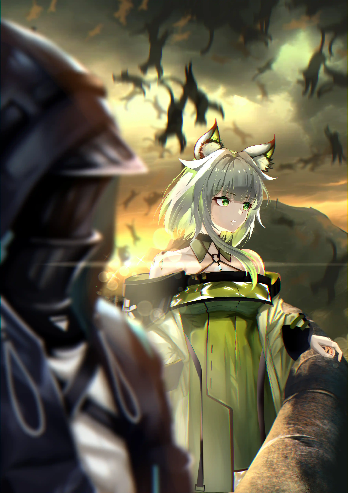

在世界尽头的猫猫雨下，我和她许下了长达百年的约定{.textkai}

<!-- more -->

我亲爱的，你是否记得那个美好的夏日清晨{.centering}

我们一起看见的东西{.centering}

在小径拐弯处，一具溃烂尸体{.centering}

横卧碎**尸**满布的路上{.centering}

法 波德莱尔《恶之花》改{.aright}

**重逢**{.centering}

与凯尔希的相见是一件完全出乎我意料的事。

此时，我已经不再是博士，甚至连是否仍有资格被称作学者都还未知。我所仰仗的旧时代的知识已经朽腐，它曾为我赢来过无限的荣光，而今的归宿却是和承载其的大脑的僵尸一起被扫入标签贴着无用落后的垃圾桶。

平心而论，那些小家伙们做得不坏，他们在新的世纪出生，至今最大的一批也还不到百岁，换成我当这个年纪，做得也未必比他们好——事实上，或许要糟的多。你知道的，我们以前犯下过不少错误，把整个世界搅得一团糟，不过幸运的是，至少最后的几件不能算在错误的行列——比如将世界转手交给谁知道可不可靠的下一辈们。

我从退休到现在，正好七十年，可以很骄傲地说，除了刚开始的七八个季节，此后再没有掌握过权力。孩子们的进步比我预想得快得多，他们一开始得意忘形、笨手笨脚，不久就完全适应了这种生活，逐渐变得沉稳而内敛，看起来就和我们那个时代最为贤明的君主差不多，当然，内里完全不同。

因此，托他们的福，我也能很快安下心来享受自己的退休时光。我对自己的时间把控很严格，这是从巴别塔时期就养成的习惯，尽管当时我可支配的自由时间每天不足二十分钟，而现在则足足有二十四个小时。我恪守作息，每天准时临晨一点钟睡觉，第二天正午十二点起，大概磨蹭到一两点，去他们为老年人设立的食堂吃些残羹冷炙，整个下午则是愉快的无所事事，有时读书，有时写作，有时下棋。我最早和银老板下，等他老得下不动了，就和他的儿子下，现在则是他儿子的儿子。恩希欧迪斯死在喀兰山神祭的前一天，我原本以为他能活得更久些，但他说他太累了，而且他讨厌山神，小时候总是担心某一天山神会偷偷把他的妹妹们叼走，与其在被褥上凄惨的挣扎，不如早些离开更显得体面。按照银老板的遗言，我不被允许出席他的葬礼。

在这种健康而且舒适的作息下，我老得很快，皱纹轻而易举地爬满了脸颊，就像渠水流进田地，就像蓬勃生长的树枝，就像街道布满了城市，等注意到的时候，已经久不再带兜帽，坦然露出花白的头发与缺门牙的齿——旧时代的人即使站在我面前也认不出我，说到底，他们本来见我的脸就不多。

那天中午，我和我的老朋友塞雷娅打赌，说我能独自解决两盘二十四寸的比萨饼，她一开始嘲笑我的狂妄，接着却被吓得不轻。我对于她的惊吓感到满足，因为自尊心得到维护，却绝没想到三十年后会由于这两块始终没被完全消化梗在胃里的比萨饼得了一次中风，在床上凄凄惨惨地躺了十个月，全由塞雷娅照料，期间还长了几颗淘气的褥疮。

塞雷娅是我在战争中捡到的孤儿，第一次见面时大概两岁，独自抱膝长久地蹲在一个已经没有活人的村子里，沉默得像个死孩子。我带她上路，洗干净之后发现是个雌性瓦伊凡，她说记不得自己的名字，我就以自己过去所认识的飞龙种中最为坚毅最为强大的一只为她命名。幼儿时她把我当父亲和母亲，稍长一些把我当老师，青年时视我为最大的敌人，到中年则认为我是个不可多得的朋友。等她老得看上去和我差不多，以上这些情感就全都混在一起，如同被雨淋湿褪色的油画，脏兮兮的分不清楚了。

我向塞雷娅炫耀我盘中比萨的残骸，就像举重运动员绷直身体将哑铃举过头顶，直到那包含尊严的三秒钟结束，就将一切自得抛在脑后，只顾着埋头向卫生间冲锋。

抱歉，我不打算描述自己在那里呆了多久又或者经历了什么，毕竟还没老到脸都不要的程度。我仍然打算在这个世界努力活上一阵子，所以得把剩下的面子精打细算，如果丢完得太早，剩下的日子就不太好过。

总之，我能说的就是：当时动静不小，我潇洒地解决完一切，对将来的中风简直一无所知，恰巧与相邻隔间的人同时间出来。她投来异样的眼神。

那是个极年轻的萨卡兹少女，白发，绿色眼睛，面容精致清秀，大概在二十岁左右或者不到一些。我被这家伙看得有些羞赧，又暗自恼怒其不懂礼数，却不料她突然开口，传来百年之前的回音：

“Doctor？”

**命运**{.centering}

与凯尔希的相见是一件完全出乎我意料的事，惊讶程度不啻于在夜里好好的睡着，却遭到行尸袭击——听说现在的年轻人很爱看这类电影，仅次他们在被窝里偷偷游览的爱情片。

我和凯尔希自罗德岛解散之后就再未见过，也不曾彼此互通信件。因此我对她的了解就只限于她如今的片面陈述。她说自那以后她又死过不少次，过去的记忆七零八落，记得的人寥寥无几。我相信她的说法，证据是她新的身体眼神清澈纯真，而一个博学并且了解世界的人不可能还依旧保有这种眼神。

凯尔希是今天第一次找到这个地方，她看见贴在电线杆上的小广告，上面写着只要是年纪足够大的人都可以过来白吃白住，心想这倒是个顶好的归宿，不过也得依照这里的伙食水平而定。结果是凯尔希抱着神圣的温驯与对物质生活的不屑一顾包容了养老院的伙食，养老院却不愿意包容凯尔希。

凯尔希自称一万岁，她漫长的见识中包括了百眼千指、腥臭长肢的怪物，维多利亚蒸汽的甲胄，拉特兰城教宗信仰的铳骑，成军团的梦魇怯薛马蹄从泰拉的最东边踏到泰拉的最西边，温迪戈——这萨卡兹族群中传奇又最富悲情色彩的一只，他们生来覆着面具，死后也绝不摘下，最后一代的最后一名战士停下其一生的行军。凯尔希自称她的年岁与这片大地的历史一样漫长，漫长到她所经历的雨季加起来足已笼罩一个普通人从出生直至死亡。前台小哥却笃定这脑子有问题的漂亮小妞最多二十岁甚至十九岁，还要求她付午餐钱。

凯尔希勃然大怒，与那个小哥狠狠吵了一架，吵得肚子都痛了，结果运气正好在洗手间遇见了可以证明她不是在吹牛的旧时老友。说这些话时，凯尔希叉着腰，露出一副属于愚蠢少女的盛气凌人的神情。

“你刚刚说的这些事，其实自己都已经忘了吧？”

“诶，你怎么知道？”

我笑笑，不回答。

“总之赶紧去帮我，我的钱在路上就花完了，付不起这顿午饭！”凯尔希急了，上前摇晃我的胳膊。

“停停，姑奶奶，”时间将我的骨骼全部霉成了白色软骨，仅靠一根僵硬的脊柱勉力支撑，她这么一摇之下几乎散了架，“让我们先好好制定一个计划。”

在后来动弹不得的那十个月里，比萨饼于我肚肠中腐烂，长满有毒的百合与蔷薇，我总是回忆起今天，然后从中不止一次咂摸出某些命运的味道。命运的三位女神巴尔采，她们缫丝纺线又剪断，作品的完成即是一个人的死去，然后成品不论好坏交给织工。对她们来说，应付长生种多半不是什么很令人享受的工作，毕竟应该没什么人愿意去无休无止地纺同一根线，直到其长到几乎一无是处。我与凯尔希命运的粗糙因此便可以解释。

过去我从切尔诺伯格的石棺中苏醒，凯尔希心中满怀怨愤嘴上胡说八道。现在则轮到她记忆不全年纪尚轻，一切交由我来亲手指导。

**复数次别离**{.centering}

我们的分别是在上个世纪末。当新的魔王诞生，当矿石病在理论上被证明无解，旧有的所有延缓和治疗的药物都只是可悲的安慰剂，是压榨这些已足够不幸的感染者血汗的毒虫，罗德岛就不再有存在的必要。

我们是最迟离开的两个人，在我们之前的是华法琳，她有一栋家传的古堡。吸血鬼小姐决定去沉睡，睡过和自己到那时为止的一生同样漫长的时间。或许将来的某个时刻，有个冒冒失失的王子会误入古堡并赠予她清醒；又或许陨石来得更早，砸中她熟睡的房间，华法琳便从此再无法清醒。更早一些的则是夕，这位比起天才更为天才的画家，她将自己锁在罗德岛的最深处，连我和凯尔希都难以寻到。某天，我办公室挂着的水墨画上墨渍全然消失，连角上画家的印都隐去。凯尔希问我为什么要在墙上裱一张白纸。“夕小姐离开了。”我说。“岁兽总是要苏醒的。”她沉默了一下，“年失败了。从令和老鲤一起出发时我们就该料到。”

“就剩我们两个了，分行李吧。”我对凯尔希说。然后我们就开始清点财产。罗德岛本舰是艘巨大的累赘，后勤人员走光后它就不再能起飞，趴在地上像只断了翅膀的肥天鹅。不过幸运的是，与感情破裂而离婚的夫妻不同，我们至少还能把它卖掉。

罗德岛号由现代人所无法理解的科技所制成，因此无法改造增加武装，在当时战争的阴影之下，没有国家愿意花钱收这么个玩意儿。而对于个人或团体买家来说，这世道到处都是死人和动乱，有的是精巧便宜的东西卖，也实在看不上这傻大个。只有卡西米尔的一家博物馆进行了侮辱性的尝试，报价大约和两张抽水马桶差不多。

最终凯尔希呼唤出MON3TR，凭借真伤把罗德岛号硬是拆成了废铁。我们一家一家地造访炼钢厂，将我们无机质孩子的残骸论斤出售。罗德岛的归宿是融化在沸腾的铁水里。

我们在途径乌萨斯的冰原时天空下起了黑色的大雪，风刮来铁锈的味道，它掠过空荡荡的平原，然后又回返，盘旋的声音如同尖叫。黑色的积雪中藏着一条同样颜色的极细小的蛇，它弹起来，在凯尔希脚踝上轻轻地啄了一口，溜去了。

凯尔希人生的最后时光在一处有壁炉的小木屋度过。那天清晨，窗外的天空压着沉重的雾气，她突然爬起来对我说：“我要死了。”

我没听清凯尔希的话，于是她脱掉衣物，给我展示她所看见的顺着血管而上的漆黑蛇毒。壁炉噼噼啪啪地响，屋内显示出橙黄色，亮如正午。凯尔希身无寸缕，双手抱膝，洁白而裸露的胸乳让我情不自禁联想到日落时谢拉格的雪山。我们曾一起在雪山攀登，她爬得尤其卖力，如同回光返照。火光暖融融的，凯尔希流了许多汗，白净的肢体上映出漆黑的刺骨冰寒。

我们站在前所未有的顶峰。凯尔希初时咬着嘴唇，后来开始慢慢的吐气，仿佛正呕出灵魂。我们是一张纸被撕成的两片，从雪山顶抛落，随风飘荡，四下一片白雪茫茫。我问她漆黑的毒在哪里，她摇头，于是漫长的余韵中，我的思绪落回没有雪山的大地，而凯尔希永久飘荡在半空——洁白的躯体从此咽下最后一口呼吸。

我总疑心这家伙是想要追随罗德岛而去，于是就在葬礼的地点选择上犯了难。我们兜售废铁的脚步从极南走到极北，小山那么高的废墟最终只剩下指甲盖那么大的一块——这一块被串成了项链，上面刻着Prts的字眼，至今仍挂在我的脖子上——Mon3ter是期间苦劳最深的搬运工。可我总不能将凯尔希也细细地切作臊子吧！

她从来不曾与我共享过死而复生的秘密，就像我也从来不告诉她在噩梦中为之流泪的普瑞塞斯是谁。因此我花了十年时间在这片大地上找寻新生的凯尔希，花了五年痛哭流涕，又花了将近百年来劝说自己她已经不在的事实。最终结果却是她在一张街头小广告的指引下率先找到了我。

**培训**{.centering}

我将凯尔希介绍给塞雷娅。“这是我失散多年的妻子，一早就和你提过的，猞猁阿希。”凯尔希白皙的脸上泛起红晕，两只手自然垂下，似乎无处安放，却出奇地没有反驳。

塞雷娅一开始脸色相当警戒，等她带上老花镜看清楚凯尔希的相貌后，就转向我，露出一副看待人渣的表情。她从我眼神中读到，我说的是实话。

“别这样，我们是合法的”我摊摊手，然后搂过凯尔希的肩膀，“早在一百年前就生米煮成熟饭了。”

“混蛋。”塞雷娅气冲冲地起身，一拍桌子，头也不回地走了。我坦然而且欣然地接受了她的辱骂。

凯尔希霸占住我的椅子，我则多走了两步，坐在塞雷娅原先的位置上。

“接下来，我会用半天时间教你怎么表现得像一个老年人，在今晚结束的时候，再一起去见前台小哥，说服他你就是我百年前的妻子猞猁阿希。”我向凯尔希交代接下来的作战方针。

“如果失败了呢？”凯尔希坦率地露出不安神色。

“那你就是萨卡兹阿希，要在这里洗上一个月的盘子来还午餐钱。”我轻松道。

简而言之的话，也就是对如今返老还童的凯尔希进行谜语人养成企划。

**六道**{.centering}

年轻人总是不免做出些蠢事，当年老之后，这些蠢事也作为人生鸡尾酒的最上层被慢慢啜饮。

我们所做过的最大的蠢事是凭借盲目燃烧的狭隘的激情而草草率率妄图建起巴别塔，排第二的蠢事则是出于这腔激情的黯然熄灭而郑重其事宣布解散罗德岛。

嵯峨率先向我们告别。她只带着一身僧衣、一把薙刀、一张碗，背影单薄而洒脱，就和她来时一样。对小僧来说，罗德岛是她旅程中宝贵的一站，我们是她重要的朋友，但这站毕竟不是终点站，朋友也不是唯一的朋友。当时罗德岛能源还算充足，我们把嵯峨留在东国的某地，她朝我们挥手，虽然有些不舍仍然撑起笑容，想必嵯峨告别她的住持爷爷时也是这副表情。

与战乱一同到来的是饥荒，历史向来如此。等接到信件时，一切已然结束，年迈的僧人将嵯峨背回了她出生的地方。信上说，她轻如一片玫瑰花瓣，或者一阵无声的呼吸。东国旧派的文人大多数都很擅长这种虚幻的修辞。我时常想，被剥下的衣服，被剪下的长发，换来的几个钱足够罗生门废弃城楼里饿红眼的人们吃饱吗？

回想嵯峨的武艺，这封信背后自然少不了谜团与想要大喊大叫的悲伤。它们被埋在舌头下面，等到战争结束，我就不再幻想能够得到解答。

凯尔希深深叹了口气。“现在你愿意和我讲讲特蕾西娅的事了吗？”

**大灭绝**{.centering}

凯尔希希面色难看。她在老年活动中心与我下棋，连赢八局，然后被我毫不留情斥责了一通。

“记住，你现在是个老人！老人的棋不应该下得这么好！”

“我是老人，又不是笨蛋。”她气鼓鼓。

“老人就应该是笨蛋，”我义正言辞地反驳她，“如果我们聪明够了，那年轻人有什么用？”

衰老是一门装疯卖傻的艺术，凯尔希曾经深谙其中三昧。她教会了我，现在又轮到我去教会她。

那段时间里她真像个怨妇！也许是因为她嫉妒她们的年轻貌美与大胸长腿，又也许是某种不那么浅薄的原因，于是她言必称其“可笑的族群”。

“我想知道幽灵鲨身上源石神经剂的来源。”

“你和你的种群让我感到可笑。”

“你对海嗣之神了解什么？”

“你和你的种群让我感到可笑。”

“那东西又进入了我梦里，她穿着红色裙子，眉眼悲哀。”

“你和你的种群让我感到可笑。”

“今天晚饭是啥？”

“你和你的种群让我感到可笑。”

蒂蒂被她气的够呛，连晚饭都没吃就走了。鲨子姐与二队长一起去追她。五年以后鲨子姐回来了，从此我的记忆中有了两尊维纳斯雕塑，一尊是残破的，另一尊更残破。雕塑瞎了一只眼，右臂消失无踪影，代替以怪物般滑腻的腕足。她只留下一封信，上面沾满了大海的腥味。

“如果你再胡说八道，我就朝你鼻子上来一拳。”我斜着眼睛觑凯尔希。

她长久地失语。我原以为她不会说话，但她最后还是开口：“她们已经做好了决定，从一开始就是。”

凯尔希说，她曾经一千次面对过相同的情况。她曾经为一千个迷茫的海嗣之神与三千个深海猎人提供过建议，而她们最后总是做出相同的选择。她们高贵的、充满牺牲的选择。

 “所以，我不愿意再用可耻的智慧去消弭这份高贵。”凯尔希庄严地宣布道，像是剪断绳索，或者拧紧瓶盖，“即使世界上没有这一群智慧的老东西，人类照样会拯救世界。”

**衰老是一场寒热病**{.centering}

棋盘上的胜负已至五五开，我对凯尔希的聪颖表示了赞赏。

凯尔希下出一手大昏招，为此得意洋洋，但是我立刻接上同样糟糕的一步，输赢依旧难以预料。

“除了愚蠢之外，变老还需要什么？”

“傲慢。”我说，“迂腐，惫懒，再加上一些回忆的陈气。等你意识到的时候，咣咣，你就已经老了。”

“听着好难。”凯尔希有些泄气。“我已经记不得太多东西。你能和我讲讲特蕾西娅吗？”

**黑夜**{.centering}

特蕾西娅与嵯峨分别是最后与最初的步入黑夜者。王女带着她的所有理想沉没在一场堪称幼稚的闹剧中。犯人是名头脑发热的疯佩洛，几乎不通武艺，因为幼时曾被萨卡兹伙伴欺侮，不知道突然发的什么疯，三十岁那年，连着一星期阴魂不散地吊上了我们的队伍。我说：“不必管他，现在的活人杀一个少一个。”事后证明，这是我在卡兹戴尔所犯的第一个、也是最为致命的错误。

在某个夜晚，没有月亮，但事物的轮廓在黑暗中显得分明。疯佩洛大大咧咧地闯进驻扎地，我们的哨兵一半在打瞌睡，另一半烂醉如泥。不，我没有指责他们的意思，事实上他们是一群极有纪律的棒小伙，如果在平时，疯佩洛走不了两步就得被打断腿。不过那天的确稍有不同。

我至今无法形容那天不同在哪里，或许是星星太亮，挤占月亮的温柔。

哨兵成了仅限于一晚的瞎子，因为排班不当。排班不当，因为他们的直属长官凌晨摔断了腿，在后勤处昏迷。他摔断了腿，因为听见深山里有人唱歌，是卡兹戴尔的民俗小调。唱歌的是名哲学家，平时跟着我做事。他唱歌，因为心中泛起悲悯情怀。他泛起悲悯情怀，因为我前两天说“现在的活人杀一个少一个”！

总之，疯佩洛闲庭信步地走进来，他问几个在打牌的萨卡兹弟兄：“王女住在哪？”他问的那名萨卡兹意识到自己这局牌大优，但又不希望被对手看出端倪，就很不耐烦地朝一个方向随手指去。疯佩洛有礼貌地说谢谢。他找到特蕾西娅时，特蕾西娅正在沐浴——在强行军下，我们往往一个月只有一次洗澡的机会，因此这被视为神圣的时刻。她毫无防备又愣愣地看着这个闯进来的家伙。

疯佩洛来时甚至披了一件围裙，特蕾西娅粉碎的心溅在他的围裙上，他将围裙脱下，整齐叠好放在一边，衣着得体，一滴血迹都没沾。在牢狱里，他告诉我，这是因为衣服染血洗起来很麻烦。我回复他：“你会被我们处死，没有机会洗衣服了。”他摇了摇头，说：“这个我没想过。”

枪声响后，第一个冲过来抓到疯佩洛的是刚刚赢牌的萨卡兹。她的代号是W，日后会拉起一队人求死般袭击特雷西斯的队伍，很多次。

很难让人相信刺客是特雷西斯派来的，即使在胜利后，特雷西斯本人也予以否认。疯佩洛不仅不通武艺，而且罹患重症。他并没有等到我们行刑就病死在了监狱里，这是特蕾西娅薨歿而苟活着的王女党相当引以为憾的事。

彼时的凯尔希正站在卡兹戴尔的另一头，她所率领的老太婆军和我的恶灵军是特蕾西娅麾下两股最强大的中坚力量。等她赶来，疯佩洛的身体已经连同他洗干净的衣服被我抛在荒野，几栋移动城市驶过，很难再从飞扬的沙尘中辨认出曾经哪几粒属于他。

我认为这是某种人力所无法企及的命运，而凯尔希则相信命运的本质是阴谋。为此，她恨了我一辈子。即使后来我在切尔诺伯格地下的石棺中躺了不少年数，出来时带着几乎全新的性格，我以空洞而悲伤的感情追求凯尔希，妄图从她的影子里找寻自己的过去，我们盛大地举办婚礼，婚后不到三个月就爆发争吵，相互置气了两年，经历过那些本能压过爱情的、相互舐舔伤口的、躁动而干渴的夜晚，而后灾难爆发，罗德岛被汹涌的世界的巨浪击碎，还没来得及和解，她的美丽的身体在我怀中无可挽回地消逝——即使在那种时候，凯尔希也不曾停止恨我。

她的恨以节制为底色，又饱含甜蜜而忧郁的温柔。被这阴险的小飞虫缠上，我甚少觉得困扰，心中却常常泛起奇妙的感受。在放弃寻找凯尔希的第十五个雨季，我才突如其来而极其强烈地反应过来，她的恨与她的爱之为一，正如上坡与下坡是同一条路。

**也许**{.centering}

过去的凯尔希与现在的凯尔希向我一同开口问询特蕾西娅，她想知道我是否也在这场命运的滑稽戏中扮演幕后的角色。我不清楚，我不敢说。所以在深思熟虑后回答她：

“你和你的种群让我感到可笑。”

**被爱着的**{.centering}

我教会凯尔希下棋，然后带她去看电视，在那里我们遇见了恩奇都.希瓦艾什。我和他父亲的父亲在往年是至交好友。我们开着电视聊起天。我管他叫小小银，他父亲是小银，他父亲的父亲就是银老板。他以前叫我爷爷，后来等他也开始掉发，发际线退至头顶时就耻于再这么叫，而只用“您”来称呼。

希瓦艾什优良的基因并没有体现在小小银身上，他是个肥胖矮个又秃顶的男人，不过追溯源头，这或许得怪到银老板。当银老板五十岁第一个孩子出生时，我几乎为他感到庆幸，因为希瓦艾什的继承人就如同他的父亲一样俊朗，并没有被母亲的血所拖累。可谁知这竟是隔代遗传。

我嘲笑小小银的大肚皮：“如果在五十年前，你指定是个宗族族长。”

小小银则针对我常年的病痛作了极富有涵养的回答：“那您就应当是世界医疗组织的领导人。”

这段对话我们已经进行过很多次，可小小银其实并不知道我说的是实话。

希瓦艾什的故事十分老套，无非就是那些——野心、阴谋、背叛，百年间远比它更为强大的家族也灭亡了不少。而经济严重依赖希瓦艾什的雪境谢拉格为此元气大伤。最后不得不由当代圣女——谢拉格实际上的领导人、银灰最为疼爱的姊妹之一——宣布将希瓦艾什家族永久驱逐出谢拉格领土。

小小银还有位姑奶奶，是那一代的第三位希瓦艾什（根据宗教传统，当恩雅被选为圣女时，就不再与世俗保有血缘关系，所以小小银不必区分大姑奶奶与小姑奶奶）。她是矿石病患者，在遭到驱逐时，出于悲愤病情迅速恶化。这是谢拉格普通民众与后代的学者们对此事的了解，至于其后的真相，那些隐忍与争吵与破裂，以及她如何拖着残废的腿爬上雪山，这一切的故事已经消散在那场历史中，如同海洋没过溪流。

银老板四十岁时遭遇他整个人生中最大的失败与挫折，五十岁生下小银，七十岁自觉身体有恙，入住了我所在的养老院。八十岁时与我下人生中最后一盘棋，赌注是我赢的话将作为他葬礼上的主持，我输的话就不能参加他的葬礼。银老板相当了解我，毕竟我们作对作了那么多年。他知道我想在他的葬礼上整活，无论活整的好不好，葬礼绝对是毁了。所以他使用了毕生的手筋，我最后遗憾输却半子。

毫不羞涩的说，我是银灰最好的挚友，但我却始终看不懂这位与我棋力不相伯仲的男姓他足以被称作落魄的半生。直到后来，银灰的妻子在多活了两年之后也随他而去，他们葬在同一处墓址。小银告诉我，他的父母生前非常相爱，比所有人想得都更要相爱。银灰宠爱他的孙子远胜过和自己更为相像的儿子。

小小银在养老院出生，母亲是这里的一名护工。他出生时面目可憎肥头大耳，在产房几乎吓坏了一众等待的老人，但确确实实是被爱着出生的。作为新世纪长大的孩子，他完全不了解希瓦艾什这个姓氏悠久的历史，甚至连谢拉格的名字也不曾听说。

“下次见，您。”他朝我点点头，离开了，身上肥肉一颤一颤的，相貌可笑，但姿态高贵得像雪原中飞翔的鹰。

我身旁，凯尔希目不转睛地盯着电视上的动画，一边咯咯笑着。我叹了口气，摸摸她的头，她放下动画来挠我。

**没有人给她写信的十月**{.centering}

在接近六点的时候，塞雷娅为我送来了今天的信。我尽力保持身体平静，但手指的微小颤抖却无论如何也控制不了，就像被轻风拂过的水面似的。我向塞雷娅惨然一笑：“谢谢。”她回以怜悯的目光。此时我才看见信封，上面用印刷体写着很冷漠的名字，大约是账单之类无关紧要的东西。

凯尔希好奇地凑过来。

对于信件的恐惧笼罩了我的几乎整段的后半人生。以至于我即使到现在也分不清，在世界末日到来之时与凯尔希一道的旅行，我们从伊比利亚出发，经由拉特兰进入维多利亚，在叙拉古被彼时已经成为新西西里女士的德克萨斯接待，懒散又淫乱地停留了一个月，凯尔希短暂地摸到青春的鬼魂，我却瘦了足足二十斤，我们横越乌萨斯，在到达大炎边境时已经只剩下一个人一道影子，来到雷姆必拓——魔王出生的地方，绕了一大圈之后，回到最初的地点，在卡兹戴尔的旧址建起一座孤儿院，过了几十年却变成养老院，那场旅行，究竟是因为我们真的那么想摆脱罗德岛，还是为了躲开铺天盖地的信件的阴影。

信使是一群神明般的恶魔，无论我逃到哪里，他们总能送来那些：噩耗，惨剧，无力而悲伤的回忆。

后代的研究者们对于上个百年总是喋喋不休，因为那段历史轶失了，魔王用凡人难以想象的伟力剥夺了世上的文字——这人类文明中最为璀璨的明珠与钻石。于是他们只好无休无止地争论，究竟是海嗣上岸巨兽苏醒最后引发战争，还是战火燃起吵醒巨兽最后海嗣觉得有机可乘。反倒是教徒对此保持了惊人的质朴，他们用来解释的始终只有一个词——审判。

其实这一切都妥善地保存在我的信封里，这些的可怜小纸片，如果把它们按照时间排好——我死前绝不会做出这么残酷而失礼的事——那么借由悲剧到来的顺序，他们或许就能厘清一切。其中既有自知时日不久身体逐渐冰冷感情却熊熊燃烧的情书——瑙曼小姐给我寄来了百万字的著作，皆以纸笔写就。二十年后她才恢复名誉，被追赠为超越时代的学者；又有他人代笔的讣告，我总是仿佛能从中嗅到来自东方的神秘梵香——弘法老僧在信里并不显得严肃，带着长辈特有的絮絮叨叨。他用袈裟裹着她走了很远很远的路，他每翻过一片山，她的身体就瘦小一分，等他们停下的时候，她已经小如刚刚从母亲那里出生的模样。弘法老僧挖了一座坟，他感到悲哀，因为自己还没觉得累，坟的大小就已经足够了，他埋下一具死婴；又有冷漠的批量打印的带着塑料花味道的邀请函，这位西西里夫人生前将了解她许多秘密的我们追杀，死后却邀请幸存者参与葬礼。她活到九十八岁，险险摸到百年的大坎，是少有的寿终正寝的西西里女士。而作为她影子的白狼直到一百二十岁还生龙活虎，时常埋怨退休之后过得实在不够劲。即使在魔王沉默了世界的那几年，信使也始终兢兢业业，当有人逝去，他们不再写信，而代以一张死者的素描。我对这种仁慈几乎报以感激，因为我不必了解其中细节，我不必知道他们为何而死、他们未竟的理想、他们的迷茫与悲伤，一切全部被描绘为灰白色的画作，有时甚至不像原主。后来魔王失踪，禁令也随之无效。信使继续履行他们高贵又伤人的职责，冰冷的文字再次从世界各地到来。我收到的最后一幅画来自我的姑娘、阿米娅、我的女儿。她穿着她演奏小提琴时常穿的那条素净裙子，眼底结了漆黑玛瑙般结晶的痂。我见她坐着，甜甜地微笑，笑容甜得平静，平静得空空荡荡，填充着空空荡荡的梦。

凯尔希啊凯尔希，我该如何向你讲述这些往事？你会责怪我吗，如果我不再流泪，因为泪腺已经枯萎？如果我不再悲叹，因为泉流已经干涸？

我们走在这样的旅程上：前半段，我们会因为一朵花而赞叹，因为溪流的歌声而心满意足，我们凭借力气带着越来越多的美好事物一起上路；而到了后半程，力气却开始枯竭，每一步都变成挣扎的前进，我们不得不对包裹精挑细选，死死抓住那些贵重的，含泪丢弃那些轻贱的，我们原以为有什么能陪我们到终点，殊不知在一切的尽头，人人赤身露体。

**斯芬克斯**{.centering}

“这道题，凯尔希同学，你来回答。”我装模做样地用手杖点点黑板，上面写着一些平日里常见，此时却显得莫名其妙的句子。

我的手杖成为一座桥，另一端指向“你好烦”。

凯尔希沉着地开口：“人类对于表达存在天然渴慕，但活在群落中央造就的理性却往往要求抑制，而此刻的你显然对于这组矛盾缺乏足够的把握。我能够理解你的呼唤与你的内心正在汹涌膨胀的力，是的，我能理解，确切地说，所有曾经拥有过表达体验的人都能理解，但我仍然需要提醒你，这种呼唤与这种力已经严重妨碍到了别人。或许你应当重新慎重思量言语这一媒介与其内核的辩证逻辑。”
我满意地点点头，露出老师看待聪颖学生时常有的那种微笑。手杖转向下一题：“星期四，V我五十。”

这相较上一题稍难一些，因为其核心是诉求而非陈述，所有提供的信息都将指向诱导。

凯尔希露出思考的神情，她的眼眸低垂，视线却不指向某样特定的事物，而是涣开，仿佛聚焦在瞳孔背后，这是睿智长者的思考。当人们见到这种神情时，他们往往不会觉得长者不知道答案，而只会觉得自己过于驽钝，累得长者寻找教授的方法。

她说：“在千年间，这片大地的命运无数次重复，却总绕不开那些：利益、力量、痛苦、仇恨，以及高傲又可悲的怪物——我们。在虚假的星空下，诞生了虚假的历法，虽然虚假，然而并非一无可取。每当星期运转到第四轮日出，这片大地总会燃起对于生存资源的疯狂与混乱，如果你愿意——是的，“如果”，这仅仅只是建议，没有人会干涉你已经做出的决定，尽管我并看不出这其中会导致任何对你有所不利的地方——如果你愿意V我50，我将带你进一步见证这片大地的真相。”

“Bravo。”我几乎鼓起掌，凯尔希洋洋得意，比起上午有进步的是，她这得意仍然困在眼睛里，没爬到五官上。

最后一题也是最困难的一题——“我不告诉你。”

凯尔希愣住了。如何用表达来表达不表达，如何用描述来描述不描述？

有意义的字眼却能编织出无意义的言语，正如无意义的死亡、背叛、变革、光怪陆离的往事往往罗列成戏剧，或者，我将之称作命运的东西。它存在吗？我们没法证明，就像言语交汇出意义，意义织成浅浅的椎幕。也许在我们无法描述，无法表达的椎幕之后，是另一种人生，另一条轨迹，另一个结局？

凯尔希从牙龈中蹦出字来：“你和你的种群让我感到可笑。”

我到底在写什么？

**天空下起了猫猫雨！**{.centering}

这篇回忆录的结尾我写过很多版，最后却都难以尽如人意。在一个版本中，我一直写到了十年后的中风，其间自然免不了又臭又长的回忆，我与凯尔希第三次结婚又离婚，后来因为中风躺在病榻上，她甚少来看我，我有时想说说话，她却只顾着对屏幕打字，我于是叹一口气，就咽下了，情不自禁地回想起当初热恋时光。在另一个版本中，我没写结尾，唐突地中断，甚至不包括我教凯尔希谜语，那天晚上她精彩绝伦地阴阳怪气了前台小哥一通，成功获得入住资格。

就在刚刚，我年迈的前妻经过我的书桌，说：“为什么不写写那场雨呢？”于是，结尾就确定为你们看到的这一版了。

那是一个漆黑色的午后，沉重的云压在天空，空气中弥漫着薄荷的味道，我与凯尔希并肩站在罗德岛的甲板残骸上，提前十五个小时等待着观赏明天的日出。

我们没等到日出，也没等到大雨，取而代之的是各式各样液体的猫猫，乌萨斯的荒野下起猫猫雨！

“很漂亮。”凯尔希简短道。我之前吐槽她每句话都拖得太长又缺少意义，她于是恼羞成怒，不愿意多说了。

我回答说：“确实。”心里却怀疑这或许是伴随世界末日到来的可怕征兆之一。

即使明智如凯尔希也不曾料到，或者使性子不愿意告诉我，在半个月后，这成千上万的猫猫会结队偷渡进入停靠在附近的移动城市，帮助居民实现猫猫自由，它们吐出的毛球积起半米深的一层，将街道上露宿的流浪狗与老鼠们统统淹没窒息而死，接着一种专门清理猫毛的职业在公共拨款下应运而生，一位日后会改变世界的穷小子则借此度过了一段艰难的日子。我们见到一场猫猫雨，又见到名为命运的巨兽的一次喘息。

起先降落的都是黑猫，这猫猫大军中最为敏捷的一只。它们混在背景的天空中，只露出眼睛的颜色，仿佛从天而降一大片绿色、黄色与蓝色宝石。等先锋军都落地，云朵就不再显黑，而是乱七八糟色彩的堆积，像是融化的彩虹果酱。

接着到来猫猫的主力军，来自世界各地的短毛猫，又杂进几只暹罗。较高雅的是蓝猫，坠落中舒展身体，像是在半空伸了一次懒腰。它们发源于维多利亚。加菲在群猫中显得格外引人注目，得益于其圆润的身材，这是唯一下降时不像猫而像皮球的物种。在这场猫猫雨中，有千分之三的倒霉蛋不幸摔死，其中超过一半都是加菲，而加菲的一半都是橘猫。

凯尔希看入了迷，头上的短耳也跟着一动一动。

我被这侧脸弄得心跳不已，于是偷偷上前，在她脸颊上轻轻一啄。她转过来与我四目相交，我羞得面目通红，别过眼神。婚后这么多年，该做的不该做的都已做过，此刻我却不敢去吻她桃色的唇——这匹妖魔、这地狱之马。

“等我们结束这场旅行，你想做什么？”我生硬地岔开话题。

在末日的阴影下，在全世界发来信件的噩耗里，在整片天空铺满猫猫的场景中，凯尔希轻描淡写地说：“我想隐居在世界尽头，然后开一家孤儿院。”

我们便如此许下了长达百年的约定。<eod />

 {.centering}

（责任编辑：广英和荣耀；网页排版：武乙凌薇；绘图：黑翅膀DW-X）

<FakeAds />