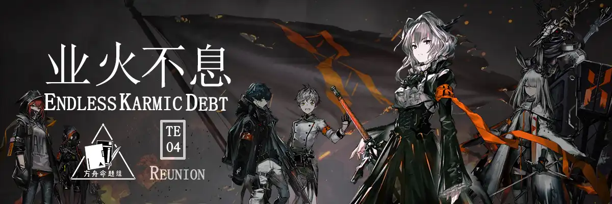
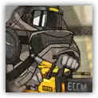
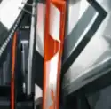
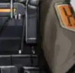
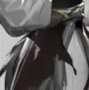
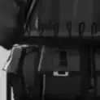

<!-- more -->

 {.centering}

即便是那位耀骑士{.centering}

她那如同灯塔般璀璨的心灵之火{.centering}

也不足以驱散笼罩整片大地的阴云{.centering}

不过，在这个充满苦难与仇恨的世界上{.centering}

依然有一批人在奋斗，在抗争{.centering}

在黑暗阴云的尽头{.centering}

依然有火花在闪耀{.centering}

——坎诺特·古德·英纳夫{style="text-align: right"}

【1】有一些罗德岛上的干员曾经是整合运动的成员。请问以下哪一个干员从来没有加入过整合运动？

|  |  |  |  |
| :---: | :---: | :---: | :---: |
| A.W | B.泥岩 | C.熔泉 | D.伊桑 |

【2】以下几个关于整合运动主要领袖早期经历的描述，错误的一项是

A. 梅菲斯特原名伊诺，儿时因为被强行在喉咙处塞入源石而被迫成为感染者

B. 霜星出生在乌萨斯偏远地区的矿场里，在她即将被杀害时，爱国者救下了她

C. 爱国者原名博卓卡斯替，出生于卡兹戴尔，后来成为了乌萨斯军队的一名上尉

D. 塔露拉在看清了科西切的真面目之后主动成为感染者，并杀死了科西切

【3】整合运动的领袖们并不只在主线关卡中出现，在一些干员的悖论模拟中也有他们的身影。以下哪一位干员的悖论模拟里没有整合运动的领袖出现？

A. 芬

B. 斯卡蒂

C. 雷蛇

D. 狮蝎

【4】你舟的重量体系一直都是一个谜。以下整合运动的领袖中，游戏里重量等级最大的是

|  |  |  |  |
| :---: | :---: | :---: | :---: |
| A. | B. | C. | D. |

【5】整合运动曾经也有着一段光辉的历史。以下关于整合运动的发展史，叙述不正确的一项是

A. 塔露拉在离开科西切之后来到了北方冻原，并和爱国者的游击队合流

B. 整合运动吸纳碎骨和弑君者的队伍是在“不死的黑蛇”觉醒之前的事情

C. 整合运动一度获得了特雷西斯的支持，赫德雷、伊内丝和W也加入过整合运动

D. 整合运动攻击切尔诺伯格是为了复仇，该城市对感染者的歧视非常严重

【6】仔细观察以下图片，属于整合运动领袖的一项是

|  |  |  |  |
| :---: | :---: | :---: | :---: |
| A. | B. | C. | D. |

【7】关于整合运动的组织宗旨，以下说法不正确的一项是

A. 整合运动是一个由受到压迫的感染者组成的组织，并且完全由感染者组成

B. 整合运动的目的是反抗非感染者及其政权，进而得到公正甚至更高的待遇

C. 虽然整合运动常用暴力手段解决问题，但其实质上是非军事化的组织

D. 整合运动尚未宣称建立政府，现阶段仍为民间组织

【8】在主线第八章的隐藏剧情EG-2中，一名盾卫在告诉迷迭香，只要她为了感染者的命运感到不公，就可以加入整合运动。这名盾卫的种族是

A. 佩洛

B. 萨卡兹

C. 菲林

D. 黎博利

【9】整合运动中，更多的还是默默无闻的普通人，但他们却有着不普通的故事。以下叙述中错误的一项是

A. 大鲍勃是泥岩的旧友，曾经在卡西米尔附近进行赏金猎人活动

B. 赫德雷在加入整合运动后，又来到了摄政王特雷西斯的阵营中获取情报

C. 雷德外号红刀，在拯救苏茜的行动中起到了关键作用

D. 九为了帮陈挡住源石炸弹而成为了感染者，离开近卫局后成为了陈的线人

【10】就算是整合运动，也有给各位博士们发狗粮的时候。关于在故事集《粉碎大地》和《叮咚作响》中提到的整合运动情侣加勒斯和依拉，说法错误的一项是

A. 他们初入荒原时，一名锈锤成员声称他们需要在荒原上存活一个月才有资格加入锈锤，并表示不会提供任何初始资源

B. 他们在尝试种植苔麦时，采用了骨粉催熟的方法，加速了苔麦的发芽

C. 虽然加勒斯的衣服上有整合运动的标志，但其实他是乌萨斯军队里的逃兵，曾经还是下士

D. 在新整合运动与锈锤交易的过程中，加勒斯和艾尔瓦相认，化解了矛盾。加勒斯还带来了依拉怀孕的消息

{style="float:left;max-width:20%;margin-right:1em"}

*扫一扫二维码查看本期答案*

[点我也可以哟ヾ(≧▽≦*)o](https://www.wjx.cn/vm/wNvI66o.aspx)<eod />

<Ads />