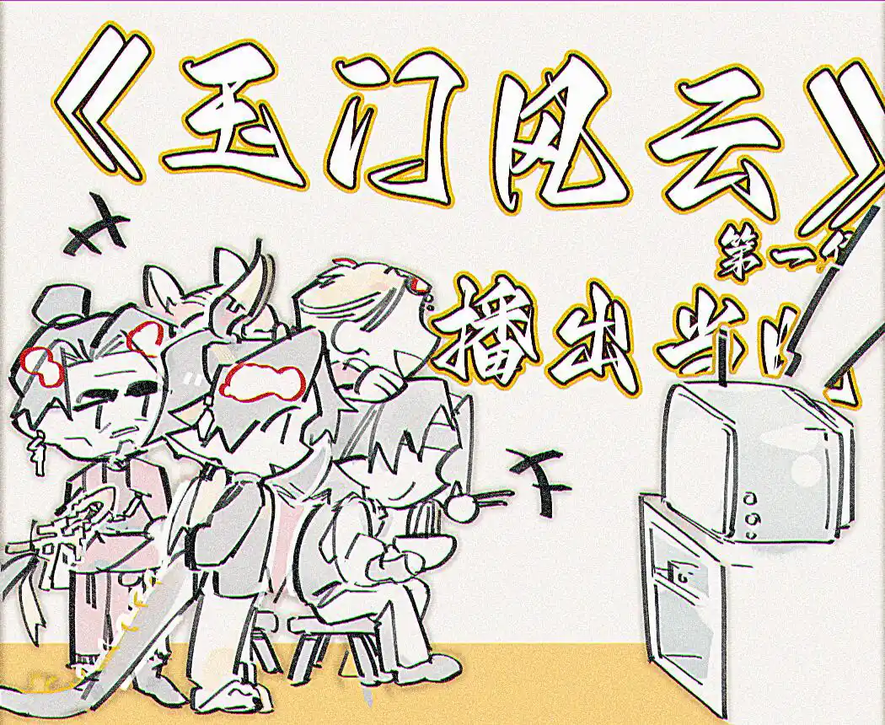

那时候他们还能聚于一堂，拿杯茶{.textkai}

看看兄弟们笑闹的不可开交的模样{.textkai}

<!-- more -->

剧本敲定好是五十年前抗击外敌的历史，自个儿当年的经历乃至角色要被改编拍电视剧了，大哥对此反应属一种习惯了的，挺好，就是对电视剧这种媒介感到新鲜。他几百年来被人写成话本编进诗词里排到戏台上演不外如是，其中弟弟妹妹和故人的手笔也少不了。一开始炎国朝廷以司岁台为首还在“警惕岁首碎片打感情牌”，后面也都放任那些故事情节流落民间传十传百。技术日新月异，这回头一遭是电视剧。

《玉门风云》投资人制片人导演一水儿的后台过硬，本身也有一层上面在扶持宣传的意思在，给予的资源重视少不了。拿到大哥真人肖像的使用允许，来对着参考定妆。

定妆照给本人鉴赏过目时，重岳点头：“很像了。”女侠先动，指着眉眼说我看不够像呐；左宣辽后发，评着姿势说确实还是不够火候。孟铁衣杵着点点头，一些远远直起脖子的官兵们也默默赞同，心想不怒自威差一点，和蔼劲儿更是差很多。重岳自己纳闷了：挺像的了，你们对演员和服化道要求好高。

老百姓没几个知道宗师实际长啥样，电视妆造拍还原了也就是知情人和军营官兵见得到大哥本人的满意这还原度，其余守待这剧播出的观众反馈平平，只从选角心想哦哦宗师角色找了个中年帅哥拍。

点评完了各忙各的去了。数月正式开机后剧组来到边远城市玉门也算有些城内轰动，尤其长期拍摄地的那间客栈，更是场地之外的街道上楼窗旁人头攒动，紧着看热闹。

军营自然纪律鲜明地依旧只管进行自个儿内部的训练执勤，两耳不闻窗外事。直到戏份拍摄安排到军营，底下官兵个个正色站岗，却也不少眼神瞅着空出来用作拍摄的最外围那片地，小演员有不怕事的，甚至跑来官兵面前仔细打量，研究他们如何站的如何交接，没一会儿被架走了。

有小演员更甚，乱窜迷了路。一边惶惶想着闯到军机重地会不会被灭口，一边偏就撞上了重岳。天色渐晚，黄昏火烧，互相的面目看不真切。小演员见了人，松口气，殊不知自己撞到的正是玉门最要紧的军机隐秘。没多想，就喊：“老师，今天都拍完了您还不卸妆换衣服啊？我迷路啦，要走回去捎上我呀！”

重岳愣了下，心里好笑，怎么这巧合让我撞上了？面上不动声色，怕音色不同露馅儿，板正地嗯了一声便溜开了，拉了个站岗的军官去给小演员领路，免得其又乱窜到什么地方当做贼子给抓起来，惹玉门守军和剧组麻烦。
然后日子就转到电视剧正式开播，铸剑坊整来一台电视，饭点后一帮草莽家伙蹲那机器前捣鼓城际网络讯号。

{style="float:right;max-width:45%;margin-left:1em"}

第一集起码是要看的，孟铁衣和江湖兄弟们先窝在这，女侠豪气地来了，顺带把正在军营忙着的重岳硬提溜过来；重岳来了，当监督的左宣辽便也必须跟着来了。剩下军营一帮兵该驻守驻守该巡逻巡逻，得空的去大厅也守着看电视，宗师和将军都不在，气氛也松懈。

转回铸剑坊，毕竟是黄金时段的播出剧，有的人饭吃得晚还没吃上，端着碗边吸溜面边盯荧幕。屋子自然是挺大的，奈何电视机不够大，来的人太多，

前前后后挨着凑一块，勾肩搭背，脚踩别人凳子边沿，下巴搁别人头上，硬生生把人按低一头，很是闹哄：这方说臭老鬼别挤我看不到画面了，那厢说特么别吃了油擦到我衣服上你赔。好似场外立马要跟电视剧里演的一样上演同步摔打。

宗师施施然站着在侧旁，只上身好奇地微向前探。边听他们拌嘴边看画面上另一个自己在款款演讲，只觉得屋里一切都蛮有意思的。

后面播出的集数倒不至于回回都能凑齐这么多人，宗师和将军自然还是很忙碌的，忙起来落了集数忘了看，迅速便被城里电视剧热播的气氛霸凌，在大伙儿边追更新边为哪位角色武功最上乘哪段剧情最精彩过人哪道机关设计最离谱脱离实际阮栖蝶究竟心意属谁争论不休时，聚一起插不上话还被频频剧透的两人自然总是冷落一旁，寂寞如雪地喝酒喝茶吃菜，料理干净大伙儿吵嘴仗没顾上的伙食，又寂寞如雪地双双提前离席，不结这桌子酒食钱。

《玉门风云》大受欢迎，一台播完了换个台再重播一遍，左宣辽不露声色，谁也不清楚他在何时竟补完了全集，后续在大伙儿经久不衰的讨论里时常忽然插入一句点评，迅速被卷进大肆的争论中。

这次起的话头是沈飞白和戚清秋究竟谁更优秀，人们为剧中笔墨最多的两位角色分成两派，颇有为自己偶像抛头颅洒热血的架势。重岳正在饮茶看电视重播，倏忽间不知谁强势嚎了一句格外嘹亮的：“最好的当然是宗师啊！谁能跟我们宗师比比！”

声浪停了一顿，继而此起彼伏地荡开一片赞同，至于是说剧里剧外的宗师，心照不宣。

孟铁衣站起来拍手力挺，又去拍重岳的肩，很自豪地：“宗师，你听听。”

重岳盯着电视里飞沙走石擂台上人影来回拆招，这段武打动作设计拍挺好的。他押一口茶，然后回答：“沈飞白挺好的。”虽然这声赞美只因这集这段儿刚好放到沈飞白的高光戏份，水分很大，无意站队，极其无辜。

不巧让众人听了去，声浪又顿了一拍，而后重新演回方才的激烈。只不过势均力敌的两派这会儿属沈飞白派站了上风，理直气壮自家有宗师撑腰。本站戚清秋派就为图个起哄乐子的，更是直接临阵倒戈。女侠不甘势弱，重新撸圆了袖子又上去力挺自己喜欢的角色，场面吵吵。

此刻私下什么聊天声音都难能听到了，左宣辽声音灌进来得耳朵都痛了，只用五官做表情，挪向再给自己沏了一盏新茶专心看电视的重岳大宗师，眼神颇不赞同地示意：喏，你瞧瞧。

“隔岸观火咯。”语气平常，任谁想不到这是德高望重的宗师本人轻松自在地吐出来的话。

没有党派所属的孟铁衣大笑起来，现场无酒，有了酒怕是不止口头上的争吵，当真要见血了。便捞过重岳也帮他添的一杯茶，不爱喝，只是拿着，乐颠颠欣赏自己这帮兄弟们撕得不可开交的热闹样儿。<eod />

（责任编辑：瑶濯；网页排版：武乙凌薇；绘图：子莜）

<Ads />