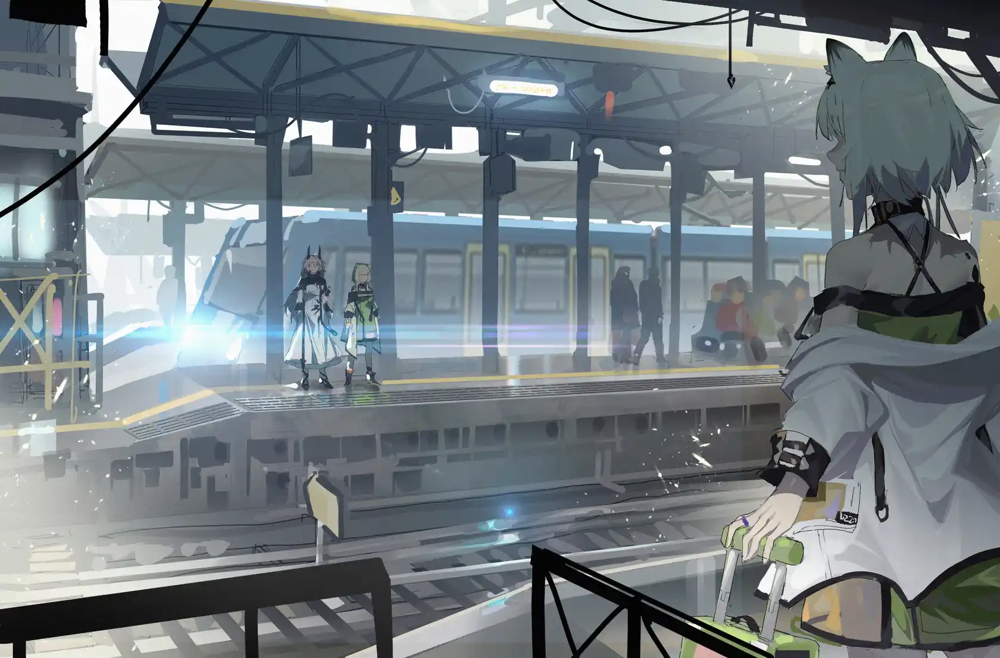

火车来了又去，承载着沉没的梦{.textkai}

从一片废墟驶向另一片荒原{.textkai}

而我在月台上竖起流动的纪念碑{.textkai}

做着自己被关进笼子，悬在库米城上的梦{.textkai}

<!-- more -->

“看来，他要付出高昂的代价。他写书挣了很多稿费，那个孩子说。她重复着那个死去孩子的话。他们没有说出的话就是：作为还报，他不得不交出自己的灵魂。” {.textkai}

——J.M.库切《彼得堡的大师》 {style="text-align: right"}

# 一.崇高的客体 ...

## 0.

那场近似永恒的折磨，起始于无数个日出以前，连历法都尚未出现的长夜。

## 1.

“凯尔希，你还记得自己出生时的感觉吗？”一天夜里，在罗德岛的甲板上，她突然问我。

这是在内战开始后的第七个年头。不久以前，大女妖宣布不再支持特蕾西娅。只是做做样子而已，从半年前起我们就再未得到女妖的支援。

“我记不得了。”我说。

“那……你最初的记忆是什么？”

“也记不得了。”这句话没有半分虚假。我们的大脑相当精妙，能够承载远超常人寿命的记忆，但它仍有极限。假如时间拉得太长，记忆也会出错。从日落到日出的时间段里，每天都会有一小点记忆流失。先是声音，然后是言语，触感，目光，情感，最后气味也消失于无形。我从不知道失去的是哪一段记忆，余下的部分会重新整合，拼凑成型，试图让自己显得真实，但总有些细节会显出虚幻的影子。萨尔贡的王酋说着乌萨斯的语言，维多利亚的贵族指控着拉特兰的教条，某位菲林的名字被夺走，安到另一个德拉克身上。有太多记忆在脑海中茫然一片，每一个都宣称自己是我最初的经历，塑造了我的本质。而我甚至无法判断这些事是否真实发生过。

“可我能记得。”她靠在椅背上，向夜空伸出手。我记得一个人说过，那里有七千八百八十二颗星星。

“还不知道自己是谁时，我漂浮在一片无色的海上。有许多人俯视着我，向我讲述他们的故事。”

“那是前代的魔王。”

“啊，古老的仪式，我有所耳闻。他们只在梦里对我讲述，醒来后我就会忘记，真是可惜。我知道那都是些好故事。”

“你是怎么知道的？”我知道的故事有所不同。我知道要从萨卡兹的历史中找出好故事，并不容易。

她把手叠放在桌上，闭眼微笑，“我会笑着醒来。”

## 2.

醒来时，桌上放着一罐咖啡。

现在是下午二点十二分，我睡了半个小时。咖啡罐仍是温热的，放下它的人一定刚离开不久。这是自动贩卖机里最常见的那种咖啡，廉价的砂糖，廉价的奶粉，廉价的咖啡粉，还有为了让它们不迅速腐败而添加的化学品——这些东西混合起来，会创造出一种黏糊恶心的口感，附着在喉咙处，使人不得不保持清醒。从这个角度看，它确实起到了咖啡的作用。

我把空罐丢进垃圾桶，想要弄清是谁送来了这罐咖啡。这时，她捧着一叠文件走进房间。

“凯尔希医生，下午好！”

“下午好，阿米娅。这些是？”

“龙门的矿石病抑制剂采购合同，我和博士都已经看过了，但还是希望您能看一下。”

“出了什么问题？”

“按这份协议来算，龙门为抑制剂开出的价格，比市场价还贵不少。会不会是写错了？”

“直接同意吧。”我说。

“没关系吗？”

“我不认为魏彦吾会犯这种低级错误。”

她咬着笔杆思考，“您的意思是，魏彦吾先生故意提议了更高的价格……可为什么？”

“比起给予善意，有些人更害怕表达善意。魏彦吾认为，龙门对罗德岛有所亏欠。但他不愿明说，才选择以这种方式弥补。”

“我明白了。谢谢凯尔希医生，我会假装不知道的。”

“不过，倒可以把这事告诉陈警官。”我把食指放到唇间，“当然，得悄悄地说。”

她嘿嘿地笑着，“我会的。”

有很久没见她这样笑过了？

“对了，阿米娅，能陪我去一个地方吗？”

## 3.

“能陪我下去走走吗？”过了许久，她问。

“要去哪里？”

“我想去营地探望战士们。”

“稍等一下，我去联系护卫队。”

“不用了，我信任他们。”她走到甲板边缘，把手搭在护栏上。百米之下，数十个营帐排成方格，几堆篝火隐隐发亮。她眯起眼，“他们为巴别塔付出许多，我却无法回报什么，如果连信任都做不到……”

“保持谨慎总没错。你也清楚特雷西斯的手段，万一营地里有刺客潜伏——”

“我也信任你。”

我不知她是否能听见我的叹气，“务必小心，特蕾西娅。”

我们走下甲板。夜晚九点，罗德岛仍未入眠。会议室大门敞开，屏幕上显示着卡兹戴尔的地图，红点撕咬着所剩无几的蓝色。几位干员站在地图前交谈，Scout是其中之一。他拿着档案向我们走来。

“殿下，博士又赢了。篡位者的军队已从赤沙城撤退。”他汇报道。

“伤亡情况如何？”

“五百人左右。”

以五百人的代价守住一座城市，依旧是难以想象的胜利，但Scout的声音里听不见欣喜。

“敌方呢？有多少特雷西斯的士兵死去了？”她问。

“这……抱歉，我不清楚。”

“谢谢。”她对Scout微笑，“早点休息吧。”

我们再次向下走。鞋跟敲打在金属阶梯上，响声清脆。快抵达底层时，她忽然停下脚步。

“凯尔希，你还记不记得我说过一句话？”

“哪一句？”

“没有一个萨卡兹……没有一个人，应当白白死去。”

“说完这句话后，你去救了一队萨卡兹佣兵。”我说。

“是我们去救了。赫德雷，伊内丝，还有W……那孩子连名字都没有。现在，也只有她还留在巴别塔。”

“他们终究是佣兵，有权选择战场在何处，又为谁而战。但我坚信，他们不会站到你的对立面。”

“但，其他佣兵呢？比如说，依兄长的命令进攻狮城的那些？又或者我们为了救下赫德雷小队而杀死的那些？每次战斗后倒在地上，试图把肠腔塞回腹中的那些？他们是白白死去的吗？”

我没有回答。我可以给出很多理由，告诉她我们的事业是正确的，伟大的理想必须经由牺牲方能实现，如果不这样做，会有更多人死去——这些话我在过去重复过无数次，此时却再说不出口。

我把手搭在她肩上，等到她呼吸平复。

“谢谢。”她说。

## 4.

“谢谢你的咖啡。”走出办公室后，我告诉她。

她歪了歪头，“什么咖啡？”

“我桌上的那罐咖啡。难道不是你放的吗？”

“不是呢。可能是博士？她之前好像有找过你。”

“嗯。”

“凯尔希医生，您是不是……讨厌博士？”

“为什么会这样想？”

“只是一种感觉。”她低下头，“每次提起博士时，您好像总希望话题早些结束。伊西斯博士也是，上午我想让她来找您，她看起来害怕得不得了……能告诉我为什么吗？”

“因为她做了很过分的事。”

“什么样的事？”

“前天，她偷吃了迷迭香的点心。”

“欸？”

“昨天，她诱惑伊芙利特吃碳烤沙虫腿，麻辣味，对孩子的身体不好。”

她撅起嘴，“这可不行，我得去劝劝博士。”

“没错，越早越好。”

“但……凯尔希医生。”她抬头看我，“真的就只是因为这个吗？”

二月的阳光从落地窗斜射而入，那是种柔和的暖意，仿佛能从人身上剥下一层羽毛。

“你长大了。”我说。

她的微笑有些悲伤，发梢在蓝色的瞳孔里打下阴影，“还不够大。”

我带她一路往下，抵达罗德岛的底层。这里被工业车间和发电室填满，能听见源石引擎运作的轰鸣，就像巨兽的心跳。

“我们要去哪？”她问。

“档案室。”

“但档案室在五层吧。”

“是另一间档案室，巴别塔的档案室。”

她没再说什么。

巴别塔坍塌时，阿米娅还小，会问特蕾西娅去了哪，博士又在哪，我们要往哪走。她不停地问，我给不出答案，直到有一天她不再提问。自那以后，不提巴别塔的事成了一种默契，不仅在我与她之间，也在整个罗德岛上。巴别塔成了一个漂浮不定的幽灵，诉说着关于失败和苦难的故事。每个人都竭力遗忘，又无法做到。

档案室在两间空仓库中间的地方，用一扇锈迹斑斑的铁门遮挡。室内昏暗阴冷，放满档案的书架沉默地伫立。房间的尽头是另一扇未上锁的小门。打开时，它以轴承的嘎吱声表示欢迎。

“这里记录着巴别塔的结束。”我说。

## 5.

我见证过很多战争的结束，通常是站在失败的那方。彻底战败前的一段时间，营地会散发一种独特的气味。血和脓水的臭气盖过消毒液，被每一声呻吟放大，顺着烟雾扩散，就好像一个尚未死去就已开始腐败的人。

眼前的军营飘着同样的味道，特蕾西娅一定也能闻见。她顿了一下，径直向营地内走去。一位军官坐在木桩上抽烟，见到特蕾西娅，他立刻起身，用鞋跟踩灭香烟。

“殿下？我没有接到通知——”

“没关系，我只是想来看看。”她挥挥手，示意军官不必行礼。

从帐篷里传来凄厉的哭喊。半分钟后，两位医生拿着一截枯朽的黑色木头走出来，我花了些时间才意识到那是人的手臂。

“从赤沙城撤回的伤员。”军官皱着眉说，“中了血魔的法术，被抽走一部分血液。四肢得不到足够的供给，慢慢枯萎发黑。我们考虑过输血，但血库已经被掏空了，只能截肢，就连麻药也上不满。”

“我能进去探望吗？”

“殿下想做什么都可以，但还是给他留些时间单独休息为好。我可以带您去见其他人。”

她点头的幅度很小，“麻烦你了。”

在最大的帐篷里，有几个人还能维持站姿，有更多人向她敬礼——无论是站着，还是躺在病床上，或举着断了一半的手掌。她张开嘴，像是要说什么，终究是什么都没说。她走在病床间，许多人向她伸出手，她一一予以回握，叫出他们的名字，对他们轻声言语。我不知她是否使用了魔王的力量，分担他们的痛苦。我知道她不愿这样做。

角落里的几台机器吸引了我的注意力。一个破碎的躯体躺在床上，眼睛被纱布包裹，腹部的伤口深可见骨。几根塑料管插进胸膛，从体内抽出黑色的液体。

“他拖延了赦罪师整整半分钟，就他一个人。”军官吸了口气，“看到赦罪师拔剑，眼睛是保不住了。”

不只是眼睛。他活不了多久，重要的脏器都被毁坏，体外循环只能延长痛苦，而无法使他复活。

“嗬，别……这么说。是我们整个小队挡住的。”他干咳着发笑，软管里出现细小的气泡。特蕾西娅弯下腰，包住他沾满血污的手。

“殿下？”他的声音开始颤抖，“是您吗？”

“是我。”

“哈……面对赦罪师的时候，我还以为这辈子都看不见光了。”

她瞥着病床旁的号牌，“瓦尔哈，告诉我……你想要看见什么吗？”

“很多东西，殿下。我想再看到小队的弟兄们，想再摸摸莱塔尼亚的管风琴，也想看看三百年前的卡兹戴尔，我听说，那时这片土地上还有很多鲜花。”

“只要你愿意，我可以为你展示这一切。”

“我……不。”他摇着头，“您不喜欢幻觉，我知道。不要为我破例。”

“那，我能做什么？”她问。

瓦尔哈的眉毛拧成一团。嗡鸣声响起，仪器上的红灯一闪一暗，仿佛生命的倒计时，一点一点地把他向死亡的土壤推去。医生带着医疗器械走来，我用眼神阻止他。他做不了什么。

“我能做什么？”她问。

“就……告诉我一件事，殿下。”

“我一定说。”

“我们能赢吗？”他问。

“您许诺过萨卡兹的自由。您说发动这场战争，不是为了权力或地位，而是要让萨卡兹不再被人敌视……告诉我，它能实现吗？”他问。

“殿下？”他问。

红灯不再发亮。我放下手。医生们走近，关闭机器，拔下管线。黑血淌到地上，沿细微的裂缝扩散开去。

我想，只有我听见了特蕾西娅的答案。

她说：我不知道。

一股不太好的味道涌了出来。即使再英勇的人，临死时也会失禁。对我来说这并不是什么陌生的事。我看到她仍握着死者的手，浸在粪便的气味中，一动不动。

很久以前，我遇见过一个乡间医生。总是提着大得吓人的箱子，穿着沾满泥巴的靴子，乐呵呵地走在路上，时不时拿出酒壶喝两口，酒会顺着乱蓬蓬的胡子往下流。他邀请过我一起旅行，我拒绝了，没有同意的理由。

再次见面是十几年以后，莱塔尼亚的野战医院。他依旧带着大箱子，穿了一只靴子，另一只脚被换成木棒。他跪在病床旁，握着伤员的手，病床的下半部分被润湿成棕褐色。

很久以后，他才注意到我。有那么一会儿他只是看着我，没有表示惊讶，只有厌恶和怜悯的混合。我注意到，他的胡子已经白得差不多了。

“你还得活很久，对不对？”他问。

我没有回答。

他不再看我，以极缓慢的脚步向外走。穿靴子那边的肩上挎着箱子，另一只木腿在地板上拖动，声音刺耳无比。那之后，我再也没有见到他。他大概是死了。那个时代的每个人，以及过去和未来的无数人，差不多都是这样消失的。

# 二.历史的谱系 ...

”往后这一星期、一个月、一年，我们会遇见许多孑然孤零的人。等他们问我们在做什么，你们可以说：我们在记忆，这样我们才终究能获胜。”

——雷.布拉德伯里《华氏451度》{style="text-align: right"}

## 6.

第一次见到博士，是在罗德岛的会议室。

“你好，凯尔希。”

我很少在初次见面时就对一个人心生厌恶，她是个例外。这甚至不是因为她用面罩隐藏了自己的外貌，或者她标准得近乎机械的声音，或者她摆弄象棋的姿势。她用食指轻弹着白皇后，又在它彻底倾倒前扶住，放回原位。她有一双手，学者的手，读书人的手，皮肤白皙，包裹着小巧的骨节，淡青的血管若隐若现。它们可曾轻抚某人的脖颈？它们是否能施加足够的力量，用来卡住气管，挤出氧分，使人在窒息中缓缓死去？她是否会注视着他们的眼睛眯起又睁大，直至血丝遍布?

她会的。回到卡兹戴尔的途中，那些吊在树上的枯骨如是说。我回来得太晚又太早，内战已持续了半年。

“来一局吗？我听说你棋艺高超。”她问。

“不必特地做装出讨人厌的模样。”

她点点头，停下动作，“你还是不爱开玩笑。”

“我有见过你吗？”

“没有，但我记得你。多年以前，你讲过一个好故事。”

我开始厌恶她谜语般的措辞，“什么故事？”

“莎草纸上的迷宫。”她说。

她差点就抓到我了。在往事的陷阱里，有一座迷宫静静矗立。

“我从未像那样看待世界。”我告诉她。

“我们都是如此。人终有一死，他们活得并不幸福，迷宫从未有过出路。假如你是个聪明人的同时，又想继续生活在这个世界上，就必须欺骗自己，或者为它辩护。我更倾向于后者，即使代价高昂。”她身体前倾，向我伸出手，“我不是你的敌人，凯尔希。”

她会对死去的人说同样的话吗？我不是你的敌人？

“她说，你自称博士。”

“我是。”

“哪一个博士？治愈者，还是博学者？”

“都是。”

我握住她的手，“我会保证这一点。”

“你握过很多次手术刀。”她笑着说，“不容易。”

我点点头，没再说什么。两年后，特蕾西娅死去的那个夜晚，这双手将掐住她的脖颈，直到最后一刻。

## 7.

门后是一间空旷的房间，因无人造访而落满灰尘。在罗德岛的其他地方，这里仍是下午，此处则已被夜幕笼罩。黯淡的光从房间顶端落下，洒在一块石碑上。一块灰色的花岗岩，表面刻着无数划痕。其中有些曾经涂抹着鲜艳的颜料，如今只留下苍白印记。那是由各种语言留下的记录：维多利亚语，古提卡兹语，莱塔尼亚语。一个字，几个字，一个短句，重重叠叠，交织成一张细网。阿米娅伸出手，擦过一道又一道痕迹，好像在与刻下它们的人交谈。

“这些都是……名字。”

“是战士们的名字。”战士是个比干员更古老的概念，干员会选择替代名字的代号，战士却不必如此。它的意涵更为直白：战斗，杀人，直至死亡。

“那些为巴别塔付出生命的战士，他们的坟冢留在卡兹戴尔，但他们的名字被铭刻在这座石碑上，随罗德岛一同航行。”

“拉瑞克。”她念出第一个名字。

“他是来自米诺斯的丰蹄。既是坚毅的盾卫，也是虔诚的信徒，优秀的乐手。每天夜里他都会坐在甲板上拨弄竖琴，弹奏故乡的音乐。他死于哀叹谷。三支弩箭从他背后射入，穿透胸膛。他的战友把竖琴与他一同埋葬。”

“克鲁兹。”

“年迈的赦罪师，知晓自己无法再次挥剑后离开前线，担任指挥官。他的最后一场战役是在赤砂城，率领部下抵御了五倍于己的大军进攻。他的遗体被掩埋在废墟下，手中仍握着从敌人处抢来的长剑。”

努门，塔尔萨，维兰德……她读出名字，我讲述他们如何死去。离开切城后，我进行过一次广播，宣读阵亡干员的名单，此时此刻我感受到与当时别无二致的惶恐。这会是一种亵渎吗？把那些曾真正地度过几十年生命的人，变成几条特征，几场战役，几道伤疤，失去气息的肺叶，看不见未来的眼睛，在几分钟里诞生又熄灭？我一向好奇在史书中有多少鲜活的细节会被剥夺，那些记录历史的人又是怀着怎样的心情去说谎，从记录中剔除火焰的热度，亲吻死去爱人时的寒意？或忍住这样一种欲望，那就是不再把历史抽干水分，装进真空袋里与世隔绝，而是写关于自己的故事，关于自己在荒原上飞奔，双手向外伸展，好像能把砂土的气味抓在手中，紧紧握住直到死亡前的最后一刻，并知晓这样一个瞬间抵得过在与世隔绝的荒岛上度过的一百年，一千年？这会是什么样的滋味？

“圣伯多……凯尔希医生？”

圣骏堡，一位丧子的父亲坐在书桌边。他摊开纸，拿起笔，开始写字。飓风抹去了他的世界，但他毫不在意。他看着蜘蛛在墙上爬，并感激它在爬。

现在，他要说话，他要逼迫上帝开口。

现在，我开始尝试那种滋味了。那种滋味如同苦胆。

## 8.

“卡兹戴尔有过花吗？”

这是回到罗德岛后，特蕾西娅说的第一句话。

“很久以前有过。”我告诉她。

“我不记得。”

“矢车菊，石竹，百日草。都是些性子坚毅的植物。”

还有罂粟。艳丽的死，一盏鲜红的灯笼，绽放在沙地里，熄灭后留下青色的气球。割开外壳，乳白浆液涓涓流出，可用于止痛。我们本该止步于此。

“但魔王的记忆中容不下花。卡兹戴尔的土地不适合耕种，萨卡兹也与艺术无缘。”

她又错了。卡兹戴尔首次重建时，举办过一次盛大的宴席。没有羽管键琴，提琴，或长号，取而代之的是刀叉和人声。尘灰摧残过大部分人的嗓子，他们的声音沙哑无比。然而他们歌唱，击打着锅碗瓢盆，木桌，酒杯，中空的骨头，唱得像汹涌浪潮中的水手。那时，他们的确坚信卡兹戴尔将永远屹立。

“卡兹戴尔的田地是用铁靴来犁，卡兹戴尔的田地播种着萨卡兹的头颅。”她闭上眼，轻轻歌唱，“覆沙的峡谷间孤儿遍地，干涸的河床是爹娘的眼泪。”

“在乌萨斯，有人唱过类似的歌。”我听过不止一次。哥萨克人，永远高傲，也永远一无所有。

但他们有一条河。一条能包容一切，洗去一切的河，泥沙滚滚，不停奔涌。

“他们有一个帝国，乌萨斯属于乌萨斯人，属于长着圆耳的人们。但从未有过一个种族，能像萨卡兹这样分化出十余个支系。不同的外貌，传统，习俗……在被其他人敌视以前，我们已经撕裂自己。在古萨卡兹语中，甚至找不到形容和平的词语。六座王庭，有多少认为自己首先是萨卡兹，然后才是血魔，温迪戈，或女妖？恐怕唯有一点是相通的：我们是受诅的血脉。”

“我之前告诉过你同样的话，除了最后一句。”

“最后一句话，是他们告诉我的。”

“历代的魔王？”

她点点头，“魔王们。”

“这不是真相。我们的诞生并非经由诸神之手，更不存在所谓的诅咒。”

“那为什么我们总是失败？每代魔王都自以为能从前人的失败中成长，成就前人无法成就的事业。他们都没能做到。”

“失败并不意味着结束。”我说，“未能实现的统一之梦会成为理想，延续给下一代。”

她转过身看向我，“凯尔希……在你的生命中，有没有遇到过一个，哪怕一个，纯粹为理想而生活，为理想而死的人？”

在她身后，一个耀眼的物体拖拽着尾焰划破夜幕，坠入峡谷。那里也许有一个据点，一座炮兵营地，但也可能只是一座村庄。爆炸的光亮照亮她的侧脸。直到光芒散去，轰隆的响声才抵达耳边。

“从来都没有。”我告诉她。

“我也一样。”她一如既往地微笑，苍白的脸上没有血色，如同一个被铳械击中的士兵努力堵住枪伤，看着鲜血从指缝溢出，逐渐听不见炮声，闻不到硝烟，感受不到温度，清醒地意识到做什么都无济于事，“我也是一样。”

“你已向一部分萨卡兹证明了和平的可能性。萨卡兹与萨卡兹，萨卡兹与外族人。”

“通过杀死另一部分萨卡兹来证明。”她靠到墙边，双手抱胸，两只手扯着另一只胳膊的衣袖。她还是第一次摆出这种姿势，“每一代魔王都如此设想过：为了使萨卡兹的孩子生活在同一片干净的天空下，战争和牺牲难以避免。然而，萨卡兹始终在重复同样的命运：分裂和血战。每次重建卡兹戴尔的奢望，都将以更多人的死告终。我们好像被困在一座迷宫里，徘徊千年，从未找到出口。”

“我听过一个故事。”我说。

她轻轻侧头。我给她讲过许多故事，我还不知道这会是最后一个。如果知道了，我会把真实的故事告诉她吗？

“很久以前……”就像每个故事一样，它的作者是“很久以前”。

“很久以前，在米诺斯，有一位女人去拜访贤者，追寻事物的答案。贤者用莎草纸画了一座迷宫，告诉她：只要走出迷宫，就能得到答案。那个炎热的下午，她蹲坐在墙边，尝试了一条又一条路径。可每条路的尽头都已被封死。”

“后来呢？”

“……后来，那位女人灵机一动，把莎草纸剪开，创造出一条本不存在的路径。”

“像是你会做的事。”她说。

“我是在——”

“我明白的，你总爱说你在讲故事。只要一个人活得够久，她就会有许许多多故事可以讲。我还记得你说过那位被命运戏耍，最后落得众叛亲离的王子，以及那位被元老院驱逐的将军，那位自愿走上火刑架的主教……他们都曾出现在你的生命里。”她嘴角上翘，声音里有一丝得意，“我说对了吗？”

我点点头。

“总有一天，我也会变成这些故事中的一个。我很难想象你会怎样讲述我，在尘埃落定后。”

“萨卡兹的女王。诞生于战火纷乱的年代，带领大军击退外族入侵，最后统一卡兹戴尔，为萨卡兹——这个常年陷于战争泥沼中的种族——带来和平。”

“不，那将是个很糟糕的故事。”她闭眼思考了一会儿，“你我都知道，它不可能是真的。”

我拒绝听懂她的暗示，“这不像你。”

“那我该是什么样呢？萨卡兹理想的化身，千古唯一的圣人，手不沾血的无罪女王，没有私欲，从不犹豫地向前走，永远知道自己所做的事，自己的理想，自己的事业，都无比正确？”她语调平静，呼吸平缓，仿佛在谈及一个与自己完全无关的人。片刻过后，她抓紧护栏，视线飘向远方，“你看，我偶尔也会想像现在这样，生一次气。我偶尔会想剖开自己的身体，找找特蕾西娅究竟在哪里：是在我的血液里，我的血脉里，还是在你的故事里，马尔科的记忆里，每个萨卡兹的言语里，未来历史书上的一小段文字，一尊由白雪塑成的，应当在卡兹戴尔的日光下融化的雕像？又或者，特蕾西娅是个早夭的婴儿，在她睁开眼睛的第一刻，黑冠便夺走她的呼吸。活下来的是萨卡兹人的魔王，而不是特蕾西娅。”

“但你就在这里，此时此地。不是任何其他人，只是特蕾西娅。”说出这句话时，我才意识到它有多么无力。诡辩是一门我不愿学会而已经掌握的艺术。

罗德岛下方，营帐的灯光一排排地熄灭。夏季的闷热会让伤口难以愈合，无数伤员只能在黑暗中咬牙忍耐。

“你该去休息了。”我说。失败的苦涩味道在舌间挥之不去。

“谢谢。”她把手抽离栏杆，打开楼梯间的门。

“如果你一定要讲述我的故事，我希望这样开始。”她握着门把手，转头看向我，“一个孩子，奔跑在峡谷间的旷野上。她跑得飞快，呼吸急促，双脚在坚实的土地上踩得生疼。她不知自己为何奔跑，不知还有其他人活着，不知自己活在一个多么复杂的世界上。她只知道自己可以飞奔。”

“这是什么？”我问。

“一段记忆，再普通不过的记忆。但我会回到它身边，一次又一次。在我清醒的梦中，魔王们向我讲述卡兹戴尔的历史；在我朦胧的梦中，我梦见魔王们的记忆。有趣的是，即使本该美好的事物，透过回忆去看，也会显得无比哀伤。我记不住马尔杜克怎样邂逅他的爱人，但当他亲吻死去妻子的嘴唇时，我能感受到同样的冰凉；我记不住卡兹戴尔的重建，但当它被威齐洛波契特里的野心烧尽时，我仿佛就站在现场……这些记忆织成梦境的罗网，有时我并不想陷入其中。”

“如果你不希望再做这些梦，我可以帮上忙。”有很多种药物能使人无梦地安眠，而且全然无害。

她轻轻摇头，“在梦的尾声，我总会回到那片荒野，双手自由地向外伸展，好像能把砂土的气味抓在手心，直到永远。事到如今，我已不知道这段记忆属于谁：是我自己呢，还是从前的魔王，或者某个说不上名字的萨卡兹？这或许不那么重要。重要的是，正是因为这不起眼的片刻，我才能笑着醒来。”

我看到的不再是特蕾西娅，而是那个夭折的婴儿：没有名字，没有受洗礼，连啼哭声都发不出。一片黑色的，半透明的阴影，附着在魔王身上。

她朝我点头，“晚安，凯尔希。”

“特蕾西娅。”我说。

“嗯？”

“明天见。”

“嗯，明天见。”

你看，我也会将这两个身份割裂开来。对我来说这是一种习惯。我扮演过太多身份：医生，学者，教师。我把它们戴在身上，像是寄居蟹不停地寻找新壳，把自己活成面目全非的模样。我从未因此感到困扰。

只是……偶尔，在褪下一层甲壳的短暂空隙里，我无法假装自己没有深陷迷宫。

## 9.

最后一次见到博士，是在什么时候？

我一直以为那是在特蕾西娅死去的当天，但我记错了，那是更久以前的事。

特蕾西娅死后，我忙了很多天。首先是处刑。她说过没有一个萨卡兹应该白白死去，我没有听。Mon3tr的爪子上从未沾染过如此之多的鲜血，萨卡兹的血。但这没什么用。我们输了，输得彻底。然后我命令罗德岛离开卡兹戴尔。如果不这样做，所有人都会死。有很多人离开，其中一部分太过恋旧，甚至在离开前还告知我一声。我尽力为他们安排些什么：物质上的，或精神层面的。有些人离开时仍握着武器，指节陷在金属里，被压得青白。他们显然是回去送死，我没有制止。

然后，在这一切都结束后，我回到自己的房间。舷窗外，卡兹戴尔的黑墙依然矗立，但此时也不过是地平线上的一点污渍。墙上挂着一张照片，是阿米娅拍的。有我，特蕾西娅，和博士。

我看了它半分钟，锁住房门，关上灯，躺上床，睡觉。

百年以来第一次，我做了梦。

年轻时，她听说西边的城市里有位贤者，通晓万事万物，便前去拜访。一个戴着兜帽的老人坐在一堆干草上，身边点着熏香，好驱散浓郁的体味。那是个人们还不习惯洗澡的时代。她走到他跟前，一言不发。她听说贤者无需借助言语，便可判断一个人为何而来。他用芦苇笔在莎草纸上画了一座迷宫，交到她手中。那个炎热的下午，她靠在墙边，顺着迷宫中心向外，沿着赭石颜料涂抹的狭窄曲线，寻找一条逃离的路径。

“这迷宫根本就没有出路。”几个小时后，她告诉贤者。

这是她当时的语气吗？我记得，她应该更生气一些。她是不是带着沮丧和恼恨，把莎草纸揉成一团，丢到他脚边?Mon3tr当时也在吗？它是什么反应？它一向对等待没什么耐心。不对，认识它是更久以后的事，一个世纪后，在赞巴拉的废墟上。那是老伊辛？是了，我现在才意识到，老伊辛是把自己误认为那位贤者，那位在年老体衰之时终于感受到恐惧的贤者。那不是对死亡的恐惧，而是对于死亡后必然的遗忘。最后，他去见了梦魇。带我逃离尘世，我将以智慧打开黄金之城的大门。让我们分享财富和荣光，使这场远征为万世铭记——他有没有这样告诉过梦魇，在我离开之后？他们没有成功。在梦魇的指引下，整支大军从悬崖边落下，坠进大海。那里能吞噬万物。贤者也在其列吗？最后的时刻，他梦见黄金之城了吗？

她不知道。她不记得。她忘记了太多，太多。

但我仍记得贤者的回答。莎草纸落地时，老人轻笑起来。

“你为什么觉得，一定会有条出路？”他问。

“一派胡言。”我听见她说。她离开了。年轻人都是这样，只要听见自己害怕成真的事，首先会去否定它。

“你是对的。”我听见我说，对这位我已经忘记名字，并且想必早就死去的老人，“从无数个日出以前，连历法都尚未出现的长夜开始，我就被困在同一座迷宫里，寻找逃离的路径。”

“你成功了吗？”他问。

“我失败了太多次。第一次，我试着阻止兄长杀死弟弟。最后一次，我试着阻止兄长杀死妹妹。也许从一开始就没有区别，血亲相残是我们的本性。”

“还会有很多次。”这是个更年轻的声音，它的主人曾行走在旷野间，拒绝魔鬼的诱惑，“罪孽是洗不掉的。”

“还会持续多久？”

“我们将点燃这样一支蜡烛，一支我坚信绝不会被熄灭的蜡烛。”在走上火刑架前，一个人这样对我说。他相信自己的思想将永生不朽，他错了。如今没有人记得他的名字。

“我能走出去吗？”

“我不在乎结果如何：我们反抗，仅此而已。”那个为卡兹戴尔命名的人告诉过我。但他的卡兹戴尔早已毁于烈焰，如今余留的不过是一个名字，一片焦土，和一段关于自由的梦想。

“我能得到什么？”

“即使如此多灾多难，我的高龄和我灵魂的高贵仍使我相信一切皆善。”那个被命运戏弄的王族告诉过我。在人生的尽头他已失去视觉和听觉，是什么支撑着他说出这么傲慢的话？

“我必须走下去吗？”

“凯尔希，凯尔希……”

于是我再一次听见她的声音，“还没有结束。”

“你不会明白的。你怎么能明白？我从未告诉过你全部的真相。我告诉过你这片大地的事，穹顶的事，群星的事。我告诉过你我们的种族如何诞生，我告诉过你在我们之前曾有另一个时代，另一个种族，巍峨如山却逃不过时间的陷阱，我告诉过你世界运行时会发出巨大的声响，而我们对此充耳不闻，因为我们自诞生的那一刻便学会了与之共处。我知道你把这些全部记在心里，但我从未告诉过你，千年以来发生了什么。”

我背靠土墙坐下，烈日把墙面晒得滚烫，“但我都能听见，特蕾西娅。失败的声音，悔恨的声音，死亡的声音，一个从未走出迷宫的人不该知道这些。历史总是在重复自身，长矛刺进胸膛，石块砸碎颅骨，生者剥下死者的皮肤披在身上，装饰成崇高的形象，或是赤着脚，或是穿上皮鞋，坐进汽车，登上移动城市，年复一年，如同迷失在鱼缸里的灵魂，在这片大地上无休止地游荡，走过前人走过无数次的道路。最后能找到什么？亘古不变的恐惧。”

“但我希望——”

“希望从来都没有用处，特蕾西娅。”

我从梦中苏醒，眼前是熟悉的天花板。特蕾西娅死了，七天以前。

直到那时，我才有了去找博士的想法。

## 10.

“凯尔希医生？”

圣骏堡的幻象不再，鬼魂回到石碑中去，魔王拽住我的衣袖。

“抱歉，继续吧。”

“您需要休息一下吗？”

“不用。”

于是这场仪式继续下去。我们谈起了赛瑞昂，身穿蒸汽铠甲的他风华绝代，甚至使前来考察的女记者为之倾倒；我们谈起了布莱克，笑话大师，能在最不合时宜的时机使人发笑。我们谈起了兰德，在阿米娅的印象中他是曾给她带糖吃的老爷爷……

“奥古斯汀。”

最后一个名字。

“萨卡兹人。他使用铳械的技巧无人能敌，直到被赦罪师砍断手指。特蕾西娅死后，他离开巴别塔，在荒野间游荡，干渴而死。”

我仍能记起他告别时的样子：一个疲惫的瘦长鬼影，扛着比他肩膀更宽的行李，告诉我他打了一场无谓的仗，告诉我他要回家，他的父母还在等他回家。

“他是在这块石碑上留下名字的最后死者。然而，这座石碑记载的不只是卡兹戴尔内战，而是为了纪念每一个走进巴别塔的人。”

我拿出两把刻刀，把其中一把交给阿米娅。

“ACE和Scout，是为了他们吧。”

“根据两人生前的意愿，这里留有他们的一席之地。”

无需更多言语，我们开始雕刻，倘若这也能称为雕刻。相比手术刀，刻刀是一种更为粗糙的工具，每次下刀都仿佛在与巨石搏斗。白色的碎屑依附在我们凿出的凹槽边，阿米娅把它们吹走。

ACE和Scout的真名——托嘉顿，塔维茨，加入到他们的战友中去了。

“我从不知道会有这么多人。”阿米娅轻声说，“这么多……战士。那些日子里，我只把他们当成友善的大哥哥，大姐姐，见过一面就彻底消失。有时我会想他们究竟去了哪里。现在，我知道了。”

“这还不是全部。这块石碑上记录的名字终究是少数，有许多人拒绝了留名的权利；佣兵们则只求胜利和生存，为此连名字都可舍弃，对身后事更是毫不在乎。”

一个黑色的，半透明的阴影落在我身上。我等待它开口，替我开口。

“更多人从未加入巴别塔，也不曾了解特蕾西娅的理念，这些事物对他们来说太过遥远。他们都曾是普通的百姓，被迫卷入这场战争，目睹故乡被摧毁，田地在烈火中焚烧，家人忍饥挨饿。为了觅求容身之所，只得拿起曾是农具的武器。”

说出这些话语有一种宣泄的快感。我知道这不会长久，就像一个人肩扛巨石，把它推到山顶，在放下石头的瞬间它便滚落到山底。他享受了片刻的放松，喘口气，扭动肩膀，拍落尘土——他用了太久来带着石头攀登，以致已经不习惯这种毫无负担的感受；紧接着，他走下山，像对待老朋友一般拍拍那颗石头，把它扛到肩上，再次攀登。

“以及那些与我们为敌的人，那些离开巴别塔的人，他们的死亡同样值得铭记。善与恶的区分并不在于立场的差别，即使是被我们视作宿敌的人，他们的灵魂中仍维持着些许崇高。哪怕只是为了警醒自己，我们也不应遗忘他们。若是要把卡兹戴尔内战中所有死者的姓名都记录下来，那将是一本旷古绝今，前所未有的史册。因为历史只能记住伟岸的英雄和英雄的伟岸，它只愿如此。”

“整合运动，最后也会变成这样吧。”她再次上前，抚摸石碑，“我偶尔还会想起霜星的怒吼，想起爱国者的嘶鸣……以及更多的面具，我会梦见它们。我揭下碎骨者的面具，看到的却是米莎的脸。在龙门的下城区，切尔诺伯格的废墟里，又躺着多少戴面具的人。揭下他们的面具，又能看到谁的脸，听见什么声音？这些事，永远都无法知道了。凯尔希医生，您应该清楚的吧。”

“我接触到的整合运动并不多，其中许多都已陷入疯狂，无法清醒交流。”我指的是那些宿主，可悲而可怕的生物。

“我是说，这种感受。明白一些人将被历史抛下，不会再有人记得他们曾生活过，不会再有人听到他们的故事……这样的事，您应该经历过很多次。”

“是的。”

“对这样的事感到痛苦，是正常的吗？”

“是的。”

“您也会有这种感觉吗？”

“无时无刻。”

她迟疑了一下，“那您是怎么——”

“最糟的并不是遗忘和被遗忘，而是我们始终重复着相似的历史。在罗德岛和整合运动诞生的几十年前，几百年前，也曾有过许多为感染者谋求权益的组织：新拉纳克，圣卢卡斯，条顿公国……”

“都是我从未听过的名字。”

“现在不再有人谈论它们了。这些组织或以暴力手段强迫普通人接纳感染者，最后被更大的势力剿灭，或偏安一隅之地，短暂的平和后无声消解。”

“罗德岛……会变成它们中的一个吗？”

“我们都是在一条长河上撑船前行，只能看见风平浪静的水面，但不知下一刻它是否会被风暴席卷，变得波涛汹涌；也看不见水面下暗藏的礁石，我们的前人曾在礁石上撞得粉身碎骨，舰船的遗骸在水底逐渐腐烂，甚至无法把潜在的危险告知给后来人——这就是罗德岛面对的未来。”

“那我们该怎么办？”

“我们拥有记忆来留住我们所经历的一切，来从那些以悲剧作结的故事中汲取教训，把它们做成尖针，时不时用来刺痛自己。整合运动是如此，这座石碑是如此。它存在的意义不只是为了祭奠死者，更是为了警醒生者。然而，我们的前人也拥有过类似的东西。没有任何理由去假定我们一定能比他们走得更远。”

“您又在说这些事……”

“即使知道罗德岛的结局必定失败，难道你就不愿走下去吗？”

她眼里的阴霾散去了稍许，“您说得对。”

“走吧，时间不早了。”

离开前，我们最后看了一眼石碑。阿米娅向它轻轻挥手，好像是在告别一个朋友。我忽然产生一种预感，那就是这座石碑能熬过近似永恒的时间，哪怕罗德岛化作尘土，记录在石碑上的文字失去意义，不再有人能解读，它的存在本身也能意味着什么。

但它没有任何意味。和特蕾西娅的死一样，没有任何意味。

“我有时会梦见面具以外的东西。”顺着台阶向上走时，阿米娅说，“像是被参天大树遮蔽的黑暗森林，林间闪烁着野兽的金黄瞳孔。还有爱国者先生的预言，源石遮蔽大地和天空，文明的废墟上站立着巍峨如山的野兽，我是唯一能见到这些的人。”

“预言只是迷信。”

“梦里还有更多的东西，更……不一样的东西。好像有人拉住我的手，把我带到一个不同的地方。那里似乎有深蓝的小花，闻不到花香，也不很好看，但执拗地长在干旱的土地上。”

我们已经走过了宿舍所在的楼层，继续向上走。

“那是矢车菊。”我说。

“是这样吗？我该在疗养庭院里种一些的。还有……”她突然笑出声，“还有一幕是，您凶神恶煞地踩扁一座画在沙土上的迷宫。”

到底是怎么个凶神恶煞法，特蕾西娅？

“……还有吗？”

“剩下的就只有不完整的碎片。像是风的阻力，脚步踏在地上的疼痛……那里应该有更多的色彩，更真实的感受，比现实更接近现实，但我不能清晰地回想起那究竟是什么了。”

我们到了罗德岛的顶端，那道通往甲板的门。她拉住门把手，缓缓转动，向外打开。

这是个能看见星星的夜晚。

“我只知道……我会笑着醒来。”

# 三.迷宫中的女王 ...

All your letters in the sand cannot heal me like your hand. {.textkai .centering}

For my life {.textkai .centering}

Still ahead {.textkai .centering}

Pity me. {.textkai .centering}

——Queen《'39》{style="text-align: right"}

## 11.

找到博士时，她坐在罗德岛甲板的边缘，背对着我，面具被卸下，放在一边。

“远离卡兹戴尔是个明智的选择。我看到你把法库斯的小队派去送死，特雷西斯会以为魔王的力量还留存在她的尸体里——”

“那是特蕾西娅。”我说。

“却不知道魔王已经易主。我从不知道你也这么精于战略。通过让一部分人心甘情愿地去死，来保住魔王的力量，以及罗德岛。”

“伊西斯，够了。”

“法库斯小队的最后一人活了下来。我救了他，告知他全部的真相。令我意外的是，他决定留在罗德岛。现在他称自己为ACE。”

Mon3tr挺直身体，嘶嘶叫着，把双爪打磨得锐利。

“你的宠物，嗯？它知道你想要什么，你也知道。”

“转过身，面对我。”

“对了，犯人必须直视审判者，才能陈述他的罪。”

她双手撑住甲板，起身，转身。一张没有任何异常之处的人类女性面庞。

“我的罪行是什么？”

“告诉我特蕾西娅为什么会死。”

“我不知道。”

“她因你的策划而死。是你故意让间谍混进巴别塔，故意把军队调到偏僻的小镇。在最后，也只有你持有议长室的钥匙。”

她微笑起来，“你也有钥匙。”

“你想激怒我，这没有用。”

“你首先应该激怒自己。你从一开始就察觉到这些事，这些在你看来不合常理的决策。为什么你没有一次，哪怕一次，试着去阻止它？是你做不到，还是不愿去做？”

“我尝试信任过你。”我召回Mon3tr，向楼梯口走去。

“你不打算用手术刀吗？我以为你更倾向于亲自动手。”

我掂量了一下口袋里手术刀的重量，“你死不死，没有区别。”

“你打算去哪？”

“与你无关。”

“你要走了，是不是？离开罗德岛，另找一片地方，做某个人的拯救者？”她的脚步声越来越近，越来越急促，“还记得莉莉娅吗？还有那个黎博利少年？你知道他们怎么样了吗？都死了，死在乌萨斯的冰原，萨尔贡的沙漠。”

“你把我调查得很细致，但还不够细致。他们都生活得很好。”

“那俄狄浦斯王子呢？弗朗修斯神父？玻利瓦尔将军？”

“看来你了解不少历史。”

“你在迷宫里待得太久，看过太多人撞上墙。你见得太多了，你只是走过一部分人的生活，根本不在乎这些人命运如何。你觉得失败是无比正常的事，特蕾西娅死不死，对你来说都没有区别，毕竟不过是千年生命里的十几年而已。有多少人，凯尔希医生，都是像这样因为你的不作为而死？”

“无趣的指控。”

她挡到楼梯间前，勾起嘴角，“八天前，特蕾西娅是不是就是在这里……告诉你‘明天见’？”

我闭上眼，睁开眼。伸出手，掐住她的脖子，但只是搭着。至少我现在知道了，她也需要呼吸。

“你就想让我做这个吗？”

她什么都没说。

“你想证明什么？巴别塔最后的幸存者，在特蕾西娅死后自相残杀？”

她什么都没说。

“这会对你有什么好处，伊西斯博士？”

她什么都没说。

我放开手。

“不管你的目的是什么，我现在只能看到一个丑角。”

起初她一动不动，然后她拖着步子从我身边走过，走到甲板边，捡起面罩。

我关门，下楼。三天后，传来博士遇袭的消息。他们说是赦罪师下的手，伤口不深，我尝试了所有方式让它愈合，没有一种生效。血止不住地流淌。那是世上最孤独的血，当下所有种族的血都无法弥补它的流失。

唯一能拯救她的手段就是切尔诺伯格石棺。去那里的路上，她靠在汽车后座，鲜血滴答落下，一如窗外的雨雪。她没头没尾地讲着故事，我没有说任何话，思考着要不要开得慢一些，这样她在抵达石棺以前就会死去。她的坚韧远超我的预期。在我停下车，抱起她走进石棺时，她还有呼吸。

“如果你有什么遗言，就现在了。”

她蜷缩起来，因失温而打颤，双手却用力攥住我的衣袖，“……留下。”

“我不会留下。进入石棺后，它可能修复你，也可能杀死你，更可能折磨你。无论如何，你都得自己经历这段冰冷而漫长的时间。这是我能做出的最大让步。”

“我是要你……留在罗德岛。阿米娅，他们，需要一个……能信任的人。那不会是我。”

“告诉我特蕾西娅为什么会死。”

“博士？”

“伊西斯？”

“你是为了这个，才故意激怒我？”

她什么都没说。除开石棺运作的低沉声响，唯余沉默。

我想，我被耍了。

## 12.

面对死亡，有两种截然不同的说法。其中一种认为死者并不孤单，因为他们会带着他们深爱的人的一部分一起死去；另一种认为生者并不孤单，因为他们会带着他们深爱的死者的一部分一起活下去。这两种说法我都不相信，死亡无法用任何托辞消解。

但她就站在这里，与三年前相同的位置。长高了一些，头发变成粉白色，衣角在月光下发亮。

“奇怪，我们怎么会走到这里？”她挠着自己的头发，“我本来是打算回办公室的……不过您看，凯尔希医生，今晚的星星很亮！”

“我看见了。”

“您根本就没抬头！再看得仔细些吧。”

我抬起头，看到一片静止的星辰。若是更专注于研究天空的学者，或许能指出每颗光粒位置的细微改变，在我看来，星空相较千年以前并无差异。

“博士教过我用星座辨识方位，您看，那些像勺子一样的星星，指向的正好是北边……”

不，她是阿米娅。不是魔王，不是特蕾西娅。十四岁的孩子，过早地长大成魔王的模样。

“还有那位拉弓的库兰塔人，箭尖正朝着东南方瞄准呢！啊不过，没有望远镜的话，似乎是看不清的……”

很久以前，在特蕾西娅还不认为自己是魔王，而仍是个学生的时候，她不也曾满怀好奇地凝视星空吗？在维多利亚的平原上，一个寒冷的夜里，她裹紧大衣，吐着白雾，向前伸出手，好像想要接住坠落的星尘。她说看啊凯尔希，在星光的照射下大地上的一切争斗都显得微不足道，她说每个人都是大地的一隅，星辰的一粒，每个人的死亡都会使一颗星星黯然失色。

“果然该来外面看看。一直待在罗德岛里，会忘记我们生活的世界是多么巨大……”

她张开双手，在甲板上转圈，皮鞋踩在铁板上，发出清脆的响声。她却不会这样做，她无法这样做。她的父母教给她礼仪和优雅，要她把所有心思藏在内心深处，因为她将是萨卡兹的魔王。但那天夜里，也只有那天夜里，她做了特蕾西娅不可能做的事。她流着泪，在长河般广阔的星河下屈膝，膝盖触及土地，纯白的裙子染上泥土的颜色。

“我要生活在这里。”她抽泣着说，并伸开双臂，好像要把整片大地拥入怀中，生活在大地的每个角落，在极北的冰原点燃火烛，把泪水挥洒到最干旱的沙漠。

“奇怪，我怎么会……”她擦着自己的眼眶，透明的液体顺着脸颊滴落。我站在她背后，什么都没有说，什么都没有做。这是她决定自己命运的时刻：是继续生活在异国他乡，做一个优秀的学者，幸福的动物，还是回到卡兹戴尔，回到那片战火连绵的土地。在她起身的那一刻，或者说她跪下的那一刻，便已做出决定。我无权干涉。我从没有对此感到后悔。无论是在她生前，还是在她死后。

“凯尔希医生，我在做什么？”她一边笑一边抹着眼泪，“我总觉得……”

但或许，我欠她一个拥抱。

## 13.

把阿米娅送回宿舍后，我回到房间。桌上的文件已处理干净，离开切城的这一小段时间里，也没有急需进行手术的病人。久违地，我不知道自己需要做什么。

于是我又想起那罐咖啡。我打开电脑，调出监控录像，把时间拖到下午二点三十。

结果显而易见，是博士。她走进房间，看到我趴在桌上，便离开房间；五分钟后，她带着一罐咖啡回来，并抱走一叠文件。

我关上电脑，屏幕上仍残存着些许光亮；在它消失以前，我借着屏幕审视了一下自己，然后泡了两杯咖啡，走出房间。

找到博士时，她坐在空无一人的食堂，桌上放着一杯方便面，蒸汽从被餐叉封住的杯盖间升起。她翻看着从我房间里偷来的文件，时不时在笔记本上做记录。

“假如那里有机密文件，你现在已经被SWEEP盯上了。”我说。

她看向我，“有吗？”

“幸好没有。”

“我还以为我和你拥有相同的权限……我只是想帮上忙。”

“我知道。”我在桌对面坐下，把一杯咖啡推到她手边，“谢谢。”

她的动作僵了一下，又立即翻动文件。我从未处理的文件堆里拿走一半，挪到自己这边。

“你衣服上沾着一根头发。”她说，“右边的袖子上。”

我从衣袖上取下一根棕色头发，同时听见一声被勉强压抑的轻笑。

“你在笑什么？”

“没什么，挺好的。”

“这些公文可以留到明天再处理。想听个故事吗？”

她停下手中的工作，喝了一口咖啡，“什么故事？”

"深夜，有个人坐在长椅上。他记不得自己是谁，要做什么。事实上，他什么都不记得了。这时，一个精灵出现。它说，它可以满足他的两个愿望。故事的主角便说出他的第一个愿望：他想恢复自己的记忆。

“精灵满足了他，恢复了他的记忆。就在那一瞬间，他痛苦地捂住头。‘我不想记起这些’，他说，‘让我忘记吧，让我忘记一切，这就是我的第二个愿望。‘精灵又满足了他，他再次变得一无所知。在消失前，精灵只留下了一句话：有意思，这也是你的第一个愿望。”

之后的一段时间里，我们都没再说什么。她一口一口地灌着咖啡，把文件整理整齐。

“故事的主角是我吗？”许久以后，她问。

“为什么你会这样想？”

“因为我失忆了，而你又认识过去的我。我猜，你是在暗示我为什么会失忆。”

“放心，这次没有任何暗示。我也是从别人口中听到这个故事。”

“谁？”

“你。”

“啊哈。”

“这是你进入石棺前对我讲的最后一个故事，我从来都不知道它意味着什么。”

她双手捧住咖啡杯，来回转动，“如果是我，我是说，现在的我……我绝不会许下第三个愿望。我不会再次遗忘。”

“即使那些回忆会使你痛苦？”

“我已尝过遗忘的滋味，不想再尝试第二次；而且从我苏醒并开始记事起，只过了两个月时间。”她停顿了一下，“你知道的，这中间并没有发生太多好事。我见到的死者，大概比活着的人还多。他们现在还在我脑子里，我的梦里，没完没了地说着各种话。我感觉这是一种责任，去带着他们走下去。这样，等到未来稍微美好一些，稍微温暖一些……或许他们也能见到。”

我举起杯子，为自己的动作感到可笑；她犹豫了一会儿，也举起杯子，两块陶瓷在空中相碰。

我朝她点头，“晚安，博士。”

“凯尔希。”她说。

“嗯？”

“明天见。”

“……嗯，明天见。”我走到门口，又转过头，“还有，你泡面糊了。”

## Contrapunctus XIV

也许在多年以后，也许在一个下着雨的晚上，我将这样回忆罗德岛：这是一群无药可救的理想主义者，为永不可能实现的理想燃烧自己的故事。

我会聊起哪些干员呢？不能是所有人，那会花费太长时间；也不能只是我熟悉的几位，那会带着太多偏见。那就只说最早抵达嘴边的，最先想起的那些，无论说的是谁。不要粉饰，不要夸大其词，捕捉最简单的细节，在它们滑走以前尽可能地说得多一些，不要歪曲，不要把这些经历当作论据，来佐证某个论点。即使是丢人的事，不愉快的事也无所谓，要证明他们曾存在过。

听完我的唠叨后，会有人问：你说了这么多，可为何我们从未听说过罗德岛？

我不会对这个问题感到惊讶。死亡是个漫长的过程，对每件事物，每个人而言都是如此。肉体的腐朽并不是结束，而是开始。在这之后，人会变成故事。起初它拥有鲜活的细节：一次亲吻，一次拥抱，指尖相抵的温暖，苦杏仁的气味。每次试图尝试触碰和回忆这些故事，都是对故事的损害。我们会在不知不觉间改变些许细节，又恐惧于对事实的歪曲，试图修正，但只能让它距离事实更远。余下的部分会重新整合，拼凑成型，形成一座迷宫；等它们也终于无法维系自身，四分五裂，死亡才会真正到来。

可以预见，罗德岛的死亡将是我不再能记住它的那一刻：忘记博士，忘记阿米娅，忘记特蕾西娅，忘记那艘在漩涡间起伏不定的小小陆行船。这一天终将到来，时间会消磨一切。但在那之后，罗德岛也会以另一种形式存在下去。

偶尔有那么几次，我会梦见自己在跳舞。

当雨水落下，敲打在钢铁上，让它柔化成砖石，又融化成沙土；而雾气从旱地中升起，模糊了眼前的场景，模糊了墓碑上的文字和时代的齿轮，那时我会允许自己赤足站在雨中，不再寻找迷宫的出口，而是伸展手臂，跳一场舞。

我并不孤单，死亡是我忠实的舞伴。事实上，说它是我的旅伴也没有问题。从第一个病人在我眼前死去开始，它就在我身边，也将永远在我身边。它有时跟在我身后，拾取沿路的遗骸，有时它大步流行地走在前方，为我指引方向。也有几次，它把冰冷的手搭在我背上，劝我去休息片刻。我憎恨它。当它开口，我充耳不闻。当它发出嘲笑，我以沉默相待。当它夺走身边人的生命，夺走他们的声音和笑容，我感到愤怒。我曾以为这种愤怒会随时间淡化，但我做不到。

只有在片刻的时光里，我才会与它和解。我向死亡伸出手，它放下镰刀向我走来，不知是我邀请它，还是我被它诱引。于是，一个被关在迷宫里的疯女人，和一具没有血肉，戴着面纱的骷髅，像亲密的爱人般搭住彼此的肩，交错着脚步。我会看见面纱下浮现出许多面容，有时是特蕾西娅，有时是ACE，也有更多是我早已遗忘的人。不久后，阿米娅和博士也会变成这诸多面容中的一副。当我从死亡的视角回忆时，也许他们会顶着全然不同的面貌，用着陌生的声音，连名字也属于另外的人。但透过死亡的面纱，我会看见她流着泪拥抱大地，亲吻大地，看见她在甲板上转着小圈，把目光投向远方的星辰，看见她抓住我的衣袖，要我留下来。

即使那时，大地的盐已失去咸味，即使我已不知自己身在何方，即使我看不清她的面貌，认不出她是哪个时代的什么人，即使这些场景只属于梦境，清醒后便会遗忘……但我会知道，他们曾来过。

<eod />

（责任编辑：红字；网页排版：武乙凌薇；绘图1：MAaaaaaackia；绘图2：佚名）

<Ads />