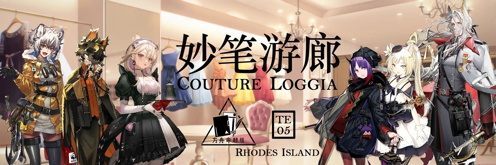 {.centering}

别考虑太多，换身新衣服好不好？{.centering}

这可是真正的限量版装扮，{.centering}

就算不给干员穿也可以买来保值！{.centering}

——某不愿透露姓名的罗德岛奸商{style="text-align: right"}

<!-- more -->

**【1】虽然游戏中的干员时装已经有很多了，但截止至目前还是有一部分干员还没有时装。以下干员中，实装时间最长且还没有时装的是**

|  |  |  |  |
| :---: | :---: | :---: | :---: |
| A. | B. | C. | D. |

**【2】游戏中现有的时装品牌多达20个。以下哪个品牌旗下的时装数目最少？**

A. 音律联觉

B. 成就之星

C. 啸风

D. 忒斯特收藏

**【3】有一些时装能且只能通过限时活动获取。以下哪一件时装不是通过活动获取的？**

| 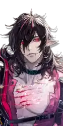 |  |  |  |
| :---: | :---: | :---: | :---: |
| A. | B. | C. | D. |

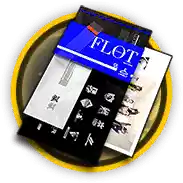{style="float:right;max-width:30%;margin-left:1em"}

**【4】时装自选凭证是一种目前已经无法在游戏中获得的道具（见本题图）。以下说法中不正确的一项是**

A. 2022年的3.5周年感谢庆典活动是玩家的最后一个能获得该道具的时间节点

B. 当干员A的首个异格干员实装时，如果玩家持有A的时装，则会自动收到该道具

C. 该道具没有使用期限，只要不使用，就可以永久保留在仓库中

D. 该道具在正常情况下只能兑换售价为15或者18源石的时装

**【5】根据以下干员立绘截取部分，判断干员和职业对应关系不正确的一项是**

|  | 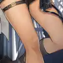 | 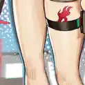 | 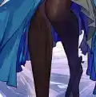 |
| :---: | :---: | :---: | :---: |
| A.特种 | B.近卫 | C.先锋 | D.术师 |

**【6】根据以下干员立绘截取部分，判断干员在该时装中头发颜色对应关系不正确的一项是**

| 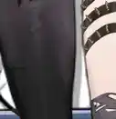 | 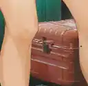 | 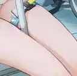 |  |
| :---: | :---: | :---: | :---: |
| A.红色 | B.橙色 | C.蓝黑色 | D.蓝色 |

**【7】根据以下干员立绘截取部分，判断其中的4星干员是**

| 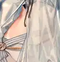 | 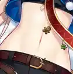 | 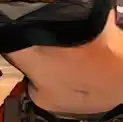 | 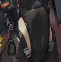 |
| :---: | :---: | :---: | :---: |
| A. | B. | C. | D. |

**【8】根据以下干员立绘截取部分，判断干员和子职业分支对应关系不正确的一项是**

|  | 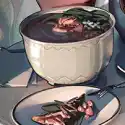 |  |  |
| :---: | :---: | :---: | :---: |
| A.凝滞师 | B.守护者 | C.速射手 | D.重射手 |

**【9】根据以下干员立绘截取部分，判断其中的女性干员是**

| 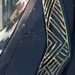 | 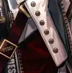 | 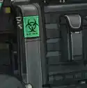 | 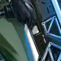 |
| :---: | :---: | :---: | :---: |
| A. | B. | C. | D. |

**【10】以下干员时装中，在时装商店里售价为15源石的一项是**

A. 杰克-0011/飙系列/II-纵身一跃

B. 因陀罗-雷神推进者/II-悍将

C. 凛冬-玛尔特/II-整装待发

D. 猎蜂-罗德厨房-掠蜜能手

**【11】根据以下干员立绘截取部分，判断画师与其它三个不同的一项是**

| 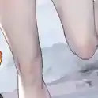 |  | 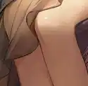 | 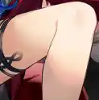 |
| :---: | :---: | :---: | :---: |
| A. | B. | C. | D. |

**【12】以下4个立绘截取部分中，有3个截取自同一个干员的立绘，请找出不属于这个干员立绘的一项**

|  | 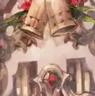 |  | 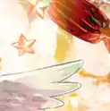 |
| :---: | :---: | :---: | :---: |
| A. | B. | C. | D. |

**【13】以下干员时装和其介绍对应关系不正确的一项是**

A. 但书-秋高气爽：专为户外运动设计，选用特殊工艺为身体提供超强支撑，面料舒适透气，高效速干。

B. 史尔特尔-缤纷奇境：清凉舒适的基础剪裁与多样化的装饰性元素巧妙融合，是对夏天的独特阐释。

C. 守林人-覆雪：以野外活动与防寒为优先需求制作的服饰，颜色贴近自然，朴素且柔和，目标人群为长期在北方荒野行动的猎人与信使。

D. 狮蝎-面纱之下：考虑到客户特殊性，在未经量体裁剪情况下完成整衣制作。时尚、舒适、贴合身形，并为干员重要器官添加进攻性保护配件。

扫一扫查看本期答案

{style="float:left;max-width:20%;margin-right:1em"}

*扫一扫二维码查看本期答案*

[点我也可以哟ヾ(≧▽≦*)o](https://www.wjx.cn/vm/Ots5Yrk.aspx)<eod />

<Ads />