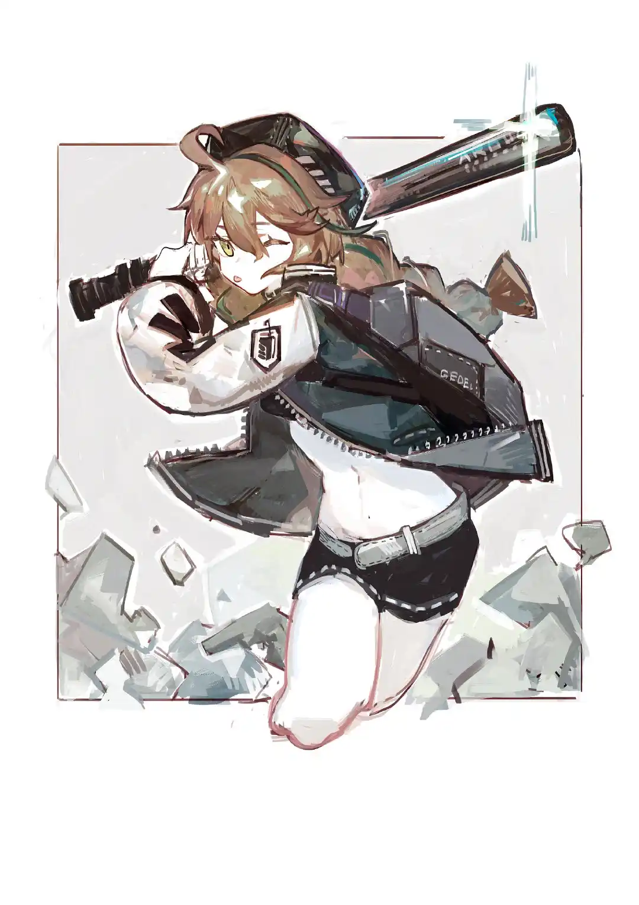

<printlimit />

苦难是天生的研磨料，抛光每个人的灵魂。{.textkai}

<!-- more -->

一个炽热而短暂的夏天降临了，炎热漫长的白日如同旗帜般熊熊燃烧，又在火焰中消逝，熄灭成比月亮更加短暂潮湿的雨夜。数百年以来，村落里的每一代人口口相传：天上的星星连成一条线时，要从天空中降落下灭世的洪水，洪水泛滥在地上，凡有血肉、有气息的活物，无一不死。

阿德莱扬起头去寻找，一颗星星也看不见了。天空仿佛被夏日的火焰烧出一个空缺，从那里生出一场黑色的大雨。雨滴像箭一样从天空射进泥土里，每个人都仰头等待着。篱笆后面的玫瑰倒在地上，如同几块破布，棕榈树、栗树、山毛榉和桉树的黑漆影子摇来摇去。

雨一直下到天明，大洪水没有来，灭世也没有来，死者没有复生，圣城也没有降临。村落里的所有人都欢呼起来，太阳重新出现了。阿德莱不解：那洪水呢？她的母亲不高兴地训斥道：小孩子不要多嘴。

阿德莱便默默提起自己的篮子从人群中离开了。

没有人在意星星是不是连成了一条线，或者洪水到底会不会从天空上面滚滚而来，人们原来在等待着自己也不明白的无关紧要的东西。

少女沿着溪水前进，昨天它还干涸得几乎寻不见踪影，今日水面升涨，像河一样宽阔。太阳升起来了，和平常一样刺眼，阿德莱把脸浸入溪水中，很凉。溪水是从附近的一座小山上滑落下来的，那山比昨日矮了半头，泥土湿润滑脱，碎石散落，阻挡了她前进的路。她在草丛里发现了一只死去的松鼠，身体潮湿冰凉，蜷缩成一团。阿德莱用榕树叶包裹起那团不会再醒来的小东西，挖开一小片泥土，将它还给永远沉默的大地。

当她安置好一切准备离开的时候，一个声音突兀地响起来：“等、等一下，我有事想请你帮忙！”阿德莱慌张地环顾四周，安静的溪水边并没有其他人的身影。“我在这里喔！好像被埋住了！”声音再次更加清晰地传来，在她脚下正中心。

这是阿德莱从没有料想过的情况，昨夜漆黑可怖的暴雨仿佛还历历在目，她不禁害怕得微微颤抖起来，尽管如此还是从附近捡起一条结实的粗树枝对着脚下挖起来。泥土又潮湿又松软，如果是昨晚被大雨和泥流掩埋在此处的人，那肯定已经奄奄一息了。

“加油、加油！拜托你了！”下面的声音却很有活力地为她助威。

阿德莱咬紧牙拼命挖，声音也越来越清晰。可同时她的担忧也越积越多，如果挖出一只脏兮兮的手，面目全非的脑袋或者是鲜血淋漓的内脏，那她该怎么办？

太阳从远处的树干升起到树梢的时候，声音的主人终于露面，黑色的、木质的、规整的六边形，阿德莱疑惑地将这个沾满泥土的盒子拿出来，盒子很高兴地说：“哇——谢谢你！”阿德莱被吓了一跳，失手将盒子摔入一旁的溪水中，盒子大呼小叫：“好痛——！”

## 2

 {.image-right-float .no-print .no-interact style="max-width: 40%;"}

在村子里的老人们告诉她的传说故事中，有长出翅膀的生物，有一半是人一半是蛇生活在树上的生物，有尾巴多得数不清的生物，但似乎从来没有过方方正正像盒子一样的生物。

阿德莱双手捧着那只盒子，明明是木制的盒子，却找不到从哪里打开，里面又传出声音：“谢谢你救我出来！我的名字是蛇屠箱。”

蛇屠箱告诉阿德莱，自己原先一直在安安稳稳地睡觉，可是昨夜的风雨掀起树根、淹没土地，她顺着山坡咕噜咕噜地滚下来后便被埋住了。

“那你，还记得你家在哪里吗？”阿德莱抖了抖耳朵。

蛇屠箱很有朝气地回答她：“一点也不记得了！”

阿德莱想了想，甩甩尾巴，她把蛇屠箱放进自己小挎包里，刚刚好能放下，不太重也不太轻，和她埋葬的松鼠差不多。

“那我和你一起去找找吧？”

“谢谢你！”蛇屠箱在她的小包里高兴地回答。

“不用谢的……”她想了想，补充道，“我的名字是阿德莱。”

蛇屠箱吃吃地笑：“听起来就像是一位好心牧羊人的名字。”

她们从山脚下出发，沿着溪水边的小路向上前进，有些地坪没有被雨水破坏得太严重，覆盖着稀稀疏疏、郁郁葱葱的青草。

直到太阳踱步到她们头顶正上方，阿德莱终于看见了泥泞中大半块厚重的石碑，正面底部镌刻着美丽的雏菊浮雕，两侧有精致的花纹，正中央则是“CUORA”几个字母。石碑四分五裂，还有一部分不知所踪。

蛇屠箱想了想：“这里有我的名字，应该就是我的家吧？”

“但它已经损坏得十分严重了，你也肯定没办法住在这里。”阿德莱惋惜地用手指抚摸过那些小雏菊的雕像。

“真是伤脑筋啊。”

“那不如、”沃尔珀少女尝试着说出自己的想法，“我先带你回家，等有机会我再帮你找到一个合适居住的地方，你看这样怎么样？”

## 3

阿德莱如约先带蛇屠箱回到自己家，她不好意思地解释说自己还来没有见过盒子里的小人。

“不过，”她想了想，补充道，“村子里有些人像我和妈妈一样有尖尖的耳朵和毛绒绒的尾巴，也有人的耳朵圆圆的或是长长的，但尾巴却像一团绒毛，住在盒子里的小人应该也是存在的吧？啊、已经到了哦，这里就是我家。”

此处是一个从山脚下蔓延开来的孤僻的村庄，最西侧一栋石青色小屋便是阿德莱的家，强烈的阳光把屋前梧桐树的叶子映出一片粉橙色，旁边的草地中落着青色的夏苹果，被圈起来的绵羊“咩咩”叫唤着衔起它们。
阿德莱将蛇屠箱放在屋前的矮凳上面，“我现在得先去看望一个朋友，她最近生重病，我有些放心不下。”

“没问题的！那我就在这里等你哦。”

阿德莱一路小跑到诺尔曼太太那里取走好友哈默妮每日需要的草药，等待着草药砂锅里面的山泉水“咕噜咕噜”地沸腾起来，深棕色的药液发出阵阵苦涩的气息，阿德莱将煎好的药液灌进随身携带的小水壶里之后，立刻动身前往哈默妮家。

之后还要帮助诺尔曼太太整理药圃，这已经变成了她日常的一部分。分辨那些最细小的草药的叶子对于外行人而言难如登天，但对于阿德莱却是易如反掌，连村落里最有经验的草药师诺尔曼太太也称赞过她的天赋。

直到太阳快要落下山的时候她才分拣出了最后一支细小的藤蔓，骤然想起还在屋子外面等待自己的蛇屠箱，阿德莱匆匆向诺尔曼太太告别，返回自己的家。

可刚刚踏上院子前的最后一级石阶，她便看见母亲在摆弄那只别致的木盒，女人将盒子摇来晃去，也没能找到打开的方法。

“呜、阿德莱……”蛇屠箱发出微弱地呼救。

“哦？”女人也注意到了出现在院子门口的阿德莱，询问道，“这是诺尔曼太太给你的东西吗？”

“不是的、妈妈，这是我今天在森林里捡到的……”阿德莱吞吞吐吐地回答，她还没有想好该如何和母亲解释住在盒子的小人，但沃尔珀母亲听过她的话之后便好像突然对蛇屠箱兴趣全无，把盒子丢在了木桌上面，训斥道：“以后不要总是往家里捡些奇奇怪怪的东西。”

“啊……是的、妈妈。”

## 4

阿德莱将盒子抱在胸前，像受惊的兔子一样从家里跑了出来，她也不知道该去哪里，最后气喘吁吁地停在一颗大榕树下面。

“你、你还好吗？”

“还好啦，还好啦。”蛇屠箱似乎又恢复了原先的活力，“不过你妈妈好像听不见我的声音，无论我说什么她都没有反应……”

“怎么、怎么会这样？”阿德莱靠着树干的背面坐下来，藏在阴影里，不住地喘气，“不过，我们、确实很不一样吧？”

“才没这种事情呢！”蛇屠箱气鼓鼓地说道，“我最开始的时候也并不是一个盒子呀，是和你一样普通的人而已！不过、我既没有像你这样的耳朵，也没有尾巴就是了。”

于是阿德莱想象出一个和她年纪相仿的女孩子，按纳不住委屈巴巴为自己辩解的样子。

“我好像掉进了很深很深的水里，后来又经历了很可怕的火焰，然后便沉沉地睡着了。等再次醒来的时候，天上下着好大的雨，之后就遇见了你。”

阿德莱捡起一根小树枝在地上画圈，“唔、难道问题是出在了水或者火焰上吗？”不过这两者都是很普通的事物吧？阿德莱思考着这之间的关联，画到第十三的圆圈的时候，肚子“咕噜噜”地响了一声。

“不好意思！”沃尔珀少女不禁红了脸，从挎包里拿出一块黑麦做的小圆饼放入口中咀嚼起来。她今天从早忙到晚，甚至忘记了应该抽空进食。

“肚子饿了就应该吃东西，大家都一样嘛！”蛇屠箱声音听起来有点高兴。

“那、你有什么喜欢吃的东西吗？”

“加很多枫糖浆的苹果馅饼！”

“诶？”阿德莱有点苦恼地抖抖耳朵，“我好像并没有听过这种食物……”

“没关系啦，毕竟盒子是不用吃饭的吧？大概吧？”

阿德莱忍不住笑了，“可以再多讲讲你的事吗？”

“当然可以啦，虽然有一些我也记不清楚了……但肯定不是和一块石碑住在森林里面的，我也说不出具体位置，那是一个有很多房屋和街道的城镇，没有森林，靠近大海。”

“没有森林？”阿德莱突然变得疑惑起来。

“是呀。怎么了么？”

“嗯……”阿德莱摇摇头，“在我很小的时候，老人们就告诉我，森林是往四面八方蔓延开来的，而我们居住的地方在世界的正中心，而且从来也没有人可以走出森林。”

“这怎么可能啦！”蛇屠箱表现得很吃惊，“森林外面还有其他的人和其他的地方，有海洋、冰原和沙漠，这个世界是很大的喔！”

“真的？”沃尔珀少女显得有些茫然，何况她也根本无法理解海洋、冰原以及沙漠究竟是什么。

“真的！”木盒中的蛇屠箱信誓旦旦地回答道。

## 5

回家的路上，阿德莱紧紧抱着盒子，提着一盏小小的手灯，夜幕沉默地笼罩着大地。蛇屠箱告诉她，那些是猎户座的星星，左上角是参宿四，右下角是参宿七，如果找到了北极星就可以辨认方向了。

阿德莱有些羡慕，“你知道的好多呀。”

“这都是在学校的科学课上老师告诉我的啦。”蛇屠箱不好意思地笑了一下。

“唔……”阿德莱回想了一下蛇屠箱刚刚告诉她的事，“学校就是一个有很多问题和答案的地方，可以学到自己想知道的事情？”

“你理解得真快。”

“因为，我也每天去诺尔曼太太的药圃里学习草药的知识，所以药圃也是我的学校吧？”

“嗯、就是这样子！”

阿德莱高高举了起灯，跟着天上的星星走。

“部落里面也有专门观测夜空和星星的人，不过我不太了解他们做的事，也不知道那些人会不会给星星起名字，不过今天知道了星星们的名字，觉得很高兴……”

“这个世界上，让人高兴的事情还要多得多呢。”蛇屠箱想了想，“如果你可以更多地看到这个世界，一定会更喜欢它的。”

第二天出发去诺尔曼太太的药圃时，阿德莱将盒子装进了自己的挎包里，虽然有点沉但至少她觉得很放心。况且有蛇屠箱陪在她身边，往常那些繁琐的工作也变得有趣多了。无论是帮忙看管给哈默妮煎药的时候还是帮助诺尔曼太太修剪园圃植物的时候，她都拜托蛇屠箱多讲一些“另一个世界”的事，对她而言，那些事情如此新奇、从未听闻，即便是部落里最博学广知的老人也讲不出如此多天马行空的故事和知识。

阿德莱从出生开始生活的世界，她曾以为村落和森林就是她生活的全部，而蛇屠箱所讲述的是另一个全新的另一个世界，那里有工厂、铁路、蓝色电车厢、摩天大楼的巨幅海报，源石驱动的发动机发出宛若野兽的咆哮，城市里充满懒惰酒鬼、年轻姑娘、诗人和戏子。

徬晚返程的路上，阿德莱依然觉得意犹未尽，蛇屠箱却不免为她担忧起来，“一天的工作也太多了吧……”

“其实还好啦，都是一些琐事，而且有你在旁边我觉得时间过得真快啊……”

“但是好辛苦，而且虽然你家和哈默妮的家很近，但药圃却真的好远！莫非你家和药圃在村落最东侧和最西侧的位置？”

“好像确实是这样？”阿德莱仔细想了想，“也没有办法呢，毕竟我家没有饲养驮兽。”

“不过我觉得这一路还算得上是平坦啦。”

阿德莱点点头，“之前的雨季到来之前，村民们一起平整了坎坷的山路。”

如果盒子也有手脚的话那此时大概会兴奋得手舞足蹈，她忍不住说出了自己的提议：“那我们做一辆脚踏车怎么样？”

## 6

从那一天开始，阿德莱每天去林子里面寻找被大雨吹倒的树木，将可以利用的结实木段用小线锯慢慢切割下来，之后鼓起勇气拜托给部落里的木匠帮忙制成脚踏车部件。

她在蛇屠箱的指导下画出了一副粗糙的设计图，却被平日里少言寡语的木匠称赞“真是个厉害的想法”。

原本看起来还十分粗糙的木头在切割打磨之下也会变得平直光滑，而放在火上加热固定就能使木材弯曲。阿德莱得到了两只完美的轮子，看起来就像是水车转轮的缩小版。

每天看望病中友人的时候，阿德莱也忍不住分享了自己的“大制作”，但她并没有过多透露蛇屠箱的事，只说是“最近新认识到了很厉害的人”。

听到一向不善交际的阿德莱能够顺利交往到新朋友，连病中的友人也露出温柔的微笑：“看来这次你交到了一个很好的朋友呢。”

沃尔珀少女腼腆地低下头，“下次有机会的话我带她来看你。”

“好啊，”哈默妮欣喜地回答，“一言为定喔。”

走出哈默妮家之后，看见了自己的蛇屠箱立刻呼喊起来：“阿德莱——我在这里哟——”每当阿德莱看望哈默妮的时间里，便将小盒子隐藏在干草、雨水和最昏暗的星光中。

“我看见你啦。”沃尔珀少女走上前去，轻轻捧起载着蛇屠箱的盒子，“抱歉，这次也让你久等了。”

“一点也不久哦。而且我在这边看到了很熟悉的花，就在这棵树后面。”

“很熟悉的花？”阿德莱疑惑地绕着树干走到了另一边，才发现了树荫下丛生着的杂草中盛开了一朵小小的白色郁金香。

“以前还在家里的时候，妈妈会定期买这种花插在餐桌上的花瓶里，她很喜欢哦。”

“原来是这样吗，”阿德莱用手心温柔地摸了摸盒子，“我也很喜欢的。这种花，其实是我和哈默妮一起种在这里的。”

“诶？你说的是真的吗？”

“真的。”少女点了点头，像是回想起了一段遥远的往事，“那时候只有我跟着诺尔曼太太学习草药知识，又因为不擅长与人相处，同龄的孩子们也不愿意和我交往。那时候就是哈默妮出现了，她在河对面的森林里发现了这种植物，想请我帮忙移植在家里的院子后面，可是因为土质的问题一直长得不太好，于是就渐渐放弃了。”

蛇屠箱忍不住笑出声，“感觉真的很有阿德莱你的作风呢，所以是因为植物才和哈默妮变成了朋友吗？”

阿德莱不好意思地摸了摸下巴，“唔，说不定就是这样。”

“也有可能这种花其实是帮助阿德莱交到朋友的好运之花，每次花出现的时候朋友也会随之出现哦！”蛇屠箱兴致勃勃地分析了一番。

“这个嘛，或许不太可能吧……”毕竟花朵只是普通的花朵呀，阿德莱想。

“我倒感觉是真的。”

“诶？为什么？”

“因为——”蛇屠箱微笑着大声回答：“我也想和你做朋友呢——”

黄昏交错的恍惚间，阿德莱依旧捧着一只冰冷的木盒，却仿佛感觉到有一个少女用很暖和、很柔软的手牵起了自己的手，绿色眼睛里是亮晶晶的笑意，歪着脑袋告诉她：我想跟你做朋友。

“那么、阿德莱的回答呢？”

沃尔珀少女在晚风中轻轻微笑起来，郑重其事地点点头，将小小的盒子抱在怀中：“我也是哦。”

---

经历月亮圆了又缺的时间里，她们已经完成了所有的木制部分，拼凑出了一辆脚踏车的雏形，只是齿轮与链条却一直没能得到解决。金属可不是木头，没办法在树林中随随便便得到。正当两个人都为此时发愁时，如同古典戏剧里的机械降神一般，村落中负责铜器锻造的年长女性主动来询问是否需要帮忙。

当阿德莱坐在车座上面，歪歪扭扭试图前进的时候，她还很难相信她们居然做出了这个两个轮子的怪东西。

“就是这样、就是这样！看着前方，注意保持平衡。”蛇屠箱倒是很开心，一直指导她如何让脚踏车平稳的动起来。

木匠帮忙在把手前方安装了一个编织篮，刚好可以放下哈默妮每日的草药和蛇屠箱的六边形盒子。阿德莱摇摇晃晃地踩着脚踏，轮子转动不到半圈她便不得不用脚维持一下平衡。

“阿德莱、要对自己有信心哦，”蛇屠箱在车篮里为她鼓劲，“学骑脚踏车最重要的就是勇气！加油、加油！”

沃尔珀少女通过无数次的练习之后，终于能够慢慢骑着车子平稳向前时，月亮也从东边的天空中升起来了。尚未消逝的晚霞温柔地注视着这片大地，而温暖的风掠过她的脸颊。她们从东到西，从南到北，将橙色指路牌、村落的小路与煎鱼蘑菇米饭的香气都甩在身后了。脚踏车带她们穿过洋槐与栗树林，走遍每一片荨麻和蕨草丛，月光在玉米叶尖闪烁，重峦叠嶂在淡紫色的天幕中漂浮，有时是上坡，她们走得很累很慢，有时是下坡，两个人一起摔得很惨，不过没关系，年轻的女孩子们，笑一笑又可以站起来。

“可以再说一次、星星的名字吗？”阿德莱气喘吁吁地、情不自禁地请求。

“那里是猎户座的星星，左上角是参宿四，右下角是参宿七。”蛇屠箱停顿了一下，“但星星也并非是一成不变的。据说很久很久之后它们的位置就会被另外的星星所占据，星星也在不断旅行，不会长久地停在同一个地方。”

阿德莱摇摇晃晃地控制着车把，“但是，我们已经看到了它闪耀的样子，不是吗？”

“正是如此喔！”

“对了，”沃尔珀少女停在了一片郁郁葱葱的草丛前，“你说的大海，是什么样子？”

“大海……书里说大海是这片大地的蓝色血液哦。”蛇屠箱轻轻笑出声，“不过要描述海洋果然很难啊。”

“蓝色？像天空一样吗？”

“嗯！像天空一样哦。”

阿德莱从草丛中收集了一把桔梗花，将这抹小小的蓝色放在了车篮中。突如其来的一阵风吹乱了她的头发，月亮洒下白铁皮般冷冽的光辉。

“我们回去吧。”

树影婆娑，晚霞消失得太快，而月亮升起得太慢了。村落里静悄悄的，炊烟在微风中摇曳着升起。

阿德莱小心翼翼地将脚踏车藏在离家较远的一顶草垛后面，可是刚一踏进家门就瞧见了母亲阴冷的神色。

“唔……妈妈？”

“哈默妮死了。”

## 7

“哈、默妮？”

## 8

阿德莱全然不记得自己是如何一路狂奔到友人的家中，即便如此，到达的时候也只剩下空荡荡的床铺和所剩无几的对方还曾生活过在这里的痕迹。

“一言为定喔。”

简直像一场无法醒来的噩梦一样。

阿德莱离开了哈默妮的家，失魂落魄地把自己藏在她经常待的大榕树底，将盒子紧紧抱在胸口，向蛇屠箱讲述自己与哈默妮的事。

相比于内向又不擅长交际的自己，哈默妮要开朗活泼得多、与所有人都相处得融洽，但即使如此对方还是愿意陪在她身边。她们有着共同的兴趣爱好，甚至于后来一起跟随诺尔曼太太学习草药知识，再然后一起长大，成为这个世界上最了解对方的人。

阿德莱讲述完一切的时候，月亮已经完全升起来了，在宽阔的水面上投下了惨白的月光，像是一面巨镜被打碎成了千万碎片，实在太过细碎，以至于任何人都无法复原。

“或许这样也好，”阿德莱几乎哽咽着说，“哈默妮从染病开始就一直、一直承受着我无法想象的痛苦，这或许对她而言是一种解脱？”

“在我们的部落里，一旦有人去世，大家就会立刻将死者的身体用巨大的棕榈树叶和藤蔓包裹起来，然后在森林深处挖一个深坑掩埋进去。如此以来，一场雨之后便会全无踪迹可循。大家并不惧怕死亡，认为人死之后灵魂会去往另一个世界获得宁静，而遗留下来的身体埋在泥土中，供养许多草木，每年春天花开，他们就好像也跟着复生。”

“哈默妮从前最喜欢照顾植物，这样一来她应该也会高兴吧，我也应该为她高兴才对。你说对不对？”

一直沉默的蛇屠箱终于开口：“想哭的话就哭出来吧，我会陪着你的。”

从听到好友死讯之后便一直表现得很平静的少女不禁愣了一下，随后放声号啕大哭起来。

“再也、再也没有了……哈默妮，我再也见不到了……再也不能和她说话、呜，和她见面……为什么其他人都不在乎，花每年开一次，开败一次，可是……哈默妮再也回不来了……”

沃尔珀少女像是要把所有的眼泪都流出来，树影摇摆，蝉在鸣叫，似曾埋葬一位少女的某处，涌出了豆蔻花色的夏夜。皎洁的月亮悬挂在天边，如此明亮的月光，同时也是如此残酷的月光。

盒中少女开口，声音好似从很远很远的地方幽幽传来，“在我们的城镇里，死者的尸体往往会在检查之后焚烧，熊熊燃烧的火焰之下，一切就会变成一些干燥的灰白粉尘。人死便是永远离开了，但是生者将粉尘装进盒子里面保存，作为一种思念。”

蛇屠箱停顿了一下，才继续说道：“其实我也已经死掉了……在很久很久之前，就死掉了。”

## 9

“阿德莱，好好地道别吧。”

## 0

一个炽热而短暂的夏天结束了。比一场秋日的雨来得更早，天空更远，夜晚更凉，月亮呈现一种蓝色的玻璃质感，透明又沉重。不再有一份草药的车篮里面空空荡荡，苦难是天生的研磨料，抛光每个人的灵魂。
人们很快忘记了一个并不起眼的被疾病折磨的少女，忙碌的日子到来了，稻谷低头，玉米吐须，人们用镰刀获取果实，又将杆茎踩在脚下。焚烧田地的那日，下起了轻飘飘的雨，火势从土地的一角飞速往中心蔓延，黑色浓烟旋转着向天空溢散，漆黑的乌云、漆黑的大雪，秸秆在火焰中融化，散发出一种奇妙的呛人气味。

阿德莱远远地观望着，一言不发。因为大雨而暴涨的河面如今又变为了一条细细涓流，田边高地上传来了有节奏的鼓声、笛声以及人们的欢呼声。

“在想什么吗？”蛇屠箱小声发问。

“唔、你所说的那个世界也会有同样痛苦的生老病死吗？”

“当然会有，人活着总是要经受生老病死的苦楚，任何人都无法逃避，而医术能够提供的帮助却是非常有限的，对吧？”

“说的也是。”阿德莱叹了下气，摘起脚边一株蒲公英花，放在嘴边轻轻吹出一口气，毛绒似的花瓣尽数飞离，很快飘走了。一粒种子若是死了那便只是一粒，落到泥土里生根发芽却会结出千千万万粒。大家都想活，大家都愿意活着，疾病是生的亢奋。而空气里满是土地死亡的气味，那死像夏夜般甜蜜，充满了香茅草、罗勒和新酿谷酒的芳香。

阿德莱在下巴轻轻枕在蜷起来的膝盖上，“曾经的我觉得一直以来自己生活的这个世界的一切都是合情合理的，但直到你出现之后，我才发现其实自己没有那么认同它。”

在炽热浓烟的上方，在那时，从远远的天边突然传来了轰隆隆的巨响，地上的每个人都抬头去看，比山更远、比云更远，形如巨鸟一般的白色飞行物从天空另一端飞来了，拖着一条长长的白色尾巴。除了秸秆燃烧时噼里啪啦的声响，没有什么再发出一点声音，每个人都屏息凝神地仰起脸伸长脖子，仿佛要把从未见闻过的“白色巨鸟”印在同样迷惑而恐惧的眼睛里。

“是一架飞机哦。”蛇屠箱轻轻地说。

“是从你的世界里飞过来的？”阿德莱的目光也紧跟着飞机的航道移动，显得有些担忧和不解。

“不是的，”蛇屠箱在盒中摇摇头，“虽然我们可能相距很遥远，但我们所在的是同一个世界。”

比山更远、比云更远，正是因为这份遥远，虽然有着一样的生老病死，仰望着同一片天空，却也无法相见。阿德莱在草地上伸展、躺平，看飞机飞过她们的头顶，然后很快地消失在离开的方向。下面的人群中终于爆发出了极为不安的躁动。哈默妮死的那天，妈妈去接她回家，脾气变得越来越坏的女人给了她一个拥抱，妈妈很久没有那样抱过她，而阿德莱也不再渴求母亲的怀抱。此时此刻，她将盒子紧紧抱在怀中，感到疲惫与困倦，飞机已经离开了，哈默妮离开了，洪水也被从地上收走。

“让我们……也一起逃走吧。”<eod />

---

*故事章节从 2 开始，0 结束，这不是一个错误。*

（责任编辑：瑶濯；网页排版：武乙凌薇；绘图：weibo@仙女V-V）

<FakeAds />