<!-- more -->

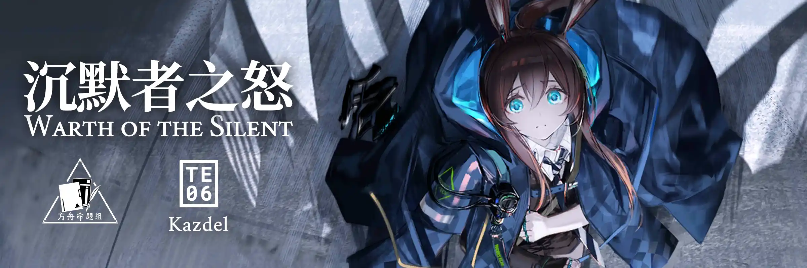 {.centering}

用泪水湮没泪水{.centering}

用苦难填埋苦难{.centering}

只有焚毁的土地{.centering}

才能给萨卡兹带来新生{.centering}

**【1】卡兹戴尔是萨卡兹共同的家园，但并不是所有萨卡兹都出身于卡兹戴尔。以下萨卡兹干员中，并非出身于卡兹戴尔的一项是**

|  |  |  |  |
| :---: | :---: | :---: | :---: |
| A. | B. | C. | D. |

**【2】根据凯尔希所说，很久以前，在这片大地上并没有“萨卡兹”这个称呼，那时的萨卡兹被称为**

A. 卡兹

B. 魔族

C. 提卡兹

D. 坎瑞亚

**【3】萨卡兹只是种族的统称，其下可又细分为多个亚种。请问以下哪个人物所属的萨卡兹亚种目前不接受王庭军的统一指挥？**

| 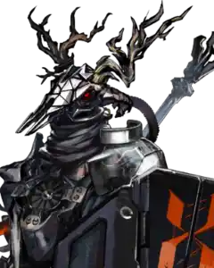 | 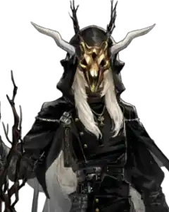 | 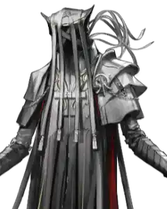 | 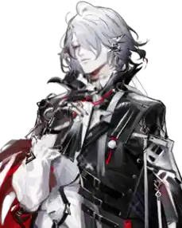 |
| :---: | :---: | :---: | :---: |
| A. | B. | C. | D. |

**【4】截止至目前的战斗里，我们已经遭遇了很多萨卡兹类型的敌人。关于他们的特性，以下说法不正确的一项是**

A. 萨卡兹哨兵发出警报后，会提升所有敌方单位的攻击力与防御力，即使不属于萨卡兹的敌人也可以享受此增益

B. 关于腐败骑士和凋零骑士，如果在其中一方入场之前就击杀另一方，就不会触发攻击力、攻速、移动速度大幅提升的亡语效果

C. 泥岩小队践行者具有护盾，护盾存在时可以大幅提升其生命值和防御力，护盾只吸收法术伤害

D. 萨卡兹悖谬裂变学徒拥有产生虚像的能力，但是该能力可以被沉默所无效化

**【5】巫异盛宴这款时装品牌源自于只允许女性萨卡兹参加的古老活动。以下哪一项立绘截取不是选自该时装系列的？**

| 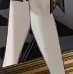 | 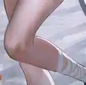 | 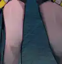 | 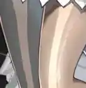 |
| :---: | :---: | :---: | :---: |
| A. | B. | C. | D. |

**【6】在集成战略玩法中，我们也能时不时看到萨卡兹的身影。以下收藏品中和萨卡兹没有直接或间接关系的是**

| 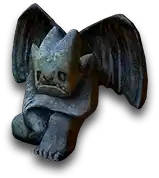 | 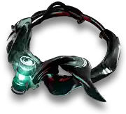 | 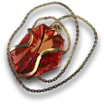 | 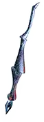 |
| :---: | :---: | :---: | :---: |
| A. | B. | C. | D. |

**【7】根据目前游戏中的剧情推断，阿米娅很可能以某种形式继承了萨卡兹的血脉，并将成为新的魔王。关于阿米娅的相关剧情，以下说法不正确的一项是**

A. 阿米娅的天赋“青色怒火”源于她的武器，其原本为前代魔王奎隆的佩剑名

B. 爱国者曾得到过“魔王将奴役整个世界”的预言，也因此对阿米娅起了杀心

C. 由于阿米娅是魔王的继承人，并且拥有读取感情的源石技艺，即使她并非萨卡兹，“死魂灵”仍然认可了她

D. 阿米娅曾经说过，罗德岛的信条是“如果争端能够避免，那我们应当沉默；如果战斗是必要的，那就战斗到最后”

**【8】萨卡兹的苦难几乎贯穿了泰拉的历史。关于以下事件发生的先后顺序，排序正确的一项是**

**①** 炎魔实验失控，伊芙利特被植入了萨卡兹血脉

**②** DWDB-221E项目取得重要成果，“文明的存续”诞生

**③** 特蕾西娅遇刺，博士被送入石棺

**④** 凯尔希率军讨伐萨卡兹，但被萨卡兹六英雄合力击杀

**⑤** 卡兹戴尔军事委员会入驻伦蒂尼姆

A. ②④①③⑤

B. ④②⑤③①

C. ②④③①⑤

D. ④②③⑤①

**【9】第12章主线剧情公布后，萨科塔和萨卡兹同源理论被证实。以下关于萨科塔的叙述，不正确的一项是**

A. 萨科塔自诞生之后，开口说话起，其头顶便会出现光圈，背后出现光翼

B. 只有萨科塔和萨科塔生育出的子女才会是萨科塔，萨科塔和其他种族生育出的子女必然为其他种族

C. “律法”将每一个未“堕天”的萨科塔连结，其本质只有一条，即“延续种族”

D. “堕天”之后的萨科塔将被守护铳所排斥，也无法加入共感

**【10】《回归线》2022年9月号的杂志中刊登了《老人河》和《老萨卡兹》两篇文章。依据原文内容，对于这两篇文章的解读，最不恰当的一项是**

A. 《老人河》中前后两次对船头小筐里的物品描写，既烘托了老人河周围的寂寥氛围，又表现出了物是人非，时间所带来的变化之大

B. 安多恩第三次渡过老人河时，看穿了藏在其中的萨卡兹巫术，自知自己马上就会死亡，因此看到小孩落水时才会毫不犹豫地出手相救

C. 《老萨卡兹》中，送葬人之所以反复问到“他怎么出来了”，是因为送葬人知道老萨卡兹一直沉浸于过去的记忆和怀恋中，是活在“过去”里的人

D. 老萨卡兹曾经和战友们追随殿下、为民族而战斗的那段历史已经被时代逐渐遗忘，在美好的新时代里再也没有人能真正理解他、了解他的过去。这也提醒我们不要忘记历史。

{style="float:left;max-width:20%;margin-right:1em"}

*扫一扫二维码查看本期答案*

[点我也可以哟ヾ(≧▽≦*)o](https://www.wjx.cn/vm/m0QHMI0.aspx)<eod />

<Ads />