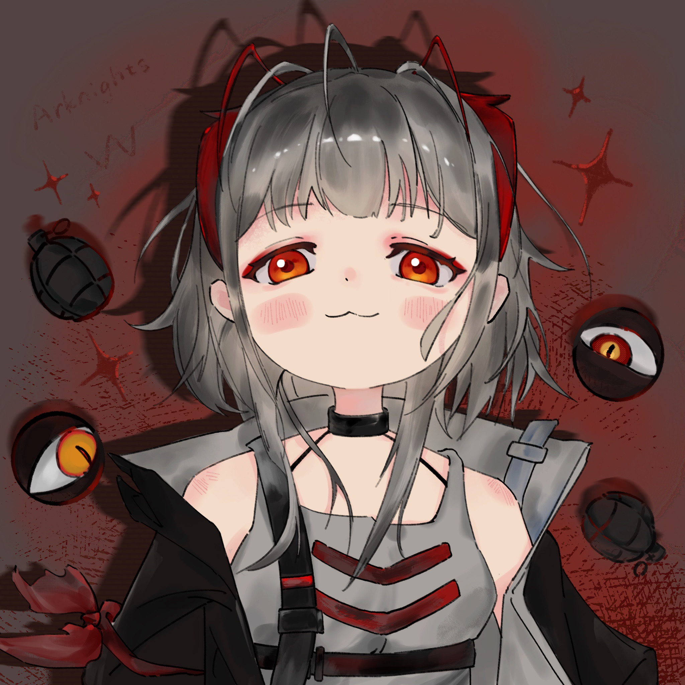

话说卡兹戴尔某社区中住了两家人，{.textkai}

分别养有一女，相交甚欢。{.textkai}

<!-- more -->

话说卡兹戴尔某社区中住了两家人，分别养有一女，相交甚欢。这个相交甚欢自然指的是三位成人，而非小豆丁们。

赫伊家的W是个捣蛋大王，炸天炸地炸空气，害得周遭不少邻居中招，灰头土脸地叩人房门。

实在抱歉，我们会原价赔偿，是，是，是的，我们会的，下午五点钟我们会带着W登门道歉。

赫德雷态度越是诚恳，伊内丝便越是愠怒。怎么办？她现在就想揪回罪魁祸首，好好呵斥一通，再把她的小屁股打开花。

当然，受害者之中，要数博士最倒霉，怪就只怪她是W的邻居、同学，甚至同桌。

二人结缘，或许称之为结怨更准确些，咳嗯，二人结怨于四岁那年。Scout独自带着博士搬进社区，刚一落脚就要为装修焦头烂额。好在博士乖巧，一堆沙，一把铲，能玩到夕阳西坠。某个清晨，闯了祸的W在院中罚站，百无聊赖，四下张望之际瞄见沙堆旁的博士。

新搬来的？看着好像不太聪明，哼哼……

W深受赫伊熏陶，是个彻头彻尾的行动派。悄声靠近，左脚一扫，铛铛！人形胡萝卜！

她大笑着跑开，将栽进沙堆的博士留在原地。

 {.centering}

几次三番皆是这般，Scout决心要抓她现行，哪成想呢，这倒霉孩子是老友赫德雷家的女儿，哪怕再想为博士出口恶气，也是难了。

是是是，我不能调皮，不能往小笨……博士的果汁里倒胡椒，不能在她鞋子里放毛毛虫，你们和博士的爸爸，Scout是好朋友，我和博士也该是好朋友，相亲相爱，互帮互助。

W念经似的重复个不停，心下却说，噫……有够肉麻。好在伊内丝不耐烦地挥了挥手示意她停下。

够了，W，我们要的是你的行动，而非口头承诺。

知道啦——

Scout置办完住所后经常带着博士登门拜访，同老友小聚寒暄，饮茶看报。奈何实在忌惮那小魔头，不免三心二意，支棱着耳朵听楼上响动，生怕自家宝贝吃亏。

可防不胜防。

小家伙们在伊内丝的监督下安安静静地用蜡笔画画。W画了自己设计的无敌炸药，而博士则画了自己和Scout，不时甜滋滋地笑。

不巧伊内丝临时接到通知，需要回公司核对工作进度，匆匆下楼，独留二人在房间。

于是W再次展开了行动。她指了指博士的画，又指了指墙上的画。

看，我的画上有三个人，你的却只有两个欸，怎么回事呀？喔！你还画了一颗香樟树做装饰呢，噗……

博士听出弦外之音，圆脸霎时皱成包子样儿，气得急了，却只会骂W真烦人。这不怪她，Scout寡言好清静；W家不同，伊内丝与赫德雷终日斗嘴，全叫她学了去。

博士是小傻瓜，小蠢蛋，哭起来鼻涕流那——么长一条，都要聚成河了，哎呦……好脏呀，好丑呀，Scout不要你啦……

博士骂不过，急得哇哇直哭，不由分说扑了上去。霎时间，两人打作一团，起先博士还能借着体位优势捏揉W的脸，可她生得瘦小，几下便被W反控在地，只得无助地蹬动双腿，任由W攥着肉拳头“揍”。

打闹声引起二人主意，意识到小祖宗们又闹起了别扭，忙不迭赶去，一人一个拉扯开来。

博士不服，对着空气挥拳踢腿，吼出几声带着哭腔的“讨厌你！讨厌W！”

讨厌二字对孩童而言，太有分量，哪怕是油盐不进的W听罢也不由一颤，短暂的语塞过后是惊天响的回击：

我也讨厌你！最讨厌你了！

两个大人面面相觑，一时不知如何是好。

当晚，博士在Scout的床上哭到打嗝，W郁闷地在房间里打转转，满脑子都是伊内丝那句好好反省，想通了再出门。

互扯头花嘛，得有来有回。兔子急了会咬人，博士急了更是如此。

五天后，Scout驱车接博士回家，却望见她涕泗横流，跌跌撞撞奔向校门的模样。Scout第一时间猜测W又捉弄她，细细问过后才得知，原来她把人家给咬了，估计伤得不轻。

W……W就、就摇头，说不痛，我就继续咬，怎么咬她都说不痛，一点儿也不痛。

说到此处，博士内疚得无以言表，又落下几颗金豆豆，小手攥着Scout的衣袖，嚎啕大哭。

好了好了，不哭了不哭了，我知道博士现在很难过，我们去给W道歉就好，W会原谅我们的。

Scout从后座拎来好大一袋零食，又揉了揉她的发顶。

嗯……

博士点了点头，小鼠般窸窸窣窣地翻动零食袋，找出Scout每次都买给她的、被W偷吃过好几回的曲奇饼干，装进钩织毛线斜挎包里，而后抽抽搭搭地牵Scout的手，去给W道歉。

伊内丝晓得自家这个不是省油的灯，循循善诱，果真问出了点儿实情。哈，又是W先惹博士——她在她作业本上画鬼脸。

我是……我……我想给她……道歉，谁能想到她那么笨呀！看都不看就给……交上去了……

道歉？

伊内丝不禁挑眉。她什么时候良心发现的？

任课教师发现鬼脸后，第一时间将博士叫到办公室去。博士脸皮薄，受不住那般责问，偏又忆起科学课上W洋洋得意的神情，胸中幼火到底还是燎了原。

伊内丝边处理伤口，边冷哼揶揄。

你这是咎由自取，赫德雷给你讲过九遍牙兽来了的故事，哪怕你只听过一次，也不会闹到今天这地步。

赫德雷的脸色也不算好看，只是听伊内丝这样说了，心中隐隐泛起委屈——她这是嫌我啰嗦？

有这么多吗？

当然。

赫德雷讪讪住嘴，半晌后才把话题扯回来，

W，你的恶作剧要适度。

不消片刻，博士便怯生生坐到W身边，问，还疼吗……

W咧嘴，腾手弹她额头。

一点儿也不疼，话说受伤的明明是我欸，你哭什么？

博士吸一吸鼻子，嗫嚅着开口：

因为……因为我害W痛痛……

哈！你那口嚼糖果的烂牙，还没伊内丝的木梳硌得痛呢！

博士嘴一瘪，眼一润，一溜烟跑到Scout身边。

……果然W是笨蛋，大笨蛋！<eod />

（责任编辑：瑶濯；网页排版：武乙凌薇；绘图：LOFTER@白清荃）

<ArticleAd />