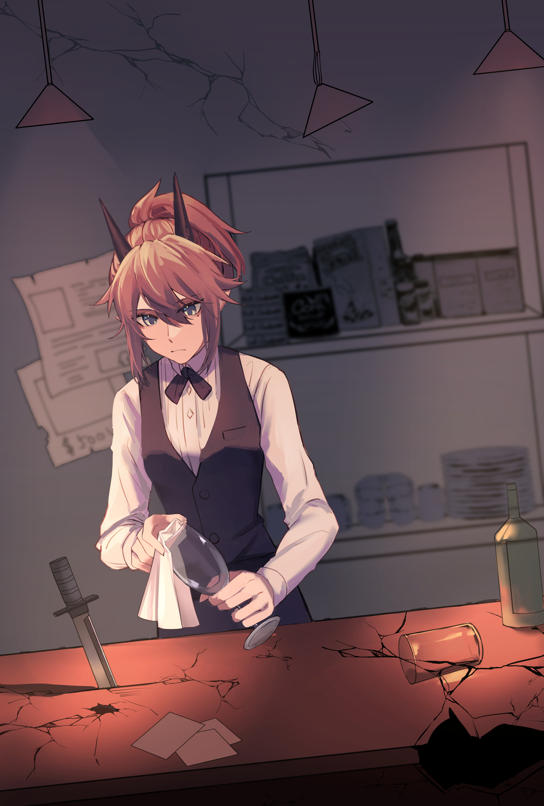

阴云小雨，正适晚餐{.textkai}

明人惶惶，暗流汤汤{.textkai}

<!-- more -->

除了有蟑螂洞最多的墙，粘最多口香糖的地毯，最能咯吱咯吱响的木椅，加州旅馆其实和其他哥伦比亚汽车旅店没什么区别。

傍晚，前台门打开了，一个菲林，一个鲁珀，两个哥伦比亚人走进来，挨着柜台坐下。菲林在女服务生右边，鲁珀在左边。

“你们要吃什么？”前台的女服务生系着围裙，边翻旅店账本边问。

“我不知道，”其中一个说，“艾尔，你想吃什么？”

“我也不知道。”那个叫艾尔的鲁珀说，“话说，女士您是东国鬼族吧，您真美丽——您为何会背井离乡来到哥伦比亚？。”

“为了活着。”女士言简意赅。

“是的，活着可不容易。”叫艾尔的点头。

他们两人抬起头，望向挂在楼梯边的菜单木牌。楼梯通向二楼，上边是旅店的住客套房，栖息有满身污泥的旅客，膀大腰粗的卡车司机，黑眼圈溢出面部的疲惫者，妄图省钱的情侣，廉价二足劳动力牲畜等，各类形形色色的人或拟人的住客。旅店一楼闷湿的很，仿佛哥伦比亚的恶意妄图把人溺死在木桌吧台上。店外下着雨，雨滴落地的声音隔着玻璃，就像铳弹陷入肉体发出的欢愉呻吟。

此时店里只有三个客人，一个女萨卡兹在柜台另一边，两个丰蹄在破了垫的沙发上——隔了老远。柜台前先到的家伙面前有一整块肉排，拌着土豆泥和青豆。三个人一起看着两个后来者。

“麦克斯，你想吃什么？”艾尔问。

叫麦克斯的菲林说话闷声闷气：“火腿煎蛋。”

女服务生犹豫片刻：“一份火腿煎蛋分量……”

“那就两份，三分，你觉得够我吃为止。”菲林砸吧嘴。

“哦……你看，小姐——”艾尔笑起来，“我和我异父异母的亲兄弟大老远赶来，午饭都没有吃，就让他吃个饱吧——我想要烤面包熏肉。”

女服务生脸僵的似冰：“没有。这是晚饭，六点才有。”

“六点？”

“现在五点四十。”服务生瞥了一眼墙上的钟。

鲁珀走到墙边，踮起脚尖取下钟，用手指把分针往后扳了三分之一个圈。

“现在是六点了。”他说。

“嘿！”沙发上一个丰蹄叫道。鲁珀转过头，对他露出不屑的笑。

“……”服务员没有说话。于是艾尔又重复了一次：“现在六点了。”

“后厨，烤面包熏肉，火腿煎蛋三个。”

艾尔一笑，“聪明姑娘。”

“东国鬼族的聪明姑娘可不多，可惜她不会笑，也难怪只能在这破地方做服务生。”麦克斯补充。

女服务生板着脸。

“她漂亮吗？”麦克斯转头问：“艾尔？”

“她迷倒我了。”鲁珀转过头，“美丽的小姐，能告诉我，奥尔·安德瑞森住在这里吗？”

女服务生点头。

“哦，那能告诉我他住在上边哪一间吗？”

女服务生摇头。

麦克斯嗤笑一声：“傻逼。”

“傻逼。”一个丰蹄说。

“傻逼。”另一个丰蹄说。

“傻逼。”女萨卡兹说。

“……”女服务生小声的说，但是没发出声音。

加州旅店陷入沉默，溺死人的窒息感再次倾注入房间。窗外穿过一声雷声，片刻，又是一声。

“这雷声真像爆炸声。”艾尔说。

“是爆炸声像雷声。”麦克斯说。

听到这话，所有人都转头看向窗外——太阳为了早下班一刻也不远停留，只有雨滴在夜的雨衣下滴滴答答。

“我好无聊。”麦克斯说。

“喂，服务的，有收音机吗？”艾尔转过头喊道。

女服务生弯下腰，在柜子里翻找片刻。然后她起身在身后的柜子挨个搜找，终于找出一小个铁皮玩意儿。

菲林啧了一声：“随便哪个台都行。”

小铁皮玩意儿放在柜台上，勉勉强强发出混浊失真的声音。

There she stood in the doorway

I heard the mission bell

I was thinking to myself

This could be heaven or this could be hell

Then she lit up a candle

And she showed me the way

There were voices down in corridor

I thought i heard them say:

Welcome to the Hotel California

Such a lovely place

(Such a lovely place)

Such a lovely face

“真难听”。一个丰蹄小声说。

这时，一个带着厨师帽的小伙子端着两盘东西从后台出来。他手里有两个盘子，一盘子是烤面包熏肉，一个盘子是三张火腿煎蛋。烤面包上有两块焦黑。女服务员将盘子拿过来，将火腿煎蛋放到鲁珀面前。

“谢谢。”鲁珀说。

另一个菲林张牙舞爪的抢过烤面包熏肉，用叉子往嘴巴里送了起来。他左手插在兜里，右手拿叉子。

女服务生，还有其他人看着他狼吞虎咽，没有说话。

“看什么？”大家伙菲林抬起头，死盯一眼女服务生。

“没看什么。”

“你们呢？”大家伙菲林转过头面向那几个丰蹄。

丰蹄们别开视线。

“你也看？”麦克斯转过头，看向身边的鲁珀。就在这时候，鲁珀突然从怀中掏出一把刀子，送到健壮菲林的胸口——麦克斯呛了一口熏肉，瞪大眼珠，从椅子上摔下，摔在地板上。他藏在兜里的手也摔了出来，一把手铳从手里脱出，滑到门边。

鲁珀艾尔没有去看刀子和尸体：“拜托，你们知道的，只有杀了奥尔·安德瑞森的幸运小子才能拿到赏金。我可干不过这个吨位的男人，只好在我兄弟想通之前先下手为强。”

女服务生发起抖来，旅店一片沉寂。只有收音机还在嘎吱嘎吱。

So l called up the captain:

Please bring me my wine. He said:

We havent had that spirit here since

since 1969

---

“他应该要下来了。”艾尔瞥了一眼女服务生发抖的肩膀，啧了一声，“小姐，别抖了。看你这样子，肯定在拉特兰修道院待过吧？见不得血？我还以为你是个聪明姑娘。”

一个丰蹄嗤笑，“放屁，拉特兰的神正忙着在卡兹戴尔杀萨卡兹人呢。”

那个角落的萨卡兹没有说话，倒是服务生抖得更厉害了。

另一个丰蹄看向墙上的钟：“六点半了。他怎么还没下来？”

“他下来了就，各凭本事？”

“他下来了就各凭本事。”

艾尔看了眼钟，“晚餐都吃了，不是六点半也是六点半。傻姑娘，去把他叫下来。”

女服务生还在颤抖，“你们，你们为什么要杀奥尔·安德瑞森？”

“就当帮帮忙，你这个东国异教徒——他好像是在205。”

“你，你为什么不自己上去？”

艾尔瞥了一眼余下几人：“因为这里人太他妈多了。”

女萨卡兹突然说：“也许不应该这样。”

“让她去吧，她不是个聪明姑娘。”

姑娘颤抖着，一步一步从柜台后挪出来，走上楼梯。在她身后，也许有四双眼睛盯着她，也许没有。她在台阶上滑了一跤，差点摔下来，不过没人扶她。

她再次走上二楼，小心的敲门：“奥尔，奥尔先生？”

“……终于来了吗？”门里传出声音，“进来动手吧。”

女服务生癫痫般的推开门，走了进去。奥尔·安德瑞森，一个大号的阿达克利斯，就躺在地板上，一只蟑螂从他的胳膊下穿过。房间很简陋，墙壁上有人用刻刀刻下“请自带洗发水”的字样，还有人在后面补充“还有冲马桶。”

“哦，东国人。”他说。

女服务生不再发抖了。她点头，沉默片刻，从腰间围裙下面取出一把短刀。

“楼下有五个人，死了一个，现在还有四个人。”她说，又补充道，“不算我的同伴的话。”

“哦。”

奥尔·安德瑞森的声音有点可笑，像是噎了气的小兽。他只是看着天花板。窗外雨声变大了些。

“你不逃吗？”

“无所谓了。”

“你不想活吗？”

“我不被允许活。”

“我可以告诉你，他们是什么样子。”

“我也不想知道他们是什么样子。”奥尔一动不动，“谢谢你告诉我这些。”

“你不逃吗？”

“无所谓了。”

“无所谓？”

“重复从一个地方到另一个地方……无所谓了。”

两个人一起陷入一种短暂的沉默。直到一阵雷声穿过雨夜。

“我不想杀你了。”女服务生说，“我也在逃，本来杀你是为了赏金。”

“这样啊，真可惜。逃到这里后，我就不想藏了，每天六点半我都会下去吃晚饭。”奥尔看着天花板，“现在几点？”

“六点十五。”服务生看向房间里的挂钟。

“那我六点半再下去。”

“你不想动吗？”

“现在不想。”

两人又沉默一下。雨声逐渐平息，天也不打雷了。

“你可以和我下去。这样，或许你能够被他们中的一个杀死，又或许你能吃上一份肉排，或者三张火腿煎蛋。”女服务生想了想，补充道，“或者一份肉排加上三张火腿煎蛋。”

“可现在才六点十五。”

女服务生叹了口气，走到墙边，用手指挑拨时钟分针：“现在六点半了。”

阿达克利斯坐了起来，用手撑起自己。“走吧。”

两个人推开门，走下楼梯。加州旅馆一楼已经变了个样，桌椅大多被掀翻。两个丰蹄的样子不太好看：一个被一根桌腿钉在墙上，另一个已经被爆炸撕成了好几块。艾尔就趴在他异父异母的兄弟边上，一动不动，手里握着他兄弟的铳，脑袋上插着自己的匕首。那个女萨卡兹倚靠在墙边，胸口被铳开了三个洞，还在冒东西。补上致死的斗殴，这下加州旅馆终于和哥伦比亚的任何汽车旅馆都没有什么不同了。

女服务生指向柜台：“看来是一份肉排，加上三张火腿煎蛋。”

柜台被炸飞了一半，不过火腿煎蛋和女萨卡兹的肉排都安然无恙。肉排已经冷了，土豆泥凝聚固态；火腿煎蛋倒还冒着热气。

“哦。”奥尔说道，走过去，坐在肉排前吃了起来。他吃的很慢，仿佛时间停滞一般。吃到一半，他突然抬头，看向墙上的钟。

“帮我把煎蛋打一下包。”他说。

服务生蹲下，挨个翻找柜台，找到了打包盒：“决定要走了？”

“不，明天中午在房间里吃。”他顿了顿，“也许明晚还会有人来。”

“不走？”

“不走。”

一整盒装进打包盒的煎蛋放在阿达克利斯面前。他站起来，从口袋里掏出了一叠大面值钞票，数出四张，放在鬼族姑娘面前的柜台上。

“我不是服务生。”

“无所谓了。”

“肉排和煎蛋不值那么多钞票。”

“一件事情一张钞票。”

接着，奥尔·安德瑞森看了眼外面停下的小雨，转身走向楼上台阶。他佝偻着身子，整个背露在一楼残垣断壁的视线内。这下人的声响没有了，血腥气和烟尘之间，只有歌曲还在飘荡：

I had to find the passage Back

To the place I was before

Relax said the night man

We are programmed to receive

You can check out any time you like

But you can never leave

 {.centering}

---

服务生看着一地鸡毛没说什么。她没有拿起钞票，而是转身走进柜台后的厨房。

厨房里，一个女人和一个男人倒在地上，昏迷过去——他们是真正的服务员和厨师。先前端盘子送煎蛋和培根的“厨师”摘下厨师帽，露出帽子下的角：“怎么样了？”

“外面的人都死了，奥尔·安德瑞森也和死了没什么区别。黑角，我没杀他。”

“哦。”被叫黑角的鬼族没有质疑，只是点头：“反正俺脑子不好使，就听夜刀你的。”

“他总会死的。”夜刀说，“那些死掉的杀手注定死了，只是他们不知道。奥尔也注定要死了。真可怕，他明明知道自己会死的，还在那里等着。”

“真糟糕。他们呢？”黑角指向地上的男人和女人。

“让他们自己醒来吧。虽然旅店一楼被毁的差不多了，但是柜台上有几张钞票，够买下好几个加州旅店。”

“我们呢？”

夜刀又沉默了一下，“我们继续逃吧。”

“去哪儿？”

“无所谓，往北，往南……都行。逃的离这里越远越好，逃的离哥伦比亚越远越好……只要我们留在这里，早晚会变成奥尔·安德瑞森的。”

她又说道：“是任何人留在这里，都会变成奥尔·安德瑞森的。”<eod />

（责任编辑：广英和荣耀；网页排版：武乙凌薇；绘图：黑泥型芙芙）

<ArticleAd />