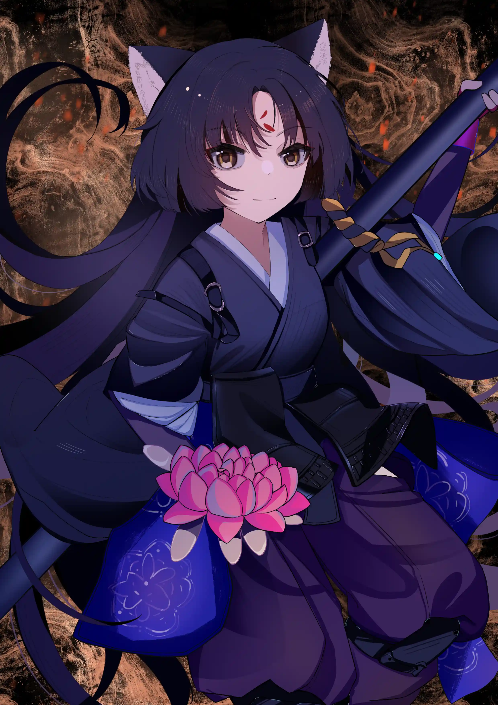

在神骸中浮起的兽物哀鸣着沉入星河，{.textkai}

金色的无边湖面再度变得沉寂之时，{.textkai}

嵯峨跪坐下来，{.textkai}

沉默地看着面前破碎的艾尔登法环{.textkai}

<!-- more -->

## 赐福·

葛孚雷和褪色者分别那天，法环尚未破碎，黄金树的繁茂枝条仍然遮蔽天空，树叶飘落如一场无止境的雨。

她是他们中的异教徒，她的信仰和她一起从遥远的芦苇之地跋涉而来，在金黄色的大树根下生出一棵异形的幼苗。但她又比所有人都虔诚而有天分，当其他褪色者还在一遍遍复诵玛莉卡女王的箴言、妄想着能从那只言片语中复原出黄金律法和黄金时代的哪怕一部分全貌时，她只是闭着眼席地而坐，金色的光环便自发地在她的周身亮起。

葛孚雷终究无法将双指信徒们灭除异端的呼声当作耳旁风，他找到她时，她正靠着一块大石静坐，她面前的地上生长着一棵发出九彩光芒的小树，细嫩的树枝和树叶在她的衣领和脸上投射出斑斓的光点。

她睁开眼，似是结束了冥想，又仿佛只是从小睡中苏醒。小树的幻影随着她的苏醒而消散，她看到高大的王，对他微笑颔首。

“葛孚雷施主。”她说。

“其他褪色者称我为王，你却称我施主。”

“您是褪色者的战王与领袖，但对小僧而言，您马上就要施舍给小僧一条生路，所以小僧就称呼您为施主了，”她站起身，掸掸身上的土，“葛孚雷施主，小僧要去了。”

她并未说自己要从哪去，也未说要去去往哪。葛孚雷看着她的眼睛，像是要从那双眼睛里看出答案来。她和葛孚雷擦身而过，此时他只需把那柄巨大的斧子横扫半周，便可替双指清扫一位微不足道的异教徒，但葛孚雷没有动，而是问了一个问题。

“你信仰什么？”

“施主，交界地上有多少不受黄金律法承认的族类？那些白金之子、混种、恶兆之子，还有死诞者与巨龙，他们与我们有什么区别？”她在他身后几步远的地方站定，“我们褪色者与地上的一棵小草、一只松鼠，与那些蒙大卢恩恩惠的神子又有什么不同？”

她再度迈开步子，这一次，她并没有停下来。

葛孚雷终于再度蒙获赐福、回到交界地觐见艾尔登法环时，那棵伸入天空的大树燃烧起来，都城淹没于雪般的灰烬里。不再有金黄色的落叶，也不再有映射着阳光的城墙，血色的余烬似乎永远没有尽头地从那棵垂死的大树身上剥离纷飞，像一场红色的大雪。

“许久不见了，蒙葛特……”

他臂弯里的尸体已经干枯，蜷缩成扭曲的一团，即便如此，那些丑陋的曲角仍然顽强地依附在上面，仿佛连一份体面的死亡都不愿留给它。葛孚雷松开手，任蒙葛特——他不被黄金律法承认的孩子——消散。

葛孚雷切实地感受到了赐福的指引。他已经记不清多久没见到那光芒了，久到仿佛这世上根本就没有赐福这事物，久到他面前的艾尔登宝座、他作为艾尔登之王的前半生似乎是一场大梦。如今那光芒粗实而强烈，像一道纯金色的彩虹，以他和他背后的褪色者为端点，将他和她的命运连接起来。

“葛孚雷施主，”褪色者盘着腿坐在地上，面前点着一堆小小的篝火，“多年未见，施主依旧壮勇不减当年，甚好甚好。小僧听闻施主蒙赐福指引、再度回归王都觐见艾尔登法环，特来与施主酌几杯淡酒、聊聊一路上的辛苦。”她抬起头，顺着那道光与葛孚雷对视，合掌。

葛孚雷走到褪色者面前坐下：“没想到你还学会了喝酒。”

褪色者头顶那对三角形的毛耳朵抖了抖。她从酒壶里倒出一小盅酒，泼洒在自己面前的地面上：“小僧是俗家弟子，酒喝得，肉也吃得。”

---

## 游僧·

直到他们聊了很久之后，葛孚雷才想起她的名字叫做嵯峨。嵯峨和葛孚雷以及其他的褪色者一样，在漫长的游历与漫长的死亡之后重新回到交界地，在掀开一道厚实的铁门之后像新生儿一样沐浴在黄金树温和的光芒里；但她又与其他褪色者不同，在觐见艾尔登法环的路上，她不杀人、不杀亚人，甚至连蛰伏在石缝间的老鼠也没杀过一只。她没杀过海边的海鞘和草甸上的羊，饿了就从马鞍袋里抓一把罗亚果干来吃，实在饿极了就拧开红露滴圣杯瓶喝一口。

“罗亚果实是好东西，宁姆格福遍地都是，小僧在林子里随便兜了一圈，采来的罗亚果实就连用衣摆接着都接不住啦，”嵯峨从衣袋里摸出一颗干瘪的果干，抛进嘴里嚼起来，“只消晒上半天就能做成果干，耐嚼又管饱，就是果皮晒干了和果肉黏在一起，实在有些涩得难以下咽哪……”

“不过小僧方才说一路不曾杀人，倒也不尽然，虽然实在称不上是‘杀’……”嵯峨的目光垂向地面，口中轻声念了一句“阿弥陀佛”。

嵯峨能度化死诞者。

猎人们信仰黄金律法，以圣律作为武器，期望着将那些从死亡中爬出的畸形生物连同那象征着玷污的法则一起彻底根除，让律法重归纯净与完美。嵯峨的天赋是极高的，她施放纠死圣律比最老练的死诞猎人还要快，范围也更大，她甚至不需要任何冗杂的动作，只是捻一捻手里的佛珠，就能完成祷告的过程。但她从来没有对任何人——尤其是死诞者——施放任何形式的圣律，她只是面对着那些枯瘦的白骨和它们空洞眼窝中跳动着的微弱光芒，庄重地合掌躬身，死诞者眼里的光便毫无征兆地消散下去，连带着那不成人形的骨架一起化作地上的一堆灰土。

“有许多死诞猎人找上过小僧，请小僧同他们一道猎杀死诞者，或是请求小僧传授给他们施放圣律的技巧；可小僧着实不知道何谓纠死圣律，也从没猎杀过死诞者，小僧只是见他们久久徘徊于交界地不得往生，实在心生不忍，念了几句经文之后他们就莫名其妙地自行消散了，”嵯峨抿了一口酒，从喉咙深处缓缓吐出一口热气，“其实师父曾经对小僧说过酒乃狂药，不可多饮，不过商人从来不卖，所以小僧也只能省着喝啦。对了，葛孚雷施主，你曾是艾尔登之王，想来对各种祷告了然于胸，你能不能告诉小僧，纠死圣律到底如何施放？”

嵯峨曾经受一位少女的指引，去往圆桌厅堂、在大赐福下打坐冥想，那里名叫柯林的信徒看中她的虔诚，试图引导她学习双指的祷告。

“柯林师父，你刚才施展的法术好生厉害，但咒文和动作太过繁杂，小僧头脑愚钝，实在记不住呀。”嵯峨看着柯林脚下冒出的金色符文，摇了摇头。

“你记不住？”柯林惊奇地瞪大了眼睛，“这是最简单的恢复祷告，就连那些山贼和佣兵里都有会用的，你光是坐在地上就能施放出远古黄金树的恩惠赐福，却记不住恢复祷告的咒文？”

“恩惠赐福是什么法术，小僧可从没用过呀！”嵯峨连忙摆手，“小僧只是一坐下冥想就觉得身体变得暖融融的，像是披了张厚毯子一样，但睁开眼睛之后毯子就消失了，至于祷告、施术，小僧可是一概不知，也从没有老师教过小僧。柯林师父，你再教小僧一遍吧，小僧想学习恢复祷告，为那些路上遇到的伤者缓解痛楚呀。”

柯林称得上是一位负责任的老师，但他只教了嵯峨咒文，却忘了告诉她施放祷告需要圣印记作为触媒；很久很久之后他离开圆桌厅堂、在王都跟从金面具参透黄金律法基本主义的奥秘，那时他又一次遇见了嵯峨，而她依旧用不出恢复祷告。

“柯林师父、金面具师父，小僧在城里见到一尊玛莉卡女王的雕像，”嵯峨坐在金面具身后的地上，一边从腰间解下水囊一边嘟囔，“雕像前面还有人刻了字，说是‘只有回归才能揭露秘密’。希望是雕像下面埋了些好吃的，小僧自打进了王城，口袋里的罗亚果干都快见底了。”

“玛莉卡？”柯林愣住了，“哪里有玛莉卡的雕像？”

“喏，就在黄金树大教堂下面，那根树枝的尽头，”嵯峨指了指，“小僧就是从那根树枝爬到这座山头上来的。”

“那明明是王夫拉达冈的雕像，”柯林的声音很低，似乎是不想打扰老师的思考，“你是不是看错了。”

“千真万确，那座雕像长发飘飘，和真人似的，”嵯峨继续翻口袋，“师父，小僧还在教堂里找到了这本书，上面记述了不少祷告，小僧看不懂，就把它送给你和金面具师父吧。”

就在柯林准备接过书的时候，金面具那僵死的手指突然再度活动起来。他连忙掏出本子将金面具的手势译成文字记录下来，随着写下的字越来越多，他的神情也变得愈发凝重。“拉达冈就是玛莉卡……老师，您怎么会计算出这样的结论？您那如乐曲般优美的动作、那精密的数学和推演怎么可能得出这样荒唐的答案？这种事怎么可能？！”

“是也是也，小僧也觉得离奇，玛莉卡女王和王夫拉达冈怎么可能是同一个人呢？”嵯峨也似懂非懂地露出沉思的表情，“师父，你说金面具师父是不是出错了？”

“老师是不可能出错的，老师的计算是——”柯林的目光落在嵯峨手中的祷告书上，他突然夺过书，飞快地翻阅起来，“黄金律法原本，回归与因果，回归性原理……你，是你！”他的声音不受控制地拔高，“你揭开了雕像上的秘密！是谁教会你回归性原理的咒文的？你怎么会知道拉达冈就是玛莉卡？！”

“这不是师父你方才说的吗，小僧也是刚刚才知道，书上的那些咒文和数字太难读了，小僧看上半眼就想打瞌睡，根本不知道教的是什么祷告，”嵯峨一脸茫然地摇了摇头，“不过小僧记得那雕像远远望去的时候倒像是拉达冈的模样，只是走近了一看突然就变成玛莉卡了；对了，小僧在城里打坐冥想的时候，脑子里还总有拉达冈和玛莉卡的影子，两人争夺一柄锤子，石台上的艾尔登法环也时而完好时而濒毁……师父，你说这王都里会不会是闹鬼了，难道小僧的脑子里出现了幻觉？”

柯林不知道该说什么，就像许多时日之后听到这段故事的葛孚雷不知道该说什么一样。只有嵯峨像个局外人一样一边往嘴里塞着果干，一边自言自语。

“拉达冈就是玛莉卡……拉达冈如何和玛莉卡是同一个人呢？好生费解，好生费解。”

施展不出圣律的嵯峨自然无法“杀死”死诞者，那些无法归树的灵魂飘荡在空中，总会回到某具骸骨里再度爬出坟墓。用她的话说，她只是“祈求佛祖保佑他们往生解脱”，就好像她超度葛瑞克安置在史东薇尔城内的那具飞龙尸体一样。

葛瑞克这个名字并未唤起葛孚雷的反应，装成女眷逃离战场、跪在敌人面前乞求饶命、靠“接肢”恶行换取力量，哪一条都称得上是对黄金血脉的羞辱。嵯峨在史东薇尔城里乱逛时误打误撞地摸进大殿前广场，见到那条死去的巨龙，便下意识地跪坐到它的身前念起经来。

“……区区褪色者如此僭越，竟敢触碰高高在上的巨龙，”一个庞大如肉球、又像是多足的蛆虫的身影出现在她的背后，“朕可是黄金之王，汝一个小小的褪色者，连被朕用作‘接肢’的资格都没有！还不赶紧在朕的面前跪拜！”

嵯峨并没有理会葛瑞克的威胁，她只是念完最后一句经文，起身向巨龙施了佛礼，就向广场外走去，仿佛她只是被风吹来的一片树叶，又即将被风吹走。葛瑞克在她身后抡动大斧，这大胆的僧人却将他视于无物，轻描淡写地躲过了他的砍斫，这份轻慢使他愤怒，愤怒使他贪婪，他贪婪地看着身旁的巨龙，用那柄刻着黄金与狮子的巨斧砍向自己的手臂——

“葛瑞克施主，身体发肤受之父母，这一斧子砍下去，胳膊可就长不出来啦，施主可要想清楚哇，断不可因一时气迷心窍，做出悔恨终生的谬行呀！即便是施主犯下‘接肢’罪行，甘愿受报应责罚，也不一定要断臂自省，还请施主万万三思，万万三思呀！”嵯峨抽出薙刀架住斧柄，苦口婆心地劝道。

葛瑞克有些迷茫地盯着嵯峨，悬在手臂上的巨斧迟迟没有落下。她见葛瑞克手上不再用力，便收起刀后跳一步：“善哉善哉，施主迷途知返实在难能可贵，希望施主从此改邪归正，切莫再做恶事傻事啦。小僧还要喂马，这便走了。” 

葛瑞克看着僧人走出广场，突然歇斯底里地吼叫起来，像个疯子一样把自己的左臂砍下、狠狠地剁成几截。

“……一个和尚，一个和尚竟敢如此对朕僭越！朕可是，朕是黄金君王！啊啊啊啊啊啊啊——该死的和尚，对黄金一脉的力量一无所知！朕的巨龙，与朕一样贵为后裔的巨龙，就此将汝的力量化为朕的‘接肢’——”

他颤抖着把鲜血淋漓的残肢插进巨龙的身体，随后将龙首整个撕下，作为自己手臂的延展。黄金之血流进龙首，他只需要像驱使自己的小指一样动动念头，巨龙的口中就能发出咆哮、喷出火焰。

但巨龙并未回应他沙哑的吼叫，血从它的齿缝之间流出，渗进泥土里。

“巨龙，汝为何不回应朕！喷出火焰！烧死那个狂妄的褪色者！巨龙，汝竟敢不动！朕可是黄金君王，汝必将顺从朕的旨意！”葛瑞克把龙首在地上摔打，模糊的血肉黏在灰白色的石砖上。

龙的眼窝里黑漆漆的，腐烂的皮肉下面露出石头般坚硬的白骨。

龙死了。

“后来小僧再没有见过他，也没有见过他的龙，”嵯峨掏出一个布包，里面装着几只煮熟的虾子，“葛孚雷施主，你尝尝，这虾子可好吃了。”

---

## 虾子·

说起虾子就不得不提起一个戴着囚犯头罩的流氓，而说起流氓就不得不提起一个总是弓着背的名叫菈雅的女孩。嵯峨在利耶尼亚湖里被大螃蟹追着跑的时候躲进了一间小亭子里，被站在那里的女孩吓了一跳。

“前面那间破屋里的流氓抢走了我的项链，如果可以的话，我想拜托小师父帮我拿回来。”女孩的声音怯生生的。嵯峨拍拍胸脯表示包在自己身上，随后她绕着菈雅打量了两圈，扳直了她的背：“菈雅姑娘，总是驼着背对身体不好，而且会显得很没精神，你看，像小僧这样昂首挺胸的，整个人才显得有干劲呀！”

直起身来的菈雅比嵯峨高了一个头还多，嵯峨在她略显迷茫的目送中和她告别、沿着她指出的方向来到那座破屋前。半朽的木板墙下面架着一只铁锅，咕嘟咕嘟冒泡的汤汁里面泡着煮成橘红色的虾子，流氓就坐在墙边的石头上，铁面具挡住了他的脸和表情。

嵯峨耸了耸鼻子，坐到流氓的对面，盯着锅里的虾蟹两眼放光：“施主，这锅子可是你的，小僧能否向你讨些虾子果腹？小僧身上有卢恩，不会吃白食的。”

“不想死的话就滚远点，”流氓很不客气，“别来烦老子。”

但僧人并没有滚，她自顾自地解下包袱、从里面捧出一大把零零碎碎的黄金卢恩，推到流氓面前满眼期待地等着他的答复。

也许是嵯峨咕咕叫的肚子软化了流氓心里的某些东西，也许他只是不忍看着卢恩堆得太高掉进水里。他冲着嵯峨扬了扬下巴：“吃。”

“……施主，你这虾子煮得真香，”嵯峨被烫得直吐舌头，“小僧回到交界地以来第一次吃到这么好吃的东西，阿弥陀佛，多谢施主啦！施主，小僧能不能多吃几只？”

“你付的卢恩足够把这些虾都吃完了，”流氓看着大口吃虾的僧人，“你怎么带着这么多卢恩赶路？死在外面可就分文不剩了。”

“嗯？这些卢恩很多吗？小僧只记得一路捡了许多玻璃块、遗迹石，捡多了就卖给商人，不知不觉就攒了一大包卢恩啦，倒也弄丢过许多，不过交界地上到处都是石头玻璃，丢了再从头攒起就是了。师父说过，心无挂碍，故能无有恐怖，究竟涅槃，要是因为丢了些卢恩就愁眉苦脸的，那可实在是本末倒置啦。”

僧人的眼神真诚，于是流氓紧绷的神经终于松动下来：她始终没掏出武器，看起来也不怎么聪明；况且，喜欢吃虾子的人在他看来都坏不到哪去。他们在愉快的交谈中分享了刚煮熟的虾，虾壳在锅边堆成一座小山，两人吃饱了就揉着鼓胀的肚皮大字躺在石头上，看着暗白色的月亮逐渐从湖和山的尽头升起。

“你可真能吃，把我的虾子全都吃光了。”

“嘿嘿嘿……小僧这几日忙着赶路，腹中实在空空难耐，一不留神就吃了这么多。不过施主你可真厉害，这湖中到处都是大虾，小僧躲都躲不及，施主反倒能在它们眼皮底下捉小虾来吃。”

“这算什么，”流氓笑了笑，指着天上静止了不知多少年月的星星，“看到了吗，连星星都能被人捉住，何况几只不值一提的虾子呢。”

“施主，小僧听闻你拿走了一位姑娘的项链，可否请你把它交给小僧呢？”嵯峨打了个饱嗝，把头转向流氓。

流氓爽快地把项链丢给了嵯峨，毕竟她看起来不坏，而且很喜欢吃虾子。

“别死在外面了，”嵯峨离开的时候，流氓朝她挥手，“要常回来买虾子吃。”

嵯峨一攒下些卢恩就去找流氓买虾子，直到她穿过坑道、爬上亚坛高原，流氓的铁锅也沿着河湖一直支到了王城的脚下。那位名为菈雅的少女也经常出现在嵯峨的旅途中，她还是喜欢弓着背，嵯峨也喜欢一见到她就帮她挺直身子。她曾经牵着嵯峨的手回到自己的家——格密尔火山的官邸。

“小僧其实并不喜欢那里的气氛，”嵯峨在某一次与流氓分享虾子的时候聊起火山官邸，“那里的女主人塔妮丝施主虽然热情好客，但火山官邸不仅反叛黄金律法，还大张旗鼓地追杀其他褪色者，你看，这是他们给小僧的委托书，”她掏出几个信封，“这是追杀伊修托邦施主的、这是追杀‘大角’忒格拉斯施主的，还有巴格莱姆施主和霍斯劳施主的。”

“小僧虽然也不全然信奉黄金律法，但对褪色者举刀相向的事，小僧是断然不会做的，”嵯峨闭上眼睛，“大家皆不过是这茫茫交界地上的一根萍草，何故无端夺人性命呢，更何况几位施主都帮过小僧许多，小僧做不出这恩将仇报的行径。”

流氓并未对嵯峨的立场做出评判，他只是看着嵯峨把信封丢进火里，火苗把纸张侵吞成几块难以辨识的焦炭。

“喏，吃蟹子。”他说。

嵯峨犹豫了一阵，还是告诉流氓她无意间撞见菈雅露出真身的事情。

“小僧听闻火山官邸做下不少见不得人的勾当，菈雅姑娘的身世也并不像塔妮丝施主对她讲的那样特殊，小僧心下很是不忍，不知该不该把真相告诉她……”

“她啊，”流氓回忆起了这个名字，用勺子搅了搅锅里的虾蟹，“和你我一样，是个被命运拨弄的可怜人罢了。再怎么说，至少我们都还没死在路边，这还不够好吗？”

嵯峨并不喜欢“命运”这个词，她沉默着点了点头，动手拆蟹。

火山官邸的领主拉卡德在她离开的时间里被某位叛律者谒见并杀死，她再度回到官邸时叛律者们已作鸟兽散，只有一个光头蹲在门口，看上去失魂落魄。光头名叫帕奇，关于他如何用传送陷阱让嵯峨陷于卢恩熊的血盆大口之下、又如何把她从悬崖上一脚踹到谷底，已没人记得。菈雅不知所踪，只有一封字迹拙朴的信留在她的房间里。

“为了总有一天能够以塔妮丝之女的身份继承火山官邸的壮志，我将出门四处游历。

“您一直以来都非常温暖。再会了，小师父。”

嵯峨后来几乎寻遍了整个交界地，却并未再见到过那个弓着背的女孩，也没见过一个总是怯生生的蛇人姑娘；她总是去找流氓吃虾子和螃蟹，两个人都很幸运，即便到了嵯峨踏入红狮子要塞的那天，谁也都还没死在路边。

---

## 野狗·

嵯峨总说自己是个守戒律的僧人，从不杀人。褪色者能在赐福的指引下一次次复活，所以杀褪色者不算杀人；神人和半神的体内流淌着一半神祇的血液，所以杀两个半神才勉强算是杀了一个人；至于她后来把梅琳娜送给她防身的短刀刺进艾尔登之兽的躯体，实际上杀死那兽的是刀尖上流淌的命定之死，也就是说杀死它的应该是梅琳娜而不是嵯峨。所以严格来说，她并没有破戒。

她抬起头看向厨子，厨子白了她一眼，接过碗给她添了第三碗饭。

“你到底是不是来参加战斗祭典的？”厨子看着狼吞虎咽的僧人，终于忍不住开口，“其他人都在为大典做准备，你怎么只顾着吃饭。”

“战斗祭典？”嵯峨环顾四周，其他褪色者果然都忙着保养自己的武器和盔甲，只有她抱着饭碗坐在饭摊旁边，“小僧还以为是城里在施粥哪，罪过罪过。施主，这餐饭多少钱，小僧付给你便是了，至于战斗祭典，小僧不喜打打杀杀，就不掺和啦。”

当然，参与不参与祭典并不是由她说了算的。红狮子城的主人杰廉盛情欢迎了来此的褪色者们，随后宣布了祭典的开始；嵯峨被人流裹挟着涌入正厅，背后金黄色的雾门在她的视野里渐渐缩小成一个难以分辨的亮点。

“施主，小僧初来乍到，敢问施主这战斗祭典是怎么一回事？”嵯峨向身旁的褪色者施了一礼，“小僧见大家都很是重视祭典，莫不是要大家决一死战，决出最后的胜者？”

“决出胜者？”褪色者像看傻子一样打量了她一番，“仔细看看吧，我们中的所有人，包括那一位，都是这场祭典中的失败者。这是为那一位举办的一场盛大的葬礼啊。”

嵯峨顺着他的目光看向远处的沙滩，那里伏着一只巨大的野狗，它以遍地的尸骸作为食粮，不时抬起头向着天空发出震耳欲聋的嘶吼。

不知为何，嵯峨从那只野狗的嘶吼中听出了难以言说的悲伤。

“小僧大概懂了，那小僧便与各位施主一同去超度那一位吧，”嵯峨和那个褪色者一起踏上升降梯，“还未请教施主姓名？”

“我和他们一样，是无数为拉塔恩将军送行的无名者之一而已，”褪色者摇摇头，往头上扣了一个小恶魔头罩，“在赐福点再见面吧，如果你还能遇见我的话。”他们踏上松软的沙滩，远处的野狗，或者说是拉塔恩将军注意到了这群褪色者，他直起身来，抽出背后的大弓。

不知谁第一个回应了拉塔恩的怒吼，于是褪色者们散开、前进，像一群对着山脉冲锋的蚂蚁。

嵯峨第一次看清拉塔恩那双浑浊的眼睛时，他正扬起大刀，刀刃像斩断一根稻草一样轧过她的脊柱；几秒钟后她在赐福的光芒中重新变得完整，在短时间内从两截变成一截对于褪色者来说并不是难事，只不过新生的她走起路来像一只倒立的企鹅，还没迈出几步就被一根粗大的巨箭洞穿了胸口。

疼痛积累得太多就变成了麻木。她用了十几次死亡学会扛着满身的箭矢像一只刺猬一样向前滚行，又用了额外的十几次死亡在遍地的残肢断臂里找到了一个裂成两半的小恶魔头罩，当她终于把那个头罩收进背包的时候，已经死而复生了整整五十次。但拉塔恩的眼神也在她心里烙得越来越深。她看着他用附着岩石的战刀击碎巨大的壶战士、用遮蔽天空的箭雨染红指头修女的祈祷；披着黑色斗篷的半狼战士像一道黑色的月光一样高高跃起，剑刃在他的盔甲上溅起冰蓝色的火花，狼和他的巨剑在下一秒被拉塔恩像轰苍蝇一样扇飞出去。她在拉塔恩挥动武器的间隙跑到他巨峰般的身躯下面，他的两条腿已经残缺，却依旧健壮如两棵巨木，她在两棵巨木之间看到一匹皮包骨头的瘦马，马抬起嶙峋的脖子，冲着她喷出带着敌意的鼻息。她仰起头，锈迹斑驳的刀刃上映出拉塔恩那双野狗般的眼睛。

她闭上眼，听着刀锋劈开空气、把皮肉和骨头斩成碎片。

在漫长如死亡般的死亡里，即使是褪色者也会感到疲惫与厌烦，很多人走了、很少人填上空缺。大家明白半神的生命不该由讨人嫌的褪色者来终结，于是战斗渐渐被祭典所取代，战士们表达了对拉塔恩将军悲惨境遇的痛惜之后各自散去，只有一个死脑筋的僧人还在一遍遍地死去又爬起。

嵯峨在赐福的光芒里睁开眼睛，刚才被砍断的腿又长了回来，她转过头，看到旁边一个褪色者正在堆成小山的尸体里翻找有用的装备。

“你没死啊，差点就把你的盔甲脱走了，”褪色者收回了伸出一半的手，“这里有不少没人要的破铜烂铁，正合适拿去重锻一副盔甲，我这身被腐败狗咬得没法穿了，一活动就叮当乱响。”说着他甩了甩胳膊，他身上的铠甲十分配合地发出悦耳的响动。

“你是来干什么的？”褪色者把地上的无主防具塞进口袋里，用余光瞥了一眼正在发愣的嵯峨。

“小僧是和大家一起来参加拉塔恩将军的战斗祭典的，”嵯峨站起身，抖了抖僧衣上的浮土，“只不过其他人都走了，祭典里现在只有小僧和拉塔恩将军两人。”

“拉塔恩的祭典？”褪色者仿佛听到什么可笑之极的词汇，他放下手里的活计坐在地上，“那和你有什么关系？”

“小僧听其他人说，拉塔恩将军当年与女武神玛莲妮亚一战，被她以猩红腐败侵入体内，自此徘徊于这遍地尸骸之间，囿于不得生不得死之境。小僧一心为拉塔恩将军于此境中解脱，”嵯峨合起双掌，“所以一直留在此地，想寻得一条可行之路。”

褪色者打量着她身上破得分辨不出形制的僧衣和软甲，像是怜悯这个僧人的苦功，又像是可惜这身装备根本不值得扒：“听起来挺辛苦的。”说完他又从死人堆里扒出一把还没生锈的直剑，看起来稍微打磨一下就能用。

“施主，你可知道拉塔恩将军曾经以一己之力击退坠向盖利德的陨星，又亲手封印了这漫天繁星，使它们再也不得流转？”嵯峨抬起头，墨蓝色的天幕笼罩在盖利德的猩红土地上，仿佛一幅巨大的油彩画，“星星静止后，无数人的命运也就此停转，只能如行尸走肉般活在世上，消耗此生余下的时日。”

“那和我有什么关系，”褪色者从鼻子里哼出一声，“我就是个褪色者，没什么命运，也看不见这条命的尽头，每天都有新的死法，想想还挺值得期待的。”

“小僧有时候想，星星的命运被拉塔恩将军锁死，拉塔恩将军的命运又被体内的猩红腐败锁死，连同盖利德的士兵、拉塔恩的红狮子骑士，全都把自己的命运锁死在这片畸形的土地上。所谓命数天定，但小僧并不喜欢被别人划定命运的感觉。小僧想要去打破它。”嵯峨站起身，她手里的薙刀有些钝了，但还能支撑一场战斗。褪色者看着她走向升降梯，问了一句：

“你要打破这些东西，那和拉塔恩有什么关系？”

嵯峨回过头笑笑：“谁知道呢，拉塔恩已经解脱，小僧只是去杀一只发狂的野狗罢了。”

“那你的路呢？”褪色者背起鼓鼓囊囊的包裹，和她向相反的方向走去。

“已经找到了。”她缓缓下降。

---

从前曾开放过一朵鲜花，一片猩红的土地在它绽放那一刻诞生。

从前曾开放过一朵鲜花，一位半神在绽放中癫狂、陨落。

从前曾开放过一朵鲜花，战争在绽放中走向不存在胜者的终局。

嵯峨跪在松软的沙土上，拉塔恩山峦般的身躯在她的面前逐渐放大，但她没有躲闪也感不到紧张，一根长矛在她坠落的时候穿过她的肋骨，现在她快要喘不上气了。她看着拉塔恩那双空洞的眼睛，闭目合掌，口里不住地念出带着血沫的字。

瘦马盯着眼前的褪色者，她的身体泛起九种颜色的光。

后来又开放了一朵鲜花……

“罪过，罪过……”她说，不知是对自己、对拉塔恩，还是对马。

她和拉塔恩一起被光吞没，一朵接天的莲花盛开在沙滩上，它的花瓣舒展开时，仿佛有三万三千个太阳在盖利德的地平线上升起。

---

## 生肉丸·

“拉塔恩是一位值得尊敬的战士。”葛孚雷点了点头。

“拉塔恩是个疯子，”嵯峨灌了一口酒，“交界地上有很多疯子。”

菈妮也是个疯子，她谋杀了自己的肉体和另一个可怜人的灵魂，自己寄宿在一个不老不死的人偶里面，整天坐在垫着几本书的椅子上等待着某个褪色者来为她做事。嵯峨后来听说她杀死了引导她的双指，而那个帮她做事的褪色者用一枚冰冷的暗月戒指从她手里换来了冰冷的暗月大剑，从此不知所踪，留给她黑夜彼端所有的孤独。

嵯峨与菈妮的交集止于一枚精巧的铃铛和一个装骨灰的盒子，只要把骨灰撒在地上，再摇摇铃铛，就能唤起那些未能归树的灵魂。嵯峨不很喜欢把灵魂们叫出来，它们太不安生，也听不懂她说的话，只会抡着武器四处乱砸，嵯峨修好被它们砸坏的篱笆和瓦罐，还得仔仔细细地把它们飘得到处都是的骨灰重新搜集起来。

所有的灵魂都不如仿身泪滴有趣。一是因为泪滴从不四处乱跑，而且没有骨灰，清理起来省事很多；二是因为骨灰们大多太过阴郁，虽然忠诚却也执拗，而泪滴和嵯峨很像，不光长得像，而且和她一样看起来没什么心事的样子。

“泪滴，你为何生得与小僧如此相像？小僧以为面前立了一面镜子。”嵯峨打量着面前的自己，只不过那个她有些灰蒙蒙的，像笼着一层黑夜。

“因为我是仿身泪滴，”她回答，眼睛盯着嵯峨身旁的包袱，“我就是你。”

“你就是小僧？这可奇了，世上自然是只有一个小僧的，”嵯峨挠了挠头，“如果你是小僧的话，小僧又是谁呢？”

 {.centering}

“你说得对，如果我是你的话，你是谁呢？”泪滴也挠了挠头，“可如果我不是你的话，我又是谁呢？”

两个人沉默了一阵，泪滴盯着赐福跃动的光芒，嵯峨解开包袱的时候，她开口了：“我明白了。我就是你，而你是个疯子。”

“小僧是个疯子……”嵯峨抬起头看了看泪滴，点了点头，“你说得对，小僧着实是个疯子，那想来泪滴你也是疯子了。”

“我是疯子。把灵魂留在骨灰里的全都是疯子，虽然我没有骨灰，”泪滴指着嵯峨腰间的铃铛，“别把我召收回去，我不想和它们待在一起，盒子里太闷了。”

泪滴指着嵯峨的包袱：“永恒之城里没有虾子，我想吃虾子。”

虾子是流氓卖给嵯峨的，包袱里有很多，她很大方地取给泪滴来吃。

“真好吃，没想到虾子的味道是这样的，”泪滴吃完了一只虾子，“我以为它们和蚂蚁一样硬。”

“蚂蚁好吃吗？”

“不知道，我没吃过蚂蚁，”泪滴摇摇头，“或许和虾子一样好吃。”

泪滴又指着嵯峨的包袱：“永恒之城里没有螃蟹，我想吃螃蟹。”

螃蟹也是从流氓那买来的，虽然比虾子贵一些，但她还是分给了泪滴。

“真好吃，螃蟹的味道和虾子不一样，”泪滴吃完了一只螃蟹，“它们都这么大吗？看起来像永恒之城里的大铁球一样。”

“不全是这么大，小螃蟹很可爱，大螃蟹能把你从马上打下来，”嵯峨抬起左手又落下，“再来一下，你就死了。”

“我没有骑过马，”泪滴摇摇头，“等我遇见了大螃蟹我会离它们远一点的。”

“你遇见虾子的时候也要离远一点。”嵯峨补充。

泪滴最后一次指着嵯峨的包袱：“永恒之城里没有生肉丸，我想吃生肉丸。”

生肉丸是战士壶们送给她的，她只随身带着三个，舍不得吃。

“这生肉丸都放得太久了，快坏了，”嵯峨把有些发黑的粉红色肉丸展示给泪滴看，“你吃了肚子会不舒服的。”

“我是仿身泪滴，没有肚子，”泪滴说，“不会不舒服。”

这似乎是一个无法反驳的理由，嵯峨犹豫着，那三颗小丸子像是她的贪嗔痴，只要被泪滴吃了就能断得彻底。

“小僧死了上百次才换来这几颗，”她对泪滴解释，更像是想要说服自己，“如果你还想吃虾子和螃蟹的话，小僧可以带你去吃。那位施主锅里有吃不完的虾子和螃蟹。”

“我死过数万次、死了数万年，”泪滴看着嵯峨的眼睛，“无数个我死在了永恒之城静止的夜空下，我是我们中唯一活下来的，但我没见过虾子和螃蟹，也没见过生肉丸。”

嵯峨的手离泪滴不到半米，她只要收回手、把生肉丸放进包袱里，泪滴或许就再也不会朝她要。师父对她说过在外修行要以慈悲为怀，她已经给泪滴吃了很多虾蟹，地下的夜空在几万年里也不曾闯入过一只虾子，她给泪滴的慈悲够多了。

“如果你给我吃一颗生肉丸的话，我会帮你成为艾尔登之王。”泪滴说。

“可你就是小僧，如果小僧成了艾尔登之王，你也就成了艾尔登之王，”嵯峨把手往回抽，“你和小僧一样都是疯子，疯子不能成王。”

“交界地不需要王，它需要疯子。”泪滴抓住她的手，她第一次发现泪滴的皮肤真的像一颗泪滴一样冰凉又光滑。

“但是神和指头需要王，”嵯峨看着泪滴，泪滴吃掉了一颗生肉丸，“神和指头不需要疯子。”

“疯子也不需要神和指头，”泪滴把手伸向第二颗生肉丸，“交界地上有很多疯子，很多很多。”

“小僧就是疯子，你也是疯子，”嵯峨很想尝尝生肉丸的味道，“疯子不需要神和指头。”

“生肉丸已经变质了，你吃了肚子会不舒服，”泪滴抢在她前面拿起最后一颗生肉丸，“如果你给我吃一颗生肉丸的话，我会帮你成为交界地最大的疯子。”

---

## 旅行·

如果一颗微不足道的石子挡住了路，人们会把它一脚踢走、从它的上方迈过；如果石头大到把路堵住，人们就翻越它、绕过它，把它从路上推开；可是有一棵粗壮如山岳的大树，即便强如蛮荒之地的战王也不能撼动它的根基，所有人的所有去路都被它阻拦，所有生命只能化为它的养分，或是成为它的异己。

后来一个傻子走到树下，她看着挡住道路的大树，和树下所有不得前行的生灵。

“你们都是傻子吗？”她说，“为什么不把树烧了？”

梅琳娜并不是傻子，傻子是不会把一匹灵马托付给嵯峨这样的褪色者的，更不会跟着她一路旅行。

“梅琳娜施主？”嵯峨坐在托雷特背上，有些心虚地望向脚下深不见底的悬崖，“梅琳娜施主，小僧……施主可否现身帮帮小僧？”

于是梅琳娜出现在悬崖上方，看着急得满头冒汗的褪色者：“如果你想听的话，我会向你复诵玛莉卡的箴言。”

“小僧现在不是很想听玛莉卡的箴言，”嵯峨紧紧抓着缰绳，生怕托雷特一脚踏空，“施……如施主所见，小僧方才失足坠崖，现在急需一条登上悬崖的生路，虽说摔下去一眨眼就能在赐福醒过来，但毕竟……”

疼。

她眼巴巴地望着梅琳娜，希望她能从崖边放一条绳子下来。梅琳娜并没有带绳子，她看着嵯峨，皱了皱眉：“褪色者，我以为你们穿越浓雾而来，至少还保留着骑马的记忆。”

“小僧见其他褪色者骑过马，”她仰起头和梅琳娜对视，“小僧行路的时候骑过流浪商人的驴子。”

梅琳娜站起身，轻轻地叹了口气：“托雷特可以跳跃，在空中还能再腾跃一次。上来之后继续沿着赐福的光芒前进吧，褪色者。托雷特选中了你，希望你不要辜负它。”

嵯峨笨手笨脚地使唤托雷特起跳，梅琳娜戴上兜帽，身形消散在一抹淡淡的光芒里。行走在交界地许久以来，她第一次觉得自己看不懂一个人。

嵯峨其实很好懂。梅琳娜偶尔会在赐福旁现身，为褪色者讲述玛莉卡女王的箴言，当她仰起头轻声复诵的时候，嵯峨总会坐得端正，并在她说完最后一个字后掏出包袱，把最饱满的几颗罗亚果干塞进梅琳娜的手里。后来嵯峨认识了流氓，送给梅琳娜的食物也从罗亚果干变成了虾子和螃蟹，只不过依然是最大最饱满的。

梅琳娜不吃东西，嵯峨给她的都会被她不露痕迹地塞回包袱里。

“这个地方也存在着玛莉卡女王的箴言……嗯……嗯？”梅琳娜坐到赐福旁边的时候愣了一下，“这是另一个你吗？这个你看上去并没有恶意。”

“我就是她，”泪滴说，“小盒子里太闷了，所以我希望以这副样子跟在她的身边。”

“我的名字是……”

“你是梅琳娜，她和我提起过你，”泪滴打断了梅琳娜，她从嵯峨手里接过包袱，拿了一只虾子递过去，“你送给过她一匹灵马，虽然你没有送给我灵马，但还是谢谢你。”

“阿弥陀佛，泪滴，小僧早已谢过梅琳娜施主许多许多次了，”嵯峨接过话茬，“梅琳娜施主，小僧本想多给你留些食物的，奈何泪滴她……”

“生肉丸都被我吃了，”泪滴大方地承认，“永恒之城里没有生肉丸。”

---

梅琳娜失去了自己的身体也忘记了自己的使命，所以她拜托褪色者把她带到王都、那棵高耸的巨树脚下，想要在这趟行程中回想起自己仍然活在世间的缘由。那并不是一趟轻松的旅行，路上要收集迪可达斯大升降机的符节，还要征讨各路半神与君主，许多褪色者哪怕没有指头修女的陪伴、宁可独行也不愿答应梅琳娜的请求。

“一匹灵马，那又怎么样？”褪色者们不屑地拒绝了她递来的戒指，“随便杀个骑兵不就有马骑了？”

只有嵯峨愿意带着她一起旅行，因为骑着一匹会二段跳的马对她来说是一件很新奇的事情，更何况路上并不缺吃的，即便后来多了泪滴，嵯峨也总能省出一份食物分给梅琳娜。

她们爬上利耶尼亚谷底长长的梯子，穿过潮湿的亚坛坑道。梅琳娜站在坑道出口旁的小山丘上，亚坛高原上的一切都被远处那棵望不见树冠的大树染成金色。与黄金树相比，太阳像是它枝头挂着的一颗苹果，梅琳娜看着那颗苹果，想象着它在自己的视野中膨胀、点燃黄金树的枝叶。

嵯峨其实很好懂。梅琳娜与许多褪色者交谈过，他们说出每一个字之前都要经过长久的权衡：把卢恩化作智力还是力量？该不该从她手里接过灵马哨笛？要不要成为艾尔登之王？究竟更喜欢她还是菈妮……嵯峨则从不藏着掖着，虾子吃完了就大大方方地承认今天只有罗亚果干吃，梅琳娜摘下兜帽的时候她就夸她长得真漂亮。

“很多人不喜欢褪色者，”嵯峨说，“但梅琳娜施主依旧愿意与褪色者一同旅行。小僧有时候在想，如果世上没有了褪色者，施主是否会和其他人一起同行？”

梅琳娜沉默了。如果没有褪色者，她或许会选择与一只渡鸦作伴，她骑着托雷特，渡鸦站在她的肩膀上，和她一起乘着灵魂气流飞上亚坛高原。但没有能够直接飞上亚坛高原的灵魂气流。或许渡鸦能自己飞上亚坛高原，但不太可能替她潜入要塞、衔着迪可达斯符节飞回她的肩上。她该找一个白金之子，最好是女性，她可以为她找一匹离群的野狼，骑着狼的白金之子一个人就能杀死像葛瑞克那样孱弱的半神末裔，她们可以一起盗取迪可达斯符节，然后在城里的篝火旁看星星。

可是渡鸦或者白金之子不被黄金树认可，他们死去之后不会在赐福点再一次爬起来，也就不可能继续带着她寻找使命。

“其他人和你们褪色者不一样。”梅琳娜说。其实她很想与渡鸦一起旅行，渡鸦很聪明，能听懂她的话，不像褪色者这样吵吵闹闹的。

“但我们和它们并没有区别，万物生老病死，是黄金律法在万物之间划出界线，”嵯峨摇摇头，“黄金树排斥它们，只是因为被接受的生灵能够归树、成为它的养分。”

“我一直在回想自己的使命，关于我为何在死后仍然以灵体存活在交界地上，”梅琳娜坐到嵯峨对面，“在来到黄金树脚下后，我隐约回忆起了一些，我想我的使命就与那棵树相关。”

“我不喜欢这棵树，”泪滴摇摇头，“它那么大，挡住了所有人的路。”

“我要把它烧了。”泪滴说。

在某些方面，泪滴比嵯峨更像个疯子。梅琳娜皱了皱眉，她告诉泪滴，燃烧黄金树在律法里是绝对不可触碰、不可饶恕的重罪。

“梅琳娜施主说得对，”嵯峨郑重地点了点头，“黄金树生长了不知多少年岁，这么大的树，一把火烧掉实在太过可惜。”

在某些方面，嵯峨比泪滴更像个傻子。

“要烧这么大的树，肯定需要很大很大的一把火才行，”她看向梅琳娜，“梅琳娜施主，你知道哪里有这样的火吗？”

---

## 炬影·

火焰巨人大锅的边沿积着一层薄薄的雪，它安静的时候像一座山，又像一座冰冷的坟墓，坐在上面时，介于钢铁和岩石之间的冰冷触感从屁股下面直接蔓延到灵魂里。

“你们烧了黄金树，”葛孚雷盯着面前的褪色者，眼神不似他们刚刚重逢时那样平和，“这是无人能宣判、也无人能行刑的滔天重罪。”他背后的雄狮——“野兽宰相”瑟洛修对着嵯峨露出尖牙，如果艾尔登之王把手伸向武器，它将先他一步咬断这个人的喉咙。

“不是‘我们’，”嵯峨纠正，“是小僧一人烧的。”

梅琳娜站在大锅的边沿，黄金树的枝叶在她的脸上投出细碎的影子，美得像一场不真实的梦。她用手指遮住黄金树的光芒，望向它和它脚下的土地。有那么一瞬间，她承认自己动摇了，烧毁黄金树不但是律法和指头所不能宽恕的重罪，也是她自己在那一瞬间所不能接受的恶行。

泪滴正气喘吁吁地把捆成捆的木柴向锅里抛去，附近的枯木很多，足够铺满整个大锅的底部，但梅琳娜知道即便把整座雪山上的树都砍来、把燃料装满整个大锅，也不可能燃起焚烧黄金树的不灭之火。

“快来帮忙，”泪滴甩了甩酸痛的胳膊，“这么点木头，连锅沿上的积雪都烧不化。”

从大锅回到雪山要走一条长长的铁链，她们背着沉甸甸的木柴，脚下是深不见底的山谷。泪滴一边走一边哼着不知道从哪学来的走调歌曲，梅琳娜看着她背上被木柴磨破的衣服，犹豫着该不该告诉她这场闹剧的真相。

“我累了，”泪滴把木柴往铁链上一撂，自己跟着一屁股坐在铁链上，“我们休息一会吧。”

梅琳娜坐在泪滴身旁，低着头看自己的脚尖。她想，如果褪色者从这里失足跌落，一定在尸体还没落到谷底之前就已经在赐福点重生了，新生的身体站在崖边，可以听见上一个自己摔在地上的闷响。

“你会唱歌吗？”泪滴晃着腿，把头扭向梅琳娜，“我在永恒之城里能听见附近的祖灵之民唱的歌，但总是学不会。”

很久很久以前，梅琳娜或许学过一支古老的歌儿，她想，如果有一个褪色者愿意听她讲完玛莉卡的箴言，她就把那支歌儿唱给那人听；但褪色者们都十分急躁，他们不耐烦地挥挥手，让她赶紧把手伸出来、帮他们把卢恩化作力量。于是在寻找旅伴的漫长时光里，那支歌儿被她渐渐地藏在心底，直到连她自己都忘了怎么唱。

梅琳娜不会唱歌，她摇了摇头：“如果你想听玛莉卡女王的箴言……”

泪滴不想听，实际上，整个交界地上似乎只有嵯峨愿意听梅琳娜一遍又一遍地复诵那些拗口又晦涩的古老箴言。她看向大锅的顶端，嵯峨仍然盘着腿坐在赐福旁冥想，远远看去就像是大锅上的一颗铆钉。

“她已经坐在那五六天了，”泪滴指了指嵯峨的方向，“自从我们找到这口大锅之后，她一动都没有动过。”

梅琳娜站起身来，但泪滴挡住了她的路，她居高临下地看着泪滴，泪滴拿过木柴抱在怀里。

“你想作为火种，投身到那口大锅里，对吗？”泪滴看着脚下的深谷，“这就是你仍然活在世间的意义，对吗？”

她看向黄金树，点了点头：“我想要修复这个濒毁的世界、让死亡和生命一样平等地降临，我知道自己是在恳求你们犯下重罪——”

“不不，”泪滴从木柴捆里抽出一根，伸向前方，“我知道你想做什么，你不用担心，火种我们会准备好的。”她松开手，木柴旋转着落下，很长时间之后才有轻不可闻的闷响乘着风飘上来。

梅琳娜警觉地后跳一步，从腰间掏出一把弯曲的短刀指着泪滴的脖颈：“她受赐了癫火。”

“什么是癫火？”泪滴抬起头看着梅琳娜的刀锋，“她是个疯子，疯子的火焰就是癫火。”

嵯峨在啜泣半岛安葬过一位目不能视的少女，又在玛莉卡第二教堂安葬了一位帮她击退血指的老猎人；或许若干年前某个绝望的褪色者推开过王都下水道尽头那扇厚重的大门，或许若干年后某个迷路的褪色者会蹚着遍地的流浪商人尸体、沿着一块块石碑跳下，但他们都不是嵯峨，嵯峨没有见过名为海妲的灯火修女，也没有遇到过自称夏玻丽丽的癫狂男人。

“你知道她的火焰虚像是什么吗？”泪滴突然问。

解指老妪曾经告诉嵯峨，巨人大锅的火焰需要能够看见火焰虚像的人作为引火物才能点燃。梅琳娜能够看见虚像，她的虚像中，人和半神平等一致地出生、死亡，蒙赐福的生命在走到尽头后化作黄金树的一部分；米凯拉曾经能够看见虚像，他的虚像中，褪色者与白金之子、混种不分彼此；夏玻丽丽能够看见虚像，他的虚像中，混沌的黄色火焰把一切幸福与不幸熔融成虚空的一。

“那棵树不好，它是所有因的果，所有轮回的断点，”泪滴的语气平静，“永恒之城里只有无尽的黑暗，我想看看黑暗之外的东西，但出来之后我才明白黑暗之外只有黄金树的影子。无论是人还是恶兆之子，生来都应该有自己的路走，如果那棵树挡住了所有生命的路，那它就该被烧死。”

“疯子，”梅琳娜沉默了一阵，看着嵯峨的背影喃喃道，“黄金律法不会承认这样的规则。”

“她不需要黄金律法的承认，”泪滴指着黄金树，“你觉得那棵树对她来说意味着什么？”

她们说话的时候嵯峨从冥想中睁开了眼睛，她站起身来，朝着大锅张开双臂。

“树就是树，除此之外什么也不是，”泪滴缓缓地开口，“所以烧了就烧了，只是活了这么久，有些可惜。”

波纹般的火焰在嵯峨的背后燃起、攀升，火焰织成一个圆环，环中映出千佛、天人与化生，诸佛宝相庄严，火纹粼粼如初绽的莲花花瓣。她站在火里，缓缓合十双手，火环向着天空扩张，燃烧成红色、绿色、蓝色和黑色的彩虹，彩虹又燃烧成一道指向天空的巨柱，僧人在巨柱中踏出一步、向着大锅中的星火坠落。下坠的她渺小如一只迷路的火星蝶。

巨人大锅依旧沉寂，但梅琳娜知道，再过几秒钟，那口锅就会喷出永燃的禁火，把黄金树和它拒绝的刺一同烧成灰烬。

泪滴朝她伸出手：“这把短刀，希望你留给她。伴火同进者，终有一日会遇见命定之死。”

---

## 菩提·

“后来梅琳娜施主就离开了，小僧听说她留在了大赐福，”嵯峨从怀里抽出那把短刀，刀身弯曲如流水，又像梅琳娜好看的眉毛，“那里有位脾气古怪的老铁匠，小僧曾麻烦他锻过一把新的薙刀。”

“有不少褪色者去那里找她把卢恩化作力量，”她低头看着黄金树的灰烬落在刀刃上，“可惜他们都不愿意听她念玛莉卡女王的箴言。”

葛孚雷站起身，坐着的他在嵯峨面前像一块大石，站起来后他浑身的肌肉紧绷如铁，在嵯峨承认自己烧毁黄金树的那一刻，他和这个褪色者的旧情就已经叙尽了。

“真希望有个褪色者能真的待梅琳娜施主好，”嵯峨也站起身，她珍重地收起短刀，单手礼佛，把薙刀提在身后，“小僧恐是没有再见她一面的福分了。”

“褪色者，你烧毁黄金树、意图篡改黄金律法，”葛孚雷用斧刃指着嵯峨，“以‘初代艾尔登之王’葛孚雷之名，我绝不允许你进入黄金树、觐见艾尔登法环。”

“阿弥陀佛。葛孚雷施主，你还是不明白小僧的心迹，”嵯峨叹了口气，她的身形逐渐变淡、分化出另一个一模一样的她，“众生芸芸，一位王又怎能拦得住天下生灵的命运轮转？”

“我觉得你不该再提起黄金律法了，”泪滴站在嵯峨的身边，平静地看着葛孚雷，“王和神都必须死，她已经受够这些繁文缛节了。”  

---

“你还觉得你能杀死他？”泪滴扛着薙刀，盯着面前的艾尔登之王，他身上的汗水蒸腾如利耶尼亚湖上永不消散的白雾，“你上一次接了他几招？”

“三招，”嵯峨把破烂不堪的僧衣撕成布条缠在手上，她的手早已皮肉模糊，握住刀柄的时候像是有火炭烙在手上，“但小僧曾经见过他褪下盔甲的模样，那比现在恐怖得多。”

“他很有力量，”泪滴点点头，“如果我早些碰见他，我该变成他的模样。”

“力量正是葛孚雷施主为王的理由。”嵯峨向前走去。

---

她们迈过先王的尸骸，把双手伸入黄金树的躯干；玛莉卡的雕像在她们面前破碎、倒塌，手持石锤的红发男人从她的残躯上站起，他空洞如永夜的胸膛里铭刻着金黄色的艾尔登法环。

“拉达冈就是玛莉卡……”嵯峨恍然大悟，“原来金面具师父说的是这个意思，小僧终于懂了。”

拉达冈向空中跃起，对着她们三次扬起石锤，纯粹的黄金律法如闪电又如骤雨般落下，在地面上刻下不可弥合的伤痕，如果有人站在高处俯瞰这片战场，会惊讶地发现地上出现了完整的艾尔登法环纹样。

泪滴翻滚着躲开落在她面前的祷告，打量拉达冈缺了半边的头颅：“他长得可真丑。”

---

嵯峨把短刀刺入艾尔登之兽身躯的那一刻，一种怅然若失的空虚感弥漫在她的心头。从神的尸骸中浮起的兽物哀鸣着沉入星河，金色的无边湖面再度变得沉寂，她跪坐下来，沉默地看着面前破碎的艾尔登法环，这沉默的注视与她方才经历的千百次死亡相比短得可以忽略，又比它们加在一起还要漫长。她呼出一口气，缓慢地把双手在胸前合十。

“想好了，”泪滴站在她的身后，“这样做，这片土地上就再无黄金律法。众生将平等地出生、死去、轮回，每个生命都有探索自己命运的权利。”

“他们会找到自己的美、丑、善、恶，有自己的律法和责刑，”嵯峨说，“他们可以自己拥立新的王者，但那不会是一位艾尔登之王。”

“你有没有想过，有些人不接受这样的时代。”

“想过，”嵯峨平静地点头，“所以小僧如今是这交界地上最大的罪人。”

“死亡得到承认，我马上就要消失了，”泪滴说，“如果你回到交界地，帮我看看没有黄金树的太阳是什么样子的。”

“会的，”嵯峨把手伸进胸膛，取出她自己的大卢恩，“想来，那个太阳会很漂亮。”

“谢谢你的生肉丸。”泪滴说。

---

## 商人·

“落叶捎来讯息，在雾的彼端，我们的故乡‘交界地’，不再有艾尔登之王。黄金树和黄金律法不复存在，在人人生而平等、万事万物都能自由出生和死去的世界里，想必人们会如此形容——”商人坐在山头，看着脚下的原野。

“那是一个狗屁不如的时代，”一个人走到他身后，“这能卖多少钱？”

商人转过头，看到一个胡子拉碴的男人，他手里提着一把生了锈的阔剑。“几十个卢恩吧。像你这样的死诞猎人已经见一个少一个了，这些武器你们带进坟墓里，掘墓人都不稀罕要。”

“无所谓，”死诞猎人把武器扔到商人脚边，“够换半块面包就行。”

“其他猎人都转行去做铁匠和佣兵了，恶兆猎人比你们好点，”商人捡起那把阔剑，擦了擦上面的锈迹，“至少交界地上还能看到活着的恶兆之子。你这把剑锈得太厉害了，只能值二十个卢恩。”

死诞猎人嫌恶地瞪了商人一眼，从包里掏出一个铃铛丢过去：“加上这个，能不能让我吃顿饱饭？”

铃铛很精致，商人拿起来摇了摇，清脆的响声让他很是满意。“嗯……成交，我会给你一个漂亮的价钱。不过我想知道这铃铛你是从哪弄来的，我从没见过这样的铃铛。”

“一个僧人找我讨了碗水喝，”死诞猎人从商人手里接过卢恩，“她说无以为报，就把这个铃铛送给我了。”<eod />

（责任编辑：广英和荣耀；网页排版：武乙凌薇；绘图：白鸟环）

<FakeAds />