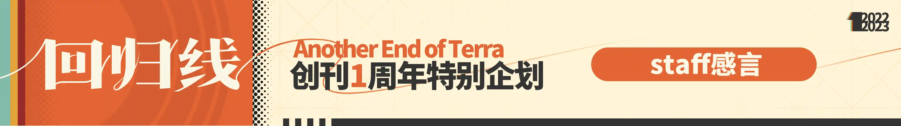
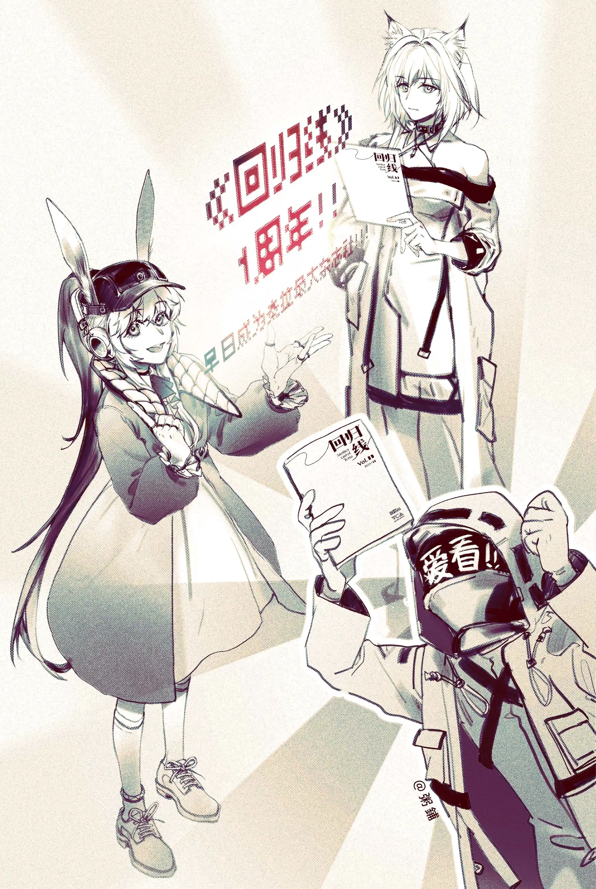
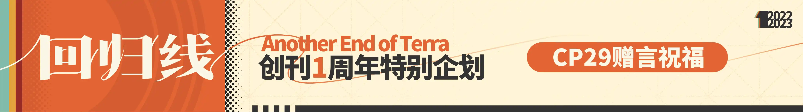
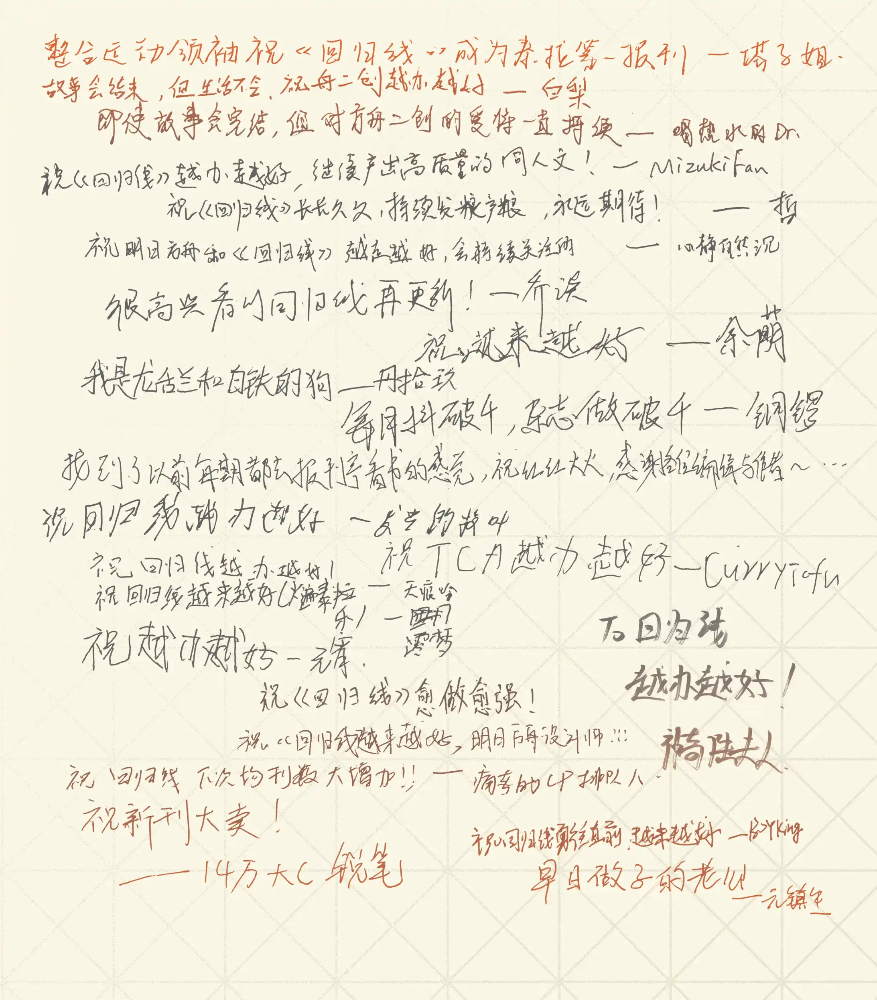
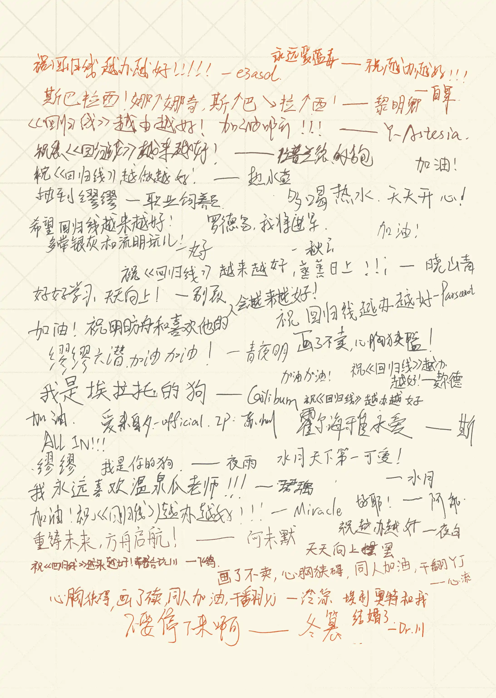
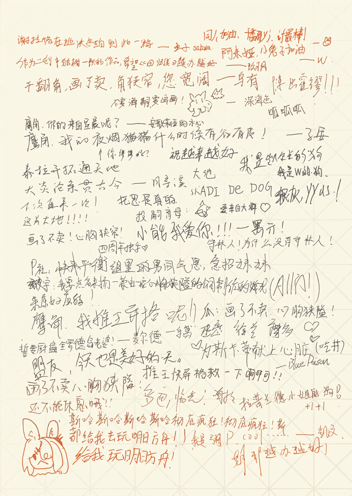

<!-- more -->

## staff感言{.texthide}

 {.centering}

### **马克**

转眼间《回归线》就已经一周年了。想起2022年4月时我在TCA里提出了做杂志这个设想，而一年后的今天，《回归线》得到了十几万的点击量，得到了顽子姐的转发推荐，还登上了某都市传说（指CP29）……这些成绩是当时的我们根本无法想象的。

在这里我想感谢鹰角为我们构建了一个可以让每一个人自由畅想的世界，感谢每一位参与《回归线》制作的staff以及为我们供稿的作者，感谢一些没有出现在staff名单，但通过各种方式为《回归线》提供大力支持的朋友，更要感谢每一位热爱创作，热爱同人的创作者和读者，是你们让方舟变得更有生机，让《回归线》能够坚持做下去，越办越好。

### **R3tr0**

遥想初创时期，当我提出筹划一个同人杂志的时候，我自己也对能不能坚持做下去表示怀疑，在此之前，对于一份杂志应当怎么做也毫无经验。现在回看第零期杂志，小瑕疵还是很多，因为是匆匆赶工成品也很粗糙。不过现在，有了专业的排版和网页编辑，杂志质量也有了肉眼可见的提升，我也逐渐退居二线（i.e. 编辑部首席摸鱼人，笑）。最初做文档和网站的时候，预期是有人看就不错了，看到评论中表达的喜欢和支持越来越多，感觉自己所做并非毫无意义，也庆幸自己能坚持做下来（而不是像之前参与的系列项目一样无疾而终）。

祝愿《回归线》在这片大地，或者说这片天空之下能像红酒报一样知名，像赫默研究员一样不忘初心，像凯尔希一样长寿(?)。总之，甭管主编的萨尔贡舅舅怎么样(?)，希望我有生之年能见证新的泰拉最大杂志社的诞生。

Per Aspera Ad Astra {.centering .textkai}

循此苦旅，直抵群星 {.centering .textkai}

### **巡检长安**

能做到一周年已经很不容易了，虽然我总是抓着主编的耳朵说他没能把回归线做到最好，但是我们都知道，总是追求最优的过程，往往只会导致次优的结果。所以今天这一步已经是次优的过程所带来的最优的结果了。那么，庆贺回归线一周年，也祝回归线下一年顺顺利利。

### **广英和荣耀**

其实有时候真的很感慨，一年很快就过去了。对于我这种在这个圈子里年龄不算小的人来说，时间真的是一个很奇妙的东西。我真的已经过目了至少60篇文章了吗？我真的在这个不会给我带来经济收益的孩子上花费了这么多时间和精力吗？我真的因为他而认识了这么多可爱的读者和作者吗？

一切真的如梦似幻。

If啊，if，本月的主题是if——如果，假若，无论何时，是否，即使，每次……虽说别人总说“千金难买早知道”，但假想我们在每一个如果，每一个是否，每一个选择，每个人生的分叉道选择的不同道路，走向不同结果，难道不也是一种想象和人生的浪漫吗？千金难买的不是早知道，而是面对“不后悔”。若是如此，每一个“另一个结局”都会成为美好的风景。

感谢当初一时激动聚集在一起的“我们”，还有后来逐渐加入的“我们”，以及支持我们，足以被称为“我们”的读者们。我们所有人当初的一个“if”，带来今天的成就耀眼夺目。

谢谢各位。

### **霜弦**

不知不觉《回归线》也已经一周年了，从最早的试行刊vol.0到今天多次参加线下宣传的回归线也是成长了很多。最早制作回归线的初衷也是希望大家能够将更多的关注给予文手与画师的作品。在如今的短视频时代，更多人关注了很多的视频作者，却忽略了很多短视频以外的优秀作品，而这些作品也同样优秀。做一个“快节奏时代的逆流者”，沉下心来观文，赏图，品味创作者眼中的这片大地的样子，寻找一个二创作者的“回归线”也是这份杂志的意义。
作为图片编辑，挑选符合主题的配图，封面和插图，也是一份很有意思的工作。虽然近来由于一些风波导致图片的挑选和授权相对比较困难，但相信风波很快过去，回归线也会向各位观众提供更多优质的作品。
很感谢各位读者一直以来的支持以及回归线编辑部各位的努力，各位接受采访的up主的支持，让我们能继续走下去，也希望有更多有着与我们共同目标的同路人能够加入我们，让《回归线》真正成为创作者的“回归线”！

### **黒子**

不知不觉一年都过去了呀，真是意外。一年前的最初，突然霜弦还是谁问我“要不要来编辑部帮忙？”我还在推脱欸。之后我了解到一位我所敬重的人在这里，便追随而来——然而长久下来，没有感情是不可能的。回头来看，我已经真的很喜欢编辑部的大家和《回归线》本身了。

### **瑶濯**

**祝福**

扶柳千丝画忆舟，摇水乘花入高楼

金樽不尽一岁去，阁中年刻回归集

未忆孤星何时至，仿林不知已葱迟

微澜起意瑶台升，远竹话墨当久成

### **万能的小黑**

我有时候会想，写作的意义是什么，当我老爹总是喊我多花点时间在学习上，别总是忙着写东西，这时候我该怎么反驳他。我想，抛开文章给读者带来的笑容、泪水或者反思，写作首先应当是让自己快乐的事，是把我们的生活、情感、思想透过文字表达出来的过程，而不是拿来追求名利的工具，不是悬在空中的无根楼阁。面前的读者、写手朋友，愿你在阅读《回归线》时找回自己写作的初衷，多读一本书，多见见外面的世界，在写作中获得更多幸福。

### **武乙凌薇**

我和回归线的相遇起源于在MEW，那时我被回归线所发的想法所吸引，不过我正式看的第一期应该是2022 年 09 月号：乡愁和归处，之后在B站零零星星的也看见了回归线的新刊发布和招募，不过因为公招Tag不对，所以一直没有考虑过（笑）。直到12月7日回归线开始招募技术维护，正好是我擅长的领域，在发送申请后我很顺利的进入了回归线的编辑部。

说实话，我在刚接手网页内容的时候还很紧张，第一是要尽快上11月刊的内容，第二是我对整个网站的结构与代码不熟悉。当初真的是照着之前的文档一点一点照葫芦画瓢的搬过来。不过在逐渐熟悉了网站框架后终于敢放开手脚去做啦，在更新杂志内容之余也对样式和功能进行了不少的更新，最近包括版权内容限制和网页随机彩蛋在内等一系列更新也是基本是由我完成的。

这个月也是回归线创刊的一周年，很高兴能参与回归线：几乎完美的方舟杂志的制作，让我们一起探索这片大地每一种可能性，我们的口号是：“做泰拉最大的杂志社！”

### **mirror**

回归线一周年生日快乐！

……？

等等一年了吗？真的吗？完全没有感觉耶！

感觉刚组编辑部时的趣事（？）都还能逐一回想起来哦？真的只过了一年吗？

算了，感慨的事情先放一边。

说实话，愚人节当时说的，“想要成为泰拉最大的杂志社”什么的，我一直不觉得那是假的哦。

如果是现在的话，说不定……还真的有可能哦！

（虽然因为某平台对ai的暧昧态度，导致图区授权难度更上一层了！现在依旧没有解决！但是！）

一定没问题的！

### **粥鋪**

“ 罗德岛制药公司贺 《 回归线 》 杂志创刊 1 周年 ”

 {.centering}

## CP29赠言祝福{.texthide}

 {.centering}

 {.centering}

 {.centering}

 {.centering}

 {.centering}
<eod />