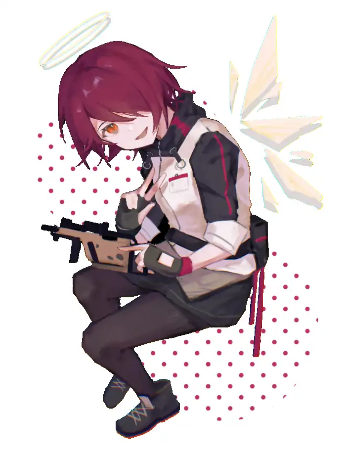

我们都会忘记很多，义人，最关键的是，你真的想从中摆脱出来吗？{.textkai}

<!-- more -->

我很少会和别人谈论失忆的话题。

阿米娅也好，凯尔希也罢，我们彼此间保持着并不舒心的默契，对其缄口不言。

有时候我认为自己是在害怕，害怕我所遗忘的忽地从不知名的角落浮起，又暗自落下。只留下层层涟漪，望不清深浅。我不知道到底有多少我不该忘记的人事在其中游离，它们的死尸又何时搁浅。

不是那些……

从令人烦躁的胡思乱想中脱离的我望向桌角的时钟——它正指向下午4点。

推开桌子，踱步到窗户前，那被黯淡，迷蒙的浅灰色阴影笼罩着的疏淡天空，布满着钢铁色的云，中间皱巴着挤着一团哀伤而惨白的云团，像是失明的眼睛。

我不禁产生了一种难以言喻的感觉，就像目光一直透过云曦，迎着朝霞一般的辉光。

“在那之后，会是天堂吗？”

喃喃自语一般，我忽地问道。

“是的，义人。”

身后传来了爽朗而又柔和的声音，我能听见金属相撞的叮当响声。

“能天使，下午好。”

{.image-right-float style="max-width: 40%;"}

收拾好心情后，我回过头看向她。那始终明亮的光环，在蒙上一层阴影的室内显得格外突兀。

“如果你愿意的话，周末我可以带你去教堂礼拜。”想必是听到了刚才的话，她双手抱十，向我发出了邀请。

“不，我只是……”我赶忙辩解道，却被对方笑着打断了。

“你只是个忧郁的小老头，对吗？”

就像是知道我是随口一说一样，她坏坏的笑容里满是恶作剧得逞的味道。尽管如此，我还是能看出她眼眸中闪过的那丝沮丧。

“你是来送货的吗？”

这样难过的天气里，能在闲暇之余和她聊会天，对我来说是不错的休息。

“不，我是来看你的。”

“看我？”

我不知道自己有何等魅力，能让对方从老大远的地方特地赶过来。

“是啊，如果是我被关在这样的屋子里，面前摆满这样一大堆文件，一打瞌睡就要被人叫醒，我会疯掉的!所以，义人，我来看你了。”

她乐呵呵地走到了我的面前。

“你也该从来了，阿米娅告诉我，你已经连续工作12小时了!”

能天使夸张的叫嚷起来，好像我随时都可能猝死在她的面前一样。

“我还不累，能天使。”

一如既往的，带着某种倔强，我否决着。我知道自己能继续下去的，哪怕是13小时，或是14小时，在一切都完成之前，我还不累，我不会累。

“阿米娅和凯尔希去龙门了”

一针见血的，她把我所谓的固执下的恐慌挑了出来，血淋淋的摆在我面前。

“所以，休息一下吧。”

“可是……”

我挣扎着，却没有阻止她走到我的身边。她脱去了我的兜帽，用纤细而柔软的手指抚摸着乱蓬蓬的头发。

“没必要那么坚持，义人，你和她们都……太紧张了。”

然后，能天使有些迟疑地扭捏了起来

“所…所以”

“嗯？”

她的声音如此之小，以至于我凑到能天使的脸前才能勉强听清。

“能让我帮你剪头吗？”

我不认为自己的头发是那么的长，长到不得不剪的程度。

它只是欠缺打理而已。

毕竟几乎所有人都只在乎我做了什么，我正在做什么，我的回应是什么。所以，深埋在兜帽下的东西，就显得没那么必要了。更何况，那只是头发。

在能天使执意的要求下，我来到洗浴台前俯下身子，听着淋浴头的水声从一侧响起。

她的指甲不是那么的长，深入发根的指头从额头顺起，发出滋啦滋啦的声响。

大概是紧张又不怎么熟练的样子，总会在发丝纠缠的地方卡住，于是温柔地仔细分开，又轻轻抚平。

我不知道怎么描述这种感觉。当他人的肌肤触及到你的身体时，尤其是头部隐秘的角落时，那种似于骚痒一般的热流在她梳理过的地方留下了痕迹。

“……”

温度合适的热水从右侧冲来，在她手背的指引下滑过耳根又从脖颈滴下。

随后，洗发露被拍到我的头上，在水的作用下，我能感觉细小的泡沫包裹着每一根头发，让它们膨胀起来。似乎也正因为如此，能天使的力道明显比之前大了很多，有时小指会戳到我的耳垂，引起一阵酥麻的感觉，使我微微发颤。

“啊，我弄疼你了吗？”

对于自己不擅长的事情，能天使总显得有些谨慎，她的手微缩着，没有再发力。

“不，没有，只是有些痒，想笑。”

我解释道，感到她的手指忽然分散了一些，大概是松了一口气。

充分清洗过后，能天使便从带来的包里掏出一条毛巾包住了我的脑袋，用擦拭枪身的手法将我的脑袋狠搓了一阵后，将半晕半就的我扶到了椅子上。

把理发围布围在我身上，理发这才正式开始。

“说起来”

我想起了不久前从德克萨斯那里看到的图片，大概是学生时代的能天使，正端坐在教堂前的石阶上，脸上依旧是那副乐天派的笑容，唯一和现在不同的，是一直垂到膝上的长发。

“你以前是长头发的样子。”

“嗯，因为我不喜欢剪头发。”

我能听到剪刀在她的手上转了一圈的声响，似乎她正点着下巴回想着过去的事情。

“因为那很无聊啊，就这么坐在镜子前，不许带耳机，负责剪头发的一个个又严肃的像凯尔希。”

就像是说着理所当然地事情一样，红发少女不断地发着牢骚。

“于是我会在脑袋里哼着小曲，脚上打着节奏，这样才不至于无聊到发疯。不过一次，我好像踢到了像是杠杆一样的杆子，凳子就咕噜噜地转了起来，然后我一头撞在了老板的下巴上。”

少女切切的笑着，就好像不是自己闯了祸，而是经历了一场冒险一样，既神气又高兴的。

“从那之后我就留长发啦。”

“现在是因为工作吗？”

我猜测着，毕竟物流什么的，长发会不太方便吧。

“当然不是啦，老大也不会在这上面做要求，虽然的确方便了不少，但最主要的是。”

少女有些得意的说着，像是在炫耀一样。

“现在有德克斯萨帮我剪，已经不那么无聊了。”

---

“哦，嗯。”

我有些不耐烦的回应道，我知道自己在想些什么。

能天使这家伙，和我不一样，虽然表面上能和任何人打好关系，但真正能被她承认的人很少。

毫无疑问，她是能被能天使承认的人，她们彼此都是。

显然，我的脑海里浮出了那两人的身影，包括我在内，我认识认可的究竟是过去的那个幽灵，还是真实的，站在我们面前的自己？

我不知道。

在我沉浸于可笑的胡思乱想时，她从身后抱住了我。“所以呢，义人。”柔和的吐息绕过脖颈，呵在脸颊两侧，像是被危险的温柔包裹，不可自拔地沉入其中。

“我来了。”我从围布的缝隙中伸出了手，向上握住了她的。

那切实传达的温度，是属于现在的。

“我想要休息……”

缓缓地，我开了口。

我从未告诉过任何人，我在害怕，我害怕每一个可能从我身边离去的人，我们认识的时间太短，我甚至没法准确的写出她们的外貌。

我试着让她们每一个人回来，每一个人不带伤痕的回来。

我害怕每一场战斗，我害怕工作，我害怕黎明。

我只是……累了。

“但我不能。”

“嗯。”

她认真的听着，用梳子梳起一角，手里的剪刀也随之收紧。

伴着“咔嗄，咔嗄”的声响，我能看见黑色发团落在地上，它们都曾是我身上的一部分。

我能感到风逐渐变冷，推子推过一侧的边角。我一直很喜欢这种细小的嗡嗡声，它会让我睡的安稳。

“阿米娅，凯尔希需要我，或者说她们需要曾经的那个我，甚至，我只要站在这里就好，像个方尖碑!”我无法去遏制自己不去想那些。太多人，有太多人死在营救我的行动了，我的记忆很短，但它满当当地装满了太多人。

“她们也没再和我说起过去的事情，即便是我搜集来的的那一点点微小的记忆，也像是是在听别人的故事一样……我或许已经不是那个我了。”

“我们都会忘记很多，义人，最关键的是，你真的想从中摆脱出来吗？”

她支起梳子，梳子划过梳齿的声音随之向后，另一面很快就剪好了。

“我不能，能天使。就像过家家一样，就算我不是，我依旧要扮演这样的角色。我得继续下去，我得成为那个博士，成为曾经的自己，而不是向前。”

所以，我从未和别人谈过自己的失忆。因为她们需要的是能够带领她们前进的人，而不是从棺材里活过来的婴儿!

---

“如果我需要的是现在的你呢？”

像是祷告般，她平静的说道。

我顿时失去了言语的力量，愕然地看着窗户的倒影。

真的是……被将了一军。

“我……不知道。”软弱的，只能故作镇定的后退一步。我看不见身后的她，不知道她正摆出一副什么样的表情。

“……”

那双手托起了我的脸颊，将我向后仰起。琥珀色的眼睛，赤色头发垂下的阴影，眉宇间闪着的灵气——她姣好的面庞占据了我的全部。

“能陪我到外面一趟吗？”

不知什么时候外面已经下起了不算小的雪。

站在罗德岛的甲板上向北望去，深压在赭色阴影中的水泥尽头是霓虹的高楼。

阿米娅和凯尔希就在那里。

从两侧吹来的风鼓起了雪，细小的宛如泡沫的白色残屑蒙在了我的眼前。落在了我的头上，肩上，眼前，使我辩不出方向。于是，连那抹赤色都不再清晰，只剩下了白色。

“能天使？你在哪!”

我踉跄着向前走去，试着伸出手。

她刚刚就在那，她应该就在我的身边。

“我在这里，义人。”

我的手忽地被握住了，随后迎上了她的目光，那是令一切阴霾都无所遁藏的笑容。

能天使的头上落满了雪，像是草莓慕斯一般。

“我们好像老爷爷老奶奶啊”

她嘿嘿地笑着，从我的头上取下了一捧雪。

“我还没那么老呢。”

我抗议着，扫去了她头上的一团。

“还有几天就是黎明节啦，那时候能和我一起吗？”少女转过身子，背对着向我发出了邀请。

“黎明节？”

如果我没有记错的话，对于拉特兰来说那是十分重要的节日。“是的，我们相信在那一天泰拉迎来了第一个黎明。所以，我希望那天你能和我在一起。”

我知道那意味着什么。

我看着她，长久地沉默着

“能天使，站在你面前的只是一个拘泥于过去的家伙，正荒唐地活着罢了。”

至今为止，我所做的一切，究竟是个人意志，还是为了让她们安心的举措？

“神告诉我，即使忘记了一切，我们依旧是自己。”像是知道我将要说什么一样，她依旧目视着我，做出了邀请。“和我一起吧，还有太多的有趣的东西你还没有见过呢。”

“那简直就是在说，就算想不起来了也没什么一样!”

近乎歇斯底里一般，我能听见自己咽喉正发出令人厌恶的尖啸。

“连记忆都没有，我所做的意义又在哪里？我和过去的自己的联系呢？我又在哪？”

“在这里”她指着自己的胸口。“它是不会变的。”

我的心忽地落上了一只蝴蝶,震颤着却许久没有飞起—我便听不见自己的心跳声了。

又或是那成了新的心，哪一个呢?

“能天使”

我从未向别人谈过自己的失忆。

总有一天你会记起一切的。

总有一天你会变得和曾经一样的好。

总有一天你会和过去的自己一样值得信赖。

你会撑起整个罗德岛的，总有一天。

他们，她们，每一个人都这样鼓励着，每个一人都盼望着，充满着这样那样的期待。

有股温暖的感觉融进了我的身体，揉着我的脸颊使我温和的笑，有一个人，她告诉我可以重新去疯，有太多有意思的东西我从未见过，我可以朝前看。

“我会去的，和你一起。”

我决定回应她的邀请，就像她一直在回应我一样。

也该有个休息了。

“嗯。”

我看见她在雪中咕噜咕噜地转着，把身上的雪甩地到处都是的。

“对了”能天使捻起衣角，有些在意地看向我这边。“嘿，你想看我到时候穿什么？”

“啊，啊？”我下意识地扫过全身，没脑子地答道。“你穿什么都好看。”

“……”

很快反应过来的我顿时满脸通红，同时，一抹难以察觉的红晕渲在了她的脸颊上。然后，她一步一步踱到我的身边。

“如果你想的话，年初的时候我可以留长发，不过……”

“不过什么？”

“那时候，我想去汐斯塔市，你要和我一起去。”

“……我可能”我有些犹豫，按照计划那时候我应该在跟着阿米娅她们东跑西跑的，估计空不出时间来。

“哎，我们这物流可是很忙的，到时候要在龙门到处跑，没准我又找德克萨斯……”

“我会去的啦，到时候我会空出时间的。”

“哼哼”她满意地笑着，绕到了我的面前伸出了手“以后，还请多多指教啦”

同样举起手时，却突然发现发现手背上粘着一团黑色的发丝，不知是什么时候落在上面的。

我有些出神地看着它，又突然笑了起来，用力地握住了她的手，像是不打算放开一样。

“你这是怎么了？”少女疑惑地问到。

“不，没什么。”我轻描淡写地答道，看着它从空中抖落，飘向了不知名的地方。

一剪残发而已。<eod />

（责任编辑：瑶濯；网页排版：武乙凌薇；绘图：失败作番茄汁）

<FakeAds />