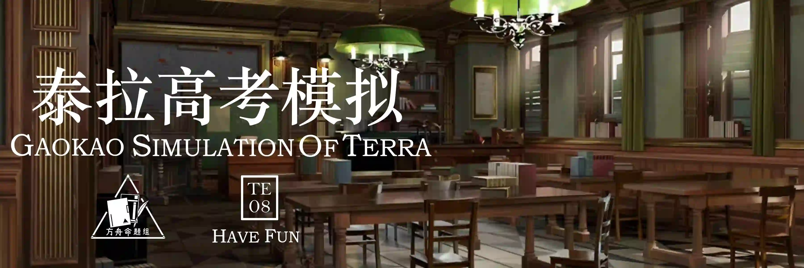

 {.centering}

如果还有事情在困扰你，就先把它丢到一旁吧。{.centering}

——缪尔赛思{.aright}

<!-- more -->

**【1】（语文）将以下句子重新排列，语序正确的一项是**

①天灾刚刚过去，风暴过境，天空中所有杂乱的颜色也被卷走。

②咚——第十八声。他蓦地停下了脚步，但没有回头。

③十七通鼓，象征着过去一年里玉门经历过的大小劫难。

④他就这么走着，脚印一点点被风沙抹平。偌大的玉门城在他身后，也一点点地小了下去。

⑤云霞被落日烫红，半天飞锦。

A.③①⑤④②

B.④⑤①③②

C.③④①⑤②

D.④①⑤③②

**【2】（数学）已知陈的技能“赤霄·拔刀”可以对敌人造成相当于攻击力500%的物理和相当于攻击力500%的法术伤害。满配陈的攻击力为763，请问她不能使用该技能一击击杀以下哪个敌人？**

A.弑君者：生命值6000，防御力120，法抗50

B.重装防御者：生命值6000，防御力800，法抗0

C.家族术师：生命值4500，防御力250，法抗40

D.寻仇者：生命值5000，防御力200，法抗50

**【3】（英语）Blitz: Easy up, there’s nothing to be nervous about. Should I invite Tachanka to dance a little ballet for you?**

**Tachanka: ________**

A. Just don’t play hero, it never works.

B. Let them come!

C. Excuse me?

D. Be careful, comrade.

**【4】（理综）将以下立绘对应的干员分类，最合适的一项是**

|  |  |  |  |  |  |
| :---: | :---: | :---: | :---: | :---: | :---: |
| ①. | ②. | ③. | ④. | ⑤. | ⑥. |

A.①②③/④⑤⑥

B.①③④/②⑤⑥

C.①③⑥/②④⑤

D.③④⑤/①②⑥

**【5】（理综）已知对于推力，只有当推动力度减去敌人重量大于等于-1时才能使目标发生明显位移。则在集成战略模式中，不使用其他干员或召唤物辅助时，单个干员理论上可以使发生明显位移的最大敌人重量为**

|||||
| :---: | :---: | :---: | :---: |
| A. 5 | B. 6 | C. 7 | D. 8 |

**【6】（理综）冬灵血巫生命值高、普通攻击造成法术伤害，且在死亡时会对周围的我方干员造成高额法术伤害，非常棘手。以下对于此敌人的应对策略，最不合适的一项是**

A.将其引导至“留声机”旁并使用留声机击杀

B.使用狮蝎一技能延缓其行进速度

C.部署处决者将其在远离阵线的地方击杀

D.拦截时优先考虑使用驭法铁卫、角峰、雷蛇

**【7】（文综）请进行类比推理，以下选项中出现的名词匹配和“艾雅法拉：焰影苇草”逻辑关系最接近的一项是**

A.银灰：星极

B.山：泥岩

C.红豆：慕斯

D.星熊：澄闪

**【8】（文综）阅读以下材料，回答问题**

铃兰小姐每早七点按时起床叠被子刷牙晨读十分钟诗歌选集后前往医疗部门认真学习源石技艺的使用并积极帮助其他同龄人感染者处理情绪对每一位参与工作的医疗干员都诚恳慰问中午一定要小睡一个小时睡醒之后一定会喝一杯芝士巧克力就算有干员私下塞给糖果和小礼物她也会礼貌拒绝每当遇到奇怪的陌生人就会怯生生地站在干员的身后低头向前走下午会认真旁听会议或者华法琳的医疗干员讲座同时会细心地打扫会议现场最后一个关灯离开晚上基本躲在房间里看书累了的话会主动提出帮助后勤干员做一些杂活稍微夸奖她两句就会害羞晚上十点之前一定会上床睡觉偶尔会和泡普卡和巫恋小姐待在一起请记住铃兰小姐就是我们的光—— {.textkai}

对这段材料的核心思想，概括**最合适**的是

A.铃兰小姐是一个乖孩子

B.铃兰小姐每天都有在努力学习

C.铃兰小姐是我们的光

D.铃兰小姐和罗德岛上干员们的关系很好

**【9】（文综）已知A国为宗教国家，政体为议会制。全国大致可分为三个行政区，每个行政区都有一部分交由中央的宗教代表直接管理。A国科技水平不算很高，且不需要移动城市来保障生存。**

根据以上信息，判断出A国**最有可能**是

A. 伊比利亚

B. 谢拉格

C. 拉特兰

D. 卡兹戴尔

{style="float:left;max-width:20%;margin-right:1em"}

*扫一扫二维码查看本期答案*

[点我也可以哟ヾ(≧▽≦*)o](https://www.wjx.cn/vm/tF53jwr.aspx)<eod />

<FakeAds />