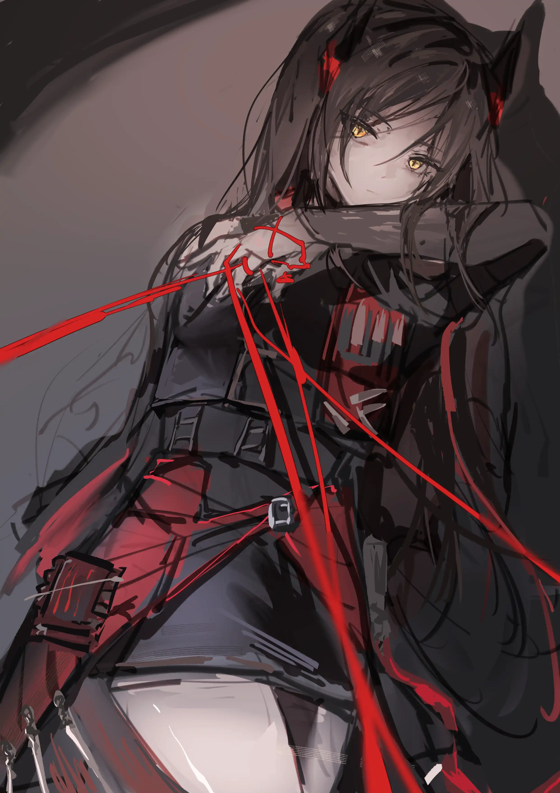

我们在白桦林下相遇，我们决定自立门户{.textkai}

<!-- more -->

   卡兹戴尔这个月份的春意还未完全退却，湿润的空气里却已经带上了夏季的草木腥气，一股白桦林间的夜风从身下的潮湿泥土和草皮上掠过，暗暗激起出一股未宣之于口的酸涩和冷淡感觉，伊内丝从睡袋里伸出手拧了一株野草，在篝火下一条细致的影子被拉长擀细，陪衬在它身侧更庞大的一团旁边，伴着成为一个更大的整体微微摇曳扭动。

她掐断它脆弱的茎时，淡绿色的汁液从指尖缓缓流向指腹，想抹开这种轻盈的液体却也只是让其他指节一并被沾染，液体接着火光在皮肤上缓慢流淌的感觉就像是血液。虽然赫德雷看起来并不避讳死这件事，伊内丝在疤痕商场也没少见到前些天活蹦乱跳的人在下一刻就被抬进来扔在一边，但似乎疤痕商场里的很多东西都影响不到她，或者说她没去想那些事情。

疤痕商场总是安静的，佣兵们各自窝在自己的一席之地上，或者去梦里寻找迷醉的真实，或者在现实里空洞地看着有人被架出去或者被抬进来，只有在痛楚订单被撕下或者被新的赏额覆盖时才能勾起这里人群的骚动。

“别看了，有佣兵没死成。”早些时候看围住订单的人群就已经里外层层叠叠，对着一张纸数着上面的数字，赫德雷只瞟了一眼就低下头磨着自己的另一把刀。“不会是个小数目。”

“听起来就不得了。”伊内丝深深看了一眼身边被刀钉在身边的那张薄纸，随后低下头继续给赫德雷手中刀刃上浇一捧水。

“越不得了的佣兵越该死，越难死的越值钱……”赫德雷几乎是嘟囔了一句，磨砺的刀刃划过手指拉开一条轻盈的口子，血液从中间慢慢渗出，一滴落在他们的委托纸上，像某种对于谶语的不祥回应。“伊内丝。”

“赫德雷，”伊内丝接过他手里那把剑，在石头上一下下来回刮动。“把你的教育时间留到下一次任务结束之后好吗？”

“不，我想说的是，如果你在战场上面对难以抉择的死局时，作为一名萨卡兹雇佣兵，特别是这样优秀的……”

{.image-right-float style="max-width: 40%;"}

“你想说，”伊内丝下意识地想伸手去摸自己的角，抬手的小动作被赫德雷看在眼里，她面不改色地捞了一点水淋在白花花的刀刃上，仰头对着赫德雷的目光。“应该找个机会跑掉？”

“不，雇佣兵首先要完成客户的委托。”赫德雷少见地皱起眉，脸上的肌肉微微抽动着，他这句话说的缓慢，但尾音短促而简洁。

他接过伊内丝手里的刀，慢慢擦拭干净上面的水渍。“我想说，在这之外小心别死了。”

身边不远处细微的咳嗽声让她缩回手，思绪同时钻回温暖的睡袋里，视线从睡袋的边缘探出，影子在瞬间被习惯性的打散融入到夜晚地面的枝叶疏横之间，从四面八方如潮水般涌来拱卫在一团篝火旁。

然后所有的源石技艺在下一刻消失，酝酿在空气中的压抑色彩与气氛荡然无存，赫德雷拖着自己的睡袋走到离她稍远但是更靠近林子的一侧。

“那边有鸟叫，这边安静点，而且我习惯守着路口空旷的地方。”赫德雷的声音在头顶响起，小声地像是在自说自话。

伊内丝探出头转了转，虽然她不确定是否听见了鸟叫，但赫德雷现在躺下的地方无疑更靠近林子里的一处路口，他的脚正对着树林外木牌的方向，下一刻她就看见赫德雷闭着眼睛翻了个身，怀里还抱着他给自己解围时用的那把武器。

“所以我们明天做什么？”她决定打破短暂的寂静。

“战争，伊内丝，跟着报酬投向一场新的战争。”赫德雷后几个字被淹没在他的哈欠声中，伊内丝感觉到那边的气氛似乎都凝固了一会儿。“早点休息。”

炮火和源石技艺就像是一对双胞胎，在酝酿良久后同时从战争的子宫中艰难分娩，给这片土地泼上又一滩浓墨重彩的血迹，迫使着生命在一片狼狈中艰难爬行，比阳光更早唤醒卡兹戴尔清晨的永远是爆炸的火光与源石技艺的破坏声。

地面在他们眼前爆炸前时赫德雷就已经扑向了伊内丝，火焰和土石的冲击被一股轻柔的烟尘化解，但一块尖锐的石块依然笔直撞向赫德雷，在他推开伊内丝的同时划开他的额头，随后更多的泥土和石砾伴着轰鸣声从天而降。

伊内丝是从一堆泥土里爬出来的，她无暇顾及自己身上被撕开的衣摆，而是直接冲向一边摇摇晃晃起身的赫德雷，扶住他后她才听见四周巨大声响中的细微呻吟，惨叫，扭曲的声音夹在庞大的战争机器中只剩下气若游丝般的哀嚎。

“至少按人头来算，我们超过昨天那群家伙了。”

“这样不行，赫德雷，这样行不通。”伊内丝拉起赫德雷，把他的一条胳膊架在自己肩上，盯着看眼前的大小弹坑与未燃尽的火焰，地面已经被谁的血染红大片。“我们得自立门户。”

“如果你觉得不划算，你大可不必像只受惊的羽兽一样。”

“忘掉你那一套吧，赫德雷，我们得自立门户。”

“你现在可一点都不像个萨卡兹。”

“……现在我不想听这些东西，一点都不想。”伊内丝伸手抹掉自己眼角处的血迹，修长的影子开始慢慢攀附裹挟起他们的身形，带着他们回到昨夜里那堆篝火的余烬堆旁。

 {.centering}

“那你想听什么？”

“告诉我你不会死。”

“萨卡兹都活的够久了。”

“你死在这儿可会少领好大一笔钱，队长。”

伊内丝光是想着身上没有一点针线就开始绕着赫德雷来回走，直到被赫德雷伸手拉住。

她捧着赫德雷的脸只顾盯着额头上的还在流血的伤口，全然没注意到后者耳廓通红，接着她就看到一团灰色的余烬围绕着伤口缓慢流动，在亲眼确认伤口正在被源石技艺缓慢修复后她依然伸手拧了一下赫德雷，隔着衣服掐到他结实小臂时还是赌气一样松开。

“有点狼狈，嗯？”赫德雷慢慢睁开眼睛，看到的是伊内丝背对着他。“但也不算是坏结果。”

“战场上怎么可能来得及保持形象。”伊内丝伸手擦掉自己眼角渗出的血液，使用源石技艺过度的表现。

“那我们在回去之前，最好先来探讨一下刚才的那个想法。”赫德雷倚着一颗白桦树伸手拉回伊内丝。“刚刚说自立门户，伊内丝？”

几天后，伊内丝和赫德雷把新的赏额连同委托一并贴在疤痕商场，伊内丝在人群拥上之前似乎能闻到一股气味，她要等到许久后才会了解到那股气味的来源：它并不是来自那些无法缝合的伤口和难以愈合的创面，而是扎根在脚下这片大地中一切的一切，那是一切在无声中滑向不可挽回的征兆。

死亡的人在死亡中腐烂，活着的人在生活里腐烂。

但她看向赫德雷，毫不意外，她的身影正在赫德雷瞳孔中倒映着。他拉起伊内丝的手，粗糙的掌心正好扣住她指茧还未成型的手掌。

他们转身从人群中穿过，伊内丝已经想好了说辞。

“我们在白桦林下相遇，我们决定自立门户。”<eod />

（责任编辑：瑶濯；网页排版：武乙凌薇；绘图1：星期几；绘图2：大青）

<FakeAds />