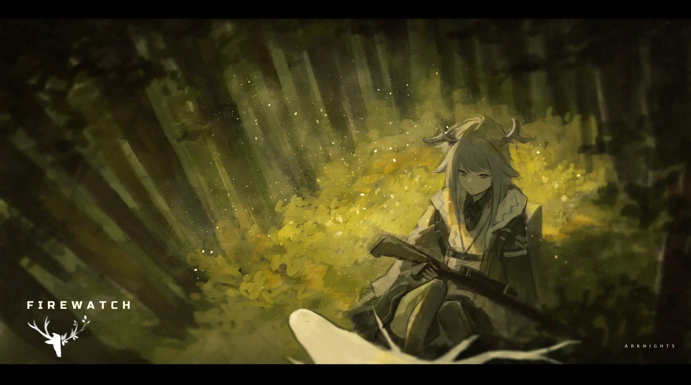

梦是一个悠长的傍晚{.textkai}

伴随着憎恶，惶恐和悲伤{.textkai}

老农慢悠悠吐着烟圈{.textkai}

告诉她死亡是一场远航{.textkai}

<!-- more -->

 {.centering}

## 一

---

西洛娜人生中有印象的第一个梦是在五岁时做的。一头哀嚎的驮兽冲破细丝串成的雨幕闯入林间，旋即恣意红莲就舔上胫部，身后，燃烧着烈焰的獠牙踏过它愈发沉重的步伐扼住它的脖颈。那是一头熊的轮廓。她恍然惊起，觉真实无比。当她向祖父询问，祖父却只是默然，任凭她抓着自己的胳膊摇晃。

后来西洛娜方知，那场梦堪称对过往战争的绝佳反映。她出生前十六年，乌萨斯帝国结束了与卡西米尔无数次交锋中的又一次，逼迫战败者订立城下之盟，割让东部的大片领土。梦醒时分，人们惊于自己如今无可奈何地身处两国交界。那天清晨，新生的太阳变成了黑色。

---

## 二

在很小的时候，人们普遍认为即便以儿童的标准来衡量，西洛娜也是个很爱笑的孩子。看到一片刺眼的白雪中裂开一条嫩绿色的隙，她会笑；看到光自郁郁葱葱的树冠间滴落，她会笑；看到无垠田野如同雏鸟成熟换上崭新的金羽，她会笑；看到埃拉菲亚族人们角上叮当作响的银饰被篝火映得通红，她也会笑。甚至曾有一位劳作完的妇人拍着胸脯，喘着气诧异地惊呼：上帝啊，究竟有什么让这个小女孩咯咯地一直笑个不停呢？

但这片纷繁严酷的大地会在六岁那年告知她，上述欢乐的理由至少有两条并不似最初看来那样可靠：麦浪仅有涓涓细流最终淌进人们的粮仓，而印象中那般盛大的庆丰收之宴也只发生过一次。更不必说，她在这一年第一次亲眼见证了死亡。灰蒙蒙的早晨，大家聚集起来，穿过泥泞的土地，朝那座屹立于空地中央的教堂进发。彼时西洛娜因素未谋面的肃穆氛围而感到奇怪，询问大人后得到的答案让她被一团疑惑包裹至于身临深崖般悚然，她的目光颤巍巍地撞上前方黑色的长箱。在她身后，十月的第一片雪花坠下，刚触到坚硬的地面就化作齑粉，昭示着北方漫长冬季的开始。

西洛娜一天天长大，祖父母相对应地一天天衰老；不过生活倒还能勉强维持下去，善良的人们亦会想办法帮助这个孩子逐渐变成顶梁柱的家庭。而谈到谋生，除去在这片土地上培育千年的作物，村庄里还有十几年前引进的新物什——马铃薯，相传自极其遥远的高山而来。东家鼓励他们种植这耐寒而高产的作物。诸如挥舞锄头、把绿色的秧苗埋入地下再夯土……此类需大气力的活儿西洛娜当然不能指望，不过乡村繁重的劳动无法容许哪怕一个悠闲的人存在，因而七八岁时她也理所当然地被有形和无形的手推到了合适的位置：捡拾翻出的成熟土豆——如果雨水太大的话还得为它们抹掉湿泥——接着装上篮子，再一筐一筐地填满独轮车的腹腔。

待到十岁时，已习于忙碌的她渐渐悟出一个道理：她和唯一的亲人，再包括熟识的村民们，宛如大家栽种的土豆，平时只能在黑暗中默默萌发、默默生长，纵使腐坏也不会动摇地上世界分毫。这是铁一般的事实，因为她知晓富人的孩子会在仆从陪伴下去城镇里的学校而她不行，看到过村人向趾高气扬的马匹拉着的车低声下四地问候“老爷好”，听到过高高在上的乌萨斯地主们在她身边低声埋怨农民们自私自利：自己仁慈地把肥沃的大片土地租予其耕种，他们却连一点小小的报酬也不愿偿还，有些竟还忘恩负义地逃走。西洛娜自认洞察了大地上万事万物的规律，遂落入沮丧的蛛网无法自拔——人生的轨迹降生之时既已划定，谁又能违抗命运？毕竟，哦，于生活的滚滚波涛中勉强站立尚且是何等不易啊！

---

尽管包括她在内的大家都随着生活的无望而显得逐渐沉沦，但是咆哮的天灾、视察的官僚、擅长巧立名目的纠察队、热衷捡食残渣的收租者……每年至少出现其中两种不幸的严峻现实也不能仅凭麻木挨过。于是当时光的车轮转进十三岁，西洛娜虽已不再过分爱笑，却成为了大家公认的使弩最好的人之一，颇不得已之下。她能在猎犬吠叫着吸引灰鼠的注意力时精确无误地将箭矢送进它的脑袋，留下珍贵的御寒皮毛；这一手甚至令成年猎手们亦赞不绝口。

十四岁那年，西洛娜在一次捕猎中险些被一匹狼伤及性命。彼时她踏着似刀割面的冷风出发，本想让这头袭扰牲口的畜牲一命呜呼，不料追赶的途中它跃过挡路的树根却掉进了一个洞穴，惊起了正在沉睡的庞然大物。一阵混乱后西洛娜勉强从死神手下逃过一劫，代价是箭囊碎裂、仅余两发来对付狼的卷土重来，慌乱之际一发又擦着毫尖飞过。她强迫自己镇静下来，最终把弩机塞进迎面扑来的兽口中扣下扳机。

它死了，毫无疑问，西洛娜艰难探出头时看到了那因失去生气而涣散的眼神。但她也没有力气推开它了。

时间凝滞如呼气在眉上结成的霜，万籁俱寂。惟余北风时而东奔西突，结结实实地撞在树干上，令那些亘古以来生长于此的擎天巨物竟也微微摇晃。积雪簌簌掉落的声音提醒她不能睡去，可她的四肢已被寒冷浸透。

雪地里响起嘎吱声，重量突然消失如未曾出现，她模糊的视线里出现一个身影。当一只手套伸出拽起她的胳膊时，西洛娜看清了来者罩在外面的白色斗篷。风掀起兜帽，漆黑双角若隐若现。她瞳孔骤缩，迷蒙瞬间一扫而空。

---

## 三

在西洛娜的印象里，魔族总是要充当诗歌童话、传说故事里的反派，由是她更加奇怪于来人竟不隐瞒种族。不过她同时也暗想，或许这个民族里并非全是残暴好战的怪物，至少跟前有一位就不教她讨厌——因为叫作陨星的萨卡兹拥有琥珀色的眸子，而那双眼睛在烛光下流出的只是平和，全无凶戾。

陨星在此暂住下来。她坚持只要一个临时可以睡觉的去处，但每天两次满足人类口腹之欲的菜汤总有一碗停在桌角，于是抗议无效。作为回报，西洛娜从陨星口中知晓牙兽是狗的别称；圣骏堡的歌剧院里上演着贵族男女的悲欢离合，伦蒂尼姆统治下的臣民几乎囊括了每个民族；浩瀚的克拉斯德内海之滨还有唤作伊比利亚的国家，那里的冬天远不及此处漫长......

她因世界比她过去认识的还要辽阔许多这一事实而一时恍惚。作为本地人，她的全部生活经验都只与这片田原林海相关。不过，这点当她们在冬日的林间结伴而行时发挥的作用远胜它物。譬如一次，时刻保持着警惕的萨卡兹端着装填完毕的弩炮正在雪中跋涉，扑棱棱的声音，一群灰白色的长影子随后直直扑上，她一个趔趄，整个人都跌进雪中。分头行动但尚未走远的西洛娜马上循声而来，面颊带着微笑拉起陨星，告诉她冬季有些羽兽会栖息在厚实的雪下避寒。

这样的时光随着开春结束，萨卡兹一如她神秘地出现般神秘消失。直到短暂夏季的某天，西洛娜遇上了一群过路者，才再次见到消失许久的熟悉身影。

陨星甚至可谓有些兴奋地说她已克服偏见和阻挠加入“守林人”。西洛娜知道她指的是多年前成立的组织，主要由边境地区数十个村子里的青年组成，以打击不公为己任。一些老年人每当看到那群平均比她大十来岁的年轻人平安回村时，矛盾地既担忧又惊惧，在胸前画着十字，祈求上帝同时保佑小伙子们与他们与之对抗的人，希冀大家都不要受到伤害。

少年时西洛娜即便有些害怕但也隐约明白他们是赶跑坏人的好人，甚至想把自己仅有的半块烤饼送给他们。现在她还曾不止一次地望见这支队伍途径高高的山岗，视他们为某些私语和不平的具象化，仍然羡慕而尊敬，却并未与守林人产生过多交集。道理很简单——人们未必只能踏上这条道路。生命的顽强程度超乎想象，不论怎样总会找到属于它的位置。即使有些年景收成很差、即便有些肉眼可见的无耻盘剥令人愤懑不已，但只要些许忍耐，这些唉声叹气的晦暗日子总会过去的不是么？另外……

十二月的宁静被一支小部队打破。

---

只有最高级的军官才能享用乡村庄园里醇香的面包、浓烈的伏特加、温暖的壁炉，剩余的乌萨斯兵对这一现状心存不满，转而发泄在田舍之中，不由分说就将村中央空地旁的房屋强占为住所。屋主嘟囔着抱怨了一句，代价是他很快的嘴里很快就不剩几颗牙了。军靴将雪和血都高傲地贬为尘泥，旋即一道命令传出：以至高无上的皇帝的名义，上缴粮食，供给行军。

可是今年早些时候，春夏两季反常的低温以及二十年来最肃杀的惨秋已让村庄几近一无所获。现在，即使刺骨的严冬也没什么可洗劫的了。

“不是还有种子粮么？”军官说。

 “这是犯罪！”当乞求以无效告终，有人压低声音愤怒地总结道。

 “而且还是很严重的那种。”旁边的西洛娜又补充道。

几天后的夜半，西洛娜第一个把石块和火把扔进乌萨斯兵熟睡的房中，将窗户、宁静连同所有人的幻梦一齐砸得粉碎。士兵们断然想不到在农夫农妇们一向老实巴交的此处，竟有人敢反抗纯粹的暴力，被打了个措手不及，寻常拿来猎兽的武器和几把在军械库序列中失踪已久的制式弩在几分钟内就粉碎了他们的抵抗。庄园大门被几个青年撞开时，地主全家的踪影只能循着新在烂泥里轧出的车辙去寻找了。烂醉如泥的军官从床上被拖下，作为最后的幸存者任由越聚越多的人群宣泄。屋主的儿子、一位年轻而出离愤怒的农人用耙子的利齿撕烂了他的胸膛，一具尸体随后被倒吊示众。

多年以后陨星忆起那个黄昏总会唤起心头的一声叹息。当时她听完了这支远道而来的守林人分队讲述所发生的一切，无言了一会儿开口道：

“现在乌萨斯与你们为敌。”

“他们先动手的。”西洛娜回答。

当时萨卡兹想到她不该在之前只向西洛娜概述这片大陆上其他地区的情况而是先讲讲卡兹戴尔的故事。应该先讲讲那片充斥着痛苦的土地上宛如灰色障壁的天空、工业区和桦树林，讲讲卡兹戴尔宛如高耸兽脊的贫瘠山地；应该讲讲内战里她参与的三十五场大规模战役，讲讲她的代号怎样历经十六次死里逃生从“钝镝”到“陨星”；还应该讲讲在第十个代号“重矢”期间遭遇的敌人，以及那个孩子给她留下了多么深刻的印象以致今天她极其厌恶和抗拒让孩子踏足战场半步。数不尽的上涌话语却凝固在唇边。

夕阳在守林人们脸上燃烧。

“起风了。”有人说道。

---

## 四

 在游击队的两年时间里，西洛娜多次狙击过离开驻地后落单的乌萨斯兵，而那些蠢家伙通常丝毫没有注意到与背景绿色融为一体的守林人。第一次面对面传递死亡时西洛娜因紧张而微微颤抖，于是她闭眼，摈弃所有干扰，提醒自己在这种紧要关头更不能急躁，回想着伪装成灌木丛的自己是如何在被歌唱冲昏头脑的琴鸡们边上步步接近，使那些警惕的生灵逐渐放下戒备的。猎手将弩端稳，最后一次瞄准后扣动扳机。

她翻身下树。弩箭精确地贯穿了他的头颅，这具身躯现在静静地躺在那里，如果其他士兵没有及时发现的话很快就将回归生养了他的土壤，一如曾发生过的亿万次轮回。

大规模的围剿在那场疾风骤雨般的对等报复后寥寥无几，所以在状如此类的“微型战争”之外，日常生活仍是主流。冬季，猎人们有时会好几个村集体出动去猎熊。这个冬天守林人们自告奋勇，提前一天在大森林中标记好一个熊洞，次日出发。“咚咚咚“猛击树干后，被打搅美梦的熊如期而至，暴躁地探出黑色的脑袋。等待着的包围圈迅速外扩，以免被这团带起林中一切能带起的枯枝败叶的暴风雪所伤。组成包围网的西洛娜射出弩箭，祈祷动作足够迅速。巨熊向别的方向冲去，不过后腿还是中了这一击，鲜血飞溅。这头身型庞大的怪物终究在箭矢的围攻下倒地不起，命悬一线。

众人已经开始谈论如何处置毛皮之际又传来几声惊呼——从地下探出两个小脑袋，从体型推断，这两个熊娃娃大概率尚未目睹春天。不知为何，有人抵近注视母熊的眼睛，浑浊的兽眼此刻澄澈到只剩——是哀求吗？西洛娜想。沉默许久，一位体格健硕的青年领走了两只小熊。西洛娜后来知道它们一生剩余的时光都很依偎他，直到她所熟知的一切都迎来终结为止。

进入夏季，太阳在天空运行的时间比其余季节长出很多。夕阳西斜时守林人们在村外支起了一锅热气腾腾的汤，佐料是一只野鸭。

 “什么时候去湖上的？“有人大声问。

 “你们睡懒觉的时候！“大声回答。

 “怎么打到的？！”又有人问。

 “抓只母的放在你们划的小舟上，然后再小心一点儿。这个间谍会帮咱们欺骗她的同伴的。”

 “咕嘟咕嘟”的悦耳声响里，队员们开始彼此交谈、嬉闹，此间夹杂着口哨声。当西洛娜口琴的簧片停止振动，来自天地间的风不再和鸣，陨星开始讲一个她从没听过的故事。她说乌萨斯帝国不是一块坚不可摧的磐石，乌萨斯人也会与乌萨斯人以死相斗。她还说，相传“光之都”林贡斯的毁灭并非只因高卢帝国与其余三国的对立。‘贵族战争’作为过去的战争形态居于统治地位长达数百年，期间获胜者们拥立傀儡之事并不罕见。然而六十年前的四皇会战中，皇帝因自己点燃的不受控的战火中身死，新上位的政客软弱屈膝，林贡斯的人民说不要任何或新式或旧式的统治者，我们要主导自己的命运，却为各国所不容。因此，君王们不惜撕碎时代的硕果令“流血的九月”声名大噪，撕碎文明的虚伪面具而露出野蛮的筋骨与真容。

西洛娜问道这个故事是否真实，得到仅有少许道听途说成分的答复后又惋惜于他们的失败，感叹什么也没能改变，他们祖国的独立亦随之烟消云散。她透过汤飘出的蒸汽看到对方的眼睛忽闪了一阵儿，如同幼时的她仰望过的夜里微弱的星光，随后从无边无际的黑暗里传出声音：“我不奢望你能立即理解，小鹿。某天你踏遍整片大地自会有与现在不同的见解，希望有那一天。也许他们当时的确落败，甚至最宝贵的生命都不复存在，但抗争的痕迹不会轻易消散。”

西洛娜咀嚼着这句话的含义，又欲询问时传来开饭的呼唤。西洛娜并不着急，想着明天还有时间、以后还有时间、他们一直都在，只是没想到在命运的安排里，这便是她与陨星的倒数第二次谈话。

---

## 五

那天是怎样的一天？西洛娜记得前晚小雨下了一宿，清晨仍未停，以致空气都染上了腐朽的气息，当她抬头张望时羽兽们不再飞翔也不再此起彼伏地歌唱。天也变得极坏，阴云排成一座铁青色的气势恢宏的山脉，由北向南缓缓碾过整片森林。

那天之后发生了什么并不重要，西洛娜早已遗忘，只记得傍晚时分在倾盆大雨中尾翼摇曳着火的炮弹与箭雨开始落下。为什么？这一切为什么会发生？又为什么发生在今天？在呼吸声敲碎耳蜗的雨夜逃亡中她无暇顾及这些问题，在灰白冰冷的晨光中睁开双眼发现自己被一夜暴涨后的河流冲到未知的石滩时她无心去想这些问题，在村庄外发现陨星身影时这些问题愤怒而怨恨地骤然升起，攫住她的心脏驱使她冲上前去要得到答案，但理智很快告诉她这种行为无济于事。她想放声嚎哭，最后竟什么声音也发不出。

他们的最后一次谈话不久发生。陨星谈起她不相信自己的族群背负原罪，怀揣改善形象的理想到来；西洛娜说起冷静下来的自己其实并不相信萨卡兹幸存是因为背叛。两者你一言我一语地分析，当埃拉菲亚蓦地起身时陨星没看清她的眼神却发觉得出的结论导向了一个荒唐的选择，她如坠冰窟，她要为此作出补救。

“我不想任何人这样做，尤其是你！”她喊道。

“请不要再这样称呼我，”西洛娜没有回头，毫无思忖地吐出词句：

“现在，请叫我守林人。”

---

## 六

“死神是一头鹿。”

乌卡边境的人们以此平息了关于神祇样貌的争论。

起初她去寻求过相邻村镇的帮助，得到的答案总是战友和她的故乡都已被落叶埋葬，一切都结束了——乌萨斯以一个村庄的彻底覆灭杀一儆百，令边境地区的所有村落都战栗如抖筛，再度俯首称臣。她除了他们的怜悯与不会告发的保证外什么也没得到，于是转身离去。

此后近三年，她的狩猎技艺因以接受委托获得报酬和打猎为手段谋生而日益精进。她曾连续数日在林中追逐紫貂，双方时而沉默对峙，时而长途穿梭。猎人猎物都深知寒冷中大家都在不同程度地忍饥挨饿，体力不支与受伤是何等危险，因而都小心翼翼。她技高一筹，于精疲力竭的五天后将致命的一箭钉进它的腹部，细长的貂儿抽搐着跌下了树枝，死去了。当在雪地里铺开剥下的深色皮毛，埃拉菲亚想到这场追捕与她的复仇实际上别无二致。她正在路上，她会赢得每一场她的战争的胜利。

从起初的数次长期侦察里她逐渐摸索到规律：如果见到熟悉的名字以及与之相关者，那么应当第一时间假设他有嫌疑；而如果发现名字的主人在乌萨斯跻身一镇之长乃至低阶文官之列，那么就是叛徒无疑。她不在乎他们是否受胁迫还是有什么家人之类的苦衷而只想送他们下地狱，要让他们承受植物疯长的故乡废墟中每个曾活着的人承受过的烈焱焚烧。每个晚上她在深林中的空地燃起火堆，在双月的注视下浸入黑暗。醒来总比太阳更早，然后她拾起一根断枝，用顶端蘸着一夜的灰烬用十字符划去名字——很快他们已不在人世的消息就会人尽皆知。居民们因而盛传，守林人们鬼魂汇聚诞生的亡灵在游荡。过往阴影的再临令一群曾在金钱、地位与权势前背叛的家伙们魂不守舍，痛哭流涕地申请调往远离边疆的随便什么地方，而负责的官员们不耐烦地瞧着匍匐于自己脚下砸碎了犄角的乞求者，最后满脸厌嫌地抛下一纸许可，不再去看那些边感恩戴德边离开的身影。

她狂奔，跌倒后顺势把脑袋埋进百年累积的松针落叶，叶片于暴风中发疯般的尖啸让她无法思考，她撕扯头发。如果，如果他们还在的话……此时她触到一面墙壁，那是一座万年横亘的冰川，泛着冷峻的幽蓝光芒。于是现实回到她的头脑：可惜没有如果。弩箭和利刃可以震慑森林中的任何猛兽，独独威胁不了时间。它是最狡猾的，像一只油光水滑的狐狸从指尖溜走，徒留几簇马上也会随风飘逝的毛发。抗争的痕迹不会轻易消散……可死亡再有意义也不能让死者复生。抹去血液般泪水时她默念自己跨过了十九岁，可现在只剩这许久再未奏响的口琴了。

最大胆的一次行动发生在这年三月，她潜入边境驻军防守懈怠的档案室，想一举获得更重要的情报。过去的她不会犯某些错误，不过她现在已不在乎猎人是否留下足迹，以致竟未觉察这是一个引诱暗杀者前来的陷阱。森林的每一次喘息她都听得真切，而敌人有人数和装备的绝对优势。明晃晃的火把总在身后，她不记得自己逃亡了多久。当遍体鳞伤的埃拉菲亚趟过刺骨寒冷的的河水时，细小的冰块彼此撞击，她恍惚间回到那个为葬礼启程的清晨。那年她六岁吗？即将永不复还的是那位断角的老人吗？乌黑棺椁里躺着的人真的不是她自己吗？

她用一天时间勉强摆脱了敌人的追捕，第二天用来草草包扎和确定是否安全，第三天继续打探消息。晚上她赶走醉醺醺的流氓轻而易举地捍卫了自己的林中休息处，不久却又听到约莫几十步外草丛发出的窸窣声响。她警觉起来，端起那把杀人的弩起身，满身的伤病却一齐发作，犹如一阵吞没万物的雪崩。天旋地转之后，完全昏迷之前，她的最后印象停留在一个未曾见过的标志。

 {.centering}

---

## 七

罗德岛是一个奇特的地方：他们对外宣称是普通公司，可谁都看得出这明显与事实不符。这里有一些医生，旁人称她们近乎无所不能；这里还有一些老师，他们广泛涉猎各个领域，堪称无所不知。

西洛娜始终铭记自己仅为借助力量方才来到此处，因而最初对其中一些课程嗤之以鼻，后来却萌发了对历史课的兴趣。她的兴趣源于一个寻常的午后，那天午后的高温闷热照例令人昏昏欲睡。叽叽喳喳的粉笔忽然停止游走不再发出声响，接着她看到老师转过身来：

“同学们都知道，举世闻名的‘四皇会战’敲响了高卢覆灭的丧钟，其首都在新政府的领导下又坚持了三个月但仍不敌。可是以这种唯结果论评价历史，在我看来是不公允的。

“有些事情的意义不仅在于其所达成的也在于其许诺的，有些事情的影响不仅是物质的还是精神方面的。如今仍有相当一部分人自称‘林贡斯的后裔’，在他们的思想中那面旗帜始终飘扬。可以说，死亡与毁灭并非终结，而是某种新生的开始。”老师露齿而笑。“那么现在，大家是否有兴趣挣脱温柔的梦乡，打起精神，聆听我为‘林贡斯的毁灭’这一章增添一个新的观察视角呢？”

西洛娜的头脑蓦地活跃起来。

这一刻她的思绪猛然回到十六岁那年队员们讨论问题的那个傍晚，她用眼角余光瞥见他们是如此的兴高采烈，相信自己的抗争将为家乡带来永久的解放，即使是付出生命的代价；回到十五岁那年结束森林猎熊的黄昏，母兽用眼神恳求以自己换孩子一线生机；回到她十四岁那年第一次为他人带来死亡，“他们唯一听得懂的语言是力量”从此刻骨铭心；回到她十岁那年，吐着烟圈的老农夫慢悠悠地告诉她死亡是一场远航。记忆之舞回转半圈，最后定格在曾经村邻们的辛劳身影与收获时的灿烂笑靥，在晴空下渐渐清晰。

于是她的呼吸里第一次有了春天的气息。她集中注意力，蘸着午后淌进窗棂的阳光奋笔疾书起来。<eod />

（责任编辑：瑶濯；网页排版：武乙凌薇；绘图：夕檽）

<FakeAds />
