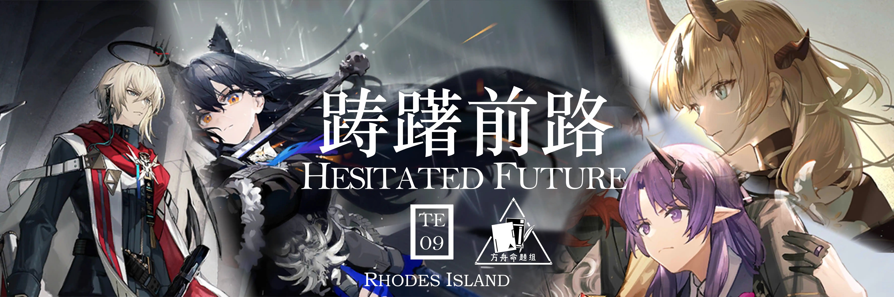
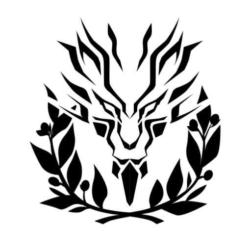
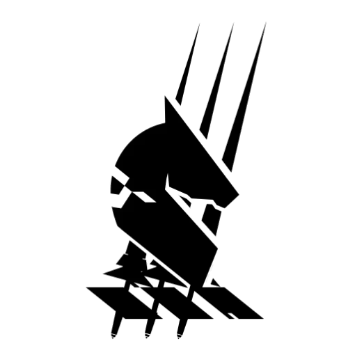
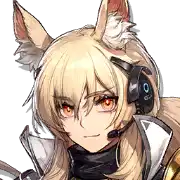
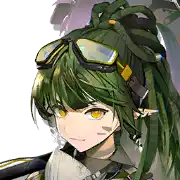
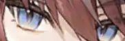
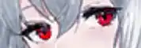
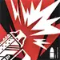
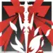
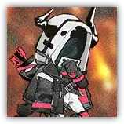

 {.centering}

“圣徒”这个称号既不能使人提升实力，也没有向我揭示任何明确的使命。我不明白自己为什么被选择……我必须自己寻找答案。{.centering}

——费德里科·吉亚洛{.aright}

<!-- more -->

**【1】截止至“探索者的银凇止境”推出前，游戏内一共实装了15名干员的异格形态。请问按照关系网对干员的分类，以下哪一阵营不包含任何干员的异格形态？**

|  |  |  |  |
| :---: | :---: | :---: | :---: |
| A | B | C | D |

**【2】首个异格干员“炎狱炎熔”是在2021年的新年Side Story“画中人”中实装的，距今大约两年半。对以下异格干员按照实装顺序排序，正确的一项是**

|  |  |  |  |
| :---: | :---: | :---: | :---: |
| ①. | ②. | ③. | ④. |

A. ③①④②	B. ③②①④

C. ①③②④	D. ①③④②

**【3】目前也有一部分异格干员拥有了时装。以下图片的截取部分中，不属于干员异格形态的时装的一项是**

|  |  |  |  |
| :---: | :---: | :---: | :---: |
| A | B | C | D |

**【4】异格干员的天赋通常会结合其异格前的设定进行设计。以下关于异格干员天赋的说法，不正确的一项是**

A. 由于子职业的特性需要，归溟幽灵鲨和火龙S黑角在精英0阶段就可以激活天赋

B. 百炼嘉维尔的第一天赋可以使其攻击力和最大生命值提升，当其阻挡敌人时，数值进一步提升

C. “德克萨斯传统”的效果不需要在被动技能持续期间内触发，即使技能时间已经结束，仍可以触发该天赋的效果

D. “受选之人”所触发的额外攻击效果不会消耗技能期间的弹药数目

**【5】在焰影苇草实装之后，游戏内取消了对干员异格任务等奖励，这也预示着今后将会出现越来越多的异格干员。关于焰影苇草实装之前的异格奖励，说法错误的一项是**

A. 如果在异格干员实装之前，已经购买了该干员的时装，则会收到时装自选凭证

B. 异格干员和其本体的信赖值互相连通，且至今该规则仍然生效

C. 只需要拥有干员本体或者其异格形态之中的任意一个，就可以开启干员的异格任务，不过只能完成其中一边的任务

D. 干员异格任务会返还包括芯片、技巧概要、龙门币、作战记录、精英化所需材料在内的养成资源

**【6】异格干员的技能通常也会结合异格前的状态，以及剧情设定进行设计。以下4组技能中，同组技能不属于同一干员异格前后的一项是**

|  |  |  |  |
| :---: | :---: | :---: | :---: |
|  |  |  |  |
| A | B | C | D |

**【7】活动中的剧情通常揭示了干员异格的原因。以下关于异格干员的剧情描述，说法不正确的一项是**

A. 苇草在塔拉王城的遗址中认清了自己的使命，她并不是爱布拉娜的影子，而是人们理想中“领袖”的影子

B. 格雷伊在“唤醒”来袭时展现出了直面挑战的勇气，他深知恐惧源于未知，而可以被分析的源石技艺造物并不值得恐惧

C. 德克萨斯的父亲谋杀了她的爷爷，掌管了家族大权。德克萨斯对这样的生活感到厌倦，在纵火烧掉了自家之后就去了龙门

D. 玛嘉烈认为，所谓骑士，就是拯救这片大地的崇高者。她被血骑士为感染者而战的精神所打动，并主动放弃前往冠军墙展厅

**【8】芙蓉和炎熔这对姐妹目前都已经有了异格形态。以下关于她们的相关细节，说法中不正确的是**

A. 芙蓉渐渐学会了用温和的方式劝诫病人，也承担起了相当一部分的专业工作

B. 芙蓉也认识到了病痛对心理的影响，她认为只有当病人走出因疾病导致的阴影后，治疗才算完成

C. 炎熔和炎狱炎熔的信物都是包含了特殊花纹的匕首套，但炎狱炎熔给博士的匕首套略新，是她亲手做的

D. 仔细观察炎熔的攻击动作，可以发现她虽然携带了一本书，但实际还是将匕首作为施法道具

**【9】黑角和夜刀是游戏中首次异格的二星干员，游戏中很多细节也似乎在暗示这是一对cp. 以下关于他们的说法中，不正确的是**

A. 由于异格之后是和《怪物猎人》的联动干员，因此不会在关系网中显示出异格之后的头像

B. 麒麟X夜刀在发动第三技能时，具有晕眩、冻结和沉睡免疫，但不能阻挡敌人

C. 火龙S黑角的第一天赋和其他武者的相似，都是在损失生命值之后提升攻击速度和防御力

D. 夜刀虽然职业是先锋，但没有回复费用的手段，天赋则是减少自身再部署时间，看上去有点像处决者

**【10】由于攻击方式和特性相似，浮士德和锈锤战士也被戏称为敌方boss的异格。关于他们，以下说法不正确一项的是**

|  |  
| :---: | :---: |
| 浮士德 | 锈锤战士 |

A. 二者都具有沉默、晕眩、沉睡、冻结抗性

B. 二者都无法被阻挡且登场后一段时间内无敌

C. 浮士德的紫色特殊弩箭造成的是物理伤害，而锈锤战士的则是法术伤害

D. 目前只有在“水月与深蓝之树”的“误入奇境”里才可能遇见锈锤战士

{.image-left-float style="max-width: 20%;"}

*扫一扫二维码查看本期答案*

[点我也可以哟ヾ(≧▽≦*)o](https://www.wjx.cn/vm/wFUMNTr.aspx)<eod />

<FakeAds />
