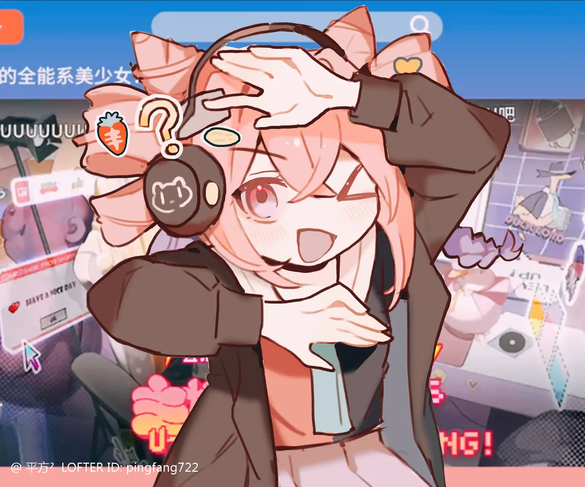

喜欢自己，喜欢不随波逐流的感觉——wonderful U{.textkai}

<!-- more -->

“我跟你说啊，我以前做过很多工作哦！什么导游啊，主持人啊……这些都不在话下，我不仅口才好，而且游戏什么的都打得很不错哦！就算最后做直播了也有很多观众喜欢我呢！”

.webp) {.image-right-float style="max-width: 40%;"}

<!-- 尤里卡~ -->

尤里卡对着电脑夸夸其谈，一副神气的样子显示在电脑中央。随后她拿起手机打字，不一会儿，电脑上缓缓划过一条弹幕。

“真的吗？主播真不愧是全能型美少女呢！”

“那是当然！为了还这一屁股债……啊不，为了满足观众们的期待，主播我啊，可是很努力的在尝试新的东西哦！”

她又拿起手机，手指悬在屏幕上快要敲下时，她迟疑了一下，盯着手机直播间里同样愣住的自己……

直播间只有一位叫做“U酱最忠实粉丝”的人在观看，这就是她手机账号。

并不是因为她没有人气……至少现在应该不是，而是她把直播间锁住，真正只有“自己一个人”的直播间。

---

啊，是怎么回事呢？

虽然她做这些的初衷只是为了还清一屁股的债，现在也还清了，为什么还是放不下呢？

天天被要求打一些从来没有玩过的类型的游戏，玩恐怖游戏把自己吓得魂飞魄散的时候就会有人打着安慰的理由给自己送礼物，玩解密游戏把自己搞得焦头烂额的时候也才会有人送礼物……

为了满足观众们的要求，她一直都是守着底线直播。同样是因为底线，她的热度一直被平台压得很惨。

“最忠实的粉丝永远只有自己啊……无论已经知道自己有多大缺陷。”

她昂起头靠在椅子上，嚼着泡泡糖吹出一个粉色泡泡，再将其放在嘴里咬破。

充满少女心的房间也只有电脑屏幕的那块地方被照亮，角落里堆成小山的泡面原本是她打算一个月的口粮，现在有了固定工作以后，这些东西看着犯恶心，但还是忍不住想要泡来吃一碗。

那就吃一碗吧……

她娴熟地放好调料，拿着热水壶往里面注水时，看着冒着气的热水不禁出了神——

“哈喽哈喽！新观众初次见面，老观众一日不见！我是你们的尤……全能型美少女主播！U- official哦！”

 {.image-right-float style="max-width: 40%;"}

<!-- 尤里卡！ -->

看着逐渐上升的人气，她也开始卖力了些：“今天我们还是继续挑战昨天那个恐怖游戏哦！哼哼，今天不会被你们抓拍到被吓到的样子发在网上了，来吧！我已经准备好了！”

微微颤抖的手挪着鼠标点开电脑上那个恐怖的图标，进入游戏时突然响起的恐怖音乐还是把她吓了一跳。

忍着恐惧的心理，她开始操纵游戏角色开始解密……

然而过了半个多小时。

“主播真的蠢，我奶奶来都过了八次了……”

“不敢玩为什么偏要玩呢？硬蹭流量是吧？”

“这种程度的游戏都会被吓到，大概是看早教动画长大的吧？”

…………

诸如此类的弹幕从电脑屏幕前一条条划过，她忍着不看，但恰好会划到她的眼前故意让她看到，甚至有人还教唆其他人散播自己的负面形象……

一条条弹幕就像一根根针扎进她的心，感觉视线逐渐模糊，眼里噙满泪水……

“主播不会是快被吓哭了吧？”

“才没有！我只是困了而已……哈哈哈……”

她感觉自己再也忍不住让泪水流下，只见有人发来一个礼物——她的心理防线彻底被击碎了。

她机械地用手比爱心，边流泪边强颜欢笑……

“感谢……U酱最忠实的粉丝……送出的礼物……谢谢U酱最……”

直播间外的人笑了……直播间里的人也笑了……直播间外的人真笑了，直播间里的人走不出来，便哭了。

她放下手机，赶紧关掉直播间，评论区里骂声一片，她索性直接删掉游戏将电脑关机。

整个房间都暗下来，她摸索着打开台灯，暖色的灯光照在她挂满泪珠的惨白的脸上……

“不玩啦！凭什么我就要玩这种游戏！凭什么啊！”

她倒在床上撒泼，等累了之后躺在床上看着天花板。

“为什么我要这样啊……”

她稳住心态，打开手机切换到大号发了一条“刚才停电，明天继续直播”

已经知道评论区里会出现什么了，于是她赶紧切到小号，开始四处寻找如何提高自己直播人气的办法……

舞蹈区？直播跳舞也会有人看吗？还有直播唱歌的，虽然我跳舞不行但我唱歌也还可以的，去看看……

点进一个高热度主播的直播间，映入眼帘的则是她难以理解的穿衣风格。直……直播都要穿这么少吗？

她看见那个女主播表面斯斯文文的，但是穿的衣服就像是两块单调的布遮住了重点部位。主播还时不时弯下腰，半掩着胸口，眼睛却往摄像头的位置看。

“这绝对是故意的吧！跳舞怎么可能穿这么少？而且从刚才开始她也没唱歌啊？”

但是她直播间里不断有人涌入，争先恐后地送礼物。这位舞蹈主播一边感谢，一边做一些很羞耻的动作。

尤里卡退出了直播间，对于刚才看到的一切都颇为震惊……

原来都喜欢这样的吗？

她想起自己没有这样的衣服，于是自己学着做了一套。穿上时站在镜子前，放下头发，看起来自己确实变了不少，但手还是会忍不住掩在胸口……这个样子根本就不是她。

再加上刚才主播和自己的区别……她低头看了看自己贫瘠的山地，连忙将衣服换了回来。

“不行不行不行！我可是有原则的！我不可能为了流量去干这种事！”

于是她开始搜索如何提高自己直播间人气。

“满足观众？”

但是恐怖游戏和解密游戏她也玩不过来，唱歌的话……她在房间里开着录音唱了自己最喜欢的一首歌的一段，唱完以后再播放。

结果还没放完她就面如死灰地躺下了。

“我大概已经废了吧……”

她想起以前的各种遭遇……多索雷斯，尚蜀，玉门……每次她的工作都伴随着天灾人祸，怀疑是不是自己天生就是多灾多难的命。

内疚和孤独包围住了她，让她蜷缩在床上，不断怀疑自己……

“你真的是个人型天灾啊！尤里卡！”

她把自己埋在枕头里无能狂怒道，但想了一会儿后又深感无力。

难道我尤里卡的尽头就到这里了吗？

她看着直播封面一个个搔首弄姿的主播的样子，心里很不平衡。

于是她打开了自己的直播间。

“咦？看看谁突然开播了？”

“诶？主播没事吧？”

“这不是刚才被吓哭的那个人嘛？又来找虐了？”

“你站的弹幕属实有点……”

她就这样呆呆地出现在屏幕前，突然忘了自己打开直播间是要干什么了，手忙脚乱地捣鼓着桌面。

“等等等……等一下，我不知道为什么突然开了……”

此时一条豪华留言突然亮起。

“主播好可爱啊……”

尤里卡懵了，尴尬地说了几声谢谢，随后又有弹幕发出来，尤里卡跟着念。

“从开播一直看到现在，主播主打的就是一个真实……那股傻劲儿在那些擦边主播身上是看不到的……喂！你说谁傻啊！”

没想到尤里卡无心插柳般的一句让直播间人气莫名其妙地增高了，看着逐渐逐渐增高的人气，她一时半会儿也不知道如何是好，连忙开始唱歌，——虽然不好听，直播间氛围倒也变得乐融融。

她就这样疑惑地播了几个小时，最后下播的时候还不清楚今天到底是怎么了……

结果第二天一看，视频网站上出现了自己一脸茫然表情的那个封面，标题是“U酱的名场面合集”。

她怀着好奇心点进去一看，就连自己也绷不住了。

“啊！我昨天看起来真的这么傻吗？”

一翻评论区，里面一堆人在对着她发癫……

看来互联网还是太神奇了……

很多人莫名其妙火了，很多人莫名其妙被雪藏。

“啊！”

手指被热水烫到的时候她才回过神，放下水壶时把烫到的手指放在嘴里，看着桌上热气腾腾的泡面，她心情十分复杂。

“如果什么都不会的话，只有一味地满足观众的需求才能有流量吗……”

尤里卡盘腿坐在椅子上，突然闲下来的日子让她还有点不适应，每天不是宅在宿舍里打游戏，就是出门在罗德岛食堂打包东西带回来吃，导致现在很少有人知道她已经成为了罗德岛干员。

她也不想让太多人知道，万一有黑粉之类的话……她可能会尴尬得门都不出。

到了罗德岛，她没有像其他干员一样上过战场，而是留在罗德岛里处理线索啊货物这类的工作，她偶尔也会偷偷跑到甲板上看那些凯旋归来的干员们，每当看见伤痕累累的人回来时她才会感觉自己能分配到这种工作真是万幸了。

是不是太没用了啊……

尤里卡决定去甲板上走走，也还好，今天全部休假，甲板上几乎没人，她一蹦一跳地趴在栏杆上。

“啊！！！”

她对着广袤无垠的大地喊道。

“新观众初次见面！老观众一日不见！”

她笑了起来，又担惊受怕地看了眼身后。

“我是全能型美少女主播！U……”

她顿了顿，思考片刻。

---

“我就是！独一无二的！不被任何人左右的！人美歌甜的！尤里卡啊！！！”

她大呼一声，感觉心里敞亮了许多，下定了决心，一定要做好自己，总会有真爱粉的。

“呼！感觉今天充满干劲了呢！去直播吧！消失了一个月的人气主播U- official就要回归啦！”

她哼着小曲大踏步走回去，已经决定用自己的方式让更多的观众记住自己！直播不是为了求财，而是为了……

为了什么她也不清楚，反正她就是喜欢直播，喜欢和粉丝互动的感觉，喜欢沉浸在自己的小世界里和他人一起交流。

她喜欢自己，喜欢不随波逐流的感觉。<eod />

（责任编辑：广英和荣耀；网页排版：武乙凌薇；绘图1：yooooz；绘图2：平方²）

<FakeAds />