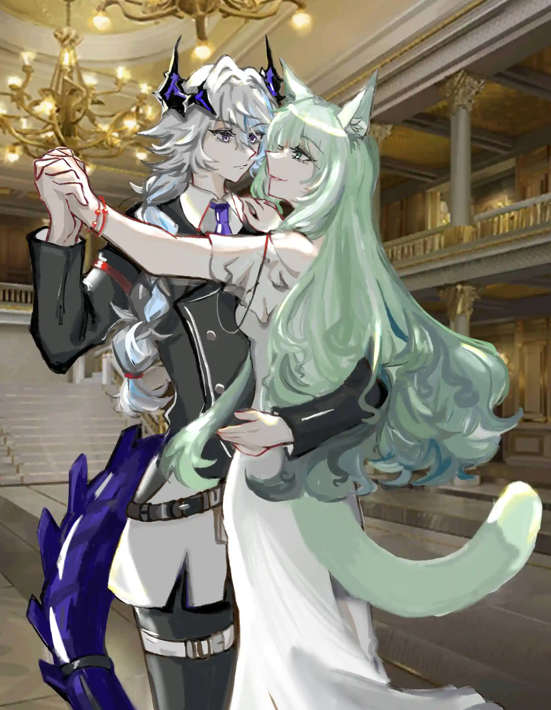
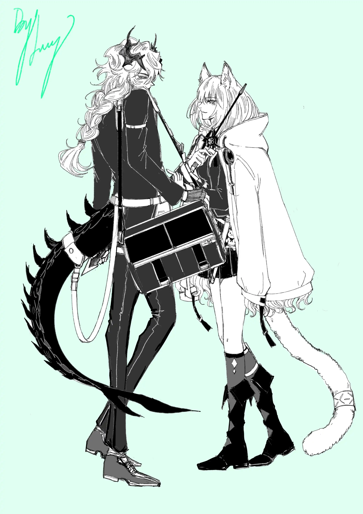

骄傲地回忆自己辉煌的过往，用磨碎殆尽的舞鞋，舞动铅一般重的灵魂{.textkai}

<!-- more -->

「我实在不能跳。你们都有轻快的舞鞋；我只有一个铅一样重的灵魂，把我的身体紧紧地钉在地上，使我的脚步不能移动。」

舞台落下帷幕，她跟着大家一同站起身鼓掌，脸上洋溢着幸福的笑容。只不过此时此刻，她是真心的。

她并不讨厌礼拜天。最近每个礼拜天的下午，她都会前往街角那家剧院欣赏戏剧。唯有这个时候，所有一切都被她抛之脑后，她只是再普通不过的维多利亚人。她得花足够多的时间来冲淡部分人的记忆，使他们忘却她之前的容貌、姓名、一举一动。她坐在椅子上调整坐姿，倾斜身躯，倚靠在柔软舒适的椅背，双腿保持交叠。她之前的身份是不会用这么不雅的姿势坐着看戏剧的，但阿赫茉妮不同。深池的阿赫茉妮是不会如此过分拘谨地坐在椅子上，她既不是贵族，也不是军官，仅仅只是一名谋臣。那么所谓的繁文缛节又与她何干？她应当将其全部抛之脑后，没有演员会在下部戏剧依旧保持之前饰演角色的模样来进行演绎。情报官正在不远处的位置注视着她，她知道，但她从不介意。间谍与情报官就是这样的关系，相互试探，却又不得不依靠彼此来确认自我，审视“自我”。

人们开始陆续离席，唯有她一动不动，依旧坐在原地。菲林的眼是充满魅惑的，当她的视线停留在某人身上时，这个人一定会为之倾倒。阿赫茉妮转动翠绿的眼珠，她的长裙因缺少光亮显得暗淡，耳饰上的宝石却熠熠生辉。情报官干咳两声，示意她也该离开。她提起裙摆离开座位，只不过与他人不同，她顺着台阶向下行走，喃喃自语。她是报幕人，亦是演员，这场剧才刚刚开始。菲林的脚步轻快优雅，叫人不会怀疑她是否能踮着脚踩过一排高脚杯来到宴会。阿赫茉妮停在舞台前，目光落在唯一的观众身上，“来吧，我们没必要这么紧张。你喜欢跳舞吗？”

这乏善可陈的被监视的生活她早已习惯，不讨厌并不代表她会抛弃“活着”。她依旧会在报刊亭购买每期时尚杂志，每个礼拜天下午来看一场戏剧，偶尔女孩登上舞台，在一片沉寂之中开始她的舞蹈。她在晚宴上从不缺音乐的陪衬，任何风格的舞蹈都能很好地驾驭。然而现在她没有任何配乐，只是简单地迈着步伐。鞋跟敲击地板发出清脆的声响回荡在整个剧院，就像钟摆左右摆动，嗒嗒、嗒嗒。情报官还是第一次站在离舞台如此之近的地方欣赏舞姿，他的目光停留在她的鞋尖，随之一同转动，摇摇晃晃。谁能想到维多利亚皇家近卫学院交际舞会上转瞬即逝的花朵，此时此刻正在他面前毫无顾忌地绽放。他听见女孩轻轻地哼唱，那是今年流行的歌曲，前段时间大街小巷的播放机总是播着这首歌。菲林优雅地转了个圈，从舞台这头到另一边，他突然意识到某些动作重合起来，是刚刚女主演在宴会上与恋人共同跳过的那支舞。

“主角的人选早已尘埃落定

倘若不拿出全力 就会输得很惨哦-♪”

女孩跳着跳着，旋风一样迈步，转着圈跳到台下，来到他的身前。她的手搭上他的肩头，另手搂上情报官的腰肢，她能感受到对方僵硬的身体，随即露出狡黠的笑容。

“阿赫茉妮，你想做什么？”

“不要玷污那双纯洁的眼瞳

你我二人 坦诚相见-♪”

菲林并未回答他，只是自顾自地接着节拍唱下去。她的舞步亦未停歇，灵巧的，宛若云兽。只不过此时此刻她正闭上眼，纯粹地享受这一刻。她既没有带施术单元，身上也没地方隐藏暗器，这点情报官在她出门之后便确认过了。她身上穿着的礼裙是她刚入学时正流行的款式，但这款太过朴素，反而不受贵族小姐们的喜爱。当年她选择的是更为花哨的另一款，在舞会上大放异彩，又因举止得当，舞步优美，深受贵族们青睐。情报官正在犹豫是否要陪她继续玩下去时，已经被女主演带上舞台。她的手指从肩头握向脖颈，情报官迅速抽出挂在腿上的匕首抵在她腰后，女主演完全忽视掉对方不友好的动作，面不改色地调笑，“阁下，只用一只手，会跟不上舞步的。”

 {.image-right-float style="max-width: 50%;"}

呼吸、心跳，这一切都会随着手搭在颈边而改变，人还会下意识做出一些小动作暴露本心。阿赫茉妮只是微垂眼帘，视线在两人之间飘忽不定。她自然地握上他的手，仿若那里没有匕首，与他继续舞蹈，哼唱流行歌曲。

“来吧 就这样抬起脚后跟

光着脚起舞不必在意跳错舞步-♪”

情报官此时此刻才抬起头对上她的视线，观察她那双如无瑕宝玉的眼眸。阿赫茉妮眼中笑意更甚，她的耳饰在舞台聚光灯的照耀下更加刺目，手也从脖颈移向后背，顺着脊骨一路来到腰肢。指掌相握，另手搂住彼此腰部，更快节奏的舞步来了。他们在舞台上轻快地踏步向前，裙摆带起阵阵微风使得它如花般绽开。鼻息交融，女主演身上的香水味道能够清楚地嗅到，这不禁让他想到了凯普莱特家族庭院鲜花的芬芳。菲林在舞步交错之间凑至他的耳畔，“你的心跳很快，害羞了吗？”

他愣了一下，身为情报官总是隐藏自身的瓦伊凡从没想到这点细微的变化也被对方瞧去。心脏在胸腔富有节奏地跳动，扑通、扑通。他望向与平常大相径庭的间谍小姐，一时间不知道要怎么回答对方。谎言在他们面前都会被毫不留情地拆穿，因为他们本就是编织谎话的蜘蛛，不断吐出丝线，缠绕成网捕捉猎物。他的计划被打乱，这种感觉说不上很好，但也算不上太坏。拼图总会有放错位置的时候，好在这个微小的错误并不致命……

真的并不致命吗？

“只是担心会不会踩到你的脚。”

阿赫茉妮听完放声大笑起来，她看上去心情更好了，毕竟她很少会露出这种表情。菲林的手指将他的腰搂得更紧，飞速地随着节拍连转三圈，她的眼瞳猛地收缩，这不是被圈养的云兽会露出的眼神。情报官张嘴想为自己争辩什么，他的唇微微张开，喉咙里一个音节也无法发出。阿赫茉妮，究竟假面之下什么模样才是你的本我？女孩踩着猫步离开他，他们的手依旧相牵，只不过这一次，是她微微躬身行礼。舞曲结束。

{.image-right-float style="max-width: 40%;"}

“下次就不会再用这种身份来见你了。”情报官收回手，翻身跃下舞台用粗壮的尾巴卷起公文包向外走去。女主演站在台上始终注视着他的背影，“是吗？那我可要好好地期待一下了，下次在晚宴上不要被我拉去跳舞时还穿得这么不解风情。”他抿紧唇瓣。为了研究如何成为某些人，他当然读过那些时尚杂志。只不过这种也被下意识地划为拼图的碎片，他在用碎片拼凑一个表象，仅此而已。难道这一块不该放在这里？他抬起胳膊准备确认衣服哪里不妥帖，却嗅到了阿赫茉妮身上的香水味道。

情报官去定了一身衣服，店主是军方的人，同时也为各个贵族定制在晚宴上的礼服。他在一排衣架前仔细观察衣料以及服装款式，以此判定它们的主人究竟是什么身份。店主正有条不紊地用熨斗将衣服熨妥帖，他就像是找点话闲聊，率先开口，“对了，阿赫茉妮小姐也说要给你定做一件衣服，已经做好了，不过她报上来的尺寸意外地合适。我猜就你俩也不可能心平气和地坐在一起拿尺子量吧？”

“……什么时候的事情？”

“上个礼拜天晚上。那天晚上下了好大的雨，阿赫茉妮小姐穿的白长裙。那款式，好几年之前流行的了。我是没想到还有人穿这种款的裙子，不过她穿还挺合适的。她就这样撑伞从雨中来了，跟我说了几个尺寸，穿不穿得上不要紧，只管做就是。对了，衣服的款式也是她选的，阿赫茉妮小姐对时尚潮流还挺在行的。没想到是给你做的。”

“她人呢？”情报官显然有些坐不住，他第一次感觉自己完全被那只菲林戏耍。而后又觉得自己表露出太多感情有些心急，又扭开头不去看店主。店主挑了挑眉，一副看热闹不嫌事大的表情，将熨好的衣服递给他。“来看了一次成衣，觉得很满意，说让我转交给你。去试试呗，她自己都说了尺寸不一定准，谁知道她哪来的尺寸。”

谁知道她哪来的尺寸？情报官当然知道。他们跳舞时手在彼此身上搭了那么久，她的手从颈边到肩头，从后背到腰肢。她的手抚过他的指掌，他的小臂，他的胸膛。她在享受跳舞的同时，将这些情报全部收集，再以另一种形式传递给他。情报官对着镜子，脱掉外套，缓缓解开衬衣纽扣。他审视着镜中的自我，审视着被阿赫茉妮的手抚摸过的每一部分。他保持沉默，将间谍小姐替他定做的衣服换好。尺寸正合适，比他想象中要好太多。情报官没由来地想起阿赫茉妮那天唱的歌，轻声哼两句。

“没错 只有舞者才能以磨损殆尽的舞鞋

骄傲地回忆自己辉煌的过往-♪”<eod />

（责任编辑：瑶濯；网页排版：武乙凌薇；绘图1：铅鸽；绘图2：歆鸢）

<FakeAds />